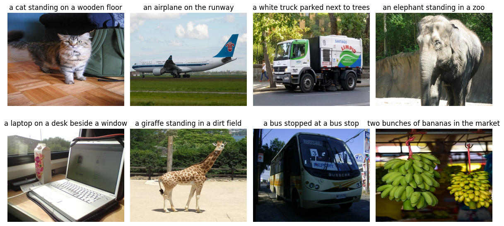
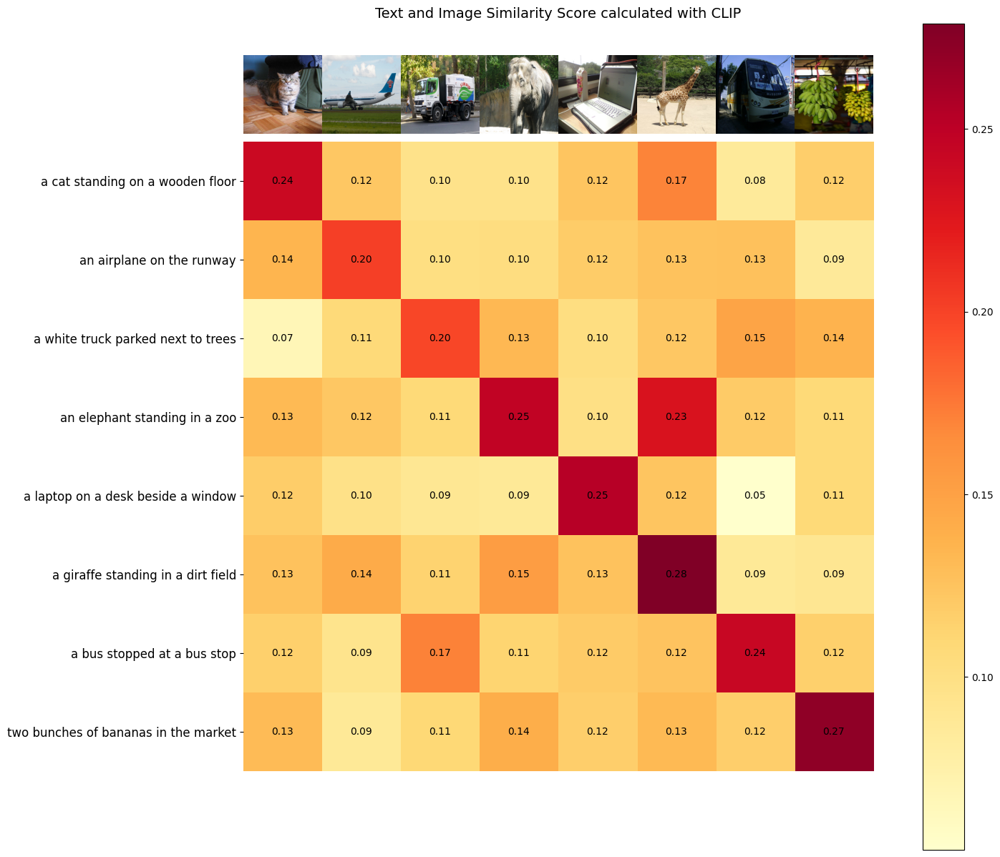

# Interacting with Contrastive Language-Image Pre-Training (CLIP) model on AMD GPU

<span style="font-size:0.7em;">16, Apr 2024 by {hoverxref}`Sean Song<seansong>`. </span>

## Introduction

Contrastive Language-Image Pre-Training (CLIP) is a multimodal deep learning model that bridges vision and natural language. It was introduced in the paper “[Learning Transferrable Visual Models from Natural Language Supervision](https://arxiv.org/abs/2103.00020)” (2021) from OpenAI, and it was trained contrastively on a huge amount (400 million) of web scraped data of image-caption pairs (one of the first models to do this).

During the pre-training phase, CLIP is trained to predict the semantic associations between images and texts within a batch. This involves determining which image-text pairs are most closely related or relevant to each other. This process involves the simultaneous training of an image encoder and a text encoder. The objective is to maximize the cosine similarity between the embeddings of image and text pairs in the batch while minimizing the similarity of embeddings for incorrect pairs. The model achieves this by learning a multi-modal embedding space. A symmetric cross entropy loss is optimized over these similarity scores.


Image source: [Learning Transferable Visual Models From Natural Language Supervision](https://arxiv.org/abs/2103.00020).

In the subsequent sections of the blog, we will leverage the **PyTorch** framework along with **ROCm** to run CLIP models to calculate the similarity between arbitrary image and text inputs.

### Setup

This demo was creating using the following settings. For comprehensive support details, please refer to the [ROCm documentation](https://rocm.docs.amd.com/projects/install-on-linux/en/latest/).

* Hardware & OS:
  * [AMD Instinct GPU](https://www.amd.com/en/products/accelerators/instinct.html)
  * Ubuntu 22.04.3 LTS
* Software:
  * [ROCm 5.7.0+](https://rocm.docs.amd.com/en/latest/)
  * [Pytorch 2.0+](https://pytorch.org/)

## Similarity calculation between arbitrary image and text inputs

### Step 1: Getting started

First, let's confirm the availability of the GPU.

```python
!rocm-smi --showproductname
```

```bash
    ========================= ROCm System Management Interface =========================
    =================================== Product Info ===================================
    GPU[0]      : Card series:      AMD INSTINCT MI250 (MCM) OAM AC MBA
    GPU[0]      : Card model:       0x0b0c
    GPU[0]      : Card vendor:      Advanced Micro Devices, Inc. [AMD/ATI]
    GPU[0]      : Card SKU:         D65209
    ====================================================================================
    =============================== End of ROCm SMI Log ================================
```

Next, install CLIP and the required libraries.

```python
! pip install git+https://github.com/openai/CLIP.git ftfy regex tqdm matplotlib
```

### Step 2: Load the model

```python
import torch
import clip
import numpy as np

# in this blog we will load ViT-L/14@336px clip model
model, preprocess = clip.load("ViT-L/14@336px")
model.cuda().eval()
# check the model architecture
print(model)
# check the preprocessor
print(preprocess)
```

Output:

```text
    CLIP(
  (visual): VisionTransformer(
    (conv1): Conv2d(3, 1024, kernel_size=(14, 14), stride=(14, 14), bias=False)
    (ln_pre): LayerNorm((1024,), eps=1e-05, elementwise_affine=True)
    (transformer): Transformer(
      (resblocks): Sequential(
        (0): ResidualAttentionBlock(
          (attn): MultiheadAttention(
            (out_proj): NonDynamicallyQuantizableLinear(in_features=1024, out_features=1024, bias=True)
          )
          (ln_1): LayerNorm((1024,), eps=1e-05, elementwise_affine=True)
          (mlp): Sequential(
            (c_fc): Linear(in_features=1024, out_features=4096, bias=True)
            (gelu): QuickGELU()
            (c_proj): Linear(in_features=4096, out_features=1024, bias=True)
          )
          (ln_2): LayerNorm((1024,), eps=1e-05, elementwise_affine=True)
        )
        (1): ResidualAttentionBlock(
          (attn): MultiheadAttention(
            (out_proj): NonDynamicallyQuantizableLinear(in_features=1024, out_features=1024, bias=True)
          )
          (ln_1): LayerNorm((1024,), eps=1e-05, elementwise_affine=True)
          (mlp): Sequential(
            (c_fc): Linear(in_features=1024, out_features=4096, bias=True)
            (gelu): QuickGELU()
            (c_proj): Linear(in_features=4096, out_features=1024, bias=True)
          )
          (ln_2): LayerNorm((1024,), eps=1e-05, elementwise_affine=True)
        )
        ...
        (23): ResidualAttentionBlock(
          (attn): MultiheadAttention(
            (out_proj): NonDynamicallyQuantizableLinear(in_features=1024, out_features=1024, bias=True)
          )
          (ln_1): LayerNorm((1024,), eps=1e-05, elementwise_affine=True)
          (mlp): Sequential(
            (c_fc): Linear(in_features=1024, out_features=4096, bias=True)
            (gelu): QuickGELU()
            (c_proj): Linear(in_features=4096, out_features=1024, bias=True)
          )
          (ln_2): LayerNorm((1024,), eps=1e-05, elementwise_affine=True)
        )
      )
    )
    (ln_post): LayerNorm((1024,), eps=1e-05, elementwise_affine=True)
  )
  (transformer): Transformer(
    (resblocks): Sequential(
      (0): ResidualAttentionBlock(
        (attn): MultiheadAttention(
          (out_proj): NonDynamicallyQuantizableLinear(in_features=768, out_features=768, bias=True)
        )
        (ln_1): LayerNorm((768,), eps=1e-05, elementwise_affine=True)
        (mlp): Sequential(
          (c_fc): Linear(in_features=768, out_features=3072, bias=True)
          (gelu): QuickGELU()
          (c_proj): Linear(in_features=3072, out_features=768, bias=True)
        )
        (ln_2): LayerNorm((768,), eps=1e-05, elementwise_affine=True)
      )
      (1): ResidualAttentionBlock(
        (attn): MultiheadAttention(
          (out_proj): NonDynamicallyQuantizableLinear(in_features=768, out_features=768, bias=True)
        )
        (ln_1): LayerNorm((768,), eps=1e-05, elementwise_affine=True)
        (mlp): Sequential(
          (c_fc): Linear(in_features=768, out_features=3072, bias=True)
          (gelu): QuickGELU()
          (c_proj): Linear(in_features=3072, out_features=768, bias=True)
        )
        (ln_2): LayerNorm((768,), eps=1e-05, elementwise_affine=True)
      )
      ...
      (11): ResidualAttentionBlock(
        (attn): MultiheadAttention(
          (out_proj): NonDynamicallyQuantizableLinear(in_features=768, out_features=768, bias=True)
        )
        (ln_1): LayerNorm((768,), eps=1e-05, elementwise_affine=True)
        (mlp): Sequential(
          (c_fc): Linear(in_features=768, out_features=3072, bias=True)
          (gelu): QuickGELU()
          (c_proj): Linear(in_features=3072, out_features=768, bias=True)
        )
        (ln_2): LayerNorm((768,), eps=1e-05, elementwise_affine=True)
      )
    )
  )
  (token_embedding): Embedding(49408, 768)
  (ln_final): LayerNorm((768,), eps=1e-05, elementwise_affine=True)
)


Compose(
    Resize(size=336, interpolation=bicubic, max_size=None, antialias=warn)
    CenterCrop(size=(336, 336))
    <function _convert_image_to_rgb at 0x7f8616295630>
    ToTensor()
    Normalize(mean=(0.48145466, 0.4578275, 0.40821073), std=(0.26862954, 0.26130258, 0.27577711))
)
```

### Step 3: Check the images and text

We feed 8 sample images from the [COCO dataset](https://cocodataset.org/#home) and their textual descriptions to the model and compare the similarity between the corresponding features.

```python
import os
import matplotlib.pyplot as plt
from PIL import Image

# use images from COCO dataset and their textual descriptions
image_urls  = [
    "http://farm1.staticflickr.com/6/8378612_34ab6787ae_z.jpg",
    "http://farm9.staticflickr.com/8456/8033451486_aa38ee006c_z.jpg",
    "http://farm9.staticflickr.com/8344/8221561363_a6042ba9e0_z.jpg",
    "http://farm5.staticflickr.com/4147/5210232105_b22d909ab7_z.jpg",
    "http://farm4.staticflickr.com/3098/2852057907_29f1f35ff7_z.jpg",
    "http://farm4.staticflickr.com/3324/3289158186_155a301760_z.jpg",
    "http://farm4.staticflickr.com/3718/9148767840_a30c2c7dcb_z.jpg",
    "http://farm9.staticflickr.com/8030/7989105762_4ef9e7a03c_z.jpg"
]

text_descriptions = [
    "a cat standing on a wooden floor",
    "an airplane on the runway",
    "a white truck parked next to trees",
    "an elephant standing in a zoo",
    "a laptop on a desk beside a window",
    "a giraffe standing in a dirt field",
    "a bus stopped at a bus stop",
    "two bunches of bananas in the market"
]
```

Display the eight images alongside their respective textual descriptions.

```python
import requests
from io import BytesIO

images_for_display=[]
images=[]

# Create a new figure
plt.figure(figsize=(12, 6))
size = (400, 320)
# Loop through each URL and plot the image in a subplot
for i, url1 in enumerate(image_urls):
    # # Get image from URL
    response = requests.get(url1)
    image = Image.open(BytesIO(response.content))
    image = image.resize(size)

    # Add subplot (2 rows, 4 columns, index i+1)
    plt.subplot(2, 4, i + 1)

    # Plot image
    plt.imshow(image)
    plt.axis('off')  # Turn off axes labels

    # Add a title (optional)
    plt.title(f'{text_descriptions[i]}')

    images_for_display.append(image)
    images.append(preprocess(image))

# Adjust layout to prevent overlap
plt.tight_layout()

# Show plot
plt.show()
```



### Step 4: Generate features

Next, we prepare the image and text inputs and proceed to execute the forward pass of the model. This step results in the extraction of the respective image and text features.

```python
image_inputs = torch.tensor(np.stack(images)).cuda()
text_tokens = clip.tokenize(["It is " + text for text in text_descriptions]).cuda()

with torch.no_grad():
    image_features = model.encode_image(image_inputs).float()
    text_features = model.encode_text(text_tokens).float()
```

### Step 5: Calculate similarity score between text and images

We normalize the features and calculate the dot product of each pair.

```python
image_features /= image_features.norm(dim=-1, keepdim=True)
text_features /= text_features.norm(dim=-1, keepdim=True)
similarity_score = text_features.cpu().numpy() @ image_features.cpu().numpy().T
```

### Step 6: Visualize the similarity between text and images

```python
def plot_similarity(text_descriptions, similarity_score, images_for_display):
    count = len(text_descriptions)
    fig, ax = plt.subplots(figsize=(18, 15))
    im = ax.imshow(similarity_score, cmap=plt.cm.YlOrRd)
    plt.colorbar(im, ax=ax)

    # y-axis ticks: text descriptions
    ax.set_yticks(np.arange(count))
    ax.set_yticklabels(text_descriptions, fontsize=12)
    ax.set_xticklabels([])
    ax.xaxis.set_visible(False) 

    for i, image in enumerate(images_for_display):
        ax.imshow(image, extent=(i - 0.5, i + 0.5, -1.6, -0.6), origin="lower")
        

    for x in range(similarity_score.shape[1]):
        for y in range(similarity_score.shape[0]):
            ax.text(x, y, f"{similarity_score[y, x]:.2f}", ha="center", va="center", size=10)

    ax.spines[["left", "top", "right", "bottom"]].set_visible(False)

    # Setting limits for the x and y axes
    ax.set_xlim([-0.5, count - 0.5])
    ax.set_ylim([count + 0.5, -2])

    # Adding title to the plot
    ax.set_title("Text and Image Similarity Score calculated with CLIP", size=14)

    plt.show()

plot_similarity(text_descriptions, similarity_score, images_for_display)
```



As outlined in the paper, CLIP aims to maximize the similarity between the embeddings of image and text pairs within a batch, while simultaneously minimize the similarity of embeddings for incorrect pairs. In the results, it's observed that the cells along the diagonal line exhibit the highest values in their respective columns and rows.

## Disclaimers

Third-party content is licensed to you directly by the third party that owns the content and is not licensed to you by AMD. ALL LINKED THIRD-PARTY CONTENT IS PROVIDED “AS IS” WITHOUT A WARRANTY OF ANY KIND. USE OF SUCH THIRD-PARTY CONTENT IS DONE AT YOUR SOLE DISCRETION AND UNDER NO CIRCUMSTANCES WILL AMD BE LIABLE TO YOU FOR ANY THIRD-PARTY CONTENT. YOU ASSUME ALL RISK AND ARE SOLELY RESPONSIBLE FOR ANY DAMAGES THAT MAY ARISE FROM YOUR USE OF THIRD-PARTY CONTENT.
