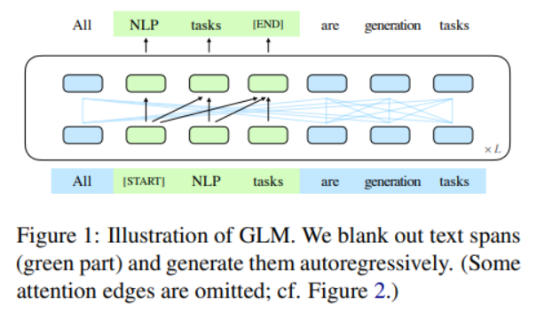
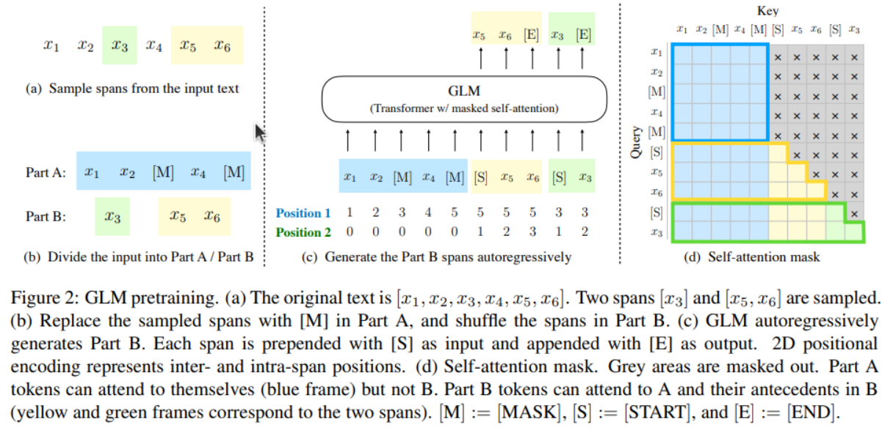

# Using the ChatGLM-6B bilingual language model with AMD GPUs

ChatGLM-6B is an open bilingual (Chinese-English) language model with 6.2 billion parameters. It's
optimized for Chinese conversation based on General Language Model (GLM) architecture. GLM is a
pretraining framework that seeks to combine the strengths of autoencoder models (like BERT) and
autoregressive models (like GPT). The GLM framework randomly blanks out continuous spans of
tokens from the input text (autoencoding methodology) and trains the model to sequentially
reconstruct the spans (autoregressive pretraining methodology).

ChatGLM-6B is trained on 1 trillion tokens, with a mixture of Chinese and English content. The exact
proportion of English to Chinese in the training data may vary depending on the specific version of the
model. Nevertheless, the [authors of ChatGLM](https://huggingface.co/THUDM/chatglm-6b) state that it is
optimized specifically for question-answering and dialog in Chinese. Because of the relatively small
number of parameters, you can try it out locally on consumer-grade graphics cards. However, for
better latency and throughput in production, we recommend deploying this model on higher
performant graphic cards.

The following image shows (at a high level) how ChatGLM is trained based on autoregressive
pretraining.



The following image shows the GLM architecture in more detail, including how sampled text spans are shuffled and masked. For more information on this, refer to
[GLM: General Language Model Pretraining with Autoregressive Blank Infilling](https://arxiv.org/abs/2103.10360).



In this blog, we'll demonstrate how ChatGLM-6B can work out-of-the-box on AMD GPUs with ROCm.

## Prerequisites

To follow along with this blog, you must have the following software:

* [ROCm](https://rocm.docs.amd.com/projects/install-on-linux/en/latest/tutorial/quick-start.html)
* [PyTorch](https://rocm.docs.amd.com/projects/install-on-linux/en/latest/how-to/3rd-party/pytorch-install.html)
* Linux OS

For a list of supported GPUs and OS, please refer to [this page](https://rocm.docs.amd.com/projects/install-on-linux/en/latest/reference/system-requirements.html). For convenience and stability, we recommend you to directly pull and run the rocm/pytorch Docker in your Linux system with the following code:

```sh
docker run -it --ipc=host --network=host --device=/dev/kfd --device=/dev/dri \
           --group-add video --cap-add=SYS_PTRACE --security-opt seccomp=unconfined \
           --name=olmo rocm/pytorch:rocm6.0_ubuntu20.04_py3.9_pytorch_2.1.1 /bin/bash
```

Let's quickly check our hardware and make sure that the system recognizes our GPU:

``` sh
! rocm-smi --showproductname
```

``` sh
================= ROCm System Management Interface ================
========================= Product Info ============================
GPU[0] : Card series: Instinct MI210
GPU[0] : Card model: 0x0c34
GPU[0] : Card vendor: Advanced Micro Devices, Inc. [AMD/ATI]
GPU[0] : Card SKU: D67301
===================================================================
===================== End of ROCm SMI Log =========================
```

Make sure PyTorch also recognizes the GPU:

``` python
import torch
print(f"number of GPUs: {torch.cuda.device_count()}")
print([torch.cuda.get_device_name(i) for i in range(torch.cuda.device_count())])
```

``` text
number of GPUs: 1
['AMD Radeon Graphics']
```

## Libraries

Before you begin, make sure you have all the necessary libraries installed:

``` python
!pip install -q transformers sentencepiece
```

Next, import the modules you'll need for this blog:

```python
import time
from transformers import AutoTokenizer, AutoModel
```

## Loading the model

Let's load the model and its tokenizer. We can use ChatGLM with Hugging Face’s transformer.

```python
start_time = time.time()
tokenizer = AutoTokenizer.from_pretrained("THUDM/chatglm3-6b", trust_remote_code=True)
model = AutoModel.from_pretrained("THUDM/chatglm3-6b", trust_remote_code=True).half().cuda()
print(f"Loaded in {time.time() - start_time: .2f} seconds")
print(model)
```

```text
Loading checkpoint shards: 100%|██████████| 7/7 [00:05<00:00,  1.37it/s]
Loaded in  6.74 seconds
ChatGLMForConditionalGeneration(
  (transformer): ChatGLMModel(
    (embedding): Embedding(
      (word_embeddings): Embedding(65024, 4096)
    )
    (rotary_pos_emb): RotaryEmbedding()
    (encoder): GLMTransformer(
      (layers): ModuleList(
        (0-27): 28 x GLMBlock(
          (input_layernorm): RMSNorm()
          (self_attention): SelfAttention(
            (query_key_value): Linear(in_features=4096, out_features=4608, bias=True)
            (core_attention): CoreAttention(
              (attention_dropout): Dropout(p=0.0, inplace=False)
            )
            (dense): Linear(in_features=4096, out_features=4096, bias=False)
          )
          (post_attention_layernorm): RMSNorm()
          (mlp): MLP(
            (dense_h_to_4h): Linear(in_features=4096, out_features=27392, bias=False)
            (dense_4h_to_h): Linear(in_features=13696, out_features=4096, bias=False)
          )
        )
      )
      (final_layernorm): RMSNorm()
    )
    (output_layer): Linear(in_features=4096, out_features=65024, bias=False)
  )
)
```

## Running inference

Let's create a function that takes in two inputs, one in English and one in Chinese, then generates the
corresponding output in both languages. We set `do_sample=False` for reproducibility. If you want
more diversity and variability in the response, set this to `True`.

```python
def run_inference(input_en, input_cn):
    start_time = time.time()
    input_en += " .Provide answer in English"
    input_cn += " 请提供答案，并使用中文语言"
    response, history = model.chat(tokenizer, input_en, history = [], do_sample=False) # setting do_sample to False for reproducibility
    print(f"Generated in {time.time() - start_time: .2f} seconds")
    print(response)
    print()

    response, history = model.chat(tokenizer, input_cn, history = [], do_sample=False)
    print(f"Generated in {time.time() - start_time: .2f} seconds")
    print(response)
```

We're now ready to run inference and have some fun with ChatGLM-6B! We'll be testing the model's
ability on general Q&A, coding-programming, and summarization. We'll do this in both Chinese and
English.

### General Q&A

```python
input_en = "What is ChatGLM? What are some similarities and differences between ChatGLM and ChatGPT?"
input_cn = "什么是ChatGLM？ChatGLM和ChatGPT之间有哪些相似和不同之处？"
run_inference(input_en, input_cn)
```

Output:

```text
Generated in  11.66 seconds
ChatGLM3-6B is an artificial intelligence assistant developed based on the language model GLM2 jointly trained by Tsinghua University KEG Lab and Zhipu AI Company in 2023. The main function of ChatGLM3-6B is to provide appropriate answers and support for users' questions and requirements.

ChatGPT is an artificial intelligence chatbot program launched by OpenAI in November 2022. The program is based on a large language model GPT-3.5, trained with Instruction Tuning and Reinforcement Learning with Human Feedback (RLHF).

Similarities between ChatGLM3-6B and ChatGPT:

1. Both are AI assistants based on large language models, and can provide appropriate answers and support for users' questions and requirements.

2. Both are developed based on open source technology, and can be integrated with other applications and systems to provide users with more interesting functions and services.

Differences between ChatGLM3-6B and ChatGPT:

1. Development background: ChatGLM3-6B was developed based on the language model GLM2 jointly trained by Tsinghua University KEG Lab and Zhipu AI Company, while ChatGPT was developed by OpenAI based on the language model GPT-3.5.

2. Training method: ChatGLM3-6B uses a mixed reinforcement learning with human feedback (RLHF) method, while ChatGPT uses an instruction tuning and reinforcement learning with human feedback (RLHF) method.

3. Application scenario: ChatGLM3-6B is mainly used to provide appropriate answers and support for users' questions and requirements, while ChatGPT is more interested in providing interesting functions and services for users to experience.

4. Development time: ChatGLM3-6B was developed in 2023, while ChatGPT was developed in 2022.

Generated in  20.13 seconds
ChatGLM 是一个基于语言模型的人工智能助手，由清华大学 KEG 实验室和智谱 AI 公司于 2023 年共同训练的语言模型 GLM-130B 开发。ChatGLM 的任务是针对用户的问题和要求提供适当的答复和支持。

ChatGPT 是由 OpenAI 于 2022 年 11 月推出的一个人工智能聊天机器人程序，该程序基于大型语言模型 GPT-3.5，使用指令微调（Instruction Tuning）和基于人类反馈的强化学习技术（RLHF）训练而成。

ChatGLM 和 ChatGPT 之间的相似之处包括：

1. 都是基于语言模型的人工智能助手。

2. 都使用深度学习技术训练模型。

3. 都拥有强大的语言理解能力和对话能力。

不同之处包括：

1. ChatGLM 是基于 GLM-130B 模型开发的，而 ChatGPT 是基于 GPT-3.5 模型开发的。

2. ChatGLM 的任务是针对用户的问题和要求提供适当的答复和支持，而 ChatGPT 的任务是针对用户的问题和要求提供适当的答复和支持，以及完成各种任务。

3. ChatGLM 是单语种的，而 ChatGPT 是多语种的，能够处理多种语言的对话。

4. ChatGLM 的训练数据是中文语料库，而 ChatGPT 的训练数据是英文语料库和人类反馈数据。

5. ChatGLM 的发布时间是 2023 年，而 ChatGPT 的发布时间是 2022 年 11 月。
```

Let's ask the model a question on recent developments in NLP:

```python
input_en = "Explain the recent developments in natural language processing"
input_cn = "解释自然语言处理领域的最近发展。"
run_inference(input_en, input_cn)
```

Output:

```text
Generated in  5.98 seconds
Natural language processing (NLP) is a field of artificial intelligence (AI) that focuses on the interaction between computers and human language. In recent years, there have been many developments in NLP that have improved the ability of computers to understand and process human language.

One major development in NLP is the use of deep learning techniques, such as recurrent neural networks (RNNs) and transformer networks, to analyze large amounts of text data. These techniques allow computers to learn from large amounts of data and improve their performance over time.

Another development in NLP is the use of预训练语言模型, such as BERT and GPT, which have been pre-trained on large amounts of text data and can be fine-tuned for specific tasks, such as language translation and text summarization.

Additionally, there has been a growing focus on NLP applications such as language translation, sentiment analysis, and text generation. There has also been a growing interest in NLP for human-computer interaction, such as virtual assistants and chatbots.

Overall, recent developments in NLP have improved the ability of computers to understand and process human language, and have led to many exciting new applications of AI.

Generated in  12.30 seconds
近年来,自然语言处理领域取得了很多进展。其中一些重要的进展包括:

1. 机器翻译:机器翻译技术已经取得了很大的进步,包括神经机器翻译和基于注意力机制的机器翻译。这些技术可以更准确地将一种语言翻译成另一种语言。

2. 文本分类和情感分析:文本分类和情感分析是自然语言处理中的两个重要任务。最近,研究人员使用深度学习技术取得了很好的分类效果和情感分析效果。

3. 问答系统:问答系统是一种智能对话系统,可以根据用户的问题自动回答问题。最近,研究人员使用深度学习技术取得了很好的问答效果,包括基于 Transformer 的预训练语言模型和基于强化学习的问答系统。

4. 语音识别和合成:语音识别和合成技术已经取得了很大的进步,可以更准确地将语音转换为文本,以及将文本转换为语音。这些技术在智能语音助手和虚拟助手等领域得到了广泛应用。

5. 自然语言生成:自然语言生成技术可以自动生成自然语言文本,包括新闻报道、文章、社交媒体帖子等。最近,研究人员使用深度学习技术取得了很好的自然语言生成效果。

自然语言处理领域的最近发展非常迅速,新技术的不断涌现使得机器能够更好地理解、分析和生成自然语言文本。
```

Both responses are able to identify relatively new developments in NLP, such as RNN, BERT,
transformers, and attention architecture.

### Generate code

Let's give ChatGLM a coding task

```python
input_en = "Implement code for binary search in Python"
input_cn = "在Python中实现二分查找的代码"
run_inference(input_en, input_cn)
```

Output:

```text
Generated in  9.72 seconds
Sure! Here's an implementation of the binary search algorithm in Python:

def binary_search(arr, target):
    """
    Perform a binary search on a sorted list to find the index of a target element.

    Parameters:
    arr (list): A sorted list of elements.
    target: The element to search for.

    Returns:
    int: The index of the target element in the list, or -1 if the element is not found.
    """
    left = 0
    right = len(arr) - 1

    while left <= right:
        mid = (left + right) // 2

        if arr[mid] == target:
            return mid
        elif arr[mid] < target:
            left = mid + 1
        else:
            right = mid - 1

    return -1

This implementation takes in two parameters: `arr`, which is a sorted list of elements, and `target`, which is the element we want to search for. It returns the index of the target element in the list, or -1 if the element is not found.

The algorithm works by repeatedly dividing the search interval in half, until the target element is found or the search interval is empty. At each step, it compares the middle element of the interval to the target element. If the middle element is equal to the target, the search is successful and the index of the middle element is returned. If the middle element is less than the target, the search continues on the right half of the interval. If the middle element is greater than the target, the search continues on the left half of the interval.

The time complexity of this algorithm is O(log n), where n is the length of the input list. This makes it much more efficient than linear search for large lists.

Generated in  25.27 seconds
二分查找（Binary Search）是一种在有序数组中查找特定元素的搜索算法。搜索过程从数组的中间元素开始，如果中间元素正好是要查找的元素，则搜索过程结束；如果某一特定元素大于或者小于中间元素，则在数组大于或小于中间元素的那一半中查找，而且跟开始一样从中间元素开始比较。如果在某一步骤数组为空，则代表找不到。

下面是使用 Python 实现二分查找的代码：

def binary_search(arr, target):
    """
    使用二分查找在有序数组 arr 中查找元素 target
    :param arr: 有序数组
    :param target: 要查找的元素
    :return: 元素在数组中的索引，如果找不到则返回 -1
    """
    low, high = 0, len(arr) - 1

    while low <= high:
        mid = (low + high) // 2
        if arr[mid] == target:
            return mid
        elif arr[mid] < target:
            low = mid + 1
        else:
            high = mid - 1

    return -1

# 示例
arr = [1, 2, 3, 4, 5, 6, 7, 8, 9]
target = 5
result = binary_search(arr, target)
if result != -1:
    print(f"找到元素 {target}，索引为 {result}")
else:
    print(f"未找到元素 {target}")

在这个代码示例中，我们定义了一个名为 `binary_search` 的函数，该函数接受一个有序数组 `arr` 和一个要查找的元素 `target`。函数首先定义了两个变量 `low` 和 `high`，分别表示数组的最左端和最右端。然后，在函数的主体中，我们使用一个 `while` 循环来进行二分查找。

在每次循环中，我们计算数组中间元素的索引 `mid`，并将其与目标元素进行比较。如果中间元素等于目标元素，则表示找到目标元素，返回其索引；如果中间元素小于目标元素，则更新 `low` 为 `mid + 1`，表示目标元素在右半部分，从而缩小搜索范围；如果中间元素大于目标元素，则更新 `high` 为 `mid - 1`，表示目标元素在左半部分，从而缩小搜索范围。当 `low` 大于 `high` 时，搜索结束，返回 -1 表示未找到目标元素。

在示例中，我们创建了一个有序数组 `arr` 和一个要查找的目标元素 `target`，然后调用 `binary_search` 函数进行查找。如果找到目标元素，则输出其索引；否则输出未找到元素的消息。
```

We see that both responses are able to accurately implement Python code for binary search.

### Summarize text/paper

Let's ask ChatGLM to summarize a prominent paper
([Attention Is All You Need](https://arxiv.org/abs/1706.03762)) on the attention mechanism and
transformer architecture.

```python
input_en = "Summarize the paper 'Attention Is All You Need'"
input_cn = "总结论文 'Attention Is All You Need'"
run_inference(input_en, input_cn)
```

Output:

```text
Generated in  2.61 seconds
The paper "Attention Is All You Need" proposes a new architecture for neural networks that replaces traditional recurrent neural networks (RNNs) and convolutional neural networks (CNNs) with attention mechanisms. Attention mechanisms allow the network to focus on different parts of the input sequence when processing each element, leading to more efficient and accurate processing. The proposed architecture, called the Transformer, achieves state-of-the-art performance on several natural language processing tasks while having fewer parameters than traditional neural network architectures.

Generated in  8.70 seconds
《Attention Is All You Need》这篇论文的主要内容是提出了一种新的自然语言处理模型，即Transformer模型。Transformer模型采用了一种全新的注意力机制，即自注意力机制，通过将输入序列与自身序列进行多头注意力计算，能够有效地捕捉输入序列中的长距离依赖关系。

在Transformer模型中，自注意力机制的计算过程分为两个步骤：首先是将输入序列通过线性变换生成对应的 Query、Key 和 Value 向量，然后通过计算注意力权重，将这三个向量进行拼接，得到最终的输出向量。在这个过程中，自注意力机制使得每个输入序列都能够参与到模型的计算过程中，从而提高了模型的表达能力和学习能力。

此外，Transformer模型还采用了一种编码器-解码器的结构，通过使用编码器来捕捉输入序列中的全局信息，然后使用解码器来生成输出序列。这种结构使得模型能够更好地处理长文本输入，并取得了在机器翻译等自然语言处理任务中的优秀表现。

总之，Transformer模型通过采用自注意力机制和编码器-解码器结构，实现了在自然语言处理任务中取得优秀表现的目标，为后续的自然语言处理研究提供了新的思路和方向。
```

The model does a very nice job of summarizing the key points of the paper while maintaining brevity
in both languages.

## Disclaimers

Third-party content is licensed to you directly by the third party that owns the content and is
not licensed to you by AMD. ALL LINKED THIRD-PARTY CONTENT IS PROVIDED “AS IS”
WITHOUT A WARRANTY OF ANY KIND. USE OF SUCH THIRD-PARTY CONTENT IS DONE AT
YOUR SOLE DISCRETION AND UNDER NO CIRCUMSTANCES WILL AMD BE LIABLE TO YOU FOR
ANY THIRD-PARTY CONTENT. YOU ASSUME ALL RISK AND ARE SOLELY RESPONSIBLE FOR ANY
DAMAGES THAT MAY ARISE FROM YOUR USE OF THIRD-PARTY CONTENT.
