# Best practices for competitive inference optimization on AMD Instinct™ MI300X GPUs

Optimizing LLM performance on GPUs is challenging due to diverse model needs, memory constraints, and balancing latency and throughput. This document examines how hardware utilization, memory and communication bandwidth and scaling, contribute to inference performance, detailing optimal configurations for AMD Instinct™ MI300X GPUs.

In this blog we will showcase how:

- The AMD Instinct MI300X often outperforms the NVIDIA H100 in memory-bound scenarios, particularly for tasks with long output sequences or strict generation latency constraints such as Time Per Output Token (TPOT).
- With its high memory capacity, the MI300X can accommodate larger models such as Llama-3.1 405B and DeepSeek v3/R1 while also delivering efficiency for smaller models (≤30B) in TP1 mode, minimizing GPU scaling overhead
- MI300X enables the use of fewer nodes for large models,
 which reduces infrastructure costs and improves system reliability,
 offering a clear advantage in terms of operational efficiency.

## Summary of Contents

- Walkthrough of vLLM Inference on MI300X
- Inference Benchmarks
- Model Specific Performance Analysis & Considerations for Online Serving Latency-vs-Throughput
- Key Takeaways

## Walkthrough of vLLM Inference on MI300X

In this section, developers will get an introduction to inference on MI300X. You will learn about MI300X's relevant architectural advantages, how to access optimized docker containers, and how to stand-up and test your own vLLM inference endpoint.

### 1. LLM Inference Performance Considerations

LLM inference performance varies across phases due to differing
computational demands. In the prefill phase, compute-bound matrix-matrix
multiplications dominate. During the generation phase, matrix-matrix
multiplications are usually bandwidth-limited but also depend heavily on
memory capacity for KV caching. Generation contributes significantly to
end-to-end latency, especially for long output sequences.

Maximizing inference hardware utilization is essential for optimizing
serving costs. Large batch sizes improve arithmetic intensity but
introduce challenges, such as higher token latency and larger KV cache
size, which demand greater HBM capacity. Figure 1 illustrates that at
smaller batch sizes (red region), inference is often bottlenecked by
memory bandwidth. At larger batch sizes (yellow region), the system
becomes more compute-bound.

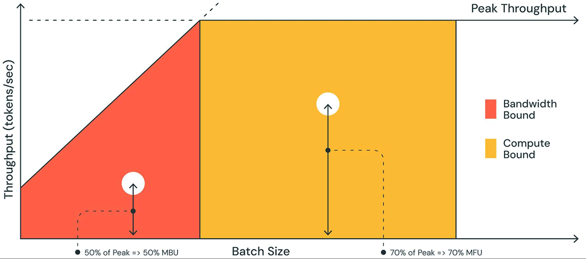
Figure 1:Roofline plot of LLM inference[1]

### 2. MI300X Architectural Advantages for Inference Workloads

The table below, showcases AMD Instinct™ MI300X GPU benefits in terms of HBM capacity and memory bandwidth which are key parameters for efficient LLM serving. However, under various operating conditions like when running key memory bandwidth intensive operations, compute, and communication operations maximum performance delivered may vary.

<table>
<colgroup>
<col style="width: 10%" />
<col style="width: 20%" />
<col style="width: 22%" />
<col style="width: 15%" />
<col style="width: 31%" />
</colgroup>
<thead>
<tr>
<th style="text-align: left;"></th>
<th style="text-align: left;"></th>
<th style="text-align: left;">MI300X</th>
<th style="text-align: left;">H100 SXM</th>
<th style="text-align: left;"><p>MI300X Advantage</p>
<p>(MI300X/ H100)</p></th>
</tr>
</thead>
<tbody>
<tr>
<th style="text-align: left;">Power</th>
<td style="text-align: left;">TDP</td>
<td style="text-align: left;">750W</td>
<td style="text-align: left;">700W</td>
<td style="text-align: left;">1.07x</td>
</tr>
<tr>
<th rowspan="2" style="text-align: left;">Memory</th>
<td style="text-align: left;">HBM Capacity</td>
<td style="text-align: left;">192 GB</td>
<td style="text-align: left;">80 GB</td>
<td style="text-align: left;"><strong>2.40x</strong></td>
</tr>
<tr>
<td style="text-align: left;">HBM Bandwidth</td>
<td style="text-align: left;">5.325 TB/s</td>
<td style="text-align: left;">3.35 TB/s</td>
<td style="text-align: left;"><strong>1.59x</strong></td>
</tr>
</tbody>
</table>

*Endnote: MI300-05A.*

Given the pre-fill and decoding phases exhibit very distinctive
characteristics, here are some high-level guidance to effectively use
MI300X for LLM inference.

- MI300X has higher throughput and lower latency in memory bound
 scenario due to higher HBM bandwidth, typically in the decoding
 phase in low and medium batch size, e.g. from 1 to 64 depending on
 models and sequence length.

- MI300X shows better performance in decoding-heavy use cases, such as
 relatively short input and longer output, e.g. 128 ISL, 2048 OSL.

- MI300X has more HBM memory to load large models such as Llama 3.1
 405B and Deepseekv3 671B in single node and supports a larger size
 of KV cache for large batch and long sequence lengths. It
 effectively alleviates the OOM and KV cache eviction in vLLM which can
 significantly impact the performance. You can find more details
 later in this document.

- Having larger HBM memory is helpful to serve certain LLMs on a
 single GPU, e.g. &lt;=70B, to avoid the communication overhead with
 TP &gt; 1. AMD recommends serving LLMs in 8 instances of TP=1 to
 maximize the throughput if the latency constraints can be met. This
 method has been adopted by AMD in MLPerf benchmark. Avoid running
 small LLMs &lt;=30B on multiple GPUs ( TP&gt;1 mode) where AllReduce
 overhead can dominate.

- Another benefit of having larger GPU memory is additional
 flexibility of tuning vLLM engine parameters such as
 max_model_len, max_num_batched_token and max_num_seqs for
 better performance and to harness the capability of models with long
 context window. Additionally, having higher memory capacity, can
 avoid running models in eager mode in certain cases.

### 3. Accessing AMD vLLM Docker Container

vLLM is the leading open source LLM inference and serving framework,
with unparalleled hardware and model support with an active ecosystem of
top-notch contributors. AMD has been working with the vLLM community to
enable and optimize LLM inference on AMD GPUs and provide the best
possible out-of-the-box performance on MI300X. AMD provides a pre-built
[vLLM Docker image](https://hub.docker.com/r/rocm/vllm-dev) that is
built daily and released on a bi-weekly basis as a development
container. For production deployment, a Docker file can be provided for
users to create custom builds tailored to their needs. It includes the
latest optimized kernels using low-level kernel languages such as
hipBLAStLt, OpenAI Triton Kernels and AMD Composable Kernels (CK).

The table below outlines the configuration for the following container: rocm/vllm-dev:20250117

<table>
<colgroup>
<col style="width: 50%" />
<col style="width: 50%" />
</colgroup>
<thead>
<tr>
<th style="text-align: left;">Component</th>
<th style="text-align: left;">Version</th>
</tr>
</thead>
<tbody>
<tr>
<th style="text-align: left;">vLLM</th>
<td style="text-align: left;">0.6.7.dev121+gc5a9406b.rocm630</td>
</tr>
<tr>
<th style="text-align: left;">Python</th>
<td style="text-align: left;">3.12.8</td>
</tr>
<tr>
<th style="text-align: left;">Torch</th>
<td style="text-align: left;">2.6.0a0+git8d4926e</td>
</tr>
<tr>
<th style="text-align: left;">Triton</th>
<td style="text-align: left;">3.2.0+gite5be006a</td>
</tr>
<tr>
<th style="text-align: left;">ROCm</th>
<td style="text-align: left;">6.3.0-39</td>
</tr>
</tbody>
</table>

The container currently supports the following key features:

- FlashAttention V2 CK
- Custom page attention kernel
- FP8 GEMM and KV cache
- TunableOps – Optional
- Cython to reduce host overhead
- RPD – [ROCm Profile Data](https://github.com/ROCm/rocmProfileData) for tracing and analyzing

The container has been optimized for Llama, Mistral, Mixtral, Qwen and Jais models to include FP8 support as well as functional support for
DeepSeek v3/R1 models, performance optimization is under progress.

> **NOTE**: AMD actively upstreams these optimization to the vLLM GitHub repo to
> benefit the community. You can find the PRs at <https://github.com/vllm-project/vllm/pulls?q=rocm>
> A readme file <https://github.com/ROCm/vllm/tree/main/docs/dev-docker>
> is provided to help you get started with vLLM inference and serving on
> MI300X which includes information about performance settings.

### 4. Serving and Testing a Simple Inference Endpoint

Before you get started, here are a couple of things to check.

1. Make sure NUMA balancing is disabled -
  <https://github.com/ROCm/vllm/tree/main/docs/dev-docker#numa-balancing-setting>

2. Check the performance environment variables -
  <https://github.com/ROCm/vllm/tree/main/docs/dev-docker#vllm-performance-environment-variables>
  TunableOps are optional.

>**NOTE**: You can download LLM models from Hugging Face but for gated models, you
>need to obtain access to the model from respective providers.
>AMD also provides FP8 quantized models on Hugging Face. You can find a
>full list of AMD FP8 models at
><https://huggingface.co/models?search=amd%20FP8%20KV>

On the host, run:

```bash
docker pull rocm/vllm-dev:main
```

```bash
docker run -d -it --ipc=host --network=host --privileged
--cap-add=CAP_SYS_ADMIN --device=/dev/kfd --device=/dev/dri
--device=/dev/mem --group-add render --cap-add=SYS_PTRACE
--security-opt seccomp=unconfined -v $(pwd):/workspace --name
rocm-vllm-dev rocm/vllm-dev:main
```

```bash
docker exec -it rocm-vllm-dev /bin/bash
```

Inside the container and launch vLLM server, and run:

```bash
vllm serve amd/Llama-3.1-70B-Instruct-FP8-KV &
```

Once your server is started, you can query the model with the following:

```bash
curl http://localhost:8000/v1/completions \
-H "Content-Type: application/json" \
-d '{ "model": "amd/Llama-3.1-70B-Instruct-FP8-KV", "prompt": "San Francisco is a", "max_tokens": 64,"temperature": 0 }'
```

The output is something like this,

```markdown
{"id":"cmpl-81cf6767b97c448cbf4aff68cf51e112","object":"text_completion","created":1737996771,"model":"amd/Llama-3.1-70B-Instruct-FP8-KV","choices":[{"index":0,"text":" city of vibrant neighborhoods, each with its own unique character and charm. From the colorful Victorian homes of Haight-Ashbury to the bustling streets of Chinatown, there's always something new to explore. Here are some of the top neighborhoods to visit in San Francisco:n1. Fisherman's Wharf: This bustling","logprobs":null,"finish_reason":"length","stop_reason":null,"prompt_logprobs":null}],"usage":{"prompt_tokens":5,"total_tokens":69,"completion_tokens":64,"prompt_tokens_details":null}}
```

## Inference Benchmarks

### MLPerf 4.1 Inference Benchmark Results

The table below shows the results for MLPerf 4.1 Inference performance
testing for two scenarios:

1.**Offline:** Batch processing of input questions to maximize
    throughput in tokens per second
2.**Server:** Simulates real-time queries with strict latency limits
    (*TTFT* ≤ 2s, *TPOT* ≤ 200ms), assessing the hardware’s ability to
    deliver fast, responsive performance for low-latency tasks.

(*TTFT* – Time to First Token, *TPOT* – Time per output token)

<table>
<colgroup>
<col style="width: 14%" />
<col style="width: 9%" />
<col style="width: 8%" />
<col style="width: 7%" />
<col style="width: 8%" />
<col style="width: 11%" />
<col style="width: 11%" />
<col style="width: 27%" />
</colgroup>
<thead>
<tr>
<th style="text-align: left;">Model</th>
<th style="text-align: left;">Precision</th>
<th style="text-align: left;">TP Size</th>
<th style="text-align: left;">CPU</th>
<th style="text-align: left;">GPU</th>
<th style="text-align: left;">Server (tps)</th>
<th style="text-align: left;">Offline (tps)</th>
<th style="text-align: left;">MI300X / H100 (Higher is better)</th>
</tr>
</thead>
<tbody>
<tr>
<th rowspan="2" style="text-align: left;">Llama 2 70B</th>
<td rowspan="2" style="text-align: left;">FP8</td>
<td rowspan="2" style="text-align: left;">8</td>
<td style="text-align: left;">EPYC</td>
<td style="text-align: left;">MI300X</td>
<td style="text-align: left;">22021</td>
<td style="text-align: left;"></td>
<td rowspan="2" style="text-align: left;">1.01</td>
</tr>
<tr>
<td style="text-align: left;">Xeon</td>
<td style="text-align: left;">H100</td>
<td style="text-align: left;">21605</td>
<td style="text-align: left;"></td>
</tr>
<tr>
<th style="text-align: left;"></th>
<td style="text-align: left;"></td>
<td style="text-align: left;"></td>
<td style="text-align: left;"></td>
<td style="text-align: left;"></td>
<td style="text-align: left;"></td>
<td style="text-align: left;"></td>
<td style="text-align: left;"></td>
</tr>
<tr>
<th rowspan="2" style="text-align: left;">Llama 3.1 405B</th>
<td rowspan="2" style="text-align: left;">FP8</td>
<td rowspan="2" style="text-align: left;">8</td>
<td style="text-align: left;">EPYC</td>
<td style="text-align: left;">MI300X</td>
<td style="text-align: left;"></td>
<td style="text-align: left;">24110</td>
<td rowspan="2" style="text-align: left;">0.98</td>
</tr>
<tr>
<td style="text-align: left;">Xeon</td>
<td style="text-align: left;">H100</td>
<td style="text-align: left;"></td>
<td style="text-align: left;">24525</td>
</tr>
</tbody>
</table>

*Source:* [*Benchmark MLPerf Inference: Datacenter | MLCommons
V4.1*](https://mlcommons.org/benchmarks/inference-datacenter/)
(MI300X: 4.1-0070; H100: 4.1-0043)

MI300X shows on-par performance with H100, however, here are 2 key
things to note:

1.MI300X has 192GB HBM, which is 2.4x of H100. This allows the entire
    Llama2-70B model to fit into a single GPU along with KV cache and
    avoids AllReduce overheads by not splitting the model across GPUs.
    It also allows us to use max_num_seqs in vLLM of 2048 to maximize
    throughput, while 768 was set for the server scenario to meet
    latency targets.
2.Although bulk of the AI workload processing happens on GPUs, CPU
    performance is also critical. Lower core count CPUs with high boost
    frequencies, like Turin, provided optimal performance, especially
    for server scenarios.

### vLLM Throughput Benchmark Results

The table below shows performance data where a local inference client is
fed requests at an infinite rate (no delay between messages) and shows
the output token throughput in client-server scenario under maximum load
with no latency constraints.

<table>
<colgroup>
<col style="width: 11%" />
<col style="width: 8%" />
<col style="width: 8%" />
<col style="width: 7%" />
<col style="width: 7%" />
<col style="width: 20%" />
<col style="width: 20%" />
<col style="width: 16%" />
</colgroup>
<thead>
<tr>
<th style="text-align: left;">Model</th>
<th style="text-align: left;">Precision</th>
<th style="text-align: left;">TP Size</th>
<th style="text-align: left;">Input</th>
<th style="text-align: left;">Output</th>
<th style="text-align: left;"><p>Output token throughput</p>
<p>(tok/sec), MI300X [2]</p></th>
<th style="text-align: left;"><p>Output token throughput</p>
<p>(tok/sec), H100 [2]<a class="footnote-ref"
role="doc-noteref"></a></p></th>
<th style="text-align: left;"><p>MI300X Advantage</p>
<p>MI300X / H100 (Higher is better)</p></th>
</tr>
</thead>
<tbody>
<tr>
<th rowspan="5" style="text-align: left;">Llama 3.1 70B</th>
<td rowspan="5" style="text-align: left;">FP8</td>
<td rowspan="5" style="text-align: left;">8</td>
<td style="text-align: left;">128</td>
<td style="text-align: left;">2048</td>
<td style="text-align: left;">15105</td>
<td style="text-align: left;">15810</td>
<td style="text-align: left;">0.96</td>
</tr>
<tr>
<td style="text-align: left;">128</td>
<td style="text-align: left;">4096</td>
<td style="text-align: left;">10505</td>
<td style="text-align: left;">11435</td>
<td style="text-align: left;">0.92</td>
</tr>
<tr>
<td style="text-align: left;">500</td>
<td style="text-align: left;">2000</td>
<td style="text-align: left;">12664</td>
<td style="text-align: left;">14481</td>
<td style="text-align: left;">0.87</td>
</tr>
<tr>
<td style="text-align: left;">2048</td>
<td style="text-align: left;">2048</td>
<td style="text-align: left;">8239</td>
<td style="text-align: left;">8245</td>
<td style="text-align: left;">1.00</td>
</tr>
<tr>
<td colspan="4" style="text-align: left;">Geomean</td>
<td style="text-align: left;">0.94</td>
</tr>
<tr>
<th style="text-align: left;"></th>
<td style="text-align: left;"></td>
<td style="text-align: left;"></td>
<td style="text-align: left;"></td>
<td style="text-align: left;"></td>
<td style="text-align: left;"></td>
<td style="text-align: left;"></td>
<td style="text-align: left;"></td>
</tr>
<tr>
<th rowspan="5" style="text-align: left;">Llama 3.1 405B</th>
<td rowspan="5" style="text-align: left;">FP8</td>
<td rowspan="5" style="text-align: left;">8</td>
<td style="text-align: left;">128</td>
<td style="text-align: left;">2048</td>
<td style="text-align: left;">4065</td>
<td style="text-align: left;">3265</td>
<td style="text-align: left;">1.25</td>
</tr>
<tr>
<td style="text-align: left;">128</td>
<td style="text-align: left;">4096</td>
<td style="text-align: left;">3171</td>
<td style="text-align: left;">1957</td>
<td style="text-align: left;">1.62</td>
</tr>
<tr>
<td style="text-align: left;">500</td>
<td style="text-align: left;">2000</td>
<td style="text-align: left;">2985</td>
<td style="text-align: left;">2639</td>
<td style="text-align: left;">1.13</td>
</tr>
<tr>
<td style="text-align: left;">2048</td>
<td style="text-align: left;">2048</td>
<td style="text-align: left;">1999</td>
<td style="text-align: left;">1563</td>
<td style="text-align: left;">1.28</td>
</tr>
<tr>
<td colspan="4" style="text-align: left;">Geomean</td>
<td style="text-align: left;">1.31</td>
</tr>
</tbody>
</table>
<section id="footnotes" class="footnotes footnotes-end-of-document"
role="doc-endnotes">
<hr />
</section>

*Endnote: MI300-074.*

As shown above, the MI300X performs better with longer output tokens compared to shorter ones. This is due to a shorter decoding time (TPOT) during the generation phase, enabled by higher memory bandwidth.

> **NOTE**: Measurements were made with the same method as TRT-LLM published
>throughput data for two popular Llama 3.1 models.
>
>The H100 data was benchmarked using trtllm-bench in trtllm 0.16.0
>following
><https://github.com/NVIDIA/TensorRT-LLM/blob/main/docs/source/performance/perf-benchmarking.md>.
>
>The MI300X data was benchmarked with pre-built vllm-dev:20250112 docker
>image following
><https://github.com/ROCm/MAD/tree/develop/benchmark/vllm#standalone-benchmarking>

### vLLM Latency Benchmark Results

Latency is another key metric in LLM inference performance, closely tied to batch size—higher batch sizes lead to longer latencies.

The table below presents the end-to-end latency (measured in milliseconds), also known as TTLT (Time to Last Token), for two Llama 3.1 models. It includes batch sizes ranging from 1 to 128 and various combinations of input and output lengths.

TTLT measures the total time from input to the generation of all output tokens. While TTFT is useful for assessing initial response time, it doesn’t account for the time required to generate longer outputs—an important factor in tasks like code generation and translation. TTLT, therefore, provides a more comprehensive view of end-to-end inference performance.

<table>
<colgroup>
<col style="width: 13%" />
<col style="width: 9%" />
<col style="width: 8%" />
<col style="width: 10%" />
<col style="width: 6%" />
<col style="width: 7%" />
<col style="width: 13%" />
<col style="width: 13%" />
<col style="width: 15%" />
</colgroup>
<thead>
<tr>
<th style="text-align: left;">Model</th>
<th style="text-align: left;">Precision</th>
<th style="text-align: left;">TP Size</th>
<th style="text-align: left;">Batch Size</th>
<th style="text-align: left;">Input</th>
<th style="text-align: left;">Output</th>
<th style="text-align: left;"><p>Latency (ms),</p>
<p>MI300X</p></th>
<th style="text-align: left;"><p>Latency (ms),</p>
<p>H100</p></th>
<th style="text-align: left;"><p>MI300X / H100</p>
<p>(Higher is better)</p></th>
</tr>
</thead>
<tbody>
<tr>
<td rowspan="16" style="text-align: left;">Llama 3.1 70B</td>
<td rowspan="16" style="text-align: left;">FP8</td>
<td rowspan="16" style="text-align: left;">8</td>
<td style="text-align: left;">1</td>
<td style="text-align: left;">128</td>
<td style="text-align: left;">2048</td>
<td style="text-align: center;">19089</td>
<td style="text-align: center;">20923</td>
<td style="text-align: center;">1.10</td>
</tr>
<tr>
<td style="text-align: left;">2</td>
<td style="text-align: left;">128</td>
<td style="text-align: left;">2048</td>
<td style="text-align: center;">19610</td>
<td style="text-align: center;">20352</td>
<td style="text-align: center;">1.04</td>
</tr>
<tr>
<td style="text-align: left;">4</td>
<td style="text-align: left;">128</td>
<td style="text-align: left;">2048</td>
<td style="text-align: center;">19911</td>
<td style="text-align: center;">21134</td>
<td style="text-align: center;">1.06</td>
</tr>
<tr>
<td style="text-align: left;">8</td>
<td style="text-align: left;">128</td>
<td style="text-align: left;">2048</td>
<td style="text-align: center;">21859</td>
<td style="text-align: center;">22102</td>
<td style="text-align: center;">1.01</td>
</tr>
<tr>
<td style="text-align: left;">16</td>
<td style="text-align: left;">128</td>
<td style="text-align: left;">2048</td>
<td style="text-align: center;">23538</td>
<td style="text-align: center;">23961</td>
<td style="text-align: center;">1.02</td>
</tr>
<tr>
<td style="text-align: left;">32</td>
<td style="text-align: left;">128</td>
<td style="text-align: left;">2048</td>
<td style="text-align: center;">25343</td>
<td style="text-align: center;">26543</td>
<td style="text-align: center;">1.02</td>
</tr>
<tr>
<td style="text-align: left;">64</td>
<td style="text-align: left;">128</td>
<td style="text-align: left;">2048</td>
<td style="text-align: center;">32548</td>
<td style="text-align: center;">29599</td>
<td style="text-align: center;">0.91</td>
</tr>
<tr>
<td style="text-align: left;">128</td>
<td style="text-align: left;">128</td>
<td style="text-align: left;">2048</td>
<td style="text-align: center;">45216</td>
<td style="text-align: center;">42398</td>
<td style="text-align: center;">0.94</td>
</tr>
<tr>
<td style="text-align: left;">1</td>
<td style="text-align: left;">2048</td>
<td style="text-align: left;">2048</td>
<td style="text-align: center;">19154</td>
<td style="text-align: center;">21105</td>
<td style="text-align: center;">1.10</td>
</tr>
<tr>
<td style="text-align: left;">2</td>
<td style="text-align: left;">2048</td>
<td style="text-align: left;">2048</td>
<td style="text-align: center;">19671</td>
<td style="text-align: center;">21449</td>
<td style="text-align: center;">1.09</td>
</tr>
<tr>
<td style="text-align: left;">4</td>
<td style="text-align: left;">2048</td>
<td style="text-align: left;">2048</td>
<td style="text-align: center;">19976</td>
<td style="text-align: center;">22201</td>
<td style="text-align: center;">1.11</td>
</tr>
<tr>
<td style="text-align: left;">8</td>
<td style="text-align: left;">2048</td>
<td style="text-align: left;">2048</td>
<td style="text-align: center;">22486</td>
<td style="text-align: center;">23453</td>
<td style="text-align: center;">1.04</td>
</tr>
<tr>
<td style="text-align: left;">16</td>
<td style="text-align: left;">2048</td>
<td style="text-align: left;">2048</td>
<td style="text-align: center;">25246</td>
<td style="text-align: center;">26056</td>
<td style="text-align: center;">1.03</td>
</tr>
<tr>
<td style="text-align: left;">32</td>
<td style="text-align: left;">2048</td>
<td style="text-align: left;">2048</td>
<td style="text-align: center;">28967</td>
<td style="text-align: center;">30501</td>
<td style="text-align: center;">1.05</td>
</tr>
<tr>
<td style="text-align: left;">64</td>
<td style="text-align: left;">2048</td>
<td style="text-align: left;">2048</td>
<td style="text-align: center;">39920</td>
<td style="text-align: center;">36313</td>
<td style="text-align: center;">0.91</td>
</tr>
<tr>
<td style="text-align: left;">128</td>
<td style="text-align: left;">2048</td>
<td style="text-align: left;">2048</td>
<td style="text-align: center;">59514</td>
<td style="text-align: center;">54202</td>
<td style="text-align: center;">0.91</td>
</tr>
<tr>
<td colspan="8" style="text-align: left;">Geomean</td>
<td style="text-align: center;">1.02</td>
</tr>
</tbody>
</table>

*Endnote MI300-074.*

<table>
<colgroup>
<col style="width: 14%" />
<col style="width: 9%" />
<col style="width: 8%" />
<col style="width: 10%" />
<col style="width: 6%" />
<col style="width: 7%" />
<col style="width: 13%" />
<col style="width: 13%" />
<col style="width: 15%" />
</colgroup>
<thead>
<tr>
<th style="text-align: left;">Model</th>
<th style="text-align: left;">Precision</th>
<th style="text-align: left;">TP Size</th>
<th style="text-align: left;">Batch Size</th>
<th style="text-align: left;">Input</th>
<th style="text-align: left;">Output</th>
<th style="text-align: left;"><p>Latency (ms),</p>
<p>MI300X</p></th>
<th style="text-align: left;"><p>Latency (ms),</p>
<p>H100</p></th>
<th style="text-align: left;"><p>MI300X / H100</p>
<p>(Higher is better)</p></th>
</tr>
</thead>
<tbody>
<tr>
<td rowspan="16" style="text-align: left;">Llama 3.1 405B</td>
<td rowspan="16" style="text-align: left;">FP8</td>
<td rowspan="16" style="text-align: left;">8</td>
<td style="text-align: left;">1</td>
<td style="text-align: left;">128</td>
<td style="text-align: left;">2048</td>
<td style="text-align: center;">51740</td>
<td style="text-align: center;">58916</td>
<td style="text-align: left;">1.14</td>
</tr>
<tr>
<td style="text-align: left;">2</td>
<td style="text-align: left;">128</td>
<td style="text-align: left;">2048</td>
<td style="text-align: center;">52769</td>
<td style="text-align: center;">58130</td>
<td style="text-align: left;">1.1</td>
</tr>
<tr>
<td style="text-align: left;">4</td>
<td style="text-align: left;">128</td>
<td style="text-align: left;">2048</td>
<td style="text-align: center;">54557</td>
<td style="text-align: center;">59730</td>
<td style="text-align: left;">1.09</td>
</tr>
<tr>
<td style="text-align: left;">8</td>
<td style="text-align: left;">128</td>
<td style="text-align: left;">2048</td>
<td style="text-align: center;">56902</td>
<td style="text-align: center;">62833</td>
<td style="text-align: left;">1.1</td>
</tr>
<tr>
<td style="text-align: left;">16</td>
<td style="text-align: left;">128</td>
<td style="text-align: left;">2048</td>
<td style="text-align: center;">60432</td>
<td style="text-align: center;">66537</td>
<td style="text-align: left;">1.1</td>
</tr>
<tr>
<td style="text-align: left;">32</td>
<td style="text-align: left;">128</td>
<td style="text-align: left;">2048</td>
<td style="text-align: center;">67353</td>
<td style="text-align: center;">71742</td>
<td style="text-align: left;">1.07</td>
</tr>
<tr>
<td style="text-align: left;">64</td>
<td style="text-align: left;">128</td>
<td style="text-align: left;">2048</td>
<td style="text-align: center;">81085</td>
<td style="text-align: center;">87298</td>
<td style="text-align: left;">1.08</td>
</tr>
<tr>
<td style="text-align: left;">128</td>
<td style="text-align: left;">128</td>
<td style="text-align: left;">2048</td>
<td style="text-align: center;">116139</td>
<td style="text-align: center;">99911</td>
<td style="text-align: left;">0.86</td>
</tr>
<tr>
<td style="text-align: left;">1</td>
<td style="text-align: left;">2048</td>
<td style="text-align: left;">2048</td>
<td style="text-align: center;">52218</td>
<td style="text-align: center;">59511</td>
<td style="text-align: left;">1.14</td>
</tr>
<tr>
<td style="text-align: left;">2</td>
<td style="text-align: left;">2048</td>
<td style="text-align: left;">2048</td>
<td style="text-align: center;">53227</td>
<td style="text-align: center;">60554</td>
<td style="text-align: left;">1.14</td>
</tr>
<tr>
<td style="text-align: left;">4</td>
<td style="text-align: left;">2048</td>
<td style="text-align: left;">2048</td>
<td style="text-align: center;">55512</td>
<td style="text-align: center;">62048</td>
<td style="text-align: left;">1.12</td>
</tr>
<tr>
<td style="text-align: left;">8</td>
<td style="text-align: left;">2048</td>
<td style="text-align: left;">2048</td>
<td style="text-align: center;">59931</td>
<td style="text-align: center;">66082</td>
<td style="text-align: left;">1.1</td>
</tr>
<tr>
<td style="text-align: left;">16</td>
<td style="text-align: left;">2048</td>
<td style="text-align: left;">2048</td>
<td style="text-align: center;">66890</td>
<td style="text-align: center;">72055</td>
<td style="text-align: left;">1.08</td>
</tr>
<tr>
<td style="text-align: left;">32</td>
<td style="text-align: left;">2048</td>
<td style="text-align: left;">2048</td>
<td style="text-align: center;">80688</td>
<td style="text-align: center;">82687</td>
<td style="text-align: left;">1.02</td>
</tr>
<tr>
<td style="text-align: left;">64</td>
<td style="text-align: left;">2048</td>
<td style="text-align: left;">2048</td>
<td style="text-align: center;">108503</td>
<td style="text-align: center;">106951</td>
<td style="text-align: left;">0.99</td>
</tr>
<tr>
<td style="text-align: left;">128</td>
<td style="text-align: left;">2048</td>
<td style="text-align: left;">2048</td>
<td style="text-align: center;">168846</td>
<td style="text-align: center;">195622</td>
<td style="text-align: left;">1.16</td>
</tr>
<tr>
<td colspan="8" style="text-align: left;">Geomean</td>
<td style="text-align: left;">1.08</td>
</tr>
</tbody>
</table>

*Endnote MI300-074.*

> **NOTE**: The MI300X data was benchmarked with a prebuilt vllm-dev:20250112 image following these instructions:https://github.com/ROCm/MAD/tree/develop/benchmark/vllm#standalone-benchmarking>
>
>The H100 data was benchmarked with TRT-LLM 0.16.0 following these intructions: <https://github.com/NVIDIA/TensorRT-LLM/tree/main/benchmarks/cpp#emulated-static-batching>
>

The end-to-end latency includes prefill TTFT and decode latency. In
general, in LLM inference, prefill is compute bound. Decoding, on the
other hand, is memory bound at low batch size, and becomes compute bound
with larger batch sizes. H100 TRT-LLM exhibits lower prefill latency but
longer decoding latency (TPOT) due to lower memory bandwidth than
MI300X. When the output length is relatively long, the total decode
latency in generation phase becomes more significant which leads to
lower end-to-end latency.

## Model Specific Performance Analysis & Considerations for Online Serving Latency-vs-Throughput

Serving the LLM models for online applications like ChatGPT is very
common. The performance requirement varies depending on the end
application. For example, for applications like chatbots, faster
response with lower latency is desired. However, for long documentation
summarization tasks, users typically can tolerate higher latency to
achieve higher throughput. To decide the proper tradeoff between latency
and throughput, it is useful to generate the latency vs throughput
curves across a range of batch sizes or max concurrency in benchmarking
LLM model serving. Depending on the model size, batch size, and sequence
length, a different number of GPUs in one node can be used to serve the
models.

Tensor parallelism (TP) is often used to scale the performance within
the node and it is interesting to see how the performance scales with
different sizes of TP. Other parallelisms such as pipeline parallelism
(PP), expert parallelism (EP), and context parallelism (CP) May also be
used.

As inference in FP8 precision is getting traction with higher
performance and acceptable accuracy in comparison with FP16/BF16, we
have served three popular LLM models with vLLM using batch sizes from 1
to 256 in different TP modes and with FP16/FP8 precisions. Benchmark
results are below. The MI300X data was benchmarked with
vllm-dev:20250112 docker image and H100 data was benchmarked with vLLM
0.6.6.post1.

<table>
<colgroup>
<col style="width: 20%" />
<col style="width: 17%" />
<col style="width: 19%" />
<col style="width: 19%" />
<col style="width: 22%" />
</colgroup>
<thead>
<tr>
<th style="text-align: left;">Models</th>
<th style="text-align: left;">Precision</th>
<th style="text-align: left;">Input Length</th>
<th style="text-align: left;">Output Length</th>
<th style="text-align: left;">Use case</th>
</tr>
</thead>
<tbody>
<tr>
<th style="text-align: left;">Llama 3.1 405B*</th>
<td style="text-align: left;">FP8</td>
<td style="text-align: left;">5000</td>
<td style="text-align: left;">500</td>
<td style="text-align: left;">Summarization</td>
</tr>
<tr>
<th style="text-align: left;">Llama 3.1 70B</th>
<td style="text-align: left;">FP16, FP8</td>
<td style="text-align: left;">2048</td>
<td style="text-align: left;">2048</td>
<td style="text-align: left;">Translation</td>
</tr>
<tr>
<th style="text-align: left;">Mistral 7B v0.3</th>
<td style="text-align: left;">FP16, FP8</td>
<td style="text-align: left;">128</td>
<td style="text-align: left;">2048</td>
<td style="text-align: left;">Chat</td>
</tr>
</tbody>
</table>

> **NOTE**: The table above, shows the three combinations of input and output lengths that were used to represent
> different inference use cases.
>
> For all the charts below, the x-axis represents end-to-end latency in
> milliseconds, and y-axis represents the total (input + output)
> throughput in tokens per second. Each dot in each curve corresponds to a
> batch size – 1, 2, 4, 8, …, 128, 256.
> *Llama 3.1 405B in FP16 cannot fit into single node of H100, so only FP8 is used.

### Llama 3.1 405B FP8

Following figure shows the performance curves for *Llama 3.1 405B FP8,
which can be served by MI300X and H100 in TP8. Additionally, thanks to
the larger HBM capacity, it can be served in TP4 on MI300X.

In general, the throughput and latency grow as the batch size increase.
At low batch sizes, such as 1 to 32, the throughput increases much
faster than the latency because it is memory bound as illustrated in
Figure 2. In higher batch sizes, such as 64 to 256, the throughput
increases slower, and the latency grows faster.

The results are consistent with what is to be expected. After a certain
batch size, when it crosses from the memory bound to the compute bound
region, every doubling of batch size just increases the latency without
boosting throughput much.

Another item to note is the performance scaling with the TP size. For
example, in batch size 256, the end-to-end latency of MI300X is 291,271
and 468,028 milliseconds in TP8 and 4 respectively because you can
parallelize more compute in larger TP to run faster.

On the other hand, MI300X can serve Llama 3.1 405B with 2 instances of
TP4. In the case of end-to-end latency threshold 150,000 milliseconds, 2
x TP4 config achieves the highest throughput.

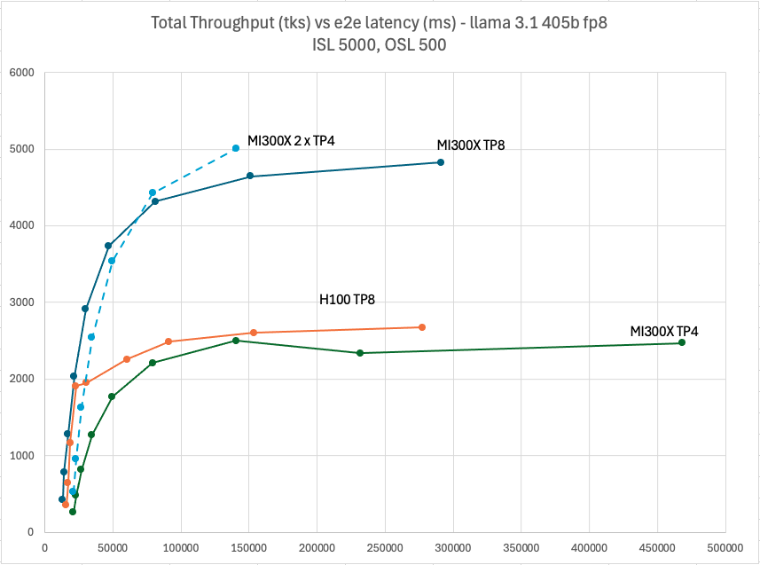

Figure 2: Llama 3.1 405B FP8 throughput Vs latency with TP4 & TP8 ISL5000, OSL 500

It is observed that the throughput of H100 TP8 saturates significantly
earlier than MI300X. From batch size 32 to 256, the throughput increases
1.4x only while the latency increases 12x.

It is likely to suffer from KV cache evict in vLLM. KV cache consumes a
significant portion of GPU memory, especially in large batch sizes and
long sequence lengths. In vLLM, when GPU does not have enough space for
KV cache, things like preemption will happen.

Below is a simplified view about vLLM scheduling of incoming requests
after tokenization.

```markdown
prefill ready -> run prefill: WAITING -> RUNNING  
decoding ready -> run decoding: RUNNING -> RUNNING  
decoding finished: RUNNING -> FINISHED  
preempted (because KV caches are not enough) -> switch to back WAITING
```

The following console log was captured when it happened on H100. As you
can see preemption occurred when GPU memory is almost full. It resulted
in 2 running requests back into pending and the generation throughput
decreased.

This behavior is not rare on H100 during the benchmark. It is more often
on larger models with larger batch sizes and longer sequence lengths.
Once it occurred, the performance was significantly impacted. It also
happened to MI300X in TP1 or TP2 when the total available GPU memory
size is limited. When the throughput decreases while batch size
increases, it is the indicator of KV cache evict. You can check the log
file to verify.

```markdown
prompt throughput: 0.0 tokens/s, Avg generation throughput: 1547.6
tokens/s,

Running: 157 reqs, Swapped: 0 reqs, Pending: 99 reqs, GPU KV cache
usage: 99.4%, CPU KV cache usage: 0.0%.

WARNING 01-21 05:05:14 engine.py:205] Sequence group
cmpl-d5a0bb826fd54a568fa9c8ae9382a1cb-0 is preempted by
PreemptionMode.RECOMPUTE mode because there is not enough KV cache
space.

This can affect the end-to-end performance. Increase
gpu_memory_utilization or tensor_parallel_size to provide more KV
cache memory. total_num_cumulative_preemption=101

INFO 01-21 05:05:14 metrics.py:467] Avg prompt throughput: 0.0
tokens/s, Avg generation throughput: 1529.6 tokens/s,

Running: 155 reqs, Swapped: 0 reqs, Pending: 101 reqs, GPU KV cache
usage: 99.5%, CPU KV cache usage: 0.0%.
```

You can try to increase gpu_memory_utilization to a higher value like
0.9 to reduce the likelihood, however, don’t set it too high (like 0.99)
as vLLM needs additional GPU memory to capture the CUDA graph. In some
cases, it will abort or fail during benchmark.

The same happened to H100 with input 2K and output 2K. MI300X TP4 was
also impacted when the batch size grew beyond 128.

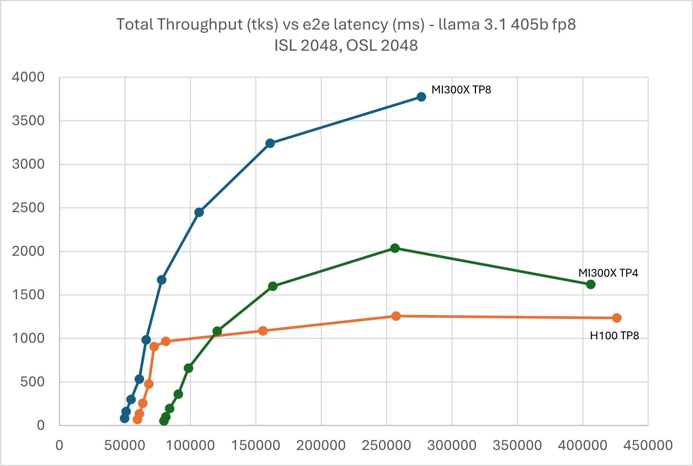
Figure 3: Llama 3.1 405B FP8 throughput Vs latency with TP4 & TP8 ISL
2048, OSL 2048

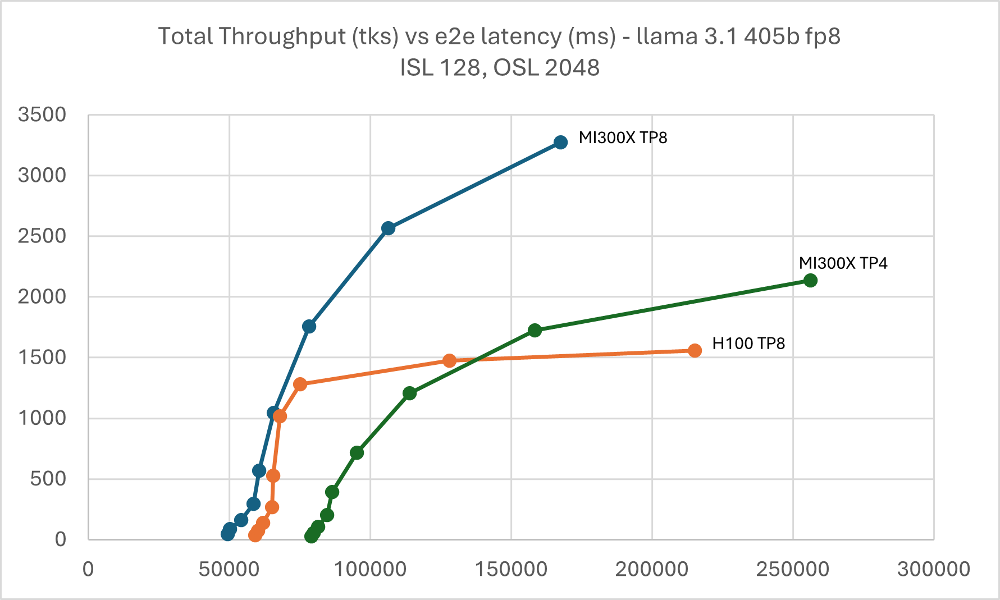
Figure 4: Llama 3.1 405B FP8 throughput Vs latency with TP4 & TP8 ISL
128, OSL 2048

### Llama 3.1 70B FP16

Following graphs show the performance curves for Llama 3.1 70B in FP16,
which can be served by MI300X and H100 in both TP8 and 4. Additionally,
thanks to the larger HBM capacity, it can be served in TP2 on MI300X.

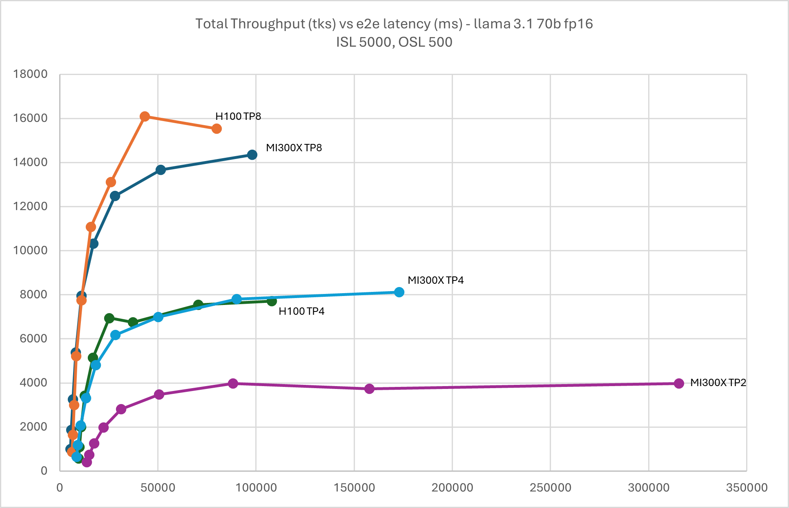
Figure 5: Llama 3.1 70B FP16 throughput Vs latency with TP2, TP4, & TP8 ISL
5000, OSL 500

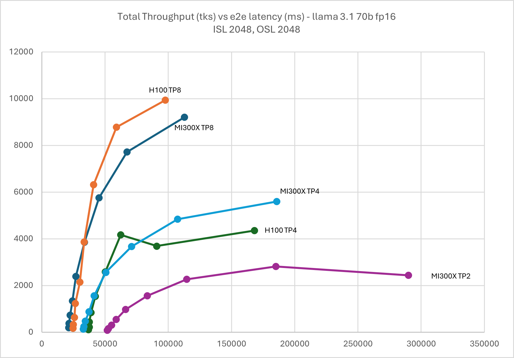
Figure 6: Llama 3.1 70B FP16 throughput Vs latency with TP2, TP4, & TP8 ISL
2048, OSL 2048

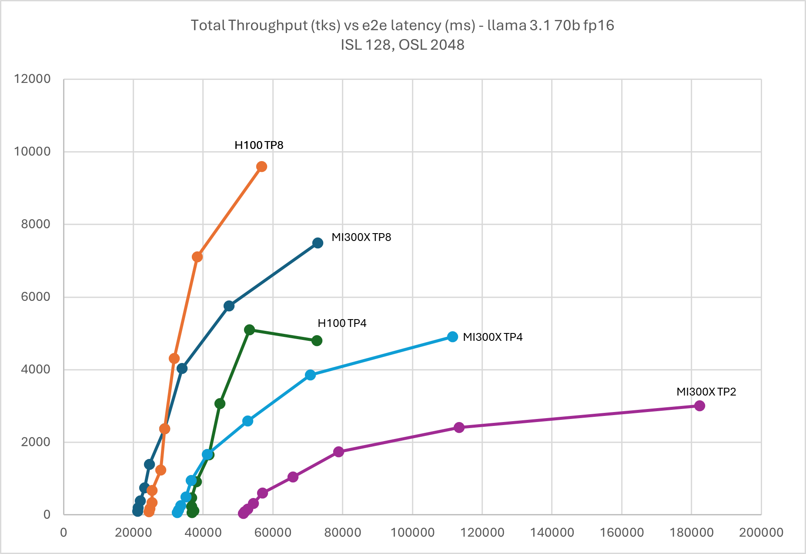
Figure 7: Llama 3.1 70B FP16 throughput Vs latency with TP2, TP4, & TP8 ISL
128, OSL 2048

### Llama 3.1 70B FP8

Due to large HBM memory, MI300X is able to serve Llama 3.1 70B FP8 in
TP1 while H100 TP2 met OOM issue in high batch size. KV cache evict also
occurred on H100 TP8 and TP4 when the batch size grew beyond 128.

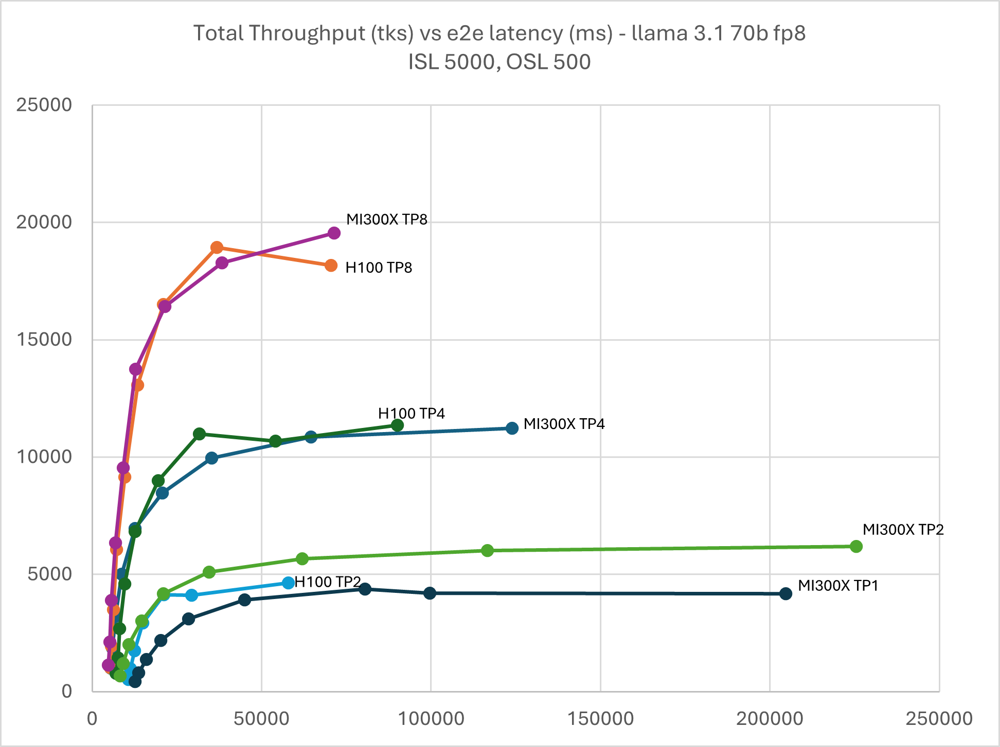
Figure 8: Llama 3.1 70B FP8 throughput Vs latency with TP1, TP2, TP4, & TP8 ISL
5000, OSL 500

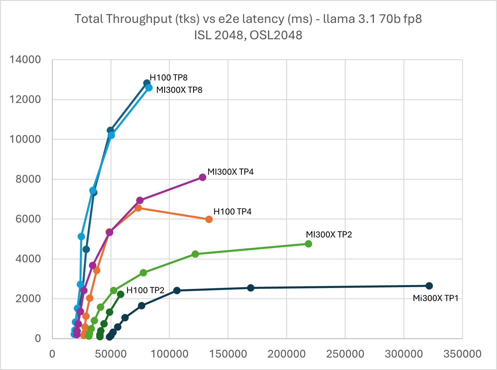
Figure 9: Llama 3.1 70B FP8 throughput Vs latency with TP1, TP2, TP4, & TP8 ISL
2048, OSL 2048

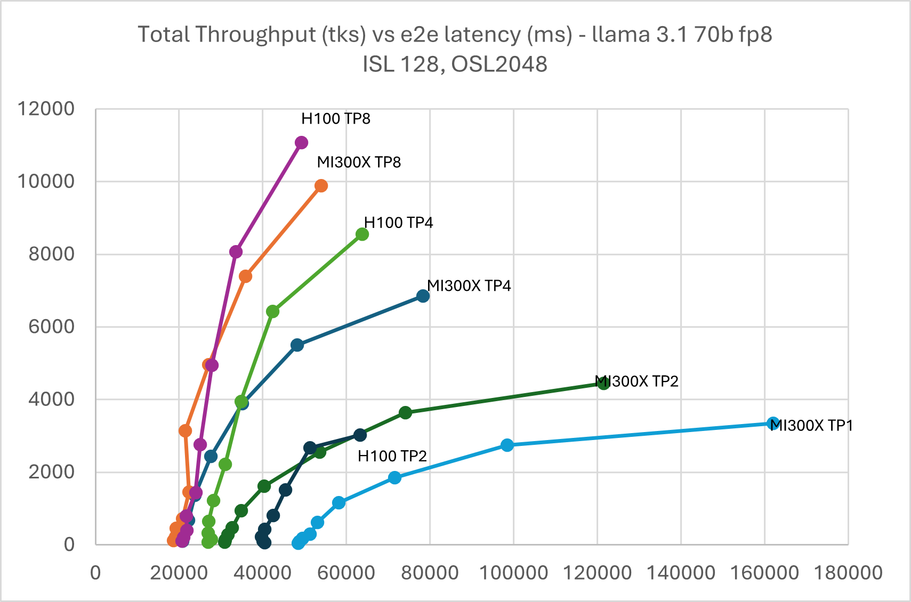
Figure 10: Llama 3.1 70B FP8 throughput Vs latency with TP1, TP2, TP4, & TP8 ISL
128, OSL 2048

### Mistral 7B v0.3 FP16

As illustrated below in Figure 11, MI300X consistently outperforms H100
across the batch sizes in TP1. Starting from batch size 64, the
throughput of H100 starts to saturate due to KV cache eviction.

In general, it is recommended to serve small LLM models, &lt;30B, in TP1
on MI300X to avoid the AllReduce overhead.

You can create 8 instances of TP1 running in parallel on MI300X to
maximize the GPU utilization and system throughput.

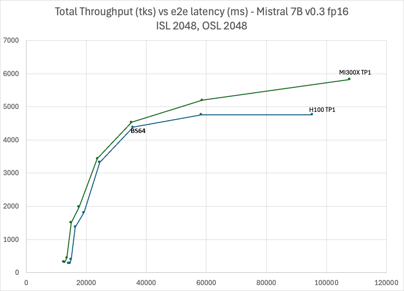

Figure 11: Mistral 7B v0.3 FP16 throughput Vs latency with TP1 ISL 2048, OSL 2048, BS 64

### Mistral 7B v0.3 FP8

Similarly, MI300X outperforms H100 in TP1. Starting from batch size 128,
H100 suffers from KV cache eviction. Comparing with FP16, MI300X in FP8
achieves around 11,000 tps vs 52,00 tps at 60,000ms latency which shows
a 2.1x performance boost.

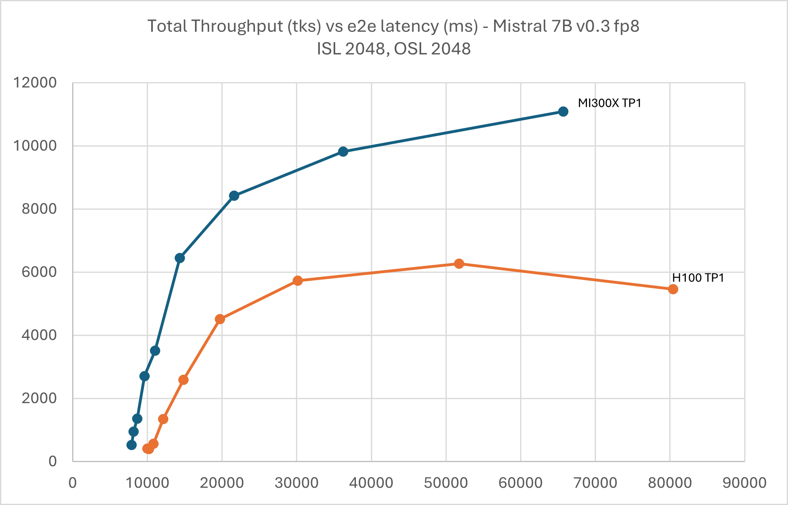
Figure 12: Mistral 7B v0.3 FP8 throughput Vs latency with TP1 ISL 2048,
OSL 2048

### How to Reproduce Online Serving Benchmark

To reproduce online serving benchmarks, start MI300X vLLM server inside
the container (All vLLM serve command line listed below, please run them
one by one).

Please make sure required models have been downloaded and included at
the right path for the script. In the examples below, the models were stored in this path: /models/$modelname

```bash
export VLLM_USE_TRITON_FLASH_ATTN=0
```

```bash
vllm serve -tp 8 --swap-space 16 --disable-log-requests /models/Llama-3.1-70B-Instruct --num-scheduler-steps 10 --gpu_memory_utilization=0.9 --max-num-seqs 1024
```

```bash
vllm serve -tp 4 --swap-space 16 --disable-log-requests /models/Llama-3.1-70B-Instruct --num-scheduler-steps 10 --gpu_memory_utilization=0.9 --max-num-seqs 512
```

```bash
vllm serve -tp 2 --swap-space 16 --disable-log-requests /models/Llama-3.1-70B-Instruct --num-scheduler-steps 10 --gpu_memory_utilization=0.9 --max-num-seqs 256
```

```bash
vllm serve -tp 8 --swap-space 16 --disable-log-requests /models/Meta-Llama-3.1-70B-Instruct-FP8-KV --dtype float16 --quantization fp8 --kv-cache-dtype fp8 --num-scheduler-steps 10 --gpu_memory_utilization=0.9 --max-num-seqs 1024
```

```bash
vllm serve -tp 4 --swap-space 16 --disable-log-requests /models/Meta-Llama-3.1-70B-Instruct-FP8-KV --dtype float16 --quantization fp8 --kv-cache-dtype fp8 --num-scheduler-steps 10 --gp_memory_utilization=0.9 --max-num-seqs 512
```

```bash
vllm serve -tp 2 --swap-space 16 --disable-log-requests /models/Meta-Llama-3.1-70B-Instruct-FP8-KV --dtype float16 --quantization fp8 --kv-cache-dtype fp8 --num-scheduler-steps 10 --gpu_memory_utilization=0.9 --max-num-seqs 256
```

```bash
vllm serve -tp 1 --swap-space 16 --disable-log-requests /models/Meta-Llama-3.1-70B-Instruct-FP8-KV --dtype float16 --quantization fp8 --kv-cache-dtype fp8 --num-scheduler-steps 10 --gpu_memory_utilization=0.9 --max-num-seqs 256
```

```bash
vllm serve -tp 8 --swap-space 16 --disable-log-requests /models/Meta-Llama-3.1-405B-Instruct-FP8-KV --dtype float16 --quantization fp8 --kv-cache-dtype fp8 --num-scheduler-steps 10 --gpu_memory_utilization=0.9 --max-num-seqs 256
```

```bash
vllm serve -tp 4 --swap-space 16 --disable-log-requests /models/Meta-Llama-3.1-405B-Instruct-FP8-KV --dtype float16 --quantization fp8 --kv-cache-dtype fp8 --num-scheduler-steps 10 --gpu_memory_utilization=0.9 --max-num-seqs 256
```

```bash
vllm serve -tp 1 --swap-space 16 --disable-log-requests /models/Mistral-7B-Instruct-v0.3 --num-scheduler-steps 10 --gpu_memory_utilization=0.9 --max-num-seqs 1024
```

```bash
vllm serve -tp 1 --swap-space 16 --disable-log-requests /models/Mistral-7B-Instruct-v0.3-FP8-KV --dtype float16 --quantization fp8 --kv-cache-dtype fp8 --num-scheduler-steps 10 --gpu_memory_utilization=0.9 --max-num-seqs 1024
```

MI300X client side (please set model based on the path of your model)

```markdown
mkdir -p results

QPS="inf"

model="/models/$modelname"

Req_In_Out=("1:2048:2048" "2:2048:2048" "4:2048:2048" "8:2048:2048"
"16:2048:2048" "32:2048:2048" "64:2048:2048" "128:2048:2048"
"256:2048:2048")

#Req_In_Out=("1:128:2048" "2:128:2048" "4:128:2048" "8:128:2048"
"16:128:2048" "32:128:2048" "64:128:2048" "128:128:2048"
"256:128:2048")

#Req_In_Out=("1:5000:500" "2:5000:500" "4:5000:500" "8:5000:500"
"16:5000:500" "32:5000:500" "64:5000:500" "128:5000:500"
"256:5000:500")
```

```bash
for req_in_out in "${Req_In_Out[@]}"; do
 con=$(echo "$req_in_out" | awk -F':' '{ print $1 }')
 inp=$(echo "$req_in_out" | awk -F':' '{ print $2 }')
 out=$(echo "$req_in_out" | awk -F':' '{ print $3 }')
 for qps in $QPS; do
  echo "[INFO] req=256 inp=$inp out=$out con=$con qps=$qps"
  python3 /app/vllm/benchmarks/benchmark_serving.py \
   --backend vllm \
   --model "$model" \
   --dataset-name random \
   --num-prompts 256 \
   --random-input-len "$inp" \
   --random-output-len "$out" \
   --random-range-ratio 1.0 \
   --ignore-eos \
   --max-concurrency "$con" \
   --port 8000 \
   --percentile-metrics ttft,tpot,itl,e2el \
   --save-result \
   --result-dir results/ \
   --result-filename "${modelname}_${tp}_req256_i${inp}_o${out}_c${con}_q${qps}.json" \
   --request-rate "$qps"
 done
done
```

## Key Takeaways

To conclude, here are few key points:

- To achieve the best possible LLM inference performance on MI300X, it
 is highly recommended to use the pre-built ROCm vLLM Docker image
 from rocm/vllm-dev:main[2] that includes the optimized hipBLASLtt,
 Triton and CK kernels. Additionally, it is actively developed and
 upstreamed to the vLLM GitHub repo.

- AMD shows competitive performance optimization on popular
 open-source LLM models including Llama and Mistral, on MI300X in
 MLPerf submission, offline throughput and latency as well as online
 serving scenario. Optimization of trending models such as Deepseek
 is under active development.

- MI300X often outperforms H100 in memory bound scenario due to its
 higher memory bandwidth.

- It is highly recommended to fully leverage the high memory capacity
 of MI300X to run large LLMs such as Llama 3.1 405B in TP8 to
 maximize performance and run relatively small LLMs &lt;= 30B on
 MI300X in TP1 to avoid inter-GPU communication overhead.

- The large GPU memory on MI300X can significantly reduce the
 occurrence of KV cache evictions in vLLM in large batch size and
 long sequence length. It also opens up the possibility of serving
 LLM models with multiple instances of TP1 for LLMs &lt;=72B as
 demonstrated in AMD’s MLPerf 4.1 submission.[3]

Endnotes:

MI300-05A: Calculations conducted by AMD Performance Labs as of November
17, 2023, for the AMD Instinct™ MI300X OAM accelerator 750W (192 GB
HBM3) designed with AMD CDNA™ 3 5nm FinFet process technology resulted
in 192 GB HBM3 memory capacity and 5.325 TFLOPS peak theoretical memory
bandwidth performance. MI300X memory bus interface is 8,192 and memory
data rate is 5.2 Gbps for total peak memory bandwidth of 5.325 TB/s
(8,192 bits memory bus interface  * 5.2 Gbps memory data rate/8).

The highest published results on the NVidia Hopper H200 (141GB) SXM GPU
accelerator resulted in 141GB HBM3e memory capacity and 4.8 TB/s GPU
memory bandwidth performance.

https://nvdam.widen.net/s/nb5zzzsjdf/hpc-datasheet-sc23-h200-datasheet-3002446

The highest published results on the NVidia Hopper H100 (80GB) SXM5 GPU
accelerator resulted in 80GB HBM3 memory capacity and 3.35 TB/s GPU
memory bandwidth performance.

https://resources.nvidia.com/en-us-tensor-core/nvidia-tensor-core-gpu-datsheet.

MI300-074: Testing conducted by AMD Performance Labs as of January 15,
2025, on the following two systems: AMD: Supermicro AS - 8125GS-TNMR2
with 2x AMD EPYC 9654 Processors, 8x AMD MI300X (192GB, 750W) GPUs, 1
NUMA node per socket, 2.2 TiB (24 DIMMs, 4800 mts, 96 GiB/DIMM), Root
drive + Data drive combined: 2x 960GB Samsung  MZ1L2960HCJR-00A07 4x
3.84TB Samsung MZQL23T8HCLS-00A07, Ubuntu 22.04.4 LTS with Linux kernel
5.15.0-116-generic, host GPU driver 6.2.1, System BIOS 1.8 GPU: SMC FW
00.85.112.142. Nvidia: Supermicro AS -8125GS-TNHR with 2x AMD EPYC 9654
Processors, 8x NVIDIA H100 (80GiB, 700W) GPUS, 1 NUMA node per socket,
2.3 TiB (24 DIMMS, 4800 mts, 96 GB/DIMM), Data drives: 8x 7 TiB INTEL
SSDPF2KX076T1 NVMe SSDs, Root drive: 1.75 TiB Micron
MTFDDAK1T9TDS-1AW1ZA, Ubuntu 22.04.5 LTD with Linux kernel titan
6.8.0-51-generic, CUDA 12.6.r12.6/compiler.35059454_0+ NVIDIA-SMI
560.35.03, VBIOS 96.00.74.00.01.

Latency is calculated as elapsed_time for processing input_lenghts +
output_lengths. Throughput is calculated as requests * output lengths
/ elapsed_time.

[1] <sup> MBU (Memory Bandwidth Utilization) and MFU (Memory Flops
Utilization) of LLM Inference roofline. Courtesy of
<https://www.databricks.com/blog/llm-inference-performance-engineering-best-practices> </sup>

[2] <sup> Performance  measured  in  tps  by  AMD  with  vllm-dev:20250112  for  MI300X  and  trtllm_v0.16.0  for  H100 </sup>

[3] <sup>Users  are  recommended  to  use  the  latest  version  of  the  docker,  for  the  testing  in  this  document  rocm/vllm-dev:20250112  has  been  used.</sup>

[4] <sup>The  online  serving  benchmark  in  this  article  uses  common  configs  without  vLLM  parameter  tuning.  It  does  not  use  specific  GEMM  tuning  like  TunableOps.  With  specific  tuning  based  on  model  config,  the  performance  could  be  further  improved.  TensorRT-LLM  employs  the  custom  configs  to  build  engine  for  its  published performance.</sup>
