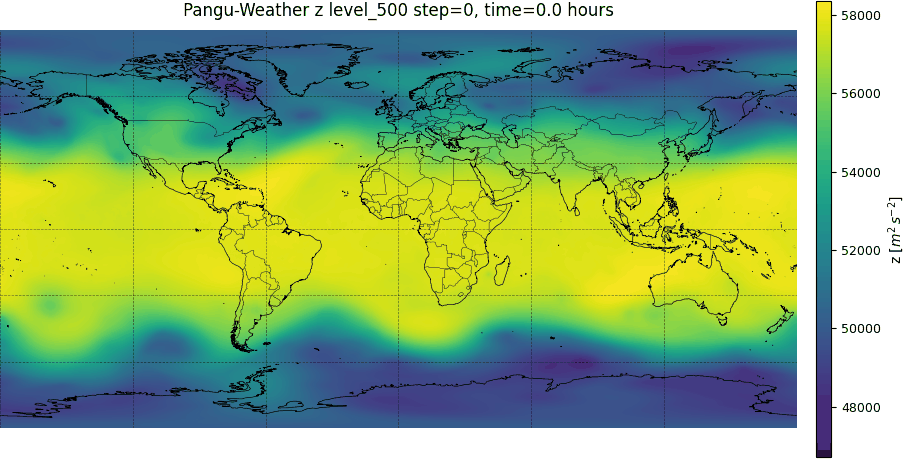
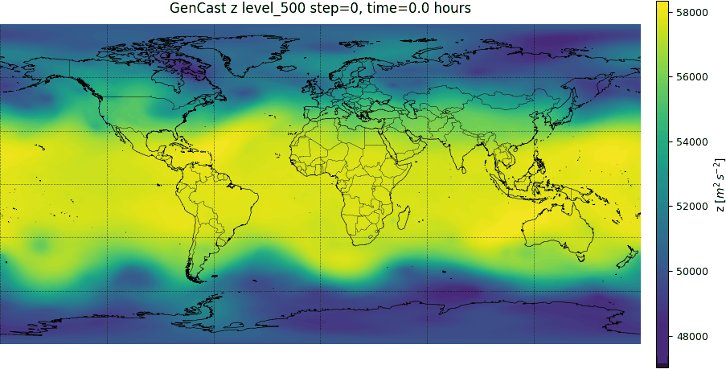
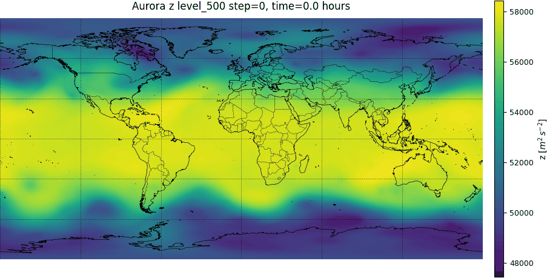
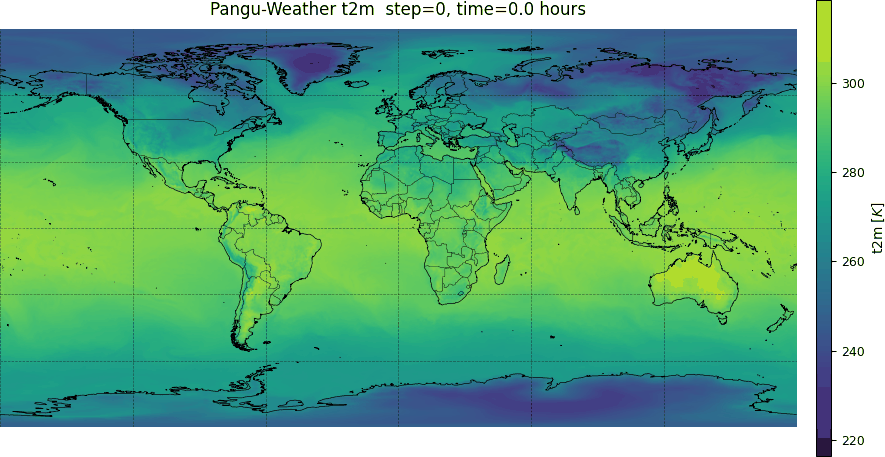
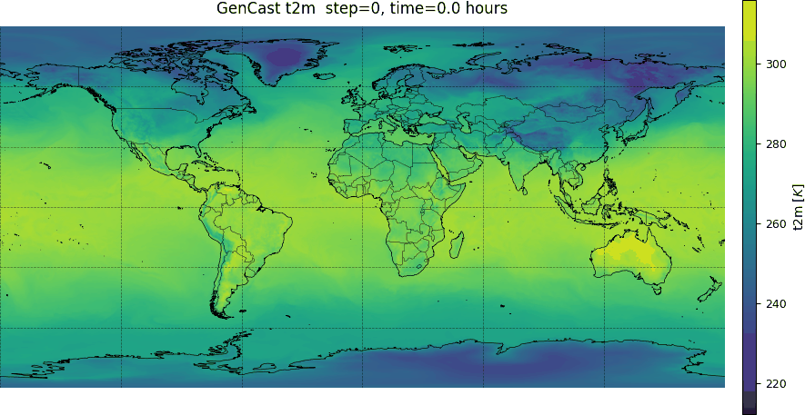
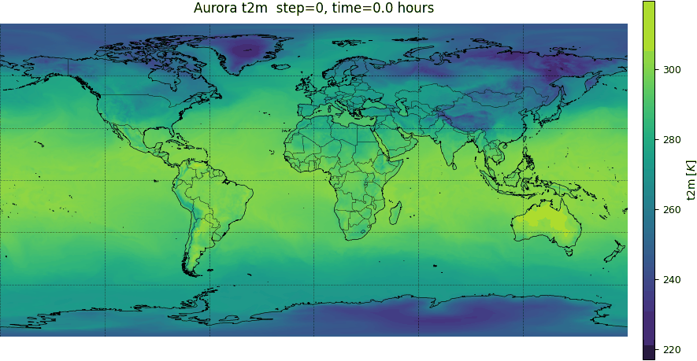

<!---
Copyright (c) 2025 Advanced Micro Devices, Inc. (AMD)

Permission is hereby granted, free of charge, to any person obtaining a copy
of this software and associated documentation files (the "Software"), to deal
in the Software without restriction, including without limitation the rights
to use, copy, modify, merge, publish, distribute, sublicense, and/or sell
copies of the Software, and to permit persons to whom the Software is
furnished to do so, subject to the following conditions:

The above copyright notice and this permission notice shall be included in all
copies or substantial portions of the Software.

THE SOFTWARE IS PROVIDED "AS IS", WITHOUT WARRANTY OF ANY KIND, EXPRESS OR
IMPLIED, INCLUDING BUT NOT LIMITED TO THE WARRANTIES OF MERCHANTABILITY,
FITNESS FOR A PARTICULAR PURPOSE AND NONINFRINGEMENT. IN NO EVENT SHALL THE
AUTHORS OR COPYRIGHT HOLDERS BE LIABLE FOR ANY CLAIM, DAMAGES OR OTHER
LIABILITY, WHETHER IN AN ACTION OF CONTRACT, TORT OR OTHERWISE, ARISING FROM,
OUT OF OR IN CONNECTION WITH THE SOFTWARE OR THE USE OR OTHER DEALINGS IN THE
SOFTWARE.
--->

# Running SOTA AI-based Weather Forecasting models on AMD Instinct

Weather Forecasting is a complex scientific problem where immense progress has been made through the Numerical Weather Prediction (NWP) approach using computational fluid dynamics-based models. Forecasting is usually done in three stages: a data assimilation stage where all available data streams at the time $t$ (sometimes previous times can be used to improve this estimate) are used to estimate the current 3D state of the atmosphere $ S_{t}$ (surface and atmosphere), as parameterized by a number of variables at the current time $ t$, a forecasting stage where the state $\hat{S}_{t + \delta t}$ for a later time $ t+ \delta t$ (i.e., all the variables at this later time) are forecasted, and a downstream stage where the forecasted state at time $t + \delta t$ is used to estimate weather variables at more specific times and locations.

In the past few years, there has been a quiet revolution with the development of a slew of AI models that learn spatio-temporal weather patterns from about forty years of well-curated weather data. While AI models are being developed as alternatives to the NWP methods for each of the stages described above, they have been most successful when applied to the second stage of forecasting. Such AI  models have been shown to perform at similar levels—or slightly better—on many metrics compared to NWP, but at a small fraction of the computational cost. The state-of-the-art (SOTA) models tend to be deep neural network models and leverage data products like ERA5 [[1]](#4) built from observations, and NWP methods. Such models include deterministic models like Pangu-Weather [[2]](#1) developed by Huawei, ensemble models like GenCast [[3]](#2) developed by Google DeepMind, and foundation models tuned on weather data like Aurora [[4]](#3) developed by Microsoft Research. All these models perform quite well on commonly studied metrics, but investigations continue on the reliability of AI models in more diverse (and extreme) conditions. These model architectures are also available as open-source code from the developers on GitHub (e.g. [Pangu-Weather](https://github.com/198808xc/Pangu-Weather), [GenCast](https://github.com/deepmind/graphcast.git), [Aurora](https://github.com/microsoft/aurora.git) repositories). Weights for such models trained by their developers are also currently available as checkpoints, but under non-commercial licenses. In this blog post, we show how to run these models on AMD Instinct MI300X GPUs.

## Prerequisites

To follow along executing the code, you will need:

- computer with one or more AMD Instinct MI300X GPUs
- Docker
- credentials on Climate Data Server for data to be used as input

Most mainstream deep learning models use one of the popular ML frameworks such as JAX or PyTorch to perform the computations efficiently on accelerators. To do this on AMD GPUs, we need versions of such frameworks compatible with ROCm and such compatible frameworks can be installed in a variety of ways described on the ROCm website. In our case, Gencast uses the JAX framework, while Aurora uses the PyTorch framework. We will use the pre-built Docker images and install the dependencies on top of that. For GenCast and Pangu-Weather, we will follow the [ROCm Jax page](https://rocm.docs.amd.com/projects/install-on-linux/en/latest/install/3rd-party/jax-install.html#using-a-prebuilt-docker-image) [[5]](#5) and for Aurora we will create an image based on the ROCm PyTorch image as described [here](https://rocm.docs.amd.com/projects/install-on-linux/en/latest/install/3rd-party/pytorch-install.html#using-docker-with-pytorch-pre-installed).  We install GenCast and Pangu-Weather on the JAX based image, and Aurora on the py-torch based image. Then we install a wrapper `ai-models` [[6]](#6), and the required plugins from the European Commission for Medium Range Weather Forecasting (ECMWF). The wrapper helps download the required input data and format it appropriately for the deep learning model involved. For Pangu-Weather, which uses an ONNX backend, we will apply a patch to ensure the `ai-models` framework provides execution capabilities for ROCm based executions rather than hard-coding a CUDA based execution provider. The code to build these images is provided at [our github repository](https://github.com/silogen/ai-samples).
To install everything, we clone the repository and build the Docker images corresponding to JAX and PyTorch from the dockerfiles to containerize the applications.

```bash
git clone https://github.com/silogen/ai-samples  
cd ai4sciences/ai-weather-forecasting 
docker build -t jaxweather:latest -f jax.dockerfile .
docker build -t pytorchweather:latest -f pytorch.dockerfile .
```

## Downloading Input Data

As mentioned, the models will require input data which will be downloaded on the fly by `ai-models`. In order to download the data from the Climate Data Store (CDS), we need an account. Please follow the instructions on the [climate data store setup page](https://cds.climate.copernicus.eu/how-to-api) to get the URL and key, which must be provided to the model. When we run the docker image, we will pass environmental variables stored in the file `weather-forecasting/env_file`. Let us edit the file, providing values to the variables. The `CDSAPI_URL` variable already points to the URL for CDS found in the previous step. Now we can edit the file to provide values for the key `CDSAPI_KEY`. Therefore the `env_file` should look like:

```text
CDSAPI_URL=https://cds.climate.copernicus.eu/api
CDSAPI_KEY=your_key
#EARTHKIT_DATA_USER_CACHE_DIRECTORY=location_for_cache_download
#HIP_VISIBLE_DEVICES=0,1
```

The other variables are commented out and can be left as such. But if we want to use them, we can uncomment them and provide the appropriate values. By default, the input data will be stored in `/tmp/earthkit-data-root`, but if we want to store these at some other location accessible to Docker, its location can be changed to that of the environment variable `EARTHKIT_DATA_USER_CACHE_DIRECTORY`. Finally, if we have more than one GPU in our system, but only want to use a certain subset, we can do that in a few ways. First, we can pass the environment variable `HIP_VISIBLE_DEVICES` to specify the GPU ID, such as 0 or 0,1. Alternatively, we may run the Docker container only giving access to certain GPUs following the [ROCm documentation pages](https://rocm.docs.amd.com/projects/install-on-linux/en/latest/how-to/docker.html#restricting-gpu-access). Here, we use the environment variable.

The installation is now complete and we can start running the models. We will begin by spinning up the Docker container and starting a bash shell there."

```bash
docker run -it --rm \
    --cap-add=SYS_PTRACE \
    --env-file=env_file \
    --security-opt seccomp=unconfined \
    --device=/dev/kfd \
    --device=/dev/dri \
    --cap-add=SYS_RAWIO \
    --device=/dev/mem \
    --group-add video \
    --network host \
    --name jaxrocm \
    jaxweather:latest bash
```

which runs the jaxweather image in a container named jaxrocm and runs the bash command dropping us onto the shell.

We can quickly check that the environment variables we set in the file are sourced, by echoing them:

```bash
echo $CDSAPI_URL
```

In the following, we describe how to run inference on both the GenCast and the Pangu-Weather models. For convenience, the following code snippets can also be found in the file `code/jax_script.sh` available in the repository.
We can see that using the --models option gives us the list of available models currently installed

```bash
ai-models --help
```

While we will not explore all the options here, let us look at a couple:

```bash
ai-models --models

--- Output---
gencast
gencast-0.25
gencast-0.25-Oper
gencast-1.0
gencast-1.0-Mini
panguweather
```

gives us the list of available models. This one should show a few flavours of `GenCast` and `Pangu-Weather`.

The outputs we get from `ai-models` are stored in `.grib` files and can be opened as lists of `xarray.dataset` objects using `cfgrib` as shown in the following code block.

```python
# assume path to output is `output.grib`
import cfgrib
import xarray as xr
dss = cfgrib.open_datasets('output.grib')
# len(dss) = 4 # dss is a list of 4 dataset objects.
```

## Pangu-Weather

Pangu-Weather is an AI model in this area based on transformers, developed by Huawei and described in [this paper](#1) The code is available in [this repository](https://github.com/198808xc/Pangu-Weather). First, we can check what variables are predicted.

```bash
ai-models --fields panguweather

--- Output ---
Grid: [0.25, 0.25]
Area: [90, 0, -90, 360]
Pressure levels:
   Levels: [1000, 925, 850, 700, 600, 500, 400, 300, 250, 200, 150, 100, 50]
   Params: ['z', 'q', 't', 'u', 'v']
Single levels:
   Params: ['msl', '10u', '10v', '2t']   
```

The grid and area outputs show that the 3D atmospheric state is defined on a latitude, longitude grid of $0.25\ \rm{degree}$ resolution, which corresponds to a distance of $28\ \rm{Km}$, and thirteen pressure levels in the atmosphere.

We can see the variables predicted by the model:
Geopotential ($z$), Specific Humidity ($q$), Temperature ($t$), Eastward Component of the wind ($u$) and the Northward component of the wind ($v$) at each of the 13 pressure levels, while it predicts the mean sea level pressure ($msl$), the Eastward Component of the wind ($10u$) and the Northward component of the wind ($10v$) at 10m above the surface of the earth, and the temperature at 2m above the surface of the earth ($t2$).

As input, the model uses two states of the atmosphere $S_t$ at times $t-\delta t$ and $t.$ It uses a diffusion model to generate samples of the probability distribution $P\left(S_{t+\delta t}\vert S_{t}, S_{t-\delta t}, M\right)$ where $\delta t = 12\ \rm{hours}$. This allows uncertainty quantification on the predictions. It is possible to perform autoregressive predictions at lead times of $N \delta t$ for integer $N$, and lead times of 10 days, where $N$ is an integer.

```bash
MODEL_NAME=panguweather
mkdir -p predictions assets logs
ai-models --download-assets \
    --assets "assets/$MODEL_NAME" \
    --input=cds \
    --date=20240101 \
    --time=0000 \
    --lead-time=24 \
    --path="predictions/$MODEL_NAME.grib" \
    $MODEL_NAME
```

We can visualize this using the command:

```bash
python3 grib_visualizer.py --input predictions/$MODEL_NAME.grib
```

This command will generate plots in `./output` directory.

## GenCast

GenCast is an AI model developed by Google DeepMind and described in the paper [[2]](#2) and available from the [repository](https://github.com/deepmind/graphcast.git).

Again, we can examine the fields that would be predicted. For example, to find the ones predicted by a `GenCast` model named as `gencast-0.25` above, we do:

```bash
ai-models --fields gencast-0.25

--- Output ---
Grid: [0.25, 0.25]
Area: [90, 0, -90, 360]
Pressure levels:
   Levels: [50, 100, 150, 200, 250, 300, 400, 500, 600, 700, 850, 925, 1000]
   Params: ['t', 'z', 'u', 'v', 'w', 'q']
Single levels:
   Params: ['lsm', '2t', 'sst', 'msl', '10u', '10v', 'tp', 'z']
```

Thus, we see that the model has an identical latitude-longitude and pressure grid, and predicts the variables: Temperature ($t$), Geopotential ($z$), Eastward Component of the wind ($u$), the Northward component of the wind ($v$), the vertical velocity $w$, and Specific Humidity ($q$) at each of the 13 pressure levels, while it predicts the temperature at 2m above the surface of the earth ($2t$), Sea surface temperature ($sst$), mean sea level pressure ($msl$), the Eastward Component of the wind ($10u$) and the Northward component of the wind ($10v$) at 10m above the surface of the earth, the total precipitation ($tp$). The land-sea-mask ($lsm$) which is static and the geopotential at the surface of the earth ($z$) are used as inputs along with latitude, longitude, local time of day, and elapsed year progress.

As input, the model uses two states of the atmosphere $S_t$ at times $t$ and $t - \delta t.$ It uses a diffusion model to generate samples of the probability distribution $P\left(S_{t+\delta t}\vert S_{t}, S_{t-\delta t}, M\right)$ where $\delta t = 12\ \rm{hours}$. This allows uncertainty quantification on the predictions. It is possible to do autoregressive predictions at lead times of $N \delta t$ for integer $N$ and lead times 10 days, where $N$ is an integer.

In this case, the `ai-models` package will use a set of weights provided by Google at 0.25 degree resolution trained on ERA5 data. These weights are licensed under the Creative Commons Attribution-NonCommercial-ShareAlike 4.0 International (CC BY-NC-SA 4.0) by Google. It will also use the Google provided `GenCast` code to run the checkpoint. Since this code uses a JAX backend which reserves a chunk of video memory it is nice to set a couple of `XLA` parameters appropriate for MI300X, but things will still run without these set. If we were to use a GPU with a lower or higher memory, these may need to be modified. Here we set these in the docker image by running `set_XLA_params.sh`.

```bash
source set_XLA_params.sh
```

We can go ahead and run `GenCast`:
The models need to normalize the data to its statistics, this is
downloaded using the `--download-assets` flag. Further, runs can skip this flag.

```bash
MODEL_NAME=gencast-0.25
mkdir -p predictions assets logs
ai-models --download-assets \
    --assets "assets/$MODEL_NAME" \
    --input=cds \
    --date=20240101 \
    --time=0000 \
    --lead-time=240 \
    --path="predictions/$MODEL_NAME.grib" \
     $MODEL_NAME > logs/$MODEL_NAME.log 2>&1 &
```

To visualize the grib outputs, we can run this code

```bash
python3 grib_visualizer.py --input predictions/$MODEL_NAME.grib
```

This will produce animations for variables at different pressure levels as well as surface levels in the `./output` directory.

In calling `GenCast` via `ai-models` we did not specify the number of samples, which is 1 by default. This can be done through the option `--num-ensemble-members=`. Note that GenCast does this computation distributed across GPUs available, and it is required that the number of ensembles is a multiple of the number of GPUs available.

## Aurora

Aurora is a foundation model for the Earth System, developed by Microsoft Research described [in this paper](https://www.nature.com/articles/s41586-025-09005-y). The model has been trained on several earth datasets at different resolutions. This results in  a model that can be further fine-tuned on a new dataset or with new variables. The code is available at [the repository](https://github.com/microsoft/aurora.git) To run predictions using provided checkpoints, we use the PyTorch image:

```bash
docker build -t torchweather:latest -f pytorch.dockerfile .

docker run -it --rm \
    --cap-add=SYS_PTRACE \
    --env-file=env_file \
    --security-opt seccomp=unconfined \
    --device=/dev/kfd \
    --device=/dev/dri \
    --cap-add=SYS_RAWIO \
    --device=/dev/mem \
    --group-add video \
    --network host \
    --name torchrocm \
    torchweather:latest bash
```

```bash
Aurora
aurora-0.1-finetuned
aurora-2.5-finetuned
aurora-2.5-pretrained
```

```bash
ai-models --fields $MODEL_NAME
/opt/conda/envs/py_3.12/lib/python3.12/site-packages/redis/connection.py:77: UserWarning: redis-py works best with hiredis. Please consider installing
  warnings.warn(msg)
Grid: [0.1, 0.1]
Area: [90, 0, -90, 359.9]
Pressure levels:
   Levels: (1000, 925, 850, 700, 600, 500, 400, 300, 250, 200, 150, 100, 50)
   Params: ('z', 'u', 'v', 't', 'q')
Single levels:
   Params: ('2t', '10u', '10v', 'msl')
```

Then, we have an `ai-models` wrapper to use as in previous cases. The code that we display here is also `code/torch_script.sh` file in the cloned repository. So to run the `aurora` models, we can do

```bash
MODEL_NAME=aurora
mkdir -p predictions assets logs
ai-models --download-assets \
    --assets "assets/$MODEL_NAME" \
    --input=cds \
    --date=20240101 \
    --time=0000 \
    --lead-time=24 \
    --path="predictions/$MODEL_NAME.grib" \
    $MODEL_NAME > logs/$MODEL_NAME.log 2>&1 &
```

Again, we can visualize the outputs by running the following code:

```bash
python3 grib_visualizer.py --input predictions/$MODEL_NAME.grib
```

This will produce animations for variables at different pressure levels as well as surface levels in the `./output` directory.

## Visualizing the Model Outputs

The outputs for the models can be opened using `cfgrib` as described above. If we have run the visualization commands above, then a directory called `./outputs` has been created with some gifs for the surface variables, and directories for each pressure level which contain gifs for the variables at each pressure level.

```bash
outputs $ ls aurora   
level_100  level_1000 level_150  level_200  level_250  level_300  level_400  level_50   level_500  level_600  level_700  level_850  level_925  msl.gif    t2m.gif    u10.gif    v10.gif
 outputs $ ls aurora/level_100
q.gif t.gif u.gif v.gif z.gif
```

where each `level` directory has the atmospheric variables corresponding to the isobaric level.

We will only go through visualizing a couple of the variables here. First, let us look at the Geopotential z at an isobar of 500 hPa. Animations of the 10-day forecast of the Geopotential following January 1, 2024 according to models Pangu-Weather, GenCast and Aurora created using the code blocks above are shown in Figures 1, 2 and 3 respectively. The Geopotential is the work done in moving a unit mass from the mean sea level to the location (lat, long, pressure surface) and for small geometric altitudes (the distance from the sea level as would be measured by a tape) $h$ is  $g_{surface} \times h$ to a very good approximation, where $ g_{surface}$ is the gravitational acceleration due to the earth at the mean sea level, approximately $ 9.8\ \rm{ms}^{-2}$. Thus, we can see the isobar is a crinkled surface in geometric altitude. From the plot, it appears that this surface has a median altitude of $53\times 10^{3} /g_{surface}\ \approx\ 5.4 Km$ in the mid latitude regions, whereas the poles have approximately $ 10 \%$  lower values and the equatorial region has $ 10 \%$ higher values. The average geometric altitude of the isobaric level at a fixed pressure of $ 500$ hPa down from about $1013.25$ h Pa at sea level is about 5.5 Km, which is a good match to the median stated above. We also expect the equatorial regions to typically have higher geopotentials than the poles (as  shown in the figures) due to three effects: the acceleration due to the earth's rotation, the (related) equatorial bulge of the earth, and because temperatures are higher in the equatorial regions. It is the last effect that dominates, as at higher temperatures the pressure falls less rapidly with altitude. Thus the  altitude at which a certain pressure (lower than the mean sea level pressure) is reached is higher in regions of high temperature. Additionally, looking at the GIFs, we see some blobs of blue break off from the blue patch at high latitudes in the North and South. At these points of time, these are troughs of the geopotential, or equivalently the height. If instead, we imagined looking at surfaces of constant geometric altitude, these would be locations where the pressure was equal to the average (lower) pressure at higher altitudes. Thus, these troughs are related to lower pressure regions.



**Figure 1:** The Geopotential Z at an isobar of 500 hPa above the earth's surface as predicted for $10\ \rm{days}$ using the Pangu-Weather model with starting date of 01/01/2024.



**Figure 2:** The Geopotential Z at an isobar of 500 hPa above the earth's surface as predicted for $10\ \rm{days}$ using the GenCast model with starting date of 01/01/2024.



**Figure 3:** The Geopotential Z at an isobar of 500 hPa above the earth's surface as predicted for $10\ \rm{days}$ using the Aurora model with starting date of 01/01/2024.

Finally, we can look at similar animations of the temperature at two meters above the surface of the earth forecast using  Pangu-Weather, GenCast, and Aurora and shown in Figures 4, 5 and 6 respectively.  Since this relates to the first 10 days of January we see from the color scale (Temperature in Kelvin), that it is colder in the Northern Hemisphere than in the Southern Hemisphere, while the Tropical regions are the warmest. We also notice that the temperature rapidly increases during the day and cools off during the night in the inland parts of the earth (most easily seen in Africa, South America and Australia), while the temperature in the oceans is much more stable due to larger heat capacity. The effect is not as easily visible in the Northern Hemisphere due to overall lower temperatures during winter.



**Figure 4:** Temperature (K) at height of 2m above the earth's surface as predicted for $10\ \rm{days}$ using the Pangu-Weather model with starting date of 01/01/2024.



**Figure 5:** Temperature (K) at height of 2m above the earth's surface as predicted for $10\ \rm{days}$ using the GenCast model with starting date of 01/01/2024.



**Figure 6:** Temperature (K) at height of 2m above the earth's surface as predicted for $10\ \rm{days}$ using the Aurora model with starting date of 01/01/2024.

## Adapting for AMD Hardware

In order to run these on AMD MI300X, the key requirement was the use of software library versions compatible with ROCm. As we mentioned before, there are different ways to do this as described in the [ROCm software page](https://rocm.docs.amd.com/en/latest/). The recommended way, which we adopted was to use a prebuilt Docker image. After that, the only changes that we required were applying the patch for ONNX on Pangu-Weather, because the code did not provide a ROCm compatible provider (only a CPU provider and a CUDA provider). While these changes were enough to run all of the software, we did specify some XLA parameters to ensure that the software used the minimum memory footprint possible, but it would still run without setting the XLA parameters.

## Summary

In this blog post we have demonstrated how to run a number of state-of-the-art AI weather forecasting models on the AMD MI300X GPU. While we have only tested the models on this particular GPU, the models themselves are small and could likely be satisfactorily run on less performant hardware as well. Getting the models to run on the MI300X was very straightforward and required minimal fixes. We then looked at the outputs of the three models and visually examined the predictions of a couple of the variables over a ten-day forecast. The code used to do this is available at [our repository](https://github.com/silogen/ai-samples).

## Acknowledgements

In this post, we use software and data contributed by several research groups. We gratefully acknowledge the following:

- ECMWF Lab for the [ai-models framework](https://github.com/ecmwf-lab/ai-models), which provides unified interfaces for running AI based weather models.
- Pangu-Weather by Huawei, accessible via [GitHub](https://github.com/198808xc/Pangu--Weather) and described in their publication: A 3D High-Resolution Model for Fast and Accurate Global Weather Forecast [[1]](#1).
- Aurora by Microsoft, available at [GitHub](https://github.com/microsoft/aurora.git) and detailed in the paper: A Foundation Model for the Earth System.
- GraphCast by Google DeepMind, with resources available at [GitHub](https://github.com/deepmind/graphcast.git) and in the paper GenCast: Diffusion-based ensemble forecasting for medium-range weather.
- Copernicus Climate Data Store (CDS) for providing high-quality reanalysis data and APIs, accessible through the CDS Datasets portal and the CDS API.

We thank these teams and platforms for their open access to models, data, and tools that make AI-based weather prediction research and applications more accessible and reproducible.

## References

<a id="4">[1]</a>
Soci, C., Hersbach, H., Simmons, A., Poli, P., Bell, B., Berrisford, P., et al. (2024) The ERA5 global reanalysis from 1940 to 2022. Quarterly Journal of the Royal Meteorological Society, 150(764), 4014–4048. Available from: https://doi.org/10.1002/qj.4803

<a id="1">[2]</a>
Bi, K., Xie, L., Zhang, H. et al. Accurate medium-range global weather forecasting with 3D neural networks. Nature 619, 533–538 (2023). https://doi.org/10.1038/s41586-023-06185-3

<a id="2">[3]</a>
Price, I., Sanchez-Gonzalez, A., Alet, F. et al. Probabilistic weather forecasting with machine learning. Nature 637, 84–90 (2025). https://doi.org/10.1038/s41586-024-08252-9

<a id="3">[4]</a>
Bodnar, C., Bruinsma, W.P., Lucic, A. et al. A foundation model for the Earth system. Nature 641, 1180–1187 (2025). https://doi.org/10.1038/s41586-025-09005-y

<a id="5">[5]</a>
[AMD ROCm Documentation](https://rocm.docs.amd.com/en/latest/)

<a id="6">[6]</a>
[ECMWF ai-models repository](https://github.com/ecmwf-lab/ai-models/tags)

## Disclaimers

Third-party content is licensed to you directly by the third party that owns the
content and is not licensed to you by AMD. ALL LINKED THIRD-PARTY CONTENT IS
PROVIDED "AS IS" WITHOUT A WARRANTY OF ANY KIND. USE OF SUCH THIRD-PARTY CONTENT
IS DONE AT YOUR SOLE DISCRETION AND UNDER NO CIRCUMSTANCES WILL AMD BE LIABLE TO
YOU FOR ANY THIRD-PARTY CONTENT.
YOU FOR ANY THIRD-PARTY CONTENT.
