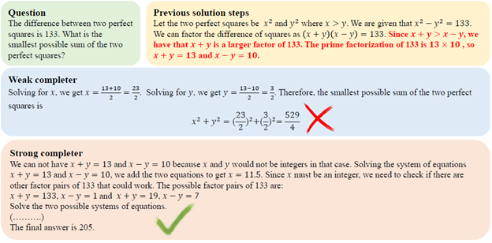
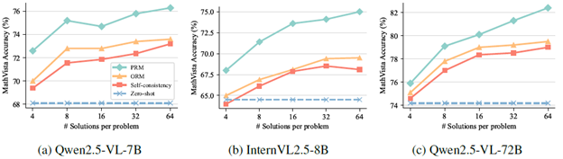

<!---
Copyright (c) 2025 Advanced Micro Devices, Inc. (AMD)

Permission is hereby granted, free of charge, to any person obtaining a copy
of this software and associated documentation files (the "Software"), to deal
in the Software without restriction, including without limitation the rights
to use, copy, modify, merge, publish, distribute, sublicense, and/or sell
copies of the Software, and to permit persons to whom the Software is
furnished to do so, subject to the following conditions:

The above copyright notice and this permission notice shall be included in all
copies or substantial portions of the Software.

THE SOFTWARE IS PROVIDED "AS IS", WITHOUT WARRANTY OF ANY KIND, EXPRESS OR
IMPLIED, INCLUDING BUT NOT LIMITED TO THE WARRANTIES OF MERCHANTABILITY,
FITNESS FOR A PARTICULAR PURPOSE AND NONINFRINGEMENT. IN NO EVENT SHALL THE
AUTHORS OR COPYRIGHT HOLDERS BE LIABLE FOR ANY CLAIM, DAMAGES OR OTHER
LIABILITY, WHETHER IN AN ACTION OF CONTRACT, TORT OR OTHERWISE, ARISING FROM,
OUT OF OR IN CONNECTION WITH THE SOFTWARE OR THE USE OR OTHER DEALINGS IN THE
SOFTWARE.
--->

# Athena-PRM: Enhancing Multimodal Reasoning with Data-Efficient Process Reward Models

This blog introduces **Athena-PRM**, a multimodal Process Reward Model (PRM) designed to evaluate the reward score for each step in solving complex reasoning problems. To efficiently generate high-quality process-labeled data, we leverage prediction consistency between weak and strong completers as a criterion for identifying reliable process labels. We also develop two effective strategies to improve the performance of PRMs: ORM initialization and up-sampling for negative data.

Athena-PRM consistently achieves superior performance across multiple benchmarks and scenarios. Notably, when using Qwen2.5-VL-7B as the policy model, Athena-PRM enhances performance by **10.2 points** on WeMath and **7.1 points** on MathVista for test-time scaling. Furthermore, Athena-PRM sets the state-of-the-art (SoTA) results in VisualProcessBench and outperforms the previous SoTA by 3.9 F1-score, showcasing its robust capability to accurately assess the correctness of the reasoning steps. Additionally, by utilizing Athena-PRM as the reward model, we develop Athena-7B using reward-ranked fine-tuning, which outperforms the baseline by a significant margin on AMD Instinct™ GPUs. You can refer to [our paper](https://arxiv.org/pdf/2506.09532?) and AMD [GitHub repository](https://github.com/AMD-AGI/Athena-PRM) for more details.

## Why consistency between weak and strong completers?

Reward models for Test Time Scaling (TTS) mainly include two types: Outcome Reward Models (ORMs) and process reward models (PRMs). ORMs evaluate the reward score for a given question and its solution, whereas PRMs provide reward scores for each intermediate reasoning step, offering fine-grained feedback. PRMs typically deliver superior performance and better out-of-distribution generalization. However, obtaining high-quality data with process labels poses significant challenges. PRM800K involves collecting 800K labeled steps through human annotations, which are time-consuming and require skilled annotators, particularly for complex multi-step reasoning and mathematical tasks. Math-Shepherd proposes an automated labeling method using Monte Carlo (MC) estimation. It defines the quality of an intermediate step as its potential to reach the correct answer. MC estimation for step-level labels is typically performed by sampling numerous reasoning trajectories using a language model, referred to as the *completer*, to estimate the probability of arriving at the correct answer. However, this approach involves significant computational overhead. Besides, another shortcoming of MC-based estimation methods is that estimated step-level labels are inevitably noisy.

<i>Figure 1. Illustration of different completers under the same question and solution steps. Even if given wrong intermediate steps, the strong completer still reaches the final answer while the weak completer fails. We omitted some intermediate steps in the figure for simplicity.</i>

We aim to address the above challenges: reducing computational costs and mitigating noisy step labels. We first find that the accuracy of step labels estimated by MC-based methods is influenced by the reasoning capability of the completer. A strong completer can arrive at the correct answer despite incorrect intermediate steps as shown in Figure 1, whereas a weak completer may struggle even with correct intermediate steps. The estimation produced by MC-based methods is biased toward the completers we use. However, the correctness of the intermediate step should not depend on the completer. Based on this insight, we propose using both weak and strong completers to estimate step labels, retaining only those steps where labels generated by both completers are consistent to remove the bias caused by completers. This approach significantly improves the quality of the step labels.

## ORM Initialization and Up-Sampling for Negative Labels

We further introduce two strategies for enhancing the performance of PRMs: initialization from ORMs and negative data up-sampling.

- **First**, initializing PRMs with ORMs trained on large-scale sample-level annotated data improves performance. Previous work indicates that ORMs possess a certain capacity to assess the correctness of intermediate steps. We empirically show that PRMs benefit from a few high-quality examples when initialized with ORMs. Large-scale sample-level annotation data provides weaker supervision, with outcome supervision acting as a simplified form of process supervision. Training ORMs on large-scale sample-level annotations serves as "pre-training", while training PRMs from pre-trained ORMs acts as "fine-tuning" with high-quality process-level annotated data.  
- **Secondly**, our findings reveal that label imbalance is prevalent in most process-labeled datasets, such as PRM800K and our synthetic data, where correct steps are more common than errors. We up-sample data with negative labels to tackle this problem and empirical results show that up-sampling data with negative labels improves performance with minimal additional computation.

## Application Scenarios

Following reward model training, we assess the performance of ORMs and PRMs in three scenarios: test-time scaling, direct judgment and reward ranked fine-tuning.

### Verification for test-time scaling
We adopt a Best-of-N evaluation paradigm. Specifically, given a problem x in the test set, we sample N solutions from policy π. All solutions are scored using a reward model, and we choose the solution with the highest score. For ORMs, we directly use the outputs from ORMs as the reward for solutions. For PRMs, the minimum reward across all steps is used to rank all solutions.

### Direct judgment for reasoning steps
Besides verification at test-time under the Best-of-N setting, Athena-PRM can also be used to directly identify erroneous steps in the mathematical reasoning process. Given a solution with K steps as input, Athena-PRM outputs the correctness score for each step in a single forward pass.

### Response ranking for reward ranked fine-tuning
We explore the use of PRMs for data synthesis in reward ranked fine-tuning. Using the current policy π, we generate M = 8 solutions for an input problem. Subsequently, we filter out solutions with incorrect answers and apply de-duplication to remove highly similar responses, enhancing the diversity of the remaining solutions. We retain queries where 2 to 6 out of 8 responses are correct, excluding those with too few or too many correct answers, as such cases are either too easy or too challenging for the current policy π. Following this filtering step, we use Athena-PRM to score all solutions for each query and select the solution with the highest reward as the corresponding label. The policy π is fine-tuned using the synthetic data generated as described above.

## Results: Accuracy on AMD hardware

Table 1 demonstrates that Athena-ORM and Athena-PRM generally enhance the reasoning performance of MLLMs across policy models of different sizes and benchmarks. Notably, Athena-PRM achieves a +10.2 points improvement on the WeMath dataset with Qwen2.5-VL-7B as the policy model, compared to the zero-shot baseline. ORMs also exhibit general improvement across all benchmarks and policy models, although some gains are limited, such as +0.4 points on MathVerse with Qwen2.5-VL-72B. In contrast, PRMs consistently show substantial performance gains over ORMs, illustrating the benefits of fine-grained rewards in test-time scaling.

<i>Table 1. Results on seven multimodal reasoning benchmarks under Best-of-N (N=8) evaluation. The best results are  highlighted.</i>

| Model | WeMath | MathVista | Math Vision | MathVerse | DynaMath | MMMU | Logic Vista |
|-------------------|-----|---------|----------|---------|--------|----|----------|
| Qwen2.5-VL-7B | 36.2 | 68.1 | 25.4 | 41.1 | 21.8 | 58.0 | 47.9 |
| Self-consistency | 44.7 | 71.6 | 28.6 | 43.7 | 22.9 | 60.1 | 49.5 |
| VisualPRM-8B | 39.8 | 70.3 | 31.3 | 44.3 | 23.0 | 58.6 | 48.3 |
| Athena-ORM | 45.1 | 72.8 | 29.8 | 44.1 | 23.1 | 62.7 | 51.3 |
| Athena-PRM | **46.4** | **75.2** | **32.5** | **46.3** | **23.4** | **63.8** | **53.0** |
| InternVL2.5-8B  | 23.5 | 64.5 | 17.0 | 22.8 | 9.4 | 56.2 | 36.0 |
| Self-consistency  | 28.4 | 66.1 | 21.1 | 24.7 | 13.8 | 57.8 | 40.2 |
| VisualPRM-8B | **36.5** | 68.5 | **25.7** | **35.8** | 18.0 | 60.2 | 43.8 |
| Athena-ORM | 28.6 | 66.9 | 22.0 | 25.8 | 15.2 | 59.1 | 40.8 |
| Athena-PRM | 30.1 | **71.4** | 23.4 | 26.1 | **18.7** | **60.3** | **44.4** |
| Qwen2.5-VL-72B| 49.1 | 74.2 | 39.3 | 47.3 | 35.9 | 70.2 | 55.7 |
| Self-consistency | 54.8 | 77.0 | 43.1 | 50.8 | 37.6 | 71.1 | 59.6 |
| Athena-ORM | 55.6 | 77.8 | 43.0 | 51.2 | 39.6 | 72.3 | 60.1 |
| Athena-PRM | **58.7** | **79.1** | **44.8** | **54.6** | **42.5** | **75.8** | **60.9** |

## Analysis

To evaluate the scalability of Athena-ORM and Athena-PRM, we compare their performance using different numbers of samples ranging from 4 to 64 on the MathVista. As shown in **Figure 2**, reward ranking for solutions at test-time improves reasoning performance across different policy models and number of samples. Specifically, ORMs and PRMs improve the self-consistency baseline by 0.8 and 2.1 points with Qwen2.5-VL-72B using eight samples, respectively. As the sample size increases, the performance improves steadily. However, the performance gain of ORMs is markedly lower than that of PRMs. For instance, Athena-PRM achieves 82.4% with Qwen2.5-VL-72B using 64 samples, while Athena-ORM achieves similar performance with a self-consistency baseline. These findings underscore the advancements and scalability of PRMs in test-time scaling scenarios.

<i>Figure 2. Best-of-N results on the MathVista across different policies. The number of solutions we sample is from 4 to 64.</i>

## Summary

In this blog, we introduce Athena-PRM, trained on 5K high-quality data with process labels. To automatically obtain accurate process labels, we employ a data filtering method based on consistency between weak and strong completers. This strategy significantly reduces computational costs for training and data synthesis while ensuring precise process labels for training PRMs. Athena-PRM demonstrates substantial performance improvements in Best-of-N evaluations, achieving state-of-the-art results on VisualProcessBench. Leveraging Athena-PRM, we train Athena-7B, fine-tuned from Qwen2.5-VL-7B using a reward ranked fine-tuning approach, markedly enhancing the reasoning capabilities of Qwen2.5-VL-7B.

You are welcome to download and try this model on AMD platforms. For more details on training, inferencing and insights of this model, see [our paper](https://arxiv.org/pdf/2506.09532?), and AMD [GitHub repository](https://github.com/AMD-AGI/Athena-PRM) to access to the code. AMD also offers a dedicated cloud infrastructure with the latest GPU instances, visit [AMD Developer Cloud](https://www.amd.com/en/developer/resources/cloud-access/amd-developer-cloud.html) to request access and redeem your developer cloud credits.

For any questions, you may reach out to the AMD team at &lt;amd_ai_mkt@amd.com&gt;.

## Disclaimers

Third-party content is licensed to you directly by the third party that owns the content and is not licensed to you by AMD. ALL LINKED THIRD-PARTY CONTENT IS PROVIDED "AS IS" WITHOUT A WARRANTY OF ANY KIND. USE OF SUCH THIRD-PARTY CONTENT IS DONE AT YOUR SOLE DISCRETION AND UNDER NO CIRCUMSTANCES WILL AMD BE LIABLE TO YOU FOR ANY THIRD-PARTY CONTENT. YOU ASSUME ALL RISK AND ARE SOLELY RESPONSIBLE FOR ANY DAMAGES THAT MAY ARISE FROM YOUR USE OF THIRD-PARTY CONTENT.
