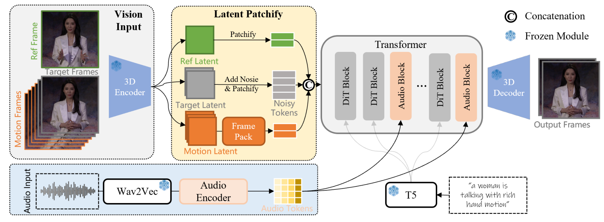
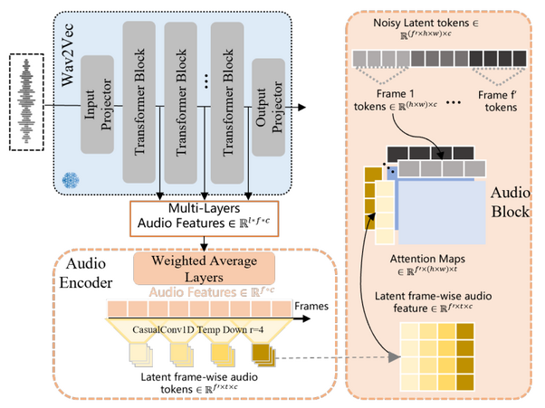

<!---
Copyright (c) 2025 Advanced Micro Devices, Inc. (AMD)

Permission is hereby granted, free of charge, to any person obtaining a copy
of this software and associated documentation files (the "Software"), to deal
in the Software without restriction, including without limitation the rights
to use, copy, modify, merge, publish, distribute, sublicense, and/or sell
copies of the Software, and to permit persons to whom the Software is
furnished to do so, subject to the following conditions:

The above copyright notice and this permission notice shall be included in all
copies or substantial portions of the Software.

THE SOFTWARE IS PROVIDED "AS IS", WITHOUT WARRANTY OF ANY KIND, EXPRESS OR
IMPLIED, INCLUDING BUT NOT LIMITED TO THE WARRANTIES OF MERCHANTABILITY,
FITNESS FOR A PARTICULAR PURPOSE AND NONINFRINGEMENT. IN NO EVENT SHALL THE
AUTHORS OR COPYRIGHT HOLDERS BE LIABLE FOR ANY CLAIM, DAMAGES OR OTHER
LIABILITY, WHETHER IN AN ACTION OF CONTRACT, TORT OR OTHERWISE, ARISING FROM,
OUT OF OR IN CONNECTION WITH THE SOFTWARE OR THE USE OR OTHER DEALINGS IN THE
SOFTWARE.
--->

# Accelerating Audio-Driven Video Generation: WAN2.2-S2V on AMD ROCm

Audio-driven video generation is rapidly evolving, opening new possibilities for creative content and intelligent automation. In this blog, we showcase how AMD Instinct MI300X GPUs and the ROCm software stack empower cutting-edge models like [Wan2.2-S2V](https://huggingface.co/Wan-AI/Wan2.2-S2V-14B) to deliver high-quality, expressive character animation at scale.

Current methods for audio-driven character animation work well for simple speech and singing. However, they often struggle with the complexity needed for film and television, where characters must move naturally and interact in dynamic scenes. Wan-S2V addresses these challenges by enabling expressive, realistic character animation in cinematic contexts, going beyond talking heads to support complex scenarios and long video generation through optimized motion control and efficient model variants.

Wan-S2V uses several types of input:

- **Image:** Defines the character’s appearance.
- **Text prompt (optional but highly recommended):** Guides the overall scene, camera angles, and major actions.
- **Audio track:** Controls detailed, time-sensitive actions such as lip sync, precise hand gestures and head orientation, and facial expressions.
- **Pose video (optional):** Provides motion cues to help generate more realistic and expressive body movements.

This approach allows the model to generate videos where characters not only talk or sing, but also move and react in ways that feel natural and lively.

## Under the Hood


<figure style="text-align: left;">
  <figcaption>
    Overview of Wan-S2V model pipeline<br>
    <a href="https://arxiv.org/pdf/2508.18621">Source: WAN-S2V Technical Report</a>
  </figcaption>
</figure>
As you can see in the block diagram above, at the core of WAN-S2V is a video model known as WAN-14B. Here's a brief summary of the model framework:

### How the Video is Handled

Raw video frames (RGB images) are extremely large and computationally intensive to process directly. To address this, the first step is to compress the video using a 3D VAE (Variational Autoencoder). Each frame is converted into a compact latent representation, similar to turning a full-resolution photo into an abstract symbol that the model can efficiently process.

During training, noise is added to these latent representations, and the model is trained to recover the clean version. Over time, the model learns how to transform random noise into realistic video sequences.

### How the Audio Comes In

Video alone is not sufficient for natural character animation; we also want characters to move their lips accurately, express emotions, and follow musical rhythms.

To incorporate sound, WAN-S2V uses [Wav2Vec](https://www.isca-archive.org/interspeech_2019/schneider19_interspeech.pdf), a robust speech model, to extract features from the raw audio waveform. Shallow layers capture rhythm and emotion, such as intonation and musical beats, while deeper layers capture the actual content of the speech.

As shown in the audio injection pipeline diagram below, these features are combined using learnable weights to create a comprehensive audio representation. The model then applies a series of 1D causal convolutions to compress the audio features so they align with the video frames, ensuring each frame has its corresponding audio information. Instead of allowing the audio to interact with all video tokens—which would be computationally expensive—the model restricts interaction to each frame’s visual tokens. This approach maintains computational efficiency and ensures accurate lip-sync and rhythm alignment.


<figure style="text-align: left;">
  <figcaption>
    Audio injection pipeline<br>
    <a href="https://arxiv.org/pdf/2508.18621">Source: WAN-S2V Technical Report</a>
  </figcaption>
</figure>

### How Long Videos are Handled

The hardest part of long video generation is memory: the model needs to remember what happened before, but storing all past frames is impossible.
WAN-S2V addresses this with [FramePack](https://arxiv.org/abs/2504.12626), a compression technique that aggressively compresses the motion latents of older frames while preserving richer detail in recent frames. This allows the model to remember earlier content and maintain continuity without overwhelming computational or memory resources.

## Implementation

In the following sections, you’ll find step-by-step instructions for running audio-driven video generation tasks with WAN2.2-S2V, covering environment setup, practical use cases, and both single- and multi-GPU inference.

### 1. Launch the Docker Container

Inference was performed using the PyTorch for ROCm training Docker (rocm/pytorch-training:v25.6). For details on supported hardware, see the [list of supported OSs and AMD hardware](https://rocm.docs.amd.com/projects/install-on-linux/en/latest/reference/system-requirements.html).
For this blog, we used an AMD Instinct MI300X GPU with 192 GB VRAM, which accommodates the Wan2.2-S2V-14B model.

To get started, pull the specified docker image and run a container with the code below in a Linux shell:

```bash
docker run -it --ipc=host --cap-add=SYS_PTRACE --network=host \
  --device=/dev/kfd --device=/dev/dri --security-opt seccomp=unconfined \
  --group-add video --name wanaudio \
  -v $(pwd):/workspace -w /workspace rocm/pytorch-training:v25.6
```

This container includes most of the libraries required for inference, so you typically do not need to install them separately during setup.

- `torch==2.8.0a0+git7d205b2`
- `flash_attn==3.0.0.post1`
- `transformers==4.46.3`

### 2. Install Dependencies

First, clone the Wan2.2 repository:

```bash
git clone https://github.com/Wan-Video/Wan2.2.git
cd Wan2.2
```

To ensure consistent results and reproducibility, we use a recent tested commit of the Wan2.2 repository. This helps avoid unexpected changes from ongoing development.

```bash
git checkout 13d3d8499d9f122451b0f7e384903b05e77e8281
```

**FFmpeg** is required for merging generated video and audio files.  
If it’s not already installed, you can add it using one of the following methods:

```bash
# Using conda
conda install -c conda-forge ffmpeg

# Using apt (Ubuntu/Debian)
apt-get update
apt-get install -y ffmpeg
```

#### Base Libraries

Install the following libraries to enable core Wan2.2 functionality, e.g., text-to-video and image-to-video generation.
You may also edit your `requirements.txt` for easier setup:

```bash
# accelerate library is recommended for faster and more memory-efficient model loading
pip install \
  easydict \
  "diffusers>=0.31.0" \
  ftfy \
  dashscope \
  imageio-ffmpeg \
  "accelerate>=1.1.1" \
  "peft>=0.17.0"
```

#### Additional Requirements for S2V Tasks

For s2v functionality, install the dependencies listed in `requirements.s2v.txt`:

```bash
pip install -r requirements_s2v.txt
```

### 3. Model Download

Download the Wan2.2-S2V-14B model weights using huggingface-cli:

```bash
pip install "huggingface_hub[cli]"
huggingface-cli download Wan-AI/Wan2.2-S2V-14B --local-dir ./Wan2.2-S2V-14B
```

Now you are ready to make your images speak! We will use input images and soundtracks from the [rocm blogs](https://github.com/ROCm/rocm-blogs) GitHub repository, under the `rocm-blogs/blogs/artificial-intelligence/audio-driven-videogen` folder.

## Use Cases

### Use Case 1: Cat Talking

This example demonstrates a sound-to-video generation task with the Wan2.2-S2V-14B model under the hood. The `--num_clip` parameter sets the number of video clips. If omitted, the video length automatically matches the input audio.

The command below requires a GPU with at least **80GB VRAM**. An AMD Instinct MI300X GPU is more than sufficient for this task.

#### Inference on a Single GPU

```bash
# Place the input images in the /images directory and your input audio files in the /audios directory.
python generate.py \
  --task s2v-14B \
  --size 1024*704 \
  --ckpt_dir ./Wan2.2-S2V-14B/ \
  --offload_model True \
  --convert_model_dtype \
  --prompt "Summer beach vacation style, a white cat wearing sunglasses sits on a surfboard." \
  --image "images/cat.png" \
  --audio "audios/cat.wav"
```

The input image has a resolution of 472 × 816 pixels, and the audio track duration is 7 seconds. Generation on a single MI300X GPU required approximately 19 minutes and 39 seconds.

#### Multi-GPU Inference Using FSDP + DeepSpeed Ulysses

The `--ulysses_size` parameter specifies the number of GPUs used for all-to-all (Ulysses) communication, while `--ring_size` sets the number of GPUs for peer-to-peer (Ring-Attention) communication.
For the Wan2.2 model, optimal performance is typically achieved by setting `--ulysses_size` equal to the total number of GPUs (e.g., 4) and `--ring_size` to 1.
However, the best settings may vary depending on your hardware and workload, so users are encouraged to experiment with these parameters to find the most effective configuration for their environment.

```bash
torchrun --nproc_per_node=4 generate.py \
  --task s2v-14B \
  --size 1024*704 \
  --ckpt_dir ./Wan2.2-S2V-14B/ \
  --dit_fsdp \
  --t5_fsdp \
  --ulysses_size 4 \
  --prompt "Summer beach vacation style, a white cat wearing sunglasses sits on a surfboard." \
  --image "images/cat.png" \
  --audio "audios/cat.wav"
```

The generation process using four MI300X GPUs required approximately 9 minutes and 40 seconds.
Below is a comparison between the original image used as input with the generated output video.

```{video} videos/output_video_cat.mp4
:width: 974
:height: 866
:controls:
```

### Use Case 2: Einstein Singing

This example tests how well the model handles singing.

#### Single-GPU Inference

```bash
python generate.py \
  --task s2v-14B \
  --size 704*1024 \
  --ckpt_dir ./Wan2.2-S2V-14B/ \
  --offload_model True \
  --convert_model_dtype \
  --prompt "A creative video of Einstein singing a sea shanty." \
  --image "images/man.png" \
  --audio "audios/sailor.mp3"
```

For this use case, the input image is 768 × 1024 pixels and the audio track is 8 seconds long. Generation on a single MI300X GPU took about 36 minutes.

#### Multi-GPU Inference

```bash
torchrun --nproc_per_node=4 generate.py \
  --task s2v-14B \
  --size 704*1024 \
  --ckpt_dir ./Wan2.2-S2V-14B/ \
  --dit_fsdp \
  --t5_fsdp \
  --ulysses_size 4 \
  --prompt "A creative video of Einstein singing a sea shanty." \
  --image "images/man.png" \
  --audio "audios/sailor.mp3"
```

Four-GPU inference was completed in about 15 minutes and 53 seconds. Now you can compare the original image and the generated video.

```{video} videos/output_video_man.mp4
:width: 1024
:height: 728
:controls:
```

## Summary

For more use cases and detailed instructions, please refer to the [WAN-S2V website](https://humanaigc.github.io/wan-s2v-webpage/).

This blog demonstrates how the Wan2.2-S2V model, powered by AMD Instinct GPUs (such as the MI300X) and the ROCm software stack, enables high-quality, audio-driven video generation at scale. By combining image, text, audio, and pose inputs, Wan2.2-S2V produces expressive and realistic character animations suitable for advanced creative workflows. Our benchmarks show significant performance gains with multi-GPU setups, making long and complex video generation more practical and efficient.

We continue to prioritize usability and performance across a range of video generation tasks, as highlighted in recent blog posts on [VACE video editing](https://rocm.blogs.amd.com/artificial-intelligence/video-editing-models/README.html), [Fine-tuning of video generation model Wan2.2](https://rocm.blogs.amd.com/artificial-intelligence/finetuning-wan-part1/README.html), [Accelerating FastVideo on AMD GPUs with TeaCache](https://rocm.blogs.amd.com/artificial-intelligence/fastvideo-v1/README.html), [A Simple Design for Serving Video Generation Models with Distributed Inference](https://rocm.blogs.amd.com/artificial-intelligence/serving-videogen-v1/README.html) and [ComfyUI - a graphical user interface for video generation](https://rocm.blogs.amd.com/software-tools-optimization/comfyui-on-amd/README.html). In addition, we are developing new playbooks to support model inference, model serving, and workflow management for video generation.

## Acknowledgements

We gratefully acknowledge the authors of the [Wan-S2V Technical Report](https://arxiv.org/pdf/2508.18621), whose significant work in the GenAI community provided the foundation for this blog.

## Disclaimers

Third-party content is licensed to you directly by the third party that owns the content and is not licensed to you by AMD. ALL LINKED THIRD-PARTY CONTENT IS PROVIDED “AS IS” WITHOUT A WARRANTY OF ANY KIND. USE OF SUCH THIRD-PARTY CONTENT IS DONE AT YOUR SOLE DISCRETION AND UNDER NO CIRCUMSTANCES WILL AMD BE LIABLE TO YOU FOR ANY THIRD-PARTY CONTENT. YOU ASSUME ALL RISK AND ARE SOLELY RESPONSIBLE FOR ANY DAMAGES THAT MAY ARISE FROM YOUR USE OF THIRD-PARTY CONTENT.
