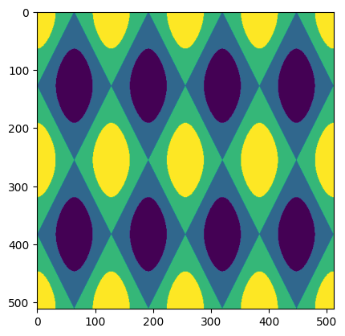
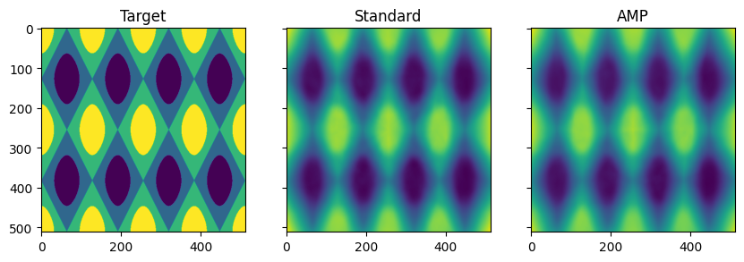

# Automatic mixed precision in PyTorch using AMD GPUs

As models increase in size, the time and memory needed to train them--and consequently, the cost--also increases. Therefore, any measures we take to reduce training time and memory usage can be highly beneficial. This is where Automatic Mixed Precision (AMP) comes in.

In this blog, we will discuss the basics of AMP, how it works, and how it can improve training efficiency on AMD GPUs.

## Prerequisites

To run the code used in this blog, you will need the following:

* Hardware
  * AMD GPU - see the [list of compatible GPUs](https://rocm.docs.amd.com/projects/install-on-linux/en/latest/reference/system-requirements.html#supported-gpus)
* OS
  * Linux - see [supported Linux distributions](https://rocm.docs.amd.com/projects/install-on-linux/en/latest/reference/system-requirements.html#supported-operating-systems)
* Software
  * ROCm - see the [installation instructions](https://rocm.docs.amd.com/projects/install-on-linux/en/latest/tutorial/quick-start.html)

## Running this blog

There are two ways to run the code in this blog:

1. Docker (recommended)
2. Build your own Python environment.

### Running in Docker

Using Docker is the easiest and most reliable way to construct the required environment.

* Ensure you have Docker installed. See the [installation instructions](https://docs.docker.com/get-docker/)

* Ensure you have `amdgpu-dkms` installed (this is installed with ROCm) on the host, which allows for accessing the GPUs from inside the Docker container. See the ROCm Docker instructions provided [here](https://rocm.docs.amd.com/projects/install-on-linux/en/latest/how-to/docker.html).

* Clone the following repo, and `cd` into the blog directory

    ```shell
    git clone https://github.com/ROCm/rocm-blogs.git
    cd rocm-blogs/blogs/artificial-intelligence/automatic-mixed-precision
    ```

* Build and start the container. For details on the build process, see the `dockerfile` located in the `docker` directory. This will start a Jupyter lab server.

    ```shell
    cd docker
    docker compose build
    docker compose up
    ```

* In your browser, navigate to http://localhost:8888 and open the file `amp_blog.py` in notebook format (to do this, right click on the file, and select "Open with...." and "Notebook")

    ```{note}
    This notebook is a [Jupytext paired notebook](https://jupytext.readthedocs.io/en/latest/paired-notebooks.html), in py:percent format.
    ```

### Build your own Python environment

Alternatively, if you do not wish to use a Docker contain, see [running on host](#running-on-host) section in the Appendix for instructions on building your own Python environment.

Great! Now we're ready to dig into Automatic Mixed Precision!

## What is mixed precision?

By default, most ML frameworks, including, PyTorch use 32-bit floating point (often referred to as full or single precision). However, using lower precision formats, such as `float16` (half-precision) has the potential to increase training speeds and reduce memory usage.

Half-precision operations provide numerous benefits during training:

* Lower memory footprint: this may allow for larger models to fit in memory, an increase in the batch size, or both.
* Faster data transfer: since the amount of data that is transferred between different components in the system has effectively been reduced by a factor of 2x, this allows for increased training speeds, especially for gradient broadcasting during multi-GPU or multi-node training.
* Faster math operations: by reducing the number of bits in the operation, this decreases the complexity and allows for an increase training and inference speeds.

However, training a model entirely in half-precision can have some challenges. These challenges include the risk of loss of accuracy in computations, as well as issues such as vanishing or exploding gradients, which can degrade the performance of the model. This is where AMP comes in.

ROCm has support for a wide variety of datatypes and precisions - for full details see [ROCm Precision Support](https://rocm.docs.amd.com/en/latest/about/compatibility/precision-support.html).

## Automatic mixed precision

AMP allows us to overcome these difficulties with little to no changes in the existing code by using the following three key concepts:

* Maintain a full-precision copy of the model weights during training.
* Use half-precision operations where possible, but fallback to full-precision operations when precision is important, such as in accumulation operations.
* Use gradient scaling to combat gradient underflow.

Next, we will see how `torch.autocast` can be used to train a network with automatic mixed precision.

First, we import the following packages:

```python
import gc
import time
import numpy as np
import torch
import matplotlib.pyplot as plt
```

## Torch autocast

[`torch.autocast`](https://pytorch.org/docs/stable/amp.html#torch.autocast) is a context manager that allows the wrapped region of code to run in automatic mixed precision. Wrapped operations will automatically downcast to lower precision, depending on the operation type, in order to improve speed and decrease memory usage.

First, let's take a look and what `torch.autocast` does in a very simple example:

```python
def test_amp():
    """Test type casting of torch.autocast"""
    device = "cuda" if torch.cuda.is_available() else "cpu"

    # Create two vectors of size N
    x = torch.rand((1024, 1), device=device)
    y = torch.rand((1024, 1), device=device)
    print(f"Input dtypes:\n  x: {x.dtype}\n  y: {y.dtype}")

    # Perform operations with autocast enabled
    with torch.autocast(device_type=device):
        a = x @ y.T  # Eligible for autocast
        b = x + y  # Not eligible

    # Print resulting data types
    print(f"Output dtypes:\n  Multiplication: {a.dtype}\n  Addition: {b.dtype}")


test_amp()
```

``` shell
Input dtypes:
    x: torch.float32
    y: torch.float32
Output dtypes:
    Multiplication: torch.float16
    Addition: torch.float32
```

In this example, we can see both input tensors (`x` and `y`) are of type `float32`. `torch.autocast` automatically performs matrix multiplication in half-precision while maintaining full precision for the addition operation. Here, our input tensors (x, y) are analogous to our model weights, while the outputs (a, b) are analogous to model activations and outputs.

```{note}
While it's technically possible to perform addition in lower precision, `torch.autocast` _chooses_ to maintain full precision for addition operations, as they are more vulnerable to loss of precision and accumulation of errors. For full details on which ops are eligible for autocast, see [Autocast Op Reference](https://pytorch.org/docs/stable/amp.html#autocast-op-reference).
```

## Adding autocast to a training loop

Adding `torch.autocast` to a training loop is simple: Just wrap the forward pass and loss with the context manager introduced above.

First, a snippet of a typical training loop _without_ autocast:

```python
# Define model, optimizer, loss_fn, etc
...
for epoch in epochs:
    for inputs, targets in batches:
        opt.zero_grad()
        outputs = model(inputs)
        loss = loss_fn(outputs,targets)
        loss.backward()
        opt.step()
```

We can augment the above loop to use `torch.autocast` as follows. Notice that we _only_ wrap the forward pass and loss calculation in autocast. The backward pass and optimizer step must be performed outside of `autocast`:

```python
...
for epoch in epochs:
    for inputs, targets in batches:
        opt.zero_grad()
        with torch.autocast(device_type='cuda'):  # Wrap forward pass and loss calc only
            outputs = model(inputs)
            loss = loss_fn(outputs,targets)
        loss.backward()
        opt.step()
```

## GradScaler

In mixed precision training, gradients may underflow, resulting in values that flush to zero. To address this issue, the [`torch.cuda.amp.GradScaler`](https://pytorch.org/docs/stable/amp.html#torch.cuda.amp.GradScaler) can be utilized during training. This scaler mitigates underflow by adjusting gradients based on a scale factor at each iteration. Typically, large scale factors are employed, on the order of $2^{16}$. However, to prevent potential issues, the scaler dynamically updates the scale factor during training by monitoring for infinities or NaN (Not a Number) gradient values. If any such values are encountered in a given iteration, the optimizer step is skipped, and the scale factor is adjusted downwards.

Using a `GradScaler` in training is fairly straightforward. We initialize a scaler object, which is then used to scale the loss before applying it to update the model's parameters with the optimizer. After the optimizer step, the scaler is updated to ensure proper scaling for the next iteration of training.

Below is a code snippet demonstrating how to add a GradScaler to a mixed precision training loop. Note the following differences:

* Instantiate a `GradScaler` outside the training loop
* `loss.backward()` -> `scaler.scale(loss).backward()`: This will scale the loss before performing backward pass, creating scaled gradients
* `opt.step()` -> `scaler.step(opt)`: `scaler.step` unscales the gradients and then applies them. If `inf`s or `NaN`s are encountered, the step is skipped
* Add a finall call to `scaler.update()`: Update scaler coefficient if `inf`s or `NaN`s were encountered

```python
# Define model, optimizer, loss_fn, etc
...
# Instantiate a single scaler for the entire training run
scaler = torch.cuda.amp.GradScaler()

for epoch in epochs:
    for inputs, targets in batches:
        opt.zero_grad()
        with torch.autocast(device_type='cuda'):
            outputs = model(inputs)
            loss = loss_fn(outputs,targets)

        scaler.scale(loss).backward() # Scale loss, and perform backward pass
        scaler.step(opt)              # Take a step
        scaler.update()               # Update scaler's scale factor
```

## Training with Automatic Mixed Precision

Lets bring it all together and demonstrate training with Automatic Mixed Precision and Gradient Scaling.

First, let's create a context manager to help us measure both run time and max memory usage:

```python
class TorchMemProfile:
    """Context manager to measure run time and max memory allocation"""

    def __enter__(self):
        gc.collect()
        torch.cuda.empty_cache()
        torch.cuda.reset_peak_memory_stats()
        torch.cuda.synchronize()
        self.start_time = time.time()
        return self

    def __exit__(self, exc_type, exc_value, exc_tb):
        self.end_time = time.time()
        torch.cuda.synchronize()
        self.duration = self.end_time - self.start_time
        self.max_memory_allocated = torch.cuda.max_memory_allocated()
```

### Example Problem

Next, let's build a simple neural network model and define an example problem. AMP is particularly beneficial in networks with (a) higher computational load, and (b) large activations relative to parameters (such as convolutions or attention). As such, we'll create a simple convolutional network designed to predict a quantized 2D sine wave.

The model inputs will be a `(2,512,512)` tensor, where `(512,512)` is the image size, and the first two dimensions (channels) are the X and Y coordinates each point on the grid (e.g. the values at "pixel" `(0,0)` are `(0,0)`, `(511,0)` are `(1,0)`, etc). The output will be a `(1,512,512)` tensor, where the value at each pixel is the predicted value of the 2D sine wave at that coordinate.

Here, we generate a quantized 2D sinusoid wave by:

* Generate a 2D grid of specified size.
* Compute the value of cosine at each point.
* Discretize into four levels, thus adding discontinuity in order to make the problem more difficult.

```python
def generate_grid(shape):
    """
    Generate a grid with the given shape.

    Returns a numpy array with shape (2,shape), containing the x,y coordinates at each
    position on the grid. Coordinates are standardized to the interval [0,1].
    """
    x = np.arange(shape[0]) / (shape[0] - 1)
    y = np.arange(shape[1]) / (shape[1] - 1)
    xx, yy = np.meshgrid(x, y)
    grid = np.stack([xx, yy])
    return grid


def generate_quantized_sin(grid, frequency, n_bins=4):
    """
    Given a 2D grid and frequency, compute a sinusoid at each point on the grid. Then quantize the output
    into the desired number of bins
    """
    out = np.cos(grid[0, :] * frequency[0] * 2 * np.pi) + np.cos(
        grid[1, :] * frequency[1] * 2 * np.pi
    )

    bins = np.linspace(out.min(), out.max(), n_bins + 1)[:n_bins]

    out = np.digitize(out, bins)
    # Standardize to [0,1]
    out = (out - out.min()) / (out.max() - out.min())

    return out


# Generate our input and target.
# The input is a 2D grid of coordinates, and the target
shape = (512, 512)
frequency = (4, 2)
inputs = generate_grid(shape)
targets = generate_quantized_sin(inputs, frequency)

# Expand dimensions for training, and cast to torch tensors
inputs = np.expand_dims(inputs, axis=0)
targets = np.expand_dims(targets, axis=(0, 1))
inputs = torch.tensor(inputs, dtype=torch.float32).cuda()
targets = torch.tensor(targets, dtype=torch.float32).cuda()

print(f"Input shape:  {inputs.shape}")
print(f"Target shape: {targets.shape}")

# Plot the target
fig, ax = plt.subplots()
ax.imshow(targets.cpu().squeeze())
plt.show()
```

``` shell
Input shape:  torch.Size([1, 2, 512, 512])
Target shape: torch.Size([1, 1, 512, 512])
```



The figure above shows the target that our network will attempt to learn.

### The network

Next, let's define a simple convolutional neural network. The input is a 2D "image", where the channels are the (x, y) coordinates at a given location, and the outputs are the value of the sinusoid at each point. The model is composed of a series of convolutional layers, batch normalization, and activation functions.

```python
class ConvModel(torch.nn.Module):
    def __init__(self, hidden_size=256, n_hidden_layers=2):
        super().__init__()
        layers = [
            torch.nn.Conv2d(2, hidden_size, 1),
            torch.nn.BatchNorm2d(hidden_size),
            torch.nn.ReLU(),
        ]
        for i in range(n_hidden_layers):
            layers += [
                torch.nn.Conv2d(hidden_size, hidden_size, 1),
                torch.nn.BatchNorm2d(hidden_size),
                torch.nn.ReLU(),
            ]
        layers += [torch.nn.Conv2d(hidden_size, 1, 1)]
        self.model = torch.nn.Sequential(*layers)

    def forward(self, x):
        return self.model(x)
```

Now, let's compare the training time and the memory usage when using standard vs. AMP-enabled training.

### Standard training loop

First, let's define a "standard" training loop. We initialize our model, loss and optimizer, and then perform a standard loop for `n_epochs` (for simplicity, epoch is just a single example).

```python
def test_standard_training(n_epochs, inputs, targets, hidden_size, n_hidden_layers):
    """Test a standard training loop"""
    model = ConvModel(hidden_size, n_hidden_layers).cuda()
    loss_fn = torch.nn.MSELoss()
    opt = torch.optim.Adam(model.parameters(), 0.001)

    with TorchMemProfile() as profile:
        for i in range(n_epochs):
            opt.zero_grad()

            outputs = model(inputs)
            loss = loss_fn(outputs, targets)
            loss.backward()
            opt.step()

    return profile, loss, outputs
```

### AMP training loop

Next, lets define a training loop with AMP. We can see several key differences (each difference is commented in the code):

* We instantiate a `torch.cuda.amp.GradScaler`, which will be used to scale gradients to prevent overflow or underflow
* We wrap the forward pass and loss calculation in `torch.autocast`

```{note}
We do **not** wrap the backwards pass or optimizer step. These steps will still run in lower precision where possible, but will be upcasted as necessary, such as when updating weights.
```

```python
def test_amp_training(n_epochs, inputs, targets, hidden_size, n_hidden_layers):
    """Training loop with automatic mixed precision"""
    model = ConvModel(hidden_size, n_hidden_layers).cuda()
    loss_fn = torch.nn.MSELoss()
    opt = torch.optim.Adam(model.parameters(), 0.001)

    scaler = torch.cuda.amp.GradScaler()             # Create a grad scaler

    with TorchMemProfile() as profile:
        for i in range(n_epochs):
            opt.zero_grad()
            with torch.autocast(device_type="cuda"):  # Wrap only the forward pass and loss in autocast
                outputs = model(inputs)
                loss = loss_fn(outputs, targets)
            scaler.scale(loss).backward()             # Scale loss, then call backward
            scaler.step(opt)                          # Use the scaler to take a step
            scaler.update()                           # Additional call to update scaler

    return profile, loss, outputs
```

### Standard vs AMP performance

Finally, lets test the relative performance of our standard vs AMP training loops.

```python
# Define training parameters
n_epochs = 512
hidden_size = 256
n_hidden_layers = 2

# Run standard training
profile, loss, outputs = test_standard_training(n_epochs, inputs, targets, hidden_size, n_hidden_layers)

# Run AMP training
profile_amp, loss_amp, outputs_amp = test_amp_training(n_epochs, inputs, targets, hidden_size, n_hidden_layers)
```

```python
print("Standard training:")
print(f"  Total time: {profile.duration:0.4f}s")
print(f"  Loss: {loss:0.4g}")
print(f"  Max memory allocated: {profile.max_memory_allocated/1024**2:0.4g} MB")

print("\nAMP training:")
print(f"  Total time: {profile_amp.duration:0.4f}s")
print(f"  Loss: {loss_amp:0.4g}")
print(f"  Max memory allocated: {profile_amp.max_memory_allocated/1024**2:0.4g} MB")

print(f"\nTraining speedup: {(1-profile_amp.duration/profile.duration)*100:0.2f}%")
print(f"Memory savings: {(1-profile_amp.max_memory_allocated/profile.max_memory_allocated)*100:0.2f}%")
```

``` shell
Standard training:
Total time: 13.9817s
Loss: 0.01
Max memory allocated: 2061 KB

AMP training:
Total time: 7.4969s
Loss: 0.008296
Max memory allocated: 1035 KB

Training speedup: 46.38%
Memory savings: 49.79%
```

**Training with AMP increased training speed by 46% and reduced memory usage by nearly 50%!** Furthermore, we did not experience loss in performance; indeed, our AMP-enabled training resulted in slightly lower loss.

We can also visualize the outputs of both models to check that they are learning as we expect. We see that both standard and AMP training are successfully approximating our discretized 2D sinusoid.

```python
fig, ax = plt.subplots(1, 3, sharex=True, sharey=True, figsize=(10, 4))
ax[0].imshow(targets.squeeze().cpu())
ax[1].imshow(outputs.squeeze().detach().cpu())
ax[2].imshow(outputs_amp.squeeze().detach().cpu())
ax[0].set_title("Target")
ax[1].set_title("Standard")
ax[2].set_title("AMP")
plt.show()
```



## Inference with Automatic Mixed Precision

We can also speed up inference using AMP by wrapping the inference forward pass.

To demonstrate, we'll define both a standard and an AMP inference function. Note that we do _not_ need a `GradScaler` for AMP inference (as there are no gradients!), we only need to wrap the forward pass in `torch.autocast`:

```python
def test_standard_inference(n_epochs, inputs, hidden_size, n_hidden_layers):
    """Test a standard training loop"""
    model = ConvModel(hidden_size, n_hidden_layers).cuda()
    model.eval()

    with TorchMemProfile() as profile:
        for i in range(n_epochs):
            outputs = model(inputs)

    return profile


def test_amp_inference(n_epochs, inputs, hidden_size, n_hidden_layers):
    """Test a standard training loop"""
    model = ConvModel(hidden_size, n_hidden_layers).cuda()
    model.eval()

    with TorchMemProfile() as profile:
        for i in range(n_epochs):
            with torch.autocast(device_type="cuda"):
                outputs = model(inputs)

    return profile
```

```python
# Run standard training
inf_profile = test_standard_inference(n_epochs, inputs, hidden_size, n_hidden_layers)

# Run AMP training
inf_profile_amp = test_amp_inference(n_epochs, inputs, hidden_size, n_hidden_layers)
```

```python
print("Standard inference:")
print(f"  Total time: {inf_profile.duration:0.4f}s")
print(f"  Max memory allocated: {inf_profile.max_memory_allocated/1024**2:0.4g} MB")

print("\nAMP inference:")
print(f"  Total time: {inf_profile_amp.duration:0.4f}s")
print(f"  Max memory allocated: {inf_profile_amp.max_memory_allocated/1024**2:0.4g} MB")

print(f"\nSpeedup: {(1-inf_profile_amp.duration/inf_profile.duration)*100:0.2f}%")
print(f"Memory savings: {(1-inf_profile_amp.max_memory_allocated/inf_profile.max_memory_allocated)*100:0.2f}%")
```

``` shell
Standard inference:
    Total time: 4.2401s
    Max memory allocated: 3338 MB

AMP inference:
    Total time: 2.8737s
    Max memory allocated: 1676 MB

Speedup: 32.23%
Memory savings: 49.79%
```

Again, we see a nearly 50% reduction in maximum memory usage. However, the speedup during inference is only 32%, compared to the 46% observed during training. This difference is because a portion of the speedup is achieved during the backward pass, which is not applicable during inference.

## References

* [PyTorch AMP Tutorial](https://pytorch.org/tutorials/recipes/recipes/amp_recipe.html)
* [PyTorch autocast op reference](https://pytorch.org/docs/stable/amp.html#autocast-op-reference)
* [Faster Training with Mixed Precision - Effective ML](https://effectivemachinelearning.com/PyTorch/8._Faster_training_with_mixed_precision)

## Appendix

### Running on host

If you don't want to use Docker, you can also run the code used in this blog directly on your machine - although it takes a little more work.

* Prerequisites:

  * Install ROCm 6.0.x
  * Ensure you have Python 3.11 installed
  * Install [PDM](https://pdm-project.org/latest/) - used here for creating reproducible Python environments

* Create the Python virtual environment in the root directory of this blog, and install all dependencies:

    ```shell
    pdm sync
    ```

* Start the notebook

    ```shell
    pdm run jupyter-lab
    ```

Navigate to https://localhost:8888 and run the blog

## Disclaimers

Third-party content is licensed to you directly by the third party that owns the content and is
not licensed to you by AMD. ALL LINKED THIRD-PARTY CONTENT IS PROVIDED “AS IS”
WITHOUT A WARRANTY OF ANY KIND. USE OF SUCH THIRD-PARTY CONTENT IS DONE AT
YOUR SOLE DISCRETION AND UNDER NO CIRCUMSTANCES WILL AMD BE LIABLE TO YOU FOR
ANY THIRD-PARTY CONTENT. YOU ASSUME ALL RISK AND ARE SOLELY RESPONSIBLE FOR ANY
DAMAGES THAT MAY ARISE FROM YOUR USE OF THIRD-PARTY CONTENT.
