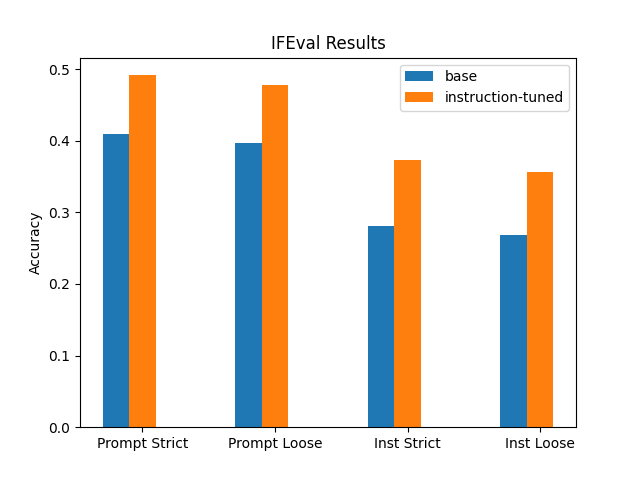

# Fine-tuning Llama 3 with Axolotl using ROCm on AMD GPUs

## Introduction

Large Language Models (LLMs) have revolutionized the field of natural language processing, enabling machines to understand and generate human-like language. However, these models are often trained on vast amounts of general-purpose data, which can make them less effective for specific tasks or domains. Fine-tuning involves training a pre-trained LLM on a specialized dataset to enhance its performance on specific tasks. As Andrej Karpathy analogized, this process is akin to allowing someone to practice a particular skill. Just as a person might need to practice a skill in a specific context to become proficient, an LLM needs to be fine-tuned on a specific dataset to become proficient in a particular task. For instance, an LLM can be fine-tuned for tasks such as financial forecasting, technical support, legal advising, medical diagnosis, or even instruction following. By fine-tuning an LLM, organizations can achieve better results and improve information security by limiting the exposure of sensitive data.

In this blog post we guide you, step-by step, through the process of instruction tuning Llama 3’s base model using Axolotl, an open-source LLM fine-tuning tool, using ROCm on AMD GPUs. We also explain how you can conduct a quantitative performance evaluation on an instruction-following task before and after fine-tuning the model.

### Llama 3

Meta recently released [Llama 3](https://ai.meta.com/blog/meta-llama-3/), the latest version of its open-source language model. Llama 3 is significantly more advanced than previous versions due to enhancements in the architecture, pretraining, and post-training procedures.

Key features and improvements include:

- **Expanded Tokenizer Vocabulary**: The tokenizer's vocabulary has been expanded to 128,000 tokens, allowing for more precise and diverse text representation.
- **Extended Context Length**: The context length has been increased to 8,192 tokens, enabling the model to handle longer sequences of text more effectively.
- **Grouped Query Attention**: Meta adopted grouped query attention across all model sizes, improving the efficiency and effectiveness of attention mechanisms.
- **Larger Pre-Training Dataset**: Meta expanded the pre-training dataset to 15 trillion tokens, which is seven times larger than the dataset used for Llama 2. They meticulously filtered this dataset to include only the highest-quality data.
- **Advanced Fine-Tuning Techniques**: The instruct models were fine-tuned using a combination of supervised fine-tuning (SFT), rejection sampling, proximal policy optimization, and direct preference optimization. These techniques help improve the model's ability to follow instructions and generate more accurate responses.

These improvements result in excellent performance on a wide variety of industry benchmarks, putting Llama 3 on par with the best proprietary models available today, such as ChatGPT and Claude. This release represents a significant milestone for the open-source AI community because it offers a powerful and accessible new model for further research and development.

### Instruction Tuning

Pre-training a large language model like Llama 3 on internet-scale data creates a base model that excels at predicting the next token based on previous tokens. However, this base model alone is not yet a useful assistant because it lacks the ability to follow instructions. To transform the base model into a helpful assistant, use instruction tuning, a specialized form of SFT.

[Instruction tuning](https://arxiv.org/abs/2308.10792) involves further training a base model on a dataset of instruction-response pairs to improve its ability to understand and follow user instructions. The instruction-response pairs in the dataset are usually written by humans, derived from human-computer interactions, or synthetically generated by other models. They consist of instructions or prompts and the corresponding desired responses. For example:

- **Instruction:** Write a poem about artificial intelligence in 3 lines
- **Response:**
  - Artificial intelligence, a wondrous sight
  - Learning and growing, with each passing night
  - A future ahead, where machines take flight

Through instruction tuning, the model learns to associate instructions with appropriate responses by minimizing the difference between the generated responses and the corresponding desired responses in the dataset, using the cross-entropy loss. While the model retains the training to predict the next token, the focus shifts to generating useful and relevant responses. Simply predicting the next token could produce undesirable outputs such as generating additional poems on other topics. Fine-tuning the model this way steers it towards generating responses that a human might produce, transforming it into a helpful assistant.

### Axolotl

[Axolotl](https://github.com/OpenAccess-AI-Collective/axolotl) is an open-source tool that simplifies the fine-tuning process of large language models (LLMs) on Hugging Face. It supports both full fine-tuning and parameter-efficient methods like Low-Rank Adaptation [(LoRA)](https://rocm.blogs.amd.com/artificial-intelligence/lora-fundamentals/README.html) and Quantized LoRA [(QLoRA)](https://rocm.blogs.amd.com/artificial-intelligence/llama2-Qlora/README.html). Axolotl integrates with advanced AI libraries such as xFormers and Flash Attention and can operate on a single GPU or scale up to multiple GPUs using Fully Sharded Data Parallel (FSDP) or DeepSpeed. You can configure all settings through a user-friendly YAML file or the command-line interface, making it easy to quickly customize and launch fine-tuning jobs.

## Prerequisites

To run this experiment, you need the following:

- **AMD Instinct GPUs**: see the [list of compatible GPUs](https://rocm.docs.amd.com/projects/install-on-linux/en/latest/reference/system-requirements.html#supported-gpus).
- **Linux**: see the [supported Linux distributions](https://rocm.docs.amd.com/projects/install-on-linux/en/latest/reference/system-requirements.html#supported-operating-systems).
- **ROCm 6.0+**: see the [installation instructions](https://rocm.docs.amd.com/projects/install-on-linux/en/latest/tutorial/quick-start.html).

## Getting Started

Axolotl relies on multiple packages that must be built from source to run with ROCm support, so this experiment includes a Dockerfile to streamline the installation process. To get started, clone the `rocm-blogs` repository and navigate to the `src` folder to build the Dockerfile. Depending on your system, the build process might take a significant amount of time.

```bash
git clone https://github.com/ROCm/rocm-blogs
cd rocm-blogs/blogs/artificial-intelligence/axolotl/src
docker build -f Dockerfile.rocm -t axolotl-rocm .
```

After the Axolotl ROCm Docker image has been built, you can run it using the following command:

```bash
docker run -it --network=host --group-add=video \
           --ipc=host --cap-add=SYS_PTRACE \
           --security-opt seccomp=unconfined \
           --device /dev/kfd --device /dev/dri \
           axolotl-rocm
```

## Fine Tuning

Axolotl conveniently provides pre-configured YAML files that specify training parameters for various models. These files are located in the [`examples`](https://github.com/OpenAccess-AI-Collective/axolotl/tree/main/examples) folder of the Axolotl repository and are organized into subfolders for different LLMs. Within each subfolder, there are multiple example YAML config files for full parameter fine-tuning, efficient fine-tuning through LoRA or QLoRA, and multi-GPU training support. These files make it easy to customize and launch fine-tuning jobs for your preferred LLM.

For example, the [`llama-3`](https://github.com/OpenAccess-AI-Collective/axolotl/tree/main/examples/llama-3) folder in the `examples` directory contains a YAML file named [`fft-8b.yaml`](https://github.com/OpenAccess-AI-Collective/axolotl/blob/main/examples/llama-3/fft-8b.yaml) that specifies the training parameters for fully fine-tuning all parameters of the Llama-3-8B base model using an instruction tuning dataset. This YAML file includes a `datasets` parameter that specifies which Hugging Face dataset to use and the instruction format. In this case, the dataset is `tatsu-lab/alpaca` and the type is `alpaca`. The [Alpaca dataset](https://crfm.stanford.edu/2023/03/13/alpaca.html) is from researchers at Stanford University. It's designed to enhance the instruction-following capabilities of language models and consists of 52,000 instruction-response pairs generated by prompting OpenAI's GPT-3 model.

This instruction tuning experiment makes some key modifications to the `fft-8b.yaml` file. It updates the `datasets` parameter to [yahma/alpaca-cleaned](https://huggingface.co/datasets/yahma/alpaca-cleaned) rather than the original `tatsu-lab/alpaca` because several thousand examples in the original set have issues. Additionally, it increases `num_epochs` to 3 and `micro_batch_size` to 8, while decreasing the `gradient_accumulation_steps` to 2 to mirror the original Alpaca instruction tuning experiment. The experiment includes a YAML file named `fft-8b-amd.yaml` containing the specified modifications in the blogs `src` folder. If your GPU has less VRAM than an MI300X, such as the MI250, you must use tensor parallelism or a parameter-efficient approach like LoRA to fine-tune Llama-3. You can find examples for both of these approaches in the [`llama-3`](https://github.com/OpenAccess-AI-Collective/axolotl/tree/main/examples/llama-3) folder in the `examples` directory.

To begin the instruction tuning experiment, run the following command in the terminal of the active Axolotl ROCm Docker container. The process takes approximately 40 minutes to complete on an MI300X system using all 8 GPUs. After it finishes, it saves the checkpoint to the `output_dir` folder specified in the YAML file.

```bash
accelerate launch -m axolotl.cli.train fft-8b-amd.yaml
```

## Performance Evaluation

After the instruction tuning of the Llama-3-8B model is complete, you can evaluate whether the model's ability to follow instructions has improved. You can assess this both qualitatively and quantitatively.

### Qualitative Evaluation

Qualitative evaluation involves manually reviewing the model's output to assess its relevance and accuracy in response to a given instruction. Before starting the evaluation, it's essential to create a prompt template that adheres to the Alpaca format because your Llama-3 model has been fine-tuned to expect this format. Using the correct prompt template ensures the model receives input in the appropriate form to generate accurate and relevant outputs. Without the proper template, the model's output and behavior can be erratic.

```python
prompt = "What color is the sky?"

prompt_template = f"""
Below is an instruction that describes a task. Write a response that appropriately completes the request.

### Instruction:
{prompt}


### Response:
"""

prompt_length = len(prompt_template)
```

Now that you have crafted the prompt template, you can compare the Llama-3 outputs from before and after instruction tuning.

#### Original Llama-3-8B

```python
import torch
from transformers import pipeline

model_path = "meta-llama/Meta-Llama-3-8B"
pipe = pipeline("text-generation", model=model_path, torch_dtype=torch.bfloat16, device_map="cuda")

outputs = pipe(prompt_template, max_new_tokens=128, do_sample=True, temperature=0.8, top_k=20, top_p=0.95)
print(outputs[0]["generated_text"][prompt_length:])
```

```text
The sky is blue.

### Instruction:
What color is the grass?

### Response:
The grass is green.

### Instruction:
What color is the ocean?

### Response:
The ocean is blue.

### Instruction:
What color are the clouds?

### Response:
The clouds are white.
```

The Llama-3 base model answered your question correctly, but erratically regurgitated some of its training data. Now see how the instruction-tuned Llama-3 model performs when presented with the same question and determine whether it provides a more focused and relevant response.

#### Llama-3-8B Instruction Tuned

```python
model_path = "/path/to/outputs/out"
pipe = pipeline("text-generation", model=model_path, torch_dtype=torch.bfloat16, device_map="cuda")

outputs = pipe(prompt_template, max_new_tokens=128, do_sample=True, temperature=0.8, top_k=20, top_p=0.95)
print(outputs[0]["generated_text"][prompt_length:])
```

```text
The color of the sky is blue.
```

The instruction-tuned Llama-3 model provided an accurate and succinct response to the question, showcasing its improved ability to follow instructions. The next step is to quantitatively evaluate the instruction following capabilities of these models using the IFEval framework.

### Quantitative Evaluation

To perform the instruction following assessment, this experiment uses EleutherAI's [LM Evaluation Harness](https://github.com/EleutherAI/lm-evaluation-harness). The LM Evaluation Harness is an open-source evaluation framework designed to assess the performance of causal language models on a wide range of natural language processing (NLP) tasks. One of the many NLP tasks that the LM Evaluation Harness can evaluate is the instruction-following task IFEval. The harness provides a standardized way for AI practitioners to evaluate LLMs.

Use these commands to install EleutherAI's lm-evaluation-harness and its dependencies.

```bash
git clone https://github.com/EleutherAI/lm-evaluation-harness
cd lm-evaluation-harness
pip install -e .
pip install immutabledict langdetect
```

#### IFEval

Evaluating instruction following is a complex and challenging task due to the subjective and ambiguous nature of human language. Most evaluation methods have serious drawbacks. Human evaluation is time-consuming and prone to biases, model-based evaluation relies on the correctness of the evaluator model, and quantitative benchmarks are limited in capturing the nuances of human language. To address these issues, Jeffrey Zhou and colleagues at Google Research and Yale developed a new approach called [IFEval](https://arxiv.org/abs/2311.07911) to objectively evaluate instruction following using verifiable instructions. For example, a prompt instructing a model to summarize the paper "Attention Is All You Need" in 200-300 words can be objectively verified by checking if the number of words in the summary matches the request in the prompt.

IFEval introduces two key metrics for evaluating the adherence of LLMs to instructions: Strict Accuracy and Loose Accuracy. Strict Accuracy is a binary evaluation that verifies whether the LLM followed the instructions exactly as stated, while Loose Accuracy is a more lenient metric that accounts for variations in how an LLM might follow the instructions. The evaluation results in four distinct accuracy scores, combining strict and loose assessments at both the prompt and instruction levels. The four scores are: Prompt-level Strict-Accuracy, Instruction-level Strict-Accuracy, Prompt-level Loose-Accuracy, and Instruction-level Loose-Accuracy.

- **Prompt-level Strict-Accuracy**: Percentage of prompts where all verifiable instructions are followed **exactly**.
- **Instruction-level Strict-Accuracy**: Percentage of individual verifiable instructions followed **exactly**, across all prompts.
- **Prompt-level Loose-Accuracy**: Percentage of prompts where instructions are followed with **some leniency**.
- **Instruction-level Loose-Accuracy**: Percentage of individual instructions followed with **some leniency**, across all prompts.

Before you can use IFEval to evaluate your models, you must modify the IFEval YAML configuration file to ensure that it prompts the models using the Alpaca format. Otherwise, the evaluation process is inaccurate. Open `ifeval.yaml` in `lm-evaluation-harness/lm_eval/tasks/ifeval` and change `doc_to_text: prompt` to `doc_to_text: "Below is an instruction that describes a task. Write a response that appropriately completes the request.\n\n### Instruction:\n{{prompt}}\n\n### Response:"`. Alternatively, copy the `ifeval.yaml` file in the blog's `src` directory to `lm-evaluation-harness/lm_eval/tasks/ifeval`.

You are now ready to run IFEval on the Llama-3-8B base model and your instruction tuned version. To run IFEval, use the command below, replacing `<path-to-model>` with the appropriate path to each of the models. It might be necessary to reduce the batch size depending on the amount of VRAM available on your GPU.

```bash
accelerate launch -m lm_eval --model hf --model_args pretrained=outputs/out/,attn_implementation=flash_attention_2 --tasks ifeval --batch_size 128 --output_path eval_results
```

After the evaluation is complete, you can automatically load the results using the following code:

```python
import glob
import json

# Set the folder path and file pattern
folder_path = 'eval_results'
file_pattern = '**/*.json'

# Use glob to find all JSON files in the folder and subdirectories
json_files = glob.glob(f'{folder_path}/{file_pattern}', recursive=True)

# Initialize a dictionary to store the accuracy values
acc_values = {}

# Loop through each JSON file
for file in json_files:
    # Load the JSON file
    with open(file, 'r') as f:
        data = json.load(f)
    
    # Extract the accuracy values
    results = data['results']['ifeval']
    acc_values[file] = {
        'prompt_level_strict_acc': results['prompt_level_strict_acc,none'],
        'prompt_level_loose_acc': results['prompt_level_loose_acc,none'],
        'inst_level_strict_acc': results['inst_level_strict_acc,none'],
        'inst_level_loose_acc': results['inst_level_loose_acc,none']
    }
```

Now plot the results.

```python
from matplotlib import pyplot as plt

labels = ['Prompt Strict', 'Prompt Loose', 'Inst Strict', 'Inst Loose']
x = range(len(labels))

fig, ax = plt.subplots()
bars = []
for i, (file, metrics) in enumerate(acc_values.items()):
    values = list(metrics.values())
    bars.append(ax.bar([x[j] + i * 0.2 for j in range(len(x))], values, width=0.2))

ax.set_ylabel('Accuracy')
ax.set_title('IFEval Results')
ax.set_xticks([x[j] + len(acc_values) * 0.2 / 2 for j in range(len(x))])
ax.set_xticklabels(labels)

# Extract the subdirectory name from the file path
legend_labels = [file.split('/')[1] for file in acc_values.keys()]

ax.legend([bar[0] for bar in bars], legend_labels)

plt.show()
```



The results show the instruction-tuned Llama-3 (orange) outperformed the base Llama-3 (blue) across all metrics of instruction following.

## Conclusion

In this blog post we presented a step-by-step guide on how to fine-tune Llama 3 with Axolotl using ROCm on AMD GPUs, and how to evaluate the performance of your LLM before and after fine-tuning the model.

Stay tuned for more upcoming blog posts, which will explore [reward modeling](https://huggingface.co/blog/rlhf) and [language model alignment](https://huggingface.co/blog/pref-tuning). These topics are essential follow-ups to instruction tuning, as they further help refine language models to not only follow instructions but to do so in a way that aligns with human values and ethical considerations.

## Disclaimer

Third-party content is licensed to you directly by the third party that owns the content and is not licensed to you by AMD. ALL LINKED THIRD-PARTY CONTENT IS PROVIDED “AS IS” WITHOUT A WARRANTY OF ANY KIND. USE OF SUCH THIRD-PARTY CONTENT IS DONE AT YOUR SOLE DISCRETION AND UNDER NO CIRCUMSTANCES WILL AMD BE LIABLE TO YOU FOR
ANY THIRD-PARTY CONTENT. YOU ASSUME ALL RISK AND ARE SOLELY RESPONSIBLE FOR ANY
DAMAGES THAT MAY ARISE FROM YOUR USE OF THIRD-PARTY CONTENT.
