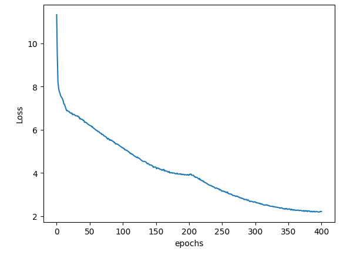

<head>
  <meta charset="UTF-8">
  <meta name="description" content="Pre-training BERT using Hugging Face & PyTorch on an
  AMD GPU">
  <meta name="author" content="Vara Lakshmi Bayanagari">
  <meta name="keywords" content="BERT, language representation model, fine-tuning, Masked
  Language Modelling, MLM, Generative AI, AMD GPU, MI250, MI300">
</head>

# Pre-training BERT using Hugging Face & PyTorch on an AMD GPU

**Author:** [Vara Lakshmi Bayanagari](../../authors/vara-lakshmi-bayanagari.md)\
**First published:** 26 Jan 2024

This blog explains an end-to-end process for pre-training the Bidirectional Encoder Representations
from Transformers (BERT) base model from scratch using Hugging Face libraries with a PyTorch
backend for English corpus text (WikiText-103-raw-v1).

You can find files related to this blog post in the
[GitHub folder](https://github.com/ROCm/rocm-blogs/tree/main/blogs/artificial-intelligence/bert-hg-pytorch).

## Introduction to BERT

BERT is a language representation model proposed in 2019. The architecture of the model is designed
from a transformer encoder, where self-attention layers measure attention for every pair of input
tokens, incorporating context from both directions (hence the 'bidirectional' in BERT). Prior to this,
models like ELMo and GPT only used left-to-right (unidirectional) architectures, which severely
constrained the representativeness of a model; model performance depended on fine-tuning.

This blog explains the pre-training tasks employed by BERT that resulted in state-of-the-art General
Language Understanding Evaluation (GLUE) benchmarks. In the following sections, we demonstrate the
implementation in PyTorch.

This [BERT paper](https://arxiv.org/abs/1810.04805) was the first to propose a novel pre-training
methodology called masked language modeling (MLM). MLM randomly masks certain portions of the
input and trains the model on a batch of inputs to predict these masked tokens. During pre-training,
after the tokenization of the inputs,15 percent of tokens are randomly chosen. Of these, 80 percent are
replaced with a `[MASK]` token, 10 percent are replaced with a random token, and 10 percent are left
unchanged.

In the following example, MLM preprocessing is applied as follows: the `dog` token is left unchanged,
the `Golden` and `years` tokens are masked, and the `and` token is replaced with a random token
`paper`. The pre-training objective is to predict these random tokens using `CategoricalCrossEntropy`
loss, so that the model learns the grammar, patterns, and structure of the language.

``` bash
Input sentence: My dog is a Golden Retriever and his is 5 years old

After MLM: My dog is a [MASK] Retriever paper his is 5 [MASK] old
```

Additionally, in order to capture the relationship between sentences beyond the masked language
modelling task, the paper proposed a second pre-training task called Next Sentence Prediction (NSP).
Without any additional changes in the architecture, the paper proves that NSP helps in boosting results
for question answering (QA) and natural language inference (NLI) tasks.

Instead of feeding the model a stream of tokens, this task inputs tokens from a pair of sentences, say
`A` and `B`, along with a leading classification token (`[CLS]`). The classification token indicates if the
pair of sentences formed are random (label=0) or if `B` is next to `A` (label=1). The NSP pre-training is
therefore a binary classification task.

``` python
_IsNext_ Pair: [1] My dog is a Golden Retriever. He is five years old.

Not _IsNext_ Pair: [0] My dog is a Golden Retriever. The next chapter in the book is a biography.
```

In summary, the data set is first preprocessed to form a pair of sentences, followed by tokenization,
and eventually masking random tokens. A batch of preprocessed inputs are either *padded* (with the
`[PAD]` token) or *trimmed* (to the `_max_seq_length_` hyperparameter), so that all input elements are
equalized to the same length before loading data into the BERT model. The BERT model comes with
two classification heads: one for MLM (`num_cls_heads = _vocab_size_`) and another for NSP
(`num_cls_heads=2`). The sum of the classification losses from both pre-training tasks is used to train
BERT.

## Implementation on multiple AMD GPUs

Before getting started, ensure you've met these requirements:

1. [Install ROCm-compatible PyTorch on the device hosting AMD GPUs](https://rocm.docs.amd.com/en/latest/how_to/pytorch_install/pytorch_install.html).
  This experiment has been tested on ROCm 5.7.0 and PyTorch 2.0.1.

2. Run the command `pip install datasets transformers accelerate` to install Hugging Face libraries.

3. Run `accelerate config` on your command prompt to set distributed training parameters, as
  explained [here](https://huggingface.co/docs/transformers/v4.35.2/en/main_classes/trainer#using-accelerate-launcher-with-trainer).
  For this experiment, we employed `DistributedDataParallel` with eight GPUs on a single node.

### Implementation

Hugging Face uses Torch as its default backend for most models, leading to a great coupling of both
frameworks. To automate regular training steps, which helps avoid boilerplate code, Hugging Face has
its own [Trainer](https://huggingface.co/docs/transformers/main_classes/trainer) class that mimics
PyTorch, called Lightning AI [Trainer](https://lightning.ai/docs/pytorch/stable/common/trainer.html)
class. In addition, Hugging Face may be more convenient for distributed training as there's no
additional config setup in the code and the system under the hood detects and utilizes all the GPU
devices as described in `accelerate config`. However, if you're looking to further customize your model
and make additional changes when loading a pre-trained checkpoint, native PyTorch is the way to go.
This blog explains an end-to-end pre-training of BERT using Hugging Face's transformers libraries,
along with a streamlined data preprocessing pipeline.

Usage of Hugging Face's Trainer for BERT pre-training can be summarized in only a couple of lines. The
transformer encoder, MLM classification head, and NSP classification head all are packed in Hugging
Face's `BertForPreTraining` model, which returns a cumulative classification loss, as explained in our
[introduction](#introduction-to-bert). The model is initialized with default BERT base config parameters
(`NUM_LAYERS`, `ACT_FUNC`, `BATCH_SIZE`, `HIDDEN_SIZE`, `EMBED_DIM`, and others).You
can import it from Hugging Face's `BertConfig`.

Is that all? Almost. The first and most crucial part of training is data preprocessing. There are three
steps involved in this:

1. Reorganize your data set into a dictionary of sentences for each document. This is helpful when
  picking a random sentence from a random document for the NSP task. To do this, use a simple
  for-loop over the whole data set.

2. Use Hugging Face's `Autokenizer` to tokenize all sentences.

3. Using another for-loop, create pairs of sentences that are random 50 percent of the time and
  ordered 50 percent of the time.

I have performed the preceding preprocessing steps for the `WikiText-103-raw-v1` corpus, with 2,500 M
words, and uploaded the resulting validation set
[here](./data/wikiTokenizedValid.hf.zip).
The preprocessed train split is uploaded on
[Hugging Face Hub](https://huggingface.co/lakshmi97/bert-preprocessed-tokens).

Next, import the `DataCollatorForLanguageModeling` collator to run MLM preprocessing and obtain
mask and sentence classification labels. When using the Trainer class we only need access to
`torch.utils.data.dataset` and a collater function. Unlike in TensorFlow, Hugging Face's Trainer creates a
data loader from the data set and the collater functions. For demonstration purposes, we experimented
using the validation split of `Wikitext-103-raw-v1` that has 3,000+ sentence pairs.

``` python
tokenizer = AutoTokenizer.from_pretrained('bert-base-cased')
collater = DataCollatorForLanguageModeling(tokenizer=tokenizer, mlm=True, mlm_probability=0.15)
# tokenized_dataset = datasets.load_from_disk(args.dataset_file)
tokenized_dataset_valid = datasets.load_from_disk('./wikiTokenizedValid.hf')
```

Create a
[TrainerArguments](https://huggingface.co/docs/transformers/v4.35.2/en/main_classes/trainer#transformers.TrainingArguments)
instance and pass all required parameters as shown in the following code. This part
of the code helps abstract the boilerplate code when training the model. This class is flexible, as it
provides more than 100 arguments to accommodate different training paradigms; for more
information refer to the
[Hugging face transformers](https://huggingface.co/docs/transformers/v4.35.2/en/main_classes/trainer#transformers.TrainingArguments) page.

You're now ready to train the model using `t.train()`. You can also resume training by passing the
`resume_from_checkpoint=True` parameter to the `t.train()`. The trainer class picks up the latest
checkpoint available in the `output_dir` folder and resumes training until it reaches a total of
`num_train_epochs`.

``` python
train_args = TrainingArguments(output_dir=args.output_dir, overwrite_output_dir =True, per_device_train_batch_size =args.BATCH_SIZE, logging_first_step=True,
                                   logging_strategy='epoch', evaluation_strategy = 'epoch', save_strategy ='epoch', num_train_epochs=args.EPOCHS,save_total_limit=50)
t = Trainer(model, args = train_args, data_collator=collater, train_dataset = tokenized_dataset, optimizers=(optimizer, None), eval_dataset = tokenized_dataset_valid)
t.train()#resume_from_checkpoint=True)
```

The above model was trained for approximately 400 epochs using the Adam optimizer
(`learning_rate=2e-5`) and `per_device_train_batch_size=8`. The pre-training on the validation set
(3,000+ sentence pairs) on one AMD GPU (MI210, ROCm 5.7.0, PyTorch 2.0.1) finished in a couple of
hours. The training curve obtained is shown in Figure 1. You can use the best model checkpoint to
fine-tune a different data set and test on various NLP tasks.



The entire code is:

``` python
set_seed(42)
parser = argparse.ArgumentParser()
parser.add_argument('--BATCH_SIZE', type=int, default = 8) # 32 is the global batch size, since I use 8 GPUs
parser.add_argument('--EPOCHS', type=int, default=200)
parser.add_argument('--train', action='store_true')
parser.add_argument('--dataset_file', type=str, default= './wikiTokenizedValid.hf')
parser.add_argument('--lr', default = 0.00005, type=float)
parser.add_argument('--output_dir', default = './acc_valid/')
args = parser.parse_args()

accelerator = Accelerator()

if args.train:
    args.dataset_file = './wikiTokenizedTrain.hf'
    args.output_dir = './acc/'
print(args)

tokenizer = AutoTokenizer.from_pretrained('bert-base-cased')
collater = DataCollatorForLanguageModeling(tokenizer=tokenizer, mlm=True, mlm_probability=0.15)
tokenized_dataset = datasets.load_from_disk(args.dataset_file)
tokenized_dataset_valid = datasets.load_from_disk('./wikiTokenizedValid.hf')

model = BertForPreTraining(BertConfig.from_pretrained("bert-base-cased"))
optimizer = torch.optim.Adam(model.parameters(), lr =args.lr)

device = accelerator.device
model.to(accelerator.device)
train_args = TrainingArguments(output_dir=args.output_dir, overwrite_output_dir =True, per_device_train_batch_size =args.BATCH_SIZE, logging_first_step=True,
                               logging_strategy='epoch', evaluation_strategy = 'epoch', save_strategy ='epoch', num_train_epochs=args.EPOCHS,save_total_limit=50)#, lr_scheduler_type=None)
t = Trainer(model, args = train_args, data_collator=collater, train_dataset = tokenized_dataset, optimizers=(optimizer, None), eval_dataset = tokenized_dataset_valid)
t.train()#resume_from_checkpoint=True)
```

### Inferencing

Take an example text, convert it to input tokens using the tokenizer, and produce a masked input from
the collator.

``` python
collater = DataCollatorForLanguageModeling(
    tokenizer=tokenizer, mlm=True, mlm_probability=0.15, pad_to_multiple_of=128)
text="The author takes his own advice when it comes to writing: he seeks to ground his claims in clear, concrete examples. He shows specific examples of bad writing to help readers better grasp exactly what he’s critiquing"
tokens = tokenizer.convert_tokens_to_ids(tokenizer.tokenize(text))
inp = collater([tokens])
inp['attention_mask'] = torch.where(inp['input_ids']==0,0,1)
```

Initialize the model with pre-trained weights and perform inference. You can see that the model
produces random tokens with no contextual meaning.

``` python
config = BertConfig.from_pretrained('bert-base-cased')
model = BertForPreTraining.from_pretrained('./acc_valid/checkpoint-19600/')
model.eval()
out = model(inp['input_ids'], inp['attention_mask'], labels=inp['labels'])

print('Input: ', tokenizer.decode(inp['input_ids'][0][:30]), '\n')
print('Output: ', tokenizer.decode(torch.argmax(out[0], -1)[0][:30]))
```

The input and output are shown in the following example. The model was trained on a very small data
set (3,000+ sentences); you can improve the performance by training on a larger data set, such as a
train split of `wikiText-103-raw-v1`.

``` bash
The author takes his own advice when it comes to writing : he [MASK] to ground his claims in clear, concrete examples. He shows specific examples of bad
The Churchill takes his own, when it comes to writing : he continued to ground his claims in clear, this examples. He shows is examples of bad
```

The source code is stored in this
[GitHub folder](https://github.com/ROCm/rocm-blogs/tree/main/blogs/artificial-intelligence/bert-hg-pytorch/src).

## Conclusion

The process we outlined for pre-training BERT base model can be easily extended to smaller or larger
BERT versions, as well as different data sets. We trained our model using the Hugging Face Trainer with
a PyTorch backend using an AMD GPU. For training, we used a validation split
of the `wikiText-103-raw-v1` data set, but this can be easily replaced with a train split by downloading
the preprocessed and tokenized train file hosted in our repository on
[Hugging Face Hub](https://huggingface.co/lakshmi97/bert-preprocessed-tokens).

In this article, we replicated BERT pre-training using MLM and NSP pre-training tasks, unlike many
resources on public platforms that only employ MLM. Moreover, instead of using small portions of the
data set, we preprocessed and uploaded the whole data set to the hub for your convenience. In future
articles, we'll discuss training various ML applications with data parallelism and distribution strategies
on multiple AMD GPUs.
