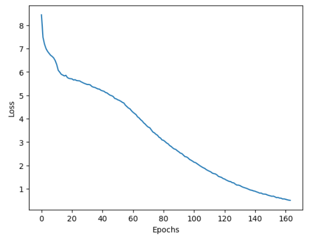

<head>
  <meta charset="UTF-8">
  <meta name="description" content="Pre-training BERT using Hugging Face & TensorFlow on an
  AMD GPU">
  <meta name="author" content="Vara Lakshmi Bayanagari">
  <meta name="keywords" content="BERT, language representation model, fine-tuning, General
  Language Understanding Evaluation, GLUE, Generative AI, AMD GPU">
</head>

# Pre-training BERT using Hugging Face & TensorFlow on an AMD GPU

**Author:** [Vara Lakshmi Bayanagari](../../authors/vara-lakshmi-bayanagari.md)\
**First published:** 26 Jan 2024

This blog explains an end-to-end process for pre-training the Bidirectional Encoder Representations from Transformers (BERT) base model from scratch using Hugging Face libraries with a Tensorflow backend for English corpus text (WikiText-103-raw-v1).

You can find files related to this blog post in the
[GitHub folder](https://github.com/ROCm/rocm-blogs/tree/main/blogs/artificial-intelligence/bert-hg-tf).

## Introduction to BERT

[BERT](https://arxiv.org/abs/1810.04805) is a language representation model proposed in 2019. The architecture of the model is designed
from a transformer encoder, where self-attention layers measure attention for every pair of input tokens, incorporating context from both directions (hence the 'bidirectional' in BERT). Prior to this,
models like ELMo and GPT only used left-to-right (unidirectional) architectures, which severely
constrained the representativeness of a model; model performance depended on fine-tuning.

[BERT paper](https://arxiv.org/abs/1810.04805) was the first to propose a novel pre-training methodology called masked language
modeling (MLM). MLM randomly masks certain portions of the input and trains the model on a batch
of inputs to predict these masked tokens. During pre-training, after the tokenization of the inputs, 15
percent of tokens are randomly chosen. Of these, 80 percent are replaced with a `[MASK]` token, 10
percent are replaced with a random token, and 10 percent are left unchanged. In the following
example, MLM preprocessing is applied as follows: the `dog` token is left unchanged, the `Golden` and
`years` tokens are masked, and the `and` token is replaced with a random token `paper`. The pre-training objective
is to predict these random tokens using `CategoricalCrossEntropy` loss, so that the model learns the
grammar, patterns, and structure of the language.

``` bash
Input sentence: My dog is a Golden Retriever and his is 5 years old

After MLM: My dog is a [MASK] Retriever paper his is 5 [MASK] old
```

Additionally, in order to capture the relationship between sentences beyond the masked language
modeling task, the paper proposed a second pre-training task called Next Sentence Prediction (NSP).
Without any additional changes in the architecture, the paper proves that NSP helps in boosting results
for question answering (QA) and natural language inference (NLI) tasks.

Instead of feeding the model a stream of tokens, this task inputs tokens from a pair of sentences, say
`A` and `B`, along with a leading classification token (`[CLS]`). The classification token indicates if the
pair of sentences formed are random (label=0) or if `B` is next to `A` (label=1). The NSP pre-training is
therefore a binary classification task.

``` python
_IsNext_ Pair: [1] My dog is a Golden Retriever. He is five years old.

Not _IsNext_ Pair: [0] My dog is a Golden Retriever. The next chapter in the book is a biography.
```

The data set is first preprocessed to form a pair of sentences, followed by tokenization, and eventually
masking random tokens. A batch of preprocessed inputs are either *padded* (with the `[PAD]` token) or
*trimmed* (to the `_max_seq_length_` hyperparameter), so that all input elements are equalized to the
same length before loading data into the BERT model. The BERT model comes with two classification
heads: one for MLM (`num_cls_heads = _vocab_size_`) and another for NSP (`num_cls_heads=2`). The
sum of the classification losses from both pre-training tasks is used to train BERT.

## Implementation on an AMD GPU

Before getting started, ensure you've met these requirements:

* [Install ROCm-compatible TensorFlow on the device hosting AMD GPU](https://rocmdocs.amd.com/en/develop/install/tensorflow-install.html).
  This experiment has been tested on ROCm 5.7.0 and TensorFlow 2.13.
* Run the command `pip install datasets transformers` to install Hugging Face libraries.

### Implementation

Training a BERT model can be summarized in 3 lines! (Yes, that's all.)

The transformer encoder, MLM classification head, and NSP classification head all are packed in
Hugging Face's `BertForPreTraining` model, which returns a cumulative classification loss, as explained
in our [introduction](#introduction-to-bert). The model is initialized with default BERT base config
parameters (`NUM_LAYERS`, `ACT_FUNC`, `BATCH_SIZE`, `HIDDEN_SIZE`, `EMBED_DIM`, and others). You
can import it from Hugging Face's `BertConfig`.

Is that all? Almost. The first and most crucial part of training is data preprocessing. There are three
steps involved in this:

1. Reorganize your data set into a dictionary of sentences for each document. This is helpful when
  picking a random sentence from a random document for the NSP task. To do this, use a simple
  for-loop over the whole data set.

2. Use Hugging Face's `Autokenizer` to tokenize all sentences.

3. Using another for-loop, create pairs of sentences that are random 50 percent of the time and
  ordered 50 percent of the time.

I performed the preceding preprocessing steps for the `WikiText-103-raw-v1` corpus, with 2,500 M
words, then uploaded the resulting validation data set into
[this repository](https://github.com/ROCm/rocm-blogs/tree/main/blogs/artificial-intelligence/bert-hg-tf/data).
The preprocessed train split is uploaded [here](https://huggingface.co/lakshmi97/bert-preprocessed-tokens) on Hugging Face Hub.

Next, import the `DataCollatorForLanguageModeling` collator to run MLM preprocessing and obtain
mask and sentence classification labels. For demonstration purposes, I used the validation split of
`Wikitext-103-raw-v1` that has 4,000+ sentences. Convert the resulting data set to a TensorFlow
`tf.data.Dataset` object using the `_to_tf_dataset_` function.

``` python
tokenized_dataset_valid = datasets.load_from_disk('./wikiTokenizedValid.hf')
tokenizer = AutoTokenizer.from_pretrained('bert-base-cased')

collater = DataCollatorForLanguageModeling(
    tokenizer=tokenizer, mlm=True, mlm_probability=MLM_PROB, return_tensors="tf"
)

valid = tokenized_dataset_valid.to_tf_dataset(
    columns=["input_ids", "token_type_ids", "attention_mask"],
    label_cols=["labels", "next_sentence_label"],
    batch_size=TRAIN_BATCH_SIZE,
    shuffle=False,
    collate_fn=collater,
)

del tokenized_dataset_valid
```

Pass this data set to the `model.fit()` function and train away! The model was trained for approximately
160 epochs using the Adam optimizer (`learning_rate=2e-5`) and `batch_size=5`. The pre-training on
the validation set (3,000+ sentence pairs) on one AMD GPU (MI210, ROCm 5.7.0, TensorFlow 2.13)
finished in a few hours. The training curve obtained is shown in Figure 1. You can use the best model
checkpoint to fine-tune a different data set and test on various NLP tasks.



The entire code is:

``` python
import datasets
from transformers import DataCollatorForLanguageModeling, AutoTokenizer, BertConfig
import random
import logging
import tensorflow as tf
from tensorflow import keras

# Only log error messages
tf.get_logger().setLevel(logging.ERROR)
# Set random seed
tf.keras.utils.set_random_seed(42)

MLM_PROB = 0.2# Probability with which tokens are masked in MLM
TRAIN_BATCH_SIZE = 5
MAX_EPOCHS = 200# Maximum number of epochs to train the model for
LEARNING_RATE = 2e-5# Learning rate for training the model


#tokenized_dataset_train = datasets.load_from_disk('./wikiTokenizedTrain.hf')
tokenized_dataset_valid = datasets.load_from_disk('./wikiTokenizedValid.hf')
tokenizer = AutoTokenizer.from_pretrained('bert-base-cased')

collater = DataCollatorForLanguageModeling(
tokenizer=tokenizer, mlm=True, mlm_probability=MLM_PROB, return_tensors="tf"
)

valid = tokenized_dataset_valid.to_tf_dataset(
columns=["input_ids", "token_type_ids", "attention_mask"],
label_cols=["labels", "next_sentence_label"],
batch_size=TRAIN_BATCH_SIZE,
shuffle=False,
collate_fn=collater,
)

del tokenized_dataset_valid

config = BertConfig.from_pretrained('bert-base-cased')
print(tf.config.list_physical_devices())
from transformers import TFBertForPreTraining


try:
# Specify a valid GPU device
  with tf.device('/device:GPU:0'):
    model = TFBertForPreTraining(config)

    optimizer = keras.optimizers.Adam(learning_rate=LEARNING_RATE)

    model.compile(optimizer=optimizer)

    model.fit(valid,epochs=MAX_EPOCHS,callbacks = [tf.keras.callbacks.ModelCheckpoint('./{epoch:02d}.ckpt')])
except RuntimeError as e:
print(e)
```

### Inferencing

Take an example text, convert it to input tokens using the tokenizer, and produce a masked input from
the collator.

``` python
tokenizer = AutoTokenizer.from_pretrained('bert-base-cased')

collater = DataCollatorForLanguageModeling(
    tokenizer=tokenizer, mlm=True, mlm_probability=MLM_PROB, return_tensors="tf"
)

text="The author takes his own advice when it comes to writing: he seeks to ground his claims in clear, concrete examples. He shows specific examples of bad writing to help readers better grasp exactly what he’s critiquing"
tokens = tokenizer.convert_tokens_to_ids(tokenizer.tokenize(text))
inp = collater([tokens])

```

Initialize the model with no pre-trained weights and perform inference. You can see that the model
produces random tokens with no contextual meaning.

``` python
config = BertConfig.from_pretrained('bert-base-cased')
model = TFBertForPreTraining(config)

out = model.predict(inp)
print('Input: ', tokenizer.decode(inp['input_ids'][0]), '\n')
print('Output: ', tokenizer.decode(tf.argmax(out[0],-1)[0]))
```

``` bash
Input:  The author takes his own [MASK] when it comes to writing : he seeks to ground his claims in clear, [MASK] examples [MASK] [MASK] shows [MASK] [MASK] of [MASK] writing to help readers better reptiles exactly what he ’ s critiquing

Output:  ہ owing difference Ana editorσFI akin logistics Universal dickpine boxer nationalist television Party survivebach revolvespineḤ Sense beard Clive motto akin‘ abortion constituency Administrator Sense Universal Engineers molecular laughing wanna swim TanakaḤ noisesCs Administrator Gilesae Administrator
```

Load the pre-trained weights using TensorFlow's `load_weights` function.

``` python
model.load_weights('path/to/ckpt/folder/variables/variables')
```

Perform the inference again on the same text; note dramatic change in understanding for the input
text and predicting `[MASK]` tokens.

``` python
out = model.predict(inp)
print('Input: ', tokenizer.decode(inp['input_ids'][0]), '\n')
print('Output: ', tokenizer.decode(tf.argmax(out[0],-1)[0]))
```

The input and output are shown in the following example. The model was trained on a very small data
set (3,000+ sentences); the performance can be improved by training on a bigger data set using a
higher number of steps or epochs.

``` bash
Input:  The author takes his own [MASK] when it comes to writing : he seeks to ground his claims in clear, [MASK] examples [MASK] [MASK] shows [MASK] [MASK] of [MASK] writing to help readers better reptiles exactly what he ’ s critiquing

Output:  The author takes his own, when it comes to writing : he continued to ground his claims in clear, as examples of. shows. University of the writing to help and better. on what he's crit " give
```

## Conclusion

In this article, we replicated BERT pre-training using MLM and NSP pre-training tasks, unlike many
resources on public platforms that only employ MLM. Moreover, instead of using small portions of the
data set, we preprocessed and uploaded the whole data set to the hub for your convenience. In future
articles, we'll discuss data parallelism and distribution strategies for training models using multiple
AMD GPUs.

The process we outlined for pre-training BERT base model can be easily extended to smaller or larger
BERT versions, as well as different data sets. We trained our model using the Hugging Face Trainer with
a TensorFlow backend using one AMD GPU. For training, we used a validation split
of the wiki data set, but this can be easily replaced with a train split by downloading
the preprocessed and tokenized train file hosted in our repository on
[Hugging Face Hub](https://huggingface.co/lakshmi97/bert-preprocessed-tokens).
