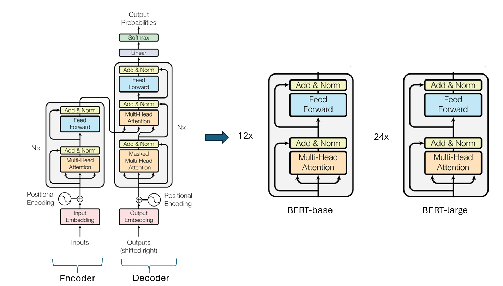
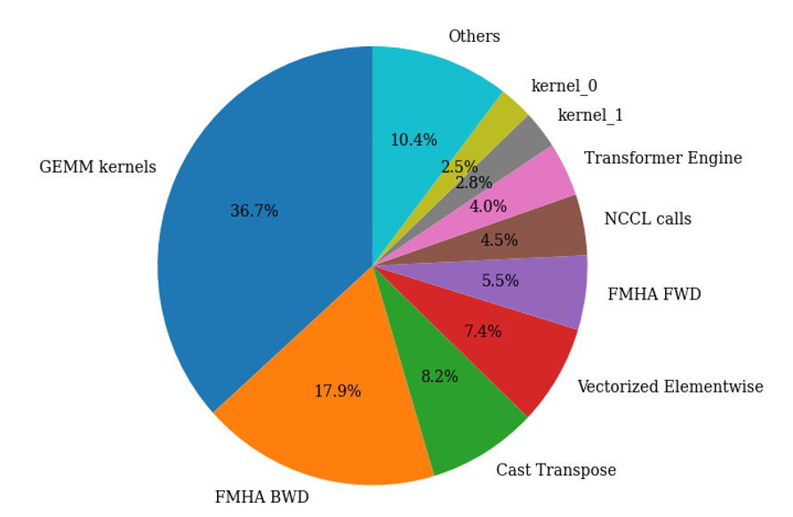

<!---
Copyright (c) 2025 Advanced Micro Devices, Inc. (AMD)

Permission is hereby granted, free of charge, to any person obtaining a copy
of this software and associated documentation files (the "Software"), to deal
in the Software without restriction, including without limitation the rights
to use, copy, modify, merge, publish, distribute, sublicense, and/or sell
copies of the Software, and to permit persons to whom the Software is
furnished to do so, subject to the following conditions:

The above copyright notice and this permission notice shall be included in all
copies or substantial portions of the Software.

THE SOFTWARE IS PROVIDED "AS IS", WITHOUT WARRANTY OF ANY KIND, EXPRESS OR
IMPLIED, INCLUDING BUT NOT LIMITED TO THE WARRANTIES OF MERCHANTABILITY,
FITNESS FOR A PARTICULAR PURPOSE AND NONINFRINGEMENT. IN NO EVENT SHALL THE
AUTHORS OR COPYRIGHT HOLDERS BE LIABLE FOR ANY CLAIM, DAMAGES OR OTHER
LIABILITY, WHETHER IN AN ACTION OF CONTRACT, TORT OR OTHERWISE, ARISING FROM,
OUT OF OR IN CONNECTION WITH THE SOFTWARE OR THE USE OR OTHER DEALINGS IN THE
SOFTWARE.
--->

# High-Throughput BERT-L Pre-Training on AMD Instinct™ GPUs: A Practical Guide

This blog showcases an implementation of the BERT-L model on the AMD Instinct™ GPUs using ROCm with advanced optimization including but not limited to mixed precision training, packed datasets, Flash Attention and MLPerf-compliant techniques.
[BERT (Bidirectional Encoder Representations from Transformers)](https://arxiv.org/abs/1810.04805) is a language representation model developed by researchers at Google in 2018. It is based on the Transformer architecture and processes text bidirectionally, which contrasts with traditional models that read text sequentially.

BERT improved performance on several natural language processing (NLP) tasks such as question answering, sentiment analysis, and natural language inference. Its design has influenced the development of related models, including RoBERTa, DistilBERT, and ALBERT, making NLP tools more accessible to researchers and developers.

BERT-L, a large variant of BERT, is also used as a reference model in the MLPerf benchmark, which measures the performance of hardware and software systems on AI workloads. It provides a standard framework for assessing the speed and efficiency of training and inference tasks.

The purpose of this blog is to provide a walkthrough of optimizations that enable a highly efficient training of BERT-L model with the `Wikipedia 2020/01/01` dataset in a way that is compliant with  [MLPerf Training](https://github.com/mlcommons/training/tree/master/language_model/tensorflow/bert) rules.

## BERT-L Model

[BERT](https://huggingface.co/blog/bert-101) relies on the encoder portion of the [Transformer architecture](https://arxiv.org/pdf/1706.03762). It is composed of multiple layers of self-attention mechanisms and feed-forward neural networks. Each layer allows the model to capture complex dependencies in the input text by attending to all words in the sentence bidirectionally. BERT-L is a large variant of BERT and it comprises 24 transformer layers. The model has approximately 340 million parameters, with a hidden size of 1024, intermediate size of 4096, and 16 attention heads.

An illustration of the BERT architecture can be found below. The illustration is adapted from the ["Attention is All You Need" paper](https://arxiv.org/pdf/1706.03762).


Notable features of the BERT model include:

- Bidirectional Training: Unlike previous models that read text sequentially (either left-to-right or right-to-left), BERT is trained to look at the entire sequence of words at once. This bidirectional approach significantly improves the model’s understanding of context.
- Masked Language Modeling (MLM): Instead of traditional left-to-right language modeling, BERT randomly masks some input tokens and trains the model to predict these masked words, forcing it to learn deep bidirectional representations.
- Next Sentence Prediction (NSP): BERT is also trained on a task to predict whether one sentence logically follows another, enhancing its ability to understand relationships between sentences.

## BERT-L Training Optimization

This blog describes the training of the BERT-L model on the WikiText dataset with over 1 million training samples and a vocabulary size of 30,522 tokens.  The training uses distributed fused LAMB (Layer-wise Adaptive Moments) optimizer, combined with a linear warmup and polynomial decay learning rate scheduler. The key training hyperparameters when the MI300X is used include:

- Maximum sequence length: 512
- Attention dropout probability: 0.1
- Activation function: GeLU
- Mini batch size: 48
- Global batch size: 768
- Learning rate: 0.00096

### Framework

Due to the tight integration between PyTorch and the AMD ROCm stack, particularly in recent releases, PyTorch was adopted as the framework of choice for BERT-L training. PyTorch has become the dominant framework in the AI/ML community, supported by a large and active contributor base, frequent updates, and an ecosystem that prioritizes flexibility and performance. This alignment with AMD’s ongoing software development made it a natural choice for optimization efforts.

### Packed Dataset

To improve hardware utilization and reduce memory waste from padding, a packed dataset format is employed. Instead of padding each sequence to a fixed maximum length, multiple shorter sequences are concatenated and packed into a single fixed-length block. This minimizes padding overhead and leads to more efficient use of compute resources during attention and MLP operations. Packed datasets help sustain higher arithmetic intensity and better throughput.

### Low Precision Training - ROCm Transformer Engine

To reduce memory bandwidth and computational overhead, low precision training is used through the [ROCm Transformer Engine library](https://github.com/ROCm/TransformerEngine). By using FP8 datatype, specifically the E4M3 and E5M2 formats, memory consumption is drastically reduced, and matrix multiplication operations are accelerated. The Transformer Engine manages dynamic scaling and precision management internally, maintaining model stability while maximizing hardware utilization.

### Fused Operation – Apex

Beyond mixed precision, further optimization is made by using fused operations via the [ROCm Apex library](https://github.com/ROCm/apex), such as fused dense layer and fused dense layer with GeLU activation function. Fused operations reduce memory reads/writes and kernel launch overhead by combining operations into a single efficient kernel.

### GEMM Tuning - hipBLASLt

General matrix multiplication (GEMM) are at the core of transformer workloads. To ensure optimal performance on AMD GPUs, GEMM tuning is performed to select the best tiling, block size and memory access patterns based on specific input/output shapes/datatypes and GPU architecture. Proper GEMM tuning can lead to significant speedups in training as GEMM is a major component in the BERT-L workload. The maximum achievable TFLOP for FP8 on MI300X is around 1.1-1.2K TFLOPs. Due to the suboptimal GEMM sizes of BERT-L, current performance reaches around 900 TFLOPs on MI300X. These GEMMS can benefit from custom assembly-level GEMM kernels.

### Flash Attention - Composable Kernel (CK)

Traditional attention implementations are memory-bound and involve redundant data movement across QKV projection, softmax and output stages. Tri Dao’s Flash Attention v2 with [composable kernel (CK)](https://github.com/ROCm/composable_kernel?tab=readme-ov-file#composable-kernel) is used as the backend. Flash attention computes attention scores in a tiled and streaming fashion, avoiding large intermediate buffers and rematerialization of softmax. This not only reduces memory overhead but also significantly improves attention throughput. CK offers the flexibility to experiment with tuning layouts and tile sizes to suit AMD hardware characteristics.

### Graph Capture and Replay - PyTorch

Another key optimization involves graph capture and replay. Graph capture records a static execution trace of the model’s forward and backward pass, including all kernel launches and memory operations, and replay it as a single, fused unit. This avoids Python overhead, reduces launch latency and ensure consistent execution paths, leading to improved performance and determinism.

### Profiling the Workload

The BERT-L training workload is profiled using the [ROCm Profile Data tool](https://github.com/ROCm/rocmProfileData). The pie chart below shows the relative duration of each type of kernel in this workload after applying all the above optimizations.



## Benchmark BERT-L Training on AMD Instinct™ GPUs

### System Requirement

To get started, you need:

- AMD Instinct MI300X or MI325X platform
- ROCm 6.3.3 or later
- Any Linux distribution supported by the selected ROCm version
- Docker

See the [ROCm Quick start installation guide](https://rocm.docs.amd.com/projects/install-on-linux/en/latest/install/quick-start.html) for information on how to install ROCm.

Follow these steps to get ready for running the training benchmark script.

### Start the Docker Container

For the purpose of illustrating the training procedure, it is assumed that the training will be conducted on a MI300X system.

First, pull the docker image `rocm/amd-mlperf:bert_training_5.0` from docker hub.

```bash
docker pull rocm/amd-mlperf:bert_training_5.0
```

Copy the the following scripts required to run the benchmark to the host machine:

```bash
container_id=$(docker create rocm/amd-mlperf:bert_training_5.0) && \
docker cp $container_id:/workspace/code/runtime_tunables.sh . && \
docker cp $container_id:/workspace/code/run_with_docker.sh . && \
docker cp $container_id:/workspace/code/config_MI300X_1x8x48.sh . && \
docker rm $container_id
```

If you are running the training procedure on a MI325X system, please copy the script `config_MI325X_1x8x48.sh` instead of `config_MI300X_1x8x48.sh`.

Create the directory `/data/bert_data`.

```bash
mkdir -p /data/bert_data
```

Start the Docker container, mount the volume you want to use for downloading the data under `/bert_data` within the container. This example uses `/data/bert_data` as the host download directory:

```bash
docker run -it -v /data/bert_data:/bert_data \
   --net=host --uts=host \
   --ipc=host --device /dev/dri --device /dev/kfd \
   --security-opt=seccomp=unconfined \
   rocm/amd-mlperf:bert_training_5.0
```

### Prepare Training Dataset

To prepare the dataset for training, start the script for downloading and preprocessing data from within the container:

```bash
./input_preprocessing/prepare_data.sh --outputdir /bert_data --packed-data
```

The directory diagram below represents the final directory layout that you should have at the end of running the data pipeline. The number of shards was parameterized to 4320.

```text
/bert_data/
                |_ phase1                                   # checkpoint to start from (both tf1 and pytorch converted)
                |_hdf5  
                     |_ eval_varlength                      # evaluation chunks in binary hdf5 format variable length *used for training*
                     |_ packed_data                         # packed data *used for training* 
```

The execution of the data pre-processing script may take around 8 hours to complete and requires approximately 1.8 TB of disk space to process the data, yielding a 160 GB of final pre-training dataset. The Exit the container once the data is processed.

### Run the BERT-L Training Benchmark

With the training data prepared, the next step is to set the configuration parameters for benchmarking the training job.

#### Set Configuration

To set the configuration and system-specific hyperparameters for running BERT-L training benchmark on MI300X, run the following from the host machine:

```bash
source config_MI300X_1x8x48.sh
```

Alternately, for the MI325X set the configuration with:

```bash
source config_MI325X_1x8x48.sh
```

#### Launch a Single Training Run

To perform a single run of the training on the MI300X platform, run the following commands to set the environment variables and execute the previously copied `run_with_docker.sh` script from the container:

```bash
export CONT=rocm/amd-mlperf:bert_training_5.0
export DATADIR=/data/bert_data/
export CONFIG_FILE=config_MI300X_1x8x48.sh
export NEXP=1
bash run_with_docker.sh
```

```{note}
To optimize the machine's performance, `runtime_tunables.sh` script is executed automatically before each training run.
```

The output should resemble the following:

```text
+++ readlink -f run_with_docker.sh
++ dirname /home/karverma/run_with_docker.sh
+ SCRIPT_DIR=/home/karverma
+ cd /home/karverma
+ : config_MI300X_1x8x48.sh
+ : rocm/amd-mlperf:bert_training_5.0
+ : /data/bert_data/
+ : 1
+ : 1
+ : ./results
+ : mlperf_bert
+ : 0
+ readonly _config_file=config_MI300X_1x8x48.sh
+ _config_file=config_MI300X_1x8x48.sh
+ readonly _cont_name=mlperf_bert
+ _cont_name=mlperf_bert
+ _cont_mounts=("--volume=${DATADIR}:/bert_data")
+ mkdir -p ./results
+ mapfile -t _config_env
++ env -i bash -c '. config_MI300X_1x8x48.sh && compgen -e'
++ grep -E -v '^(PWD|SHLVL)'
+ echo BATCHSIZE EVAL_ITER_SAMPLES EVAL_ITER_START_SAMPLES GRADIENT_STEPS HIP_FORCE_DEV_KERNARG HIP_VISIBLE_DEVICES INIT_LOSS_SCALE LR MAX_SAMPLES_TERMINATION MAX_STEPS MLPERF_SUBMISSION_ORG MLPERF_SUBMISSION_PLATFORM OPT_LAMB_BETA_1 OPT_LAMB_BETA_2 PACKING_FACTOR PHASE START_WARMUP_STEP TORCH_BLAS_PREFER_HIPBLASLT WARMUP_PROPORTION WEIGHT_DECAY_RATE
BATCHSIZE EVAL_ITER_SAMPLES EVAL_ITER_START_SAMPLES GRADIENT_STEPS HIP_FORCE_DEV_KERNARG HIP_VISIBLE_DEVICES INIT_LOSS_SCALE LR MAX_SAMPLES_TERMINATION MAX_STEPS MLPERF_SUBMISSION_ORG MLPERF_SUBMISSION_PLATFORM OPT_LAMB_BETA_1 OPT_LAMB_BETA_2 PACKING_FACTOR PHASE START_WARMUP_STEP TORCH_BLAS_PREFER_HIPBLASLT WARMUP_PROPORTION WEIGHT_DECAY_RATE
+ mapfile -t _config_env

...

finished phase2
+ set -eux
+ cleanup_docker
+ docker container rm -f mlperf_bert
mlperf_bert
```

```{note}
To perform benchmark result for 10 training run, simply set NEXP=10.
```

After completion, the logs will be available in the `results` folder under the current directory. Below is an example log:

```text
Beginning trial 1 of 1
vm.drop_caches = 3
Clear page cache
/bert_data
/bert_data/hdf5/packed_data
enable distributed_lamb
Profiler is set to 0
Logs written to /data/experiments/002b9bd5-fced-4481-a9d6-9036326e6232/bert_lamb_pretraining.pyt_bert_pretraining_phase2_fp16_gbs384_dis-lamb_lr-0.00096_max-ch-_apa1.cluster_torchdpp.250416212450.log
+ torchrun --standalone --nproc_per_node=8 /workspace/code/training/run_pretraining.py --input_dir=/bert_data/hdf5/packed_data --output_dir=/data/experiments/002b9bd5-fced-4481-a9d6-9036326e6232/checkpoints --bert_config_path=/bert_data/phase1/bert_config.json --bert_model=BERT-L-uncased --train_batch_size=48 --max_seq_length=512 --max_predictions_per_seq=76 --max_steps=4000 --warmup_proportion=0.0 --warmup_steps=0.0 --start_warmup_step=0 --learning_rate=0.00096 --seed=25546 --fp16 --init_checkpoint=/bert_data/phase1/model.ckpt-28252.pt --gradient_accumulation_steps=1 --opt_lamb_beta_1=0.60466 --opt_lamb_beta_2=0.99437 --weight_decay_rate=0.1 --do_train --phase2 --skip_checkpoint --train_mlm_accuracy_window_size=5 --target_mlm_accuracy=0.720 --max_samples_termination=4500000 --dense_seq_output --pad_fmha --packed_samples --use_rocm_layers --use_fp8 --cuda_graph_mode segmented --use_cuda_graph --distributed_lamb --dwu-num-rs-pg=1 --dwu-num-ar-pg=1 --dwu-num-ag-pg=1 --dwu-num-blocks=1 --eval_dir=/bert_data/hdf5/eval_varlength --eval_iter_start_samples=290000 --eval_iter_samples=290000 --eval_batch_size=16 --cache_eval_data --num_eval_examples 10000 --log_freq=0

...

:::MLLOG {"namespace": "", "time_ms": 1744838717800, "event_type": "INTERVAL_START", "key": "run_start", "value": null, "metadata": {"file": "/workspace/code/training/run_pretraining.py", "lineno": 1706}}

...

:::MLLOG {"namespace": "", "time_ms": 1744839123410, "event_type": "POINT_IN_TIME", "key": "eval_accuracy", "value": 0.719775378704071, "metadata": {"file": "/workspace/code/training/run_pretraining.py", "lineno": 1984, "epoch_num": 2030855}}
:::MLLOG {"namespace": "", "time_ms": 1744839180558, "event_type": "POINT_IN_TIME", "key": "eval_accuracy", "value": 0.7209873199462891, "metadata": {"file": "/workspace/code/training/run_pretraining.py", "lineno": 1984, "epoch_num": 2320253}}
:::MLLOG {"namespace": "", "time_ms": 1744839180559, "event_type": "INTERVAL_END", "key": "block_stop", "value": null, "metadata": {"file": "/workspace/code/training/run_pretraining.py", "lineno": 2102, "first_epoch_num": 1}}
:::MLLOG {"namespace": "", "time_ms": 1744839180559, "event_type": "INTERVAL_END", "key": "epoch_stop", "value": null, "metadata": {"file": "/workspace/code/training/run_pretraining.py", "lineno": 2105, "epoch_num": 2320253}}
:::MLLOG {"namespace": "", "time_ms": 1744839180559, "event_type": "POINT_IN_TIME", "key": "train_samples", "value": 2320253, "metadata": {"file": "/workspace/code/training/run_pretraining.py", "lineno": 2107}}
:::MLLOG {"namespace": "", "time_ms": 1744839180559, "event_type": "POINT_IN_TIME", "key": "eval_samples", "value": 10000, "metadata": {"file": "/workspace/code/training/run_pretraining.py", "lineno": 2110}}
:::MLLOG {"namespace": "", "time_ms": 1744839180560, "event_type": "INTERVAL_END", "key": "run_stop", "value": null, "metadata": {"file": "/workspace/code/training/run_pretraining.py", "lineno": 2113, "status": "success"}}
:::MLLOG {"namespace": "", "time_ms": 1744839180560, "event_type": "POINT_IN_TIME", "key": "tracked_stats", "value": {"throughput": 5013.945143642021, "epoch_num": 2320253}, "metadata": {"file": "/workspace/code/training/run_pretraining.py", "lineno": 2160, "step": [2, 3021], "train_time": 7.838831726710001}}
finished phase2
```

From the logs, the `run_start` and `run_stop` events happened at timestamp `1744838717800` and `1744839180560` in milliseconds respectively.  The difference between these two timestamps is the time taken for the training to reach the [MLPerf stopping criteria](https://github.com/mlcommons/training/tree/master/language_model/tensorflow/bert#stopping-criteria) of `masked lm accuracy >= 0.720`, and is equal to `7.713 min`.  The training has gone through `2320253` epoch, and that translates to a throughput of  `5014 epoch /second`.

To get MLPerf compliant score, you will need 10 consecutive runs. Calculate timings for each run using the `run_start` and `run_stop` timestamps.  Disregard the slowest and fastest runs and average the remaining 8 runtimes. Next, check convergence of runs by running [RCP Checker Script](https://github.com/mlcommons/logging/tree/44b4810e65e8c0a7d9e4e207c60e51d9458a3fb8/mlperf_logging/rcp_checker) on the directory containing the set of 10 runs. The output should look like this

```text
RCP Record: {'Benchmark': 'bert', 'BS': 768, 'Hyperparams': {}, 'Epochs to converge': [], 'RCP Mean': 2443933.5384615385, 'RCP Stdev': 192282.57105342922, 'Max Speedup': 1.0594760978154003, 'Min Epochs': 2306737.776813311}
INFO - Submission mean epochs: 2355602.6250
INFO - Submission mean epochs faster than RCP mean but within max speedup range. Score should be normalized by factor of 2443933.5384615385 / 2355602.625 = 1.0374982233947623
INFO - Results scaling set to normalization factor of 1.0375
INFO - RCP Test Passed: RCP Interpolation
INFO - ------------------------------
INFO - ------------------------------
INFO - PACKAGE CHECKER FOUND NO ERRORS, SUCCESS !
INFO - ------------------------------ **
```

You may use the [MLPerf RCP Checker](https://github.com/mlcommons/logging/tree/master/mlperf_logging/rcp_checker) on a set of 10 BERT-L pre-training runs. Make sure that there is no error. Ensure to multiply with the normalization factor to calculate your final time-to-train (TTT). **The expected score for MI300X is ~8 minutes, and ~7 minutes for MI325X.**

## Summary

This blog describes an optimized procedure to train the BERT-L model using MI300X and MI325X platforms from AMD.  The benchmarking methodology used to validate the procedure follows the approach used in the [MLPerf guideline for BERT-L training](https://github.com/mlcommons/training/tree/master/language_model/tensorflow/bert).  A number of advanced optimization techniques such as quantization, kernel fusion, GEMM tuning were used. These efforts resulted in notable improvements in compute efficiency and memory usage. A step-by-step instruction is provided to allow you to reproduce our benchmark result on your own devices.

While the results presented in this blog are very competitive against the performance of most devices on the market today, there is always room for improvement. We would love to hear new ideas from you to push the envelope further!

## Disclaimers

Third-party content is licensed to you directly by the third party that owns the
content and is not licensed to you by AMD. ALL LINKED THIRD-PARTY CONTENT IS
PROVIDED “AS IS” WITHOUT A WARRANTY OF ANY KIND. USE OF SUCH THIRD-PARTY CONTENT
IS DONE AT YOUR SOLE DISCRETION AND UNDER NO CIRCUMSTANCES WILL AMD BE LIABLE TO
YOU FOR ANY THIRD-PARTY CONTENT. YOU ASSUME ALL RISK AND ARE SOLELY RESPONSIBLE
FOR ANY DAMAGES THAT MAY ARISE FROM YOUR USE OF THIRD-PARTY CONTENT.
