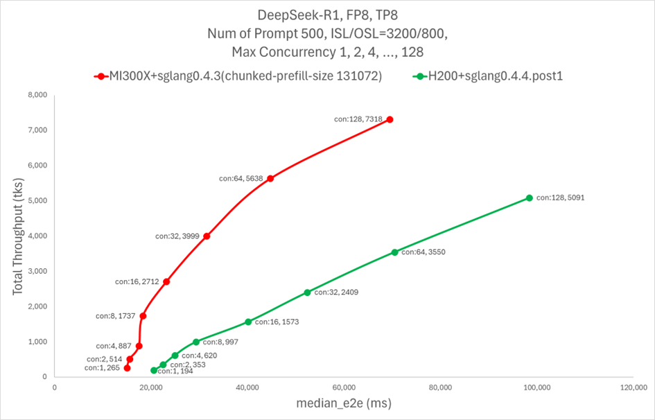
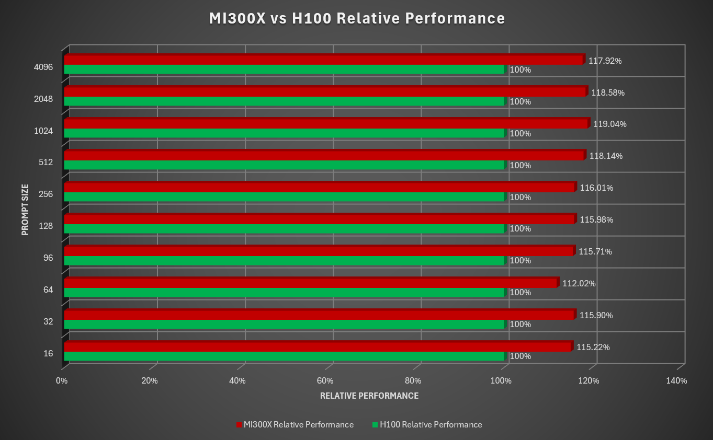
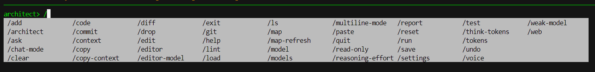
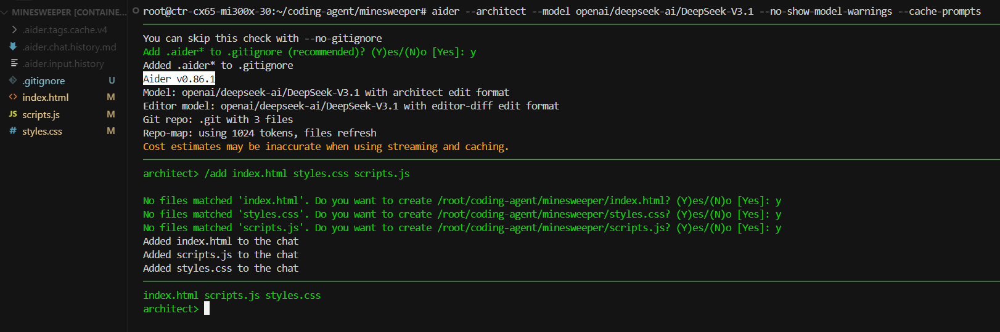
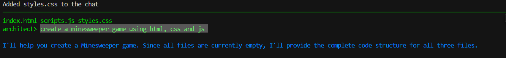
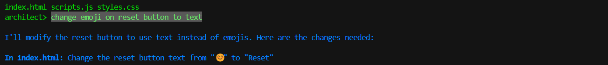
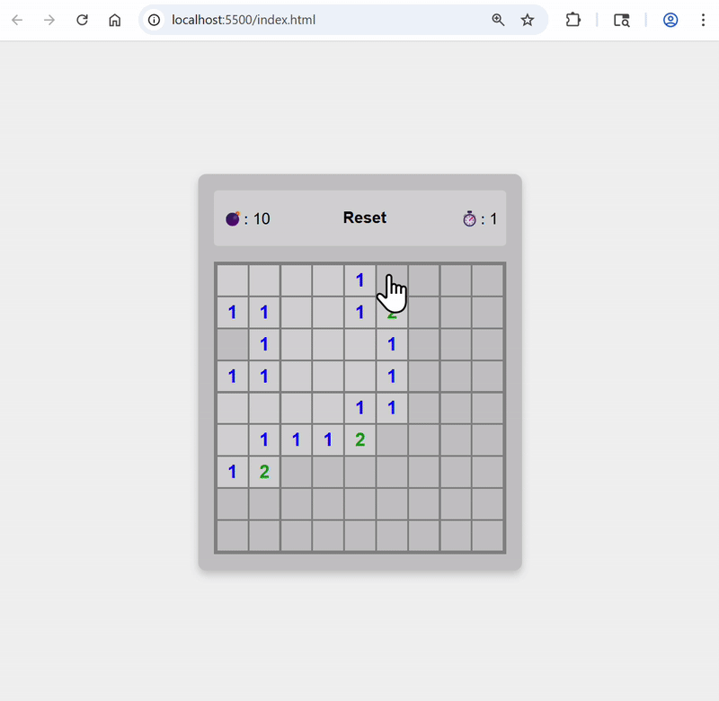
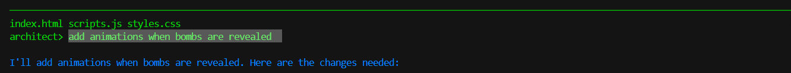
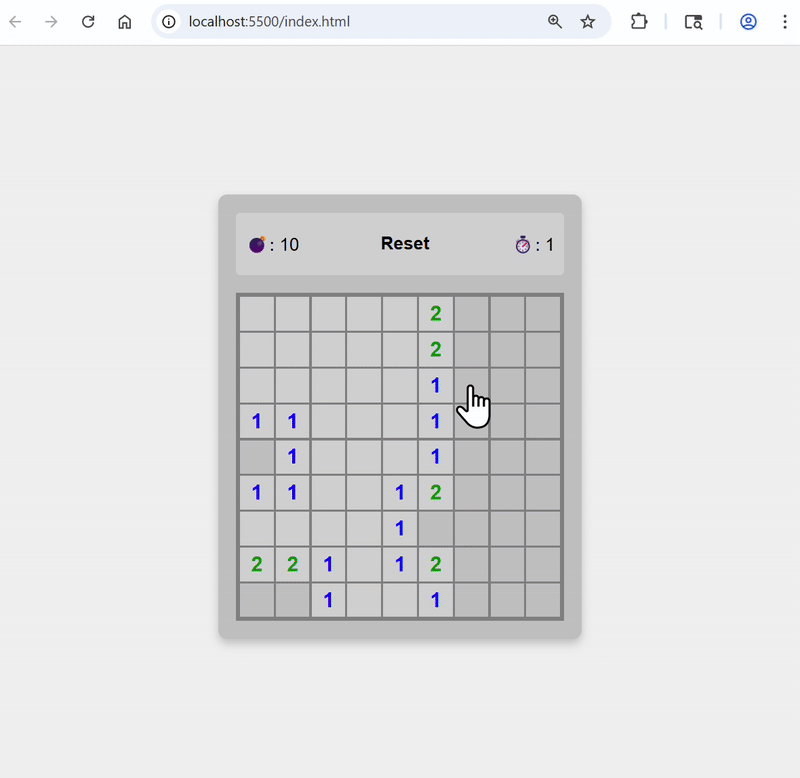
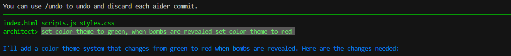

<!---
Copyright (c) 2025 Advanced Micro Devices, Inc. (AMD)
Permission is hereby granted, free of charge, to any person obtaining a copy
of this software and associated documentation files (the "Software"), to deal
in the Software without restriction, including without limitation the rights
to use, copy, modify, merge, publish, distribute, sublicense, and/or sell
copies of the Software, and to permit persons to whom the Software is
furnished to do so, subject to the following conditions:
The above copyright notice and this permission notice shall be included in all
copies or substantial portions of the Software.
THE SOFTWARE IS PROVIDED "AS IS", WITHOUT WARRANTY OF ANY KIND, EXPRESS OR
IMPLIED, INCLUDING BUT NOT LIMITED TO THE WARRANTIES OF MERCHANTABILITY,
FITNESS FOR A PARTICULAR PURPOSE AND NONINFRINGEMENT. IN NO EVENT SHALL THE
AUTHORS OR COPYRIGHT HOLDERS BE LIABLE FOR ANY CLAIM, DAMAGES OR OTHER
LIABILITY, WHETHER IN AN ACTION OF CONTRACT, TORT OR OTHERWISE, ARISING FROM,
OUT OF OR IN CONNECTION WITH THE SOFTWARE OR THE USE OR OTHER DEALINGS IN THE
SOFTWARE.
--->

# Coding Agents on AMD GPUs: Fast LLM Pipelines for Developers

The rapid rise of AI-assisted development is transforming how software is built, with coding agents emerging as powerful tools for modern developers. In this blog, we will show you how to deploy coding agents on AMD GPUs using frameworks such as SGLang, vLLM, and llama.cpp, and walk through a practical workflow example: creating a Minesweeper game using Aider.

A coding agent is a type of AI agent designed specifically to assist or automate software development tasks. Unlike simple autocomplete tools, a coding agent can interpret natural language instructions, plan a sequence of coding steps, interact with development tools (like Git, editors, and test frameworks), and iteratively refine the code until it works. By combining large language model reasoning with external tool integrations, a coding agent functions like an AI-powered developer that can handle project-wide context, create and modify files, and collaborate with developers in a feedback loop.

Coding agents provide a wide range of features that make them powerful development assistants. They can generate code from natural language, perform multi-file edits, understand repo-wide dependencies, and even run tests to validate correctness. They are capable of error-driven self-correction, refactoring, and environment setup, while also managing Git operations such as commits, diffs, and pull requests. More advanced agents extend their capabilities to code review, offering insights on bugs, performance, security, and best practices. With memory and contextual awareness, coding agents not only automate repetitive tasks but also maintain consistency across complex projects.

Developers increasingly rely on coding agents because they bridge the gap between high-level human intent and low-level code implementation, allowing them to focus on product design and architecture instead of boilerplate or debugging. Coding agents improve productivity, reduce human error, and scale development work that would normally require larger teams. Importantly, coding agent workflows can now run efficiently on AMD GPUs, which provide the high memory bandwidth and compute performance needed for large model inference. Frameworks such as [SGLang](https://github.com/sgl-project/sglang), [vLLM](https://github.com/vllm-project/vllm), and [llama.cpp](https://github.com/ggml-org/llama.cpp) offer highly efficient inferencing, all fully supported on AMD datacenter GPUs, and benchmarking results have demonstrated strong performance, making it easier for individuals and organizations to deploy coding agents locally or in the cloud and accelerate AI-assisted software development at scale.

Some of the widely used AI coding agents include [GitHub Copilot](https://github.com/features/copilot), [Cursor](https://docs.cursor.com/en/welcome), [Codex](https://chatgpt.com/codex), [Cline](https://cline.bot/), and [Aider](https://aider.chat/). While Copilot, Cursor and Cline excel at code completion and suggestions within popular IDEs, and Codex powers natural-language-to-code generation, Aider stands out for its workflow-driven flexibility. It enables integration with custom LLMs, supports multi-step coding tasks, and can run models locally or via APIs.  Aider is designed for iterative development, debugging, and project management all through the command line, making it especially powerful for complex coding environments.

## Requirements

* AMD GPU: See the [ROCm documentation page](https://rocm.docs.amd.com/projects/install-on-linux/en/latest/reference/system-requirements.html) for supported hardware and operating systems.
* ROCm 6.4: See the [ROCm installation for Linux](https://rocm.docs.amd.com/projects/install-on-linux/en/latest/index.html) for installation instructions.
* Docker: See [Install Docker Engine on Ubuntu](https://docs.docker.com/engine/install/ubuntu/#install-using-the-repository) for installation instructions.
* 8 x MI300x GPUs: At least one node with 8 x MI300x is needed to deploy DeepSeek-V3.1 used in this example

## Deploy LLM

AMD supports a wide range of inference frameworks. In this guide, we walk through the steps to deploy Deepseek-v3.1 for inference using SGLang, vLLM, and llama.cpp.

### SGLang

SGLang is a high-performance framework designed for the efficient serving of large language models and vision language models. It offers a range of features that enhance the interaction with models, making it faster and more controllable. The core features include efficient serving with **RadixAttention** for prefix caching, zero-overhead CPU scheduler, prefill-decode disaggregation, speculative decoding, continuous batching, paged attention, tensor/pipeline/expert/data parallelism, structured outputs, chunked prefill, quantization, and multi-lora batching. You can find both ROCm supported [official docker images](https://hub.docker.com/r/lmsysorg/sglang/tags) and [staged docker images](https://hub.docker.com/r/rocm/sgl-dev/tags) on dockerhub.

Deploy DeepSeek-V3.1 on MI300x

```bash
docker pull lmsysorg/sglang:v0.5.3rc0-rocm630-mi30x
docker run --cap-add=SYS_PTRACE --ipc=host --privileged=true \
        --shm-size=128GB --network=host --device=/dev/kfd \
        --device=/dev/dri --group-add video -it \
lmsysorg/sglang:v0.5.3rc0-rocm630-mi30x

RCCL_MSCCL_ENABLE=0 CK_MOE=1  HSA_NO_SCRATCH_RECLAIM=1  python3 -m sglang.launch_server --model-path deepseek-ai/DeepSeek-V3.1 --host 0.0.0.0 --port 30000 --tp 8 --trust-remote-code
```

This should launch DeepSeek-V3.1 on port 30000, providing an interface for OpenAI compatible APIs.  

The plot below shows a performance comparison between AMD MI300X and NVIDIA H200 on SGLang running the DeepSeek-R1 model.  
For more details, check out [this blog](https://rocm.blogs.amd.com/artificial-intelligence/DeepSeekR1-Part2/README.html#:~:text=MI300X%20GPU%20demonstrates,vs%20NVIDIA%20H200.).  



### vLLM

vLLM accelerates large language model (LLM) inference and serving primarily through two core features: PagedAttention, an optimized memory management technique that reduces KV cache memory waste, and continuous batching, a dynamic scheduling algorithm that maximizes GPU utilization by processing requests as they arrive. These innovations allow vLLM to achieve significantly higher throughput and lower latency, while also supporting additional optimizations like quantization and speculative decoding. You can find both ROCm supported [official docker images](https://hub.docker.com/r/rocm/vllm/tags) and [staged docker images](https://hub.docker.com/r/rocm/vllm-dev/tags) on dockerhub.

Deploy DeepSeek-V3.1 on MI300x

```bash
docker pull rocm/vllm:latest
docker run --cap-add=SYS_PTRACE --ipc=host --privileged=true \
        --shm-size=128GB --network=host --device=/dev/kfd \
        --device=/dev/dri --group-add video -it \
rocm/vllm:latest

VLLM_USE_V1=1 VLLM_ROCM_USE_AITER=1 VLLM_ROCM_USE_AITER_RMSNORM=0 VLLM_ROCM_USE_AITER_MHA=0 VLLM_V1_USE_PREFILL_DECODE_ATTENTION=1 vllm serve deepseek-ai/DeepSeek-V3.1 --tensor-parallel-size 8 --disable-log-requests --trust-remote-code --host 0.0.0.0 --port 30000
```

This should launch DeepSeek-V3.1 on port 30000, providing an interface for OpenAI-compatible APIs.

### llama.cpp

Llama.cpp is a lightweight, high-performance C++ framework designed for running large language models (LLMs) by efficiently using computational resources. Its core features include flexible model quantization using the GGUF format, which compresses models to enable inference on devices with limited memory. You can find ROCm supported [docker images](https://hub.docker.com/r/rocm/llama.cpp/tags) on dockerhub.

```bash
docker pull rocm/llama.cpp:llama.cpp-b5997_rocm6.4.0_ubuntu24.04_full
docker run --cap-add=SYS_PTRACE --ipc=host --privileged=true \
        --shm-size=128GB --network=host --device=/dev/kfd \
        --device=/dev/dri --group-add video -it \
rocm/llama.cpp:llama.cpp-b5997_rocm6.4.0_ubuntu24.04_full
```

Download Q4 GGUF checkpoints for DeepSeek-V3.1.

```python
from huggingface_hub import snapshot_download

# Define the model repository and destination directory
model_id = "unsloth/DeepSeek-V3.1-GGUF"
local_dir = "<your huggingface cache directory>/hub/models--unsloth--DeepSeek-V3.1-GGUF"

# Download only files matching the pattern "DeepSeek-V3.1-Q4_K_M*"
snapshot_download(
    repo_id=model_id,
    local_dir=local_dir,
    local_dir_use_symlinks=False,
    allow_patterns=["Q4_K_M/DeepSeek-V3.1-Q4_K_M*"]
)

print(f"Downloaded GGUF file(s) matching pattern to: {local_dir}")
```

Launch DeepSeek-V3.1 Q4 model and start the inference server that accepts OpenAI compatible APIs.  

The plot below shows a performance comparison between AMD MI300X and NVIDIA H100 on llama.cpp running the DeepSeek-V3 Q4 model.  
For more details, check out [this blog](https://rocm.blogs.amd.com/ecosystems-and-partners/llama-cpp/README.html#:~:text=The%20same%20benchmark%20can%20be%20run%20on%20a%20comparable%20system%20H100.%20The%20graph%20below%20shows%20the%20throughput%20of%20the%20prompt%20processing%20tests%20across%20different%20prompt%20sizes.).  



```bash
cd /app/build/bin
./llama-server -m <your huggingface cache directory inside the container>/hub/models--unsloth--DeepSeek-V3.1-GGUF/Q4_K_M/DeepSeek-V3.1-Q4_K_M-00001-of-00009.gguf -ngl 999 -np 4 --alias unsloth/DeepSeek-V3.1-Q4_K_M --host 0.0.0.0 --port 30000
```

This should launch DeepSeek-V3.1 Q4 on port 30000, providing an interface for openai compatible APIs.

## Setup aider

Install Aider on your Linux edge machine (if you only need to do a quick test, you can also run it directly on the server that hosts the inference service, allowing Aider to call the localhost API)

```bash
python -m pip install aider-install
aider-install
```

Set the OpenAI compatible APIs base URL and API keys.

```bash
export OPENAI_API_BASE=http://<Your-Server-IP>:30000/v1
# export OPENAI_API_BASE=http://0.0.0.0:30000/v1 if you are testing aider on the server machine
export OPENAI_API_KEY=<Your-OpenAI-API-Key> # set to random values if you didn't deploy auth service
```

You’re now ready to start the coding agent workflow.

## Example: Building a minesweeper game using aider

### Start aider

create a Minesweeper directory and start Aider

```bash
mkdir minesweeper && cd minesweeper
aider --architect --model openai/deepseek-ai/DeepSeek-V3.1 --no-show-model-warnings --cache-prompts
```

Now you should have aider running in your minesweeper code repo

Here's the list of commands provided by Aider


### Add context

  

### Build game through prompts



Here's the first version the agent generated  


Replace emoji on reset buttons with text  

Here's the updated app  


Add animation when bombs are revealed  

Here's the updated app  


Set color theme to green, and change to red when bombs are revealed  

Here's the updated app  


## Summary

AMD GPUs offer significant advantages for hosting agentic workflows, delivering high-performance, efficient inferencing for AI-driven tasks. In this guide, we showcased a practical use case: running a coding agent workflow using the coding assistant tool, Aider. However, the workflow is not limited to a single tool—developers can leverage a variety of coding agents, and different inferencing frameworks powered by AMD GPUs, to efficiently run large language models and accelerate AI-assisted coding tasks. This approach highlights the flexibility and performance benefits of AMD hardware for modern AI workflows.

## Disclaimers

Third-party content is licensed to you directly by the third party that owns the content and is
not licensed to you by AMD. ALL LINKED THIRD-PARTY CONTENT IS PROVIDED “AS IS”
WITHOUT A WARRANTY OF ANY KIND. USE OF SUCH THIRD-PARTY CONTENT IS DONE AT
YOUR SOLE DISCRETION AND UNDER NO CIRCUMSTANCES WILL AMD BE LIABLE TO YOU FOR
ANY THIRD-PARTY CONTENT. YOU ASSUME ALL RISK AND ARE SOLELY RESPONSIBLE FOR ANY
DAMAGES THAT MAY ARISE FROM YOUR USE OF THIRD-PARTY CONTENT.
