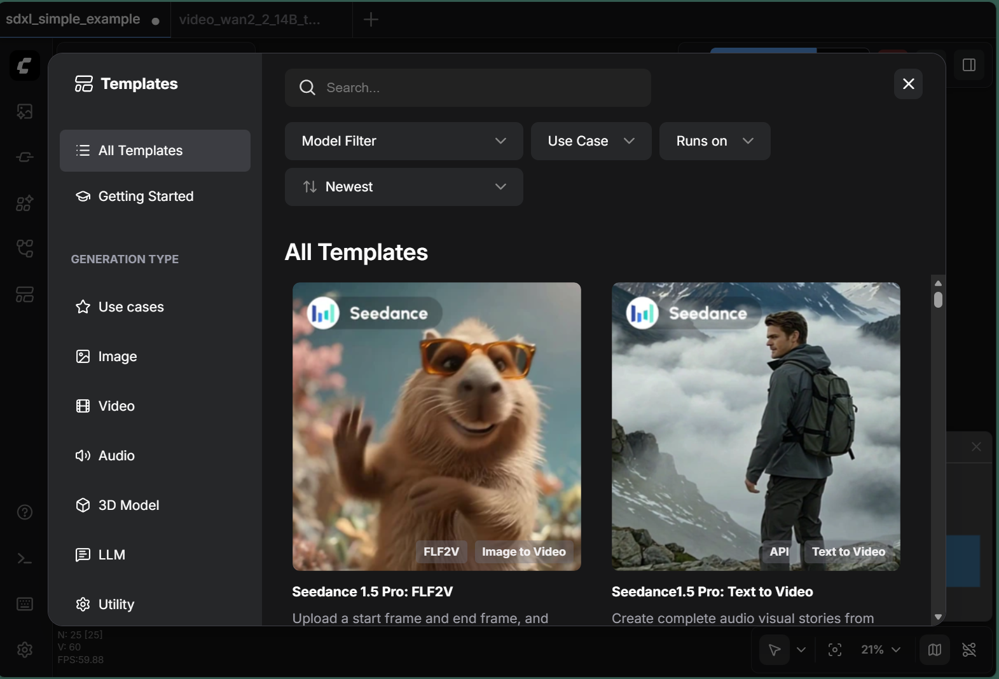
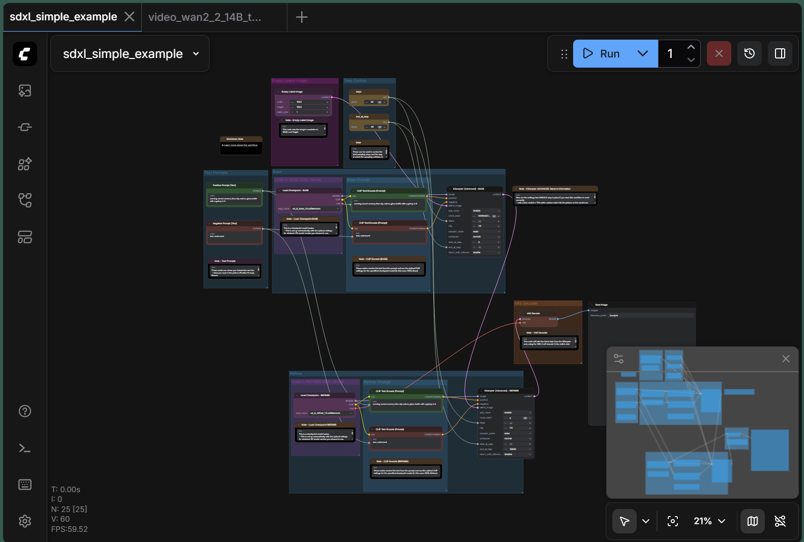
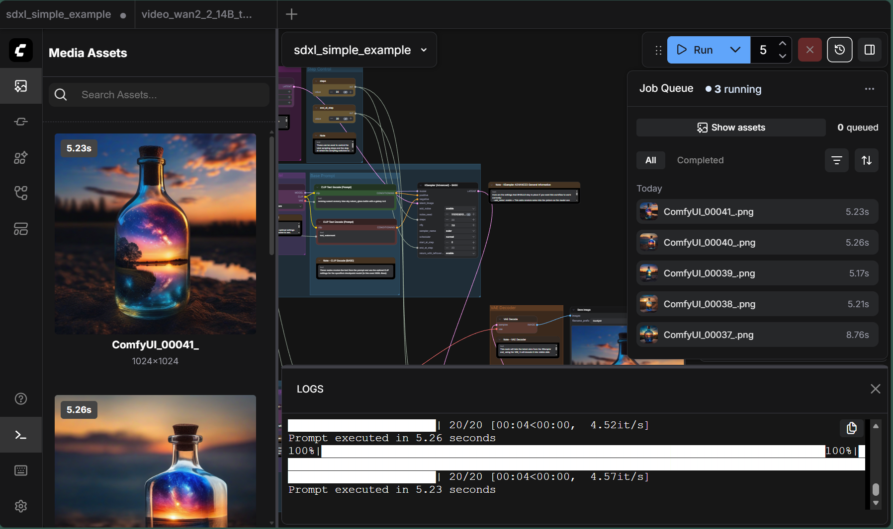
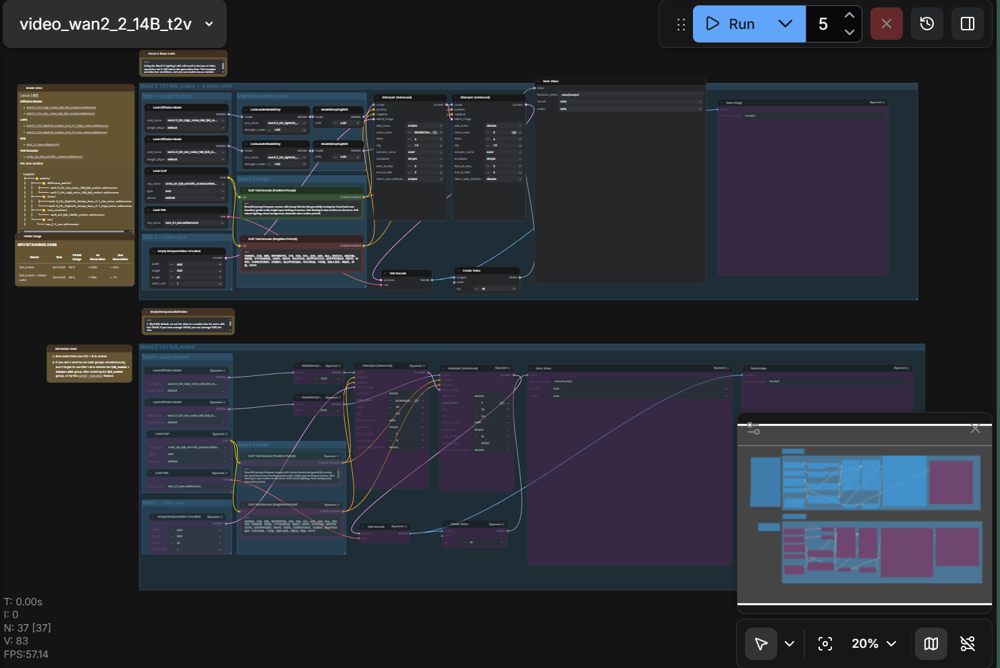
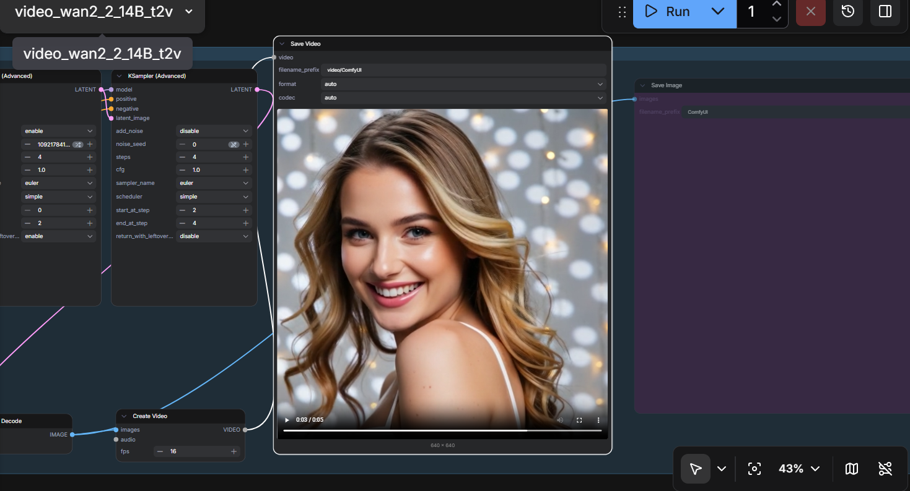

<!---
Copyright (c) 2026 Advanced Micro Devices, Inc. (AMD)

Permission is hereby granted, free of charge, to any person obtaining a copy
of this software and associated documentation files (the "Software"), to deal
in the Software without restriction, including without limitation the rights
to use, copy, modify, merge, publish, distribute, sublicense, and/or sell
copies of the Software, and to permit persons to whom the Software is
furnished to do so, subject to the following conditions:

The above copyright notice and this permission notice shall be included in all
copies or substantial portions of the Software.

THE SOFTWARE IS PROVIDED "AS IS", WITHOUT WARRANTY OF ANY KIND, EXPRESS OR
IMPLIED, INCLUDING BUT NOT LIMITED TO THE WARRANTIES OF MERCHANTABILITY,
FITNESS FOR A PARTICULAR PURPOSE AND NONINFRINGEMENT. IN NO EVENT SHALL THE
AUTHORS OR COPYRIGHT HOLDERS BE LIABLE FOR ANY CLAIM, DAMAGES OR OTHER
LIABILITY, WHETHER IN AN ACTION OF CONTRACT, TORT OR OTHERWISE, ARISING FROM,
OUT OF OR IN CONNECTION WITH THE SOFTWARE OR THE USE OR OTHER DEALINGS IN THE
SOFTWARE.
--->

# Getting Started with ComfyUI on AMD Radeon™ RX 9000 Series GPUs

ComfyUI has become a widely adopted and versatile node-based interface for Stable Diffusion and other generative AI models, gaining significant traction within the AI content creation community. Unlike traditional web-based interfaces, ComfyUI provides a node-based workflow system that gives users complete control over their image and video generation pipelines. Its modular architecture allows for complex workflows involving multiple models, LoRAs, ControlNets, and custom processing steps.

**The challenge**: Many AMD GPU users have encountered stability issues when running ComfyUI, including HIP memory errors, slow first-time generation, and VAE decoding failures. These issues can be frustrating for users transitioning from NVIDIA hardware or setting up their first AI generation workflow.

With the release of AMD Radeon RX 9000 series GPUs based on the RDNA 4 architecture, along with continued improvements in the AMD ROCm™ software stack, AMD users can now leverage ComfyUI for AI generation workflows. In this blog, we will discuss how to set up ComfyUI on AMD Radeon hardware, address the most common issues encountered by the community, and share performance optimization strategies based on our hands-on testing.

```{note}
This blog focuses on native Linux setups with AMD Radeon consumer GPUs. If you are interested in running ComfyUI on AMD Instinct data center GPUs, see [Running ComfyUI on AMD Instinct](https://rocm.blogs.amd.com/software-tools-optimization/comfyui-on-amd/README.html). For a Windows-based setup using WSL, see [Running ComfyUI in Windows with ROCm on WSL](https://rocm.blogs.amd.com/software-tools-optimization/rocm-on-wsl/README.html).
```

## Why ComfyUI?

ComfyUI offers several advantages for AI content creators:

- **Visual Workflow Editor**: Design complex generation pipelines through an intuitive node-based interface
- **Memory Efficiency**: Advanced model management that enables running large models on consumer hardware
- **Extensibility**: Rich ecosystem of custom nodes and community extensions
- **Reproducibility**: Save and share workflows as JSON files for consistent results
- **Multi-Model Support**: Native support for Stable Diffusion, SDXL, Flux, WAN video models, and more

As shown in Figure 1 below, ComfyUI's template browser makes it easy to get started with a variety of generation tasks.


*Figure 1: ComfyUI's built-in template browser provides ready-to-use workflows for various generation types including Image, Video, Audio, 3D Model, and LLM applications.*

## System Requirements

### Hardware Requirements

| Component | Minimum | Recommended |
|-----------|---------|-------------|
| GPU | AMD Radeon RX 7000 Series (RDNA3) | AMD Radeon RX 9000 Series (RDNA4) |
| VRAM | 8GB | 16GB+ |
| System RAM | 16GB | 32GB+ |
| Storage | 50GB free space | SSD with 100GB+ free space |

### Software Requirements

| Component | Version |
|-----------|---------|
| Operating System | Ubuntu 22.04 LTS or Ubuntu 24.04 LTS |
| ROCm | 7.1 |
| Python | 3.10 - 3.12 |
| PyTorch | 2.6.0+ with ROCm support |

### Supported GPU Models

The following AMD Radeon GPUs have been tested with this configuration:

- AMD Radeon RX 9070 XT (RDNA4)
- AMD Radeon RX 9070 (RDNA4)
- AMD Radeon RX 7900 XTX (RDNA3)
- AMD Radeon RX 7900 XT (RDNA3)
- AMD Radeon RX 7900 GRE (RDNA3)

## Installation Guide

### Option 1: Docker Installation (Recommended)

Docker provides an isolated environment with pre-configured ROCm support, eliminating many common installation issues.

1. Pull the ROCm PyTorch image:

   ```bash
   docker pull rocm/pytorch:rocm7.1_ubuntu24.04_py3.12_pytorch_release_2.6.0
   ```

2. Launch the container:

   ```bash
   WORKSPACE_DIR="$HOME/comfyui_workspace"
   mkdir -p $WORKSPACE_DIR

   docker run -it \
     --name comfyui-rocm \
     --device=/dev/kfd \
     --device=/dev/dri \
     --group-add video \
     --group-add render \
     --ipc=host \
     --network=host \
     -v $WORKSPACE_DIR:/workspace \
     -w /workspace \
     rocm/pytorch:rocm7.1_ubuntu24.04_py3.12_pytorch_release_2.6.0 \
     /bin/bash
   ```

3. Install ComfyUI inside the container:

   ```bash
   cd /workspace
   git clone https://github.com/comfyanonymous/ComfyUI.git
   cd ComfyUI
   pip install -r requirements.txt
   ```

4. Launch ComfyUI:

   ```bash
   python main.py --listen 0.0.0.0
   ```

Access the web interface at `http://localhost:8188`.

### Option 2: Native Installation

For users who prefer a native installation without Docker:

1. Install ROCm by following the official ROCm installation guide for your distribution:
   <https://rocm.docs.amd.com/projects/install-on-linux/en/latest/>

2. Create a Python environment:

   ```bash
   python3 -m venv comfyui_env
   source comfyui_env/bin/activate
   ```

3. Install PyTorch with ROCm support:

   ```bash
   pip install torch torchvision --index-url https://download.pytorch.org/whl/rocm7.1
   ```

4. Clone and install ComfyUI:

   ```bash
   git clone https://github.com/comfyanonymous/ComfyUI.git
   cd ComfyUI
   pip install -r requirements.txt
   python main.py --listen 0.0.0.0
   ```

## Common Issues and Solutions on AMD Radeon

This section addresses the most frequently encountered issues when running ComfyUI on AMD Radeon GPUs, based on community feedback and our extensive testing.

### Issue 1: Out of Memory (OOM) Errors

**Symptoms:**

- "CUDA out of memory" or "HIP out of memory" errors during generation
- Process crashes during model loading or VAE decoding
- Errors appear more frequently with larger models (SDXL, Flux, WAN 2.2)

**Root Cause:**
AMD GPUs require careful VRAM management. Unlike NVIDIA GPUs, the memory allocation behavior can differ, and some operations may require more headroom.

**Solutions:**

1. Reserve VRAM for system operations by launching ComfyUI with the `--reserve-vram` flag:

   ```bash
   python main.py --listen 0.0.0.0 --reserve-vram 3
   ```

   This reserves 3GB of VRAM for system operations and PyTorch overhead, preventing allocation failures.

2. Enable low VRAM mode for GPUs with 8-12GB VRAM:

   ```bash
   python main.py --listen 0.0.0.0 --lowvram
   ```

3. Disable smart memory management if you experience inconsistent memory behavior:

   ```bash
   python main.py --listen 0.0.0.0 --disable-smart-memory
   ```

### Issue 2: Slow First Generation (MIOpen Compilation)

**Symptoms:**

- First image generation takes significantly longer than subsequent generations
- Terminal shows compilation messages during initial run
- Performance improves dramatically after the first generation

**Root Cause:**
MIOpen (the AMD equivalent to cuDNN) compiles optimized kernels for your specific GPU on first use. This compilation is cached for future runs.

**Expected Behavior:**

| Generation | Time (SDXL 1024x1024, 20 steps) |
|------------|----------------------------------|
| First run | ~9 seconds |
| Subsequent runs | ~5 seconds |

**Solutions:**

1. Be patient: The first run includes one-time optimization. Subsequent runs will be faster.

2. Preserve MIOpen cache by ensuring the cache directory persists between sessions:

   ```bash
   export MIOPEN_USER_DB_PATH=$HOME/.cache/miopen
   ```

### Issue 3: VAE Decoding Failures

**Symptoms:**

- Errors during the final VAE decode step
- "Ran out of memory when regular VAE decoding, retrying with tiled VAE decoding" warning
- Black or corrupted output images

**Root Cause:**
VAE decoding requires significant contiguous VRAM. When VRAM is fragmented or nearly full, the standard decode may fail.

**Solutions:**

1. Use tiled VAE nodes: ComfyUI automatically falls back to tiled VAE when memory is insufficient. This is normal behavior and produces identical results.

2. Force CPU VAE as a last resort:

   ```bash
   python main.py --listen 0.0.0.0 --cpu-vae
   ```

   Note: This significantly slows VAE operations but ensures completion.

3. Use FP32 VAE for precision issues:

   ```bash
   python main.py --listen 0.0.0.0 --fp32-vae
   ```

### Issue 4: HIP Illegal Memory Access Errors

**Symptoms:**

- "HIP error: an illegal memory access was encountered"
- Random crashes after several successful generations
- More frequent with continuous batch processing

**Root Cause:**
This issue has been addressed in recent ComfyUI versions through automatic backend optimization. The latest ComfyUI automatically sets `torch.backends.cudnn.enabled = False` for AMD GPUs, which significantly improves stability.

**Solutions:**

1. Update ComfyUI to the latest version:

   ```bash
   cd ComfyUI
   git pull
   pip install -r requirements.txt
   ```

2. Verify automatic optimization by checking your terminal output for:

   ```text
   Set: torch.backends.cudnn.enabled = False for better AMD performance.
   ```

   If you see this message, the optimization is active.

3. For older versions, manually disable cuDNN by creating a startup script:

   ```python
   import torch
   torch.backends.cudnn.enabled = False
   ```

### Issue 5: Multiple GPU Configuration

**Symptoms:**

- ComfyUI uses the wrong GPU
- Multi-GPU systems not utilizing all cards

**Solutions:**

1. Specify GPU device:

   ```bash
   HIP_VISIBLE_DEVICES=0 python main.py --listen 0.0.0.0
   ```

2. For multi-GPU workflows: ComfyUI primarily uses a single GPU. For parallel workflows, consider running multiple ComfyUI instances on different ports.

## Recommended Launch Configurations

Based on our testing, we recommend the following configurations:

### For 16GB VRAM GPUs (RX 9070 XT, RX 7900 XTX)

```bash
python main.py --listen 0.0.0.0 --reserve-vram 3
```

### For 12GB VRAM GPUs

```bash
python main.py --listen 0.0.0.0 --reserve-vram 2 --lowvram
```

### For Maximum Stability

```bash
python main.py --listen 0.0.0.0 --reserve-vram 3 --disable-smart-memory
```

### Environment Variables for Optimization

```bash
export PYTORCH_HIP_ALLOC_CONF=expandable_segments:True
export HSA_ENABLE_SDMA=0
```

## Performance Benchmarks

The following benchmarks were conducted on an AMD Radeon AI PRO R9700 (32GB VRAM) with ROCm 7.1:

> **Note**: Performance may vary based on VRAM capacity. Users with 16GB VRAM GPUs may experience slightly different results, particularly with larger models.

### SDXL Performance

| Configuration | First Run | Subsequent Runs | Inference Speed |
|---------------|-----------|-----------------|-----------------|
| 1024x1024, 20 steps | 9.02s | ~5.2s | 4.6 it/s |

### WAN 2.2 Video Generation (5B Model)

| Metric | Value |
|--------|-------|
| Per-frame generation | ~25 seconds |
| VAE behavior | Automatic tiled decode |

### Stability Test Results

| Test | Result |
|------|--------|
| 12 consecutive SDXL generations | 12/12 successful |
| HIP errors encountered | 0 |

## Example Workflow Results

### SDXL Image Generation

The following demonstrates a typical SDXL workflow in ComfyUI. Figure 2 shows the node-based pipeline, and Figure 3 shows the generation output with performance metrics.


*Figure 2: SDXL workflow showing the node-based pipeline with model loading, prompt encoding, sampling, and VAE decoding stages.*


*Figure 3: SDXL generation results showing high-quality 1024x1024 output. The logs panel displays real-time performance metrics: 20/20 steps completed at 4.52 it/s, with total execution time of 5.23 seconds.*

### WAN 2.2 Video Generation

ComfyUI also supports video generation workflows using the WAN 2.2 model. Figure 4 shows the text-to-video pipeline, and Figure 5 shows the resulting output.


*Figure 4: WAN 2.2 video generation workflow with text-to-video pipeline configuration.*


*Figure 5: WAN 2.2 video generation result showing a 1024x1024 video output. The workflow successfully generates smooth video content from text prompts.*

## Troubleshooting Checklist

If you encounter issues, verify the following:

1. ROCm installation:

   ```bash
   rocm-smi --showproductname
   ```

   Confirm your GPU is detected.

2. PyTorch ROCm support:

   ```python
   import torch
   print(torch.cuda.is_available())  # Should be True
   print(torch.version.hip)  # Should show HIP version
   ```

3. ComfyUI version:

   ```bash
   cd ComfyUI
   git log -1 --oneline
   ```

   Ensure you're on a recent commit.

4. Memory status:

   ```bash
   rocm-smi --showmeminfo vram
   ```

   Monitor VRAM usage during generation.

## Additional Resources

- ComfyUI Official Documentation: <https://docs.comfy.org/>
- ComfyUI GitHub Repository: <https://github.com/comfyanonymous/ComfyUI>
- ROCm Documentation: <https://rocm.docs.amd.com/>
- AMD Community Forums: <https://community.amd.com/>
- Running ComfyUI on AMD Instinct: <https://rocm.blogs.amd.com/software-tools-optimization/comfyui-on-amd/README.html>
- Running ComfyUI in Windows with ROCm on WSL: <https://rocm.blogs.amd.com/software-tools-optimization/rocm-on-wsl/README.html>

## Summary

ComfyUI on AMD Radeon RX 9000 series GPUs delivers a robust and performant experience for AI image and video generation. With ROCm 7.1 and the latest ComfyUI optimizations, many historical stability issues have been resolved. By following the configurations outlined in this guide, users can achieve reliable, high-quality generation results.

The key takeaways are:

1. **Use the latest ComfyUI version** - It includes automatic AMD optimizations
2. **Reserve VRAM appropriately** - Use `--reserve-vram 3` for 16GB+ cards
3. **First run will be slower** - MIOpen compilation is a one-time process
4. **VAE tiled mode is normal** - It ensures completion under memory pressure

Ready to get started? Download ComfyUI from the [official GitHub repository](https://github.com/comfyanonymous/ComfyUI), follow the installation steps above, and start creating. If you encounter any issues not covered in this guide, visit the [AMD Community Forums](https://community.amd.com/) or open an issue on the ComfyUI GitHub repository.

## Disclaimers

Third-party content is licensed to you directly by the third party that owns the
content and is not licensed to you by AMD. ALL LINKED THIRD-PARTY CONTENT IS
PROVIDED "AS IS" WITHOUT A WARRANTY OF ANY KIND. USE OF SUCH THIRD-PARTY CONTENT
IS DONE AT YOUR SOLE DISCRETION AND UNDER NO CIRCUMSTANCES WILL AMD BE LIABLE TO
YOU FOR ANY THIRD-PARTY CONTENT. YOU ASSUME ALL RISK AND ARE SOLELY RESPONSIBLE
FOR ANY DAMAGES THAT MAY ARISE FROM YOUR USE OF THIRD-PARTY CONTENT.
