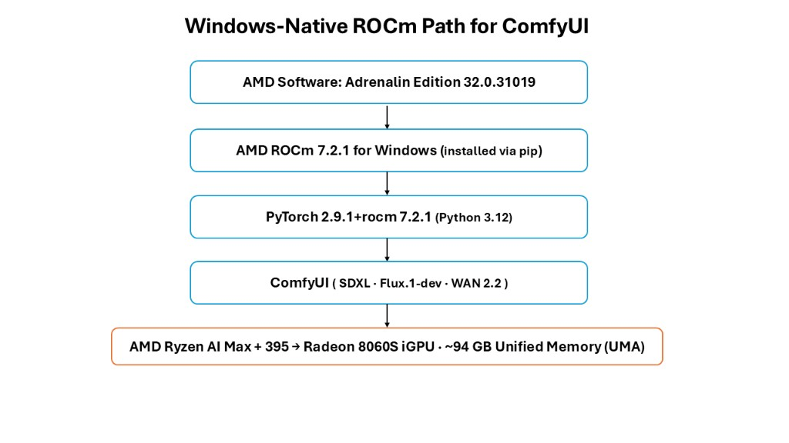
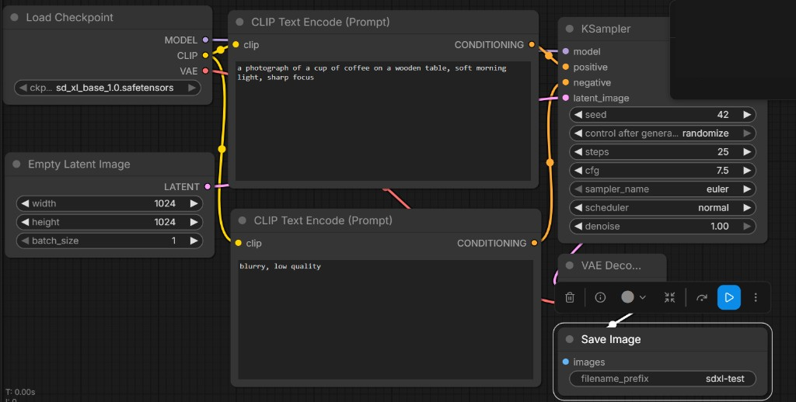
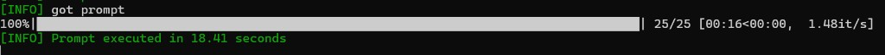
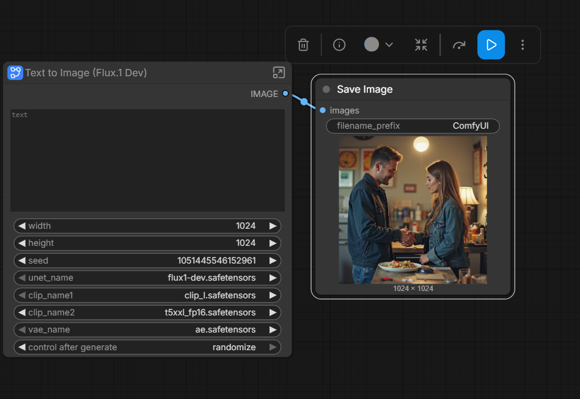
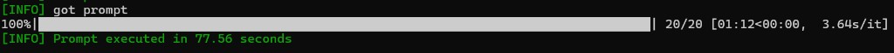
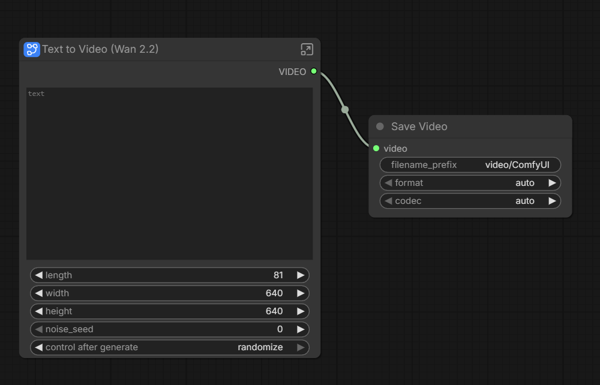
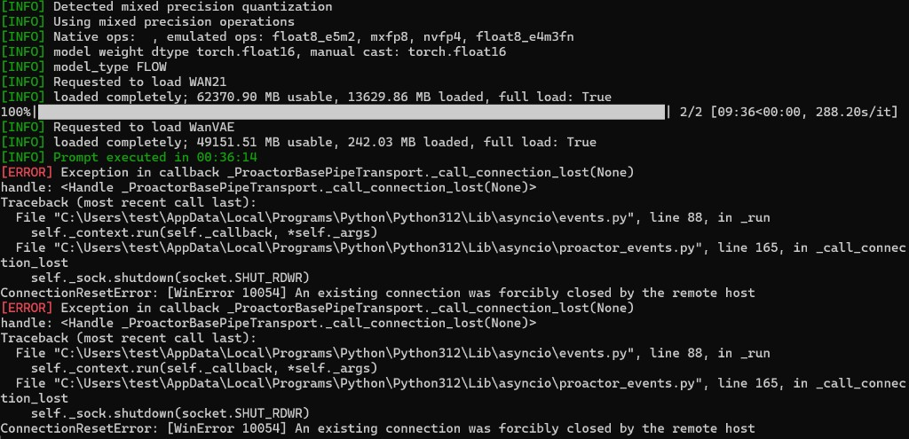

<!---
Copyright (c) 2026 Advanced Micro Devices, Inc. (AMD)

Permission is hereby granted, free of charge, to any person obtaining a copy
of this software and associated documentation files (the "Software"), to deal
in the Software without restriction, including without limitation the rights
to use, copy, modify, merge, publish, distribute, sublicense, and/or sell
copies of the Software, and to permit persons to whom the Software is
furnished to do so, subject to the following conditions:

The above copyright notice and this permission notice shall be included in all
copies or substantial portions of the Software.

THE SOFTWARE IS PROVIDED "AS IS", WITHOUT WARRANTY OF ANY KIND, EXPRESS OR
IMPLIED, INCLUDING BUT NOT LIMITED TO THE WARRANTIES OF MERCHANTABILITY,
FITNESS FOR A PARTICULAR PURPOSE AND NONINFRINGEMENT. IN NO EVENT SHALL THE
AUTHORS OR COPYRIGHT HOLDERS BE LIABLE FOR ANY CLAIM, DAMAGES OR OTHER
LIABILITY, WHETHER IN AN ACTION OF CONTRACT, TORT OR OTHERWISE, ARISING FROM,
OUT OF OR IN CONNECTION WITH THE SOFTWARE OR THE USE OR OTHER DEALINGS IN THE
SOFTWARE.
--->

# Local Image and Video Generation on AMD Ryzen™ AI Max+ Processor (Windows)

Running local generative-AI image and video workflows on AMD hardware on Windows has typically meant going through the Windows Subsystem for Linux (WSL). That works, but it adds a virtualization layer, extra setup, and a mental model that many creators would rather avoid.

With AMD ROCm™ 7.2.1, you can now run PyTorch — and therefore ComfyUI — **natively on Windows** on an AMD Ryzen™ AI Max+ processor, driving the integrated AMD Radeon™ 8060S GPU directly. Combined with the processor's unified memory architecture (UMA), a single integrated GPU can address a very large memory pool, which is exactly what heavy diffusion and video workflows need.

This post builds on earlier ComfyUI-on-AMD guides from our team — including [Getting Started with ComfyUI on AMD Radeon™ RX 9000 Series GPUs](https://rocm.blogs.amd.com/artificial-intelligence/comfyui-radeon-9000/README.html) for discrete Radeon™ GPUs on Linux — and focuses specifically on a native Windows setup on an integrated GPU with unified memory.

If you build, evaluate, or self-host diffusion workflows on AMD hardware on Windows, this blog gives you a concrete, reproducible path. By the end you will know how to:

- Install AMD ROCm™ 7.2.1 and a matching PyTorch build natively on Windows (no WSL);
- Install ComfyUI and bind it to the AMD Radeon™ 8060S integrated GPU;
- Run SDXL, Flux.1-dev, and a short-form video (WAN 2.2) workflow, and read ComfyUI's performance output;
- Understand how the AMD Ryzen™ AI Max+ unified memory pool benefits ComfyUI workflows.

```{note}
This blog focuses on a native Windows setup. If you are interested in a Linux setup with AMD Radeon™ RX 9000 series discrete GPUs, see [Getting Started with ComfyUI on AMD Radeon™ RX 9000 Series GPUs](https://rocm.blogs.amd.com/artificial-intelligence/comfyui-radeon-9000/README.html). For a Windows setup using WSL, see [Running ComfyUI in Windows with ROCm on WSL](https://rocm.blogs.amd.com/software-tools-optimization/rocm-on-wsl/README.html).
```

## System Requirements

| Component | Specification |
|-----------|--------------|
| Processor | AMD Ryzen™ AI Max+ 395 (16 cores / 32 threads) |
| Integrated GPU | AMD Radeon™ 8060S Graphics (RDNA 3.5 / gfx1151) |
| System Memory | 128 GB LPDDR5X (Unified), 8533 MT/s |
| GPU-Accessible Memory | ~94 GB (BIOS configurable) |
| Operating System | Windows 11 Pro (24H2, build 26100) |
| AMD Software | Adrenalin Edition 32.0.31019 or newer |
| AMD ROCm™ | 7.2.1 (Windows) |
| Python | 3.12 (cp312 wheels only) |
| PyTorch | 2.9.1+rocm7.2.1 |
| ComfyUI | master @ ab0d8a92 (Jun 2026) |

## Why unified memory matters for ComfyUI

Traditional discrete GPUs commonly ship with 8–24 GB of dedicated VRAM. That ceiling forces diffusion users into compromises: aggressive quantization, model offloading, or simply not being able to keep a large model, its VAE, and several LoRAs resident at once.

AMD Ryzen™ AI Max+ processors use a unified memory architecture in which the CPU and integrated GPU share the same physical memory pool. On this system, around 94 GB of that pool is addressable by the Radeon™ 8060S — enough headroom that a single integrated GPU can host workflows that would not fit on a typical discrete card. For context, the SDXL benchmark below loads in well under 10 GB, leaving the large majority of that pool free for bigger models, batched generation, and video.

The story here is **capacity and flexibility, not raw speed**: an integrated GPU will not match a high-end discrete card on tokens or iterations per second, but it can run workflows end to end on a single, quiet, all-purpose Windows machine. Figure 1 shows the software path used throughout this blog.



*Figure 1: The Windows-native software path. AMD ROCm™ 7.2.1 and PyTorch install through pip on top of the Adrenalin driver, and ComfyUI drives the integrated Radeon™ 8060S with access to roughly 94 GB of unified memory — no WSL layer.*

## Installation Guide

The entire stack installs through `pip` — there is no separate HIP SDK installer and no WSL.

### Prerequisites

- Windows 11 with AMD Software: Adrenalin Edition 32.0.31019 or newer.
- Python 3.12. The AMD ROCm™ Windows wheels are built for CPython 3.12 only (`cp312`); Python 3.13 will not work.

Install Python 3.12 (this can coexist with other Python versions):

```powershell
winget install --id=Python.Python.3.12 -e
```

### Create a virtual environment

```powershell
mkdir C:\work
cd C:\work
py -3.12 -m venv comfyui-venv
.\comfyui-venv\Scripts\Activate.ps1
python -m pip install --upgrade pip wheel
```

### Install AMD ROCm™ and PyTorch

The AMD ROCm™ Windows PyTorch wheels are hosted at `https://repo.radeon.com/rocm/windows/rocm-rel-7.2.1/`. This is a plain file listing, not a PyPI-style index, so use it as a find-links source with `-f` (not `--index-url`):

```powershell
pip install `
    -f https://repo.radeon.com/rocm/windows/rocm-rel-7.2.1/ `
    "torch==2.9.1+rocm7.2.1" `
    "torchvision==0.24.1+rocm7.2.1" `
    "torchaudio==2.9.1+rocm7.2.1" `
    numpy pillow
```

```{note}
The `torch` wheel depends on a package named `rocm==7.2.1`, which is published in the AMD repository (not on PyPI). The `-f` flag lets pip resolve it from there. If you instead pass the wheel URLs directly, pip cannot find `rocm==7.2.1` and the install fails.
```

Verify that PyTorch detects the integrated GPU:

```powershell
python -c "import torch; print(torch.__version__); print(torch.cuda.is_available()); print(torch.cuda.get_device_name(0)); print(round(torch.cuda.get_device_properties(0).total_memory/1e9, 2), 'GB')"
```

Expected output (the reported memory depends on your BIOS unified-memory allocation):

```text
2.9.1+rocm7.2.1
True
AMD Radeon(TM) 8060S Graphics
94.35 GB
```

### Install ComfyUI

```powershell
cd C:\work
git clone https://github.com/comfyanonymous/ComfyUI.git
cd ComfyUI
```

ComfyUI's `requirements.txt` lists `torch`, `torchvision`, and `torchaudio` without versions. Installing it directly can pull the default CUDA build from PyPI and silently replace your ROCm build. Pin the ROCm versions with a constraints file:

```powershell
pip freeze | Select-String "^(torch|torchvision|torchaudio|rocm|pytorch_triton_rocm)" | Out-File -Encoding utf8 torch-pin.txt
(Get-Content requirements.txt) | Where-Object { $_ -notmatch "^(torch|torchvision|torchaudio)\b" } | Out-File -Encoding utf8 req-no-torch.txt
pip install -c torch-pin.txt -r req-no-torch.txt
```

Confirm the ROCm PyTorch build is still in place:

```powershell
python -c "import torch; print(torch.__version__, torch.cuda.is_available(), torch.cuda.get_device_name(0))"
```

This must still report `2.9.1+rocm7.2.1 True AMD Radeon(TM) 8060S Graphics`.

### Download a model and launch

```powershell
cd C:\work\ComfyUI\models\checkpoints
Invoke-WebRequest -Uri "https://huggingface.co/stabilityai/stable-diffusion-xl-base-1.0/resolve/main/sd_xl_base_1.0.safetensors" -OutFile "sd_xl_base_1.0.safetensors"
cd C:\work\ComfyUI
python main.py --listen 127.0.0.1 --port 8188
```

Open `http://127.0.0.1:8188` in your browser.

## Performance Benchmarks

All numbers below were collected on the system in the [System Requirements](#system-requirements) table. Each workflow lists its own generation settings, since they differ across SDXL, Flux.1-dev, and WAN 2.2.

### SDXL

Here we generated at 1024×1024 with 25 steps and the Euler sampler. On first launch, the AOTriton attention backend warms up in seconds — there is no multi-minute kernel compile that some AMD diffusion setups require. As a result the first and subsequent runs are close in time, as shown in Figure 2 and Figure 3.

| Run | Sampling speed | End-to-end time |
|-----|---------------|-----------------|
| First run (cold) | 1.43 it/s | 26.57 s |
| Steady state | 1.48 it/s | 18.41 s |

The SDXL UNet loads in roughly 4.9 GB and the text encoder in roughly 1.6 GB, so the full SDXL workflow uses under 10 GB of the ~94 GB available — leaving ample room for larger models, batching, and video.



*Figure 2: The SDXL text-to-image workflow in ComfyUI — Load Checkpoint, two CLIP Text Encode nodes, KSampler, VAE Decode, and Save Image.*



*Figure 3: SDXL console output on the integrated Radeon™ 8060S — 1.48 it/s in steady state, with the prompt executed in 18.41 seconds.*

### Flux.1-dev

We ran Flux.1-dev at **full precision** — the 23.8 GB `flux1-dev` diffusion model paired with the full-precision `t5xxl_fp16` text encoder (9.79 GB) — generating at 1024×1024 with 20 steps. This is a point that the unified-memory pool makes possible: on a typical 8–24 GB discrete card you would be limited to fp8 quantized weights, whereas here both the model and the fp16 T5 encoder load fully (`full load: True`), with GPU memory peaking around **34 GB**.

| Run | Sampling speed | End-to-end time |
|-----|---------------|-----------------|
| First run (cold) | 3.65 s/it | 103.89 s |
| Steady state | 3.64 s/it | 77.56 s |

The Flux 12B diffusion transformer is heavier per step than SDXL's UNet, so a 1024×1024 image takes a little over a minute in steady state — practical for high-quality stills on an integrated GPU. Figure 4 shows the workflow and a generated image, and Figure 5 shows the console output.



*Figure 4: The full-precision Flux.1-dev workflow in ComfyUI, showing the diffusion model, dual CLIP loader (clip_l + t5xxl_fp16), VAE, and a generated 1024×1024 image.*



*Figure 5: Flux.1-dev console output — 3.64 s/it at full precision, with the prompt executed in 77.56 seconds in steady state.*

### Short-form video (WAN 2.2)

For text-to-video we used the built-in "Text to Video (Wan 2.2)" blueprint, which pairs WAN 2.2's two 14B expert models (high-noise and low-noise, fp8) with the 4-step LightX2V LoRA. The generation settings were 640×640, 81 frames, 4 sampling steps (2 per expert).

This is where the unified-memory pool matters most. Across a single run, ComfyUI keeps the UMT5-xxl text encoder (~6.4 GB), the active 14B expert (~13.6 GB), and the WAN VAE resident, and swaps between the two expert models mid-run. GPU memory usage peaks around **42 GB** — well beyond the 8–24 GB found on typical discrete cards, yet comfortably within the available pool.

| Run | high-noise sampling | low-noise sampling | End-to-end time |
|-----|---------------------|--------------------|-----------------|
| First run (cold) | ~288 s/it | 288 s/it | 36 min 14 s |
| Steady state | 197 s/it | 186 s/it | 26 min 51 s |

Video diffusion is far heavier than single-image generation — each step denoises all 81 frames at once — so per-step times are measured in minutes, not iterations per second. The takeaway is not raw speed but that a single integrated GPU can run a 28 GB dual-expert video model end to end on a quiet desktop system. Figure 6 shows the workflow, and Figure 7 shows the console output alongside peak GPU memory usage. The output is written to `output\video\` as an `.mp4`.



*Figure 6: The WAN 2.2 text-to-video blueprint with a Save Video node connected to its VIDEO output (640×640, 81 frames).*



*Figure 7: WAN 2.2 generation — the console shows the dual-expert sampling, and Windows Task Manager shows dedicated GPU memory peaking around 42 GB, well within the unified-memory pool.*

## Tuning Knobs

Two settings made the biggest practical difference in our testing:

- **Attention backend (AOTriton).** On this setup, PyTorch automatically used the AOTriton-backed efficient-attention path on the Radeon™ 8060S (visible in the console as `Using AOTriton backend for Efficient Attention`). This is what kept first-run warm-up to seconds rather than the long kernel-compile some AMD diffusion setups encounter.
- **BIOS unified-memory allocation.** The share of unified memory addressable by the integrated GPU is set in the system BIOS. On this system it reported about 94 GB available to the GPU, which is what allows full-precision Flux.1-dev and WAN 2.2's dual experts to load without quantization or offloading. If large workflows fall back to CPU or fail to load, raising this allocation is the first thing to check.

## Common Issues and Solutions

<!-- This section is the key differentiator — Windows-native specific pitfalls -->

- **`torch.cuda.is_available()` returns `False`** — the most common cause is that a CUDA build of PyTorch from PyPI replaced the ROCm build. Reinstall with `-f https://repo.radeon.com/rocm/windows/rocm-rel-7.2.1/ "torch==2.9.1+rocm7.2.1"`.
- **`No matching distribution found for rocm==7.2.1`** — you used direct wheel URLs instead of `-f`. Use the find-links form shown above so pip can resolve the `rocm` meta-package.
- **Python 3.13 install fails** — the wheels are `cp312` only; use Python 3.12.
- **ComfyUI replaces your torch build** — install ComfyUI requirements with the constraints file shown above.
- **Built-in model downloader does nothing** — it can fail silently and place files in the wrong folder. Download model files manually (for example with `curl.exe -L -C -`) into the correct `models\` subfolder. WAN 2.2, for instance, splits across `models\diffusion_models`, `models\loras`, `models\text_encoders`, and `models\vae`.
- **`WinError 10054` after a long run** — a harmless browser/websocket disconnect printed after very long generations (for example a multi-minute video). The output is already saved; just refresh the browser.
- **"Prompt has no outputs"** — the loaded workflow has no output node. Connect a `Save Video` (or `Save Image`) node to the workflow's output, then save your edited workflow so it persists across restarts.

## Recommended Configurations

| Use Case | Workflow | Notes |
|----------|----------|-------|
| Fast iteration | SDXL | Highest iteration speed among the workflows tested |
| High-quality stills | Flux.1-dev (full precision) | ~78 s/image; full-precision weights need the unified-memory headroom (peaks ~34 GB) |
| Short-form video | WAN 2.2 (dual 14B + 4-step LoRA) | Peaks around 42 GB — needs the unified-memory headroom |

## Summary

In this blog you set up ComfyUI natively on Windows on an AMD Ryzen™ AI Max+ processor — installing AMD ROCm™ 7.2.1 and a matching PyTorch build entirely through `pip`, with no WSL — and ran three workflows on the integrated AMD Radeon™ 8060S GPU: SDXL image generation, full-precision Flux.1-dev, and WAN 2.2 text-to-video. A single integrated GPU, backed by a large unified-memory pool, ran a full SDXL workflow in roughly 18 seconds, full-precision Flux.1-dev in about 78 seconds per image (peaking ~34 GB), and a 28 GB dual-expert WAN 2.2 video model end to end (peaking ~42 GB).

Key takeaways:

1. **Native Windows ROCm works without WSL.** The entire AMD ROCm™ 7.2.1 and PyTorch stack installs through `pip`.
2. **Unified memory removes the VRAM ceiling.** With about 94 GB addressable by the integrated GPU, workflows that peak at 34–42 GB — full-precision Flux.1-dev and WAN 2.2's dual 14B experts — run on a single integrated GPU, which a typical 8–24 GB discrete card cannot do without quantization or offloading.
3. **Performance is practical for local creative work.** SDXL runs around 1.48 it/s in steady state, Flux.1-dev produces a 1024×1024 image in about 78 seconds, and short-form video completes end to end — all on the same quiet desktop system.

We are continuing to explore on-device generative AI on AMD Ryzen™ AI Max+ processors. Stay tuned for future posts from our team. In the meantime, download [ComfyUI](https://github.com/comfyanonymous/ComfyUI) and try these workflows on your own AMD Ryzen™ AI Max+ processor-based system.

## Test environment disclosure

All benchmarks were collected on an AMD Ryzen™ AI Max+ 395 system with 128 GB unified memory (approximately 94 GB allocated to the GPU), running Windows 11 Pro (24H2), AMD Software: Adrenalin Edition 32.0.31019, AMD ROCm™ 7.2.1, Python 3.12, and PyTorch 2.9.1+rocm7.2.1. Benchmarks were collected using SDXL at 1024×1024 with 25 steps and the Euler sampler. Performance may vary based on system configuration, memory allocation, drivers, operating system, and software versions.

## Disclaimers

Third-party content is licensed to you directly by the third party that owns the
content and is not licensed to you by AMD. ALL LINKED THIRD-PARTY CONTENT IS
PROVIDED “AS IS” WITHOUT A WARRANTY OF ANY KIND. USE OF SUCH THIRD-PARTY CONTENT
IS DONE AT YOUR SOLE DISCRETION AND UNDER NO CIRCUMSTANCES WILL AMD BE LIABLE TO
YOU FOR ANY THIRD-PARTY CONTENT. YOU ASSUME ALL RISK AND ARE SOLELY RESPONSIBLE
FOR ANY DAMAGES THAT MAY ARISE FROM YOUR USE OF THIRD-PARTY CONTENT.

ComfyUI is a product of Comfy Org / its respective maintainers. Stable Diffusion XL is a model by Stability AI. FLUX is a model by Black Forest Labs. Windows is a trademark of the Microsoft group of companies. Python is a trademark of the Python Software Foundation. All other product names, logos, and brands are property of their respective owners.

The information contained herein is for informational purposes only and is subject to change without notice. While every precaution has been taken in the preparation of this document, it may contain technical inaccuracies, omissions and typographical errors, and AMD is under no obligation to update or otherwise correct this information. Advanced Micro Devices, Inc. makes no representations or warranties with respect to the accuracy or completeness of the contents of this document, and assumes no liability of any kind, including the implied warranties of noninfringement, merchantability or fitness for particular purposes, with respect to the operation or use of AMD hardware, software or other products described herein. No license, including implied or arising by estoppel, to any intellectual property rights is granted by this document. Terms and limitations applicable to the purchase or use of AMD products are set forth in a signed agreement between the parties or in AMD's Standard Terms and Conditions of Sale. GD-18u.

© 2026 Advanced Micro Devices, Inc. All rights reserved. AMD, the AMD Arrow logo, Radeon, ROCm, Ryzen, and combinations thereof are trademarks of Advanced Micro Devices, Inc. Other product names used in this publication are for identification purposes only and may be trademarks of their respective owners. Certain AMD technologies may require third-party enablement or activation. Supported features may vary by operating system. Please confirm with the system manufacturer for specific features. No technology or product can be completely secure.
