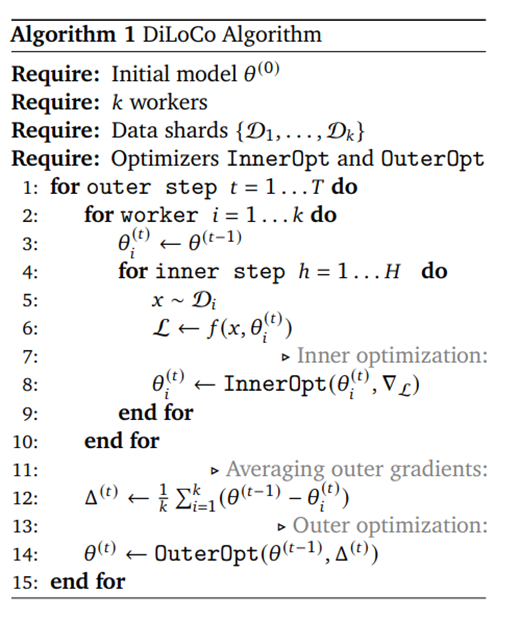
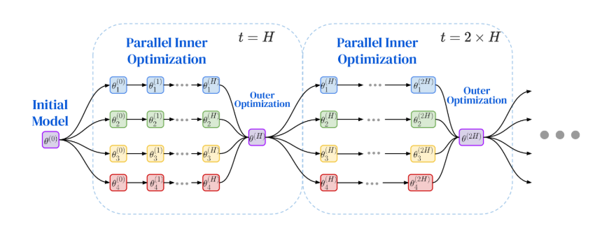
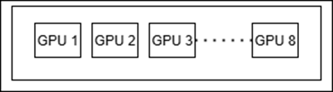

<!---
Copyright (c) 2025 Advanced Micro Devices, Inc. (AMD)

Permission is hereby granted, free of charge, to any person obtaining a copy of this software and associated documentation files (the "Software"), to deal in the Software without restriction, including without limitation the rights to use, copy, modify, merge, publish, distribute, sublicense, and/or sell copies of the Software, and to permit persons to whom the Software is furnished to do so, subject to the following conditions:

The above copyright notice and this permission notice shall be included in all copies or substantial portions of the Software.

THE SOFTWARE IS PROVIDED "AS IS", WITHOUT WARRANTY OF ANY KIND, EXPRESS OR IMPLIED, INCLUDING BUT NOT LIMITED TO THE WARRANTIES OF MERCHANTABILITY, FITNESS FOR A PARTICULAR PURPOSE AND NONINFRINGEMENT. IN NO EVENT SHALL THE AUTHORS OR COPYRIGHT HOLDERS BE LIABLE FOR ANY CLAIM, DAMAGES OR OTHER LIABILITY, WHETHER IN AN ACTION OF CONTRACT, TORT OR OTHERWISE, ARISING FROM, OUT OF OR IN CONNECTION WITH THE SOFTWARE OR THE USE OR OTHER DEALINGS IN THE SOFTWARE.
--->

# A Step-by-Step Walkthrough of Decentralized LLM Training on AMD GPUs

LLMs have shown great capability to generalize new tasks and are at the
core of many AI applications recently. Performance of these models has scaled
with model size, resulting in training of larger models on massive datasets.
This increase in computation requirements has led to training of these LLMs on
a huge number of GPUs and poses significant engineering and infrastructure challenges
in ensuring standard backpropagation training. They are trained on a strongly
interconnected network of devices and hence limit training of the models to a
single cluster / data center.

In this blog, you will learn how decentralized training offers a practical alternative
to this model. We walk through the fundamentals of decentralized LLM training, introduce
the DiLoCo algorithm, and demonstrate how to run real training workloads using the Prime
framework on AMD Instinct™ MI300 GPUs. By the end, you will understand how to scale
LLM training beyond a single cluster, reduce communication overhead, and unlock
underutilized GPU resources across geographically distributed environments.

## Distributed and Decentralized Training Paradigms

Most models are trained on a collection of GPUs in parallel, referred to as
distributed training, with the most popular approaches being Distributed
Data Parallel (DDP), Full Sharded Data Parallel (FSDP), etc. These are very
effective and have helped push the boundaries and resulted in breakthroughs in
training LLMs. However, the biggest limitation with this approach is that it
requires the presence of a huge number of GPUs in a close radius such that the
network bandwidth among the resources is maximized. This particularly requires
huge investments in dedicated and localized datacenters as well as expensive and
power-hungry networking infrastructure and prevents the use of resources which
might already be present elsewhere.

This is where the concept of decentralized training comes in which aims to train
models using several clusters, each hosting a small number of devices. These islands
of devices are usually poorly connected and resemble scenarios where the data
centers might be spread across continents. This allows one to increase the number
of GPUs available as decentralized clusters enable aggregation of resources as well
as enabling heterogenous devices across the clusters.

The most popular algorithm in this domain is the
[DiLoCo](https://arxiv.org/abs/2311.08105) (Distributed Low
Communication Training of Language Models), which is heavily inspired by
the Federated averaging algorithm. Each cluster maintains a copy of the
model and performs extensive independent training over many iterations
(inner optimization), communicating with other clusters only after these
inner steps during the outer optimization phase, thereby reducing the
need for continuous inter-cluster communication. Formally the algorithm
is as in Figure 1.



*Figure 1: DiLoCo Algorithm.*



*Figure 2: Visualisation of the DiLoCo algorithm.*

The workers (4 in the example image provided) each start with the
initial model with parameters ($\theta$), which could be either randomly
initialized or a pretrained model. Every worker maintains its own shard
of data, which means $k$ workers would each have $k$ shards of data.

The primary benefit of this training paradigm is that it requires
communication only at the outer optimizations which take place only
after a considerably large number of inner steps. Denoting the number of
outer steps by $T$ and the number of inner steps per outer step by $H$, the
total number of training iterations is $T \cdot H$, while the number of
communication events is $T$ (rather than $T \cdot H$, as in conventional
synchronous distributed training). This reduction in communication
frequency enables improved scalability to workers with limited or
high-latency connectivity across geographically distributed locations.

## OpenDiLiCo and Prime

[OpenDiLoCo](https://github.com/PrimeIntellect-ai/OpenDiLoCo) is the
open-source implementation of DiLoCo. They implemented the concept as
well as reproduced the results from the paper. They employ some
enhancements in the method particularly FSDP within the group, gradient
compression from FP32 to FP16 and
[Hivemind](https://github.com/learning-at-home/hivemind) for management
of distributed systems. This was followed by the prime framework which
is the production ready version of the previous. They retain the FSDP
within the nodes from the previous while introducing new changes as
shown below:

1. Parallel TCP stores among the GPUs with the same FSDP shard.

2. Gradient compression to INT8 from FP32.

3. Elastic Device Mesh for system management which implements heartbeat
    mechanism to detect failures.

In this blog we will discuss running the repository to train a Llama2
model using the Prime framework in a few different ways on the AMD
Instinct™ MI300 GPUs. After which we will show our results for some
sample runs further showcasing the usefulness of DiLoCo.

## Getting started and setup for the repository

The repository is located here [AMD-AGI/prime_amd: Prime repository with
functionality enabled on AMD](https://github.com/AMD-AGI/prime_amd)

For an easy installation which will clone the repository and download
some initial data, run the following command:

`curl -sSL
https://raw.githubusercontent.com/AMD-AGI/prime_amd/main/scripts/install/install.sh`

Alternatively, you can follow the detailed instructions given below:

1. Clone the repository

`git clone git@github.com:AMD-AGI/prime_amd.git`

2. Download the dependencies

```bash
curl -LsSf https://astral.sh/uv/install.sh \| sh #download the uv
package manager

source $HOME/.local/bin/env #apply uv configs to the environment

sudo apt install iperf -y #download iperf server for determining pings
between clusters
```

3. Activate the env and download the packages

```bash
uv venv #create new uv virtual environment*

source .venv/bin/activate #activate the uv environment

uv sync --extra rocm --extra all #download the dependencies

git submodule update --init --recursive #download gloo
```

4. Login to wandb (optional- only if logging the results) and hugging
    face. A prompt would show up and enter your API keys for both the
    platforms.

```bash
wandb login #to upload training metrics

huggingface-cli login #to pull the tokeniser from hugging face
```

## Download Data

To conduct a quick experiment using synthetic data, you may skip this
step and refer to the final entry in the sample configuration file.

Now that we have the environment setup and have activated the virtual
environment, it is time to download some data. The data we use for this
is the same as the original repository, fineweb-edu. We can download
some shards of the data from hugging face to run our demo experiments.

`python scripts/subset_data.py --dataset_name
PrimeIntellect/fineweb-edu --data_rank 0`

This will download around 300GB of the fineweb-edu dataset, you can
reduce the data downloaded by setting the --max-shards to a custom
value. The data can be downloaded to every node entirely, kept in a
shared storage or just download the necessary data required for the
particular node. The amount of data being downloaded can be controlled
by further setting the --max_shards and --data_world_size.

## Training Configurations

The Llama2 model has already been defined in the train.py and we shall
use that for our experiments currently. Now that we have the data, we
can train a model from one of the various configuration files already
present. In this case we will train a 150M model across 2 groups using
the following configurations:

```toml
name_model = "150M" #training run name

project = "150m_prime_300"

type_model = "llama2" #type of base model to use, can switch between Llama2 and Llama3

[train]

micro_bs = 64 # change this base on the gpu

reshard_after_forward = false #if the model should be resharded after forward pass for FSDP

torch_profiler = false # if the runs have to be profiled

[optim]

batch_size = 256 #batch size of the particular group

warmup_steps = 1000 #optimizer warm up steps

total_steps = 88_000 #total pretraining steps

[optim.optim]

lr = 4e-4 #learning rate to use for the inner optimizer

[diloco]

inner_steps = 500 #DiLoCo merging should take place at the end of which step

compression= "uint8" #should the gradients be compressed during communication at DiLoCo step

[ckpt]

path = "/data/datasets/dilico/dilico_doubleGRP" #where to save the model checkpoints and at what intervals

interval = 44000

[data] #config if using real data

data_path="path to downloaded data"

[data] #config to include if using fake data, faster to get started

fake = true
```

Once we have the configuration file in place, we need to set the
environment variables, the variables are defined in `setup_env.sh`.

After completing the initial setup, it is now time to execute the
command that initiates the training process.

Command on group 1:

`GLOBAL_UNIQUE_ID=0 GLOBAL_RANK=0 PYTHONPATH=src torchrun
--nproc_per_node=8 --node-rank 0 --rdzv-endpoint
localhost:$((BASE_PORT + 0)) --nnodes=1 src/zeroband/train.py
@configs/150M/MI300.toml --data.data_rank 0 --data.data_world_size 2`

Command on group 2:

`GLOBAL_UNIQUE_ID=1 GLOBAL_RANK=1 PYTHONPATH=src torchrun
--nproc_per_node=8 --node-rank 0 --rdzv-endpoint
localhost:$((BASE_PORT + 0)) --nnodes=1 src/zeroband/train.py
@configs/150M/MI300.toml --data.data_rank 1 --data.data_world_size 2`

If both the groups are on the same machine, the `--rdzv-endpoint` should
be set as `localhost:$(BASE_PORT +1)` on the second group to avoid
conflicts.

This will start training on both nodes.

The data.data_rank and data.data_world_size is a factor which depends on
how you distribute the data across groups. In the example above, we have
the exact same dataset downloaded across the 2 groups, in which case we
define the world size as 2 and assign ranks to each group. This ensures
that there isn\'t any overlap of data between them. In the case that
both the groups downloaded only data necessary to the group\'s training,
the data.data_world_size would be 1 and data.data_rank would be 0.

We trained the 150M model across different configurations on the AMD
Instinct MI300 GPU and the results and observations are as follows:


*Figure 3: The DiLoCo setup attains lower perplexity and
loss as opposed to equivalent FSDP training. Also, the gradient
compression doesn't have significant impact on the convergence.*

The configurations we have piloted are the following, we have attempted
to keep the comparisons fair by keeping the effective batch sizes to be
the same along with keeping overall GPUs across all to be uniform:

1. FSDP only:

> 
>
> *Figure 4: FSDP Setup.*

2. DiLoCo with 1 group: This is similar to FSDP but the DiLoCo step at
   the end of the inner steps acts as a lookahead optimizer and updates
   the gradients of the model.

> 
>
> *Figure 5: DiLoCo with 1 Group Setup.*

3. DiLoCo with 2 groups of 8 GPUs (one with compression of gradient and
   the other without): We mimic this setting on a single node through
   docker isolation, details of achieving this are given towards the
   end of the article.

> 
>
> *Figure 6: DiLoCo with 2 Group Setup.*

## Our observations

1. DiLoCo with 1 group as well as DiLoCo with 2 groups outperforms FSDP
   with the gap widening as the number of steps increases.

2. The compression performed during transmission of gradients from FP32
   to Unsigned INT8 doesn\'t have an impact on convergence or the results
   as the curves are nearly identical.

3. DiLoCo apart from being effective for decentralized training is also
   a viable new distributed training paradigm.

## Some Tips

### Defining your own custom LLM

In this tutorial we experimented with a predefined Llama model present
in the models folder. You can define your custom model instead and
`get_model()` in `__init__.py` should return your model along with the
config for the particular model.  The model we are using is a
Transformer class derived from nn.Module and calls the transformer
layers in sequence. The implementation of the transformer can be altered
or completely changed to cater to a custom model.

The data the framework currently expects is in the form of multiple
parquet files, any dataset to be used could be formatted in similar
fashion.

### Testing setup on a single Machine through Docker Isolation

Sometimes, before we start training on a decentralized cluster, we may
want to make sure our setup is working, for which purpose we can
simulate the scenario on multiple docker images on the same machine.
Each docker will only expose part of the GPUs to the image, and hence
resembling a scenario of different machines over the internet.

To divide the GPUs on a machine, we first need to find its Direct
rendering manager (DRM) number. It can be found for the GPUs on a
machine using the following command:

`$ cat /sys/class/kfd/kfd/topology/nodes/2/properties | grep drm_render_minor`

`drm_render_minor 128`

You can search similarly for nodes 2 through 9 (assuming 8 GPUs per
machine). They usually begin sequentially from 128, but this can vary.
Once we have the DRMs for the GPUs, we can use a Docker run command as
follows:

```bash
export WORKDIR=/home/user

export WORKSPACE_DIR=/home/user

export CONTAINER_NAME=mohbasit_4_gpus

export IMAGE_NAME=rocm/pytorch:latest

docker run \

--device=/dev/kfd \

--device=/dev/dri/renderD128 \

--device=/dev/dri/renderD129 \

--device=/dev/dri/renderD130 \

--device=/dev/dri/renderD131 \

-d \

--user root \

--network=host \

--ipc=host \

--workdir $WORKDIR -v $WORKSPACE_DIR:$WORKDIR --name
$CONTAINER_NAME $IMAGE_NAME \

tail -f /dev/null
```

## Summary

Decentralized training is rapidly emerging as a scalable alternative to
traditional distributed learning. In this blog, you explored the DiLoCo
algorithm step by step, understood how it reduces communication overhead
through inner and outer optimization loops, and saw how this approach
enables training across loosely connected or geographically distributed
GPU clusters. Through hands-on walkthroughs, you gained practical experience
setting up the Prime---the production ready implementation of DiLoCo---repository,
preparing data, configuring training runs, and launching decentralized training
jobs on AMD Instinct™ MI300 GPUs. You saw concrete experimental results comparing
FSDP and DiLoCo configurations, showcasing how it not only reduces communication
overhead but can match or even exceed the performance of standard FSDP-based
training. Overall, this blog equipped you with both the conceptual foundation
and the practical tools needed to experiment with decentralized LLM training,
which enables the aggregation of compute across locations, device types, and
independent clusters that would otherwise remain isolated or underutilized.

If you're interested in exploring decentralized LLM training, a great
place to begin is with the [Prime](https://github.com/AMD-AGI/prime_amd)
framework---clone the repository and run basic DiLoCo experiments on a
cluster or even through local Docker isolation. From there, try integrating
your own model architectures, and benchmark communication strategies like
FP32, FP16, and INT8 compression to observe how bandwidth constraints impact
performance. You can also experiment with multi-machine or multi-region setups
to understand how decentralized training behaves under real-world network conditions.

## Disclaimers

Third-party content is licensed to you directly by the third party that owns the
content and is not licensed to you by AMD. ALL LINKED THIRD-PARTY CONTENT IS
PROVIDED “AS IS” WITHOUT A WARRANTY OF ANY KIND. USE OF SUCH THIRD-PARTY CONTENT
IS DONE AT YOUR SOLE DISCRETION AND UNDER NO CIRCUMSTANCES WILL AMD BE LIABLE TO
YOU FOR ANY THIRD-PARTY CONTENT. YOU ASSUME ALL RISK AND ARE SOLELY RESPONSIBLE
FOR ANY DAMAGES THAT MAY ARISE FROM YOUR USE OF THIRD-PARTY CONTENT.
