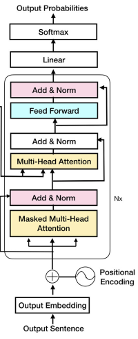

# Building a decoder transformer model on AMD GPU(s)

In this blog, we demonstrate how to run
[Andrej Karpathy's beautiful PyTorch re-implementation of GPT](https://colab.research.google.com/drive/1JMLa53HDuA-i7ZBmqV7ZnA3c_fvtXnx-?usp=sharing)
on single and multiple AMD GPUs on a single node using PyTorch 2.0 and ROCm. We use the works of
Shakespeare to train our model, then run inference to see if our model can generate Shakespeare-like
text.

At the core of a GPT model is the decoder-only transformer architecture. This generates output tokens
(characters, in our case), one at a time, in an autoregressive manner, meaning that each generated
token depends on the previously generated ones. For a deeper dive into how this model works, we
highly recommend reviewing:

* Andrej Karpathy's [Let's build GPT: from scratch, in code, spelled out.](https://www.youtube.com/watch?v=kCc8FmEb1nY) video
* [Attention Is All You Need](https://arxiv.org/abs/1706.03762)

We first train our model on a single GPU using PyTorch and ROCm, then slightly modify the code to
run on two GPUs using [PyTorch's Distributed Data Parallel](https://pytorch.org/tutorials/beginner/ddp_series_theory.html).

Distributed Data Parallelism on multiple GPUs works by:

1. Splitting the current global training batch into small local batches on each GPU. For instance, if you
   have 8 GPUs and the global batch is set at 32 samples, each of the 8 GPUs will have a local batch size
   of 4 samples.
2. Copying the model to every device so that each device can process its local batches independently.
3. Running a forward pass, then a backward pass, and outputting the gradient of the weights with
   respect to the loss of the model for that local batch. This happens concurrently on multiple devices.
4. Synchronizing the local gradients computed by each device and combining them to update the
   model weights. The updated weights are then redistributed to each device.

For a deeper dive into distributed training in PyTorch, refer to
[Multi GPU training with DDP](https://pytorch.org/tutorials/beginner/ddp_series_multigpu.html).

## Prerequisites

To follow along with this blog, you must have the following software:

* [ROCm](https://rocm.docs.amd.com/projects/install-on-linux/en/latest/tutorial/quick-start.html)
* [PyTorch](https://rocm.docs.amd.com/projects/install-on-linux/en/latest/how-to/3rd-party/pytorch-install.html)
* Linux OS

Next, make sure your system recognizes both AMD GPUs by running this code:

``` cpp
! rocm-smi --showproductname
```

The output should look like this:

``` text
================= ROCm System Management Interface ================
========================= Product Info ============================
GPU[0] : Card series: Instinct MI210
GPU[0] : Card model: 0x0c34
GPU[0] : Card vendor: Advanced Micro Devices, Inc. [AMD/ATI]
GPU[0] : Card SKU: D67301
GPU[1] : Card series: Instinct MI210
GPU[1] : Card model: 0x0c34
GPU[1] : Card vendor: Advanced Micro Devices, Inc. [AMD/ATI]
GPU[1] : Card SKU: D67301
===================================================================
===================== End of ROCm SMI Log =========================
```

Make sure PyTorch also recognizes these GPUs:

``` python
import torch
import torch.nn as nn
from torch.nn import functional as F
print(f"number of GPUs: {torch.cuda.device_count()}")
print([torch.cuda.get_device_name(i) for i in range(torch.cuda.device_count())])
```

The output should look like this:

``` text
number of GPUs: 2
['AMD Radeon Graphics', 'AMD Radeon Graphics']
```

## Loading the data

We use the `tiny_shakespeare` dataset that consists of 40,000 lines of Shakespeare from various plays.
Let's load it and look at the first 200 characters.

```python
! wget https://raw.githubusercontent.com/karpathy/char-rnn/master/data/tinyshakespeare/input.txt
with open('input.txt', 'r', encoding='utf-8') as f:
    text = f.read()
print(text[:200])
```

```python
First Citizen:
Before we proceed any further, hear me speak.

All:
Speak, speak.

First Citizen:
You are all resolved rather to die than to famish?

All:
Resolved. resolved.

First Citizen:
First, you
```

Next, we create our vocabulary from the unique characters in the text and a mapping between
characters and integers.

```python
chars = sorted(list(set(text)))
vocab_size = len(chars)
# create a mapping from characters to integers
stoi = { ch:i for i,ch in enumerate(chars) }
itos = { i:ch for i,ch in enumerate(chars) }
encode = lambda s: [stoi[c] for c in s] # encoder: take a string, output a list of integers
decode = lambda l: ''.join([itos[i] for i in l]) # decoder: take a list of integers, output a string
```

Now, we split the data into a train and a test set after encoding the characters (i.e., convert each character to an integer).

```python
data = torch.tensor(encode(text), dtype=torch.long)
n = int(0.9*len(data)) # first 90% will be train, rest val
train_data = data[:n]
val_data = data[n:]
```

Let's take a look at an example of our input and target.

```python
block_size = 8
x = train_data[:block_size]
y = train_data[1:block_size+1]
for t in range(block_size):
    context = x[:t+1]
    target = y[t]
    print(f"when input is {context} the target: {target}")
```

```python
when input is tensor([18]) the target: 47
when input is tensor([18, 47]) the target: 56
when input is tensor([18, 47, 56]) the target: 57
when input is tensor([18, 47, 56, 57]) the target: 58
when input is tensor([18, 47, 56, 57, 58]) the target: 1
when input is tensor([18, 47, 56, 57, 58,  1]) the target: 15
when input is tensor([18, 47, 56, 57, 58,  1, 15]) the target: 47
when input is tensor([18, 47, 56, 57, 58,  1, 15, 47]) the target: 58
```

## Creating the decoder transformer model

Let's set a few hyperparameters that we'll use to construct and train the model. Because we have
access to a powerful AMD GPU, we can afford to scale up our network and set the same
hyperparameters as Andrej used in his video tutorial. This includes increasing our batch size, block size, number of layers and heads, and the embedding size. We hope that this would gives us a lower loss value.

``` python
# hyperparameters
batch_size = 64 # how many independent sequences will we process in parallel?
block_size = 256 # what is the maximum context length for predictions?
max_iters = 5000
eval_interval = 100
learning_rate = 3e-4
device = 'cuda' if torch.cuda.is_available() else 'cpu'
eval_iters = 200
n_embd = 384
n_head = 6
n_layer = 6
dropout = 0.2
# ------------

torch.manual_seed(1337) # set manual seed for reproducibility
```

### Decoder transformer architecture

Below is our main model class, which creates a decoder transformer architecture. Its components
include:

* Self-attention mechanism: Allows the decoder to weigh different parts of the input sequence when
  generating the output.
* Masked self-attention: Prevents the decoder from seeing future tokens during training by masking
  subsequent positions.
* Decoder layers: Consist of multiple sub-layers, like multi-head attention and feed-forward neural
  networks, facilitating information processing and generation.



```python
class Head(nn.Module):
    """ one head of self-attention """

    def __init__(self, head_size):
        super().__init__()
        self.key = nn.Linear(n_embd, head_size, bias=False)
        self.query = nn.Linear(n_embd, head_size, bias=False)
        self.value = nn.Linear(n_embd, head_size, bias=False)
        self.register_buffer('tril', torch.tril(torch.ones(block_size, block_size)))

        self.dropout = nn.Dropout(dropout)

    def forward(self, x):
        # input of size (batch, time-step, channels)
        # output of size (batch, time-step, head size)
        B,T,C = x.shape
        k = self.key(x)   # (B,T,hs)
        q = self.query(x) # (B,T,hs)
        # compute attention scores ("affinities")
        wei = q @ k.transpose(-2,-1) * k.shape[-1]**-0.5 # (B, T, hs) @ (B, hs, T) -> (B, T, T)
        # here we use the upper triangular matrix trick to create a mask for the self-attention mechanism
        # this mask ensures that during training, the decoder can only attend to positions before the current token being generated, preventing it from peeking at future token, i.e. from left-to-right attention only
        wei = wei.masked_fill(self.tril[:T, :T] == 0, float('-inf')) # (B, T, T)
        wei = F.softmax(wei, dim=-1) # (B, T, T)
        wei = self.dropout(wei)
        # perform the weighted aggregation of the values
        v = self.value(x) # (B,T,hs)
        out = wei @ v # (B, T, T) @ (B, T, hs) -> (B, T, hs)
        return out

class MultiHeadAttention(nn.Module):
    """ multiple heads of self-attention in parallel """

    def __init__(self, num_heads, head_size):
        super().__init__()
        self.heads = nn.ModuleList([Head(head_size) for _ in range(num_heads)])
        self.proj = nn.Linear(head_size * num_heads, n_embd)
        self.dropout = nn.Dropout(dropout)

    def forward(self, x):
        out = torch.cat([h(x) for h in self.heads], dim=-1)
        out = self.dropout(self.proj(out))
        return out

class FeedFoward(nn.Module):
    """ a simple linear layer followed by a non-linearity """

    def __init__(self, n_embd):
        super().__init__()
        self.net = nn.Sequential(
            nn.Linear(n_embd, 4 * n_embd),
            nn.ReLU(),
            nn.Linear(4 * n_embd, n_embd),
            nn.Dropout(dropout),
        )

    def forward(self, x):
        return self.net(x)

class Block(nn.Module):
    """ Transformer block: communication followed by computation """

    def __init__(self, n_embd, n_head):
        # n_embd: embedding dimension, n_head: the number of heads we'd like
        super().__init__()
        head_size = n_embd // n_head
        self.sa = MultiHeadAttention(n_head, head_size)
        self.ffwd = FeedFoward(n_embd)
        self.ln1 = nn.LayerNorm(n_embd)
        self.ln2 = nn.LayerNorm(n_embd)

    def forward(self, x):
        x = x + self.sa(self.ln1(x))
        x = x + self.ffwd(self.ln2(x))
        return x

class GPTLanguageModel(nn.Module):

    def __init__(self):
        super().__init__()
        # each token directly reads off the logits for the next token from a lookup table
        self.token_embedding_table = nn.Embedding(vocab_size, n_embd)
        self.position_embedding_table = nn.Embedding(block_size, n_embd)
        self.blocks = nn.Sequential(*[Block(n_embd, n_head=n_head) for _ in range(n_layer)])
        self.ln_f = nn.LayerNorm(n_embd) # final layer norm
        self.lm_head = nn.Linear(n_embd, vocab_size)

        # better init, not covered in the original GPT video, but important, will cover in followup video
        self.apply(self._init_weights)

    def _init_weights(self, module):
        if isinstance(module, nn.Linear):
            torch.nn.init.normal_(module.weight, mean=0.0, std=0.02)
            if module.bias is not None:
                torch.nn.init.zeros_(module.bias)
        elif isinstance(module, nn.Embedding):
            torch.nn.init.normal_(module.weight, mean=0.0, std=0.02)

    def forward(self, idx, targets=None):
        B, T = idx.shape

        # idx and targets are both (B,T) tensor of integers
        tok_emb = self.token_embedding_table(idx) # (B,T,C)
        pos_emb = self.position_embedding_table(torch.arange(T, device=device)) # (T,C)
        x = tok_emb + pos_emb # (B,T,C)
        x = self.blocks(x) # (B,T,C)
        x = self.ln_f(x) # (B,T,C)
        logits = self.lm_head(x) # (B,T,vocab_size)

        if targets is None:
            loss = None
        else:
            B, T, C = logits.shape
            logits = logits.view(B*T, C)
            targets = targets.view(B*T)
            loss = F.cross_entropy(logits, targets)

        return logits, loss

    def generate(self, idx, max_new_tokens):
        # idx is (B, T) array of indices in the current context
        for _ in range(max_new_tokens):
            # crop idx to the last block_size tokens
            idx_cond = idx[:, -block_size:]
            # get the predictions
            logits, loss = self(idx_cond)
            # focus only on the last time step
            logits = logits[:, -1, :] # becomes (B, C)
            # apply softmax to get probabilities
            probs = F.softmax(logits, dim=-1) # (B, C)
            # sample from the distribution
            idx_next = torch.multinomial(probs, num_samples=1) # (B, 1)
            # append sampled index to the running sequence
            idx = torch.cat((idx, idx_next), dim=1) # (B, T+1)
        return idx
```

### Utility functions

Before we train our model, we need two utility functions:

* One that assesses our training and evaluation loss after each predefined number of iterations
* One that fetches a random batch of data

To estimate our loss:

```python
@torch.no_grad()
def estimate_loss(model):
    out = {}
    model.eval()
    for split in ['train', 'val']:
        losses = torch.zeros(eval_iters)
        for k in range(eval_iters):
            X, Y = get_batch(split)
            logits, loss = model(X, Y)
            losses[k] = loss.item()
        out[split] = losses.mean()
    model.train()
    return out
```

To fetch a small batch of data:

```python
# data loading
def get_batch(split):
    # generate a small batch of data of inputs x and targets y
    data = train_data if split == 'train' else val_data
    ix = torch.randint(len(data) - block_size, (batch_size,))
    x = torch.stack([data[i:i+block_size] for i in ix])
    y = torch.stack([data[i+1:i+block_size+1] for i in ix])
    x, y = x.to(device), y.to(device)
    return x, y
```

## Training and inference

Now that we have all the pieces in place, let's instantiate our model, train it, and run some inference to generate our (hopefully) Shakespeare-like text.

Here's our main function:

```python
def main():
    model = GPTLanguageModel()
    model = model.to(device)

    # print the number of parameters in the model
    print(sum(p.numel() for p in model.parameters())/1e6, 'M parameters')

    # create a PyTorch optimizer
    optimizer = torch.optim.AdamW(model.parameters(), lr=learning_rate)

    for iter in range(max_iters):

        # every once in a while evaluate the loss on train and val sets
        if iter % eval_interval == 0 or iter == max_iters - 1:
            losses = estimate_loss(model)
            print(f"step {iter}: train loss {losses['train']:.4f}, val loss {losses['val']:.4f}")

        # sample a batch of data
        xb, yb = get_batch('train')

        # evaluate the loss
        logits, loss = model(xb, yb)
        optimizer.zero_grad(set_to_none=True)
        loss.backward()
        optimizer.step()

    # run inference to generate text using our model
    context = torch.zeros((1, 1), dtype=torch.long, device=device)
    print(decode(model.generate(context, max_new_tokens=2000)[0].tolist()))
```

We created a script [gpt_single_gpu.py](./src/gpt_single_gpu.py) with all the required commands. To run it, use the
following code:

```cpp
python3 gpt_single_gpu.py
```

Here is the expected output from the script:

```cpp
10.788929 M parameters
step 0: train loss 4.2221, val loss 4.2306
step 100: train loss 2.4966, val loss 2.5012
step 200: train loss 2.4029, val loss 2.4295
...
step 4900: train loss 0.8676, val loss 1.5644
step 4999: train loss 0.8598, val loss 1.5677
```

Here's what the first few lines of our generated text looks like:

```cpp
Thou fellow'dst idst the game of his names;
And yet since was Menenius, one would thrident again
That Anne. But where shall do become me injuries?

JULIET:
O though often thee cortainted matter,--
A better with him he gone hath
A colder-balm equal-deniving,
Of what a peril the people, when he did make me
Disobedition, become him to see
That conceive on earth fitting his finger,
```

At a validation loss of 1.5677, the generated text looks almost like English and the model is able to
learn the conversation-style of the Shakespearean input.

> Each time we run inference, we expect a different result. This is because the model samples from the
> distribution with all possible tokens, where each token's probability is given by the softmax function.

## Distributed training on multiple GPUs

To use multiple GPUs to train our model in PyTorch on a single node, we will use
[PyTorch's Distributed Data Parallel](https://pytorch.org/tutorials/beginner/ddp_series_theory.html). To
do so, we only need to make a slight modification to our current code.

First, let's import a few required functions from PyTorch:

```python
import torch.multiprocessing as mp
from torch.distributed import init_process_group, destroy_process_group
from torch.nn.parallel import DistributedDataParallel as DDP
```

Next, let's set up our distributed data parallel group. Typically, each GPU runs one process, so we need
to set up a group so that all processes and GPUs can communicate with each other. Let's create a small
function that does this.

```python
def ddp_setup(rank, world_size):
    """
    world_size: The number of GPUs
    rank: the id of GPU from 0 upto world_size - 1
    """

    os.environ['MASTER_ADDR'] = 'localhost'
    os.environ['MASTER_PORT'] = '12355'

    # initialize the process group
    backend = "nccl"
    init_process_group(backend=backend, rank=rank, world_size=world_size)
    torch.cuda.set_device(rank)
```

We need to call this setup function prior to instantiating our model. Next, we make a slight
modification to our main function so that it can run on multiple GPUs. Notice that our main function
now takes in two arguments: `rank` (the ID of GPU) and `world_size` (the number of GPUs).

```python
def main(rank:int, world_size:int):
    print(f"Training DDP model on rank/gpu {rank}.")
    ddp_setup(rank, world_size)

    # each gpu/process gets a different seed
    torch.manual_seed(1337 + rank)

    model = GPTLanguageModel()
    model.to(rank)
    model = DDP(model, device_ids=[rank])
    ... # the rest of the training is identical to our main function for a single process

    # running inference
    if rank == 0: # running inference on the master process only. Without this if statement, each process will run their own prediction
        print('generating text')
        context = torch.zeros((1, 1), dtype=torch.long, device=device)
        # because the model is now a distributed model, we need to unwrap it by adding "module"
        print(decode(model.module.generate(context, max_new_tokens=500)[0].tolist()))

    #  once the model is trained, destroy the processes to exit cleanly
    destroy_process_group()
```

## Complete code

We created a script [gpt_multiple_gpus.py](./src/gpt_multiple_gpus.py) with all the required commands. To run it, use the
following code:

```cpp
python3 gpt_multiple_gpus.py
```

The following is the expected output from the script.

```cpp
We have 2 GPUs! Using 2 GPUs
Training DDP model on rank/gpu 1.
Training DDP model on rank/gpu 0.
10.788929 M parameters
10.788929 M parameters
GPU/rank 0 step 0: train loss 4.2221, val loss 4.2306
GPU/rank 1 step 0: train loss 4.2228, val loss 4.2304
GPU/rank 0 step 500: train loss 1.6010, val loss 1.7904
GPU/rank 1 step 500: train loss 1.5984, val loss 1.7871
...
GPU/rank 1 step 4999: train loss 0.5810, val loss 1.7733
GPU/rank 0 step 4999: train loss 0.5807, val loss 1.7723
```

And here's our generated text:

```cpp
HENRY BOLINGBROKE:
Warwick, It say; and he is safe, and whose
With unmorable slaves, they have stafd too:
So say the tidings you for Richmond, with ride?

BUSHY:
Marry, my Lord Clarence to my noble lady.

GLOUCESTER:
Go, to thee to thy daughter as I may break;
And what do now thy will I, I do me say
My name; it is the king.

BUCKINGHAM:
'Twas every stranger:--
Nay, my good son.
```

The output comes from two different GPUs (rank 0 and 1) and each train/validation loss is different.
This is because each process gets a different seed so that they don't train on the same batch of data.
