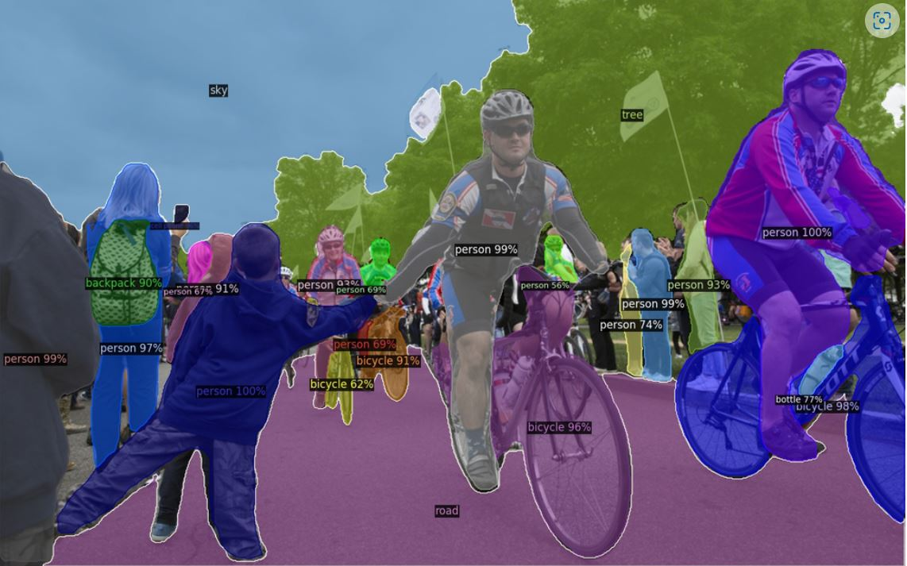
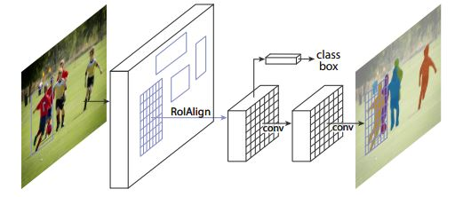
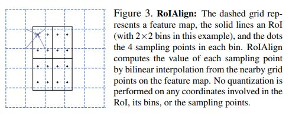
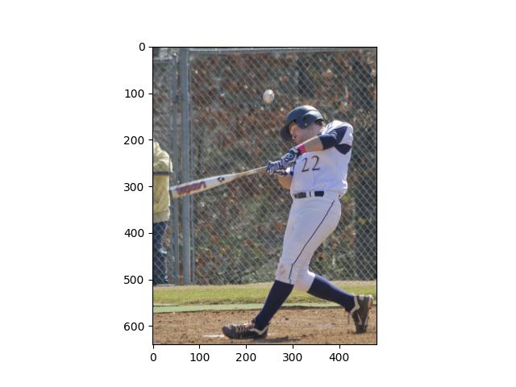
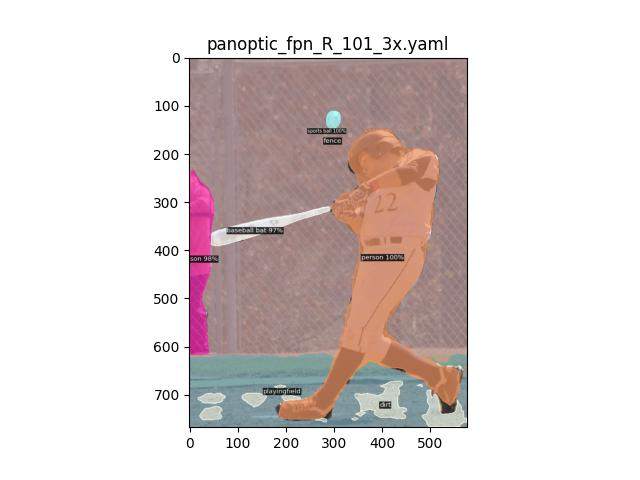
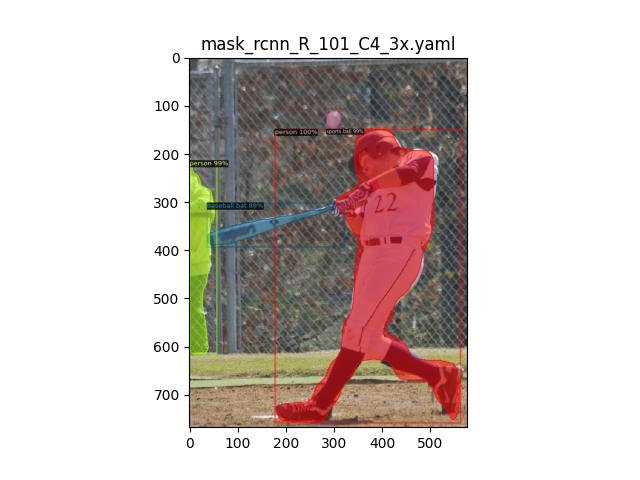
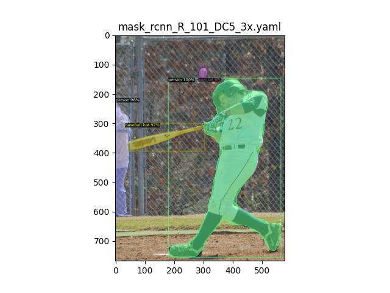
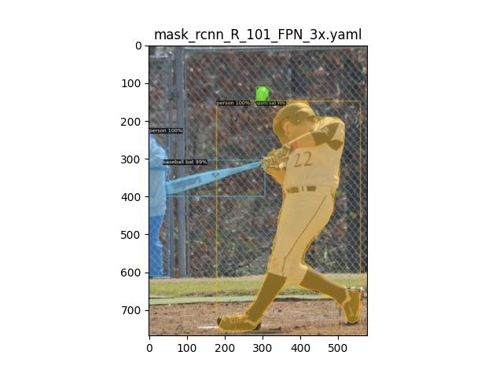

# Panoptic segmentation and instance segmentation with Detectron2 on AMD GPUs

<span style="font-size:0.7em;">23, May 2024 by {hoverxref}`Vara Lakshmi Bayanagari<varabaya>`. </span>

This blog gives an overview of Detectron2 and the inference of segmentation pipelines in its core library on an AMD GPU.

## Introduction

Detectron2 is one of the leading computer vision projects by Meta and is predominantly used for object detection and segmentation. It is a flexible, extensible and modular [codebase](https://ai.meta.com/blog/-detectron2-a-pytorch-based-modular-object-detection-library-/) adopted by many of Meta's research projects as well as production applications. In addition to its core library, the extensibility of Detectron2 paved the way for multiple state-of-the-art (at the time of release) computer vision algorithms. A few examples of which are:

- [DensePose](https://github.com/facebookresearch/detectron2/tree/main/projects/DensePose) - 3D geometry for forgeround objects.
- [TensorMask](https://github.com/facebookresearch/detectron2/tree/main/projects/TensorMask) - Sliding-window based semantic segmentation.
- [ViTDet](https://github.com/facebookresearch/detectron2/tree/main/projects/ViTDet) - Transformer based backbone for object detection.

Detectron2 also leads the way for advanced real-time object detection and tracking in video calls in Meta's [smart camera](https://ai.meta.com/blog/under-the-hood-portals-smart-camera/) at a production scale. The implementation efficiency and cutting-edge performance of Detectron2 provides numerous applications in the field of detection, localization, and segmentation.



Image source is [Detectron2 GitHub repo](https://github.com/facebookresearch/detectron2)

In this blog we'll perform inferencing of the core Detectron2 COCO-trained Semantic Segmentation model using multiple backbones on an AMD GPU.

## Mask-RCNN, Detectron, Detectron2

Detectron2 is a revamped [edition](https://github.com/facebookresearch/detectron2/blob/main/docs/notes/compatibility.md) of Detectron and the original zoo of models written in Caffe2 are now implemented in PyTorch. Detectron2 supports various architectures and models for semantic segmentation, instance segmentation, panoptic segmentation, dense pose, and more. The key differences between both of the repos include minor changes in data augmentation, class labels convention, and ROIAlign implementation. For a more detailed list of differences, see [here](https://github.com/facebookresearch/detectron2/blob/main/docs/notes/compatibility.md).

The zoo of models in Detectron/Detectron2 are predominantly powered by the architecture of [MaskRCNN](https://arxiv.org/pdf/1703.06870.pdf) from Meta's research publication in 2017. MaskRCNN is mostly a derivative of their previous research products that delve into building robust and fast ResNet-based computer vision algorithms. MaskRCNN stands out not only for its high performance in segmentation but also for its *parallel* computation of classification (instance labels) and regression (bounding box values).



Image source is from [MaskRCNN paper](https://arxiv.org/pdf/1703.06870.pdf)

The above image depicts the flow of MaskRCNN. It has two stages: feature extraction and mask generation (along with label classification and bounding box regression). For your understanding, the part of the image before RoIAlign is considered first stage and the parts following RoIAlign are considered second stage. RoIAlign is an intermediate pooling operation.

The first stage, also called Regional Proposal Network (RPN), employs a ResNet based *backbone* for feature extraction and outputs proposal boxes. These proposal boxes are rectangular in shape and vary in size.

The proposal boxes are processed by MaskRCNN's trademark RoIAlign operation before passing to the second stage. RoIAlign operates on proposal boxes to aggregate features in a similar fashion from each box seperately. The *align* in RoIAlign refers to aligning each rectangle to a fixed number of bins and sampling 4 points from each bin using bilinear interpolation of the surrounding pixels. RoIAlign plays a crucial role in the state-of-the performance of MaskRCNN, over the existing pooling operations, such as RoIPool, RoIWarp as shown in [4.2 Section of the paper](https://arxiv.org/pdf/1703.06870.pdf). The alignment technique used to partition the proposal boxes into bins doesn't use any quantization and helps retain spatial information at the pixel level. The [Medium article by Kemal Erdem](https://towardsdatascience.com/understanding-region-of-interest-part-2-roi-align-and-roi-warp-f795196fc193) provides an excellent explanation of RoIAlign by using an example matrix.



Image source is from the [MaskRCNN paper](https://arxiv.org/pdf/1703.06870.pdf).

In the second stage, the pooled features from RoIAlign are passed to the second *backbone*, the core feature of MaskRCNN, before passing them to the segmentation, classification, and regression heads. The *backbone* used here is the same ResNet as in the first stage although they don't share features during training. Detectron2 conducted experiments with various *backbones* such as ResNet-FPN, ResNet-C4, and ResNet-DC5. While [FPN](https://arxiv.org/abs/1612.03144) is a multi-scale feature pyramid network, C4 and DC5 differ only on the last layer of the *backbone*. You can refer to [Detectron2's documentation](https://github.com/facebookresearch/detectron2/blob/main/MODEL_ZOO.md#coco-instance-segmentation-baselines-with-mask-r-cnn) for more details.

## Model Inference

The following experiment has been carried out on ROCm 5.7.0 and PyTorch 2.0.1. You can refer to the [system requirements](https://rocm.docs.amd.com/projects/install-on-linux/en/latest/reference/system-requirements.html) on ROCm documentation for a list of supported GPU and software.

### Requirements

- [Install ROCm compatible PyTorch](https://rocm.docs.amd.com/en/latest/how_to/pytorch_install/pytorch_install.html)
- Install Detectron2 and OpenCV (Latest version at the time of writing this blog is opencv-python-4.9.0.80)
  
  ```bash
  python -m pip install 'git+https://github.com/facebookresearch/detectron2.git'
  pip install opencv-python
  ```

### Implementation

Detectron2 provides bootstrapped models and image visualization libraries through simple commands. The following code snippets carry out inferencing of the [COCO dataset](https://cocodataset.org/#download) trained models. There's a total of 80 COCO classes (The originally published dataset has 90 classes, however, Detectron2 was trained with a version that used 80 classes so we will use the same set of classes as what Dectectron2 was trained on). COCO stands for *Common Objects in Context* and includes objects such as *knife*, *chair*, *person*, and so on. They're all listed below.

```python
from detectron2.config import get_cfg
from detectron2.data import MetadataCatalog
from detectron2 import model_zoo

cfg = get_cfg()
# Load any COCO triane yml file to populate the cfg.DATASETS information
cfg.merge_from_file(model_zoo.get_config_file('COCO-PanopticSegmentation/panoptic_fpn_R_101_3x.yaml'))
classes = MetadataCatalog.get(cfg.DATASETS.TRAIN[0]).get("thing_classes")
print(list(classes))
```

```bash
['person', 'bicycle', 'car', 'motorcycle', 'airplane', 'bus', 'train', 'truck', 'boat', 'traffic light', 'fire hydrant', 'stop sign', 'parking meter', 'bench', 'bird', 'cat', 'dog', 'horse', 'sheep', 'cow', 'elephant', 'bear', 'zebra', 'giraffe', 'backpack', 'umbrella', 'handbag', 'tie', 'suitcase', 'frisbee', 'skis', 'snowboard', 'sports ball', 'kite', 'baseball bat', 'baseball glove', 'skateboard', 'surfboard', 'tennis racket', 'bottle', 'wine glass', 'cup', 'fork', 'knife', 'spoon', 'bowl', 'banana', 'apple', 'sandwich', 'orange', 'broccoli', 'carrot', 'hot dog', 'pizza', 'donut', 'cake', 'chair', 'couch', 'potted plant', 'bed', 'dining table', 'toilet', 'tv', 'laptop', 'mouse', 'remote', 'keyboard', 'cell phone', 'microwave', 'oven', 'toaster', 'sink', 'refrigerator', 'book', 'clock', 'vase', 'scissors', 'teddy bear', 'hair drier', 'toothbrush']
```

Let's move to the implementation. The code below is taken from Detectron2's [official tutorial](https://colab.research.google.com/drive/16jcaJoc6bCFAQ96jDe2HwtXj7BMD_-m5) and has been modified for inferencing COCO-trained Pantoptic Segmentation model.

#### Panoptic Segmentation

Panoptic segmentation segments everything in the image unlike instance or semantic segmentation where only foreground objects take prominence. We evaluate two Panoptic models with *backbones* ResNet101-FPN and ResNet50-FPN respectively. You can access other configurations [here](https://github.com/facebookresearch/detectron2/tree/main/configs) in the Detectron2 directory and their naming convention [here](https://github.com/facebookresearch/detectron2/blob/main/MODEL_ZOO.md#common-settings-for-coco-models). The evaluation is conducted on a COCO test image where a baseball player is swinging his bat on a playing field.

```bash
########################################
# download a single test image, used in this blog, from
# 'https://images.cocodataset.org/test2017/000000000016.jpg'
########################################

###### OR ##############################
# download the entire COCO test data
########################################

wget http://images.cocodataset.org/zips/test2017.zip
unzip test2017.zip
```

In the following code, the ```get_cfg``` function returns a configuration class where you load your model name, model weights, Intersection over Union (IoU) threshold, and other parameters. Load the configuration, cfg, into Detectron2's ```DefaultPredictor``` to obtain segmentation, class labels, and bounding box outputs.

You can use Detectron2's ```Visualizer``` to parse model output and visualize it in the manner shown in the below image without any overhead of image post-processing.

```python

import detectron2

# import some common libraries
import numpy as np
import matplotlib.pyplot as plt

# import some common detectron2 utilities
from detectron2 import model_zoo
from detectron2.engine import DefaultPredictor
from detectron2.config import get_cfg
from detectron2.utils.visualizer import Visualizer
from detectron2.data import MetadataCatalog, DatasetCatalog

def inference(img_path='./test2017/000000000016.jpg', ymlfile='COCO-PanopticSegmentation/panoptic_fpn_R_101_3x.yaml', panoptic=True):
    cfg = get_cfg()
    cfg.merge_from_file(model_zoo.get_config_file(ymlfile))
    cfg.MODEL.ROI_HEADS.SCORE_THRESH_TEST = 0.5  # set threshold for this model
    # Find a model from detectron2's model zoo. You can use the https://dl.fbaipublicfiles... url as well
    cfg.MODEL.WEIGHTS = model_zoo.get_checkpoint_url(ymlfile)
    predictor = DefaultPredictor(cfg)
    im=plt.imread(img_path)
    outputs = predictor(im)
​
    # We can use `Visualizer` to draw the predictions on the image.
    v = Visualizer(im, MetadataCatalog.get(cfg.DATASETS.TRAIN[0]), scale=1.2)
    if panoptic:
        out = v.draw_panoptic_seg(outputs["panoptic_seg"][0].to('cpu'),outputs["panoptic_seg"][1])
        print(len(outputs["panoptic_seg"][1]))
    else:
        out = v.draw_instance_predictions(outputs["instances"].to("cpu"))
        print(len(outputs["instances"]))
    plt.figure()
    title = ymlfile.split('/')[-1].split('.yml')[0]
    plt.title(title)
    plt.imshow(out.get_image())
    plt.savefig(f"{title.split('.')[0]}.jpg")
​
inference(ymlfile='COCO-PanopticSegmentation/panoptic_fpn_R_101_3x.yaml')
inference(ymlfile='COCO-PanopticSegmentation/panoptic_fpn_R_50_3x.yaml')
```

You can see that the two models we used identified 7 and 6 total objects, respectively (```len(outputs['panoptic_seg'][1])```) and segmented most of them accurately. There's still room for improvement for segmenting objects as can be seen by identifying in the second image where it couldn't differentiate between the ```playing field``` and ```dirt```.





#### Instance Segmentation

Next, we carried out experiments for instance segmentation. Instance segmentation performs segmentation of all foreground objects, as seen in the results below. The output results for C4, DC5, and FPN *backbones* are as follows. All of them identified 4 objects, (```len(outputs['instances'])```), in the foreground accurately. All the segmentations and detections are crisp and accurate across experiments.

```python
inference(ymlfile='COCO-InstanceSegmentation/mask_rcnn_R_101_C4_3x.yaml', panoptic=False)
inference(ymlfile='COCO-InstanceSegmentation/mask_rcnn_R_101_DC5_3x.yaml', panoptic=False)
inference(ymlfile='COCO-InstanceSegmentation/mask_rcnn_R_101_FPN_3x.yaml', panoptic=False)
```





PS: Do not use the above code snippets for benchmarking as the ```DefaultPredictor``` function is only meant for demo purposes. To estimate the inference time, consider calling the model directly.

## Disclaimers

Third-party content is licensed to you directly by the third party that owns the content and is
not licensed to you by AMD. ALL LINKED THIRD-PARTY CONTENT IS PROVIDED “AS IS”
WITHOUT A WARRANTY OF ANY KIND. USE OF SUCH THIRD-PARTY CONTENT IS DONE AT
YOUR SOLE DISCRETION AND UNDER NO CIRCUMSTANCES WILL AMD BE LIABLE TO YOU FOR
ANY THIRD-PARTY CONTENT. YOU ASSUME ALL RISK AND ARE SOLELY RESPONSIBLE FOR ANY
DAMAGES THAT MAY ARISE FROM YOUR USE OF THIRD-PARTY CONTENT.
