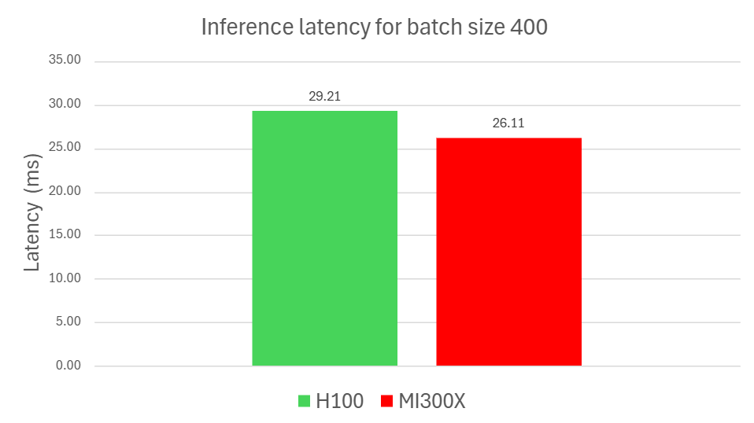
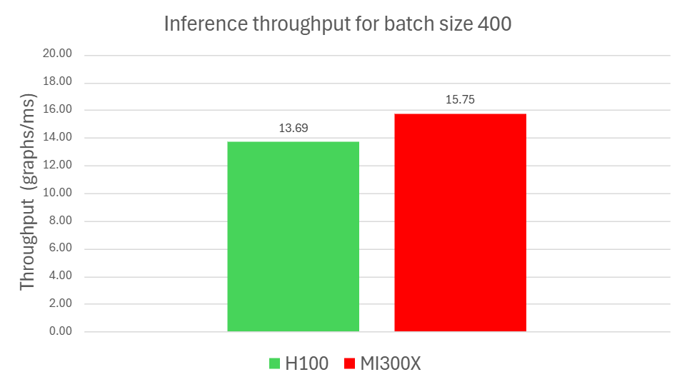
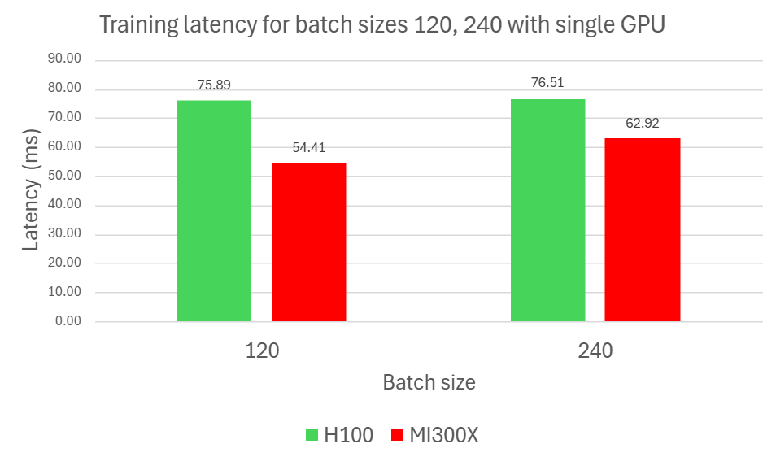
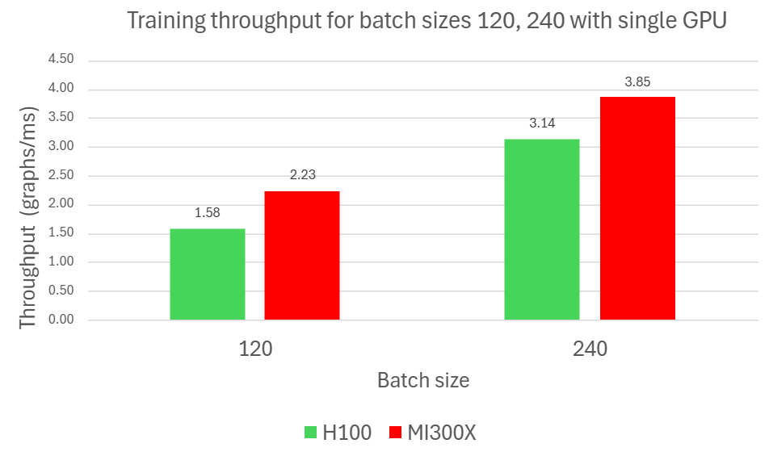
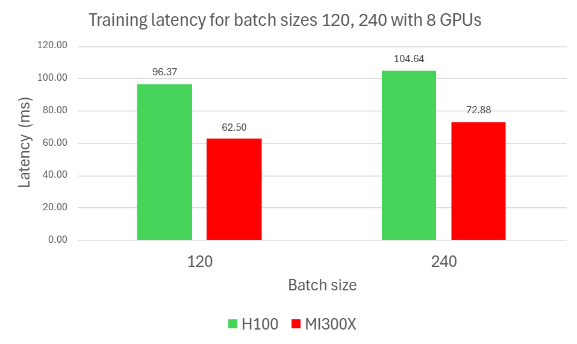
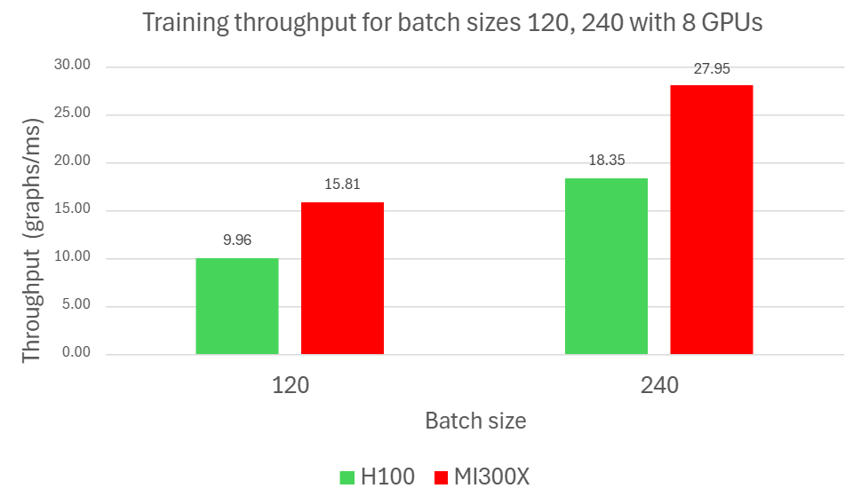

<!---
Copyright (c) 2025 Advanced Micro Devices, Inc. (AMD)

Permission is hereby granted, free of charge, to any person obtaining a copy
of this software and associated documentation files (the "Software"), to deal
in the Software without restriction, including without limitation the rights
to use, copy, modify, merge, publish, distribute, sublicense, and/or sell
copies of the Software, and to permit persons to whom the Software is
furnished to do so, subject to the following conditions:

The above copyright notice and this permission notice shall be included in all
copies or substantial portions of the Software.

THE SOFTWARE IS PROVIDED "AS IS", WITHOUT WARRANTY OF ANY KIND, EXPRESS OR
IMPLIED, INCLUDING BUT NOT LIMITED TO THE WARRANTIES OF MERCHANTABILITY,
FITNESS FOR A PARTICULAR PURPOSE AND NONINFRINGEMENT. IN NO EVENT SHALL THE
AUTHORS OR COPYRIGHT HOLDERS BE LIABLE FOR ANY CLAIM, DAMAGES OR OTHER
LIABILITY, WHETHER IN AN ACTION OF CONTRACT, TORT OR OTHERWISE, ARISING FROM,
OUT OF OR IN CONNECTION WITH THE SOFTWARE OR THE USE OR OTHER DEALINGS IN THE
SOFTWARE.
--->

# DGL in Depth: SE(3)-Transformer on ROCm 7

In this post, we demonstrate how to run the [SE(3)-Transformer](https://arxiv.org/pdf/2006.10503) efficiently with [Deep Graph Library (DGL)](https://www.dgl.ai/) on AMD ROCm, enabling high-performance 3D graph learning for complex geometric models. This builds on our previous blog, which highlighted DGL’s versatility across diverse [graph neural network (GNN) workloads](https://rocm.blogs.amd.com/artificial-intelligence/why-graph-neural/README.html), validating functionality, compatibility, and usability.

SE(3)-Transformer is designed to solve problems involving 3D point clouds or graphs that are used to represent molecules, protein structures, and physical systems; where geometric symmetries are essential. Its key property is [equivariance](https://en.wikipedia.org/wiki/Equivariant_map): rotations of the input correspond to predictable transformations of the output. This makes the model robust and aligned with the underlying physical problems, but also demanding in terms of kernel performance and memory usage.

DGL enables high-performance implementations of symmetry-aware 3D models like the SE(3)-Transformer, which were previously limited to NVIDIA GPUs. This port demonstrates that these models can now run efficiently on AMD Instinct GPUs with ROCm, achieving the same model behavior and accuracy without modification.

This post showcases the latest release of the port, which includes the following enhancements:

- **ROCm branch synced with the [latest release in DGL](https://github.com/dmlc/dgl/releases):** full feature parity with the main DGL project in the latest release.
- **Support for [ROCm 7](https://rocm.blogs.amd.com/ecosystems-and-partners/rocm-7.0-blog/README.html):** Includes significant kernel performance improvements, expanded hardware support, and updated developer tooling.
- **[GraphBolt](https://www.dgl.ai/dgl_docs/api/python/dgl.graphbolt.html) integration on ROCm:** Enables high-throughput graph sampling and efficient scaling across multiple GPUs, addressing a main bottleneck in large-scale GNN training.

In the sections that follow, you will learn how DGL can power SE(3)-Transformers to solve computationally intensive problems involving 3D equivariant objects, follow a step-by-step guide to build and run examples on AMD hardware and review benchmark results comparing relative performance between NVIDIA H100 and AMD Instinct MI300X GPUs.

## SE(3)-Transformers and DGL

Point clouds appear in numerous domain, ranging from 3D object scans and molecular structures to N-body particle simulations. They vary in both size and sampling density depending on the problem. Determining neural architectures that handle a variable number of points, respect irregular sampling, and remain unaffected by global changes in pose (translations and rotations) is nontrivial. A crucial property for this class of problems is global pose invariance: the model’s output should remain unchanged under any translation or rotation of the 3D point cloud.

SE(3)-Transformer tackles these challenges by enforcing equivariance within the self-attention mechanism. It treats self-attention as a data-dependent filter tailored to sparse, non-voxelized point sets, while explicitly leveraging the symmetries of the underlying task.
Constructing an SE(3)-Transformer for point clouds typically involves the following steps: forming a graph over the points, defining equivariant edge functions on that graph, propagating SE(3)-equivariant messages along the edges, and aggregating those messages to produce the final representations. This process involves complex graph representation and manipulation operations that standard deep learning model architectures such as the Transformer are not suitable for.

### What You Get with DGL

Conventional deep learning frameworks shine in domains like vision and language that use dense, grid-structured data, but they falter in domains inherently represented as graphs. DGL bridges this gap by prioritizing the graph as the core abstraction. Instead of squeezing graph computations into generic tensor workflows, it centers nodes, edges, neighborhoods, and connectivity in the programming model. Behind the scenes, DGL compiles these graph-first operations into sparse tensor computations, preserving the speed of frameworks like PyTorch while adding a semantic layer purpose-built for graphs.

By applying DGL to SE(3)-Transformers, you can unlock practical AI for chemistry, biology, and physics—fields where respecting geometry is essential. SE(3)-Transformers provide the mathematical foundation to handle 3D symmetry, and DGL offers the engineering tools to make it usable at scale. DGL is the engine that makes SE(3)-Transformers practical by handling complex graph operations (e.g. traversal, message passing/aggregation), scaling efficiently across multi-GPU clusters to accelerate training, and supporting mixed precision to reduce memory usage without sacrificing accuracy.

## Building and Running SE(3)-Transformer: A Step-by-Step Guide

In this section, you will set up everything needed to run SE(3)-Transformer from scratch. These steps give you a clean, working setup so you can focus on experimenting with the model rather than troubleshooting the environment. You will also run ready-to-use scripts that train, evaluate, and benchmark the model.

### Requirements

To follow the steps in this blog, you need:

- AMD Instinct MI300X: See the [ROCm system requirements](https://rocm.docs.amd.com/projects/install-on-linux/en/latest/reference/system-requirements.html) for supported operating systems.
- ROCm 7.0.0: See the [ROCm installation for Linux](https://rocm.docs.amd.com/projects/install-on-linux/en/docs-7.0.0/) for detailed instructions.
- Docker: See [Install Docker Engine on Ubuntu](https://docs.docker.com/engine/install/ubuntu/#install-using-the-repository) for installation instructions.

### ROCm DGL

Resources and documentation on ROCm DGL can be found at:

- [Install DGL on ROCm](https://rocm.docs.amd.com/projects/install-on-linux/en/latest/install/3rd-party/dgl-install.html)

- [Docker image](https://hub.docker.com/r/rocm/dgl/tags)

- [GitHub](https://github.com/ROCm/dgl)

### Set up the environment using containers

To start off, use one of the latest released DGL containers published in [Docker Hub](https://hub.docker.com/r/rocm/dgl/tags) configured for ROCm 7.0.0 or ROCm 6.4.3. This ensures you have the right GPU runtime and dependencies preconfigured, saving you the hassle of building everything from scratch.

```bash
docker pull rocm/dgl:dgl-2.4.0.amd0_rocm7.0.0_ubuntu24.04_py3.12_pytorch_2.8.0
# start container
docker run -it \
    --cap-add=SYS_PTRACE \
    --security-opt seccomp=unconfined \
    --device=/dev/kfd \
    --device=/dev/dri \
    --group-add video \
    --ipc=host \
    --shm-size 64G \
    rocm/dgl:dgl-2.4.0.amd0_rocm7.0.0_ubuntu24.04_py3.12_pytorch_2.8.0
```

Alternatively, if you prefer more control over the environment, you can build the container from scratch by following the instructions in [ROCm documentation](https://rocmdocs.amd.com/projects/install-on-linux/en/latest/install/3rd-party/dgl-install.html#build-your-own-docker-image).

### Clone the `DeepLearningExamples` repository and install dependencies

Run the following commands to pull the SE(3)-Transformer source code from AMD’s fork of the `DeepLearningExamples` repository and install dependencies:

```bash
cd /src && git clone https://github.com/ROCm/DeepLearningExamples.git
cd DeepLearningExamples/DGLPyTorch/DrugDiscovery/SE3Transformer/
pip install -r requirements.txt
```

### Run the example scripts

The `SE3Transformer` folder contains a number of scripts for you to explore different features of SE(3)-Transformer.

#### Train the SE(3)-Transformer model

You can run [`training.py`](https://github.com/ROCm/DeepLearningExamples/blob/master/DGLPyTorch/DrugDiscovery/SE3Transformer/se3_transformer/runtime/training.py) to train an SE(3)-Transformer model using the [QM9 dataset](https://www.tensorflow.org/datasets/catalog/qm9), which is a dataset of ~100k organic molecules annotated with quantum chemical properties such as energy levels, dipole moments, and polarizabilities. The goal is to train a model to predict these quantum properties from the 3D structure of the molecule, capitalizing on the relationship between geometric and chemical properties. The rotational and translational equivariance property ensures robust performance regardless of the input molecule's orientation and position.

You can use all available GPUs to train with data parallelism by invoking it with [`torch.distributed.run`](https://github.com/pytorch/pytorch/blob/main/torch/distributed/run.py). There is also a wrapper, [`train.sh`](https://github.com/ROCm/DeepLearningExamples/blob/master/DGLPyTorch/DrugDiscovery/SE3Transformer/scripts/train.sh), to pass hyperparameters (such as batch size and number of epochs) as arguments to `training.py`. To train a model using the default settings specified in the shell script, run:

```bash
bash scripts/train.sh
```

On successful training, a similar output will be produced and a model checkpoint saved.

```bash
...
Epoch 10: 100%|████████████████████████████████████████████████████████████████████████████████████████████| 417/417 [00:50<00:00,  8.32batch/s]INFO:root:Train loss: 0.07024098187685013
INFO:root:validation MAE: 0.050092310374100585
INFO:root:Saved checkpoint to model_qm9.pth
INFO:root:Training finished successfully
```

#### Evaluate the SE(3)-Transformer model

Use the script [`inference.py`](https://github.com/ROCm/DeepLearningExamples/blob/master/DGLPyTorch/DrugDiscovery/SE3Transformer/se3_transformer/runtime/inference.py)
to evaluate the performance of the trained SE(3)-Transformer model on prediction accuracy. The wrapper [`predict.sh`](https://github.com/ROCm/DeepLearningExamples/blob/master/DGLPyTorch/DrugDiscovery/SE3Transformer/scripts/predict.sh) simplifies the evaluation. To run with default settings:

```bash
bash scripts/predict.sh
```

The prediction results on a test set are shown below. This can be extended to use other datasets as well.

```bash
INFO:root:====== SE(3)-Transformer ======
INFO:root:|  Inference on the test set  |
INFO:root:===============================
Done loading data from cached files.
INFO:root:test MAE: 0.04908362484928228
```

#### Benchmark the SE(3)-Transformer model

Both `training.py` and `inference.py` support benchmarking mode via the `--benchmark` argument. Under the `scripts` folder, three shell scripts leverage this feature and allow you to benchmark training or inference performance under different scenarios:

- [`benchmark_train.sh`](https://github.com/ROCm/DeepLearningExamples/blob/master/DGLPyTorch/DrugDiscovery/SE3Transformer/scripts/benchmark_train.sh) - Benchmark the training phase with a single GPU. The script takes two arguments:
  - The first argument represents the batch size. Default is `240`.
  - The second argument represents whether automatic mixed precision (AMP) is enabled. Default is `true`.
- [`benchmark_train_multi_gpu.sh`](https://github.com/ROCm/DeepLearningExamples/blob/master/DGLPyTorch/DrugDiscovery/SE3Transformer/scripts/benchmark_train_multi_gpu.sh) - Benchmark the training phase with multiple GPUs. The arguments for this script are the same as `benchmark_train.sh`. This script uses `torch.distributed.run` to spawn one training process per available GPU.
- [`benchmark_inference.sh`](https://github.com/ROCm/DeepLearningExamples/blob/master/DGLPyTorch/DrugDiscovery/SE3Transformer/scripts/benchmark_inference.sh) - Benchmark the inference phase with a single GPU. The arguments for this script are the same as `benchmark_train.sh`.

You can run each script with the desired batch size and AMP configuration. For example, to benchmark training an SE(3)-Transformer model with batch size `120` and AMP enabled on a single GPU, run:

```bash
bash scripts/benchmark_train.sh 120
```

The output will resemble the following example from a run that lasted five epochs:

```bash
...
Epoch 5: 100%|██████████| 834/834 [01:44<00:00,  7.99batch/s]
INFO:root:Train loss: 0.12801623344421387
INFO:root:performance mode: train
INFO:root:performance batchsize: 120
INFO:root:performance throughput_train: 1.0653010939258716
INFO:root:performance latency_train_mean: 132.3997756178415
INFO:root:performance total_time_train: 551974.6645507812
INFO:root:performance latency_train_90: 124.12739257812501
INFO:root:performance latency_train_95: 156.11738281249995
INFO:root:performance latency_train_99: 588.3978613281247
INFO:root:Training finished successfully
```

### Reproducing NVIDIA H100 Performance with DGL

To reproduce NVIDIA H100 results:

- Build DGL from source using a release build configuration.
- Use commit dmlc/dgl@3d16000, which corresponds to the tip of DGL’s master branch that we integrated into our fork for this release.
- Ensure that both MI300X and NVIDIA H100 runs use the same Python version, same PyTorch version, and CUDA 12.8 for consistency across measurements.

### Performance comparison against NVIDIA H100

To compare performance of AMD Instinct MI300X against NVIDIA H100 for SE(3)-Transformer with DGL workloads, benchmark results representing typical scenarios across both platforms need to be collected. Specifically, the following scenarios are considered:

- Inference with a single GPU and batch size 400.
- Training with a single GPU for batch size 120 and 240.
- Training with 8 GPUs for batch size 120 and 240.

The script [`run_dgl_benchmarks.sh`](https://github.com/ROCm/DeepLearningExamples/blob/master/DGLPyTorch/DrugDiscovery/SE3Transformer/run_dgl_benchmarks.sh) is available to generate benchmark results for these scenarios in one go. To collect the benchmark results, run:

```bash
bash run_dgl_benchmarks.sh
```

Benchmark results will be written to `dgl_se3_benchmarks_<hostname>.log`. Use the same script to collect results for the same scenarios on NVIDIA H100.

|  |
 |

*Figure 1. Inference benchmark results for batch size 400*<br>
Figure 1 highlights a 10.63% latency improvement and a 14.97% throughput gain for MI300X compared to NVIDIA H100. For reproducibility, all runs were performed with Python 3.12, PyTorch 2.8.0, ROCm 7.0, and CUDA 12.8. Additional details are provided in the footnotes<sup>[1](#fn1)</sup>  and in claim MI300-093.

|  |
 |

*Figure 2. Training benchmark results with a single GPU for two batch sizes (120 and 240)* <br>
Figure 2 highlights a 28.30% latency improvement and a 40.75% throughput gain for MI300X compared to NVIDIA H100 for a batchsize of 120 and a 17.75% latency improvement and 22.82% throughput gain for a batchsize of 240. For reproducibility, all runs were performed with Python 3.12, PyTorch 2.8.0, ROCm 7.0, and CUDA 12.8. Additional details are provided in the footnotes<sup>[2](#fn2)</sup> and in claim MI300-094.

|  |
 |

*Figure 3. Training benchmark results with eight GPUs for two batch sizes (120 and 240)*<br>
Figure 3 highlights a 35.15% latency improvement and a 58.73% throughput gain for MI300X compared to NVIDIA H100 for a batchsize of 120 and a 30.35% latency improvement and 52.28% throughput gain for a batchsize of 240. For reproducibility, all runs were performed with Python 3.12, PyTorch 2.8.0, ROCm 7.0, and CUDA 12.8. Additional details are provided in the footnotes<sup>[3](#fn3)</sup> and in claim MI300-095.

## Summary

Porting SE(3)-Transformer from CUDA to AMD ROCm with DGL shows that one of the most demanding deep learning models can run efficiently, at scale, on AMD GPUs. By combining DGL’s graph-first abstractions with the ROCm stack, you can train and use equivariant models like SE(3)-Transformers for real-world science problems, from molecular property prediction to accelerating drug discovery.

With the step-by-step guide above, you can build and run SE(3)-Transformers on AMD Instinct GPUs. If your workload involves 3D geometry, molecules, or physics-inspired problems, you don’t have to be locked into a single ecosystem. Furthermore, benchmark results show that MI300X outperforms H100 by up to 35% on latency and 59% on throughput across the scenarios tested. DGL + ROCm lets you bring cutting-edge models to a broader, more flexible GPU platform.

To learn more about setting up DGL and exploring its applications, be sure to check out our earlier blog posts - [Graph Neural Networks at Scale: DGL with ROCm on AMD Hardware](https://rocm.blogs.amd.com/artificial-intelligence/why-graph-neural/README.html) and [DGL in the Real World: Running GNNs on Real Use Cases](https://rocm.blogs.amd.com/artificial-intelligence/dgl_blog2/README.html)

## Acknowledgements

The authors would also like to acknowledge the broader AMD team whose contributions were instrumental in enabling DGL: *Aditya Bhattacharji, Amit Kumar, Anisha Sankar, Anshul Gupta, Bhavesh Lad, Debasis Mandal, Ehud Sharlin, Jayshree Soni, Jeffrey Daily, Leo Paoletti, Marco Grond, Mohan Kumar Mithur, Pei Zhang, Phaneendr-kumar Lanka, Radha Srimanthula, Ram Seenivasan, Ritesh Hiremath, Saad Rahim, Tiffany Mintz, Vicky Tsang*.

## Footnotes

<a name="fn1"></a>**1.** : "Based on calculations by AMD engineering as of November 2025, measuring the throughput and latency for inference workloads on the SE3 transformer graph neural network, on an AMD Instinct™ MI300x GPU, versus  an  NVIDIA H100 GPU, using a batch size of 400.
For full configuration information see [`https://github.com/ROCm/DeepLearningExamples/blob/master/DGLPyTorch/DrugDiscovery/SE3Transformer/run_dgl_benchmarks.sh`](https://github.com/ROCm/DeepLearningExamples/blob/master/DGLPyTorch/DrugDiscovery/SE3Transformer/run_dgl_benchmarks.sh)
Server manufacturers may vary configurations, yielding different results. Performance may vary based on use of the latest drivers and optimizations (MI300-093). "

<a name="fn2"></a>**2.** :"Based on calculations by AMD engineering, as of November 2025, measuring the training throughput and latency of an AMD Instinct™ MI300x GPU versus NVIDIA H100 GPU, on the SE3-Transformer graph neural network with batch sizes of 120 and 240.
For full configuration information see [`https://github.com/ROCm/DeepLearningExamples/blob/master/DGLPyTorch/DrugDiscovery/SE3Transformer/run_dgl_benchmarks.sh`](https://github.com/ROCm/DeepLearningExamples/blob/master/DGLPyTorch/DrugDiscovery/SE3Transformer/run_dgl_benchmarks.sh)
Server manufacturers may vary configurations, yielding different results. Performance may vary based on use of the latest drivers -and optimizations (MI300-094). "

<a name="fn3"></a>**3.** :"Based on calculations by AMD engineering as of November 2025, measuring the training throughput and latency on an AMD Instinct™ MI300x 8x-GPU platform  versus an  NVIDIA H100 8x GPU platform, running the SE3-Transformer graph neural network with batch sizes of 120 and 240.
For full configuration information see [`https://github.com/ROCm/DeepLearningExamples/blob/master/DGLPyTorch/DrugDiscovery/SE3Transformer/run_dgl_benchmarks.sh`](https://github.com/ROCm/DeepLearningExamples/blob/master/DGLPyTorch/DrugDiscovery/SE3Transformer/run_dgl_benchmarks.sh)
Server manufacturers may vary configurations, yielding different results. Performance may vary based on use of the latest drivers and optimizations (MI300-095). "

## Disclaimers

Third-party content is licensed to you directly by the third party that owns the content and is not licensed to you by AMD. ALL LINKED THIRD-PARTY CONTENT IS PROVIDED “AS IS” WITHOUT A WARRANTY OF ANY KIND. USE OF SUCH THIRD-PARTY CONTENT IS DONE AT YOUR SOLE DISCRETION AND UNDER NO CIRCUMSTANCES WILL AMD BE LIABLE TO YOU FOR ANY THIRD-PARTY CONTENT. YOU ASSUME ALL RISK AND ARE SOLELY RESPONSIBLE FOR ANY DAMAGES THAT MAY ARISE FROM YOUR USE OF THIRD-PARTY CONTENT.

The information contained herein is for informational purposes only and is subject to change without notice. While every precaution has been taken in the preparation of this document, it may contain technical inaccuracies, omissions and typographical errors, and AMD is under no obligation to update or otherwise correct this information. Advanced Micro Devices, Inc. makes no representations or warranties with respect to the accuracy or completeness of the contents of this document, and assumes no liability of any kind, including the implied warranties of noninfringement, merchantability or fitness for particular purposes, with respect to the operation or use of AMD hardware, software or other products described herein. No license, including implied or arising by estoppel, to any intellectual property rights is granted by this document. Terms and limitations applicable to the purchase or use of AMD products are as set forth in a signed agreement between the parties or in AMD's Standard Terms and Conditions of Sale. GD-18u.

© 2025 Advanced Micro Devices, Inc. All rights reserved. AMD, the AMD Arrow logo, Instinct, ROCm, and combinations thereof are trademarks of Advanced Micro Devices, Inc.  Other product names used in this publication are for identification purposes only and may be trademarks of their respective owners. Certain AMD technologies may require third-party enablement or activation. Supported features may vary by operating system. Please confirm with the system manufacturer for specific features. No technology or product can be completely secure.
