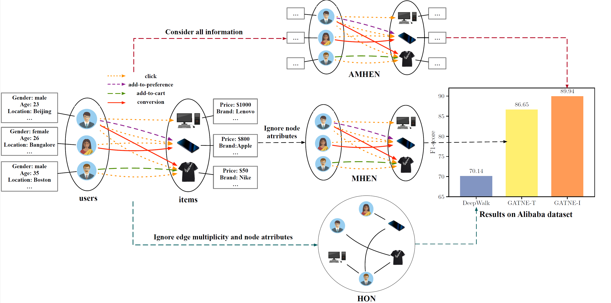
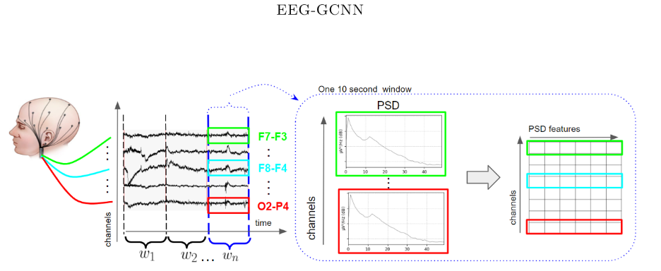

<!---
Copyright (c) 2025 Advanced Micro Devices, Inc. (AMD)

Permission is hereby granted, free of charge, to any person obtaining a copy
of this software and associated documentation files (the "Software"), to deal
in the Software without restriction, including without limitation the rights
to use, copy, modify, merge, publish, distribute, sublicense, and/or sell
copies of the Software, and to permit persons to whom the Software is
furnished to do so, subject to the following conditions:

The above copyright notice and this permission notice shall be included in all
copies or substantial portions of the Software.

THE SOFTWARE IS PROVIDED "AS IS", WITHOUT WARRANTY OF ANY KIND, EXPRESS OR
IMPLIED, INCLUDING BUT NOT LIMITED TO THE WARRANTIES OF MERCHANTABILITY,
FITNESS FOR A PARTICULAR PURPOSE AND NONINFRINGEMENT. IN NO EVENT SHALL THE
AUTHORS OR COPYRIGHT HOLDERS BE LIABLE FOR ANY CLAIM, DAMAGES OR OTHER
LIABILITY, WHETHER IN AN ACTION OF CONTRACT, TORT OR OTHERWISE, ARISING FROM,
OUT OF OR IN CONNECTION WITH THE SOFTWARE OR THE USE OR OTHER DEALINGS IN THE
SOFTWARE.
--->

# DGL in the Real World: Running GNNs on Real Use Cases

In our [previous blog
post](https://rocm.blogs.amd.com/artificial-intelligence/why-graph-neural/README.html),
we introduced the Deep Graph Library (DGL) and highlighted how its
support on the AMD ROCm platform unlocks scalable, performant graph
neural networks (GNNs) on AMD GPUs. That post focused on the *why* ---
the growing relevance of graph workloads and what it means to bring that
capability to AMD's accelerated computing ecosystem.

In this follow-up, we shift to the *how*. We walk through four advanced
GNN workloads --- from heterogeneous e-commerce graphs to neuroscience
applications --- that we successfully ran using our DGL implementation.

Our goal is to validate:

- **Functionality** --- Does the model run end-to-end on ROCm without
  major changes?

- **Compatibility** --- Does it integrate cleanly with ROCm?

- **Ease of use** --- How much extra setup is needed?

For each use case, we'll cover:

1. The task and dataset

2. How DGL was used

3. ROCm porting experience

They're real-world examples showing what already works
--- so developers can hit the ground running
with GNNs on AMD GPUs.

The Docker images, installation instructions, compatibility matrix, and GitHub repo
are all available here:

- [Docker images](https://hub.docker.com/r/rocm/dgl/tags)

- [Installation
  instructions](https://rocm.docs.amd.com/projects/install-on-linux/en/docs-6.4.2/install/3rd-party/dgl-install.html)

- [Supported
  Configurations](https://rocmdocs.amd.com/en/latest/compatibility/ml-compatibility/dgl-compatibility.html)

- [GitHub](https://github.com/ROCm/dgl)

## Use Case 1: GNN-FiLM-Graph Neural Networks with Feature-wise Linear Modulation

GNN-FiLM introduces feature-wise linear modulation into GNNs by using
the target node's representation to transform all incoming messages.
This enables more context-aware message passing and, in experiments
across multiple benchmark tasks, delivers competitive
results---outperforming strong baselines on molecular graph regression.

**Task/Dataset:** We used DGL's built-in PPIDataset (24 graphs,
\~2.3K nodes each, 50 features, 121 labels) for inductive node
classification.

**How DGL helped:**

- Loaded graphs directly with dgl.data.PPIDataset.

- Batched with dgl.batch().

- Used dgl.function for efficient message passing.

**ROCm experience:** The model ran out-of-the-box --- no tweaks to data
loading, batching, or message passing were needed.

To run the GNN-FiLM example

1. Use any of the containers mentioned [on this DockerHub page](https://hub.docker.com/r/rocm/dgl/tags)

2. In the
    [GNNFiLM](https://github.com/dmlc/dgl/tree/master/examples/pytorch/GNN-FiLM)
    folder, run

    ```bash
    python main.py --gpu ${your_device_id_here}
    ```

## Use Case 2: ARGO-An Auto-Tuning Runtime System for Scalable GNN Training on Multi-Core Processors

While our work usually focuses on GPUs, this experiment showed DGL's
flexibility beyond accelerators.

**Task:** ARGO speeds up GNN training on multi-core CPUs by up to 5X via
smart multiprocessing, core binding, and auto-tuning --- all layered
under DGL without changing the model code.

**How DGL helped:**

DGL remains the core graph processing library that provides the APIs,
graph data structures, and GNN model implementations you already know
and use. ARGO doesn't replace DGL; instead, it acts as a
performance-enhancing runtime layer underneath it.

Specifically, ARGO integrates with DGL by:

- Intercepting the GNN training workflow to manage how computation tasks
  are distributed across multiple CPU cores.

- Applying multi-processing and core-binding strategies to efficiently
  schedule DGL's graph operations, maximizing CPU and memory bandwidth
  usage.

- Using its auto-tuner to automatically discover the best way to
  configure these runtime parameters, adapting to your specific
  hardware, model, and dataset.

In essence, ARGO acts as a smart "orchestrator" that boosts DGL's
ability to run efficiently on multi-core CPUs, without requiring changes
to your existing DGL codebase. You just plug ARGO in, and it
transparently accelerates your GNN training by optimizing resource
utilization under the hood.

**ROCm experience:** Even though this was CPU-based, it proved that DGL's
API and ecosystem can scale across very different hardware targets.

To run the ARGO example

1. Use any of the containers mentioned [on this DockerHub page](https://hub.docker.com/r/rocm/dgl/tags)

2. ARGO utilizes the scikit-optimize library for auto-tuning. Please install the following dependencies to run ARGO:

    ```bash
    pip install scikit-optimize\>=0.9
    pip install ogb
    ```

3. In the [ARGO](https://github.com/dmlc/dgl/tree/master/examples/pytorch/argo) folder run

    ```bash
    python main.py --dataset ogbn-products --sampler shadow --model sage
    ```

## Use Case 3: Representation Learning for Attributed Multiplex Heterogeneous Network - GATNE

One of the most powerful use cases of DGL is learning expressive,
scalable representations from large, complex real-world networks. Many
such networks --- like those found in e-commerce, social media, and
content platforms --- are Attributed Multiplex Heterogeneous Networks,
where nodes and edges come in multiple types, and each node is rich with
features. Traditional graph embedding methods struggle with scalability
and heterogeneity.

**Task:** We implemented the GATNE model, which supports both
transductive and inductive learning. At Alibaba, GATNE improved
recommendation system F1 scores by 5.99--28.23% over DeepWalk.



Figure 1: How GATNE powers smarter recommendations

In Figure 1 above you can see how on the left,
each user and item has rich attributes (age, location, price, brand) and
multiple types of connections (click, add-to-preference, add-to-cart,
purchase). The middle shows three ways to represent such graphs --- from
simpler homogeneous (HON) to full attributed multiplex heterogeneous
(AMHEN). On the right, GATNE-I's boost in F1 score (+28.23%) over
DeepWalk shows why richer graph modeling pays off in real-world systems
like Alibaba's product recommendations.

**How DGL helped:**

- Built complex graphs with dgl.heterograph() for multiple node/edge
  types.

- Performed mini-batch training via sample_neighbors() and to_block().

- Used node ID mappings (block.srcdata\[dgl.NID\]) to fetch/update
  embeddings.

- Generated skip-gram context nodes with random_walk().

**ROCm experience:**

After porting DGL from CUDA to ROCm, the entire GATNE pipeline ran without a single code change. Graph construction, sampling, and random walks all worked seamlessly.

To run the GATNE example

1. Use any of the containers mentioned [on this DockerHub page](https://hub.docker.com/r/rocm/dgl/tags)

2. Install the following

    ```bash
    pip install tqdm numpy scikit-learn networkx gensim requests
    ```

3. Download the dataset of your choice

    example:
    <https://s3.us-west-2.amazonaws.com/dgl-data/dataset/recsys/GATNE/example.zip>

    amazon:
    <https://s3.us-west-2.amazonaws.com/dgl-data/dataset/recsys/GATNE/amazon.zip>

    youtube:
    <https://s3.us-west-2.amazonaws.com/dgl-data/dataset/recsys/GATNE/youtube.zip>

    twitter:
    <https://s3.us-west-2.amazonaws.com/dgl-data/dataset/recsys/GATNE/twitter.zip>

4. Unzip the datasets

5. Run the amazon dataset in the [GATNE-T](https://github.com/dmlc/dgl/tree/master/examples/pytorch/GATNE-T)

    ```bash
    python src/main.py --input data/amazon --eval-type 1 --gpu 0
    ```

## Use Case 4: EEG-GCNN-Augmenting Electroencephalogram-based Neurological Disease Diagnosis using a Domain-guided Graph Convolutional Neural Network

EEG-GCNN is a groundbreaking graph convolutional neural network approach
designed to boost the accuracy of neurological disease diagnosis from
scalp EEGs. While traditional expert visual analysis catches
abnormalities only about 50% of the time, this model captures both
spatial and functional connections between electrodes to spot cases
missed by experts.

**How DGL helped:**

- Built complete 8-node electrode graphs with features and weighted
  edges.

- Applied GraphConv layers and pooling for classification.



Figure 2. From brainwaves to diagnosis

In Figure 2 above you can see how EEG-GCNN turns raw scalp EEG into
graph data by splitting signals into 10-second windows, calculating
brain activity correlations (PSD) between electrodes, and mapping these
into a feature-rich electrode graph. The result is a model that can detect
subtle patterns in neurological disorders that even experts often miss.

**ROCm experience:** Just like the other use cases we explored, EEG-GCNN
ran seamlessly out of the box with our DGL port---no code changes needed
to build graphs, apply GraphConv, or run pooling operations on EEG data.

To run the EEG-GCNN example

1. Use any of the containers mentioned [on this DockerHub page](https://hub.docker.com/r/rocm/dgl/tags)

2. Download the following dataset and unzip it

    ```bash
    wget <https://ndownloader.figshare.com/files/25518170>
    ```

3. Copy the following files in the
    [eeg-gcnn](https://github.com/dmlc/dgl/tree/master/examples/pytorch/eeg-gcnn)
    folder

    figshare_upload/master_metadata_index.csv,
    figshare_upload/psd_features_data_X, figshare_upload/labels_y,
    figshare_upload/psd_shallow_eeg-gcnn/spec_coh_values.npy, and
    figshare_upload/psd_shallow_eeg-gcnn/standard_1010.tsv.txt

4. In the
    [eeg-gcnn](https://github.com/dmlc/dgl/tree/master/examples/pytorch/eeg-gcnn)
    folder run

    ```bash
    python main.py
    ```

5. The default model used is shallow_EEGGraphConvNet.py. To use
    deep_EEGGraphConvNet.py, run

    ```bash
    python main.py --model deep
    ```

## Beyond These Four Models

In addition to specific models and scenarios discussed above, it is also
possible to utilize DGL for a wide variety of other
use-cases. DGL can train graph neural network models that are industry
standards such as the following,

Models such as GAT [Graph Attention
Networks](https://arxiv.org/abs/1710.10903), GCN
[Semi-Supervised Classification with Graph Convolutional
Networks](https://arxiv.org/pdf/1609.02907) and GraphSage
[Inductive Representation Learning on Large
Graphs](https://cs.stanford.edu/people/jure/pubs/graphsage-nips17.pdf)
are widely used in various real-world examples.

We have trained and tested these networks on the pubmed and cora
datasets, however additional datasets and additional scenarios can also
be incorporated.

## Summary

We validated that DGL models run end-to-end on ROCm with minimal
changes, integrate cleanly with AMD GPUs, and require only simple
setup---hitting all our functionality, compatibility, and ease-of-use
goals. These are real-world GNN examples, not synthetic benchmarks, and
they work out of the box, so developers can jump straight into
experimentation on ROCm without wrestling with backend issues.

If you're building GNN workloads with DGL, now's the time to try them on
AMD GPUs. Your existing code should just work on AMD Instinct GPUs
without any customization --- and you'll gain access to scalable,
high-performance execution across a growing range of models and
datasets.

We'd love to hear about your use cases, contribute to your success
stories, or even collaborate on expanding our example suite.

This is blog 2 of our 3-part DGL series. In the next and final post,
we'll take a hands-on look at how DGL powers drug discovery through
graph-based learning---showing how these capabilities translate into
breakthroughs in real-world scientific applications.

## Acknowledgements

The authors would also like to acknowledge the broader AMD team whose contributions were instrumental in enabling DGL: *Mukhil Azhagan Mallaiyan Sathiaseelan, Anuya Welling, James E. T. Smith, Vicky Tsang, Tiffany Mintz, Pei Zhang, Debasis Mandal, Yao Liu, Phani Vaddadi, Vish Vadlamani, Ritesh Hiremath, Bhavesh Lad, Radha Srimanthula, Mohan Kumar Mithur, Phaneendr-kumar Lanka, Jayshree Soni, Amit Kumar, Leo Paoletti, Anisha Sankar, Ram Seenivasan, Aditya Bhattacharji, Marco Grond, Anshul Gupta, Ehud Sharlin, Saad Rahim, Aakash Sudhanwa*

## Additional Resources

Explore the source code and read the original papers here -

1. GNN-FiLM: Graph Neural Networks with Feature-wise Linear Modulation
    Original Paper - [GNN-FiLM: Graph Neural Networks with Feature-wise
    Linear Modulation](https://arxiv.org/pdf/1906.12192)

    GitHub code - [DGL Implementation of the GNN-FiLM
    Model](https://github.com/dmlc/dgl/tree/master/examples/pytorch/GNN-FiLM)

2. ARGO: An Auto-Tuning Runtime System for Scalable GNN Training on Multi-Core Processor
    Original Paper - [ARGO: An Auto-Tuning Runtime System for Scalable GNN
    Training on Multi-Core Processor](https://arxiv.org/pdf/2402.03671)

    GitHub code -- [DGL implementation of ARGO](https://github.com/dmlc/dgl/tree/master/examples/pytorch/argo)

3. Representation Learning for Attributed Multiplex Heterogeneous Network - GATNE
    Original Paper - [Representation Learning for Attributed Multiplex
    Heterogeneous Network](https://arxiv.org/abs/1905.01669)

    GitHub code -- [DGL implementation of
    GATNE](https://github.com/dmlc/dgl/tree/master/examples/pytorch/GATNE-T)

4. EEG-GCNN: Augmenting Electroencephalogram-based Neurological Disease Diagnosis using a Domain-guided Graph Convolutional Neural Network
    Original Paper - [EEG-GCNN: Augmenting Electroencephalogram-based
    Neurological Disease Diagnosis using a Domain-guided Graph Convolutional
    Neural Network](https://proceedings.mlr.press/v136/wagh20a/wagh20a.pdf)

    GitHub code -- [DGL Implementation of EEG-GCNN
    Paper](https://github.com/dmlc/dgl/tree/master/examples/pytorch/eeg-gcnn)

## Disclaimers

Third-party content is licensed to you directly by the third party that owns the
content and is not licensed to you by AMD. ALL LINKED THIRD-PARTY CONTENT IS
PROVIDED “AS IS” WITHOUT A WARRANTY OF ANY KIND. USE OF SUCH THIRD-PARTY CONTENT
IS DONE AT YOUR SOLE DISCRETION AND UNDER NO CIRCUMSTANCES WILL AMD BE LIABLE TO
YOU FOR ANY THIRD-PARTY CONTENT. YOU ASSUME ALL RISK AND ARE SOLELY RESPONSIBLE
FOR ANY DAMAGES THAT MAY ARISE FROM YOUR USE OF THIRD-PARTY CONTENT.
