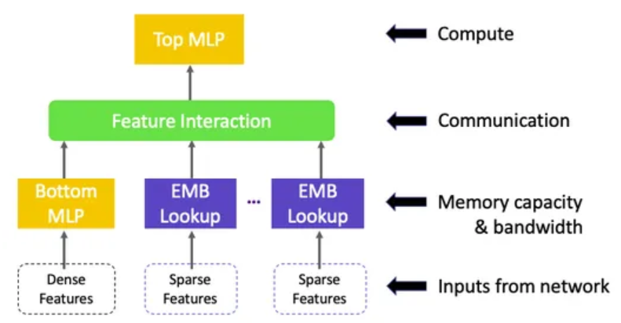

# Deep Learning Recommendation Models on AMD GPUs

<span style="font-size:0.7em;">28, June 2024 by {hoverxref}`Phillip Dang<phildang>`. </span>

In this blog, we demonstrate how to build a simple Deep Learning Recommendation Model (DLRM) with PyTorch on a ROCm-capable AMD GPU.

## Introduction

DLRM stands at the intersection of recommendation systems and deep learning, leveraging neural networks to predict user-item interactions in vast datasets. It is a powerful tool for personalization of recommendations in various domains, from e-commerce to content streaming platforms.

As discussed in [Deep Learning Recommendation Model for Personalization and Recommendation Systems](https://arxiv.org/pdf/1906.00091), DLRM has several components:

* Multiple embedding tables to map sparse features (one for each feature) to dense representations.
* A bottom multilayer perceptron (MLP) that transforms the dense features to dense representations of the same length as the embedding vectors.
* A feature interaction layer that computes the dot product between all pairs of embedding vectors and processed dense features.
* A top multilayer perceptron (MLP) that takes as input the interaction features concatenated with the original processed dense features and outputs logits.

The following diagram from [Deep Learning Recommendation Models: A Deep Dive](https://medium.com/swlh/deep-learning-recommendation-models-dlrm-a-deep-dive-f38a95f47c2c) summarizes DLRM's architecture.



One of the key ideas that differentiates DLRM from other deep learning networks is that it "specifically interacts embeddings in a structured way that mimics factorization
machines to significantly reduce the dimensionality of the model by only considering cross-terms
produced by the dot-product between pairs of embeddings in the final MLP"  [[Reference](https://arxiv.org/pdf/1906.00091)]. This allows DLRM to significantly reduce the dimensionality of the model compared to other networks like Deep and Cross.

This blog emphasizes simplicity. We'll walk through a simple dataset on predicting click-through rates on display ads, construct a basic DLRM architecture, and provide a solid foundation to comprehend its inner workings. Users are encouraged to tweak and expand the model, exploring avenues of complexity to suit their specific needs.

## Prerequisites

* [ROCm](https://rocm.docs.amd.com/projects/install-on-linux/en/latest/tutorial/quick-start.html)
* [PyTorch](https://rocm.docs.amd.com/projects/install-on-linux/en/latest/how-to/3rd-party/pytorch-install.html)
* [Linux OS](https://rocm.docs.amd.com/projects/install-on-linux/en/latest/reference/system-requirements.html#supported-operating-systems)
* [An AMD GPU](https://rocm.docs.amd.com/projects/install-on-linux/en/latest/reference/system-requirements.html#supported-gpus)

Make sure the system recognizes your GPU:

``` python
! rocm-smi --showproductname
```

```bash
================= ROCm System Management Interface ================
========================= Product Info ============================
GPU[0] : Card series: Instinct MI210
GPU[0] : Card model: 0x0c34
GPU[0] : Card vendor: Advanced Micro Devices, Inc. [AMD/ATI]
GPU[0] : Card SKU: D67301
===================================================================
===================== End of ROCm SMI Log =========================
```

Let's check if we have the right version of ROCm installed.

``` python
! apt show rocm-core -a 
```

```text
Package: rocm-core
Version: 5.7.0.50700-63~22.04
Priority: optional
Section: devel
Maintainer: ROCm Dev Support <rocm-dev.support@amd.com>
Installed-Size: 94.2 kB
Homepage: https://github.com/RadeonOpenCompute/ROCm
Download-Size: 7030 B
APT-Manual-Installed: no
APT-Sources: http://repo.radeon.com/rocm/apt/5.7 jammy/main amd64 Packages
Description: Radeon Open Compute (ROCm) Runtime software stack
```

Make sure PyTorch also recognizes the GPU:

``` python
import torch
print(f"number of GPUs: {torch.cuda.device_count()}")
print([torch.cuda.get_device_name(i) for i in range(torch.cuda.device_count())])
```

``` text
number of GPUs: 1
['AMD Radeon Graphics']
```

## Dataset

Following the original [paper](https://arxiv.org/pdf/1906.00091) on DLRM, we'll be using the [Criteo dataset](https://www.kaggle.com/c/criteo-display-ad-challenge/data) to predict ads click-through rate (CTR). We will be predicting the probability that a user will click on a given ad on the page he/she is visiting.

The data fields contain the following:

* Label - Target variable that indicates if an ad was clicked (1) or not (0).
* I1-I13 - A total of 13 columns of integer features (mostly count features).
* C1-C26 - A total of 26 columns of categorical features. The values of these features have been hashed into 32 bits for anonymization purposes.

The specific semantics of these features are not disclosed, which is common in anonymized datasets to protect privacy and proprietary information. To make the process easier, we have already downloaded the data and included it in our repo. Let's install and import the required libraries and load the dataset.

```python
! pip install --upgrade pip
! pip install --upgrade pandas
! pip install --upgrade scikit-learn
```

```python
import torch
import torch.nn as nn
import pandas as pd
from sklearn.model_selection import train_test_split
from sklearn.preprocessing import LabelEncoder, MinMaxScaler
from torch.utils.data import DataLoader, TensorDataset
from tqdm import tqdm
```

```python
columns = ["label", *(f"I{i}" for i in range(1, 14)), *(f"C{i}" for i in range(1, 27))]
df = pd.read_csv(
    "../data/dac_sample.txt", sep="\t", names=columns
).fillna(0)
```

### Preprocessing

Our preprocessing steps include the ordinal encoding of the sparse and categorical features and min-max scaling the dense and numerical features.

```python
sparse_cols = ["C" + str(i) for i in range(1, 27)]
dense_cols = ["I" + str(i) for i in range(1, 14)]

data = df[sparse_cols + dense_cols]
data = data.astype(str)
for feat in sparse_cols:
    lbe = LabelEncoder()
    data[feat] = lbe.fit_transform(data[feat])
mms = MinMaxScaler(feature_range=(0, 1))
data[dense_cols] = mms.fit_transform(data[dense_cols])
print(data.sample(5))
```

```text
C1	C2	C3	C4	C5	C6	C7	C8	C9	C10	...	I4	I5	I6	I7	I8	I9	I10	I11	I12	I13
33714	8	289	12798	19697	23	10	2279	86	2	2505	...	0.000000	0.001729	0.013812	0.000000	0.000000	0.001027	0.000000	0.000000	0.0	0.000000
41376	8	21	6057	20081	23	5	6059	27	2	2505	...	0.011990	0.002585	0.008840	0.000795	0.001283	0.020220	0.000000	0.028846	0.0	0.000762
21202	8	62	23836	24608	41	5	2305	8	2	2933	...	0.004796	0.000136	0.002701	0.000568	0.005987	0.003633	0.166667	0.019231	0.0	0.003355
89866	8	113	42768	7421	23	11	827	48	2	2505	...	0.002398	0.000118	0.000491	0.000114	0.002138	0.002133	0.166667	0.009615	0.0	0.000152
19993	327	78	31306	11660	23	0	6837	27	2	8905	...	0.007194	0.001740	0.001105	0.002612	0.001497	0.002448	0.000000	0.038462	0.0	0.000457
```

We also remove sparse features with an excessive number of categories, approximately 10,000 in this dataset. This decision is informed by recommendations from [community discussions on Kaggle](https://www.kaggle.com/c/criteo-display-ad-challenge/discussion?sort=undefined) indicating marginal improvement in model performance when sparse features exceed the 10,000 category threshold. This would needlessly increase the number of parameters.

```python
# Get the number of categories for each categorical feature
num_categories = [len(data[c].unique()) for c in sparse_cols]

# Only keep categorical features with less than 10K categories
indices_to_keep = [i for i, num in enumerate(num_categories) if num <= 10000]
num_categories_kept = [num_categories[i] for i in indices_to_keep]
sparse_cols_kept = [sparse_cols[i] for i in indices_to_keep]
```

Finally, we split our data into training and testing sets, then convert them into `torch` tensors and create corresponding data loaders.

```python
device = "cuda" if torch.cuda.is_available() else "cpu"
batch_size = 128

# Split dataset
X_train, X_test, y_train, y_test = train_test_split(
    data, df["label"], test_size=0.2, random_state=42
)

# Convert to tensor
# train
X_train_sparse = torch.tensor(X_train[sparse_cols_kept].values, dtype=torch.long).to(
    device
)
X_train_dense = torch.tensor(X_train[dense_cols].values, dtype=torch.float).to(device)
y_train = torch.tensor(y_train.values, dtype=torch.float).unsqueeze(1).to(device)

# test
X_test_sparse = torch.tensor(X_test[sparse_cols_kept].values, dtype=torch.long).to(device)
X_test_dense = torch.tensor(X_test[dense_cols].values, dtype=torch.float).to(device)
y_test = torch.tensor(y_test.values, dtype=torch.float).unsqueeze(1).to(device)

# Create DataLoader for train data 
train_dataset = TensorDataset(X_train_sparse, X_train_dense, y_train)
train_loader = DataLoader(train_dataset, batch_size=batch_size, shuffle=True)
# Create DataLoader for test data
test_dataset = TensorDataset(X_test_sparse, X_test_dense, y_test)
test_loader = DataLoader(test_dataset, batch_size=batch_size, shuffle=False)
```

## Modeling

Let's set up some hyperparameter for our DLRM:

```python
device = "cuda" if torch.cuda.is_available() else "cpu"
num_epochs = 10
lr = 3e-4
batch_size = 128
hidden_size = 32
embd_dim = 16
```

Now we're ready to create our DLRM. For simplicity, our bottom and top MLPs will be a simple 3-layer (input, hidden, output) neural network with a ReLU activation function.

```python
class FeatureInteraction(nn.Module):
    def __init__(self):
        super(FeatureInteraction, self).__init__()

    def forward(self, x):
        feature_dim = x.shape[1]

        concat_features = x.view(-1, feature_dim, 1)
        dot_products = torch.matmul(concat_features, concat_features.transpose(1, 2))
        ones = torch.ones_like(dot_products)

        mask = torch.triu(ones)
        out_dim = feature_dim * (feature_dim + 1) // 2

        flat_result = dot_products[mask.bool()]
        reshape_result = flat_result.view(-1, out_dim)

        return reshape_result

class DLRM(torch.nn.Module):

    def __init__(
        self,
        embd_dim,
        num_categories,
        num_dense_feature,
        hidden_size,
    ):
        super(DLRM, self).__init__()
        # create embedding for each categorical feature with the same embedding dimension
        self.embeddings = nn.ModuleList(
            [nn.Embedding(num_cat, embd_dim) for num_cat in num_categories]
        )

        self.feat_interaction = FeatureInteraction()
        self.bottom_mlp = nn.Sequential(
            nn.Linear(in_features=num_dense_feature, out_features=hidden_size),
            nn.ReLU(),
            nn.Linear(hidden_size, embd_dim),
        )
        num_feat = (
            len(num_categories) * embd_dim + embd_dim
        )  # both categorical and dense features
        num_feat_interact = num_feat * (num_feat + 1) // 2  # interaction features
        top_mlp_in = (
            num_feat_interact + embd_dim
        )  # interaction concatenated with dense features
        self.top_mlp = nn.Sequential(
            nn.Linear(in_features=top_mlp_in, out_features=hidden_size),
            nn.ReLU(),
            nn.Linear(hidden_size, 1),
        )

    def forward(self, x_cat, x_num):
        B = x_cat.shape[0]
        num_sparse_feat = x_cat.shape[1]

        # look up embedding for categorical features
        embed_x = torch.concat(
            [
                self.embeddings[i](x_cat[:, i]).unsqueeze(1)
                for i in range(num_sparse_feat)
            ]
        )  # B, num_sparse_feat, embedding dim
        embed_x = embed_x.view(B, -1)  # B, num_sparse_feat * embedding dim

        # get bottom dense features
        dense_x = self.bottom_mlp(x_num)  # B, embedding dim
        # concatenate with embeddings
        x = torch.concat(
            [embed_x, dense_x], dim=-1
        )  # B, (num_sparse_feat+1) * embedding dim
        # get 2nd order interaction features
        x = self.feat_interaction(x)  # B, n*(n+1) // 2
        # combine with dense features
        x = torch.concat([x, dense_x], dim=-1)
        # pass through top mlp
        x = self.top_mlp(x)  # B, 1
        return x
```

Let's instantiate our model, and define our loss function and optimizer.

```python
# Instantiate the model, loss function and optimizer
model = DLRM(
    embd_dim=embd_dim,
    num_categories=num_categories_kept,
    num_dense_feature=len(dense_cols),
    hidden_size=hidden_size,
)
model.to(device)
criterion = torch.nn.BCEWithLogitsLoss()
optimizer = torch.optim.Adam(model.parameters(), lr=lr)

print(f"running on {device}")
print(sum(p.numel() for p in model.parameters()) / 1e6, "M parameters")
print(model)
```

```text
running on cuda
2.195553 M parameters
DLRM(
  (embeddings): ModuleList(
    (0): Embedding(541, 16)
    (1): Embedding(497, 16)
    (2): Embedding(145, 16)
    (3): Embedding(12, 16)
    (4): Embedding(7623, 16)
    (5): Embedding(257, 16)
    (6): Embedding(3, 16)
    (7): Embedding(3799, 16)
    (8): Embedding(2796, 16)
    (9): Embedding(26, 16)
    (10): Embedding(5238, 16)
    (11): Embedding(10, 16)
    (12): Embedding(2548, 16)
    (13): Embedding(1303, 16)
    (14): Embedding(4, 16)
    (15): Embedding(11, 16)
    (16): Embedding(14, 16)
    (17): Embedding(51, 16)
    (18): Embedding(9527, 16)
  )
  (feat_interaction): FeatureInteraction()
  (bottom_mlp): Sequential(
    (0): Linear(in_features=13, out_features=32, bias=True)
    (1): ReLU()
    (2): Linear(in_features=32, out_features=16, bias=True)
  )
  (top_mlp): Sequential(
    (0): Linear(in_features=51376, out_features=32, bias=True)
    (1): ReLU()
    (2): Linear(in_features=32, out_features=1, bias=True)
  )
)
```

### Training

Next, let's write two utility functions, one for model training and the other for model evaluation on the training and test set.

```python
def train_one_epoch():
    model.train()
    for i, (x_sparse, x_dense, y) in enumerate(tqdm(train_loader)):
        x_sparse = x_sparse.to(device)
        x_dense = x_dense.to(device)
        y = y.to(device)
        optimizer.zero_grad()
        logits = model(x_sparse, x_dense)
        loss = criterion(logits, y)
        loss.backward()
        optimizer.step()
```

```python
def evaluate(dataloader, dataname):
    model.eval()
    total_samples = 0
    total_loss = 0
    total_correct = 0
    with torch.no_grad():
        for i, (x_sparse, x_dense, y) in enumerate(tqdm(dataloader)):
            x_sparse = x_sparse.to(device)
            x_dense = x_dense.to(device)
            y = y.to(device)
            logits = model(x_sparse, x_dense)
            probs = torch.sigmoid(logits)
            predictions = (probs > 0.5).long()

            loss = criterion(logits, y)
            total_loss += loss.item() * y.shape[0]
            total_correct += (predictions == y).sum().item()
            total_samples += y.shape[0]

    avg_loss = total_loss / total_samples
    accuracy = total_correct / total_samples * 100
    print(
        f"{dataname} accuracy = {accuracy:0.2f}%, {dataname} avg loss = {avg_loss:.6f}"
    )
    return accuracy, avg_loss
```

Now we're ready to train our model.

```python
for epoch in range(num_epochs):
    print(f"epoch {epoch+1}")
    train_one_epoch()
    evaluate(train_loader, "train")
    evaluate(test_loader, "test")
    print()
```

```text
epoch 1
100%|██████████| 625/625 [00:06<00:00, 92.18it/s]
100%|██████████| 625/625 [00:01<00:00, 351.70it/s]
train accuracy = 77.37%, train avg loss = 0.535811
100%|██████████| 157/157 [00:00<00:00, 354.67it/s]
test accuracy = 77.14%, test avg loss = 0.538407

...

epoch 10
100%|██████████| 625/625 [00:06<00:00, 98.00it/s]
100%|██████████| 625/625 [00:01<00:00, 351.16it/s]
train accuracy = 77.48%, train avg loss = 0.498510
100%|██████████| 157/157 [00:00<00:00, 352.91it/s]
test accuracy = 77.14%, test avg loss = 0.501544
```

### Inferencing

Now we have a DLRM model that can predict the probability of click for a given user/ad combination. Since the semantics of the Criteo dataset features are not disclosed, we can't reconstruct meaningful feature vectors that represent realistic users or ads.  For illustration purposes, let's assume that part of the feature vector represents the user, and the rest represents the ad. In particular, for the sake of simplicity, we assume all the integer features represent the user, and all the categorical features represent the ad.

Suppose at ad serving time, we have retrieved 10 ad candidates. The job of the DLRM is to choose the best ad candidate to serve to the user.  For illustration purpose, we assume the retrieved ad candidates are from the first 10 rows from the raw dataset, and the user is the one in the first row. First, we create a data loader that combines the user and ad features to be fed to the model.  

```python
# Assume we use the first 10 rows of the dataset as ad candidates
num_ads = 10
df_c = pd.DataFrame(data.iloc[0:num_ads])
# get the ad candidate features
df_ads = df_c[df_c.columns[26:39]]
# get the user features of the first row
df_user = df_c[df_c.columns[0:26]].iloc[0:1]
# replicate the user feature across all ad candidate rows
df_user_rep = df_user
for i in range(num_ads-1): 
    df_user_rep = pd.concat([df_user_rep, df_user], ignore_index=True, sort=False)
df_candidates = pd.concat([df_user_rep, df_ads], axis=1)

# Convert the feature vectors to tensor
X_inf_sparse = torch.tensor(df_candidates[sparse_cols_kept].values, dtype=torch.long).to(device)
X_inf_dense = torch.tensor(df_candidates[dense_cols].values, dtype=torch.float).to(device)

# create data loader for inferencing
y_dummy = torch.tensor([0]*num_ads, dtype=torch.float).unsqueeze(1).to(device)
inf_dataset = TensorDataset(X_inf_sparse, X_inf_dense, y_dummy)
inf_loader = DataLoader(inf_dataset, batch_size=num_ads, shuffle=True)
```

Next, we create a function that returns the index of the tensor with the highest probability of click.

```python
def recommend():
    with torch.no_grad():
        for i, (x_sparse, x_dense, y) in enumerate(tqdm(inf_loader)):
            x_sparse = x_sparse.to(device)
            x_dense = x_dense.to(device)
            logits = model(x_sparse, x_dense)
            probs = torch.sigmoid(logits)
    print(probs)
    return torch.max(probs, dim=0).indices[0].item()
```

Calling this function will get us the index of the best ad candidate.

```python
print('Best ad candidate is ad', recommend())
```

```python
100%|████████████████████████████████████████████████████████████████████████████████████████████████████████████████████████████████████████████████████████████████████████████████████████████████████████████████████████████████| 1/1 [00:00<00:00, 315.29it/s]
tensor([[0.1380],
        [0.2414],
        [0.3493],
        [0.3500],
        [0.1807],
        [0.3009],
        [0.2203],
        [0.3639],
        [0.1890],
        [0.3702]], device='cuda:0')
Best ad candidate is ad 9
```

Users are encouraged to explore further optimization and hyperparameter tuning to improve the model's performance. For example, one can try adding more layers and hidden units in the bottom and top MLPs, increasing the embedding dimension, or including regularization such as dropout to prevent overfitting.

## Discussion

In this blog, we've developed a small-scale model exclusively for educational purposes. However, in practical applications, the models are considerably larger. Therefore, it's imperative to efficiently parallelize these models to tackle the challenges at real-world scales.

With DLRM, the majority of the model parameters come from the embedding tables, making it very difficult to apply data parallelism in practice since we'd need to replicate these tables on every device. Thus we'd need to efficiently distribute the model across multiple devices to solve this memory constraint. On the other hand, the bottom and top MLPs don't have a lot of parameters and we can apply data parallelism to concurrently process multiple samples on different devices.

For more details on how to efficiently implement data parallelism and model parallelism for DLRM, please refer to the original [paper](https://arxiv.org/pdf/1906.00091) and this open-source [repo](https://github.com/facebookresearch/dlrm) from Meta.

## Disclaimer

Third-party content is licensed to you directly by the third party that owns the content and is not licensed to you by AMD. ALL LINKED THIRD-PARTY CONTENT IS PROVIDED “AS IS” WITHOUT A WARRANTY OF ANY KIND. USE OF SUCH THIRD-PARTY CONTENT IS DONE AT YOUR SOLE DISCRETION AND UNDER NO CIRCUMSTANCES WILL AMD BE LIABLE TO YOU FOR ANY THIRD-PARTY CONTENT. YOU ASSUME ALL RISK AND ARE SOLELY RESPONSIBLE FOR ANY DAMAGES THAT MAY ARISE FROM YOUR USE OF THIRD-PARTY CONTENT.
