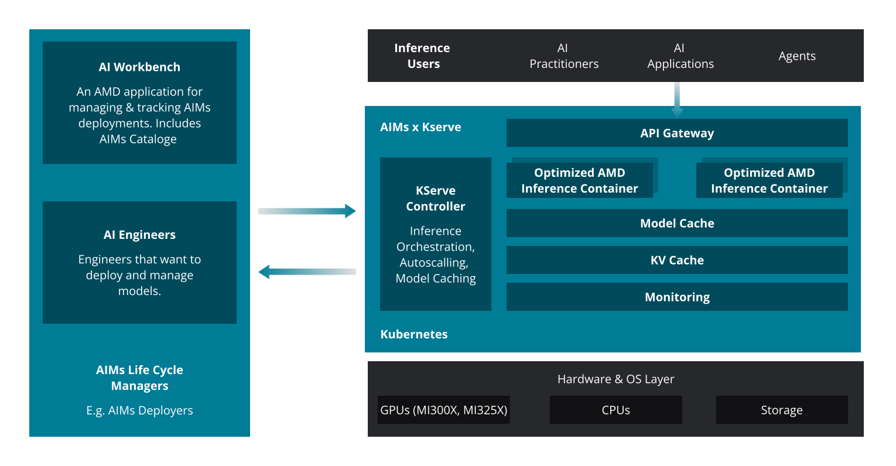
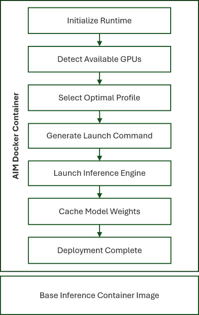
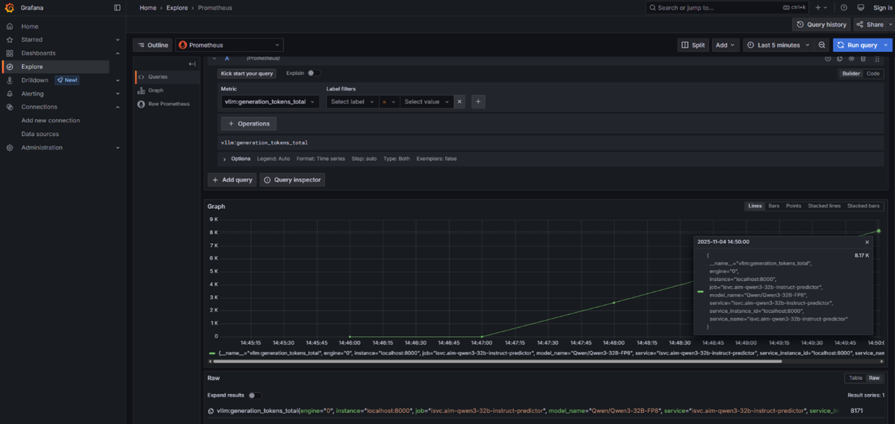

<!---
Copyright (c) 2025 Advanced Micro Devices, Inc. (AMD)

Permission is hereby granted, free of charge, to any person obtaining a copy
of this software and associated documentation files (the "Software"), to deal
in the Software without restriction, including without limitation the rights
to use, copy, modify, merge, publish, distribute, sublicense, and/or sell
copies of the Software, and to permit persons to whom the Software is
furnished to do so, subject to the following conditions:

The above copyright notice and this permission notice shall be included in all
copies or substantial portions of the Software.

THE SOFTWARE IS PROVIDED "AS IS", WITHOUT WARRANTY OF ANY KIND, EXPRESS OR
IMPLIED, INCLUDING BUT NOT LIMITED TO THE WARRANTIES OF MERCHANTABILITY,
FITNESS FOR A PARTICULAR PURPOSE AND NONINFRINGEMENT. IN NO EVENT SHALL THE
AUTHORS OR COPYRIGHT HOLDERS BE LIABLE FOR ANY CLAIM, DAMAGES OR OTHER
LIABILITY, WHETHER IN AN ACTION OF CONTRACT, TORT OR OTHERWISE, ARISING FROM,
OUT OF OR IN CONNECTION WITH THE SOFTWARE OR THE USE OR OTHER DEALINGS IN THE
SOFTWARE.
--->

# AMD Inference Microservice (AIM): Production Ready Inference on AMD Instinct™ GPUs

As generative AI models continue to expand in scale, context length, and
operational complexity, enterprises face a harder challenge: how to
deploy and operate inference reliably, efficiently, and at production
scale. Running LLMs or multimodal models on real workloads requires more
than high-performance GPUs. It requires reproducible deployments,
predictable performance, seamless orchestration, and an operational
framework that teams can trust.

This blog introduces **AMD Inference Microservice (AIM)**, a
production-ready framework that simplifies and accelerates AI model
deployment on AMD Instinct™ GPUs. Built on ROCm™, integrated with
Kubernetes, and aligned with enterprise workflows, AIM provides
flexible, high-performance building blocks for serving LLMs, vision
models, speech models, and agentic AI pipelines.

You will walk through how AIM works under the hood, how it enables
scalable and optimized inference, and how enterprises can integrate AIM
into existing AI platforms. This blog also illustrates the architecture,
discusses key operational components, and explains how AIM delivers
consistent performance across diverse AI workloads. If you are building
or operating AI infrastructure, whether for prototyping, internal
applications, or large-scale production, AIM helps reduce operational
burden, provides predictable performance on AMD accelerators, and
establishes a reproducible deployment workflow that your teams can standardize
on.

This article is part of a unified set of resources covering the AMD
Enterprise AI Suite. For a complete overview of the suite and its role
in enterprise AI adoption, see the [Enterprise AI Suite Overview](https://rocm.blogs.amd.com/artificial-intelligence/enterprise-ai-suite/README.html) blog.

## Why AIM?

Deploying and optimizing AI inference across heterogeneous systems can
be complex. AIM simplifies this process by providing a modular,
intelligent orchestration layer that automatically configures runtime
environments, detects available accelerators, and selects the optimal
performance profile for each model and workload.

AIM design principles focus on:

- **Ease of deployment** through standard APIs and containers

- **Hardware-aware optimization** across AMD Instinct™ GPUs

- **Scalability** from a single GPU to multi-node clusters

- **Observability** with built-in metrics and health monitoring

## Key Features

- **Validated Model Profiles**
  Accelerator specific profiles improve model performance for inference.

- **Intelligent Hardware Detection**
  AIM automatically detects available GPUs and adapts configurations
  dynamically.

- **Open-Source Inference Engine Support**
  Extensible architecture supporting multiple inference engines,
  starting with **vLLM**.

- **Precision & Tensor Optimization**
  Provides optimization for tensor parallelism, precision formats, and
  model-specific use cases.

## Architecture Overview

At its core, AIM consists of the following key pillars:

- **Standard APIs**: Unified endpoints for text, image, video, and
  speech models

- **Model Caching**: Efficient model weight management to reduce load
  times

- **Optimized Model Execution**: Tailored runtime configurations for
  single-, multi-GPU, and multi-node setups

- **Inference Engines**: Support for popular open-source inference
  engines such as vLLM

- **Observability**: Integrated metrics and health checks for runtime
  monitoring

- **Scalability**: Kubernetes-based scaling based on KServe

AIM leverages the **ROCm™ software stack** and runs natively on **AMD
Instinct™ GPUs**, ensuring maximum performance and portability across
AMD hardware platforms.



Figure 1: AMD Inference Microservice Architecture

The above figure illustrates how AIM is integrated with KServe, a
leading open-source technology for orchestrating and scaling inference
services. It also highlights how external tools such as [AMD AI
Workbench](https://github.com/amd-enterprise-ai/amd-eai-suite) plug in
to manage the full AI lifecycle. Whether run stand-alone or alongside
KServe, the AIM container automatically detects available GPUs and
dynamically adapts configurations to achieve optimized performance.

From a user perspective, a set of Custom Resource Definitions (CRDs)
describe how to deploy and monitor the status of an AIM deployment in
Kubernetes. These CRDs also include guidance on scaling mechanisms and
the use of a key-value (KV) cache to improve inference performance. At a
minimum, users only need to select an AIM image when deploying the CRDs.
KServe then deploys the AIM image using an appropriate inference engine,
like vLLM. Each AIM image contains built-in logic that detects GPU
resources and configures the engine. The logic that is executed in the
AIM container is further explained in the following section. Once this
profile selection logic executes, the model is downloaded, cached and
deployed behind an API gateway, which manages access control and serves
the model through an OpenAI-compatible API. Users can also enable
monitoring and observability by following the How-to guide provided below.
Metrics from the inference engine instances are exported to Prometheus
and visualized through Grafana dashboards, providing insight into model
performance and resource utilization.

All of these steps can be performed manually by applying the
corresponding CRDs to the Kubernetes cluster. Alternatively, AI
engineers can create automation scripts to streamline deployment and
scaling. To further simplify AIM management, AMD AI Workbench provides
a user-friendly web interface that consolidates key capabilities such
as:

- AIM catalog and deployment management
- Observability and monitoring dashboards
- One-click AIM deployment and fine-tuning triggers
- And additional features described in the linked documentation.

## What does AIM do under the hood



Figure 2: AIM deployment sequence

As shown in Figure 2, AIM handles the full inference lifecycle through a
coordinated containerized runtime workflow:

1. **Initialize Runtime:** Load and validate configurations

2. **Detect Available GPUs**: Discover and health-check available
    accelerators

3. **Select Optimal Profile**: Match model requirements with GPU
    capabilities

4. **Generate Launch Command**: Produce tuned runtime parameters

5. **Launch Inference Engine**: Deploy inference (starting with vLLM)

6. **Cache Model Weights**: Optimize future inference loads

7. **Deployment Complete**: Seamlessly serve models via
    OpenAI-compatible APIs

## How to deploy an AIM on AMD Instinct™ GPUs

AIM offers multiple deployment options from standalone systems to
production-ready Kubernetes clusters. The [aim-deploy
repository](https://github.com/amd-enterprise-ai/aim-deploy)
provides comprehensive deployment guides and ready-to-use examples for
different scenarios, including advanced features like model caching and
metrics-based autoscaling with KServe and KEDA.

## How to deploy an AIM on AMD Instinct™ GPUs with Docker

### Prerequisites

- AMD GPU with ROCm support (e.g., MI300X, MI325X)
- Docker installed and configured with GPU support

### Running the container

The following command runs the container with the profile that the
container automatically selects for optimized performance on the
hardware it detects:

```bash
docker run \
       --device=/dev/kfd \
       --device=/dev/dri \
       -p 8000:8000 \
       amdenterpriseai/aim-qwen-qwen3-32b:0.8.4
```

Alternatively, with the [AMD Container
Toolkit](https://instinct.docs.amd.com/projects/container-toolkit/en/latest/container-runtime/quick-start-guide.html)
the same is achieved (in this and subsequent steps) with:

```bash
docker run \
       --runtime=amd --gpus 1 \
       -p 8000:8000 \
       amdenterpriseai/aim-qwen-qwen3-32b:0.8.4
```

### Customizing deployment with environmental variables

Customize your deployment with optional environment variables:

```bash
docker run \
       -e AIM_PRECISION=fp16 \
       -e AIM_GPU_COUNT=1 \
       -e AIM_METRIC=throughput \
       -e AIM_PORT=8080 \
       --device=/dev/kfd \
       --device=/dev/dri \
       -p 8080:8080 \
       amdenterpriseai/aim-qwen-qwen3-32b:0.8.4
```

### Getting help and listing profiles

The general interface to get help is by adding a help flag to the basic
command:

```bash
docker run \
       amdenterpriseai/aim-qwen-qwen3-32b:0.8.4 --help
```

For a comprehensive view of all profiles in the container:

```bash
docker run \
       --device=/dev/kfd \
       --device=/dev/dri \
       amdenterpriseai/aim-qwen-qwen3-32b:0.8.4 list-profiles \
       --format table
```

The help flag can be applied to list-profiles, or any other subcommand
of the AIM runtime to obtain additional help

```bash
docker run \
       amdenterpriseai/aim-qwen-qwen3-32b:0.8.4 <subcommand> --help
```

For an overview of configurable variables and subcommands, see the
documentation in [aim-build repository](https://github.com/amd-enterprise-ai/aim-build), which also covers setting up
huggingface tokens for gated models, overriding the automatic profile
selection, use of custom profiles, model caching for production, and
more.

## How to deploy an AIM on AMD Instinct™ GPUs on Kubernetes with KServe

**Prerequisites**:

- Kubernetes **1.24+** with `kubectl` configured  
- **Helm 3.8+**  
- **Cluster admin privileges**  
- **Internet access** for pulling charts and manifests  
- A **default storage class** available for observability components *(optional)*

### Step 1: Get the deployment repository

This step downloads the [AIM deployment repository](https://github.com/amd-enterprise-ai/aim-deploy) and navigates to the
KServe installation directory.

```bash
git clone https://github.com/amd-enterprise-ai/aim-deploy.git
cd aim-deploy/kserve/kserve-install
```

### Step 2: Install KServe infrastructure

This installs the core KServe components including cert-manager, Gateway
API CRDs, KServe CRDs, and the KServe controller for model serving.

For basic deployment:

```bash
bash ./install-deps.sh
```

For deployment with observability and autoscaling (optional):

```bash
# Requires a default storage class to be set, or overwrite storage
# class in ./post-helm/base/otel-lgtm-stack-standalone/otel-lgtm.yaml
bash ./install-deps.sh --enable=otel-lgtm-stack-standalone,keda
```

This option additionally installs the OpenTelemetry LGTM (Loki, Grafana,
Tempo, Mimir) stack for comprehensive metrics collection, logging, and
distributed tracing capabilities, along with OpenTelemetry collectors
configured for vLLM metrics scraping. It also installs KEDA (Kubernetes
Event-driven Autoscaling) to enable custom metrics-based autoscaling of
inference services.

### Step 3: Deploy a basic AIM inference service

This deploys a ClusterServingRuntime (container specification) and
InferenceService (compute resources and endpoint) for Qwen3-32B.

```bash
cd ../sample-minimal-aims-deployment
kubectl apply -f servingruntime-aim-qwen3-32b.yaml
kubectl apply -f aim-qwen3-32b.yaml
```

### Step 4: Test the inference endpoint

This checks the deployment status, port-forwards the service to your
local machine, and sends a test inference request to verify the service
is working correctly. KServe automatically creates a service with the
name `<inferenceservice-name>-predictor` (in this case
`aim-qwen3-32b-predictor`) that exposes port 80 by default.

```bash
kubectl get inferenceservice
kubectl port-forward service/aim-qwen3-32b-predictor 8000:80

# In a new terminal, send a test request
curl -X POST http://localhost:8000/v1/chat/completions \
     -H "Content-Type: application/json" \
     -d '{"messages": [{"role": "user", "content": "Hello"}]}'
```

### Step 5: Deploy monitored inference service (optional -- requires observability and autoscaling setup)

This creates an InferenceService with OpenTelemetry sidecar injection
enabled, the VLLM_ENABLE_METRICS environment variable set to true, and
KEDA-based autoscaling configured to scale based on the number of
running inference requests. The service will automatically scale between
1-3 replicas based on vLLM metrics. It works through KEDA creating a
ScaledObject resource that monitors the Prometheus metrics and scales
the deployment up or down based on the configured query and target
values.

```bash
# Make sure serving runtime from step 3 is applied.
kubectl apply -f servingruntime-aim-qwen3-32b.yaml

# Create the inference service manifest with monitoring and autoscaling
cat <<'EOF' > aim-qwen3-32b-scalable.yaml
apiVersion: serving.kserve.io/v1beta1
kind: InferenceService
metadata:
  name: aim-qwen3-32b-scalable
  annotations:
    serving.kserve.io/deploymentMode: RawDeployment
    serving.kserve.io/autoscalerClass: "keda"
    sidecar.opentelemetry.io/inject: "otel-lgtm-stack/vllm-sidecar-collector"
spec:
  predictor:
    model:
      runtime: aim-qwen3-32b-runtime
      modelFormat:
        name: aim-qwen3-32b
      env:
        - name: VLLM_ENABLE_METRICS
          value: "true"
      resources:
        limits:
          memory: "128Gi"
          cpu: "8"
          amd.com/gpu: "1"
        requests:
          memory: "64Gi"
          cpu: "4"
          amd.com/gpu: "1"
    minReplicas: 1
    maxReplicas: 3
    autoScaling:
      metrics:
        - type: External
          external:
            metric:
              backend: "prometheus"
              serverAddress: "http://lgtm-stack.otel-lgtm-stack.svc:9090"
              query: 'sum(vllm:num_requests_running{service="isvc.aim-qwen3-32b-scalable-predictor"})'
            target:
              type: Value
              value: "1"
EOF

# Apply the manifest
kubectl apply -f aim-qwen3-32b-scalable.yaml
```

### Step 6: Access Grafana dashboard (optional -- requires observability setup)

This forwards the Grafana service port to your local machine, enabling
access to the monitoring dashboard where you can view metrics, logs, and
traces.

```bash
kubectl port-forward -n otel-lgtm-stack svc/lgtm-stack 3000:3000
# Open http://localhost:3000 in browser
```

### Step 7: Generate inference requests to view metrics and autoscaling (optional)

This sends inference requests to generate vLLM metrics that are
collected by the OpenTelemetry sidecar and displayed through Grafana. As
shown in Figure 3, these metrics allow you to observe how the system
behaves under load, including how KEDA automatically scales service
replicas as request volume increases.

```bash
# Port-forward the service to localhost
kubectl port-forward service/aim-qwen3-32b-scalable-predictor 8080:80

# In a new terminal, send inference requests
curl -X POST http://localhost:8080/v1/chat/completions \
     -H "Content-Type: application/json" \
     -d '{"messages": [{"role": "user", "content": "Hello"}]}'
```



*Figure 3: vLLM Metrics from AIM deployment on Kubernetes with KServe,
displayed in Grafana UI.*

## Summary

This blog gave an in-depth look at the AMD Inference Microservice (AIM)
framework and showed how it delivers efficient and scalable inference on
AMD Instinct GPUs. You learned how AIM manages the inference lifecycle,
selects optimized runtime profiles, integrates with Kubernetes, and
provides built-in observability with OpenTelemetry metrics and
KEDA-driven autoscaling.

AIM is part of the broader **AMD Enterprise AI Suite**, which provides
unified components for scalable inference, resource management, and
practitioner tooling. For a complete understanding of the suite, refer
to the [Enterprise AI Suite Overview blog](https://rocm.blogs.amd.com/artificial-intelligence/enterprise-ai-suite/README.html).

Future content will cover advanced AIM capabilities, including
multi-model workflows, distributed inference, expanded observability,
and best practices for large-scale operations. Additional posts across
the Enterprise AI Suite will continue to provide practical guidance,
validated reference architecture, and technical updates. Readers are
encouraged to check back for new releases and deeper insights from the
AMD team.

## Get Started

AIM is open-source and available now. Developers can start deploying optimized
inference workloads on AMD Instinct™ GPUs. Explore the [**AIM
catalog**](https://enterprise-ai.docs.amd.com/en/latest/aims/catalog/models.html)
for available deployments. Join the AMD developer community and help shape the
next generation of open-source AI inference infrastructure.

## Disclaimers

Third-party content is licensed to you directly by the third party that owns the
content and is not licensed to you by AMD. ALL LINKED THIRD-PARTY CONTENT IS
PROVIDED “AS IS” WITHOUT A WARRANTY OF ANY KIND. USE OF SUCH THIRD-PARTY CONTENT
IS DONE AT YOUR SOLE DISCRETION AND UNDER NO CIRCUMSTANCES WILL AMD BE LIABLE TO
YOU FOR ANY THIRD-PARTY CONTENT. YOU ASSUME ALL RISK AND ARE SOLELY RESPONSIBLE
FOR ANY DAMAGES THAT MAY ARISE FROM YOUR USE OF THIRD-PARTY CONTENT.
