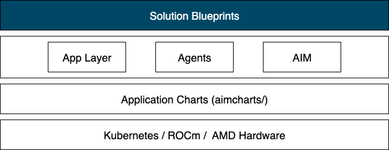
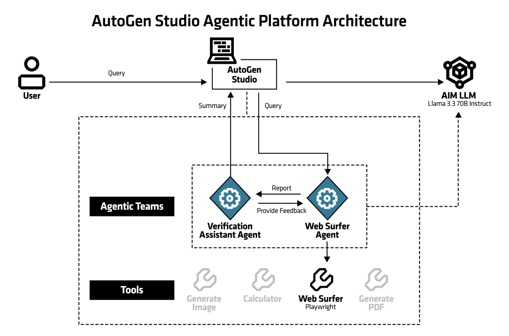
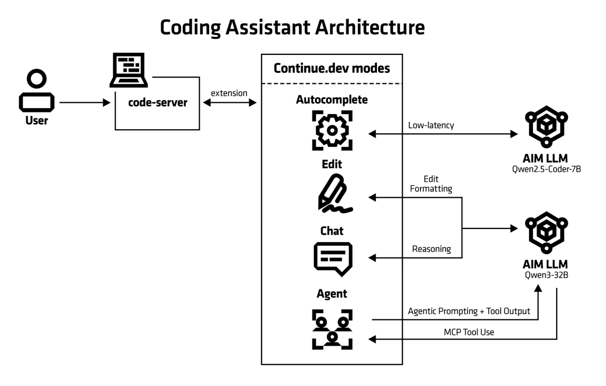
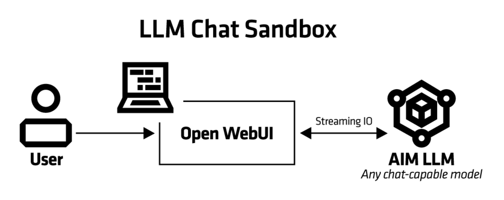
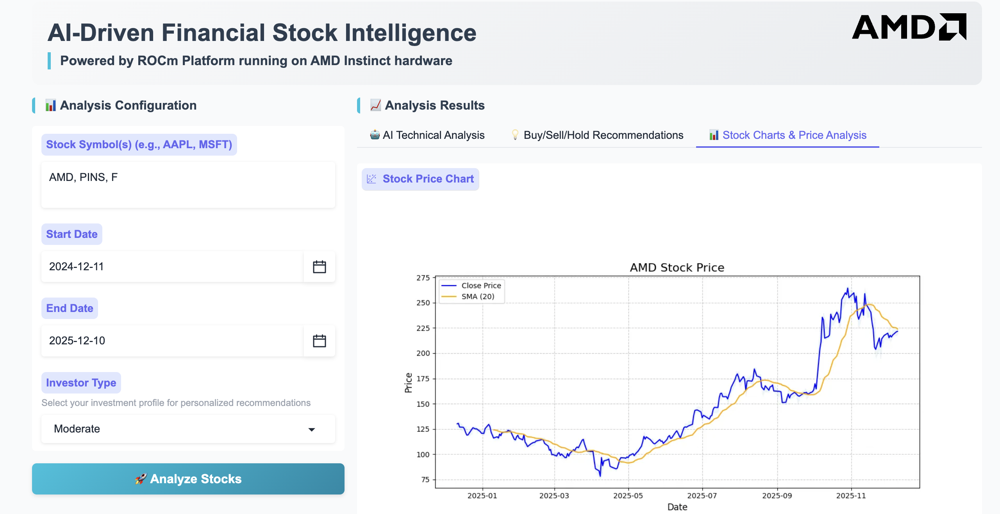
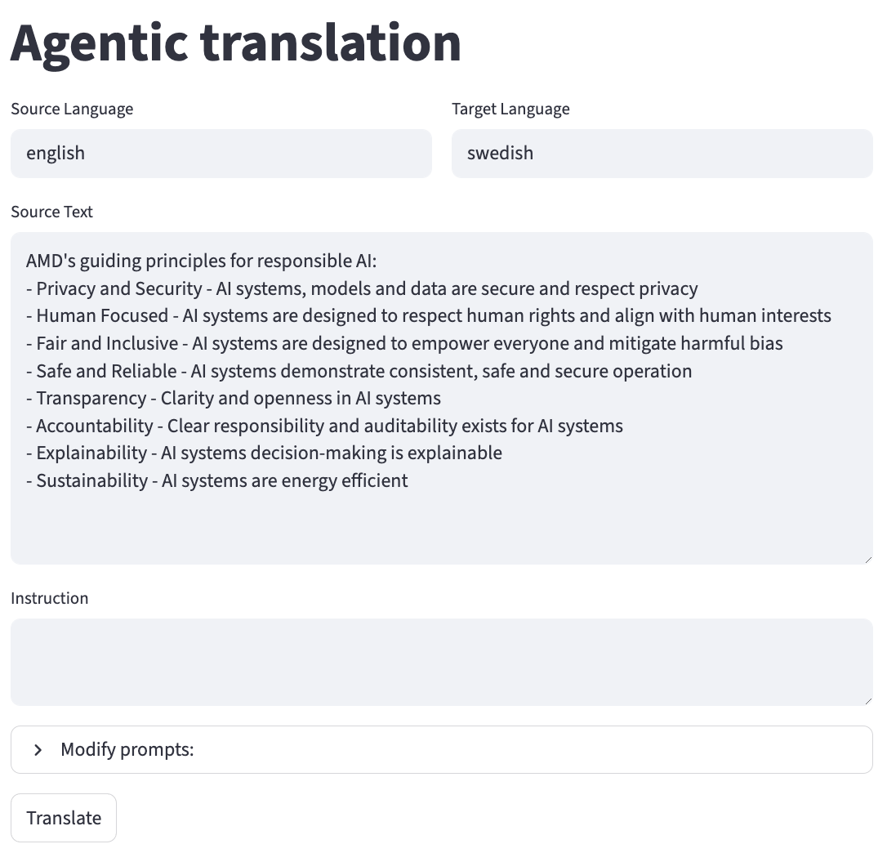
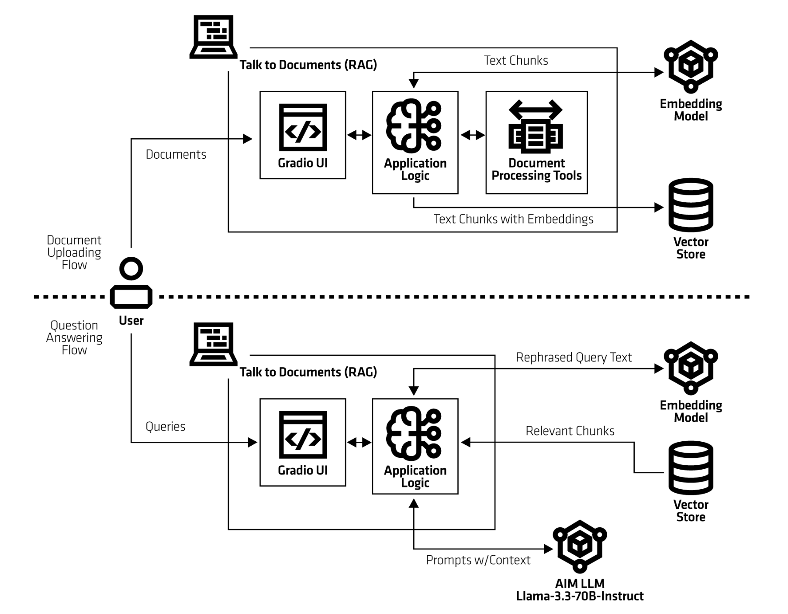
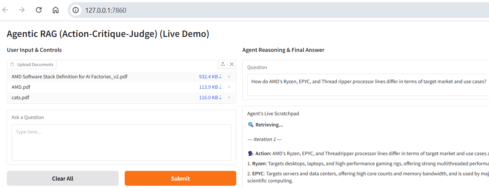
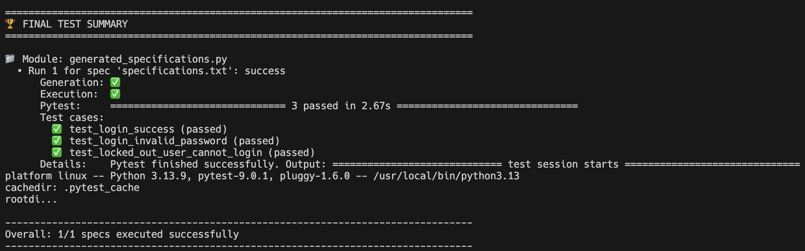

<!---
Copyright (c) 2026 Advanced Micro Devices, Inc. (AMD)

Permission is hereby granted, free of charge, to any person obtaining a copy
of this software and associated documentation files (the "Software"), to deal
in the Software without restriction, including without limitation the rights
to use, copy, modify, merge, publish, distribute, sublicense, and/or sell
copies of the Software, and to permit persons to whom the Software is
furnished to do so, subject to the following conditions:

The above copyright notice and this permission notice shall be included in all
copies or substantial portions of the Software.

THE SOFTWARE IS PROVIDED "AS IS", WITHOUT WARRANTY OF ANY KIND, EXPRESS OR
IMPLIED, INCLUDING BUT NOT LIMITED TO THE WARRANTIES OF MERCHANTABILITY,
FITNESS FOR A PARTICULAR PURPOSE AND NONINFRINGEMENT. IN NO EVENT SHALL THE
AUTHORS OR COPYRIGHT HOLDERS BE LIABLE FOR ANY CLAIM, DAMAGES OR OTHER
LIABILITY, WHETHER IN AN ACTION OF CONTRACT, TORT OR OTHERWISE, ARISING FROM,
OUT OF OR IN CONNECTION WITH THE SOFTWARE OR THE USE OR OTHER DEALINGS IN THE
SOFTWARE.
--->

# Solution Blueprints: Accelerating AI Deployment with AMD Enterprise AI

AMD Enterprise AI Suite standardizes the inference layer with AMD Inference Microservices (AIMs), a set of containers for optimized model serving on AMD Instinct™ GPUs with validated profiles and OpenAI-compatible APIs. However, production grade agentic and generative AI applications need more than inference endpoints. You need document loaders, embedding pipelines, vector databases, RAG logic, agent orchestration, and user interfaces. These components need to be wired together with proper Kubernetes resource definitions, GPU allocation, service discovery, and configuration management.
This blog walks through the technical implementation of Solution Blueprints: how they're structured, how they use Helm application charts for code reuse, and the patterns they demonstrate for multi-container orchestration. While the Enterprise AI Suite Overview covers the platform and the AIMs blog covers inference, this post focuses on application architecture and deployment patterns.

## What Are Solution Blueprints?

Solution Blueprints are reference implementations for deploying AI workloads on ROCm-powered AMD Instinct™ GPUs using Kubernetes. They provide developers with a ready‑to‑run starting point: each blueprint is a Helm chart that packages an application layer together with AMD Inference Microservices (AIMs) and demonstrates specific patterns for production-level AI deployment. Blueprints are pre‑integrated with AMD Enterprise AI Suite cluster services and install directly from an OCI registry with a single Helm command—no manual setup of GPU drivers, ROCm versions, or device plugins. Examples include a chat interface, a RAG pipeline, and agentic workflows. Instead of figuring out how to integrate LangChain with ChromaDB and configure GPU requests for tensor parallelism, you can examine a Solution Blueprint to see a working implementation, understand the architecture, and adapt it to your requirements.

### Modular Architecture

Solution Blueprints use a layered, composable architecture. Shared infrastructure is packaged as reusable Helm “application charts,” so solution charts can focus on domain logic instead of re‑implementing deployment concerns. Each blueprint is a standalone Helm chart that renders its own Kubernetes objects (Deployments/Services/Jobs). The aimchart-llm application chart is included as a dependency and provides a standardized LLM deployment (AIM containers, health probes, resources) plus a consistent set of AIM environment variables. There is also aimchart-embedding and aimchart-chromadb for use in RAG applications. The overview of the solution blueprints architecture can be seen in figure 1 below.



<em>Figure 1: System architecture overview.</em>

During `helm dependency build/update`, Helm fetches the subchart. At render/install time, the subchart’s templates are included automatically. Its values are scoped under `llm.*` and can be overridden via `values.yaml` or `--set` flags.
The Helm chart (or its dependency) can render additional Kubernetes resources for AIM apps such as `PersistentVolumeClaims` (referencing a `StorageClass`), Secrets for Hugging Face tokens, ConfigMaps, and more.

### Benefits of the Modular Approach

The application chart approach delivers practical advantages for building AI applications. Consistency emerges when blueprints depend on the same aimchart-llm chart. All blueprints deploy LLMs using identical Kubernetes resource patterns, eliminating configuration drifts. Centralized maintenance means improvements to GPU scheduling, storage configuration, or ROCm compatibility get applied across all blueprints by simply bumping the chart version.  This makes AI application development straightforward: create a new blueprint by declaring aimchart-llm as a dependency and focusing on your application logic (agent orchestration, RAG pipelines, UI code).
The architecture supports extension beyond LLMs. Developers can create application charts for vector databases (ChromaDB, Milvus), embedding services, or monitoring stacks and use them as dependencies in blueprints. Helm's composition model allows overriding specific chart outputs when needed. Complex architectures compose multiple charts, for example a RAG blueprint might depend on aimchart-llm, aimchart-embedding, and aimchart-vectordb. This modular foundation makes Solution Blueprints a development toolkit, not just reference examples.

## Solution Blueprints Catalog

The AMD Solution Blueprint catalog currently provides 7 production-ready AI deployment packages; each designed for specific use cases:

| Blueprint | Primary Function  | Key Technology | Default AIM |
| ----------- | :----------: | :----------: | :----------: |
| AutoGen-studio | Multi-agent orchestration | Microsoft AutoGen | Llama-3.3-70B |
| Continue.dev <br>coding assistant | Browser IDE <br>coding assistant | Code-server + <br>continue.dev | gpt-oss-20B <br>Qwen2.5-Coder-7B |
| LLM-chat | LLM evaluation & chat | OpenWebUI | User choice |
| Financial Stock <br>Intelligence (FSI) | Stock analysis | LangChain + <br>yfinance + Gradio | Llama-3.3-70B |
| Agentic Translation | Agentic translation | LangChain + <br>Streamlit | Llama-3.3-70B |
| Talk to your documents | RAG pipeline | ChromaDB + <br>Infinity embedding + <br>Gradio | Llama-3.3-70B |
| Agentic Testing | QA Software and <br>application testing | Pydantic AI + <br>Playwright MCP | Llama-3.3-70B |

These are built with a variety of tools to showcase the range of possible implementations using AIMs. The following sections provide more detailed descriptions of the blueprints.

## AutoGen Studio

The AutoGen Studio blueprint deploys Microsoft's AutoGen Studio for low-code multi-agentic workflows. The blueprint is pre-configured with the AMD Enterprise AI default gallery which includes agents and teams wired to the specified AIM.



<em>Figure 2: Web Surfer Team Architecture Web Surfer team comprises of two LLM agents (Web Surfer and Verification Assistant) plus a User Proxy for human feedback.</em>

The diagram shown in Figure 2, above, separates concerns into three layers:

+ User Interface Layer: AutoGen Studio Web UI, Agent designer, team builder, playground
+ Agent Orchestration Layer: Python/FastAPI backend, SQLite database, Agent state management, conversation routing
+ Inference layer: AIM LLM container, vLLM engine with tool calling, Llama-3.3-70B @ FP8 precision

## Continue.dev Coding Assistant

This blueprint is an AI pair programmer that integrates with your code editor. It uses Large Language Models (LLMs) to suggest code snippets, functions, and even entire modules as you type. The coding assistant is deployed with the code-server browser IDE application which is a service that enables running VS Code from the browser.
The Coding Assistant has multiple interaction modes:

+ Chat – conversational back-and-forth with the model.
+ Autocomplete – inline code completions and suggestions as you type.
+ Edit – making direct modifications to selected code (e.g. “refactor this function” or “convert to async”).
+ Agentic mode – higher-level planning and automation where the assistant can chain actions together (e.g. scaffold a project, set up dependencies, generate tests).

This solution blueprint consists of three parts: the open source code-server browser IDE application, its available extension Continue.dev and AIM LLMs deployed alongside it. There's optionally a separate AIM LLM for autocompletion. The architecture diagram can be seen in figure 3.



<em>Figure 3: The architecture of the Continue.dev Coding Assistant. This diagram omits the optional separate Autocompletion LLM.</em>

## LLM Chat

Runs a simple chatbot for safe initial LLM evaluation. It is using OpenWebUI, an open-source platform for web-based AI interactions.
Conversational testing provides a quick sanity check and reveals the model's capabilities and response characteristics. The LLM-Chat AIM Solution Blueprint facilitates this process, allowing you to:

+ Explore prompting techniques
+ Understand model behavior
+ Assess qualities that resist quantitative measurement

This hands-on evaluation is recommended before integrating the LLM into critical enterprise workflows or running standardized test suites.



<em>Figure 4: The architecture of the llm chat.</em>

## Financial Stock Intelligence (FSI)

This solution blueprint is a sophisticated financial analysis tool that combines real-time stock data, technical indicators, and Large Language Model (LLM) analysis to provide comprehensive stock insights. The system retrieves live market data through the Yahoo Finance API, ensuring users have access to up-to-the-minute pricing information for informed decision-making.
By integrating advanced AI capabilities with traditional technical analysis methods, the tool offers both quantitative metrics and qualitative interpretations of market conditions. The intuitive web-based interface makes complex financial analysis accessible to users of varying experience levels, while the incorporation of relevant financial news provides essential market context. This multi-faceted approach enables users to make more informed investment decisions by considering technical patterns, AI-generated insights, and current market sentiment simultaneously.

### Key Technologies of FSI

+ AIM: AMD Inference Microservice to serve LLM
+ Kubernetes application packaged with Helm charts.
+ LangChain: LLM orchestration and prompt management
+ yfinance: Real-time stock data
+ Gradio: Web interface
+ Pandas: Data manipulation
+ Matplotlib: Data visualization

### Technical Analysis

The blueprint performs technical analysis including

+ Simple Moving Average (SMA)
+ Relative Strength Index (RSI)
+ Momentum calculations assess the rate of price change to gauge the strength of current trends and predict potential reversals.
+ Price versus SMA comparisons highlight when current prices deviate from their moving averages, signaling potential buying or selling opportunities based on whether the stock is trading above or below its trend line.

### User interaction

Users can interact with the application through a Gradio-based web interface that displays historical data visualization with charts and graphs for trend analysis, see figure 5. The user enters the stock symbols they want to analyze (in this case AMD, PINS, F) in the top left field. Users can also select dates and investor type.



<em>Figure 5: The FSI web UI.</em>

There are three tabs showing the results:

+ The AI technical analysis,
+ Buy/sell/hold recommendations and
+ Stock graphs showing stock price for the selected period.

## Agentic Translation Agent

This translation blueprint illustrates how language translation can be implemented using AIMs. It is using agentic translation, employing multiple LLM agents working collaboratively where models critique, evaluate, and refine each other's outputs to improve the overall quality of the translation.
This blueprint follows a trilateral collaboration framework with an Action agent, Critique agent, and Judgment agent iteratively contributing to the translation task until the Judgment agent approves the output.

### Key Technologies of the Agentic Translation Agent

+ AIM: AMD Inference Microservice to serve LLM
+ Kubernetes application packaged with Helm charts.
+ LangChain: LLM orchestration and prompt management
+ Streamlit: provides the web-based user interface



<em>Figure 6: The user can enter source language and target language at the top. Under Modify prompts the user can also change the number of iterations that the agents are improving the translation. This can be useful if the translation is taking too long.</em>

## Talk to Your Documents

This blueprint deploys a Retrieval-Augmented Generation (RAG) application which allows you to talk to your documents. It uses a vector database (ChromaDB) to store document embeddings and a large language model (LLM) to answer questions based on the retrieved context.

### Key Technologies

+ Talk to your documents UI: The user interface for interacting with the RAG.
+ AIM: AMD Inference Microservice to serve LLM
+ Embedding model: An Infinity server deployment that hosts an embedding model to generate embeddings for documents.
+ ChromaDB vector store: A deployment with ChromaDB vector database to store document embeddings.


<em>Figure 7: The architecture of Talk to Your Documents.</em>


<em>Figure 8: The left panel allows users to upload documents and enter questions, while the right side displays the generated responses.</em>

## Agentic Testing

The agentic testing agent, also called quality assurance (QA) agent, is a blueprint designed to automate the process of testing, verifying, and validating software, data, or content. For example, it can run unit tests, integration tests, or end-to-end tests against an application. The blueprint adopts the Given–When–Then specification format, a widely used approach for expressing behavioural test scenarios. This structure improves clarity and ensures test cases remain accessible to both developers and non-technical stakeholders, such as QA professionals and product managers.
This blueprint tests login functionalities on a webpage using single-shot test generation. The user enters test specifications on the Given-When-Then format in the specifications.txt file. The test specifications include information such as the webpage URL, username, and password. Figure 9 shows the terminal output when running the blueprint.


<em>Figure 9: The output of the blueprint.</em>

+ Then the agent generates the test Python code based on the available tools provided by the MCP server (Playwright in this case).
+ Afterwards, it executes the tests and prints the results for each one. In this case, there are three login scenarios that are being tested; a successful login, an invalid login, and a locked out user account.
+ The test results are recorded in the logs, and the generated Python files are displayed in the console. These outputs may be preserved as artifacts or integrated into a continuous integration (CI) pipeline.

## Getting Started

Blueprints are packaged as OCI-compliant Helm charts in the Docker Hub registry, ready for immediate deployment on AMD Enterprise AI Suite clusters. The recommended approach to deploy them is to pipe the output of `helm template` to `kubectl apply -f -`.
The following is an example of a command-line deployment. This will create the needed deployments and services for the specific blueprint:

```bash
chart="aimsb-my-chart"
helm template $name oci://registry-1.docker.io/amdenterpriseai/$chart \
  | kubectl apply -f - -n $namespace
```

We don’t recommend `helm install`, which by default uses a Secret to keep track of the related resources. This does not work well with Enterprise clusters that often have limitations on the kinds of resources that regular users are allowed to create.
To deploy with already existing AIM deployment use:

```bash
name="my-deployment"
namespace="my-namespace"
chart="aimsb-my-chart"
servicename="aim-llm-my-model-123456"

helm template $name oci://registry-1.docker.io/amdenterpriseai/$chart \
  --set llm.existingService=$servicename \
  | kubectl apply -f - -n $namespace
```

## Summary

In this blog, we walked through AIMs Solution Blueprints and the transformation of complex AI deployments into streamlined, modular processes. By combining AMD Inference Microservices with pre-integrated application architectures, these blueprints provide developers with validated, production-ready starting points for diverse AI workloads—from multi-agent orchestration to specialized financial analysis tools.
The composable design, powered by Helm application charts, eliminates repetitive infrastructure configuration while maintaining flexibility for customization. One-command deployment on AMD Enterprise AI Suite clusters enables teams to move quickly from concept to production, focusing on application logic rather than orchestration details.
As organizations scale their AI initiatives on AMD Instinct™ GPUs, Solution Blueprints serve as both practical deployment templates and architectural guidance—accelerating development cycles and establishing best practices for ROCm-powered AI applications.

## Additional Resources

+ [Solution Blueprints GitHub Repository](https://github.com/amd-enterprise-ai/solution-blueprints)
+ [Solution Blueprints Homepage](https://enterprise-ai.docs.amd.com/en/latest/solution-blueprints/overview.html)

## Disclaimers

Third-party content is licensed to you directly by the third party that owns the content and is not licensed to you by AMD. ALL LINKED THIRD-PARTY CONTENT IS PROVIDED “AS IS” WITHOUT A WARRANTY OF ANY KIND. USE OF SUCH THIRD-PARTY CONTENT IS DONE AT YOUR SOLE DISCRETION AND UNDER NO CIRCUMSTANCES WILL AMD BE LIABLE TO YOU FOR ANY THIRD-PARTY CONTENT. YOU ASSUME ALL RISK AND ARE SOLELY RESPONSIBLE FOR ANY DAMAGES THAT MAY ARISE FROM YOUR USE OF THIRD-PARTY CONTENT.
