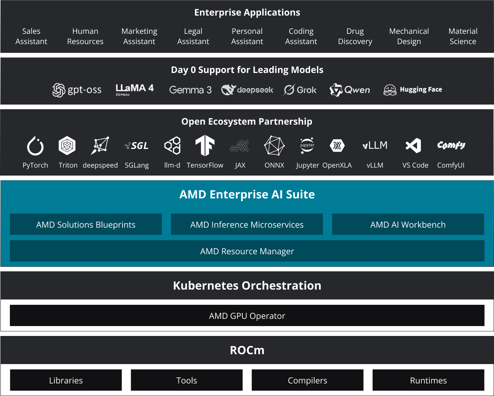
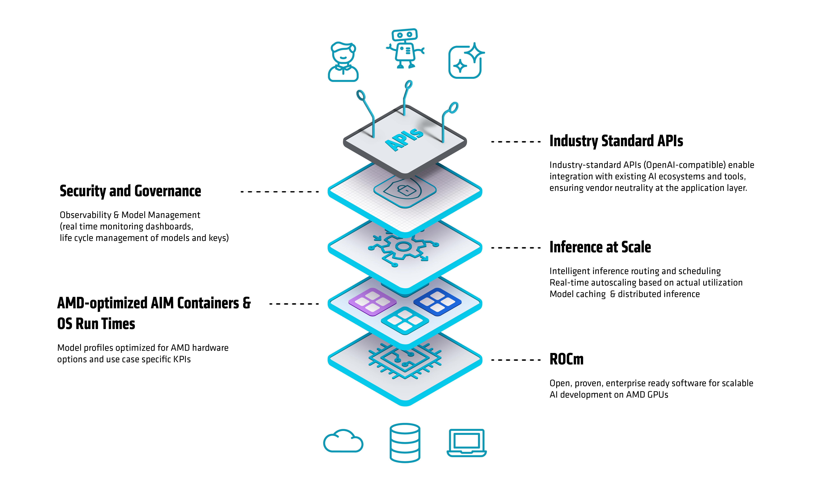
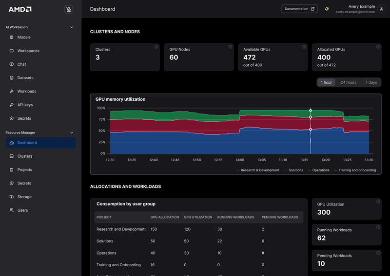
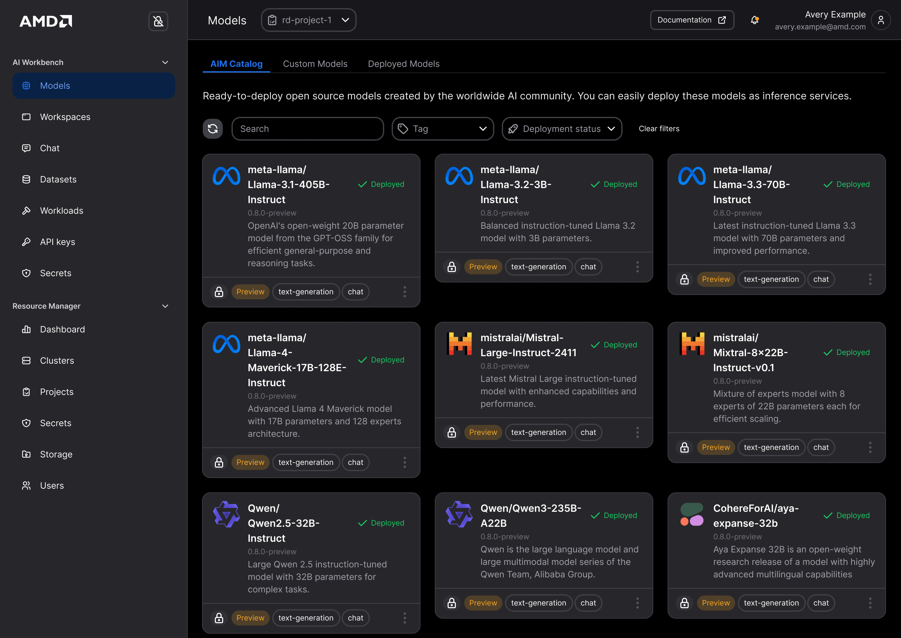

<!---
Copyright (c) 2025 Advanced Micro Devices, Inc. (AMD)

Permission is hereby granted, free of charge, to any person obtaining a copy
of this software and associated documentation files (the "Software"), to deal
in the Software without restriction, including without limitation the rights
to use, copy, modify, merge, publish, distribute, sublicense, and/or sell
copies of the Software, and to permit persons to whom the Software is
furnished to do so, subject to the following conditions:

The above copyright notice and this permission notice shall be included in all
copies or substantial portions of the Software.

THE SOFTWARE IS PROVIDED "AS IS", WITHOUT WARRANTY OF ANY KIND, EXPRESS OR
IMPLIED, INCLUDING BUT NOT LIMITED TO THE WARRANTIES OF MERCHANTABILITY,
FITNESS FOR A PARTICULAR PURPOSE AND NONINFRINGEMENT. IN NO EVENT SHALL THE
AUTHORS OR COPYRIGHT HOLDERS BE LIABLE FOR ANY CLAIM, DAMAGES OR OTHER
LIABILITY, WHETHER IN AN ACTION OF CONTRACT, TORT OR OTHERWISE, ARISING FROM,
OUT OF OR IN CONNECTION WITH THE SOFTWARE OR THE USE OR OTHER DEALINGS IN THE
SOFTWARE.
--->

# AMD Enterprise AI Suite: Open Infrastructure for Production AI

In this blog, you'll learn how to operationalize enterprise AI on AMD
Instinct™ GPUs using an open, Kubernetes-native software stack. AMD
Enterprise AI Suite provides a unified platform that integrates GPU
infrastructure, workload orchestration, model inference, and lifecycle
governance without dependence on proprietary systems. We begin by
outlining the end-to-end architecture and then walk through how each
component fits into production workflows: AMD Inference Microservice
(AIM) for optimized and scalable model serving, AMD Solution Blueprints
for assembling these capabilities into validated, end-to-end AI
workflows, AMD Resource Manager for infrastructure administration and
multi-team governance, and AMD AI Workbench for reproducible
development and fine-tuning environments. Together, these building
blocks show how to build, scale, and manage AI workloads across the
enterprise using an open, modular, production-ready stack.

The AMD Enterprise AI Suite is designed for enterprise teams operating
GPU infrastructure at scale, including Platform and Infrastructure teams
that require predictable performance and governance across multi-node
Instinct™ clusters; Data Scientists and ML Engineers who depend on
reliable, self-service compute and reproducible development workflows;
and Enterprise IT Leaders responsible for enforcing security, access
control, and utilization policies while supporting rapid AI adoption.

Its core capabilities center on an open, modular architecture where each
layer deploys independently via containers and Helm charts; a
Kubernetes-native design that integrates directly with enterprise DevOps
and MLOps pipelines; hardware-aware optimizations tuned for AMD CDNA™
architectures to maximize throughput and efficiency; unified
observability through consistent telemetry, metrics, and logging; and
enterprise security features such as RBAC, secrets management, and
governance controls.

As shown in Figure 1, AMD Enterprise AI Suite integrates several
foundational components that work together in production: AMD Inference
Microservice (AIM) for high-performance, scalable model serving, AMD
Solution Blueprints that provide validated generative and agentic AI
workflows based on open, reproducible reference architectures, AMD
Resource Manager for fine-grained resource governance, quotas, and
workload policy enforcement across teams, and AMD AI Workbench as a
unified environment for model development, fine-tuning, and managing
AIM-based deployments. Combined, these components create a cohesive,
production-ready AI stack engineered for performance, visibility, and
control across the enterprise.

Figure 1: AMD Enterprise AI Suite

## AMD Inference Microservices (AIMs): Production Ready Inference on AMD Instinct™ GPUs

**AMD Inference Microservices (AIMs)** provide a modular framework for
deploying and scaling inference workloads across heterogeneous clusters
of AMD Instinct™ accelerators. Built natively on **ROCm™** and
**Kubernetes**, AIMs abstract hardware complexity while maximizing GPU
utilization and throughput.

AIMs design principles focus on:

- **Ease of deployment** through standard APIs and containers.

- **Hardware-specific optimization** across AMD Instinct™ GPUs.

- **Scalability** from a single GPU to multi-node clusters.

- **Observability** with built-in metrics and health monitoring.

### Architecture Overview

AIMs simplify and accelerate inference on AMD Instinct™ by turning a
complex, manual setup into a one-command deployment of validated models.
They package validated profiles for AMD accelerators, delivering
predictable performance, scalability, and seamless integration with
open-source engines like vLLM. Figure 2 illustrates the AMD Inference
Microservice (AIM) architecture, showing how optimized model runtimes,
scalable serving layers, and Kubernetes-native orchestration integrate
to deliver high-throughput, production-grade inference on AMD Instinct™
GPUs.

Figure 2: AMD Inference Microservice (AIM) Architecture

AIMs implement a microservices-based control plane that manages the full
inference lifecycle:

1. **Runtime Initialization** Loads and validates containerized
    configurations

2. **Hardware Detection** Auto-discovers available AMD Instinct™ GPUs
    and health checks on each accelerator.

3. **Profile Selection** Matches model profiles to AMD Instinct™ GPUs
    (e.g., MI300X, MI325X) using validated performance templates.

4. **Execution Command Generation** Creates tuned runtime commands for
    tensor parallelism, precision (FP16, BF16, FP8), and communication
    optimizations.

5. **Open-Source Inference Engine** Support for popular open-source
    inference engines such as vLLM.

6. **Model Caching & Memory Management** Caches weights locally and
    dynamically manages GPU memory across sessions.

7. **Observability & Autoscaling** Exposes Prometheus-compatible
    metrics and scales pods through KServe autoscaling hooks.

AIMs expose OpenAI-compatible REST APIs, enabling immediate integration
with existing LLM applications, chat frameworks, or agentic
orchestration layers.

## AMD Solution Blueprints: Accelerated Agentic and Generative AI Architectures

AMD Solution Blueprints provide reference architectures that integrate
AIMs with orchestration, retrieval, and application logic, delivering
tested workflows for agentic and generative AI deployments. These
blueprints serve as starting points and customers are encouraged to
customize and extend them to fit specific use cases such as healthcare
record summarization or financial forecasting, adapting the validated
foundation to their own data, governance, and performance requirements.

### Technical Composition

An AMD Solution Blueprint typically includes:

- Containerized AIMs module for serving inference workloads.

- Data connectors for integrating enterprise knowledge bases or document
  stores.

- Retrieval-Augmented Generation (RAG) pipelines, including vector
  stores and embedding services.

- Agent orchestration frameworks.

- Monitoring & governance hooks for integration with AMD AI Workbench
  and AMD Resource Manager.

### Initial Blueprints

#### Agentic Translation

- Agentic machine translation pipeline with document ingestion and
  chunking for long-context document-level translation.

- Incorporates arbitrary instructions for the translation, enabling
  enterprise rules and tone compliance.

#### LLM Chat Sandbox

- Modular playground for evaluating model behavior and prompt
  engineering.

- Includes plug-in interfaces for custom retrieval modules and
  telemetry.

#### Local LLM Assistant for IDE

- Embeds AIMs powered LLMs in developer IDEs.

- Supports context-aware suggestions, documentation generation, and
  inline code refactoring.

#### Financial Stock Intelligence

- A financial analysis tool that combines real-time stock data and
  technical indicators using an LLM to provide comprehensive stock
  insights.

- Includes information from recent news, sustainability scores, and
  analyst recommendations.

#### AutoGen Studio Agentic Platform

- Create and configure AI agents with specific roles, personalities, and
  capabilities through a web interface.

- Design complex conversation flows between multiple agents working
  collaboratively.

- Seamless connection to AIMs for powering agent conversations.

- View and debug agent conversations as they happen.

- Pre-configured with a WebSurfer Agent Team ready for product
  comparison tasks.

### Ecosystem & Infrastructure

These blueprints are part of AMD broader ecosystem, where we collaborate
with systems integrators, cloud and hardware partners, model developers,
and tool providers to bring greater scalability and compatibility to
developers everywhere.

Whether you deploy AMD certified systems in edge locations or in the
cloud, AMD Solution Blueprints are infrastructure agnostic, but
performance tuned for AMD hardware.

## AMD Resource Manager: Cluster, Policy, and Governance Control Plane

In large-scale AI operations, managing compute clusters, allocating
quotas, controlling user access, and monitoring resource utilization all
become complex and mission critical. Figure 3 shows the AMD Resource
Manager interface, which provides a unified control plane that simplifies
these tasks and centralized AI infrastructure governance.

Figure 3: AMD Resource Manager User Interface

### Key Capabilities

#### 1. Cluster & Infrastructure Visibility

AMD Resource Manager delivers a unified cluster overview dashboard that
provides real-time insights into cluster health, utilization, and
capacity. Infrastructure administrators can seamlessly add, monitor, and
manage on-prem and cloud compute clusters from a single intuitive
console.

#### 2. Workloads & Quotas Management

Gain clear visibility into active workloads, and resource consumption
bottlenecks. AMD Resource Manager simplifies project governance with
built-in tools to create projects, define quotas, and enforce scheduling
policies, ensuring fair and efficient use of compute resources across
teams.

#### 3. User & Role Management

Empower teams with secure, role-based access. AMD Resource Manager
enables administrators to create users, assign roles, integrate SSO, and
manage invitations from a centralized interface.

#### 4. Secrets & Access Control

Protect sensitive data with centralized management of credentials, API
keys, and secrets. AMD Resource Manager enforces fine-grained access
controls to help enterprises maintain security and compliance.

AMD Resource Manager ensures that compute resources are always used
efficiently, predictably, and securely, which is critical for multi-team
/ multi-tenant enterprise environments.

By integrating with AMD's broader AI platform ecosystem, AMD Resource
Manager helps organizations:

- Govern compute clusters and infrastructure at scale.

- Manage user roles and projects, including quotas and access.

- Track workloads and monitor utilization across clusters.

- Simplify setup for AI teams via templated workflows and pre-configured
  environments.

- Ensure that infrastructure investment is optimized, and AI workloads
  don't get bottlenecked by resource constraints.

## AMD AI Workbench: AIMs Management UI, AI Developer Tooling and Workspaces

AMD AI Workbench is a unified interface to manage, develop, fine-tune, and
deploy AI workloads at scale. As shown in Figure 4, the Workbench interface
offers AI practitioners and data scientists a cohesive environment that
streamlines the full AI lifecycle from experimentation to deployment.

Figure 4: AMD AI Workbench Interface

### Key Capabilities in AMD AI Workbench

#### 1. AIMs Catalog

The AIMs catalogue is onboarded to the AI Workbench and the user can
browse, deploy and interact with AIMs. API key management allows sharing
the deployed AIMs inference API with external users and applications and
monitor the utilization.

#### 2. AI Workspaces

Launch pre-configured development workspaces optimized for AMD compute
to accelerate experimentation. Select the desired amount of GPU resources,
targeted base image and deploy e.g. VScode or JupyterLab to get started
with development on AMD GPUs.

#### 3. Training & Fine-Tuning

Customize base models with your own data to address specific enterprise
use cases. Choose between a low code UI with pre-set hyperparameters
"recipes" created by AMD AI experts or take advantage of a larger
selection for the expert users of reference AI workloads for Kubernetes
CLI.

#### 4. Chat & Compare

Interactively test AIMs and custom models through a chat interface and
compare outputs side-by-side to quickly get a gist of performance.

#### 5. GPU-as-a-Service

Enable teams to self-provision GPU resources while administrators retain
control through quotas and governance.

As AI adoption accelerates, the development, governance, and deployment
of models become increasingly complex. AMD AI Workbench simplifies these
challenges by:

- Providing a single interface to manage the full AI lifecycle, from
  model exploration to deployment.

- Ensuring developer productivity with ready-to-use workspaces and
  curated model assets.

- Delivering resource control & scalability, allowing organizations to
  manage compute, teams, and budgets without bottlenecks.

- Enabling rapid iteration, offering both GUI and CLI access so data
  scientists can experiment quickly while platform teams maintain
  governance.

## Summary

This blog outlined how the AMD Enterprise AI Suite delivers a unified,
open, and performance-optimized foundation for running AI workloads on
AMD Instinct™ GPUs. You saw how AMD Inference Microservice (AIM)
delivers optimized model serving, how AMD Solution Blueprints provide
validated workflow patterns, how AMD Resource Manager enforces
multi-team governance, and how AMD AI Workbench enables reproducible
development, together forming a unified, production-ready AI stack.
These components enable enterprise teams to accelerate the path from
prototype to production, whether deploying multi-node LLM inference,
building agentic pipelines, or operating large GPU fleets with
predictable performance and control.

Looking ahead, the team will continue expanding reference architectures,
adding new AIM model profiles, extending governance capabilities in
Resource Manager, and delivering deeper integrations across the suite.
For a deeper look at the inference layer introduced here, see the
companion [AMD Inference Microservice (AIM) blog](https://rocm.blogs.amd.com/artificial-intelligence/enterprise-ai-aims/README.html).
Future posts will build on both blogs with additional guidance, best
practices, and validated designs to help enterprises scale AI
confidently on AMD hardware.

## Get Started

- Visit the
  [AMD Enterprise AI Suite Documentation site](https://enterprise-ai.docs.amd.com/en/latest/)

- **AMD Inference Microservices (AIMs)**: AIMs are open-source and
  available now. Developers can start deploying optimized inference
  workloads on AMD Instinct™ GPUs: [AIMs catalog](https://enterprise-ai.docs.amd.com/en/latest/aims/catalog/models.html).
- **AMD Solution Blueprints**: visit the [AMD
  Solution Blueprints catalog](https://enterprise-ai.docs.amd.com/en/latest/solution-blueprints/catalog/blueprints.html) and download reference code and
  documentation.

- Install the [**AMD Resource Manager** and **AMD AI Workbench**](
  https://enterprise-ai.docs.amd.com/en/latest/platform-infrastructure/supported-environments.html).

- Visit the [**AMD Enterprise AI Suite** product page](https://www.amd.com/en/products/software/enterprise-ai-suite.html)

- Visit the [**AMD Enterprise AI Suite** developer page](https://www.amd.com/en/developer/resources/enterprise-ai-suite.html)

## Disclaimers

Third-party content is licensed to you directly by the third party that owns the
content and is not licensed to you by AMD. ALL LINKED THIRD-PARTY CONTENT IS
PROVIDED “AS IS” WITHOUT A WARRANTY OF ANY KIND. USE OF SUCH THIRD-PARTY CONTENT
IS DONE AT YOUR SOLE DISCRETION AND UNDER NO CIRCUMSTANCES WILL AMD BE LIABLE TO
YOU FOR ANY THIRD-PARTY CONTENT. YOU ASSUME ALL RISK AND ARE SOLELY RESPONSIBLE
FOR ANY DAMAGES THAT MAY ARISE FROM YOUR USE OF THIRD-PARTY CONTENT.
