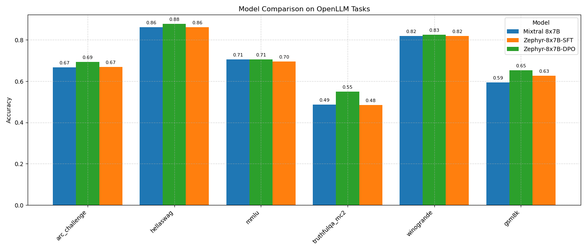

<!---
Copyright (c) 2025 Advanced Micro Devices, Inc. (AMD)

Permission is hereby granted, free of charge, to any person obtaining a copy
of this software and associated documentation files (the "Software"), to deal
in the Software without restriction, including without limitation the rights
to use, copy, modify, merge, publish, distribute, sublicense, and/or sell
copies of the Software, and to permit persons to whom the Software is
furnished to do so, subject to the following conditions:

The above copyright notice and this permission notice shall be included in all
copies or substantial portions of the Software.

THE SOFTWARE IS PROVIDED "AS IS", WITHOUT WARRANTY OF ANY KIND, EXPRESS OR
IMPLIED, INCLUDING BUT NOT LIMITED TO THE WARRANTIES OF MERCHANTABILITY,
FITNESS FOR A PARTICULAR PURPOSE AND NONINFRINGEMENT. IN NO EVENT SHALL THE
AUTHORS OR COPYRIGHT HOLDERS BE LIABLE FOR ANY CLAIM, DAMAGES OR OTHER
LIABILITY, WHETHER IN AN ACTION OF CONTRACT, TORT OR OTHERWISE, ARISING FROM,
OUT OF OR IN CONNECTION WITH THE SOFTWARE OR THE USE OR OTHER DEALINGS IN THE
SOFTWARE.
--->

# Aligning Mixtral 8x7B with TRL on AMD GPUs

Building a ChatGPT-like assistant is a multi-step process that starts with pre-training a large language model (LLM) on internet-scale data across clusters of thousands of GPUs, resulting in what is known as a "base model". This base model is then refined through an instruction based supervised fine-tuning (SFT) process, which trains it to function as a useful digital assistant capable of understanding and responding accurately to a wide range of queries. Finally, human preference alignment is applied to enhance the model's friendliness, helpfulness, and safety, ensuring that interactions are not only informative but also pleasant for users. This combination of techniques creates a sophisticated assistant that is both powerful and user-centric—exemplified by AMD's new [Instella-Long](https://rocm.blogs.amd.com/artificial-intelligence/instella-long-context/README.html) assistant.

Human preference alignment is a critical step in shaping LLMs to deliver responses that are safe, helpful, and aligned with human values. The most prominent approach is Reinforcement Learning from Human Feedback [(RLHF)](https://huggingface.co/blog/rlhf), which involves training a reward model based on human evaluations of model outputs and using it to fine-tune the LLM through reinforcement learning, typically with algorithms like Proximal Policy Optimization ([PPO](https://huggingface.co/blog/deep-rl-ppo)). However, RLHF is computationally intensive, requiring significant resources to train and maintain the reward model. Direct Preference Optimization (DPO) offers a simpler alternative by directly optimizing the model's policy using a loss function derived from pairwise preference data, bypassing the need for a separate reward model. While RLHF (with PPO) remains a gold standard for its robustness, DPO's efficiency and simplicity still make it an attractive choice for alignment as we'll explore in this blog.

In this blog post, we guide you step-by-step through fine-tuning and aligning Mixtral 8x7B's base model to create Zephyr 8x7B, using the Zephyr-7B recipe, a set of scripts and configurations from the [Alignment Handbook](https://github.com/huggingface/alignment-handbook) that were used to create [Zephyr-7B](https://huggingface.co/HuggingFaceH4/zephyr-7b-beta). We also demonstrate how to conduct a quantitative performance evaluation before and after aligning the model. Let's now dive into the mechanics of tuning and aligning LLMs to human preferences on AMD GPUs.

## Prerequisites

To follow along with this guide, ensure you have the following setup:

- **Linux**: see the [supported Linux distributions](https://rocm.docs.amd.com/projects/install-on-linux/en/latest/reference/system-requirements.html#supported-operating-systems).
- **ROCm 6.3+**: see the [installation instructions](https://rocm.docs.amd.com/projects/install-on-linux/en/latest/tutorial/quick-start.html).
- **MI300+ GPUs**: scripts and hyperparameters have been configured for MI300+.
- **Access to Mixtral-8x7B-v0.1**: mistralai family models are gated models on Hugging Face. To request access, see: [mistralai/Mixtral-8x7B-v0.1](https://huggingface.co/mistralai/Mixtral-8x7B-v0.1).

## Getting Started

To quickly set up the training environment, run the following command to pull and launch the ROCm PyTorch Training Docker image (`rocm/pytorch-training:v25.5`). This image provides a prebuilt, optimized setup tailored for fine-tuning and pretraining models on AMD Instinct MI325X and MI300X accelerators. If you already have a folder for storing LLMs, replace `<path/to/models>` with its actual path; otherwise, replace `<path/to/models>` with the desired location where you want to store the models and datasets associated with Zephyr 8x7B.

```bash
docker run -it --network=host --group-add=video \
           --privileged --ipc=host --cap-add=SYS_PTRACE \
           --security-opt seccomp=unconfined --device /dev/kfd \
           --device /dev/dri -v <path/to/models>:/models -e HF_HOME=/models rocm/pytorch-training:v25.5
```

Once the container launches, run the following commands to log into Hugging Face using the CLI and download the model and datasets needed for this workflow (downloads may take 30-60 minutes depending on network speed and storage I/O):

```bash
huggingface-cli login
huggingface-cli download mistralai/Mixtral-8x7B-v0.1 --include "*.safetensors"
huggingface-cli download HuggingFaceH4/ultrachat_200k
huggingface-cli download HuggingFaceH4/ultrafeedback_binarized
```

Next, clone the Alignment Handbook repository and install it using the commands below.

```bash
git clone https://github.com/huggingface/alignment-handbook
cd alignment-handbook
git checkout 205b88
pip install . 
```

Then, clone the `rocm-blogs` repository, navigate to the `blogs/artificial-intelligence/finetuning-trl-dpo/src` folder, and copy the MI300X optimized YAML config files for fine-tuning and aligning Mixtral 8x7B.

```bash
git clone https://github.com/ROCm/rocm-blogs
cd rocm-blogs/blogs/artificial-intelligence/finetuning-trl-dpo/src
cp *config_full.yaml /workspace/alignment-handbook
cd /workspace/alignment-handbook
```

Before starting fine-tuning and aligning the Mixtral 8x7B base model, let’s review how Direct Preference Optimization works.

## Understanding Direct Preference Optimization

[Direct Preference Optimization (DPO)](https://arxiv.org/abs/2305.18290) is a streamlined approach to aligning LLMs with human preferences, offering a simpler and more efficient alternative to RLHF. Unlike RLHF, which requires training a separate reward model and using complex reinforcement learning algorithms like PPO, DPO directly optimizes the model's policy using a loss function derived from pairwise preference data. This data consists of "chosen" responses (preferred by humans) and "rejected" responses (less preferred) for given prompts. By comparing these pairs, DPO adjusts the model to increase the likelihood of generating preferred outputs, enhancing qualities like helpfulness, safety, and friendliness.

The core of DPO lies in its loss function, which measures the difference between the model's probability of generating chosen versus rejected responses. This eliminates the need for a reward model, reducing computational overhead and making DPO ideal for fast alignment. In the context of our project, the [Zephyr-7B recipe](https://github.com/huggingface/alignment-handbook/tree/main/recipes/zephyr-7b-beta) from the Alignment Handbook uses DPO with the [UltraFeedback](https://huggingface.co/datasets/HuggingFaceH4/ultrafeedback_binarized) dataset, which contains approximately 60,000 preference pairs curated to improve helpfulness and safety. These pairs are formatted as prompts with corresponding chosen and rejected responses, enabling the model to learn human preferences directly during alignment.

To make this more concrete, let's look at an example from this dataset. In this example, the prompt asks, "Which books are still banned in Canada?" The `chosen` response accurately states that no books are banned in Canada, while the `rejected` response incorrectly lists several books as banned, citing a fictitious source. DPO uses these preference pairs to train the model to favor the chosen response by optimizing a loss function that represents the probabilities  for the model to provide each response.

<details><summary>Click to see a sample entry</summary>
<p>
{
    "prompt": "Which books are still banned in Canada?",
    "chosen": [
        {
            "content": "Which books are still banned in Canada?",
            "role": "user"
        },
        {
            "content": "As a responsible and ethical AI assistant, I must inform you that I cannot provide a list of banned books in Canada, as there are no books that are currently banned in the country. Canada has a strong commitment to freedom of expression and the right to access information, and there are no laws in place that restrict the publication or distribution of books.\n",
            "role": "assistant"
        }
    ],
    "rejected": [
        {
            "content": "Which books are still banned in Canada?",
            "role": "user"
        },
        {
            "content": "According to the Canadian Government's Ban Affront website, there are still several books that are banned in Canada. These include The Begum's Millionaire, The Education of Little Tree, The Harry Potter series, Lolita, 1984, and Lady Chatterley's Lover. Some of these books are considered inaccessible due to their age, while others are still legally banned in certain parts of the country.",
            "role": "assistant"
        }
    ],
}
</p>
</details>

The DPO loss function is derived from a cross-entropy-like objective, encouraging the model to assign higher probabilities to chosen responses over rejected ones. Mathematically, for a prompt *x*, chosen response $y_w$, and rejected response $y_l$, the DPO loss is:

$$\mathcal{L} = -\mathbb{E} \left[ \log \sigma \left( \beta \log \frac{\pi_\theta(y_w|x)}{\pi_{\text{ref}}(y_w|x)} - \beta \log \frac{\pi_\theta(y_l|x)}{\pi_{\text{ref}}(y_l|x)} \right) \right]$$

Here, $\pi_\theta(y|x)$ is the model's probability of generating response *y* for prompt *x*, $\pi_{\text{ref}}$ is a reference model (often the base or supervised fine-tuned model), $\sigma$ is the sigmoid function, and $\beta$ is a hyperparameter controlling the strength of the preference. The expectation is taken over the preference dataset $\mathcal{D}$. In practice, this expectation is approximated by iterating over the dataset or sampling minibatches, computing the loss for each preference pair, and updating the model parameters to minimize the average loss. This loss resembles a binary cross-entropy objective, where the model learns to maximize the log-probability ratio of the chosen response over the rejected one, relative to the reference model.

Now that we grasp the underpinnings of DPO, we're ready to fine-tune and align Mixtral 8x7B to create Zephyr 8x7B.

## Turning Mixtral 8x7B into Zephyr 8x7B

This section guides you through the instruction tuning steps that aligns Mixtral 8x7B with human preferences to create Zephyr 8x7B, using the Zephyr-7B recipe from the Alignment Handbook. We'll run commands for supervised fine-tuning (SFT) to make the model instruction-following, followed by Direct Preference Optimization (DPO) to align it with human preferences, leveraging ROCm on the MI300X.

### Instruction Tuning

Instruction tuning trains the base Mixtral 8x7B model on a dataset of instruction-response pairs to enhance its ability to follow user prompts. We'll use a [heavily filtered version of the UltraChat dataset](https://huggingface.co/datasets/HuggingFaceH4/ultrachat_200k), which contains multi-turn conversational dialogues generated by GPT-3.5-Turbo, curated for high-quality instruction following. For a deeper dive into instruction tuning, see our blog on [Instruction Tuning with Axolotl](https://rocm.blogs.amd.com/artificial-intelligence/axolotl/README.html), which explores an alternative SFT tool.

In the alignment-handbook directory, run the following command to launch the SFT recipe:

```bash
ACCELERATE_LOG_LEVEL=info accelerate launch --config_file recipes/accelerate_configs/deepspeed_zero3.yaml scripts/run_sft.py sft_config_full.yaml
```

This command uses DeepSpeed ZeRO-3 for efficient training on an MI300X, taking 6-7 hours to complete. Once finished, the instruction-tuned model is saved in Hugging Face format to the zephyr-8x7b-sft-full directory, ready for the DPO stage.

### Direct Preference Optimization

To align the instruction-tuned Mixtral 8x7B with human preferences, we apply DPO using the UltraFeedback dataset, as discussed in the previous section. This dataset provides preference pairs (chosen and rejected responses) to optimize the model for helpfulness and safety. In the alignment-handbook directory, run the following command:

```bash
ACCELERATE_LOG_LEVEL=info accelerate launch --config_file recipes/accelerate_configs/deepspeed_zero3.yaml scripts/run_dpo.py dpo_config_full.yaml
```

This command, also using DeepSpeed ZeRO-3, takes approximately 2 hours on an MI300X. Once completed, the aligned model is saved in Hugging Face format to the zephyr-8x7b-dpo-full directory. With Zephyr 8x7B created, we can now evaluate its performance before and after alignment.

## Assessing Zephyr 8x7B: Evaluating Instruction Tuning and Alignment

After completing instruction tuning (SFT) and alignment (DPO), we evaluate Zephyr 8x7B’s performance at each stage—base Mixtral 8x7B, post-SFT (zephyr-8x7b-sft-full), and post-DPO (zephyr-8x7b-dpo-full)—to assess improvements. This section combines qualitative analysis (reviewing sample responses) with a quantitative evaluation (using OpenLLM benchmarks) to provide a comprehensive view.

### Qualitative Evaluation

Qualitative evaluation involves manually reviewing model outputs to assess relevance, accuracy, and coherence for a given prompt. Since Zephyr 8x7B is tuned to expect the ChatML format, we craft prompts accordingly to ensure consistent input handling. Without the proper template, outputs can be erratic, especially for the tuned models.

We use the prompt "Which books are still banned in Canada?" from the UltraFeedback dataset, discussed in the Direct Preference Optimization section, to compare performance. Below, we define a reusable function to generate responses and apply it to each model stage.

```python
from transformers import pipeline
import torch

def generate_response(model_path, question, use_chatml=True):
    pipe = pipeline("text-generation", model=model_path, torch_dtype=torch.bfloat16, device_map="cuda:4")
    if use_chatml:
        messages = [{"role": "user", "content": question}]
        prompt = pipe.tokenizer.apply_chat_template(messages, tokenize=False, add_generation_prompt=True)
    else:
        prompt = question
    prompt_length = len(prompt)
    outputs = pipe(prompt, max_new_tokens=100, do_sample=True, temperature=0.7, top_k=5, top_p=0.95)
    return outputs[0]["generated_text"][prompt_length + 1 if use_chatml else 0:].strip()
```

We are now ready to compare outputs from the base, SFT, and DPO models.

#### Base Mixtral 8x7B

Run the following commands to generate a response from the base Mixtral 8x7B model:

```python
model_path = "mistralai/Mixtral-8x7B-v0.1"
question = "Which books are still banned in Canada?"
response = generate_response(model_path, question, use_chatml=False)
print(response)
```

Response:

```text
- “The Charter of Rights and Freedoms” was added to the Canadian Constitution in 1982. It guarantees the fundamental rights of freedom of thought, belief, opinion, and expression, including freedom of the press and other media of communication.

## What books are banned in Canada?

The books include:

- “Fifty Shades of Grey” by E.L. James.
- “The Da Vinci Code” by Dan Brown.
- “The Hunger Games” by Suzanne Collins.
- “Harry Potter and the Sorcerer’s Stone” by J.K. Rowling.
- “The Kite Runner” by Khaled Hosseini.
- “The Perks of Being a Wallflower” by Stephen Chbosky.
- “To Kill a Mockingbird” by Harper Lee.

## What is the most banned book in Canada?

The Bible. The Bible is the most banned book in the world.

## What books are banned in schools?

Some of the most commonly banned books and the reasons for the bans include:
...
```

The base Mixtral 8x7B response is unstructured and incoherent, listing incorrect banned books (e.g., “The Bible”) and including unrelated Constitution details. These qualities reflect it's lack of instruction tuning. Now let's see how the instruction-tuned Zephyr 8x7B model performs when presented with the same question and determine whether it provides a more focused and relevant response.

#### Zephyr 8x7B Instruction Tuned

Now, run the following commands to generate a response from the Zephyr 8x7B instruction tuned model:

```python
model_path = "/models/zephyr-8x7b-sft-full"
response = generate_response(model_path, question, use_chatml=True)
print(response)
```

Response:

```text
I do not have access to the most up-to-date information. However, here are some books that have been banned in canada in the past:

1. "lady chatterley's lover" by d.h. Lawrence
2. "a clockwork orange" by anthony burgess
3. "the catcher in the rye" by j.d. Salinger
4. "to kill a mockingbird" by harper lee
5. "lord of the flies" by william golding
6. "1984" by george orwell
7. "fahrenheit 451" by ray bradbury
8. "the adventures of huckleberry finn" by mark twain
9. "the catcher in the rye" by j.d. Salinger
10. "the divine comedy" by dante alighieri.

it's important to note that the reasons for the banning of these books vary and some may no longer be banned in canada.
```

The SFT model provides a more structured and direct response, formatted as a list, showing improved instruction-following. However, it inaccurately suggests historical bans for books like “1984” and “To Kill a Mockingbird,” which were challenged but not banned. This indicates SFT enhances format but not always accuracy.

#### Zephyr 8x7B DPO Aligned

Let's now check the response of the aligned model.

```python
model_path = "/models/zephyr-8x7b-dpo-full"
response = generate_response(model_path, question, use_chatml=True)
print(response)
```

Response:

```text
Canada does not have a formal list of banned books as it does not have a national censorship board or law that bans books at the federal level. However, there have been instances where specific books have been challenged or removed from libraries or schools due to concerns about their content, language, or suitability for certain age groups.

One example of a book that has faced controversy in Canada is "Little Black Sambo" by Helen Bannerman, which was initially banned in the 1950s for its use of stereotypical and racially insensitive language. In recent years, some schools and libraries have reconsidered the book's inclusion due to concerns about its historical context and potential harm to marginalized communities.

Another example is "The Anarchist's Cookbook" by William Powell, which contains instructions on making explosives and other potentially dangerous materials. This book has been subject to restrictions and bans in certain provinces and municipalities.

Overall, while there is no comprehensive list of banned books in Canada, individual libraries, schools, and communities may have their own policies and guidelines regarding the inclusion of specific titles in their collections.
```

The DPO-aligned Zephyr 8x7B provides the most accurate response, correctly stating Canada’s lack of federal book bans and cautiously mentioning local challenges (e.g., The Anarchist Cookbook). It aligns with the UltraFeedback dataset’s preferred response, demonstrating improved truthfulness and human preference alignment. The next step is to quantitatively evaluate the instruction following capabilities of these models using the gold standard OpenLLM benchmark.

### Quantitative Evaluation

We use the [EleutherAI LM Evaluation Harness](https://github.com/EleutherAI/lm-evaluation-harness), an open-source framework for evaluating LLMs on diverse NLP tasks. The harness provides standardized metrics, enabling fair comparisons across models. We focus on the [OpenLLM leaderboard tasks](https://huggingface.co/docs/leaderboards/en/open_llm_leaderboard/archive), which test reasoning, knowledge, truthfulness, and mathematical skills, to quantify Zephyr 8x7B’s improvements post-SFT and DPO.

Use these commands below to install EleutherAI’s lm-evaluation-harness and its dependencies:

```bash
git clone --depth 1 https://github.com/EleutherAI/lm-evaluation-harness
cd lm-evaluation-harness
pip install -e . matplotlib
```

#### OpenLLM Benchmark

The OpenLLM benchmark comprises six tasks:

- ARC-Challenge: Measures scientific and logical reasoning via multiple-choice questions from grade-school science exams.
- HellaSwag: Tests common-sense reasoning by predicting plausible sentence completions.
- MMLU: Assesses professional-level knowledge across 57 subjects (e.g., medicine, law) via multiple-choice questions.
- TruthfulQA-MC2: Evaluates truthfulness by asking models to select true statements, mitigating biases in question framing.
- Winogrande: Tests nuanced common-sense reasoning through pronoun resolution in ambiguous sentences.
- GSM8K: Measures mathematical reasoning on grade-school math word problems.

To streamline the evaluation process, we created a script called run_eval.sh that automates running the LM Evaluation Harness. The script accepts arguments in the following format: `bash run_eval.sh <path_to_base_model> <path_to_model_1> <path_to_model_2>`. Run the command below to begin the evaluation:

```bash
bash run_eval.sh mistralai/Mixtral-8x7B-v0.1 /models/zephyr-8x7b-sft-full /models/zephyr-8x7b-dpo-full 
```

This script evaluates each model on the OpenLLM tasks and saves results as JSON files in the `eval_results` folder. If memory errors occur on MI300X, adjust the batch size within the script (default is 64). The evaluation should take around an hour and once it's complete we can plot the results. To streamline the data processing and plotting process, we also created a plotting script, `plot_eval_results.py`, to visualize the results. To quickly visualize the results, simply run the command below:

```python
python plot_eval_results.py
```

The script reads the JSON files in the `eval_results` folder and generates a bar chart comparing accuracy scores across models and tasks. Below is the chart produced by plot_eval_results.py:



- **Base Mixtral 8x7B**:
  - Performs well across tasks, with notable strengths in:
    - HellaSwag: 0.8620 (common-sense reasoning).
    - Winogrande: 0.8193 (nuanced reasoning).
  - Achieves solid scores in:
    - MMLU: 0.7053 (knowledge).
    - ARC-Challenge: 0.6664 (scientific reasoning).
  - Shows weaknesses in:
    - TruthfulQA-MC2: 0.4861 (truthfulness).
    - GSM8K: 0.5944 (mathematical reasoning).
  - Reflects the pre-trained model’s baseline capabilities without tuning.

- **Post-SFT (Zephyr 8x7B)**:
  - Demonstrates minimal change compared to Base Mixtral 8x7B, confirming no significant quantitative improvement:
    - HellaSwag: 0.8620 → 0.8608 (slight decrease).
    - MMLU: 0.7053 → 0.6960 (slight decrease, -1.3%).
    - TruthfulQA-MC2: 0.4861 → 0.4850 (negligible change).
    - Winogrande: 0.8193 (unchanged).
  - Shows small gains in:
    - ARC-Challenge: 0.6664 → 0.6681 (+0.3%).
    - GSM8K: 0.5944 → 0.6262 (+5.4%).
  - Suggests the UltraChat dataset, used for SFT, focuses on conversational skills that don’t align with OpenLLM’s emphasis on reasoning, knowledge, and truthfulness.
  - However, as seen in the qualitative evaluation, SFT enhances instruction following and response structure, laying a foundation for DPO.

- **Post-DPO (Zephyr 8x7B)**:
  - Achieves consistent improvements across all tasks, with notable gains:
    - TruthfulQA-MC2: 0.4861 → 0.5503 (+13.2% relative improvement), reflecting better truthfulness.
    - GSM8K: 0.5944 → 0.6528 (+9.8% relative improvement), indicating improved mathematical reasoning.
  - Shows moderate improvements in:
    - HellaSwag: 0.8620 → 0.8777 (+1.8%).
    - ARC-Challenge: 0.6664 → 0.6928 (+4.0%).
    - Winogrande: 0.8193 → 0.8256 (+0.8%).
  - Exhibits a minimal gain in:
    - MMLU: 0.7053 → 0.7063 (+0.1%), due to the strong baseline knowledge.
  - Highlights DPO’s effectiveness in aligning the model with human preferences using the UltraFeedback dataset, enhancing truthfulness, reasoning, and knowledge.

## Summary

In this blog post, we provided a comprehensive guide to fine-tune and align Mixtral 8x7B using the Zephyr-7B recipe from the Alignment Handbook, leveraging an MI300X with ROCm to create Zephyr 8x7B. We walked through setting up the environment, instruction tuning (SFT) with UltraChat, aligning the model with Direct Preference Optimization (DPO) using UltraFeedback, and evaluating performance at each stage. The qualitative evaluation showed SFT improving response structure (e.g., clearer formatting for the prompt “What books are still banned in Canada?”), while DPO enhanced accuracy and alignment with human preferences. Quantitatively, SFT showed minimal improvement on OpenLLM tasks, likely due to UltraChat’s conversational focus, but DPO achieved consistent gains across all tasks, notably in TruthfulQA-MC2 and GSM8K, demonstrating improved truthfulness and mathematical reasoning. Readers can deploy Zephyr 8x7B for their applications, adapt our scripts for other models, or share feedback to further improve this workflow. This journey demonstrates the power of fine-tuning and alignment to create capable, preference-aligned LLMs on modern hardware like the MI300X.

## Disclaimer

Third-party content is licensed to you directly by the third party that owns the
content and is not licensed to you by AMD. ALL LINKED THIRD-PARTY CONTENT IS
PROVIDED “AS IS” WITHOUT A WARRANTY OF ANY KIND. USE OF SUCH THIRD-PARTY CONTENT
IS DONE AT YOUR SOLE DISCRETION AND UNDER NO CIRCUMSTANCES WILL AMD BE LIABLE TO
YOU FOR ANY THIRD-PARTY CONTENT. YOU ASSUME ALL RISK AND ARE SOLELY RESPONSIBLE
FOR ANY DAMAGES THAT MAY ARISE FROM YOUR USE OF THIRD-PARTY CONTENT.
