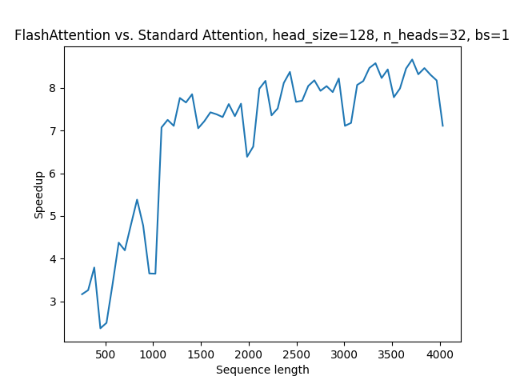
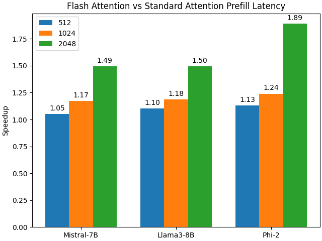

# Accelerating Large Language Models with Flash Attention on AMD GPUs

## Introduction

In this blog post, we will guide you through the process of installing Flash Attention on AMD GPUs and provide benchmarks comparing its performance to standard SDPA in PyTorch. We will also measure end-to-end prefill latency for multiple Large Language Models (LLMs) in Hugging Face.

To appreciate the significance of Flash Attention and its benchmarking results, let's first delve into the [attention mechanism](https://arxiv.org/abs/1706.03762) that drives the success of Transformer architectures. This mechanism is a crucial component of encoder and decoder blocks, allowing Transformers to excel in a wide range of AI domains, including natural language processing, computer vision, and audio tasks.

### Scaled Dot-Product Attention

The attention mechanism used in Transformer models is known as scaled dot-product attention (SDPA). The formula for SDPA is as follows where *Q*, *K*, and *V* are the query, key, and value matrices, and *dₖ* is the dimension of the key vectors:

$$\text{Attention}(Q, K, V) = \text{Softmax}\left(\frac{QK^T}{\sqrt{d_k}}\right) V$$

SDPA allows the model to attend to different parts of the input when generating each element of the output, enabling the model to capture long-range dependencies and handle sequences of varying lengths.

### Cost of SDPA

Although SDPA has proven its utility, it faces challenges when modeling longer sequences, such as entire books or long videos, due to its quadratic time and memory complexity — *O(N²)* where *N* is the length of the input sequence. For example, if you double the sequence length it will take four times longer to compute and require four times as many reads and writes to high-bandwidth memory (HBM). As a result of SDPA's large computational cost, its applicability is limited when dealing with long context tasks.

Considerable research has been devoted to approximating attention using [sparse](https://arxiv.org/pdf/1904.10509) and [low-rank](https://arxiv.org/abs/2006.04768) techniques to reduce this computational cost. Sparse attention techniques eliminate certain entries in the attention matrix, while low-rank approaches factorize the attention matrix into smaller low-rank components. Although these methods can reduce computational requirements to near-linear time with respect to sequence length, they are not widely adopted due to the trade-off in quality and limited actual wall-clock speedup compared to standard SDPA.

### Memory Bottleneck

The main reason for the limited wall-clock speedup of approximate attention algorithms is the emphasis on reducing floating-point operations (FLOPs) rather than addressing memory access overheads. Interestingly, if you profile SDPA on a GPU, you'll find that the majority of the time is consumed by dropout, softmax, and masking operations, rather than the computationally intensive matrix multiplications. This surprising result is explained by the fact that Transformers are bottlenecked not by compute speed, but by memory bandwidth. [Data Movement is All You Need](https://arxiv.org/pdf/2007.00072) reveals that compute-bound operations such as matrix multiplications make up over 99.8% of the total FLOPs but only take up 61% of the total runtime. Surprisingly, memory-bound operations like statistical normalization and element-wise functions, such as dropout and masking, consume the remaining 40% of a Transformer model's runtime. These memory-bound operations only account for 0.02% of the total FLOPs.

Simply put, more time is spent reading and writing from memory than actual computing. These results highlight the importance of addressing memory bottlenecks in Transformer-based models.

### Flash Attention

To address these memory bottlenecks, Tri Dao proposed [Flash Attention](https://arxiv.org/abs/2205.14135), a hardware-aware attention algorithm that computes attention exactly. It tackles the memory bottleneck by reducing the number of reads and writes of the attention matrix to and from GPU memory and performing as many computations on-chip as possible. This necessitates computing the softmax without complete access to the input and not storing the attention matrix from the forward pass. Flash Attention achieves this by dividing the input into blocks and incrementally computing the softmax block by block using tiling on-chip. Furthermore, it employs recomputation to rapidly recompute attention by storing only the softmax normalization factor from the forward pass. All of these operations are combined into a single GPU kernel, resulting in a substantial speedup and reduced memory usage.

For a deeper dive into Flash Attention, we recommend reading the original paper: [Flash Attention: Fast and Memory-Efficient Exact Attention with IO-Awareness](https://arxiv.org/pdf/2205.14135.pdf). You can find all the files and scripts used in this blog post in the [GitHub repo](https://github.com/ROCm/rocm-blogs/tree/release/blogs/artificial-intelligence/flash-attention).

## Prerequisites

To run this blog, you will need the following:

- **Linux**: see [supported Linux distributions](https://rocm.docs.amd.com/projects/install-on-linux/en/latest/reference/system-requirements.html#supported-operating-systems)
- **ROCm 5.7+**: see the [installation instructions](https://rocm.docs.amd.com/projects/install-on-linux/en/latest/tutorial/quick-start.html)
- **PyTorch 2.3+**: see the [installation instructions](https://rocm.docs.amd.com/projects/install-on-linux/en/latest/how-to/3rd-party/pytorch-install.html)
- **Supported AMD GPU**: see the [list of compatible GPUs](https://github.com/ROCm/flash-attention?tab=readme-ov-file#prerequisite)

## Getting Started

In this blog, we'll use the [rocm/pytorch-nightly](https://hub.docker.com/r/rocm/pytorch-nightly/tags) Docker image and build Flash Attention in the container. To get started, let’s pull it.

```bash
docker pull rocm/pytorch-nightly:latest
```

```bash
docker run -it --network=host --group-add=video \
            --ipc=host --cap-add=SYS_PTRACE \
            --security-opt seccomp=unconfined \
            --device /dev/kfd --device /dev/dri \
            rocm/pytorch-nightly:latest
```

Let's install the libraries we will need.

```bash
pip install -q transformers accelerate matplotlib
```

To install Flash Attention with ROCm support, we cannot simply run `pip install flash-attn` because it installs a version that is not compatible with AMD GPUs. Instead, we need to clone AMD's `flash-attention` repo and build it from source.

```bash
git clone --recursive https://github.com/ROCm/flash-attention.git
cd flash-attention
MAX_JOBS=$((`nproc` - 1)) pip install -v .
```

Let's import the libraries we will need.

``` python
import torch
import numpy as np
from tqdm import tqdm
import torch.nn.functional as F
from matplotlib import pyplot as plt
from transformers import AutoTokenizer, AutoModelForCausalLM
```

## Benchmarking Attention

With the release of PyTorch 2.3 for ROCm, Flash Attention is now natively integrated into the [F.scaled_dot_product_attention](https://pytorch.org/docs/2.3/generated/torch.nn.functional.scaled_dot_product_attention.html) function. By default, when `F.scaled_dot_product_attention` is called with query, key, and value matrices, it will now calculate the attention scores using Flash Attention.

To accurately benchmark PyTorch's Flash Attention, we first create a naive `scaled_dot_product_attention` function that computes attention scores in eager mode. Notably, the other variants of scaled dot-product attention found in `F.scaled_dot_product_attention` fuse attention operations to varying degrees, which we intentionally avoid here to align with the original Flash Attention paper's methodology.

```python
def scaled_dot_product_attention(query, key, value, attn_mask=None, is_causal=False, dropout_p=0.0, scale=None):
    """
    Computes the scaled dot product attention between query, key, and value tensors in PyTorch eager mode.

    Args:
        query (torch.Tensor): The query tensor of shape (batch_size, n_heads, seq_len, hidden_dim).
        key (torch.Tensor): The key tensor of shape (batch_size, n_heads, seq_len, hidden_dim).
        value (torch.Tensor): The value tensor of shape (batch_size, n_heads, seq_len, hidden_dim).
        attn_mask (torch.Tensor, optional): The attention mask tensor of shape (batch_size, n_heads, seq_len, seq_len). Defaults to None.
        is_causal (bool, optional): Whether to apply a causal attention mask. Defaults to False.
        dropout_p (float, optional): The dropout probability. Defaults to 0.
        scale (float, optional): The scale factor for the dot product. Defaults to None.

    Returns:
        torch.Tensor: The output tensor of shape (batch_size, n_heads, seq_len, hidden_dim).
    """

    # Calculate the scale factor
    scale_factor = 1 / np.sqrt(query.size(-1)) if scale is None else scale
    attn_weight = (query @ key.transpose(-2, -1) * scale_factor)
    
    # Create the attention mask
    attn_mask = torch.ones(query.shape[0], query.shape[1], query.shape[2], query.shape[2], dtype=torch.bool, device=device).tril(diagonal=0) if is_causal else attn_mask
    attn_weight = attn_weight.masked_fill_(~attn_mask, -torch.inf) if attn_mask is not None else attn_weight
      
    # Compute the scaled dot product attention
    attn_weight = torch.softmax(attn_weight, dim=-1)
    attn_weight = torch.dropout(attn_weight, dropout_p, train=False)

    return attn_weight @ value
```

To test the `scaled_dot_product_attention` function and benchmark it against Flash Attention, we first define some key parameters. Specifically, we set the number of attention heads to 32 and the embedding head dimension to 128. These settings are chosen to match those commonly found in 7B causal Transformer models. From these key parameters, we create query, key, and value matrices to test that the attention scores computed in our `scaled_dot_product_attention` match the scores computed by PyTorch's `F.scaled_dot_product_attention`.

```python
batch_size = 1
seq_len = 64
num_heads = 32
embed_dim = 128
dtype = torch.float16
device = torch.device("cuda")

query = torch.rand(batch_size, num_heads, seq_len, embed_dim, device=device, dtype=dtype)
key = torch.rand(batch_size, num_heads, seq_len, embed_dim, device=device, dtype=dtype)
value = torch.rand(batch_size, num_heads, seq_len, embed_dim, device=device, dtype=dtype)
eager = scaled_dot_product_attention(query, key, value, is_causal=True)
flash = F.scaled_dot_product_attention(query, key, value, is_causal=True)
assert torch.allclose(eager, flash, rtol=1e-03,atol=1e-03)
```

The output of our naive `scaled_dot_product_attention` function matches PyTorch's output. We now define a function called `bench_attention` to measure the average time required to compute multi-head attention for a given sequence length.

```python
def bench_attention(seq_len, flash=False, num_repeats=256):
    """
    Measures the average time (in ms) required to compute multi-head attention for sequences of a given length.

    Args:
        seq_len (int): The length of the input sequence.
        flash (bool, optional): Whether to use the FlashAttention algorithm. Defaults to False.
        num_repeats (int, optional): The number of times to repeat the attention computation for timing purposes. Defaults to 256.

    Returns:
        float: The average time (in ms) required to compute multi-head attention for sequences of length seq_len.
    """
    
    if flash:
        mha = F.scaled_dot_product_attention
    else:
        mha = scaled_dot_product_attention
        
    query = torch.rand(batch_size, num_heads, seq_len, embed_dim, device=device, dtype=dtype)
    key = torch.rand(batch_size, num_heads, seq_len, embed_dim, device=device, dtype=dtype)
    value = torch.rand(batch_size, num_heads, seq_len, embed_dim, device=device, dtype=dtype)

    start = torch.cuda.Event(enable_timing=True)
    end = torch.cuda.Event(enable_timing=True)

    # Warmup
    for _ in range(4):
        _ = mha(query, key, value, is_causal=True)

    start.record()
    for _ in range(num_repeats):
        _ = mha(query, key, value, is_causal=True)   
    end.record()
    torch.cuda.synchronize()
    
    return start.elapsed_time(end) / num_repeats
```

Let's now benchmark the performance of Flash Attention and unfused SDPA implementation for sequence lengths ranging from 256 to 4096, inclusive.

```python
context_len = np.arange(256,4096,64)
flash = np.zeros(context_len.shape)
standard = np.zeros(context_len.shape)

for i,l in enumerate(tqdm(context_len)):
    flash[i] = bench_attention(l,flash=True)
    standard[i] = bench_attention(l,flash=False)
```

And plot the results.

```python
plt.plot(context_len, standard/flash)
plt.xlabel('Sequence length')
plt.ylabel('Speedup')
plt.title('Flash Attention vs. Standard Attention, head_size=128, n_heads=32, bs=1') 
plt.show()
```



The plot shows that Flash Attention in PyTorch provides a significant speedup over the naive attention implementation, by as much as 2-8x. It's worth noting that this speedup also matches the speedup observed in the original Flash Attention implementation. Moreover, the speedup increases as the sequence length grows, due to the quadratic complexity of naive SDPA with respect to sequence length.

## Benchmarking LLMs

Let's now compare the end-to-end prefill latency for multiple LLMs in Hugging Face, with Flash Attention enabled and disabled. Refer to [Hugging Face's documentation](https://huggingface.co/docs/transformers/en/perf_infer_gpu_one) to check if Flash Attention is available for your model. If it's supported, enable it by setting `attn_implementation="flash_attention_2"` in your call to `from_pretrained`. It's worth noting that Hugging Face currently utilizes the original `flash_attn` library, rather than PyTorch's Flash Attention. We'll examine the results to see the impact of Flash Attention on the overall performance.

First, we need to create a function called `bench_llm` to measure the end-to-end latency of a specified causal language model in Hugging Face given a sequence length.

```python
def bench_llm(seq_len, model_name, max_new_tokens=128, flash=False, num_repeats=256):
    """
    Benchmark the end-to-end latency of a large language model (LLM) in Hugging Face, with Flash Attention enabled or disabled.

    Args:
        seq_len (int): Length of the input sequence.
        model_name (str): Name of the pre-trained LLM to use.
        max_new_tokens (int, optional): Maximum number of new tokens to generate. Defaults to 128.
        flash (bool, optional):
        Whether to use flash attention mechanism (if supported by the model).
        num_repeats (int, optional):
        Number of times to repeat the inference for averaging. Defaults to 256.

    Returns:
        float: The average end-to-end latency in seconds.
    """

    if flash:
        mech = "flash_attention_2"
    else:
        mech = "eager"

    model = AutoModelForCausalLM.from_pretrained(
        model_name, 
        torch_dtype=torch.bfloat16, 
        attn_implementation=mech,
        device_map="cuda",
    )
    
    token_ids = {
                    'input_ids': torch.randint(1, 10000, size=(1, seq_len), device='cuda'),
                    'attention_mask': torch.ones(1, seq_len, device='cuda')
    }
    
    start = torch.cuda.Event(enable_timing=True)
    end = torch.cuda.Event(enable_timing=True)

    pad_token_id = model.config.eos_token_id
    
    # Warmup
    for _ in range(4):
        _ = model.generate(**token_ids, max_new_tokens=max_new_tokens, pad_token_id=pad_token_id)

    torch.cuda.synchronize()
    start.record()
    for _ in range(num_repeats):
        _ = model.generate(**token_ids, max_new_tokens=max_new_tokens, pad_token_id=pad_token_id) 
    end.record()
    torch.cuda.synchronize()
    
    return start.elapsed_time(end) / num_repeats
```

We are now ready to benchmark the end-to-end latency of Mistral-7B, Llama-3-8B, and Phi-2 in Hugging Face with and without Flash Attention enabled. We will measure the performance for sequences of length 512, 1024, and 2048 to evaluate the impact of Flash Attention as sequence length increases. If you would like to evaluate additional or fewer LLMs, simply add or modify the model names.

```python
seq_lens = np.array([512, 1024, 2048])
model_names = ['mistralai/Mistral-7B-v0.1', 'NousResearch/Meta-Llama-3-8B', 'microsoft/phi-2']
prefill_flash = np.zeros((len(model_names),len(seq_lens)))
prefill_standard = np.zeros((len(model_names),len(seq_lens)))
for j, model_name in enumerate(tqdm(model_names)):
    for i, seq_len in enumerate(seq_lens):
        prefill_flash[j,i] = bench_llm(seq_len, model_name=model_name, max_new_tokens=1, flash=True)
        prefill_standard[j,i] = bench_llm(seq_len, model_name=model_name, max_new_tokens=1, flash=False)
```

Now let's plot the results.

``` python
speedup_prefill = prefill_standard/prefill_flash

models = ["Mistral-7B", "Llama3-8B", "Phi-2"]
avg_speedup = {
    '512': speedup_prefill.T[0],
    '1024': speedup_prefill.T[1],
    '2048': speedup_prefill.T[2],
}

x = np.arange(len(avg_speedup))  
width = 0.25
multiplier = 0

fig, ax = plt.subplots(layout='constrained')

for attribute, measurement in avg_speedup.items():
    offset = width * multiplier
    rects = ax.bar(x + offset, measurement, width, label=attribute)
    ax.bar_label(rects, fmt='%.2f', padding=3)
    multiplier += 1

ax.legend(loc='upper left', ncols=1)
ax.set_xticks(x + width, models)
ax.set_ylabel('Speedup')
ax.set_title('Flash Attention vs Standard Attention Prefill Latency')
plt.savefig('benchmark-llm.png')
plt.show()
```

Flash Attention significantly decreases the prefill latency for all of the LLMs tested compared to standard SDPA. For some LLMs, the reduction in latency is more substantial. Moreover, as the sequence length increases, the speedup becomes even more pronounced, mirroring the trend we observed during our benchmarking of the attention modules.



## Summary

Flash Attention is a fast and memory-efficient implementation of self-attention that is both exact and hardware-aware. In this blog, we've demonstrated how to install Flash Attention with ROCm support and benchmark its performance in two ways:

1. As a standalone module, to measure the speedup of the Flash Attention algorithm over SDPA.
2. End-to-end prefill latency for multiple LLMs in Hugging Face, to evaluate the impact of Flash Attention on the overall prefill latency of the model.

Our results show that Flash Attention provides a significant speed improvement over the naive attention implementation, particularly for long sequences on AMD GPUs.

## Disclaimer

Third-party content is licensed to you directly by the third party that owns the content and is not licensed to you by AMD. ALL LINKED THIRD-PARTY CONTENT IS PROVIDED “AS IS” WITHOUT A WARRANTY OF ANY KIND. USE OF SUCH THIRD-PARTY CONTENT IS DONE AT YOUR SOLE DISCRETION AND UNDER NO CIRCUMSTANCES WILL AMD BE LIABLE TO YOU FOR
ANY THIRD-PARTY CONTENT. YOU ASSUME ALL RISK AND ARE SOLELY RESPONSIBLE FOR ANY
DAMAGES THAT MAY ARISE FROM YOUR USE OF THIRD-PARTY CONTENT.
