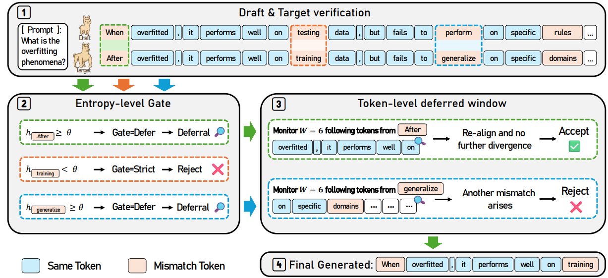
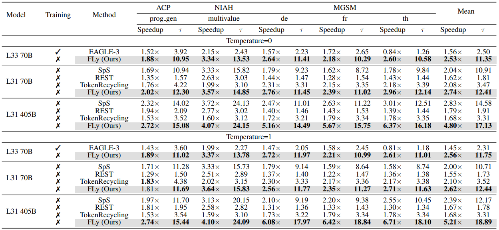
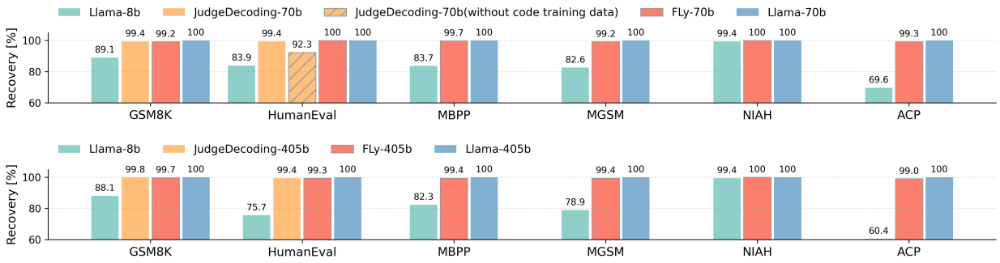

<!---
Copyright (c) 2026 Advanced Micro Devices, Inc. (AMD)

Permission is hereby granted, free of charge, to any person obtaining a copy
of this software and associated documentation files (the "Software"), to deal
in the Software without restriction, including without limitation the rights
to use, copy, modify, merge, publish, distribute, sublicense, and/or sell
copies of the Software, and to permit persons to whom the Software is
furnished to do so, subject to the following conditions:

The above copyright notice and this permission notice shall be included in all
copies or substantial portions of the Software.

THE SOFTWARE IS PROVIDED "AS IS", WITHOUT WARRANTY OF ANY KIND, EXPRESS OR
IMPLIED, INCLUDING BUT NOT LIMITED TO THE WARRANTIES OF MERCHANTABILITY,
FITNESS FOR A PARTICULAR PURPOSE AND NONINFRINGEMENT. IN NO EVENT SHALL THE
AUTHORS OR COPYRIGHT HOLDERS BE LIABLE FOR ANY CLAIM, DAMAGES OR OTHER
LIABILITY, WHETHER IN AN ACTION OF CONTRACT, TORT OR OTHERWISE, ARISING FROM,
OUT OF OR IN CONNECTION WITH THE SOFTWARE OR THE USE OR OTHER DEALINGS IN THE
SOFTWARE.
--->

# FLy: A New Paradigm for Speculative Decoding — Accepting Semantically Correct Drafts Beyond Exact Match

Speculative decoding has emerged as a highly effective approach to accelerate large language model (LLM) inference, yet existing methods are severely bottlenecked by a rigid exact-match verification rule that discards many semantically valid continuations. Furthermore, existing training-based loose decoding methods often suffer from significant performance degradation on out-of-distribution (OOD) tasks.

In our recent paper, [Training-Free Loosely Speculative Decoding: Accepting Semantically Correct Drafts Beyond Exact Match](https://arxiv.org/abs/2511.22972), we introduce FLy, a novel method that loosens this rigid criterion without requiring any additional training. By leveraging the target model's inherent self-corrective behavior, FLy judges whether a draft-target mismatch remains semantically valid. In this blog, we will discuss the motivation behind FLy, its two-tier verification mechanism, and how it delivers state-of-the-art, training-free performance on AMD GPUs using the ROCm software stack. The GitHub code of FLy can be found [here](https://github.com/AMD-AGI/FLy).

## What Is Speculative Decoding (SPD)?

Large language models (LLMs) typically generate text in an auto-regressive fashion, producing tokens one by one, which entails substantial inference latency. Speculative Decoding (SPD) tackles this bottleneck losslessly by using a lightweight draft model to sequentially propose multiple candidate tokens. A much larger target model then verifies these draft tokens in parallel, accepting those that match its own predictions. When the acceptance rate is high, the amortized time per token drops, yielding substantial speedups.

## Motivation – The Exact-Match Bottleneck & OOD Degradation

Standard SPD is fundamentally constrained by its exact-match rule: the target model accepts a draft token only if it is identical to its own generation. This rigid requirement forces the rejection of many plausible continuations—even those that are semantically aligned and valid—thereby wasting compute and limiting potential speedup.

To address this, recent works have proposed loose variants of SPD that train an auxiliary classifier to decide if a draft token is contextually valid. However, this requires carefully curated training data and incurs high annotation costs. More critically, these supervised classifiers often fail to generalize across different domains or tasks, making them brittle in out-of-distribution (OOD) settings.

## Core Insight – LLM Self-Corrective Behavior

To overcome these limitations without relying on fragile trained verifiers, FLy operates entirely training-free. Our central insight is that LLMs tend to exhibit self-corrective behavior when conditioned on genuinely erroneous tokens, but do not diverge when faced with differently worded yet semantically valid alternatives. Building on this property, FLy leverages the target model's own behavior to distinguish harmful mismatches from semantically equivalent continuations.

## ROCm — Powering FLy's Efficient Acceleration

Because FLy introduces no additional forward passes and computes per-token entropy directly from already-available logits, its computational overhead is negligible. All our experiments were conducted on AMD Instinct MI355X GPUs. By leveraging the ROCm software stack—which is designed to maximize memory bandwidth utilization and fine-grained parallelism—FLy is able to execute parallel token verification at scale with minimal latency overhead. This makes FLy a highly efficient, plug-and-play solution that seamlessly composes with arbitrary draft-target pairs on ROCm-enabled systems, ensuring production-grade performance without the need for hyperparameter re-tuning.

## FLy — A Two-Tier Mechanism for Semantic Verification

<i>Figure 1. Overview of our proposed FLy. (1) When the draft and target tokens differ, we do not immediately reject the case as in prior SPD methods. Instead, our two-tier scheme assesses whether the mismatch is semantically valid and rejects only truly invalid cases. (2) An entropy gate rejects deterministic target predictions where h < θ, deferring ambiguous mismatches. (3) A token-level deferral window (W = 6) then monitors for continued divergence. (4) The final generation demonstrates that FLy admits more semantically valid continuations, whereas standard SPD would reject at the first mismatch.</i>

As shown in Figure 1, to accurately identify semantically valid mismatches, FLy introduces a sophisticated two-tier mechanism:

Entropy-level Gate: This acts as a lightweight, per-token ambiguity detector. It identifies whether the current token allows multiple plausible alternatives (high entropy) or is nearly deterministic, such as in mathematical calculations (low entropy). If the target model is confident, the mismatch is immediately rejected. If it is ambiguous, FLy defers the decision.

Token-level Deferred Window: When deferral is activated, FLy looks ahead over a window spanning the next several tokens (e.g., 6 tokens). Within this window, the mismatch is provisionally accepted. If another mismatch emerges, it signals that the target model is attempting to course-correct a genuine error, and the initial token is retroactively rejected. If no further divergence occurs, the token is deemed a semantically valid continuation and is retained.

## Multi-Level Acceleration (MLA)

By accepting semantically correct mismatches, the average number of accepted tokens rises markedly. Consequently, the draft model must propose a larger set of tokens per round, making the drafting stage a new latency bottleneck. To mitigate this, we implemented a multi-level acceleration (MLA) scheme that speeds up not just the target model, but the draft model itself. By integrating a parameter-free method like prompt lookup decoding (PLD), MLA reduces draft-side overhead and achieves even greater end-to-end efficiency without adding domain bias.

## Results: Speedup Ratio and Accuracy Preservation on AMD Hardware

<i>Table 1. Speedup ratios and mean accepted tokens (τ ) on out-of-domain (OOD) datasets. L31 and L33 represent Llama-3.1-Instruct and Llama-3.3-Instruct, respectively. Mean represents the average performance across these datasets. We use bold text to denote the best result. ✓ indicates training-based methods, whereas ✗ means training-free methods.</i>

As shown in Table 1, FLy demonstrates exceptional performance. For Llama-3.1-70B-Instruct, FLy achieves an average speedup of 2.74× (2.62×) with temperature= 0 (= 1), outperforming existing training-free baselines. On the Llama-3.3 variant, FLy surpasses the training-based SOTA method EAGLE-3 by 1.62× (1.77×). This advantage scales with model size. FLy achieves a 4.80× (5.21×) average speedup on the 405B variant, as its higher per-token latency allows greater time savings when draft tokens are accepted, reducing costly target model calls.

<i>Figure 2. Accuracy preservation results. The performance of the target model is normalized to 100, and the recovery ratio is used to quantify the extent of performance preservation.</i>

Since our method is a loosely SPD method, the output of the accelerated target model would not be exactly the same as the original. Thus, we report accuracy preservation relative to the original target model after applying FLy, as shown in Figure 2. Concretely, we normalize the original target model’s score to 100% and use a recovery ratio to quantify how much performance is retained. The original non-normalized scores are provided in Appendix B in the [original paper](https://arxiv.org/abs/2511.22972). Across different datasets and model scales, our method consistently maintains accuracy with over 99% recovery score, and it performs on par with the training-based loosely SPD method JudgeDecoding. It is worth noting that JudgeDecoding also recognizes sensitivity to train–test domain misalignment. When coding examples are removed from their training data, performance on HumanEval drops substantially from 99.4% to 92.3%, underscoring degradation under distribution shift.

## Summary

In this blog, we introduced FLy, a training-free algorithm that replaces standard SPD's rigid exact-match criterion with a loosely verified scheme that accepts semantically correct tokens. By utilizing an entropy-level gate and a token-level deferred window, FLy leverages the target model's self-corrective behavior to distinguish genuine errors from valid alternatives. Paired with multi-level acceleration, FLy delivers state-of-the-art speedups on AMD ROCm-enabled GPUs while maintaining over 99% accuracy.

## Disclaimers

Third-party content is licensed to you directly by the third party that owns the content and is not licensed to you by AMD. ALL LINKED THIRD-PARTY CONTENT IS PROVIDED “AS IS” WITHOUT A WARRANTY OF ANY KIND. USE OF SUCH THIRD-PARTY CONTENT IS DONE AT YOUR SOLE DISCRETION AND UNDER NO CIRCUMSTANCES WILL AMD BE LIABLE TO YOU FOR ANY THIRD-PARTY CONTENT. YOU ASSUME ALL RISK AND ARE SOLELY RESPONSIBLE FOR ANY DAMAGES THAT MAY ARISE FROM YOUR USE OF THIRD-PARTY CONTENT.
