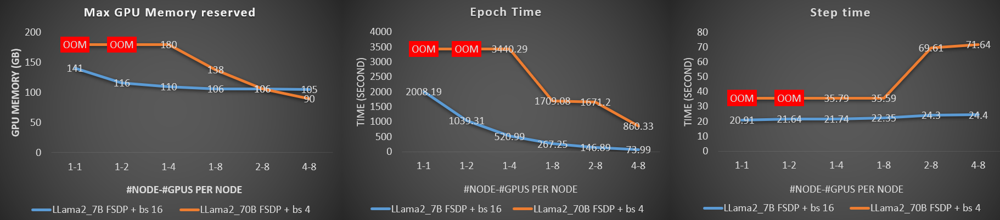

# PyTorch Fully Sharded Data Parallel (FSDP) on AMD GPUs with ROCm

[PyTorch Fully Sharded Data Parallel (FSDP)](https://pytorch.org/docs/stable/fsdp.html) is a data parallelism technique that enables the training of large-scale models in a memory-efficient manner. FSDP achieves this memory efficiency by sharding model parameters, optimizer states, and/or gradients across GPUs, reducing the memory footprint required by each GPU. This enables the training of large-scale models with lower total GPU memory than DDP (Distributed Data Parallel), in which the model weights and optimizer states are replicated across all processes. To learn more about DDP, refer to [Distributed Data Parallel (DDP) training on AMD GPU with ROCm](https://rocm.blogs.amd.com/artificial-intelligence/ddp-training-pytorch/README.html).

In this blog, we will walk you through the process of fine-tuning Llama models using PyTorch's Fully Sharded Data Parallel (FSDP) on an AMD GPU cluster powered by ROCm.

## PyTorch Fully Sharded Data Parallel (FSDP)

[PyTorch Fully Sharded Data Parallel (FSDP)](https://pytorch.org/docs/stable/fsdp.html) provides the flexibility of sharding model parameters, optimizer states, and/or gradients across GPUs. This ensures that only a portion of the model's parameters is held on each GPU. FSDP wraps model layers in a nested structure, ensuring that only the layers within a specific FSDP instance need to gather full parameters on a single device during the forward and backward passes. Once the computation for a layer is completed, the gathered parameters are immediately freed, retaining only the original shard of the parameters. This process frees up the memory for computation in the next layer, significantly reducing peak GPU memory usage. As a result, FSDP allows for training larger models or using larger batch sizes.

The memory requirement for FSDP is primarily determined by the sum of the sharded model size and the largest fully materialized FSDP instance. To further optimize memory efficiency, FSDP can offload parameters, gradients, and optimizer states to the CPU when a specific instance is not involved in the computation.

### FSDP workflow

At a high level, FSDP works as follows during the forward and backward paths:

* Forward Path: An FSDP instance, which may consist of one or more layers, performs an [all-gather](https://pytorch.org/docs/stable/distributed.html) operation to collect parameter shards from all ranks (processes within a distributed training system), assembling the full parameters for that instance on each rank. Each rank then runs forward computation on the FSDP instance using its exclusive batch of data. After computation, parameter shards that didn't originally belong to the rank are freed. This process repeats for each FSDP instance until the forward pass is complete.
* Backward path: For each FSDP instance, the process begins with an [all-gather](https://pytorch.org/docs/stable/distributed.html) operation to collect parameters from all ranks. Backward computation is then performed to calculate gradients for that instance. Next, a [reduce_scatter](https://pytorch.org/docs/stable/distributed.html) operation is performed, where gradients from all ranks are averaged and sharded back across the ranks. Similar to forward pass, any parameters that didn't originally belong to the rank are released. This process continues for all FSDP instances until gradients are calculated and distributed across all ranks. Finally, the optimizer updates the weights in parallel for each rank using the calculated gradients.

### Sharding strategy

While FSDP reduces memory usage during training, it also results in communication overhead due to parameter gathering, release, and synchronization across workers. FSDP provides several sharding strategies to optimize memory efficiency and GPU communication, each suited to different model sizes and computational requirements:

* `FULL_SHARD`: Fully shards parameters, gradients, and optimizer states across workers, requiring the most communication during forward and backward passes.
* `SHARD_GRAD_OP`: Shards only gradients and optimizer states, while keeping parameters unsharded during computation. This approach reduces memory traffic related to parameter gathering and release.
* `NO_SHARD`: A replica of the model is kept across workers and synchronizing gradients after the backward pass. This strategy is useful when sufficient memory is available but communication is a bottleneck.
* `HYBRID_SHARD`: Combines `FULL_SHARD` within a single node with parameter replication across nodes, balancing inter-node communication and memory usage for medium-sized models.
* `_HYBRID_SHARD_ZERO2`: Similar to `HYBRID_SHARD`, but applies `SHARD_GRAD_OP` within a node, offering higher throughput at the cost of increased peak memory usage.

These strategies allow you to optimize your training setups, balancing memory usage and throughput according to your specific needs.

### Sharding polices

FSDP provides flexible sharding policies. You can specify module classes (e.g., transformer blocks) to be wrapped as FSDP instances, which are then sharded across ranks. Additionally, you can set size limits for wrapping, where layers are only wrapped or sharded if the parameter count exceeds the specified threshold. You can also define custom sharding policies. These features allow you to tailor your strategy, balancing memory usage and communication overhead to suit your needs.

For more detailed information, refer to the PyTorch [FSDP APIs](https://pytorch.org/docs/stable/fsdp.html).

## Setup

This blog was created using the following setup. For comprehensive support details about the setup, refer to the [ROCm documentation](https://rocm.docs.amd.com/projects/install-on-linux/en/latest/).

* Hardware & OS:
  * [Oracle Cloud Infrastructure (OCI)](https://www.oracle.com/ai-infrastructure/), with each node featuring **eight [AMD Instinct™ MI300x](https://www.amd.com/en/products/accelerators/instinct.html)** GPUs.
  * Ubuntu 22.04.3 LTS
* Software:
  * [ROCm 6.2+](https://rocm.docs.amd.com/projects/install-on-linux/en/develop/how-to/amdgpu-install.html)
  * [PyTorch 2.3+ for ROCm](https://rocm.docs.amd.com/projects/install-on-linux/en/latest/how-to/3rd-party/pytorch-install.html)
  * [SLURM](https://slurm.schedmd.com/documentation.html)
  
In this blog, the experiment is performed using the [`Docker image`](https://hub.docker.com/layers/rocm/pytorch/rocm6.2_ubuntu20.04_py3.9_pytorch_release_2.3.0/images/sha256-a1b2be0e705b02c25a3cf7fdaa991afea68deaebcafa58ef1872ce961713617c) of ROCm 6.2.1 with Ubuntu20.04, Python 3.9, and PyTorch 2.3.0 on **four** nodes of **OCI**.

## Getting started

Thanks to Meta’s open-source contributions, the experiments in this blog are based on the [Llama recipes](https://github.com/meta-llama/llama-recipes) project. In the blog, you will learn about using the `FULL_SHARD` strategy to fine-tune `7B` and `70B` models on AMD GPUs with ROCm on `OCI`.
Applying FSDP requires necessary code changes, which will be highlighted in the sections that follow.

`FSDP` depends on the PyTorch distributed communication package,  [`torch.distributed`](https://pytorch.org/docs/stable/distributed.html), to offer support and communication primitives for multiprocess parallelism across multiple computation nodes, either on a single machine or across several machines. The first step is to initialize both the default distributed process group and the distributed package.

```python
import torch.distributed as dist
# nccl is recommended by pytorch for distributed GPU training
dist.init_process_group(backend="nccl") 
```

After the setup, the local and global rank id can be retrieved with the following:

```python
local_rank = int(os.environ["LOCAL_RANK"])
rank = int(os.environ["RANK"])
```

To use `FSDP` on a host with N GPUs, N processes should be spawned, with each process assigned to a specific GPU, ranging from 0 to N-1. This can be achieved by calling:

```python
torch.cuda.set_device(local_rank)
```

This ensures that the FSDP instance’s compute device is the destination device.

When preparing the dataset for distributed training, it is important to ensure that each rank receives a unique subset of the dataset during training. This can be achieved by passing a `DistributedSampler` instance to the `sampler` argument of `torch.utils.data.DataLoader()`.

```python
# create dataset
dataset_train = get_preprocessed_dataset(...) 
train_dataloader = torch.utils.data.DataLoader(dataset_train, sampler=DistributedSampler(dataset_train), ...)
```

PyTorch [FullyShardedDataParallel](https://pytorch.org/docs/stable/fsdp.html) converts a model as FSDP instance in a nested manner.

```python
from torch.distributed.fsdp import FullyShardedDataParallel as FSDP
from torch.distributed.fsdp import ShardingStrategy
from transformers import LlamaForCausalLM

model = LlamaForCausalLM.from_pretrained(train_config.model_name, ...)

my_auto_wrapping_policy = fsdp_auto_wrap_policy(model, [LlamaDecoderLayer])
model = FSDP(
            model,
            auto_wrap_policy= my_auto_wrapping_policy,
            sharding_strategy= ShardingStrategy.FULL_SHARD,
            ...)
```

FSDP allows you to specify parameters such as `size limits` and `module classes` as part of the sharding policy when wrapping a model for FSDP training. Customized wrapping can be also used to explore complex sharding strategies. Learn more in [Introducing PyTorch Fully Sharded Data Parallel (FSDP) API](https://pytorch.org/blog/introducing-pytorch-fully-sharded-data-parallel-api/). In the example code snippet, the module class `LlamaDecoderLayer` is used to instruct FSDP to convert any layer of the model that belongs to the `LlamaDecoderLayer` class into FSDP instances. To learn more about the `fsdp_auto_wrap_policy` function definition, refer to this [line of code](https://github.com/meta-llama/llama-cookbook/blob/6bfd03450480c442de5071879a4ad65d85f77fd8/src/llama_cookbook/utils/fsdp_utils.py#L6).

>**Note**:  
> `LlamaDecoderLayer` class defines a classical transformer block consisting of self-attention and MLP components. After this configuration, you can print the model to check the changes.  

```python
# Using Llama 2 7B model as an example
print(model)
```

Output:

```text
 FullyShardedDataParallel(
   (_fsdp_wrapped_module): LlamaForCausalLM(
     (model): LlamaModel(
       (embed_tokens): Embedding(32000, 4096)
       (layers): ModuleList(
         (0-31): 32 x FullyShardedDataParallel(
           (_fsdp_wrapped_module): LlamaDecoderLayer(
             (self_attn): LlamaSdpaAttention(
               (q_proj): Linear(in_features=4096, out_features=4096, bias=False)
               (k_proj): Linear(in_features=4096, out_features=4096, bias=False)
               (v_proj): Linear(in_features=4096, out_features=4096, bias=False)
               (o_proj): Linear(in_features=4096, out_features=4096, bias=False)
               (rotary_emb): LlamaRotaryEmbedding()
             )
             (mlp): LlamaMLP(
               (gate_proj): Linear(in_features=4096, out_features=11008, bias=False)
               (up_proj): Linear(in_features=4096, out_features=11008, bias=False)
               (down_proj): Linear(in_features=11008, out_features=4096, bias=False)
               (act_fn): SiLU()
             )
             (input_layernorm): LlamaRMSNorm((4096,), eps=1e-05)
             (post_attention_layernorm): LlamaRMSNorm((4096,), eps=1e-05)
           )
         )
       )
       (norm): LlamaRMSNorm((4096,), eps=1e-05)
       (rotary_emb): LlamaRotaryEmbedding()
     )
     (lm_head): Linear(in_features=4096, out_features=32000, bias=False)
   )
 )
 ```

This Llama-2-7B model consists of 32 layers of `LlamaDecoderLayer`, and each layer is correctly wrapped as an FSDP instance.

After this, the model wrapped with FSDP can be used like a normal model during training. Once training is complete, it s recommended to clean up the process group that was initially created.

```python
"""Clean up the process group after training"""
dist.destroy_process_group()
```

## Multi-GPU and Multi-Node fine-tuning

To launch distributed training with FSDP across multiple nodes, the same Docker container and training command should be executed on each node. This process is similar to using DDP for training. For detailed instructions on manually launching distributed training, refer to [Distributed Data Parallel (DDP) training on AMD GPU with ROCm](https://rocm.blogs.amd.com/artificial-intelligence/ddp-training-pytorch/README.html).

To simplify this process, [Slurm](https://slurm.schedmd.com/documentation.html) is used in this blog to manage the workload across nodes. There are several benefits to using Slurm for your job. It allows exclusive node access without concerns about contention and provides an easy way to execute and monitor jobs across multiple nodes. Slurm manages resource contention by maintaining a queue of jobs.

The first step is to download the code and dataset used for fine-tuning Llama models. If you have a shared file system, run the following commands in a shared folder accessible by all the nodes.

```bash
# clone the repo for this blog
git clone https://github.com/ROCm/rocm-blogs.git
cd rocm-blogs/blogs/artificial-intelligence/fsdp-training-pytorch/src

# git clone llama-recipes
git clone https://github.com/meta-llama/llama-recipes.git
cp ./utils/*.sh llama-recipes

# Download dataset for fine-tuning
cd llama-recipes
wget -P src/llama_recipes/datasets https://raw.githubusercontent.com/tatsu-lab/stanford_alpaca/main/alpaca_data.json
```

Llama 2 models need to be downloaded. Access to the Llama 2 models requires a request. Refer to [Llama-2-7b-hf](https://huggingface.co/meta-llama/Llama-2-7b-hf) and [Llama-2-70b-hf](https://huggingface.co/meta-llama/Llama-2-70b-hf) page to obtain access. Once the access is granted, you can download the models using the command below by providing your Hugging Face account token as outlined.

```bash

pip install git+https://github.com/huggingface/huggingface_hub
huggingface-cli login
```

You will see the following output:

```text
    _|    _|  _|    _|    _|_|_|    _|_|_|  _|_|_|  _|      _|    _|_|_|      _|_|_|_|    _|_|      _|_|_|  _|_|_|_|
    _|    _|  _|    _|  _|        _|          _|    _|_|    _|  _|            _|        _|    _|  _|        _|
    _|_|_|_|  _|    _|  _|  _|_|  _|  _|_|    _|    _|  _|  _|  _|  _|_|      _|_|_|    _|_|_|_|  _|        _|_|_|
    _|    _|  _|    _|  _|    _|  _|    _|    _|    _|    _|_|  _|    _|      _|        _|    _|  _|        _|
    _|    _|    _|_|      _|_|_|    _|_|_|  _|_|_|  _|      _|    _|_|_|      _|        _|    _|    _|_|_|  _|_|_|_|

    A token is already saved on your machine. Run `huggingface-cli whoami` to get more information or `huggingface-cli logout` if you want to log out.
    Setting a new token will erase the existing one.
    To log in, `huggingface_hub` requires a token generated from https://huggingface.co/settings/tokens .
    Enter your token (input will not be visible):
```

Enter your Hugging Face account token to log in. Then run the following commands to download `Llama-2-7b-hf` and `Llama-2-70b-hf`.

```python
%bash
cd llama-recipes
huggingface-cli download meta-llama/Llama-2-7b-hf  --local-dir meta-llama/Llama-2-7b-hf
huggingface-cli download meta-llama/Llama-2-70b-hf  --local-dir meta-llama/Llama-2-70b-hf
```

You are now ready to launch the FSDP fine-tuning of `Llama-2-7b-hf` and `Llama-2-70b-hf` with different numbers of GPUs or nodes on `OCI`, powered by AMD GPU.

### Single node FSDP fine-tuning with Slurm

Using Slurm for training generally involves three main parts: requesting nodes, setting up the environment on each node, and launching the FSDP training across all nodes. The [`fsdp_ft_single_node_core.sh`](https://github.com/ROCm/rocm-blogs/tree/release/blogs/artificial-intelligence/fsdp-training-pytorch/src/fsdp_ft_single_node_core.sh) includes all these three-parts for single node case. The following command can be configured to run the FSDP training on one node with various configurations:

```bash
sbatch --nodes=1 --nodelist=useocpm2m-386-001 fsdp_ft_single_node_core.sh "n_proc_per_node" "n_epoch" "n_batchsize" "model_path" "model_size" "save_model"
```

The following command fine-tunes the `Llama-2-7b-hf` model weights (using the [`alpaca_data`](https://huggingface.co/datasets/tatsu-lab/alpaca) dataset by default) on a single node (useocpm2m-386-001). It utilizes two GPUs for one epoch with a batch size 16 and saves the checkpoint after fine-tuning. Note that `useocpm2m-386-001` refers to a single node on the OCI platform. Replace this with the node name specific to your system.

```bash
sbatch --nodes=1 --nodelist=useocpm2m-386-001 fsdp_ft_single_node_core.sh 2 1 16 ./meta-llama/Llama-2-7b-hf 2-7B True
```

A log file will be generated after the job is completed. The name is in the format of `fsdp_training_DATE_modelVersion_#node_#gpuPerNode_#epoch_#batchSize.txt`. The log file contains the training information, including the training loss, memory usage, and training time.

To analyze the scalability of the FSDP training on OCI, `Llama-2-7b-hf` and `Llama-2-70b-hf` models are fine-tuned with different numbers of GPUs (1, 2, 4, and 8).

```python
sbatch --nodes=1 --nodelist=useocpm2m-386-001 fsdp_ft_single_node_core.sh 1 1 16 ./meta-llama/Llama-2-7b-hf 2-7B False
sbatch --nodes=1 --nodelist=useocpm2m-386-001 fsdp_ft_single_node_core.sh 2 1 16 ./meta-llama/Llama-2-7b-hf 2-7B True
sbatch --nodes=1 --nodelist=useocpm2m-386-001 fsdp_ft_single_node_core.sh 4 1 16 ./meta-llama/Llama-2-7b-hf 2-7B False
sbatch --nodes=1 --nodelist=useocpm2m-386-001 fsdp_ft_single_node_core.sh 8 1 16 ./meta-llama/Llama-2-7b-hf 2-7B False
sbatch --nodes=1 --nodelist=useocpm2m-386-001 fsdp_ft_single_node_core.sh 1 1 4 ./meta-llama/Llama-2-70b-hf 2-70B False
sbatch --nodes=1 --nodelist=useocpm2m-386-001 fsdp_ft_single_node_core.sh 2 1 4 ./meta-llama/Llama-2-70b-hf 2-70B False 
sbatch --nodes=1 --nodelist=useocpm2m-386-001 fsdp_ft_single_node_core.sh 4 1 4 ./meta-llama/Llama-2-70b-hf 2-70B False 
sbatch --nodes=1 --nodelist=useocpm2m-386-001 fsdp_ft_single_node_core.sh 8 1 4 ./meta-llama/Llama-2-70b-hf 2-70B False 
```

After this is completed you can find the FSDP sharded checkpoints under path: `./fsdp_fine_tune_results/fsdp_model_finetuned_1_2_2-7B/fine-tuned-./meta-llama/Llama-2-7b-hf`

```text
__0_0.distcp
__1_0.distcp
.metadata
train_params.yaml
```

The following script can be used to run inference with the checkpoint:

```text
bash inference_test.sh checkpoint_path model_be_fintuned_path model_version prompt_for_test_file
```

This is a test case for running inference with the checkpoint located at`/fsdp_fine_tune_results/fsdp_model_finetuned_1_2_2-7B/fine-tuned-./meta-llama/Llama-2-7b-hf`, which is obtained by fine-tuning the `./meta-llama/Llama-2-7b-hf` model. `prompt_for_test.txt` contains the prompt as `Develop a plan to build an AI chatbot in a home.`

```python
bash inference_test.sh ./fsdp_fine_tune_results/fsdp_model_finetuned_1_2_2-7B/fine-tuned-./meta-llama/Llama-2-7b-hf ./meta-llama/Llama-2-7b-hf 2_7b ./prompt_for_test.txt
```

Output:

```text
Model name: ./meta-llama/Llama-2-7b-hf
model is loaded from config
/opt/conda/envs/py_3.9/lib/python3.9/site-packages/torch/distributed/checkpoint/state_dict_loader.py:27: UserWarning: 'load_state_dict' is deprecated and will be removed in future versions. Please use 'load' instead.
  warnings.warn(
Sharded state checkpoint loaded from ./fsdp_fine_tune_results/fsdp_model_finetuned_1_2_2-7B/fine-tuned-./meta-llama/Llama-2-7b-hf
model is loaded from FSDP checkpoints
HuggingFace model checkpoints has been saved in ./fsdp_fine_tune_results/fsdp_model_finetuned_1_2_7b_hf
use_fast_kernelsFalse
Loading checkpoint shards: 100%|██████████████████████████████████████████████████████████████████████████████████████████████████████| 6/6 [02:25<00:00, 24.26s/it]
User prompt deemed safe.
User prompt:
Develop a plan to build a AI chatbot in a home.
Asking to truncate to max_length but no maximum length is provided and the model has no predefined maximum length. Default to no truncation.
Setting `pad_token_id` to `eos_token_id`:None for open-end generation.
/opt/conda/envs/py_3.9/lib/python3.9/site-packages/transformers/models/llama/modeling_llama.py:655: UserWarning: 1Torch was not compiled with memory efficient attention. (Triggered internally at /var/lib/jenkins/pytorch/aten/src/ATen/native/transformers/hip/sdp_utils.cpp:517.)
  attn_output = torch.nn.functional.scaled_dot_product_attention(
Starting from v4.46, the `logits` model output will have the same type as the model (except at train time, where it will always be FP32)
the inference time is 13113.63934900146 ms
User input and model output deemed safe.
Model output:
Develop a plan to build a AI chatbot at home. There are a few steps that must be taken before building an AI chatbot. First, you need to create a user interface and design how thebot will interact with the user. Second, you need to build the underlying logic of thebot and create the training database. Third, you need to test the output of thebot and make sure that it is up to par with the industry standards. Finally, you need to deploy thebot and run it at home, so that it can be used
```

This shows the system is working correctly.

### Multi-node FSDP fine-tuning with Slurm

Similarly, [`fsdp_ft_multi_node_core.sh`](https://github.com/ROCm/rocm-blogs/tree/release/blogs/artificial-intelligence/fsdp-training-pytorch/src/fsdp_ft_multi_node_core.sh) is provided to assist in requesting nodes, setting up the environment, and launching the fine-tuning process.

The following command can be configured to run FSDP training across multiple nodes with various settings:

```bash
sbatch --nodes="number_of_nodes" --nodelist="list_of_target_nodes" fsdp_ft_multi_node_core.sh "n_proc_per_node" "n_epoch" "n_batchsize" "model_path" "model_size save_model"
```

Specifically, the fine-tuning experiments are conducted on the `Llama-2-7b-hf` and `Llama-2-70b-hf` models using two and four nodes, each equipped with eight GPUs.

```python
sbatch --nodes=2 --nodelist=useocpm2m-386-001,useocpm2m-386-002 fsdp_ft_multi_node_core.sh 8 1 16 ./meta-llama/Llama-2-7b-hf 2-7B  False
sbatch --nodes=4 --nodelist=useocpm2m-386-002,useocpm2m-386-003,useocpm2m-386-004,useocpm2m-386-006 fsdp_ft_multi_node_core.sh 8 1 16 ./meta-llama/Llama-2-7b-hf 2-7B  False
sbatch --nodes=2 --nodelist=useocpm2m-386-001,useocpm2m-386-002 fsdp_ft_multi_node_core.sh 8 1 4 ./meta-llama/Llama-2-70b-hf 2-70B False 
sbatch --nodes=4 --nodelist=useocpm2m-386-001,useocpm2m-386-002,useocpm2m-386-003,useocpm2m-386-006 fsdp_ft_multi_node_core.sh 8 1 4 ./meta-llama/Llama-2-70b-hf 2-70B False
```

### Results analysis

During the fine-tuning of the `Llama-2-7b-hf` and `Llama-2-70b-hf` models on varying numbers of GPUs and nodes, the `maximum CUDA memory` reserved, `epoch time`, and `step time` are recorded. These three metrics are summarized in the graph plots. The `batch size` for a single GPU is set to `16` for `Llama-2-7b-hf` and `4` for `Llama-2-70b-hf`. The same batch size has been maintained for a single GPU regardless of the number of GPUs or nodes used. This approach ensures that the number of GPUs is the only variable in the experiment, helping to understand the behavior of FSDP training in comparison with the number of GPUs utilized.
> **Note**:
> Fine-tuning `Llama-2-70b-hf` with batch size four, causes out-of-memory when using one and two GPUs in the example. `OOM` is used for those cases on the plots.


*Figure 1: Fine-Tuning Performance with FSDP Across Different GPUs and Nodes.*

* Memory saving
  * From the first plot, the overall trend shows that as more GPUs are utilized, the memory required on a single GPU decreases. This reduction in memory is more pronounced for larger models. The explanation stems from the nature of FSDP, where model weights are distributed across the GPUs, meaning that with more GPUs in use, each GPU needs to hold fewer weights. The memory savings allow for training with larger batch sizes or model sizes.
  * When scaling up the training to a certain number of GPUs, the memory consumed by the sharded weights on a single GPU becomes negligible compared to the total memory required. This is why, for the smaller model, `Llama-2-7b-hf`, the memory savings are not as significant when the number of GPUs exceeds eight.

* Training time
  * The epoch time indicates how long it takes to train the model on the entire dataset. The middle plot shows that the time required for one epoch decreases as more GPUs are employed. During fine-tuning, each process/GPU handles a batch of data for computation. With N GPUs, the effective batch size processed in parallel is N times that of a single GPU, accelerating the training process.

* Communication
  * Compared to DDP, FSDP entails more communication for operations such as all-gathering parameters and reduce-scattering gradients for each FSDP instance. When there is substantial communication between GPUs, it can reduce scaling efficiency. In the right-most plot, although each GPU processes the same batch size during each step (involving a forward and backward pass), the required time increases due to the additional synchronization needed among more workers. To minimize communication time at each step, various [sharding strategies](#sharding-strategy) can be employed, such as the `SHARD_GRAD_OP`.

These findings demonstrate that using of FSDP on AMD GPUs effectively reduces memory usage while maintaining efficient training performance.

## Conclusion

This blog showcased the use PyTorch’s FSDP for memory-efficient fine-tuning of Llama-2 models on AMD GPUs with ROCm. FSDP overcomes memory limits by sharding parameters, gradients, and optimizer states, balancing efficiency and communication costs. Tested on OCI’s MI300X clusters, ROCm proves capable of scaling LLM training cost-effectively, offering a robust solution for resource-intensive AI workloads as model sizes grow.

## Disclaimers

Third-party content is licensed to you directly by the third party that owns the content and is not licensed to you by AMD. ALL LINKED THIRD-PARTY CONTENT IS PROVIDED “AS IS” WITHOUT A WARRANTY OF ANY KIND. USE OF SUCH THIRD-PARTY CONTENT IS DONE AT YOUR SOLE DISCRETION AND UNDER NO CIRCUMSTANCES WILL AMD BE LIABLE TO YOU FOR ANY THIRD-PARTY CONTENT. YOU ASSUME ALL RISK AND ARE SOLELY RESPONSIBLE FOR ANY DAMAGES THAT MAY ARISE FROM YOUR USE OF THIRD-PARTY CONTENT.
