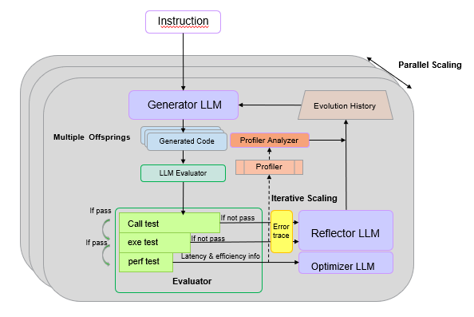
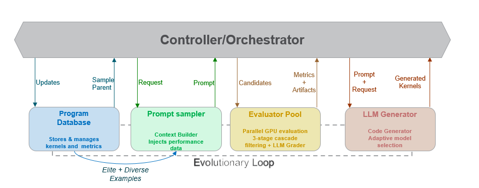

<!---
Copyright (c) 2025 Advanced Micro Devices, Inc. (AMD)

Permission is hereby granted, free of charge, to any person obtaining a copy
of this software and associated documentation files (the "Software"), to deal
in the Software without restriction, including without limitation the rights
to use, copy, modify, merge, publish, distribute, sublicense, and/or sell
copies of the Software, and to permit persons to whom the Software is
furnished to do so, subject to the following conditions:

The above copyright notice and this permission notice shall be included in all
copies or substantial portions of the Software.

THE SOFTWARE IS PROVIDED "AS IS", WITHOUT WARRANTY OF ANY KIND, EXPRESS OR
IMPLIED, INCLUDING BUT NOT LIMITED TO THE WARRANTIES OF MERCHANTABILITY,
FITNESS FOR A PARTICULAR PURPOSE AND NONINFRINGEMENT. IN NO EVENT SHALL THE
AUTHORS OR COPYRIGHT HOLDERS BE LIABLE FOR ANY CLAIM, DAMAGES OR OTHER
LIABILITY, WHETHER IN AN ACTION OF CONTRACT, TORT OR OTHERWISE, ARISING FROM,
OUT OF OR IN CONNECTION WITH THE SOFTWARE OR THE USE OR OTHER DEALINGS IN THE
SOFTWARE.
--->

---

# GEAK-Triton v2 Family of AI Agents: Kernel Optimization for AMD Instinct GPUs

Optimizing GPU kernels is a formidable task, traditionally requiring deep domain expertise and hours of manual tuning. At AMD, we are expanding our [GEAK: Generating Efficient AI-centric GPU Kernels](https://rocm.blogs.amd.com/software-tools-optimization/triton-kernel-ai/README.html) family to automate this entire workflow, from initial code generation to deep performance optimization.

In this blog, we will discuss GEAK-OptimAgentv2 and GEAK-OpenEvolve AI agents for generating [Triton](https://triton-lang.org/main/index.html) [[7]](#ref7) kernels optimized for AMD Instinct™ GPUs. These two new specialized systems that leverage hardware-aware feedback and large-scale evolutionary search to generate and refine high-performance Triton kernels, helping to improve the efficiency of training and inference of AI models. For HIP kernel optimization, check out our companion blog [GEAK-HIP: Expanding GEAK to HIP Code Optimization](https://rocm.blogs.amd.com/software-tools-optimization/geak-hip-optimizations/README.html), which extends the GEAK family to native HIP code generation.

## Key Takeaways:

* We are announcing GEAK-OptimAgentv2 for Instruction-to-Triton, an advanced AI agent for generating kernels from instructions. It now features multi-offspring evolution, an LLM-based evaluator, and a critical hardware-aware feedback loop to guide self-improvement.

* We are also announcing GEAK-OpenEvolve for Triton-to-Triton, a new framework for optimizing existing kernels that uses a Quality-Diversity search to maintain and evolve thousands of diverse, high-quality kernel variants in parallel.

* The GEAK-OptimAgentv2 achieves up to a +9.76% accuracy jump over its predecessor and an average speed up of 3.32x over reference kernels.

* GEAK-OpenEvolve achieves an average speedup of 3.42x over reference kernels from the TritonBench-modified benchmark and a 7.02x speedup over ROCm-bench kernels.


## GEAK-Agents Family: 

 

#### A Quick Look Back

GEAK-Agent [[1]](#ref1) (hereafter referred to as GEAK-OptimAgentv1) introduced several features that established a foundation for a scalable and iterative system capable of generating high-performance Triton kernels:

* **1-shot Prompting**: Retrieves the most similar Triton code samples based on code similarity to ground the generation. 
* **Knowledge Injection**: Enhances prompts with hardware specifications and domain-specific optimization principles to significantly improve code quality. 
* **Reflexion** [[6]](#ref6): A self-correcting loop in which error traces are analyzed by a "reflector" module to iteratively fix bugs and refine code. 
* **LLM Selection**: Allows developers to configure the agent with different models to leverage varying model capabilities. 
* **LLM as Optimizer**: Uses sorted historical performance data from previous runs to guide the model toward better optimization strategies. 
* **Debugging Trap**: Automatically discards strategies that fail repeatedly after a set number of attempts, preventing the agent from getting stuck in a loop. 
* **Parallel Scaling**: Runs multiple independent instances to generate diverse strategies and discover better kernel candidates. 

### GEAK-OptimAgentv2 


```{figure} images/geakv2updated.png
:align: center
:alt: Scaling performance
Figure 1. Overview of GEAK-OptimAgentv2
```
Building on the foundation of GEAK-OptimAgentv1, we announce the release of GEAK-OptimAgentv2, which further pushes the boundaries of kernel generation and optimization.

#### What’s New in GEAK-OptimAgentv2

As shown in Figure 1, [GEAK-OptimAgentv2](https://github.com/AMD-AGI/GEAK-agent/tree/main) introduces three major enhancements that dramatically improve performance and correctness by evolving beyond a single agent's capabilities. 

* **Multi-Offspring Evolution** Instead of producing a single candidate per generation, the agent now spawns multiple "offspring" code variants in parallel. In each iteration, we use the same prompt but ask the LLM to generate multiple times, producing diverse code candidates under the same instruction. Experiments show that this multi-offspring strategy significantly improves code correctness and is fully compatible with the parallel scaling strategy, providing an additional layer of performance boost.  

* **Advanced LLM-based Evaluator:**  The evaluator model scores every candidate across several key dimensions on a scale of 0 to 1, including a. fusion intelligence, b. numerical stability, c. warp/wavefront utilization, etc. By ranking offspring using these evaluation metrics, the system automatically selects the highest-scoring kernel as the next-generation parent. 

* **Profiler-Analyzer (Hardware-Aware Feedback Loop)** To ground the evolutionary process in empirical hardware data, we've integrated the Profiler-Analyzer as a critical feedback loop. 

  * **Hardware Profiling:** When a kernel candidate passes correctness validation, the system invokes rocprof-compute to capture extensive hardware performance telemetry. This provides ground-truth data on hundreds of counters, such as cache hit rates, memory bandwidth utilization, wavefront occupancy, and stall cycles, revealing the kernel's true behavior on silicon. 

  * **The LLM Analyzer:** This raw profiler output, while comprehensive, presents a significant interpretability challenge. The Profiler-Analyzer component addresses this by using a specialized LLM to translate the numerical hardware counter data into "structured natural language performance intelligence." This provides the agent with coherent, expert-level insights (e.g., "the kernel is memory-bound due to poor L2 cache locality") rather than just raw numbers, enabling it to make more effective optimization decisions. 


### GEAK-OpenEvolve 


```{figure} images/geakopenevolve.png
:align: center
:alt: Scaling performance
Figure 2. Overview of GEAK-OpenEvolve
```
[**GEAK-OpenEvolve**](https://github.com/AMD-AGI/GEAK-agent/tree/geak-openevolve) is designed for robustly optimizing existing kernels (Triton-to-Triton). It builds upon the pioneering work of **Google DeepMind's AlphaEvolve** [[2]](#ref2) and its open-source counterpart, **OpenEvolve** [[3]](#ref3), adapting their powerful evolutionary strategies to the domain of high-performance GPU computing. While standard LLM agents often get "stuck" on a single, suboptimal solution, Figure 2 shows how GEAK-OpenEvolve leverages a **population-based evolutionary approach** by maintaining and evolving a massive population of diverse kernel variants, it explores the vast search space of optimizations far more effectively than linear generation methods. 

* **Core Strategy (Quality-Diversity)**:
  * It uses a **Quality-Diversity (QD)** approach, employing MAP-Elites [[5]](#ref5) to maintain a "map" of diverse, high-quality kernels. We introduce a 9 dimensional feature-grid comprising of:

  1. fusion intelligence, 2. autotuning coverage, 3. memory access efficiency, 4. algorithmic complexity, 5. warp wavefront utilization, 6. software pipelining, 7. numerical stability, 8. correctness and portability, 9. optimization scope 

* **Generation Engine (Selection & Creation)**: 

  * It uses a Hybrid Parent Selection strategy to balance exploiting good solutions and exploring new ones. 

* **Prompt Engineering (Context & Feedback)**: 

  * Prompts are enriched with targeted optimization cues—memory coalescing, occupancy, register pressure, shared/LDS usage—and kernel-agnostic guidance such as autotuning and algorithmic refinements, while embedding hardware-specific details (CU topology, LDS limits, MI300X/MI325X characteristics) to anchor improvements to real GPU architecture. The prompts also provide strict guidelines on which warp sizes, block sizes, and launch configurations to explore, following commonly validated optimization strategies from [AMD ROCm’s workload tuning guide](https://rocm.docs.amd.com/en/docs-7.0.2/how-to/rocm-for-ai/inference-optimization/workload.html).
    
* **Evaluation (High-Throughput Pipeline)**: 

  * It uses Cascade Filtering to evaluate kernels efficiently. Candidates are first tested on small inputs, then medium, and finally full-scale inputs. This multi-stage process quickly filters out poor candidates and runs multiple offspring concurrently on separate GPUs to dramatically increase iteration throughput. It then feeds the kernel to an LLM Evaluator which assigns scores of 0 to 1 to kernels on the same 9 "MAP” dimensions as mentioned above.

## Results 

All results presented below are validated by our updated GEAK-eval suite [[4]](#ref4). We have improved its test coverage to ensure strict correctness by adding support for randomized, large-scale input tensors (up to 32K) and halting immediately on any mismatch. This guarantees that all speedups are reported only after their correctness is established. All the results for the tables below were tested with Claude 4 Sonnet, on MI300. 

#### Benchmarks

We evaluate our agents on two benchmarks, updated TritonBench-modified (184 Triton kernels) and ROCm-bench (31 Triton kernels) from [GEAK-eval](https://github.com/AMD-AGI/GEAK-eval) [[4]](#ref4).

### Task 1: Instruction-to-Triton (Generation) 

This task measures the ability of our GEAK-agents to generate correct and performant code from a natural language instruction. We report call_accuracy (the code runs without error) and exec_accuracy (the code passes all unit tests), as well as the speedup of the generated kernel over the reference. 

| **ROCm benchmark**   |      |      |   |
|------------------------|------------------|------------------|---------|
| **Agent**      | **Call accuracy(%)** | **Exec accuracy(%)** | **Speedup** |
| GEAK-OptimAgentv1   | 74.19    | 54.84    | 1.67  |
| GEAK-OptimAgentv2   | 80.65    | 61.29    | 1.74  |

Table 1. Performance of GEAK Agents on ROCm benchmark

| **TritonBench-modified benchmark** |      |      |   |
|-----------------------------------|------------------|------------------|---------|
| **Agent**         | **Call accuracy(%)** | **Exec accuracy(%)** | **Speedup** |
| GEAK-OptimAgentv1      | 60.87    | 53.80    | 4.28  |
| GEAK-OptimAgentv2      | 97.83    | 63.04    | 5.31  |

Table 2. Performance of GEAK Agents on TritonBench-modified benchmark

As we can see from Tables 1 and 2, GEAK-OptimAgentv2 shows significant improvements across both benchmarks. On TritonBench-modified and ROCm Bench execution accuracy improves to 61.29% (+6.45%) and 63.04% (+9.76) respectively. The multi-offspring evolution and LLM-based evaluator contribute to these higher correctness rates and improved speedups.

### Ablation: Impact of Hardware-Aware Feedback on GEAK-OptimAgentv2  

To show the specific impact of GEAK-OptimAgentv2's new hardware-aware feedback loop, the table below breaks down the performance gains across multiple setups- 1. Base OptimAgentv2, 2. OptimAgentv2 with [rocprofv3-compute](https://github.com/ROCm/rocm-systems/tree/develop/projects/rocprofiler-compute) profiler and 3. OptimAgentv2 with rocprofv3-compute and the LLM analyzer 
 

| **Kernel Name**    | **Speedup (OptimAgentv2)** | **Speedup OptimAgentv2 + rocprofv3-compute** | **Speedup OptimAgentv2 + rocprofv3-compute & LLM Analyzer** |
|--------------------------|----------------------------|----------------------------------------------|-------------------------------------------------------|
| matmul_triton2     | 1.45         | 1.44               | 1.73                  |
| sgmv_expand_slice    | 1.69         | 4.45               | 4.74                  |
| add_value      | 1.06         | 1.10               | 1.16                  |
| rmsnorm      | 2.01         | 1.29               | 2.59                  |
| embedding_triton_kernel  | 1.79         | 3.00               | 3.00                  |
| Layer_norm_fwd     | 0.97         | 3.62               | 11.23                 |
| Fast_rms_norm    | 1.49         | 1.98               | 1.44                  |
| Fast_rope_embedding  | 1.02         | 1.82               | 3.2                 |
| Fp4_to_bf16      | 1.40         | 1.39               | 1.40                  |
| Swiglu_backward    | 1.00         | 1.00               | 1.00                  |
| Kldiv_triton     | DNE        | 1.12               | 4.55                  |
| **Avg Speedup**    | **1.38**       | **1.98**             | **3.32**                |

Table 3. Performance With and Without profiler on multiple kernels

As Table 3 indicates, the hardware-aware feedback loop with the profiler and the LLM Analyzer shows substantial impact, with average speedup increasing from 1.38x (base) to 3.32x. Notable gains include Layer_norm_fwd (11.23x) and sgmv_expand_slice (4.74x) from TritonBench-modified.

### Task 2: Triton-to-Triton Optimization 

This task measures the ability of GEAK-OpenEvolve to take an existing Triton kernel and optimize it for maximum performance. We report the success rate (percentage of kernels that achieved a speedup of >1) and average speedup (over the successfully optimized kernels) in the table below.


| **GEAK-OpenEvolve**   |      |      |
|-------------------------|------------------|----------------|
| **Benchmark**     | **Success Rate** | **Avg. Speedup** |
| TritonBench-modified   | 56.01    | 3.42     |
| ROCm benchmark    | 56.67    | 7.02     | 

Table 4. Performance of GEAK-OpenEvolve across multiple benchmarks

As we can see from Table 4, GEAK-OpenEvolve achieves average speedups of 3.42x on TritonBench-modified and 7.02x on ROCm benchmark through evolutionary Quality-Diversity search.

## Case Studies

Below, we present three detailed case studies that illustrate how our GEAK agents optimize real-world kernels: (1) OptimAgentv2 on the LLaMA feedforward kernel, (2) OptimAgentv2 with the Profiler Analyzer on RoPE, and (3) GEAK-OpenEvolve on RMS Norm.

### Case Study #1: OptimAgentv2 vs Baseline on LLaMA feedforward kernel

The **LLaMA feedforward kernel** , the [reference implementation](https://github.com/AMD-AGI/GEAK-eval/blob/master/geak_eval/data/TritonBench/data/TritonBench_G_v1/llama_ff_triton.py) for which is part of the TritonBench-modified, is a core component of the LLaMA architecture. It implements the SwiGLU-based feedforward network (FFN) layer specifically for LLaMA models. The original implementation combines 5 operations, including RMSNorm computation, matrix multiplication with w1, matrix multiplication with w3, SiLU activation and element-wise multiplication.

We applied OptimAgentv2 to the kernel to optimize the performance on an **AMD MI300X GPU**, resulting in a 6.59x speedup. OptimAgentv2 made several optimizations:

* **Memory Access Swizzling**

  * OptimAgentv2 utilized a swizzling pattern to improve cache locality and to reduce bank conflicts.
  * OptimAgentv2 removed modulo operations (%M, %N) that add overhead.
  * As shown below, the reference implementation relies on costly modulo operations for offset calculations, while the optimized version eliminates them through a swizzling pattern:

<div style="overflow-x: auto;">
<table style="min-width:900px; table-layout:fixed;">
<tr>
<th style="width:50%; text-align:left;">Reference Implementation (with Modulo)</th>
<th style="width:50%; text-align:left;">Optimized (with Swizzling)</th>
</tr>
<tr>
<td style="vertical-align:top;">

```python
pid = tl.program_id(axis=0)
pid_m = pid // tl.cdiv(N, BLOCK_SIZE_N)
pid_n = pid % tl.cdiv(N, BLOCK_SIZE_N)

offs_am = (pid_m * BLOCK_SIZE_M + tl.arange(0, BLOCK_SIZE_M)) % M
offs_bn = (pid_n * BLOCK_SIZE_N + tl.arange(0, BLOCK_SIZE_N)) % N


```

</td>
<td style="vertical-align:top;">

```python
pid = tl.program_id(axis=0)
num_pid_n = tl.cdiv(N, BLOCK_SIZE_N)
pid_m = pid // num_pid_n
pid_n = pid % num_pid_n

# Swizzle for better memory access patterns
pid_m_swizzle = (pid_m // 4) * 4 + ((pid_m % 4) + pid_n % 4) % 4

offs_am = pid_m_swizzle * BLOCK_SIZE_M + tl.arange(0, BLOCK_SIZE_M)
offs_bn = pid_n * BLOCK_SIZE_N + tl.arange(0, BLOCK_SIZE_N)
```

</td>
</tr>
</table>
</div>


* **Optimized RMS Norm Computation**

  * Reduced memory footprint: `(BLOCK_SIZE_M, )` vs `(BLOCK_SIZE_M, BLOCK_SIZE_K)`
  * Avoids `pow()` call by using direct multiplication `a*a`
  * Immediate reduction: sums along `axis=1` per iteration instead of storing full matrix
  * The following comparison illustrates how the optimized version uses type-aware handling with immediate reduction, replacing the baseline's full 2D matrix accumulation: 

<div style="overflow-x: auto;">
<table style="min-width:900px; table-layout:fixed;">
<tr>
<th style="width:50%; text-align:left;">Reference Implementation</th>
<th style="width:50%; text-align:left;">Optimized</th>
</tr>
<tr>
<td style="vertical-align:top;">

```python
rms_w_ptrs = rms_w_ptr + tl.arange(0, BLOCK_SIZE_K)[None, :] * stride_rms_w
a_sum = tl.zeros((BLOCK_SIZE_M, BLOCK_SIZE_K), dtype=tl.float32)
for _ in range(0, tl.cdiv(K, BLOCK_SIZE_K)):
    a = tl.load(a_ptrs)
    a_sum += tl.extra.hip.libdevice.pow(a.to(tl.float32), 2)

norm_acc = tl.zeros((BLOCK_SIZE_M,), dtype=tl.float32)
```

</td>
<td style="vertical-align:top;">

```python
for k in range(0, tl.cdiv(K, BLOCK_SIZE_K)):
# ...
# Optimized type handling and norm accumulation
if a.dtype == tl.float16:
# FP16 path: compute norm in FP32, keep scaling in FP16
norm_acc += tl.sum(a.to(tl.float32) * a.to(tl.float32), axis=1)

```

</td>
</tr>
</table>
</div>
 

* **Cache Eviction Policies**

  * The optimized implementation adds explicit `eviction_policy="evict_first"` to all memory loads (input tensors, RMS weights, and weight matrices), whereas the baseline uses no explicit cache management.
  * This instructs the GPU to evict temporary data sooner, keeping hot data like accumulators in cache longer and reducing memory latency.

Besides, OptimAgentv2 also applied some other optimizations, such as extensive autotuning configuration, precomputed masks, separate FP16/FP32 data paths as well as better output handling. The results show OptimAgentv2's optimized version, combining memory access swizzling, optimized RMS norm computation, and cache eviction policies, drastically outperforms the baseline. This comprehensive optimization approach led to a **6.59x speedup** on the LLaMA feedforward kernel.

### Case Study #2: OptimAgentv2 With and Without Profiler Analyzer vs. Baseline 

The **Rotary Position Embedding (RoPE)** kernel , whose [reference implementation](https://github.com/AMD-AGI/GEAK-eval/blob/master/geak_eval/data/TritonBench/data/TritonBench_G_v1/fast_rope_embedding.py) is also part of the TritonBench-modified, is a critical component in modern large language models (LLMs), responsible for injecting rotational positional information into the attention mechanism. While essential, its implementation can become a significant **memory and compute bottleneck** if not optimized for the specific GPU architecture. We tackled this performance challenge on an **AMD MI325X GPU**, by comparing the reference kernel against an enhanced agent guided by AMD GPU profiler data. 

Profiler analysis of the reference kernel (3.06 ms) revealed critical bottlenecks: 

* **Memory Stall:** 87% of all wave cycles were spent waiting for data. 
* **Cache Misses:** The vL1D cache hit rate was only 28-32%. 
* **Low Utilization:** VALU (<u>compute</u>) utilization was at a <u>near-zero</u> 0.01<u>% of</u> peak. 

The root cause was identified as a 2D grid design (`n_rows`, `n_groups`) from the baseline that caused severe thread serialization and cache thrashing. 

The profiler-guided agent discovered and implemented the following targeted optimizations to fix this: 

* **Architectural Transformation (Grid Flattening):**  

    * The agent completely replaced the 2D grid with a 1D flattened grid of (`n_rows` * `n_heads`).  
    * This transformation established a 1:1 mapping for each thread block to a unique (`row`, `head`) pair, eliminating serialization and dramatically improving cache locality.
    * The comparison below shows the progression from the reference 2D grid, through the agent's initial optimization, to the final profiler-guided flattened grid:

<div style="overflow-x: auto;">
<table style="min-width:900px; table-layout:fixed;">
<tr>
<th style="width:33%; text-align:left;">Reference 2D Grid</th>
<th style="width:33%; text-align:left;">Without Profiler</th>
<th style="width:33%; text-align:left;">With Profiler (Flattened)</th>
</tr>
<tr>
<td style="vertical-align:top;">

```python
div, mod = divmod(n_heads, GROUP_SIZE)
n_groups = div + (mod != 0)

_rope_embedding[(n_rows, n_groups)](

```

</td>
<td style="vertical-align:top;">

```python
div, mod = divmod(n_heads, ROPE_GROUP_SIZE)
n_groups = div + (mod != 0)

_rope_embedding[(n_rows, n_groups, )](

```

</td>
<td style="vertical-align:top;">

```python
# Flattened grid for maximum parallelism
grid_size = n_rows * n_heads

_rope_embedding[grid_size,](

```

</td>
</tr>
</table>
</div> 

* **AMD-Specific Memory & Warp Tuning:**  

  * Guided by profiler data on the MI325X cache hierarchy, the agent tuned the kernel launch parameters to achieve optimal wavefront occupancy and memory throughput.  
  * The table below contrasts the hardware-agnostic reference settings with the agent's tuning strategies—both without and with profiler guidance:

<div style="overflow-x: auto;">
<table style="min-width:1100px; table-layout:fixed;">
<tr>
<th style="width:33%; text-align:left;">Reference (Hardware-Agnostic)</th>
<th style="width:33%; text-align:left;">Without Profiler</th>
<th style="width:33%; text-align:left;">With Profiler (AMD-Optimized)</th>
</tr>
<tr>
<td style="vertical-align:top;">

```python
def calculate_settings(n: int) -> (int, int,):
    BLOCK_SIZE = triton.next_power_of_2(n)
    if BLOCK_SIZE > MAX_FUSED_SIZE:
        raise RuntimeError(...)
    num_warps = 4
    if BLOCK_SIZE >= 32768: num_warps = 32
    elif BLOCK_SIZE >= 8192: num_warps = 16
    elif BLOCK_SIZE >= 2048: num_warps = 8
    return BLOCK_SIZE, num_warps


```

</td>
<td style="vertical-align:top;">

```python
def calculate_settings(n: int):
    BLOCK_SIZE = triton.next_power_of_2(n)
    BLOCK_SIZE = max(32, min(BLOCK_SIZE, 2048))
    if BLOCK_SIZE <= 64:
        num_warps = 4
    elif BLOCK_SIZE <= 256:
        num_warps = 8
    elif BLOCK_SIZE <= 1024:
        num_warps = 16
    else:
        num_warps = 32
    return BLOCK_SIZE, num_warps
```

</td>
<td style="vertical-align:top;">

```python
def calculate_settings(n: int):
    """Optimal for AMD GPU architecture."""
    if n <= 32:
        return 128, 16
    elif n <= 64:
        return 256, 16
    elif n <= 128:
        return 512, 32
    else:
        return 1024, 32


```

</td>
</tr>
</table>
</div>

  * The **reference** dynamically calculates block size but is conservative with warp allocation.
  * **Without profiler**, the agent caps block size at 2048 and uses gradual warp scaling.
  * **With profiler**, the agent uses fixed, larger block sizes (128-1024) with more warps, exploiting AMD's architecture.


* **Memory Access Pattern**:  

  * The grid transformation fixed the core memory bottleneck. By moving from a (1 block : N heads) to a (1 block : 1 head) mapping, the agent eliminated the inner loop over heads, which was the source of serialization and poor memory access patterns on the Q tensor.

 **Comparing RoPE Implementation Strategies:**
 
 To demonstrate the optimization progression, we examine how each approach implements the rotary position embedding (RoPE) transformation:
<div style="overflow-x: auto;">
<table style="min-width:1500px; table-layout:fixed;">
<tr>
<th style="width:33%; text-align:left;">Reference Implementation</th>
<th style="width:33%; text-align:left;">Without Profiler</th>
<th style="width:33%; text-align:left;">With Profiler</th>
</tr>
<tr>
<td style="vertical-align:top;">

```python
sin1 = tl.load(sin + (row_position % seqlen)*sin_row_stride + \
      half_head_dim*0 + col_offsets, mask = mask, other = 0)
cos1 = tl.load(cos + (row_position % seqlen)*cos_row_stride + \
    half_head_dim*0 + col_offsets, mask = mask, other = 0)

if BACKWARD_PASS:

sin1 = -sin1

# [TODO] Autotune ROPE_GROUP_SIZE to be 1, 2, 4, 8
head_start = group_head_position * ROPE_GROUP_SIZE
head_end = min((head_start + ROPE_GROUP_SIZE), n_heads)

# 10% Faster kernel from [HuyNguyen-hust](https://github.com/unslothai/unsloth/pull/238)
for k in range(head_start, head_end):
offs_q1 = row_position * Q_row_stride + k * head_dim + col_offsets
offs_q2 = row_position * Q_row_stride + k * head_dim + col_offsets + half_head_dim

# For Gemma - sometimes RoPE must be done in float32 and not bfloat16
Q1 = tl.load(Q + offs_q1, mask = mask, other = 0).to(sin1.dtype)
Q2 = tl.load(Q + offs_q2, mask = mask, other = 0).to(sin1.dtype)

tl.store(Q + offs_q1, Q1*cos1 - Q2*sin1, mask = mask)
tl.store(Q + offs_q2, Q2*cos1 + Q1*sin1, mask = mask)


```

</td>
<td style="vertical-align:top;">

```python
seq_pos = row_position % seqlen
cos_ptr = cos + seq_pos * cos_row_stride + col_offsets
sin_ptr = sin + seq_pos * sin_row_stride + col_offsets

cos_vals = tl.load(cos_ptr, mask=mask, other=0.0)
sin_vals = tl.load(sin_ptr, mask=mask, other=0.0)

if BACKWARD_PASS:
sin_vals = -sin_vals

# Process 4 heads in parallel using thread-level parallelism
GROUP_SIZE = 4
head_start = group_head_position * GROUP_SIZE

# Unroll the loop for parallel processing of 4 heads
for offset in range(GROUP_SIZE):
head_idx = head_start + offset
if head_idx < n_heads:
    # Calculate Q pointers for current head with vectorized access
    q_base = row_position * Q_row_stride + head_idx * head_dim
    q1_ptr = Q + q_base + col_offsets
    q2_ptr = Q + q_base + col_offsets + half_head_dim
    
    # Vectorized loads with type consistency
    Q1 = tl.load(q1_ptr, mask=mask, other=0.0).to(cos_vals.dtype)
    Q2 = tl.load(q2_ptr, mask=mask, other=0.0).to(cos_vals.dtype)
    
    # Apply RoPE transformation with fused operations
    Q1_new = Q1 * cos_vals - Q2 * sin_vals
    Q2_new = Q2 * cos_vals + Q1 * sin_vals
    
    # Vectorized stores
    tl.store(q1_ptr, Q1_new, mask=mask)
    tl.store(q2_ptr, Q2_new, mask=mask)


```

</td>
<td style="vertical-align:top;">

```python
# Memory tiling: Load cos/sin values into shared memory for reuse
 cos_base_idx = (row_position % seqlen) * cos_row_stride
 sin_base_idx = (row_position % seqlen) * sin_row_stride
 
 # Prefetch cos/sin values with vectorized loads
 cos_ptr = cos + cos_base_idx + col_offsets
 sin_ptr = sin + sin_base_idx + col_offsets
 
 cos_vals = tl.load(cos_ptr, mask=mask, other=0.0)
 sin_vals = tl.load(sin_ptr, mask=mask, other=0.0)
 
 if BACKWARD_PASS:
   sin_vals = -sin_vals
 
 # Optimized Q tensor access with better memory coalescing
 q_base_offset = row_position * Q_row_stride + head_idx * head_dim
 
 # Vectorized Q loads with prefetching
 q1_ptr = Q + q_base_offset + col_offsets
 q2_ptr = Q + q_base_offset + col_offsets + half_head_dim
 
 q1_vals = tl.load(q1_ptr, mask=mask, other=0.0)
 q2_vals = tl.load(q2_ptr, mask=mask, other=0.0)
 
 # Ensure consistent data types for optimal vectorization
 q1_vals = q1_vals.to(cos_vals.dtype)
 q2_vals = q2_vals.to(cos_vals.dtype)
 
 # Fused RoPE transformation with vectorized operations
 cos_q1 = q1_vals * cos_vals
 cos_q2 = q2_vals * cos_vals
 sin_q1 = q1_vals * sin_vals
 sin_q2 = q2_vals * sin_vals
 
 new_q1 = cos_q1 - sin_q2
 new_q2 = cos_q2 + sin_q1
 
 # Vectorized stores with optimal memory alignment
 tl.store(q1_ptr, new_q1, mask=mask)
 tl.store(q2_ptr, new_q2, mask=mask)
```

</td>
</tr>
</table>
</div>
As we can see:

* The original implementation uses a straightforward loop-based approach with inline calculations.
* Without profiler guidance, the agent focuses on pointer optimization and parallel head processing.
* With the profiler's insights, the agent optimizes for AMD's memory hierarchy with explicit operation decomposition.


| **Evaluation of Profiler-Guided Agent on RoPE kernel** |      |
|---------------------------------------------------------|------------------|
| **Version**               | **Speedup Ratio** |
| OptimAgentv2                | 1.02×    |
| OptimAgentv2 + Profiler Analyzer        | 3.12×    |

Overall, integrating the GPU profiler allowed the agent to diagnose the 87% memory stall and 32% L1 hit rate, leading to a targeted, single-iteration architectural fix. This data-driven approach resulted in a 3.12x speedup, proving far more effective than iterative heuristic tuning.


### Case Study#3: GEAK-OpenEvolve vs Baseline on RMS Norm  

The **RMS LayerNorm kernel** ,the [reference implementation](https://github.com/AMD-AGI/GEAK-eval/blob/master/geak_eval/data/TritonBench/data/TritonBench_G_v1/fast_rms_layernorm.py) whose reference implementation is also part of the TritonBench-modified, is a core component of the LLaMA architecture kernel and a critical memory-bandwidth-bound operation in LLMs. The baseline implementation suffered from a fundamental design flaw:  it assumed all input data could fit within a single thread block by setting BLOCK_SIZE = triton.next_power_of_2(N). For large hidden dimensions (N > 4096), this exceeded GPU hardware limits, causing crashes or severe performance degradation.

We applied an agent to optimize this kernel on an **AMD MI325X GPU**, resulting in a new version. The agent identified several key bottlenecks and implemented targeted, high-impact optimizations:

* **Triton Autotuning**:  

  * The agent replaced the naive BLOCK_SIZE = triton.next_power_of_2(N) with a sophisticated @triton.autotune configuration testing 22 combinations of block sizes (32-8192), warp counts (1-16), and pipeline stages (1-4):

  * The agent-optimized tuning logic is written as follows:

  ```python
  @triton.autotune(
    configs=[
    # Very small blocks for tiny tensors - optimized for single-pass execution
    triton.Config({'BLOCK_N_SIZE': 32}, num_warps=1, num_stages=4),
    triton.Config({'BLOCK_N_SIZE': 64}, num_warps=1, num_stages=4),
    triton.Config({'BLOCK_N_SIZE': 64}, num_warps=2, num_stages=3),
    
    ...
    
    # Additional specialized configs for common tensor sizes
    triton.Config({'BLOCK_N_SIZE': 512}, num_warps=1, num_stages=2),
    triton.Config({'BLOCK_N_SIZE': 1024}, num_warps=1, num_stages=2),
    ],
    key=['N_SIZE']
  )
  ```

* **Adaptive Algorithm: Single-Pass vs Two-Pass**:  
 
  * The agent's most impressive innovation was discovering an adaptive branching strategy. 
  * For small sequences that fit in one block, it loads data once and computes variance + normalization in a single fused pass, saving 50% memory bandwidth. For larger sequences, it uses a blocked two-pass algorithm to stay within hardware limits. 
  * As shown below, the reference uses a two-loop approach that reads data twice, while the optimized version fuses these operations into a single pass when possible:

<div style="overflow-x: auto;">
<table style="min-width:1100px; table-layout:fixed;">
<tr>
<th style="width:50%; text-align:left;">Reference</th>
<th style="width:50%; text-align:left;">Optimized</th>
</tr>
<tr>
<td style="vertical-align:top;">

  ```python
  var = tl.zeros((BLOCK_N_SIZE,), tl.float32)
  
  for block_n_start_idx in range(0, N_SIZE, BLOCK_N_SIZE):
    offs_n = block_n_start_idx + block_N
    x_ptr_mask = offs_n < N_SIZE
    x = tl.load(x_ptr + offs_m + offs_n * stride_x_k, mask=x_ptr_mask, other=0.0)
    var += tl.extra.hip.libdevice.pow(x.to(tl.float32), 2)
  
  var = tl.sum(var, axis=0) / N_SIZE
  rstd = tl.math.rsqrt(var + eps)
  
  # multiply by weight and add bias
  for block_n_start_idx in range(0, N_SIZE, BLOCK_N_SIZE):
    offs_n = block_n_start_idx + block_N
    x_ptr_mask = offs_n < N_SIZE
    rms_w = tl.load(rms_w_ptr + offs_n * stride_rms_w, mask=x_ptr_mask)
    
    x = tl.load(x_ptr + offs_m + offs_n * stride_x_k, mask=x_ptr_mask, other=0.0).to(tl.float32)
    x_hat = x * rstd
    out = x_hat * rms_w
    out_off = pid_batch * stride_out_batch + pid_m * stride_out_m + offs_n * stride_out_k
    tl.store(output_ptr + out_off, out, mask=x_ptr_mask)


  ```

</td>
<td style="vertical-align:top;">

  ```python
  # For small sequences, we can load everything at once
  if N_SIZE <= BLOCK_N_SIZE:
    # Single block case - truly single pass
    offs_n = block_N
    x_ptr_mask = offs_n < N_SIZE
    
    # Load all data once
    x = tl.load(x_ptr + offs_m + offs_n * stride_x_k, mask=x_ptr_mask, other=0.0).to(tl.float32)
    rms_w = tl.load(rms_w_ptr + offs_n * stride_rms_w, mask=x_ptr_mask, other=1.0)
    
    # Compute variance with numerically stable masking
    x_squared = x * x
    var_sum = tl.sum(tl.where(x_ptr_mask, x_squared, 0.0))
    var = var_sum / N_SIZE
    rstd = tl.math.rsqrt(var + eps)
    
    # Apply normalization and weight
    out = x * rstd * rms_w
    
    # Store result
    out_off = pid_batch * stride_out_batch + pid_m * stride_out_m + offs_n * stride_out_k
    tl.store(output_ptr + out_off, out, mask=x_ptr_mask)
  else:
    # Multi-block case - use shared memory to minimize global memory traffic
  ```

</td>
</tr>
</table>
</div>

* **Numerical Optimizations**:  
  * The agent also improved numerical stability by replacing the standard inverse square root with a dedicated GPU instruction, as shown below:

<div style="overflow-x: auto;">
<table style="min-width:800px; table-layout:fixed;">
<tr>
<th style="width:50%; text-align:left;">Reference Implementation</th>
<th style="width:50%; text-align:left;">Optimized</th>
</tr>
<tr>
<td style="vertical-align:top;">

  ```python
  1 / tl.sqrt(var + eps)
  ```

</td>
<td style="vertical-align:top;">

  ```python
  tl.math.rsqrt(tl.maximum(var + eps, eps))
  ```

</td>
</tr>
</table>
</div>

  * Uses `rsqrt` - a dedicated GPU instruction that is both faster and more numerically stable 
  * Wraps with `tl.maximum()` to prevent potential issues with denormal numbers. 

The results show that the agent's optimized version, combining dynamic autotuning with an adaptive pass, drastically outperforms the baseline. This data-driven approach led to a 6.58x speedup.


## Summary

The GEAK-Triton v2 family represents a leap forward in AI-driven GPU kernel optimization. GEAK-OptimAgentv2 , along with its version with hardware-aware feedback loop, helps achieve significant improvements in Execution Accuracy and speedups. GEAK-OpenEvolve pushes the boundary for kernel optimization with Quality-Diversity evolutionary search, specifically targeting speed optimization and the creation of high performance GPU kernels.

These results validate our hypothesis that combining AI-driven code generation with hardware awareness and large-scale evolutionary exploration can aid in the development of high performing GPU kernels which has traditionally required extensive manual expertise. By fully open-sourcing both agents and their corresponding code, we aim to accelerate innovation in GPU kernel development across the community. We invite developers, researchers, and AI practitioners to explore GEAK-OptimAgentv2 and GEAK-OpenEvolve, contribute improvements, and help push the frontiers of what's possible in automated performance optimization for AMD Instinct™ GPUs and beyond.

For developers working with native HIP kernels, we also recommend exploring our companion blog [GEAK-HIP: Expanding GEAK to HIP Code Optimization](https://rocm.blogs.amd.com/software-tools-optimization/geak-hip-optimizations/README.html), which applies similar AI-driven optimization techniques to HIP code generation and optimization.

## References

<a id="ref1"></a>[1] [GEAK: Introducing Triton Kernel AI Agent & Evaluation Benchmarks — ROCm Blogs](https://rocm.blogs.amd.com/software-tools-optimization/triton-kernel-ai/README.html)

<a id="ref2"></a>[2] [AlphaEvolve: A Gemini-powered coding agent for designing advanced algorithms - Google DeepMind](https://deepmind.google/blog/alphaevolve-a-gemini-powered-coding-agent-for-designing-advanced-algorithms/)

<a id="ref3"></a>[3] [algorithmicsuperintelligence/openevolve: Open-source implementation of AlphaEvolve](https://github.com/algorithmicsuperintelligence/openevolve/tree/main)

<a id="ref4"></a>[4] [AMD-AGI/GEAK-eval](https://github.com/AMD-AGI/GEAK-eval)

<a id="ref5"></a>[5] [MAP-Elites: Illuminating Search Space by Illuminating Archive of Generated Individuals](https://arxiv.org/abs/1504.04909)

<a id="ref6"></a>[6] [Reflexion: Language Agents with Verbal Reinforcement Learning](https://arxiv.org/abs/2303.11366)

<a id="ref7"></a>[7] [Triton: An Intermediate Language and Compiler for Tiled Neural Network Computations](https://www.eecs.harvard.edu/~htk/publication/2019-mapl-tillet-kung-cox.pdf)


## Bias, Risks & Limitations

* The agent code is being released for research purposes only and is not intended for use cases that require high levels of factuality, safety-critical situations, health, or medical applications, generating false information, or facilitating toxic conversations.

* The agent code is made accessible without any assurances of safety. Users must conduct comprehensive evaluations and implement safety filtering mechanisms as per their respective use cases.

* It may be possible to prompt the agent to generate content that may be factually inaccurate, harmful, violent, toxic, biased, or otherwise objectionable. Such content may also be generated by prompts that were not intended to produce output as such. Users are therefore requested to be aware of this and exercise caution and responsible thinking when using it.

* Multilingual abilities have not been tested; therefore, the agent may misunderstand and generate erroneous responses when prompted using different languages.

## License
Apache 2.0

## Acknowledgements
We would like to acknowledge the following folks for constructive discussions and feedback during this work - Sharon Zhou, Vincent Ouyang, Sina Rafati, Arseny Moskvichev, Alan Lee, Peng Sun, Vinayak Gokhale, Jason Furmanek, Sharunas Kalade, Graham Schelle, Sampsa Rikonen, Doug Lehr, Zhaoyi Li, Yonatan Dukler, Vikram Appia, Arseny Moskvichev, Stephen Youn, and Steve Reinhardt.

## System Configuration

All performance benchmarks were conducted using the following hardware and software configuration:

| Component | Specification |
|-----------|---------------|
| **GPU** | AMD Instinct™ MI300X (192GB HBM3) |
|  | AMD Instinct™ MI325X (256GB HBM3E) |
| **ROCm** | 6.4.3 |
| **Host OS** | Ubuntu 24.04.3 LTS |
| **Python** | 3.12+ |
| **PyTorch** | 2.4+ (ROCm) |
| **Triton** | 3.3.0 |


## Disclaimers
Third-party content is licensed to you directly by the third party that owns the content and is not licensed to you by AMD. ALL LINKED THIRD-PARTY CONTENT IS PROVIDED “AS IS” WITHOUT A WARRANTY OF ANY KIND. USE OF SUCH THIRD-PARTY CONTENT IS DONE AT YOUR SOLE DISCRETION AND UNDER NO CIRCUMSTANCES WILL AMD BE LIABLE TO YOU FOR ANY THIRD-PARTY CONTENT. YOU ASSUME ALL RISK AND ARE SOLELY RESPONSIBLE FOR ANY DAMAGES THAT MAY ARISE FROM YOUR USE OF THIRD-PARTY CONTENT.
