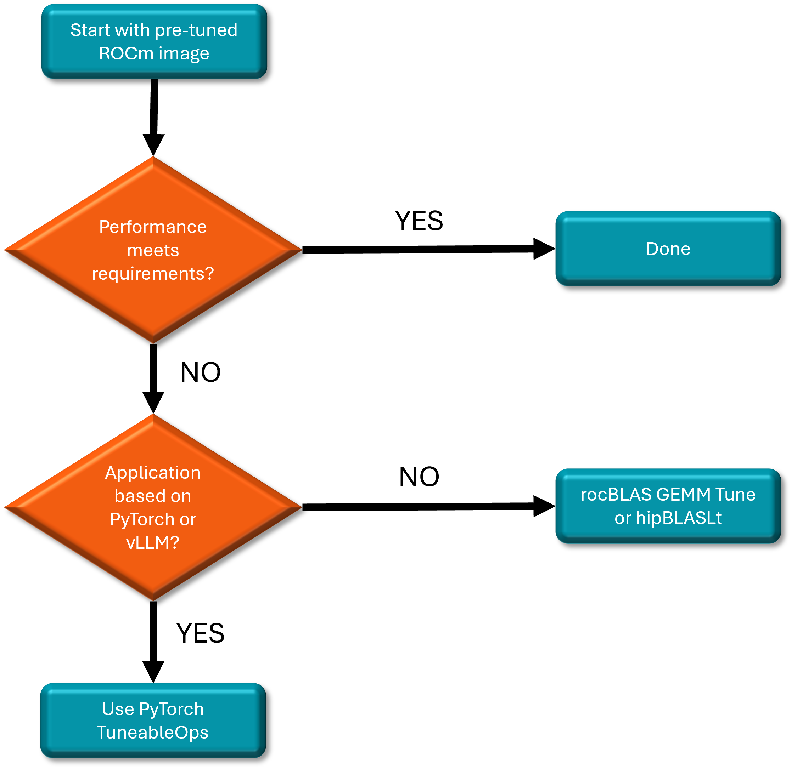

# GEMM Kernel Optimization For AMD GPUs

Matrix multiplication underlies critical computational pathways in AI, with General Matrix Multiplication (GEMM) operations serving as performance-critical kernels in neural network architectures. From fully connected layers to convolutions and transformer attention mechanisms, GEMMs consume substantial computational and memory resources in large language models (LLMs). This blog explores GEMM optimization techniques for AMD GPUs, demonstrating methodologies to significantly enhance computational efficiency and performance scaling.

## ROCm software tools for GEMM Tuning

To assist AMD GPU developers in efficiently discovering the best GEMM solutions, the ROCm software suite offers multiple tools designed to tune GEMM operation performance. Developers can select the appropriate tool based on their specific use case, as illustrated in the diagram below.



Let’s dive into the various GEMM tuning tools available for AMD GPU developers to use.

## GEMM Tuning Techniques on AMD Instinct GPUs

### Technique 1: Optimizing Performance with Pre-Tuned GEMM Operations

AMD provides an optimized [ROCm docker](https://hub.docker.com/r/rocm/vllm/tags) for an out-of-the-box experience including a pre-tuned GEMM, in [the vLLM docker](https://hub.docker.com/r/rocm/vllm/tags.). This rocm/vllm Docker has already integrated the pre-tuned GEMM solution with BLAS libraries, supporting most GEMM shapes for LLM inference. We highly recommend GPU developers to try AMD optimized Docker first.

**To get started, follow the detail steps below:**

1). Pull the optimized docker image from the [ROCm/vLLM Docker Hub](https://www.amd.com/en/developer/resources/technical-articles/how-to-use-prebuilt-amd-rocm-vllm-docker-image-with-amd-instinct-mi300x-accelerators.html) website.

```bash
docker pull rocm/vllm:rocm6.3.1_mi300_ubuntu22.04_py3.12_vllm_0.6.6
```

2). Run the LLM performance benchmark using the vLLM benchmarking tool. Since the pre-tuned GEMM configuration files (.csv) are integrated into the optimized Docker, use the vLLM benchmarking tool, it automatically utilize the pre-tuned GEMM for optimal performance. We use vllm latency benchmarking tool as the example, and the detailed info of vllm benchmarking tool can be found from [vLLM benchmark](https://github.com/vllm-project/vllm/tree/main/benchmarks).

```bash
 python /app/vllm/benchmarks/benchmark_latency.py \
 --model ${model_path} \
 --trust-remote-code \
 --num-iters-warmup 3 \
 --num-iters 5 \
 --dtype float16 \
 --input-len {in_len} \
 --output-len {out_len} \
 --batch-size ${bs} \
 --tensor-parallel-size ${tp_nums} \
 --num-scheduler-steps 10
```

### Technique 2: Optimizing Performance with PyTorch TunableOp (Framework Level GEMM Tuning)

PyTorch TunableOp provides a GEMM tuning wrapper for both rocBLAS and hipBLASLt. Instead of relying on default GEMMs, TunableOp automatically searches for the optimal solution by querying the underlying BLAS library for all available solutions for a given GEMM, benchmarking each one, and selecting the fastest. The chosen solution is then stored on disk for use in subsequent runs.

For applications leveraging popular frameworks like PyTorch and vLLM, users can leverage PyTorch TunableOp online tuning. This process allows tuning to occur seamlessly while running training or inference workloads, requiring only a few environment setting adjustments. Detailed information about these environment variables can be found from PyTorch [TunableOp](https://github.com/ROCm/pytorch/tree/tunablegemm/aten/src/ATen/cuda/tunable).

To optimize performance with tuned GEMM operations at the framework level, follow below steps:

1). Configure the related settings to enable PyTorch TunableOp

```bash
export PYTORCH_TUNABLEOP_ENABLED=1
export PYTORCH_TUNABLEOP_TUNING=1
export PYTORCH_TUNABLEOP_VERBOSE=1
export PYTORCH_TUNABLEOP_FILENAME=/dockerx/tunableop-config.csv
```

2). GEMM tuning results will be saved to above tunableop-config.csv file. The GEMM tuning, described in the CSV file, will be integrated into the specific workload associated with your application.
3). Now, turn off tuning before running your application.

```bash
export PYTORCH_TUNABLEOP_ENABLED=1
export PYTORCH_TUNABLEOP_TUNING=0
export PYTORCH_TUNABLEOP_VERBOSE=1
export PYTORCH_TUNABLEOP_FILENAME=/dockerx/tunableop-config.csv
```

4). Run your application. The tuning result integration will work automatically. With native PyTorch support for AMD ROCm, developers can seamlessly leverage the PyTorch TuneableOps flow. In our experiments, this approach has yielded over 20% performance improvement in GEMM operations. Developers can check the details from [TunableOp Blog](https://rocm.blogs.amd.com/artificial-intelligence/pytorch-tunableop/README.html).If developers meet questions or issues about TunableOp GEMM tuning,please submit them in [PyTorch issues](https://github.com/pytorch/pytorch/issues).

### Technique 3: Optimizing Performance with Tuned GEMM Operations at Ops/Library Level

AMD offers **rocBLAS**, the AMD library for Basic Linear Algebra Subprograms (BLAS), internally uses [Tensile](https://github.com/ROCm/Tensile), which supplies the high-performance implementation of GEMM. Additionally, [hipBLASLt](https://github.com/ROCm/hipBLASLt) is a library that provides general matrix-matrix operations.  

Based on a developer’s preference they can choose either of the two Ops/Librariesfor GEMM tuning tools, [rocBLAS](https://rocm.docs.amd.com/projects/rocBLAS/en/latest/index.html) tuning tool (rocblas-gemm-tune) or [hipBLASLt](https://rocm.docs.amd.com/projects/hipBLASLt/en/latest/) tuning tool (hipblaslt-bench).

First, use the logging scheme of either rocBLAS or hipBLASLt (depending on the library in use) to capture the required GEMM shape information. Then, apply the respective GEMM tuning tools (rocblas-gemm-tune or hipblaslt-bench) to optimize performance.

#### GEMM Tuning with rocblas-gemm-tune

The rocblas-gemm-tune tool works by using Tensile to heuristically search through various kernel parameters in order to find the optimal configuration that provides high GPU performance for performing GEMM operations.

**The detail steps are as below**:

1). **Installing/rocBLAS Setup**: In the ROCm Docker image, the rocBLAS library is pre-installed but if the rocBLAS client related executable bin files (`rocblas-bench` and `rocblas-gemm-tune`) are not pre-installed, you may need to build them from source code.

2). **Generating GEMM Problem Sizes**: rocBLAS provides the logging scheme to dump GEMM shapes info for further performance tuning, which is enabled by rocBLAS environment settings.

    - Environment variable `ROCBLAS_LAYER=4` turns on log_profile, and outputs a YAML description of each rocBLAS function called, along with its arguments and number of times it is called. This list of entries can be used directly as input to `rocblas-gemm-tune` utility to do performance tuning.

    - Use environment variable `ROCBLAS_LOG_PATH` to set the full path name for all logs, and store the grabbed GEMM shapes information into a YAML file, `ROCBLAS_LOG_PATH=~/dir/rocblas_gemms.YAML`

   By using the two settings described above, developers can yield the GEMM shape information.

```bash
ROCBLAS_LAYER=4 ROCBLAS_LOG_PATH=./rocblas_gemm.YAML ./gemm-app
```

3). **GEMM Tuning with rocblas-gemm-tune**: At this stage, use the dumped YAML file to run GEMM tuning by running rocblas-gemm-tune. The sample command:

    ```bash
    /opt/rocm/bin/rocblas-gemm-tune --YAML /home/rocblas_gemms.YAML
    ```

    Running this will output the fastest solutions for each GEMM in the YAML file. Each solution is identified by an unique solutions index. It generates a CSV file by aggregating the output solution index, and the CSV file form looks like:

```bash
transA,transB,M,N,batch_count,K,alpha,beta,lda,ldb,ldc,input_type,output_type,comput_type,solution_index 
N, N, 320,588,1,4096,1,0,320,6144,320,f32_r,f32_r,f32_r,3788 
N, N, 512,3096,1,512,1,0,512,512,512,f16_r,f16_r,f16_r,4566
```

4). **Integration**: Now we have a list of faster solutions for all the GEMM problems, users can integrate this into the application, to pick these faster implementations in rocBLAS by setting the environment variable. Use below example command:

```bash
export ROCBLAS_TENSILE_GEMM_OVERRIDE_PATH = csv_file_path
```

If developers meet questions or issues about rocblas-gemm-tune,please submit them in [rocBLAS issues](https://github.com/ROCm/rocBLAS/issues).

#### GEMM Tuning with hipblaslt-bench

hipBLASLt-bench is another GEMM tuning tool within hipBLASLt library and can be used to search the best-performing GEMM kernel for a given set of GEMM problems.

To use hipBLASLt, follow below steps:

1). **Installing hipBLASLt**: In the ROCm Docker image, the hipBLASLt library is pre-installed, however the hipBLASLt client executables, such as `hipblaslt-bench`, may not be included by default and you may need to build these executables from source.

2). **Generating GEMM Problem Size**: Similar with rocBLAS, hipBLASLt can also dump the required GEMM problem/shape sizes by its own logging scheme. Detailed info about hipBlASLt logging scheme in [logging-heuristics](https://rocm.docs.amd.com/projects/hipBLASLt/en/develop/logging-heuristics.html#logging-heuristics). Use below sample command to generate the GEMM problem sized YAML file:

```bash
HIPBLASLT_LOG_MASK=32 HIPBLASLT_LOG_FILE=log_file_name.log ./application_bin
```

To organize the output logs further, you can get unique calls with call counts like below shell command:

```bash
cat log_file_name.log | sort | uniq -c > unique_log_file.log
```

3). **GEMM Tuning with hipblaslt-bench**: Set the environment variable `HIPBLASLT_TUNING_FILE=<file_name>` to tune and store the
 tuning result of the best solution indices for the GEMM problems. The <file_name> points to the tuning file. GEMM tuning will be
 completed by launching hipblaslt-bench, which input parameters can be set according to the log file of step 2.

 A sample command to save file with below user-defined name in the current working directory:

```bash
export HIPBLASLT_TUNING_FILE=tuning.txt
```

```bash
/opt/rocm/bin/hipblaslt-bench --api_method c -m 28672 -n 8192 -k 8192 --lda 8192 --ldb 8192 --ldc 28672 --ldd 28672 --stride_a 0 --stride_b 0 --stride_c 0 --stride_d 0 --alpha 1.000000 --beta 0.000000 --transA T --transB N --batch_count 1 --scaleA 1 --scaleB 1 --a_type f8_r --b_type bf8_r --c_type bf16_r --d_type bf16_r --scale_type f32_r --bias_type f32_r --compute_type f32_r --initialization trig_float -i 100 -j 100 --flush --rotating 512 --algo_method all
```

4). **Integration**:

Unset tuning file name once tuning is complete:

```bash
unset HIPBLASLT_TUNING_FILE
```

Override the hipBLASLt library with the tuned file info:

```bash
export HIPBLASLT_TUNING_OVERRIDE_FILE=tuning.txt
```

Now we can replace the default GEMM kernel with the tuned GEMM kernel.If developers meet questions or issues about hipblaslt-bench GEMM tuning,please submit them in [hipBLASLt issues](https://github.com/ROCm/hipBLASLt/issues).

## Summary

Given the pivotal role of GEMM operations in AI workloads, particularly for LLM applications, AMD offers a suite of powerful tuning tools, including rocblas-gemm-tune, hipblaslt-bench, and PyTorch TuneableOps. These tools provide GPU developers with the flexibility to optimize GEMM performance, allowing precise fine-tuning for maximum efficiency on AMD GPUs. By leveraging these resources, developers can enhance workload performance, ensuring optimal execution and superior results in AI-driven tasks.

## Additional Resources

Optimized docker hub: <https://hub.docker.com/r/rocm/vllm/tags>

Optimized docker image: rocm/vllm:rocm6.3.1_mi300_ubuntu22.04_py3.12_vllm_0.6.6

The opimized docker blog: <https://www.amd.com/en/developer/resources/technical-articles/how-to-use-prebuilt-amd-rocm-vllm-docker-image-with-amd-instinct-mi300x-accelerators.html>

PyTorch TunableOp: <https://pytorch.org/docs/stable/cuda.tunable.html>

[Improve Performance :Accelerating models on ROCm using PyTorch TunableOp — ROCm Blogs](https://rocm.blogs.amd.com/artificial-intelligence/pytorch-tunableop/README.html)

rocBLAS: <https://rocm.docs.amd.com/projects/rocBLAS/en/latest/index.html>

hipBLASLt: <https://rocm.docs.amd.com/projects/hipBLASLt/en/latest/>
