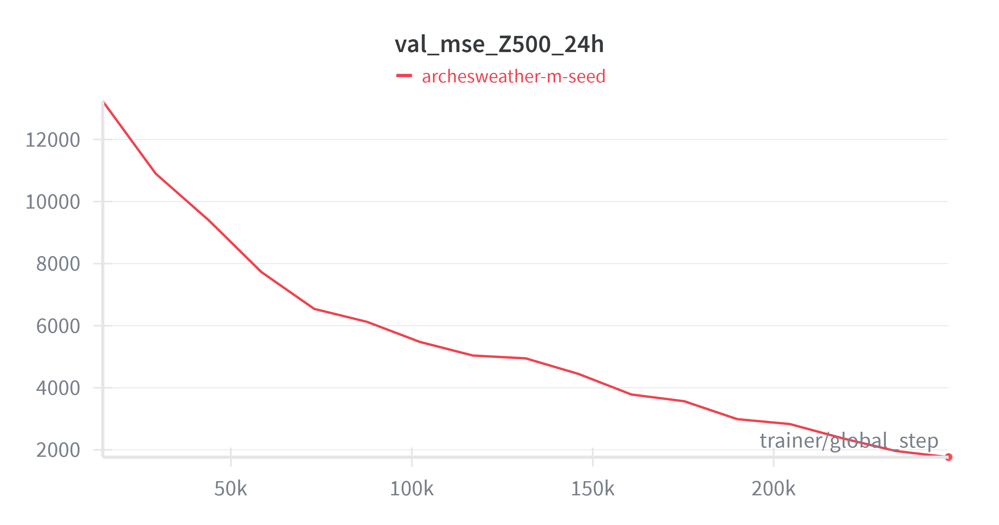
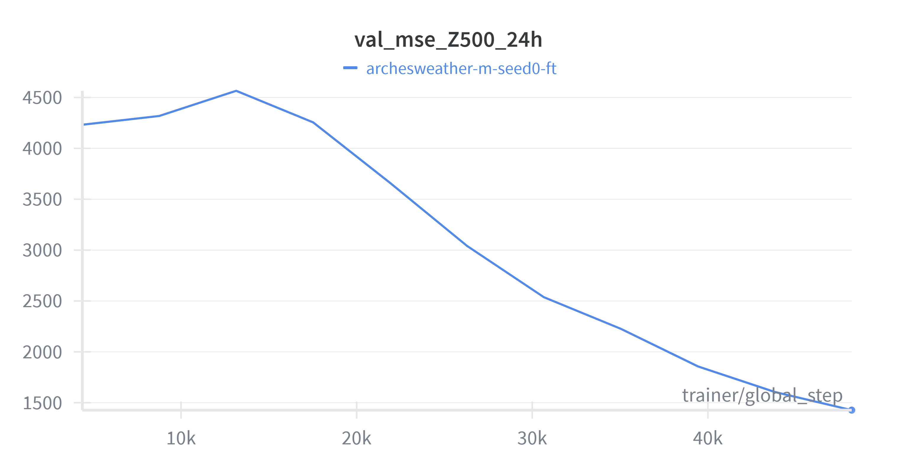
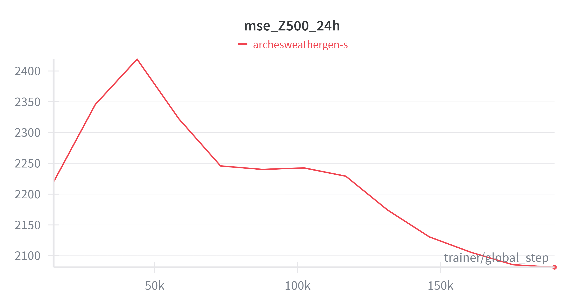
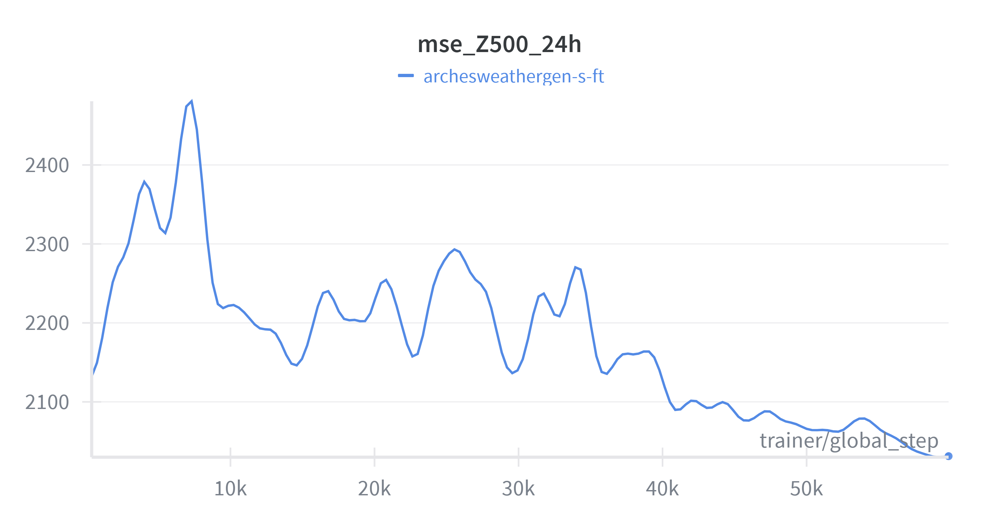
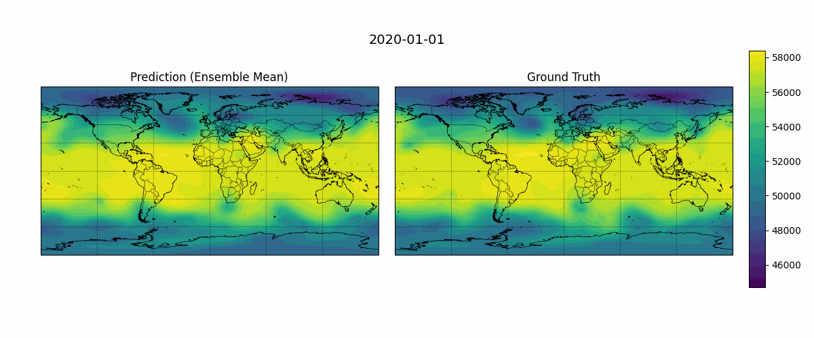
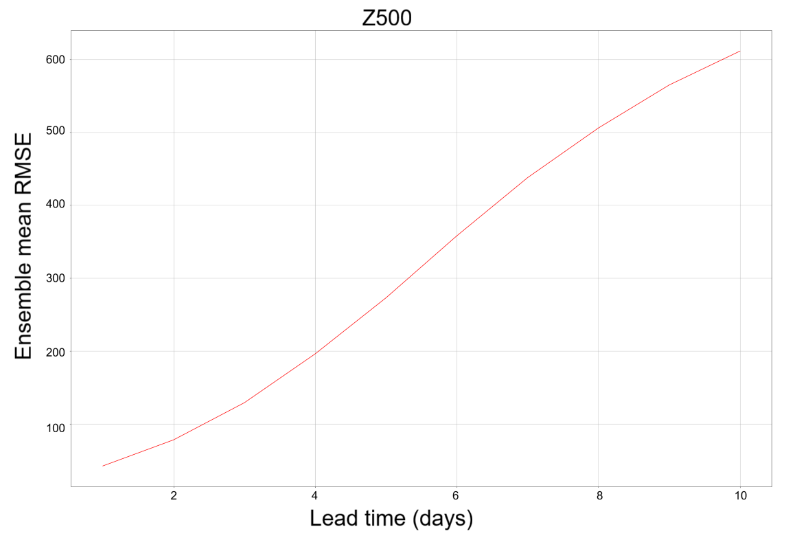

<!---
Copyright (c) 2025 Advanced Micro Devices, Inc. (AMD)

Permission is hereby granted, free of charge, to any person obtaining a copy
of this software and associated documentation files (the "Software"), to deal
in the Software without restriction, including without limitation the rights
to use, copy, modify, merge, publish, distribute, sublicense, and/or sell
copies of the Software, and to permit persons to whom the Software is
furnished to do so, subject to the following conditions:

The above copyright notice and this permission notice shall be included in all
copies or substantial portions of the Software.

THE SOFTWARE IS PROVIDED "AS IS", WITHOUT WARRANTY OF ANY KIND, EXPRESS OR
IMPLIED, INCLUDING BUT NOT LIMITED TO THE WARRANTIES OF MERCHANTABILITY,
FITNESS FOR A PARTICULAR PURPOSE AND NONINFRINGEMENT. IN NO EVENT SHALL THE
AUTHORS OR COPYRIGHT HOLDERS BE LIABLE FOR ANY CLAIM, DAMAGES OR OTHER
LIABILITY, WHETHER IN AN ACTION OF CONTRACT, TORT OR OTHERWISE, ARISING FROM,
OUT OF OR IN CONNECTION WITH THE SOFTWARE OR THE USE OR OTHER DEALINGS IN THE
SOFTWARE.
--->

# Training AI Weather Forecasting Models on AMD Instinct

Weather forecasting is one of the most computationally intensive scientific challenges and an essential societal need. Predicting extreme weather events, agricultural and energy planning and daily forecasts all require accurate weather predictions. Traditionally, Numerical Weather Prediction (NWP) has served as the foundation of weather forecasting by solving complex physical equations that require significant computational power. However, recent advances in machine learning have led to the development of alternative prediction models that reduce computational costs by orders of magnitude, while either maintaining or improving accuracy in forecasts. Models like GenCast [[1]](#1), Pangu-Weather [[2]](#2), Aurora [[3]](#3) and others have shown promising results in this area (see the WeatherBench [[4]](#4) [scorecard](https://sites.research.google/gr/weatherbench/scorecards-2020/)). Running inference on these models using AMD GPUs is straightforward, as highlighted in our recent blog post: [Running SOTA AI-based Weather Forecasting models on AMD Instinct](https://rocm.blogs.amd.com/artificial-intelligence/ai-weather-forecasting/README.html).

Predicting the weather with complete accuracy is quite challenging. As a result, modern weather forecasting systems include both deterministic forecasts, such as the IFS HRES developed by the [European Centre for Medium-Range Weather Forecasts (ECMWF)](https://www.ecmwf.int/), and ensemble forecasts, like the IFS ENS (ECMWF), which focus on developing multiple scenarios for future atmospheric conditions. A similar distinction exists in modern AI-based weather forecasting, where deterministic models produce a single best estimate of the future atmospheric state, while generative models learn to represent the distribution of possible future states. In practice, this allows us to sample multiple future states, forming an ensemble of forecasts. While deterministic models are powerful, ensembles can capture a wider range of possibilities and uncertainties, leading to more robust predictions.

In this blog, we will extend our work by training an example of deterministic models, ArchesWeather [[5]](#5) and an example of a generative model ArchesWeatherGen [[5]](#5) using the open-source geoarches [[6]](#6) package on AMD Instinct MI300X GPUs. Following the geoarches documentation and the ArchesWeather & ArchesWeatherGen paper [[5]](#5), we will reproduce a full end-to-end training pipeline. However, we will leave the task of exploring optimizations on the AMD GPU for future work.

## Models Overview

The ArchesWeather & ArchesWeatherGen paper [[5]](#5) introduces several improvements over Pangu-Weather [[2]](#2) and is computationally orders of magnitude cheaper than larger models like GenCast [[1]](#1) and Aurora [[3]](#3), while maintaining competitive accuracy on WeatherBench (see the [scorecard](https://sites.research.google/gr/weatherbench/scorecards-2020/)) [[4]](#4). The ArchesWeather family of models operates at 1.5° resolution and is trained on ERA5 reanalysis data [[7]](#7), which was produced by the ECMWF. Each data sample represents a 3D state of the atmosphere with 6 upper air variables (temperature, geopotential, specific humidity, wind components U, V and W) on 13 pressure levels and 4 surface variables (2m temperature, mean sea level pressure, 10m wind U and V). See [ECMWF parameter database](https://codes.ecmwf.int/grib/param-db/) for more information on these variables. The models are trained to predict the next global state with a 24 hour lead time and can be applied iteratively for predicting further into the future. The full pipeline consists of two models: ArchesWeather, a deterministic predictor and ArchesWeatherGen a generative model, that refines previous predictions. We use data from 1979-2018 for training, 2019 for fine-tuning the generative model and 2020 for testing. To better understand the motivation and design of this two staged approach, we can look at each model in more detail.

### ArchesWeather

ArchesWeather [[8]](#8) builds on a 3D Swin U-Net transformer, and was largely inspired by Pangu-weather. While Pangu-weather used 3D local attention (only neighboring vertical levels interact following the intuition for weather dynamics at these distance scales), ArchesWeather uses 2D local attention in the horizontal plane, with column-wise global attention in the vertical dimension. This enables full vertical interaction while remaining computationally efficient. ArchesWeather is trained directly on ERA5 reanalysis data. It is available in different sizes: the S-sized model has 16 layers and ~44 million parameters and the M-sized model has 32 layers and ~84 million parameters. The model is trained with a weighted MSE loss that accounts for spherical geometry with latitude weighting and variable importance, with stronger weighting for key targets like 2m temperature. We train the M sized ArchesWeather model using MI300X GPUs and following the methodology described in the *Train ArchesWeather model* section. We have not explored avenues for optimization beyond the procedure outlined in the paper.

### ArchesWeatherGen

While ArchesWeather produces strong deterministic forecasts, it shares a limitation common to many data driven models: the predicted weather states are smooth and are not always fully physically consistent. The authors introduce a new model ArchesWeatherGen, trained with a modern generative approach called flow matching [[9]](#9) (see *[Appendix A: Flow Matching](#11)* below for a quick recap), which can produce an ensemble of forecasts meeting the requirements of the field as described in the introductory sections. Additionally, the problems of over-smoothness in the deterministic ArchesWeather model are largely ameliorated in the outputs (i.e., the ensemble means of ArchesWeatherGen).

The motivation behind this two-stage approach is simple: since ERA5 is a deterministic reanalysis dataset and uncertainty at short lead times is small, the conditional distribution of future states given the current state, $p(x_{t+\delta} | x_t)$, is sharply concentrated around its mean. Here $x_t$ is the current atmospheric state, and $x_{t+\delta}$ is the future state after lead time $\delta$. One can decompose the future state into two parts:

$$x_{t+\delta} = E[x_{t+\delta}|x_t] + r_{t+\delta}$$

Where the first term is captured by the deterministic model (ArchesWeather) and the second term is the residual, which is modeled by the generative model (ArchesWeatherGen). The final forecast is obtained by summing the outputs of these two models.

Note that the generative model is trained on residuals of the deterministic model from data in the same period that was used in training the deterministic model. However, in realistic forecasting scenarios, the generative model will be used on residuals with data from a period outside the training set of the deterministic model. As is usual, the distribution of residuals in this scenario is wider than the distribution used in training. To correct for this out of distribution (OOD) effect, the generative model is further fine-tuned on data outside the training set.

The overall training workflow is straightforward:

1. Train 4 deterministic models (ArchesWeather) with different seeds on the full training set (1979-2018).
2. Fine-tune each of them on the recent past (2007-2018). Authors call this recent past fine-tuning or RPFT for short, addressing the distribution shift in the recent training data.
3. Use the Mx4 models to compute the residuals, which will be used for pretraining a generative model.
4. Pretrain ArchesWeatherGen on the whole dataset (1979-2018) of the residuals and fine-tune on the out of distribution data (2019).

## Prerequisites

- Docker: See [Install Docker Engine](https://docs.docker.com/engine/install/) for installation instructions.
- ROCm kernel-mode driver: As described in [Running ROCm Docker Containers](https://rocm.docs.amd.com/projects/install-on-linux/en/latest/how-to/docker.html) you need to install [`amdgpu-dkms`](https://instinct.docs.amd.com/projects/amdgpu-docs/en/latest/install/detailed-install/post-install.html#verify-kernel-mode-driver-installation).
- MI300X (or other compatible GPU): See [System requirements (Linux)](https://rocm.docs.amd.com/projects/install-on-linux/en/latest/reference/system-requirements.html) for more details.

## Setup

```bash
git clone https://github.com/silogen/ai-samples.git

cd ai-samples/ai4sciences/geoarches-training
```

Build the docker image:

```bash
docker build -t pytorch_training_geoarches:latest .
```

Run the container

```bash
docker run -it --rm \
--device=/dev/kfd \
--device=/dev/dri \
--group-add video \
--name geoarches_training \
--shm-size=16g \
pytorch_training_geoarches bash
```

We advise mounting a local directory to the container to save models and data with `-v /path/to/local/dir:/path/in/container`.

## Training Pipeline Walkthrough

### Download Assets & Data

```bash
src="https://huggingface.co/gcouairon/ArchesWeather/resolve/main"

mkdir -p geoarches/stats
wget -q --show-progress -O geoarches/stats/era5-quantiles-2016_2022.nc "$src/era5-quantiles-2016_2022.nc"

# Optionally set --years to download specific years, otherwise whole dataset will be downloaded
python geoarches/download/dl_era.py --folder data/era5_240/full/
```

If you want a quick run of the training pipeline pass list of some recent years to `--years` parameter. For example `--years 2017 2018 2019 2020`. Otherwise data download might take 30-60 minutes (depending on your internet speed). You will need 735GB of disk space for the full dataset.

**Optional:** Download pretrained models from the HuggingFace (Skip this step to train randomly initialized models):

```bash
src="https://huggingface.co/gcouairon/ArchesWeather/resolve/main"

MODELS=("archesweather-m-seed0" "archesweather-m-seed1" "archesweathergen")
for MOD in "${MODELS[@]}"; do
    mkdir -p "modelstore/$MOD/checkpoints"
    wget -q --show-progress -O "modelstore/$MOD/checkpoints/checkpoint.ckpt" "$src/${MOD}_checkpoint.ckpt"
    wget -q --show-progress -O "modelstore/$MOD/config.yaml" "$src/${MOD}_config.yaml"
done
```

### Train ArchesWeather Model

Methodology:

- Phase 1: Pretrain 4 ArchesWeather models with different seeds on the full training set (1979-2018), MSE loss, 250K steps.
- Phase 2: Recent past fine-tuning of each model on recent data (2007-2018) for 50K steps.
- Phase 3 (Optional): Fine-tune with auto-regressive rollouts. See [Detailed protocol for training ArchesWeather](https://arxiv.org/pdf/2412.12971) for more details (page 6).

#### Pretrain (Phase 1)

See `geoarches/geoarches/configs/module/archesweather.yaml` for model details and hyperparameters.

Precisions tested (refer to [lightning docs](https://lightning.ai/docs/pytorch/stable/common/trainer.html#precision) for more details):

| Option              | Max Batch Size (on a single MI300X) |
|---------------------|----------------|
| `32-true` / `32`    |5               |
| `16-mixed`          |8               |
| `bf16-mixed`        |8               |

Note that the MI300X has 192 GB of VRAM, so we could have larger batch sizes than described in the paper, but we chose to follow the original settings for consistency. If you have several GPUs, [DDP (Distributed Data Parallelism)](https://docs.pytorch.org/docs/stable/generated/torch.nn.parallel.DistributedDataParallel.html#torch.nn.parallel.DistributedDataParallel) is used by default and the batch_size is per GPU. For larger scale training, DDP scales efficiently across multiple GPUs with minimal overhead.

We are using Hydra [[10]](#10) for configuration management. See [hydra docs](https://hydra.cc/docs/intro/) for more details. All the configurations are in `geoarches/geoarches/configs/` folder. You can modify configs or override any parameter from the command line, for example `++batch_size=4` or `++module.module.weight_decay=0.05`.
If you run into some errors executing the following scripts, set `export HYDRA_FULL_ERROR=1` for full error traceback.

Run the following commands to start training ArchesWeather (deterministic) model with 4 different random seeds (Phase 1). This will save checkpoints under `./modelstore` directory. We use a for loop here to launch multiple trainings, each with a different seed (seed0, seed1, etc.). If you want to train a single model, you can simply remove the loop from all following training commands.

```bash
for i in {0..3}; do
    python -m geoarches.main_hydra ++log=True \
        dataloader=era5 \
        module=archesweather \
        ++name=archesweather-m-seed$i \
        ++cluster.precision=32-true \
        ++cluster.cpus=4 \
        ++batch_size=4 \
        ++max_steps=250000 \
        ++save_step_frequency=50000 \
        ++dataloader.dataset.path=data/era5_240/full/
done
```

A number of variables (Z500, Q700, T850, U850, V850) are commonly used for evaluation in weather forecasting. In this blog, we focus on Z500, the geopotential at the 500 hPa pressure level. We will focus on that variable throughout this blog.

**Figure 1:** MSE of Z500 variable on validation set during pretraining.

Looking at the curve in **Figure 1** above, one might argue that the model is not fully converged, but our focus is on replicating the exact training recipe described in the paper. You can experiment with the hyperparameters to achieve better convergence. This applies to all upcoming phases of training as well.

To sync Weights & Biases (WandB) logs across different runs you have to log in to your account using `wandb login`. Then you can use the following command after every pretraining or finetuning stage:

```bash
wandb sync wandblogs/wandb
```

This will upload all the local run files to your WandB account, allowing you to compare different runs easily.

#### Recent Past Fine-Tuning of ArchesWeather (Phase 2)

Now run the following command to fine-tune each model on recent data (2007-2018) for 50K steps. This will also save checkpoints under `./modelstore` directory with the suffix `-ft`. Let's copy or move 2007-2018 files to `data/era5_240/recent/` temporarily. You can revert this later to save space.

```bash
mkdir -p data/era5_240/recent/

cp data/era5_240/full/era5_240_{2007..2018}_*.nc data/era5_240/recent/
```

```bash
for i in {0..3}; do
    python -m geoarches.main_hydra ++log=True \
        dataloader=era5 \
        module=archesweather \
        ++name=archesweather-m-seed$i-ft \
        ++load_ckpt=modelstore/archesweather-m-seed$i \
        ++ckpt_filename_match=250000 \
        ++cluster.precision=32-true \
        ++cluster.cpus=4 \
        ++batch_size=4 \
        ++max_steps=50000 \
        ++save_step_frequency=50000 \
        ++dataloader.dataset.path=data/era5_240/recent/
done
```


**Figure 2:** MSE of Z500 variable on validation set during recent past fine-tuning.

We see from **Figure 2** that the model quickly adapts to the recent data distribution and achieves lower validation loss.

### Inference With 4 Models

In this step, we run the inference with deterministic ArchesWeather models, produce a 24 hour forecast for every input time step for the entire 1979–2020 ERA5 dataset and average their predictions. The outputs will be used for generative model training (to compute residuals) and later for evaluation. In principle, one could generate these predictions on the fly when needed, but precomputing predictions and just reading them saves substantial deterministic model inference time during the generative model training.

```bash
python -m geoarches.inference.encode_dataset \
    --uids archesweather-m-seed0-ft,archesweather-m-seed1-ft,archesweather-m-seed2-ft,archesweather-m-seed3-ft \
    --output-path data/outputs/deterministic/archesweather-m/ \
    --input-path data/era5_240/full/
```

### Train ArchesWeatherGen Model

Follow the same procedure as for ArchesWeather, but with the generative model.

Methodology:

- Phase 1: Pretrain the denoising model on residuals of the full dataset (1979-2018) for 200K steps.
- Phase 2: Out of distribution (OOD) fine-tuning on 2019 data for 60K steps.

#### Pretrain Gen (Phase 1)

Run the following code to pretrain the generative model. To reduce the inference costs, the authors of the ArchesWeather & ArchesWeatherGen [[5]](#5) paper chose to train an S-sized model for this stage. Unlike the deterministic model, ArchesWeatherGen performs 25 neural network calls to generate each forecast during inference, corresponding to the 25 discretization steps of the Euler ODE solver (For more insights see [Appendix A: Flow Matching](#9)). You can set the depth multiplier to `2` in `archesweathergen` config for the M-sized model. See `geoarches/geoarches/configs/module/archesweathergen.yaml` for more details.

```bash
M4ARGS="++dataloader.dataset.pred_path=data/outputs/deterministic/archesweather-m/ \
++module.module.load_deterministic_model=[archesweather-m-seed0-ft,archesweather-m-seed1-ft,archesweather-m-seed2-ft,archesweather-m-seed3-ft]"

python -m geoarches.main_hydra ++log=True \
    module=archesweathergen \
    dataloader=era5pred \
    ++limit_val_batches=10 \
    ++max_steps=200000 \
    ++name=archesweathergen-s \
    $M4ARGS \
    ++seed=0 \
    ++save_step_frequency=50000 \
    ++batch_size=4 \
    ++cluster.cpus=4 \
    ++module.module.weight_decay=0.05 \
    ++dataloader.dataset.path=data/era5_240/full/
```


**Figure 3:** MSE of Z500 variable on validation set during pretraining of the generative model (single ensemble member).

#### OOD Fine-Tune (Phase 2)

Run the following code for OOD fine-tuning the generative model.

```bash
M4ARGS="++dataloader.dataset.pred_path=data/outputs/deterministic/archesweather-m/ \
++module.module.load_deterministic_model=[archesweather-m-seed0-ft,archesweather-m-seed1-ft,archesweather-m-seed2-ft,archesweather-m-seed3-ft]"

# these are hyperparameters from the paper
python -m geoarches.main_hydra ++log=True module=archesweathergen dataloader=era5pred \
    ++limit_val_batches=10 ++max_steps=60000 \
    ++name=archesweathergen-s-ft \
    $M4ARGS \
    ++load_ckpt=modelstore/archesweathergen-s \
    ++ckpt_filename_match=200000 \
    ++dataloader.dataset.domain=val \
    ++save_step_frequency=20000 \
    ++batch_size=4 \
    ++cluster.cpus=4 \
    ++module.module.weight_decay=0.05 \
    ++dataloader.dataset.path=data/era5_240/full/
```


**Figure 4:** MSE of Z500 variable on validation set during fine-tuning of the generative model (single ensemble member).

If you compare **Figure 4** and **Figure 3** to the previous MSE plots, you can see that the generative model achieves a bit higher MSE than the deterministic model. We would expect that the generative model produces more physically consistent outputs and the ensemble mean has lower error than the deterministic model.

### Prediction vs Ground Truth GIFs

Before diving into detailed evaluation metrics, it can be helpful to visually compare model predictions against the ground truth. This provides an intuitive sense of how well the model captures spatial structures. **Figure 5** shows an example output from January 1, 2020, with a 24-hour lead time over a 10-day forecast period. The following simple script generates GIFs showing predicted versus observed Z500 fields over time:

```bash
python z500_vs_gt.py \
    --model archesweathergen-s-ft \
    --data-path data/era5_240/full/ \
    --output-dir ./gifs/ \
    --rollout-iterations 10 \
    --n-members 25 \
    --cmap viridis
```


**Figure 5**: Temporal evolution of predicted and ground truth Z500 fields (500 hPa geopotential height, $m²s⁻²$).

### Evaluate

For model evaluation, we first need to generate predictions on the test set.

```bash
multistep=10

python -m geoarches.main_hydra ++mode=test ++name=archesweathergen-s-ft \
    ++limit_test_batches=0.1 \
    ++dataloader.test_args.multistep=$multistep \
    ++module.inference.save_test_outputs=True \
    ++module.inference.rollout_iterations=$multistep \
    ++module.inference.num_steps=25 \
    ++module.inference.num_members=25 \
    ++module.inference.scale_input_noise=1.05 \
    ++dataloader.dataset.path=data/era5_240/full/
```

### Compute Metrics

Now, let's compute the metrics:

```bash
MODEL=archesweathergen-s-ft

# run on cpu only (xarray won't save tensors otherwise) 
export HIP_VISIBLE_DEVICES=""

python -m geoarches.evaluation.eval_multistep  \
    --pred_path evalstore/${MODEL}/ \
    --output_dir evalstore/${MODEL}_metrics/ \
    --groundtruth_path data/era5_240/full/ \
    --multistep 10 --num_workers 4 \
    --metrics era5_rank_histogram_25_members era5_ensemble_metrics era5_power_spectrum era5_power_spectrum_with_ref era5_brier_skill_score hres_brier_skill_score \
    --pred_filename_filter "members=25-"
```

### Visualize

And finally, visualize the evaluation results. Here we plot only a single metric output, `era5_ensemble_metrics`, but in ai-samples you can find examples for other metrics as well. **Figure 6** below shows how the forecast error (RMSE) evolves over time for the Z500 variable, helping to quantify how prediction accuracy changes with longer lead times. You can generate a similar plot by running the following code:

```bash
python -m geoarches.evaluation.plot --output_dir plots/ensemble/ \
    --metric_paths evalstore/${MODEL}_metrics/test-multistep=10-era5_ensemble_metrics.nc \
    --model_names ArchesWeatherGen \
    --model_colors red \
    --metrics rmse crps fcrps spskr \
    --vars Z500:Z500 T850:T850 Q700:Q700 U850:U850 V850:V850 \
    --figsize 15 8
```


**Figure 6:** RMSE of Z500 on a test set, with the ensemble of 25 members, 10 rollout iterations. As one would expect RMSE increases with the number of steps. For reference, the Z500 level is on average around 5.5 km above sea level, corresponding to a geopotential value of approximately $5×10⁴ m²s⁻²$.

## Summary

In this blog, we extend our previous work on [running AI-based weather forecasting inference on AMD Instinct GPUs](https://rocm.blogs.amd.com/artificial-intelligence/ai-weather-forecasting/README.html) by demonstrating, for the first time, the end-to-end training (pretraining and fine-tuning) of deterministic and generative weather models on AMD hardware. Using the AMD Instinct MI300X we trained the state-of-the-art weather models ArchesWeather and ArchesWeatherGen, showcasing AMD hardware as a competitive platform for scientific AI. We followed the methodology from the [ArchesWeather & ArchesWeatherGen preprint](https://arxiv.org/pdf/2412.12971) by Couairon et al. (2024), training 4 deterministic models with different seeds and a generative model on the residuals, achieving strong performance on weather evaluation metrics with a budget of a few GPU days on the MI300X. While we have noted some differences such as the maximum batch size allowed on MI300X, exploration of such optimizations on MI300X is left for future work.

## Acknowledgements

We would like to thank:

- The INRIA geoarches team and all the authors of the ArchesWeather & ArchesWeatherGen paper for their valuable insights.
- Copernicus Climate Data Store for ERA5 reanalysis data.

## References

- <a id="1">[1]</a> Price, I., Sanchez-Gonzalez, A., Alet, F. et al. Probabilistic weather forecasting with machine learning. Nature 637, 84–90 (2025). https://doi.org/10.1038/s41586-024-08252-9

- <a id="2">[2]</a> Bi, K., Xie, L., Zhang, H. et al. Accurate medium-range global weather forecasting with 3D neural networks. Nature 619, 533–538 (2023). https://doi.org/10.1038/s41586-023-06185-3

- <a id="3">[3]</a> Bodnar, C., Bruinsma, W.P., Lucic, A. et al. A foundation model for the Earth system. Nature 641, 1180–1187 (2025). https://doi.org/10.1038/s41586-025-09005-y

- <a id="4">[4]</a> [WeatherBench](https://sites.research.google/gr/weatherbench/) - An open framework for evaluating ML and physics-based weather forecasting models in a like-for-like fashion.

- <a id="5">[5]</a> Couairon, G., Singh, R., Charantonis, A., Lessig, C., & Monteleoni, C. (2024). ArchesWeather & ArchesWeatherGen: a deterministic and generative model for efficient ML weather forecasting (arXiv:2412.12971). arXiv. https://doi.org/10.48550/arXiv.2412.12971

- <a id="6">[6]</a> [Geoarches documentation](https://geoarches.readthedocs.io/en/latest/)

- <a id="7">[7]</a> Soci, C., Hersbach, H., Simmons, A., Poli, P., Bell, B., Berrisford, P., et al. (2024) The ERA5 global reanalysis from 1940 to 2022. Quarterly Journal of the Royal Meteorological Society, 150(764), 4014–4048. Available from: https://doi.org/10.1002/qj.4803

- <a id="8">[8]</a> Couairon, G., Lessig, C., Charantonis, A., & Monteleoni, C. (2024). ArchesWeather: An efficient AI weather forecasting model at 1.5° resolution (arXiv:2405.14527). arXiv https://doi.org/10.48550/arXiv.2405.14527

- <a id="9">[9]</a> Lipman, Y., Chen, R. T., Ben-Hamu, H., Nickel, M., and Le, M. Flow matching for generative modeling. arXiv 2210.02747 (2022). https://doi.org/10.48550/arXiv.2210.02747

- <a id="10">[10]</a> [Hydra documentation](https://hydra.cc/docs/intro/)

## <a id="11"></a> Appendix A: Flow Matching

Flow Matching [[9]](#9) is a training approach where the model learns to predict a velocity field of a sample along a continuous transformation from a simple prior distribution (usually Gaussian noise) into the target data distribution. Instead of treating generation as a sequence of denoising steps as in diffusion, flow matching learns a probability flow ODE that governs the transformation over a continuous time variable:

$$\frac{dx}{dt} = v_\theta(x, t),t\in[0,1]$$

where $x(t)$ is the sample at time t and $v_\theta$ is the velocity of the state. Given a noise sample $x_0\sim N(0, I)$ and a data sample $x_1 \sim P_{\text{data}}$ we form interpolation:

$$x_t = (1-t)x_0 + tx_1,t\in[0,1]$$

For this interpolation scheme derivative becomes:

$$\frac{dx_t}{dt} = x_1 - x_0$$

Which the model is trained to predict with the loss function

$$L = E||v_\theta(x, t) - (x_1 - x_0)||^2$$

Then, at inference, we sample from the prior $x_0 \sim N(0, I)$ and solve the ODE, the most common choice being Euler method with a constant step size (number of discretization steps = 25 in this case).

## Disclaimers

Third-party content is licensed to you directly by the third party that owns the content and is not licensed to you by AMD. ALL LINKED THIRD-PARTY CONTENT IS PROVIDED “AS IS” WITHOUT A WARRANTY OF ANY KIND. USE OF SUCH THIRD-PARTY CONTENT IS DONE AT YOUR SOLE DISCRETION AND UNDER NO CIRCUMSTANCES WILL AMD BE LIABLE TO YOU FOR ANY THIRD-PARTY CONTENT. YOU ASSUME ALL RISK AND ARE SOLELY RESPONSIBLE FOR ANY DAMAGES THAT MAY ARISE FROM YOUR USE OF THIRD-PARTY CONTENT.
