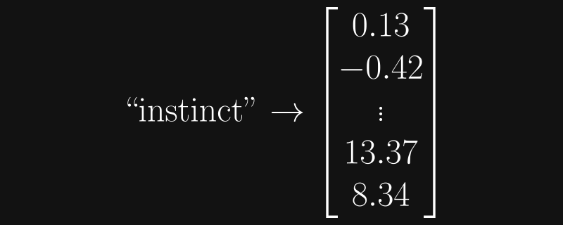

# Getting Started with Llama 3 on AMD Instinct and Radeon GPUs

## Introduction
### Source code and Presentation
This blog is a companion piece to the [ROCm Webinar of the same name](https://www.youtube.com/watch?v=Y0HP86hMQko) presented by Fluid Numerics, LLC on 11 July 2024. The source code for these materials is provided on [GitHub](https://github.com/FluidNumerics/amd-ml-examples).

### What is an LLM?
A **large language model (LLM)** is a natural language processing model that utilizes neural networks and machine learning (most notably, **transformers**) to execute language processing tasks. This is often in the form of some generative output, such as text, images, audio, and video. In this example, we will be discussing models whose input and output modalities are both text, and so it is sufficient to consider an LLM as a machine learning model that probabilistically predicts a sequence of words based on training data.

Put simply, it's a robot you can have a conversation with.

### Tokens

In the context of LLMs, a **token** is a small piece of information, often just a set of characters. (In practice, depending on the modality of a model, a token could also be a portion of an image, audio, video, etc.) 

Conceptually, it is fine to constrain tokens to words, punctuation, and tokenizer-specific symbols (e.g., the **end of sequence token**). Again, in reality, tokens are often chunks of words (say, from the English language), sometimes prepended by tokenizer-specific characters. These characters might indicate that a "sub-word" is a common suffix, such as "-ium", "-er", or "-ed". Sometimes tokens are not this intuitive, however. 

Below is a sample of 12 tokens taken from the Llama 3 model. We can discern ordinary english words, namely `Execute` and `film`, as well as some words prepended by single characters, those being `_Message`, `_lifetime`, `ĠWebsite`, and `ĠDeposit`. We also see a piece of punctuation, `.`, and the keen reader will also notice a bit of Java syntax, the `.getClass` method. Finally, we have the end of sequence token `<|eot_id|>`, and some others (`unun`, `heiten`, `andid`) which are not typical English words. Fortunately the user does not need to know the purpose of every single token in a model (Llama 3 comes packed with a whopping 128,256 distinct tokens).

- `unun`
- `heiten`
- `andid`
- `Execute`
- `_Message`
- `.getClass`
- `_lifetime`
- `ĠWebsite`
- `.`
- `film`
- `ĠDeposit`
- `<|eot_id|>`

An LLM probabilistically predicts a sequence of tokens; in our simplified mental model, it guesses which word will come next in the sequence. Of course, it is not practical to simply set a limit on the number of words a model generates. Not every output would perfectly conform to, say, exactly 100 words. Instead, every model predicts the end of its output, just as it would any other word. As the name implies, this is the purpose of the end of sequence token. (Hypothetically, a model might be likely to predict the EOS token after the sequence "`and` `that's` `the` `end` `of` `the` `story` `.`") The EOS token is distinct for every model; even the Llama 2 and Llama 3 models do not share the same EOS token.

### Embeddings
GPUs are the critical hardware in the machine learning space. Under the hood, these are highly performant linear algebra machines, performing matrix multiply-adds and similar operations hundreds of trillions times per second (more or less, depending on the performance of a particular GPU). Clearly, GPUs are not doing these operations on strings. (Traditionally, there is not a useful definition for the sum or product of `hello world` and `good news, everyone`.) Instead, during the training process, LLMs produce vector representations of each token.

An **embedding** is the representation of a token as an array. The weights and parameters of a transformers model are derived from the embeddings of its tokens. The matrix whose columns are the embeddings of every token in the model is the **embedding matrix**. The figure below provides a quick visual for embeddings.



Llama 3 embeddings have 4096 entries. A quick calculation implies that the embeddings alone account for 4096 × 128256 = 525336576 parameters, though this ~0.5 billion is still only a fraction of the 8 billion total.

The purpose of the parameter training process, of course, is to embed some kind of relative information into each token. As such, there are hidden dimensionalities utilizing these 4096 rows. To demonstrate this, a classical example is that the difference vector between the embeddings for *man* and *woman* is relatively close to the difference vector between the embeddings for *king* and *queen*. That is, there is some underlying dimension that could be associated with gender. One might hypothesize about qualities that may be dimensionalized in this way; perhaps *speed*, *elegance*, or *caffeination* have their own hidden dimensions in Llama 3.

### Transformer Models
Providing a comprehensive explanation of the transformer model is far beyond the scope of this write-up; however, it is worth discussing the very basics.

A transformer model accepts some kind of input (for our usage here, text), breaks this input down as a sequence of tokens (this is called **tokenization**), performs a series of deeper operations, and then probabilistically returns a token that will come next in this sequence. This process is repeated token-by-token until the end of sequence token is determined to come next; at this point, the model terminates the process and returns the sequence of tokens it has generated. These "deeper operations" include the **encoding** and **decoding** processes. A sufficient explanation for now is that encoding translates the input into tokens while also considering the relatives positions of these tokens. Of course relative positions are significant; the sentences "Alice baked some chicken for dinner," is quite different than "some chicken baked Alice for dinner," despite the latter being a permutation of the former. This type of nuanced information is considered during the decoding, which relies on the trained parameters of the model. At the end of the decoding process, the model generates a vector whose entries correspond to each token in the model's vocabulary (for Llama 3, this vector would be of length 128256). This vector functions as a discrete probability distribution; each entry in this vector is the probability that its corresponding token we be selected to come next in the sequence.

Of course, there are layers upon layers of normalizations, probabilistic selection, activation functions, and many other mechanisms going on, but the key take way is that tokens are expressed as vectors, and a vector is generated that stores the probabilities for which token will next be generated.


## Installation

### Requirements
The versions listed below are the versions tested for this example. Other versions may work, but this is not guaranteed.

**Please reference the [ROCm installation documentation](https://rocm.docs.amd.com/projects/install-on-linux/en/latest/reference/system-requirements.html) for compatible operating systems and hardware.** Remember that *supported* indicates that a specific piece of software/hardware is tested and verified to work; ROCm may very well work on other systems, but functionality is not guaranteed.

#### System
- [ROCm](https://rocm.docs.amd.com/projects/install-on-linux/en/latest/install/quick-start.html) (6.1)
- [conda](https://docs.anaconda.com/miniconda/) (Anaconda3 or Miniconda3 24.1+)
- [pip](https://anaconda.org/anaconda/pip) (24.0+)
- [git-lfs](https://git-lfs.com/) (3.5+)

#### Python (3.12+)
- [PyTorch](https://pytorch.org/get-started/locally/) (2.3.0 + rocm6.1)
- [transformers](https://huggingface.co/docs/transformers/en/index) (4.41+)
- [accelerate](https://huggingface.co/docs/accelerate/en/index) (0.30+)
- [jupyterlab](https://jupyterlab.readthedocs.io/en/stable/getting_started/installation.html) (4.2.1) (optional)

Naturally, we will need to install ROCm 6, as well as `conda` and `pip` for python environment management. `git-lfs` (Git Large File Storage) is required by the Hugging Face Hub (see next section) to download larger models/datasets. We will also need to install the version of PyTorch compatible with your version of ROCm. Fortunately, the PyTorch installation page provides a convenient configurator GUI to generate a command for the exact version you need. We will also need the `transformers` library developed and provided by Hugging Face, which provides the actual implementations for the models we can use, as well as the `accelerate` package, also provided by Hugging Face. `accelerate` generally removes some headache when working with GPUs; you can read a more in-depth description at the provided link.

### Install Steps

A complete install script is provided in the [accompanying repository](https://github.com/FluidNumerics/amd-ml-examples) for this write-up, but we will go through the essential steps below.

First, of course, we will need to install ROCm 6.1. See the [quickstart install documentation](https://rocm.docs.amd.com/projects/install-on-linux/en/latest/install/quick-start.html) for the latest version. Below is the quickstart install procedure for Ubuntu 22.

```bash
sudo apt install "linux-headers-$(uname -r)" "linux-modules-extra-$(uname -r)"
sudo usermod -a -G render,video $LOGNAME
wget https://repo.radeon.com/amdgpu-install/6.1.1/ubuntu/jammy/amdgpu-install_6.1.60101-1_all.deb
sudo apt install ./amdgpu-install_6.1.60101-1_all.deb
sudo apt update
sudo apt install amdgpu-dkms
sudo apt install rocm
echo "Please reboot system for all settings to take effect."
```

Next, we install `miniconda3`, as instructed in the [documentation](https://docs.anaconda.com/miniconda/).
```bash
mkdir -p ~/miniconda3
wget https://repo.anaconda.com/miniconda/Miniconda3-latest-Linux-x86_64.sh -O ~/miniconda3/miniconda.sh   
bash ~/miniconda3/miniconda.sh -b -u -p ~/miniconda3
rm -rf ~/miniconda3/miniconda.sh
```

We'll set up a simple conda environment with `pip` and `jupyterlab`.
```bash
conda create -n llama-3-env
conda activate llama-3-env
conda install pip
pip install jupyterlab
```

Using the PyTorch install configurator, we get the following command for installing the ROCm 6.1 compatible version of PyTorch.
```bash
pip3 install torch torchvision torchaudio --index-url https://download.pytorch.org/whl/rocm6.1
```

Once this is installed, we are free to install `transformers` and `accelerate`. **It is important to install the ROCm-compatible build of PyTorch first, otherwise** `transformers` **will install the default version as a dependency.**
```bash
pip install transformers accelerate
```

And finally, we may install `git-lfs`.
```bash
wget https://github.com/git-lfs/git-lfs/releases/download/v3.5.1/git-lfs-linux-amd64-v3.5.1.tar.gz
tar -xzf git-lfs-linux-amd64-v3.5.1.tar.gz 
cd git-lfs-3.5.1/
sudo ./install.sh
git lfs install
```


## Hugging Face


At this point we have all of the software prerequisites covered. But how do we get a model to start experimenting with? How do we begin to choose one?

### Hugging Face Hub
The [Hugging Face Hub](https://huggingface.co/models) is an online platform that provides open source and open weight models, datasets, and demo applications. The models offered here extend far beyond text-only LLMs; models for image detection, image segmentation, text-to-image, text-to-video, image-to-video, translation, and many other areas of applications are available.

### Hugging Face 🤗 Transformers Library
We've gone through the appropriate install steps to get the `transformers` library, but what does it actually do? As alluded to above, the `transformers` library provides a robust Python API for all the major tensor libraries (PyTorch, TensorFlow, JAX) to utilize transformer models. The library provides a variety of other relevant tooling, even including REST endpoints. Perhaps one of its strongest features is its seamless integration with the Hugging Face Hub, providing a simple interface for the plethora of models, datasets, etc. hosted by Hugging Face.


## Llama 3
Llama 3 likely needs no introduction, and it should be clear that this is the model that we're using in this example. The Llama family, developed by Meta Platforms, Inc., is a collection of some of the most popular open-weight models available today. Meta offers 8 billion, 70 billion, and now even 405 billion parameter versions. Llama 3 was trained with 15 trillion tokens, and can digest an impressive 8K tokens. Llama 3 also achieves consistently high scores on a variety of LLM benchmarks, such as MMLU, HumanEval, and GSM8K. At the time of publication, the Llama family has approximately 15 million downloads on the Hugging Face Hub. Today, we'll be using the `Llama-3-8B-Instruct` version, an 8 billion parameter version that has been fine-tuned for instructional speech patterns, i.e., answering questions.


## Example
Now that all the preliminary materials have been covered, it's time to run Llama 3. 

First, as usual, we import the necessary libraries.
```python
import transformers
import torch
```

It is practical to start off with a check to make sure our GPU is actually the device being used. The line below outputs the name of your GPU; if you are using multiple GPUs, the global GPU indices can be found with `rocm-smi`.
```python
print(f"Device name: {torch.cuda.get_device_name(0)}")
```
An example output here is: `Device name: AMD Instinct MI210`

You may be wondering why we specify `torch.cuda` if we are clearly using ROCm as our backend. The answer is *portability*. Pre-existing PyTorch code designed for `cuda` can typically be dropped into a ROCm ecosystem and retain functionality, accounting for different hardware specifications (e.g., amount of memory).

The `transformers` library provides incredible ease of use when selecting models. If you don't have a model installed, you can simply specify the profile and model name and `transformers` will download it during execution time. (Once a model is downloaded, `transformers` references that local download and will not reinstall it every time the script is run.)
```python
model_name = "meta-llama/llama-3-8b-instruct"
```

You can also `git clone` a model, e.g.:
```bash
git clone https://huggingface.co/meta-llama/Meta-Llama-3-8B-Instruct
```
Users have reportedly issues while cloning via SSH, so we recommend sticking with HTTPS. it is also worth mentioning that you will need to request permission from Meta to use the model, but the response time on this is typically just a few minutes. Once a model is cloned, you can just use the global path to that model instead of the `profile/model` syntax. (E.g., `model_name = "~/path/to/model"`.)

Since we checked that PyTorch detects the GPU, we'll set the device to that "`cuda`" device.
```python
device = torch.device("cuda" if torch.cuda.is_available() else "cpu")
print(f"Device: {device}")
```
Our print statement here confirms that a cuda device is being used: `Device: cuda
`

AutoTokenizer is a generic tokenizer class that will be instantiated as one of the tokenizer classes of the library when created with the `AutoTokenizer.from_pretrained` class method.
More information on this class can be found [here](https://huggingface.co/transformers/v3.0.2/model_doc/auto.html#transformers.AutoTokenizer). Functionally, we are telling `transformers` to use the Llama 3 tokenizer.
```python
tokenizer = transformers.AutoTokenizer.from_pretrained(model_name)
```

The `pipeline` class is the beating heart of this example. A pipeline tokenizes the input, feeds it to the model, and generates output. More information can be found [here](https://huggingface.co/docs/transformers/en/main_classes/pipelines).

We are seeking a traditional text-in-text-out model, so we specify `"text-generation"` as the task. We point it to Llama 3 by specifying `model_name`, and we (somewhat arbitrarily) set the datatype to half precision (`float16`). Though there are certainly exceptions to this rule, lower precision operations can imply better generation time. Finally, we set `device_map="auto"`, which automatically grabs the GPU.
```python
pipeline = transformers.pipeline(
    "text-generation",          # What type of model are we running?
    model=model_name,           # path to local model
    torch_dtype=torch.float16,  # set precision of tensors used by the model
    device_map="auto",          # uses the 'accelerate' package
    
)
```
You may see the "special tokens" warning below; this is expected. You can also see that the model is being loaded into memory with a progress bar.

```
Special tokens have been added in the vocabulary, make sure the associated word embeddings are fine-tuned or trained.

Loading checkpoint shards: [progress bar]
```

Onto the fun part. Here's an example prompt. We'll use `pipeline`, which we defined above, to generate a response. 
```python
prompt = 'I like listening to Snarky Puppy and Frank Zappa. What are some other musicians I might like?\n'

sequences = pipeline(
    text_inputs=prompt,
    do_sample=True,
    top_k=10,
    num_return_sequences=1,
    eos_token_id=tokenizer.eos_token_id,
)
```
Let's go through the parameters one-by-one.

**`text_inputs`:** Intuitive enough, the input text or "prompt" that the model will use to generate a sequence of tokens.

**`do_sample`:** Recall that the attention mechanism of a transformer model calculates a discrete probability distribution and then samples this distribution to probabilistically select the next token in a sequence. This has nice generalized functionality, but we often do not wish to consider tokens that have low likelihoods of being selected. Instead, we sample from a pool of *k* tokens with the highest probabilities. This is the functionality gained by setting `do_sample=True`. If we set `do_sample=False`, then the model would simply select the token with the highest probability every time. This method is called **greedy selection**.

**`top_k`:** This parameter simply specifies how many tokens to consider when using the above sampling method. We arbitrarily set this to `10`.

**`return_sequences`:** If you want your model to generate multiple distinct responses to a single prompt, `return_sequences` specifies how many to generate. For our purposes, we just want the single response, so we set this to `1`. 

**`eos_token_id`:** Informs the model of the EOS token ID. Again, this is distinct for every model, so if it is not specified, the model will not properly generate end of sequence tokens. It is easy to get this via `tokenizer.eos_token_id`.

For more information regarding sequence generation, reference the [documentation](https://huggingface.co/docs/transformers/en/internal/generation_utils).


Finally, we print our response. `sequences` is a list of dictionaries, thus the `for` loop, which generalizes for `return_sequences > 1`.
```python
for seq in sequences:
    print(f"\nResult:\n{seq['generated_text']}")
```
Example output:
```
Result:
I like listening to Snarky Puppy and Frank Zappa. What are some other musicians I might like?
Snarky Puppy is a great band! If you like their unique blend of jazz, rock, and world music, you might also enjoy the following musicians:

1. Kamasi Washington - Like Snarky Puppy, Kamasi Washington is a saxophonist who blends jazz, rock, and hip-hop to create a unique sound.
2. Tigran Hamasyan - An Armenian-American pianist, Tigran Hamasyan is known for his eclectic and energetic music, which combines elements of jazz, rock, and Armenian folk music.
3. Brad Mehldau - A jazz pianist and composer, Brad Mehldau is known for his introspective and emotive playing style, which often incorporates elements of rock and pop music.
4. Medeski, Martin & Wood - This jazz trio is known for their energetic and improvisational live performances, which often blend elements of rock, funk, and world music.
5. The Bad Plus - A jazz trio from Minneapolis, The Bad Plus is known for their eclectic and humorous approach to jazz, which often incorporates elements of rock and pop music.
6. Christian Scott aTunde Adjuah - A trumpeter and producer, Christian Scott aTunde Adjuah is known for his genre-bending music, which combines elements of jazz, rock, and hip-hop.
7. Robert Glasper - A pianist and producer, Robert Glasper is known for his work in the jazz and R&B genres, and has collaborated with a wide range of artists, from Kendrick Lamar to Norah Jones.
8. Esperanza Spalding - A bassist and singer, Esperanza Spalding is known for her eclectic and energetic music, which combines elements of jazz, rock, and pop.
9. The Marsalis Family - A family of jazz musicians, the Marsalis family is known for their traditional and modern approach to jazz, which often incorporates elements of rock and pop music.
10. Vijay Iyer - A pianist and composer, Vijay Iyer is known for his eclectic and energetic music, which combines elements of jazz, rock, and hip-hop.

As for Frank Zappa, if you like his unique blend of rock, jazz, and classical music, you might also enjoy the following musicians:

1. Frank Zappa's son, Dweezil Zappa - Dweezil has continued his father's legacy, playing Zappa's music and also creating his own unique blend of rock, jazz, and classical music.
2. Steve Vai - A guitarist and composer, Steve Vai is known for his eclectic and virtuosic playing style, which combines elements of rock, jazz, and classical music.
3. Joe Satriani - A guitarist and composer, Joe Satriani is known for his instrumental rock music, which often incorporates elements of jazz and classical music.
4. Adrian Belew - A guitarist and singer, Adrian Belew is known for his work with Frank Zappa, as well as his own eclectic and experimental music, which combines elements of rock, jazz, and classical music.
5. Mike Keneally - A guitarist and composer, Mike Keneally is known for his work with Frank Zappa, as well as his own eclectic and experimental music, which combines elements of rock, jazz, and classical music.
6. Trey Gunn - A bassist and composer, Trey Gunn is known for his work with King Crimson, as well as his own eclectic and experimental music, which combines elements of rock, jazz, and classical music.
7. Robert Fripp - A guitarist and composer, Robert Fripp is known for his work with King Crimson, as well as his own eclectic and experimental music, which combines elements of rock, jazz, and classical music.
8. John Zorn - A saxophonist and composer, John Zorn is known for his eclectic and experimental music, which combines elements of jazz, rock, and classical music.
9. Bill Frisell - A guitarist and composer, Bill Frisell is known for his eclectic and experimental music, which combines elements of jazz, rock, and classical music.
10. Pat Metheny - A guitarist and composer, Pat Metheny is known for his eclectic and experimental music, which combines elements of jazz, rock, and classical music.

I hope you find some new music to enjoy!
```

Regardless of taste, this response demonstrates precisely the behavior that we seek in an introductory level example. (Subjectively, we should also note that these recommendations are quite spot-on.) The response is in clear English, and provides context to each artist mentioned. `transformers` also provides functionality to return one token at a time instead of as a single string.

Notice that the response begins with the string that we provided as the prompt. We emphasize again that these types of models generate tokens using pre-existing information. That is, further generating a sequence of tokens from a sequence that is provided, and the model is simply returning the initial sequence of tokens (the prompt) as well as the sequence of generated tokens (the response).


## Temperature
Adjusting the sampling behavior via `do_sample` and `top_k` is merely a drop in the ocean of available methods to tweak the inner-workings of a model. Another drop is the concept of **temperature** in models. Recall once more that a transformer returns a vector of probabilities corresponding to each token in the model's vocabulary. These probability derive from a prior calculation, which provides a kind of "relative likelihood" for each possible token. These values could be any real number; an unlikely token could correspond to a negative value with a magnitude much greater than zero, while a likely token could correspond to a positive value with a comparable magnitude. Of course, we could not use this "pre-distribution" vector for sampling, since it interrupts two key requirements for a probability distribution:
1. All probabilities must be positive.
2. The sum of the probabilities of all outcomes equals 1

To transform this information into a useful form (into a probability distribution), we apply the **softmax** function.

$\begin{align}
  \Huge\text{softmax}(x_i, T) = \frac{\exp(x_i/T)}{\sum_{n=1}^{N}\exp(x_n/T)}
\end{align}$

In this formula, consider $x_i$ to be entries in our "relative likelihood" vector, and $T$ to be the temperature.

Temperature is set to `1` by default; this is sensible, sense it is functionally a scaling factor. A quick mental exercise verifies that the exponential function approaches zero as $x_i$ approaches negative infinity, and approaches infinity as $x_i$ approaches infinity. This solves our first requirement, and another quick exercise verifies that the denominator of this function guarantees that the entries of this new vector indeed sum to 1.

Conceptually, temperature should be thought of as inversely affecting the certainty of a model. That is, a high temperature makes a model quite uncertain while a low temperature invokes greater certainty per token selection. What this means computationally is that, with a lower temperature, tokens which are likely to come next in the generated sequence become even more likely to be selected. With a high temperature, a likely token does not necessarily become "unlikely", but becomes less likely overall, as we will see.

One can verify that as $T$ approaches zero, the vector approaches zero for all entries except the entry whose probability is greatest when $T=1$. Instead, the probability of this outcome becomes 1; this is effectively the same as the greedy selection algorithm discussed earlier. As $T$ approaches infinity, we find that the resultant probability distribution becomes uniform, with each entry approaching a value of 1 / (vocabulary size).

The script below iterates the temperature from 0.1 to 10, providing example responses for each value. We also pass `max_new_tokens=200` since, as we will discuss, some higher temperature responses can be quite rambly.
```python
for i in range(-2,3):
    temp = 10.0**(i/2)
    sequences = pipeline(
        'What is two plus two?',
        max_new_tokens=200,
        do_sample=True,
        top_k=10,
        num_return_sequences=1,
        eos_token_id=tokenizer.eos_token_id,
        temperature=temp
    )

    print(f"\n-------- temperature = {temp}")
    for seq in sequences:
        print(f"\nResult:\n{seq['generated_text']}")
```
For the sake of brevity, we provide only an example output for the case `temp = 10`.
```
Result:
What is two plus two?").  It's as straightforward and as simple and
as direct. And that makes you feel, in fact that is a good example.

And it's funny how this is, this, you have the, what I was saying the, I
donít know why this was the best part was. This, I have, uh, in fact, uh... 

(He seems to be losing momentum again.  He starts again more quickly
this second attempt, as you've seen him do a time or time before. This,
uh...) I think the, it, you can just tell how it works because of how simple and how straightforward and
how it's so obvious that that makes you... uh, makes me. (Pausing)
And uh. (Another pause, then) Oh, sorry!

And it is that the reason this works for some things. And the reason that this
kinda works, um is uh (he takes an audible breath)... it
just
```
We encourage you to try this code block for yourself, varying `temperature` and `max_new_tokens` to get a feel for how temperature affects the model's behavior. As we can tell from this example, the `temperature` parameter can have quite drastic effects on a model's output. This response is incoherent. One could even imagine that in the context a personified interface for this model, this kind of result could convey significant discomfort.


## Sampling Tokens
Earlier we provided a sample of 12 tokens from the Llama 3 vocabulary. This section serves as a quick appendix to show how to replicate the sampling process.

Again, we import the necessary packages. 
```python
import transformers
import torch
import random
```

Similarly, we tell PyTorch to use an available `cuda` device.
```python
device = torch.device("cuda" if torch.cuda.is_available() else "cpu")
```

If you wish, you can do the same kinds of checks in the earlier example.
```python
print(f"Device name: {torch.cuda.get_device_name(0)}")
print(device)
```

And again, we specify the model we wish to use.
```python
model_name = "meta-llama/llama-3-8b-instruct"
```

And yet again, we set `tokenizer` to the Llama 3 tokenizer from our local model, and we build the pipeline just as we had before.
```python
tokenizer = transformers.AutoTokenizer.from_pretrained(model_name)
pipeline = transformers.pipeline(
    "text-generation",              
    model=model_name,            
    torch_dtype=torch.float16,      
    device_map="auto",
)
```

Finally, we may sample the vocabulary of Llama 3.

The `get_vocab` method of the `tokenizer` class returns a dictionary whose keys are the tokens themselves, and whose values are the token IDs (integer indices unique to each token). Because this method returns a dictionary, we assign `vocab` to be a list of its keys, then sample 12 items from this list.

We also print the EOS token and its token ID, as well as the length of the vocabulary of Llama 3.
```python
vocab = list(tokenizer.get_vocab())
sample_tokens = random.sample(vocab, 12)

print(sample_tokens)
print(tokenizer.eos_token, tokenizer.eos_token_id)
print(len(vocab))
```

Although we provide an example above, here is another example output:
```
['Ġecosystems', '.registry', "'):Ċ", 'Ġlip', 'Ġmon', 'getActiveSheet', '_log', 'ĠScout', ').[', 'ÏĦοÏħ']
<|eot_id|> 128009
128256
```


## Acknowledgments
Special thanks to [Garrett Byrd](https://github.com/garrettbyrd) and [Dr. Joe Schoonover](https://github.com/fluidnumerics-joe) at [Fluid Numerics, LLC](https://www.fluidnumerics.com/) for contributing this blog. The ROCm software ecosystem is strengthened by community projects that enable you to use AMD GPUs in new ways. If you have a project you would like to share here, [please raise an issue or PR](https://github.com/ROCm/rocm-blogs).

**Find Fluid Numerics online at:**
- [fluidnumerics.com](www.fluidnumerics.com)
- [Reddit](https://www.reddit.com/r/FluidNumerics/)
- [GitHub](https://github.com/FluidNumerics)
- [YouTube](https://www.youtube.com/@FluidNumerics)
- [LinkedIn](https://www.linkedin.com/company/fluidnumerics)

## References
### Source Code
[Available on GitHub](https://github.com/FluidNumerics/amd-ml-examples)

### Papers
Vaswani, Ashish. "Attention is all you need." arXiv preprint arXiv:1706.03762 (2017).

### Installation Pages
[ROCm quick start installation guide](https://rocm.docs.amd.com/projects/install-on-linux/en/latest/install/quick-start.html)

[Miniconda Quick Command Line Install](https://docs.anaconda.com/miniconda/#quick-command-line-install)

[PyTorch Installation Configurator](https://pytorch.org/get-started/locally/)

[git-lfs](https://git-lfs.com/)


## Disclaimers
Third-party content is licensed to you directly by the third party that owns the content and is not licensed to you by AMD. ALL LINKED THIRD-PARTY CONTENT IS PROVIDED “AS IS” WITHOUT A WARRANTY OF ANY KIND. USE OF SUCH THIRD-PARTY CONTENT IS DONE AT YOUR SOLE DISCRETION AND UNDER NO CIRCUMSTANCES WILL AMD BE LIABLE TO YOU FOR ANY THIRD-PARTY CONTENT. YOU ASSUME ALL RISK AND ARE SOLELY RESPONSIBLE FOR ANY DAMAGES THAT MAY ARISE FROM YOUR USE OF THIRD-PARTY CONTENT.