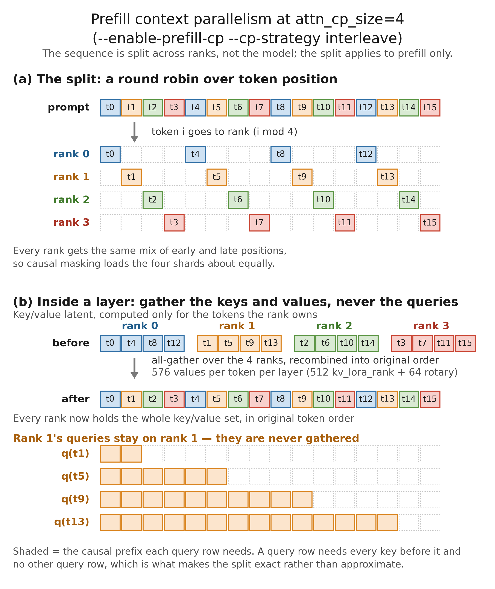
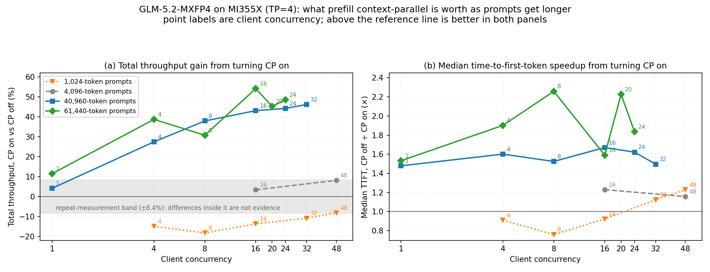
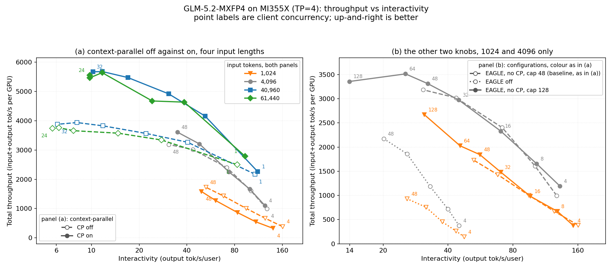

<!---
Copyright (c) 2026 Advanced Micro Devices, Inc. (AMD)

Permission is hereby granted, free of charge, to any person obtaining a copy
of this software and associated documentation files (the "Software"), to deal
in the Software without restriction, including without limitation the rights
to use, copy, modify, merge, publish, distribute, sublicense, and/or sell
copies of the Software, and to permit persons to whom the Software is
furnished to do so, subject to the following conditions:

The above copyright notice and this permission notice shall be included in all
copies or substantial portions of the Software.

THE SOFTWARE IS PROVIDED "AS IS", WITHOUT WARRANTY OF ANY KIND, EXPRESS OR
IMPLIED, INCLUDING BUT NOT LIMITED TO THE WARRANTIES OF MERCHANTABILITY,
FITNESS FOR A PARTICULAR PURPOSE AND NONINFRINGEMENT. IN NO EVENT SHALL THE
AUTHORS OR COPYRIGHT HOLDERS BE LIABLE FOR ANY CLAIM, DAMAGES OR OTHER
LIABILITY, WHETHER IN AN ACTION OF CONTRACT, TORT OR OTHERWISE, ARISING FROM,
OUT OF OR IN CONNECTION WITH THE SOFTWARE OR THE USE OR OTHER DEALINGS IN THE
SOFTWARE.
--->

# Serving GLM-5.2-MXFP4 on AMD Instinct™ MI355X: When Prefill Context Parallelism Pays

Whether prefill context parallelism pays depends on prompt length. It divides the prompt across GPUs during prefill; on four AMD Instinct™ MI355X GPUs (gfx950) serving [GLM-5.2-MXFP4](https://huggingface.co/amd/GLM-5.2-MXFP4) under SGLang at `--tp-size 4`, enabling it yields 43% to 54% more total throughput on 40,960- and 61,440-token prompts at concurrency 16 and above, and a first token about 1.5× to 2.3× faster at every concurrency. On 1024-token prompts it loses at every concurrency measured, by 8% to 18% of total throughput.

That sign change is the subject of this post: CP off versus on, same four GPUs, same checkpoint, same workloads — [the baseline](#the-baseline-and-the-environment) states the full configuration, including DeepSeek-style sparse attention and EAGLE speculative decoding on both arms. All numbers were measured on an SGLang build carrying [PR #32175](https://github.com/sgl-project/sglang/pull/32175), the AMD ROCm enablement for GLM-5.x, open at the time of writing. The post walks the mechanism and its price first, then the measurements that show where the sign flips; [near the end](#where-the-split-does-not-pay), it covers the practical fallback when the split is wrong.

---

## How Prefill Context Parallelism Splits the Prompt

On our TP4 setup with prefill CP enabled (`--tp-size 4 --enable-prefill-cp --cp-strategy interleave`), prefill context parallelism assigns prompt tokens round robin across four ranks — `attn_cp_size=4` — so each rank processes one quarter of the sequence. Under GLM-5.2's sparse DeepSeek-style attention (DSA), a lightning indexer scores the full prefix for every query row and passes only the top `index_topk` keys — 2048 for this checkpoint — to the multi-head latent attention (MLA) that follows.

Attention is one-directional, so the split is exact: each query row needs every key and value, but no query row depends on another. Queries can scatter across ranks as long as keys and values are reassembled. Under TP4 with CP on, reassembly all-gathers keys and values inside every layer and never gathers queries, recombining interleaved shards back to original order so each rank scores against the full causal prefix, not its local quarter. Figure 1 below traces both steps on a 16-token prompt: the round-robin deal in panel (a), and the all-gather that restores original order inside a layer in panel (b).



**Figure 1.** Prefill context parallelism at `attn_cp_size=4`, on a 16-token prompt. **(a)** Round robin: token *i* goes to rank *i* mod 4. **(b)** Inside one layer: the key/value latent is all-gathered and recombined back into original order from interleaved shards, so rank 1's query rows score over the whole causal prefix.

MLA keeps the per-token key/value payload compact: a 512-wide `kv_lora_rank` latent plus a 64-wide rotary component — 576 values per token per layer — rather than full per-head keys and values across 64 heads, plus another 128 for the indexer's own key. That is not the dominant interconnect traffic. Before each MoE block, hidden states are all-gathered at the full 6144 width; after the MoE they are reduce-scattered. On this four-rank CP layout, every rank runs the MoE over the complete token set; only the attention path is partitioned.

The split applies to prefill only. SGLang enables CP only on extend-step forwards, so decode is never partitioned on this TP4 CP-on setup — aside from the parallel-layout changes CP imposes, covered in the next section.

## What the Split Costs, and Why That Sets Its Sign

The quartering of prefill work above is not free. Enabling CP forces `attn_tp_size` to 1, so attention weights are *replicated* on all four ranks rather than sharded.

The cost appears twice. In memory: 120.13 GB of weights per rank with CP against 101.45 GB without, an 18.68 GB per-rank penalty that comes straight out of the KV cache, costing 199,744 tokens of pool capacity. In compute: each rank computes all 64 heads instead of 16, so every decode step is more expensive. Both show up in the startup log — with CP, `attn_cp_size=4`; without it, `attn_tp_size=4, attention weights will be sharded across 4 ranks`.

That collapse is a property of this implementation, not of context parallelism in general. SGLang derives `attn_tp_size = tp_size // attn_dp_size // attn_cp_size`, so at `tp=4` with `attn_cp_size=4` it equals 1, and the two cannot both be on because the CP layer communicator does not all-reduce attention tensor-parallelism's partial `o_proj` outputs before the replicated dense FFNs. Turning CP on spends attention TP to buy it.

CP also does *not* shard the KV cache here, though other implementations do: every rank writes the full gathered KV for the whole sequence into its own pool. SGLang has an option that would split the DSA cache by layer across CP ranks, but it is off by default and only supported under prefill/decode disaggregation. Enabling CP therefore makes the KV pool *smaller* rather than dividing it four ways.

Saving and penalty scale differently — that asymmetry defines the trade. CP buys its quarter of query rows by giving every rank all 64 heads, so MLA attention comes out roughly even; what the split genuinely divides is the lightning indexer's scoring, otherwise replicated across ranks. That is the only term here that grows faster than the prompt — the attention it feeds is capped at `index_topk` keys per row, and the MoE is not divided at all. The penalty is per decode step and barely depends on prompt length, which [Where Single-Stream Breaks Even](#where-single-stream-breaks-even) quantifies. The sign therefore follows how much prefill work is in flight relative to decode — a ratio set by prompt length, and at concurrency 1 by how much the model generates.

## The Baseline and the Environment

Every comparison below tests the sign-change prediction from the sections above. Each run starts from this command:

```bash
export HIP_VISIBLE_DEVICES=4,5,6,7
export SGLANG_USE_AITER=1
export SGLANG_DSA_NO_PAD_HEADS=1

python3 -m sglang.launch_server \
  --model-path /path/to/glm-5.2-mxfp4 --tp-size 4 \
  --trust-remote-code \
  --served-model-name glm-5.2-mxfp4 \
  --attention-backend dsa --dsa-prefill-backend aiter --dsa-decode-backend aiter \
  --dsa-topk-backend sgl-kernel \
  --kv-cache-dtype bfloat16 \
  --chunked-prefill-size 32768 --mem-fraction-static 0.85 \
  --reasoning-parser glm45 --tool-call-parser glm47 \
  --disable-radix-cache --host 0.0.0.0 --port 30003 \
  --speculative-algorithm EAGLE --speculative-num-steps 5 \
  --speculative-eagle-topk 1 --speculative-num-draft-tokens 6
```

`--model-path` points at a local copy of [`amd/GLM-5.2-MXFP4`](https://huggingface.co/amd/GLM-5.2-MXFP4); `HIP_VISIBLE_DEVICES` picks four of the eight GPUs. `SGLANG_DSA_NO_PAD_HEADS=1` selects the native eight-head DSA kernel on gfx950. [The environment](#software-and-hardware-stack) lists the full stack.

The CP-on arm adds prefill context parallelism:

```bash
export HIP_VISIBLE_DEVICES=4,5,6,7
export SGLANG_USE_AITER=1
export SGLANG_DSA_NO_PAD_HEADS=1

python3 -m sglang.launch_server \
  --model-path /path/to/glm-5.2-mxfp4 --tp-size 4 \
  --trust-remote-code \
  --served-model-name glm-5.2-mxfp4 \
  --attention-backend dsa --dsa-prefill-backend aiter --dsa-decode-backend aiter \
  --dsa-topk-backend sgl-kernel \
  --kv-cache-dtype bfloat16 \
  --chunked-prefill-size 32768 --mem-fraction-static 0.85 \
  --reasoning-parser glm45 --tool-call-parser glm47 \
  --disable-radix-cache --host 0.0.0.0 --port 30003 \
  --enable-prefill-cp --cp-strategy interleave \
  --speculative-algorithm EAGLE --speculative-num-steps 5 \
  --speculative-eagle-topk 1 --speculative-num-draft-tokens 6
```

Every single-point comparison uses one fixed workload so differences trace to configuration, not traffic shape:

```bash
python3 -m sglang.bench_serving --backend sglang-oai --host 127.0.0.1 --port 30003 \
    --model glm-5.2-mxfp4 --tokenizer /path/to/glm-5.2-mxfp4 \
    --dataset-name random --random-input-len 4096 --random-output-len 512 \
    --num-prompts 16 --max-concurrency 1
```

With `--max-concurrency 1` this is a single-stream latency probe, not a throughput benchmark. What four GPUs sustain under load is in [the concurrency sweeps](#what-the-split-is-worth-by-prompt-length).

### Software and Hardware Stack

| Component | Detail |
| :--- | :--- |
| Hardware | 8× AMD Instinct™ MI355X (gfx950, CDNA4), 288 GiB HBM per GPU, SPX compute partition |
| GPUs used | 4 (tensor-parallel `tp=4`; smallest layout that fits 408 GB weights with usable KV cache) |
| Host ROCm / driver | ROCm 7.2.0 / driver 6.16.13 |
| Runtime ROCm | ROCm 7.2.0, HIP 7.2.26015 |
| Python | 3.10.12 |
| PyTorch | 2.9.1+rocm7.2.0 |
| Serving framework | [SGLang](https://github.com/sgl-project/sglang) on branch `refactor/amd-glm5x-cp-eagle-20260723` @ `817f2e8b9e` ([PR #32175](https://github.com/sgl-project/sglang/pull/32175) AMD ROCm GLM-5.x enablement; `v0.5.15.post1`-based lineage), editable install at `/sgl-workspace/sglang`; prefill CP on the DSA attention path |
| Kernel library | [AITER](https://github.com/ROCm/aiter) `v0.1.16.post3` @ `0c0261ba9` (`/sgl-workspace/aiter`) |
| Triton | 3.6.0 |
| `sgl-kernel` | 0.4.3 |
| Transformers | 5.8.1 |
| Model | GLM-5.2-MXFP4 — 282 safetensors shards, 408 GB on disk |

### The Model

[amd/GLM-5.2-MXFP4](https://huggingface.co/amd/GLM-5.2-MXFP4) is a `GlmMoeDsaForCausalLM` MoE checkpoint (Quark MXFP4) whose built-in EAGLE draft head SGLang loads as the draft worker.

| Property | Value |
| :--- | :--- |
| Hidden size / layers | 6144 / 78 |
| Attention heads | 64 |
| `kv_lora_rank` | 512 |
| `index_topk` | 2048 |
| Routed experts / experts per token | 256 / 8 |

## Where the Trade Changes Sign

With the baseline fixed above, the sign-change measurements start here. Two runs of the reference CP-on configuration land within about 1% — 147.53 output tok/s — and [the single-point table](#where-single-stream-breaks-even) quotes it. That ~1% gap is repeat-measurement noise, not a result; accept-length deltas below ~0.25 sit inside it. The concurrency sweeps move several times more.

### What the Split Is Worth, by Prompt Length

Prompt length sets the sign. On 1024-token prompts CP loses at every concurrency we swept; at 4096 the difference is inside measurement noise; at 40,960 and 61,440 it is worth 43% to 54% more total throughput at concurrency 16 and above, and about 1.5× to 2.3× faster first token at every concurrency including 1. Figure 2 below plots both halves of that against client concurrency at all four lengths — the throughput ratio in panel (a), the first-token speedup in panel (b).



**Figure 2.** What prefill context parallelism is worth as prompts get longer, at the four input lengths measured, 512 output tokens and client concurrency 1 to 48 throughout. **(a)** Total throughput with CP on relative to CP off; the shaded band is the ±8.4% spread between repeat measurements of one 4096-token configuration, the two runs tabulated below. The whole 4096-token series sits inside it, and the 1024-token series sits below it at every concurrency except 48, where −8.3% lands just inside. **(b)** Median time to first token (TTFT), CP off divided by CP on — above 1 at every long-prompt point, both concurrency-1 points included, and below 1 at 1024 until it crosses between concurrency 16 and 32.

Sparse attention caps each query row at `index_topk` keys (2048 on this checkpoint): the lightning indexer ranks the full prefix and passes only the top matches to MLA. While the prefix stays under that limit, no key is dropped — and at 1024 tokens, with CP off, SGLang skips ranking altogether because top-k would keep them all anyway; CP on must still run the indexer on every rank and cannot use that fast path. CP therefore divides a bill the other arm never pays, and loses by 8% to 18% at all five concurrencies in panel (a), where the unbroken sign is the argument rather than any one point. Past that limit the scoring is real work, proportional to how much prefix each query row is scored against, and four ranks split it four ways at any concurrency: the gain is the shape of dividing work that scales with prefix length, not of a scheduling win, which is why it survives at concurrency 1, and why 1024 is the one length whose first token comes back slower below concurrency 32.

Full CP on/off sweep at concurrency 4–48 on the same node and build (`sglang-oai`, `--random-range-ratio 1.0`):

| 1024 in / 512 out, total tok/s per GPU | CP off | CP on | CP on vs off |
| :--- | :---: | :---: | :---: |
| Concurrency 4 | 429.2 | 350.6 | −18.3% |
| Concurrency 8 | 685.7 | 621.0 | −9.4% |
| Concurrency 16 | 1099.4 | 937.5 | −14.7% |
| Concurrency 32 | 1647.7 | 1422.2 | −13.7% |
| Concurrency 48 | 1887.4 | 1692.5 | −10.3% |

At 4096 tokens the full c4–32 sweep (re-measured on the same node and build) still sits mostly inside measurement noise — only concurrency 32 clears the ~8% floor:

| 4096 in / 512 out, total tok/s per GPU | CP off | CP on | CP on vs off |
| :--- | :---: | :---: | :---: |
| Concurrency 4 | 1252.3 | 1157.8 | −7.5% |
| Concurrency 8 | 1694.4 | 1684.1 | −0.6% |
| Concurrency 16 | 2386.0 | 2498.7 | +4.7% |
| Concurrency 32 | 3018.7 | 3273.9 | +8.5% |
| Concurrency 48 | 3299.3 | 3390.1 | +2.8% |

Take ~8% as the noise floor on a sweep point. At 4096 CP is neither clearly right nor wrong under load through concurrency 16; concurrency 32 is a marginal CP-on win. First-token latency is steadier: median TTFT at concurrency 16 falls ~26% with CP on (1680 → 1238 ms), while on 1024-token prompts it moves the other way (417 → 452 ms).

Longer prompts settle it. 4096 tokens is twice the index budget, nowhere near the 1M context sparse attention exists to serve, and the mechanism says the margin should widen as prompts grow. It does. Twenty-eight further points on the same node and build, at 40,960 and 61,440 input tokens against 512 output, seven concurrencies at each length chosen to bracket its pool ceiling, CP off → CP on:

| Client concurrency | Total tok/s per GPU, 40,960 in / 512 out | Total tok/s per GPU, 61,440 in / 512 out | Median TTFT (s), 40,960 in | Median TTFT (s), 61,440 in |
| :---: | :---: | :---: | :---: | :---: |
| 1 | 2173.1 → 2262.2 (+4.1%) | 2501.5 → 2787.5 (+11.4%) | 2.52 → 1.70 (1.48×) | 3.95 → 2.58 (1.53×) |
| 4 | 3264.5 → 4159.0 (+27.4%) | 3341.2 → 4633.8 (+38.7%) | 8.01 → 5.00 (1.60×) | 12.36 → 6.50 (1.90×) |
| 8 | 3565.5 → 4917.3 (+37.9%) | 3574.1 → 4673.3 (+30.8%) | 11.65 → 7.64 (1.52×) | 20.68 → 9.16 (2.26×) |
| 16 | 3825.1 → 5473.2 (+43.1%) | 3658.7 → 5639.8 (+54.1%) | 23.38 → 14.00 (1.67×) | 35.10 → 22.07 (1.59×) |
| 20 | 3855.8 → 5664.0 (+46.9%) | 3746.1 → 5465.5 (+45.9%) | 27.61 → 17.75 (1.56×) | 43.69 → 21.40 (2.04×) |
| 24 | 3886.0 → 5694.0 (+46.5%) | 3700.4 → 5673.9 (+53.3%) | 33.64 → 20.36 (1.65×) | 50.25 → 30.18 (1.66×) |
| 32 | 3957.4 → 5701.4 (+44.1%) | 3685.6 → 5467.4 (+48.3%) | 41.26 → 26.02 (1.59×) | 69.70 → 45.34 (1.54×) |

All fourteen throughput points are CP wins, and from concurrency 4 up every one clears the 8% floor three times over or better.

The first-token result is the more useful half. A throughput gain under load can always be suspected of better batching; a gain at concurrency 1 cannot, and the concurrency-1 row shows one at both lengths. Read the range rather than the shape, though: the 61,440 median is not monotone in concurrency, because the distribution turns right-skewed once the KV pool saturates, and medians either side of that point describe differently shaped distributions.

Chunking does not undo this — the first thing to check at these lengths. At `--chunked-prefill-size 32768` a 40,960-token prompt arrives as 32,768 + 8,192 and a 61,440-token one as 32,768 + 28,672, which the prefill batches confirm. CP splits each chunk's query rows rather than the whole prompt, and the fast path that skips indexer scoring is gated on total sequence length rather than chunk length, so no chunk here can take it: the 1024-token asymmetry cannot return through chunking. Nor does CP buy throughput by drafting worse: across the long-context runs, accept length is 5.84 to 5.91 with CP on and 5.76 to 5.91 with CP off. That is why 40,960 reads only +4.1%: the point sits just past break-even, its net the small difference of two large terms — which is also why that net falls inside the 8% floor while neither term does.

(where-single-stream-breaks-even)=

### Where Single-Stream Breaks Even

Break-even moves out sharply with output length, and that changes who should turn the flag on. The saving is bought once in prefill while the penalty is paid on every token generated, so the same interpolation puts break-even near 103,000 input tokens at 2048 output and near 181,000 at 4096 — derived from the model below, not measured either. GLM-5.2 is a reasoning model, so long generations are its ordinary case: at 40,960 input and 512 output the concurrency-1 row is already a small throughput win (+4.1%), but a single-stream long-trace workload can show the faster first token without a throughput win once generations grow long enough for the per-token decode penalty to dominate. The same pressure applies under load, since the penalty is paid per generated token whether or not requests are batched, and every concurrency result above was measured at 512 output tokens. Batched decode amortizes that penalty differently, so we would expect the gains to narrow rather than invert — but we did not measure it, so read them as established for 512-token outputs and untested for longer ones.

Both numbers come out of one additive model. At concurrency 1 nothing batches, so latency is the first token plus the rest — end to end (E2E) is TTFT plus time per output token (TPOT) for each of the remaining tokens: `E2E = TTFT + 511 × TPOT` reproduces measured end-to-end latency to within 0.005% on both arms at both long lengths, which splits the single-stream result into the two terms the mechanism predicts. On the reference workload — the 16-prompt single-stream probe above, whose default sampling lands at about 1928 input and 281 output tokens per request — the net is a loss, and that is the CP floor, not its verdict:

| ~1928 in / ~281 out, concurrency 1 | CP off | CP on (`interleave`) | Δ |
| :--- | :---: | :---: | :---: |
| Median TTFT (ms) | 246.99 | 204.38 | −17.3% (better) |
| Output throughput (tok/s) | 200.71 | 147.53 | −26.5% (worse) |
| Median TPOT (ms) | 3.91 | 5.60 | +43.2% (worse) |
| Median E2E (ms) | 1357.61 | 1841.96 | +35.7% (worse) |
| Accept length | 5.73 | 5.61 | within noise |

Every column below except the last is derived from measurements already in this post — the concurrency-1 rows of the long-context sweep, and the table above — rather than measured separately:

| Workload, all at concurrency 1 | Prefill saving | ΔTPOT (ms/token) | Decode penalty | Net | Measured throughput delta |
| :--- | :---: | :---: | :---: | :---: | :---: |
| Reference, ~1928 in / ~281 out | 43 ms | 1.690 | 473 ms | −431 ms | −26.5% |
| 40,960 in / 512 out | 827 ms | 1.251 | 639 ms | +188 ms | +4.10% |
| 61,440 in / 512 out | 1361 ms | 1.420 | 726 ms | +635 ms | +11.43% |

The penalty is roughly 1.2 ms per output token in the long-context regime — about 1.18 at 40,960 tokens and 1.2 to 1.7 at 61,440 across repeats — and higher, near 1.7, on the short reference workload, so it is the same order of magnitude everywhere but not a single clean constant on this build. Break-even is where the growing prefill saving overtakes it. The short-prompt loss and the long-prompt gain are one mechanism at two ends of it, not two findings — the saving grows with prompt length while the penalty stays roughly flat per output token, which is why the sign flips as prompts get longer.

### What the Ceiling Feels Like at Long Context

When CP pays under load, the useful ceiling is set by KV capacity, not compute — throughput saturates before capacity does; read the useful ceiling as about 24 concurrent requests at 40K and about 16 at 60K. All 28 long-context points completed successfully.

At 61,440 tokens per request only about nineteen fit at once in the CP-on pool, and the limit retracts rather than fails: `KV cache pool is full. Retract requests.` fires only on the CP-on arm at 61,440 (concurrencies 20 and 24) — the 199,744 KV tokens CP gives up, expressed in requests. Retraction costs latency, not correctness.

## Where the Split Does Not Pay

Context parallelism loses on short prompts, and everything above is the main story for when it pays. What follows is the practical fallback — not a second lever on equal footing, but the knob worth turning when the split is wrong: with CP off, raise SGLang's default concurrency cap (`--max-running-requests 128` at 1K tokens; useful ceiling nearer 64 at 4K) so the server can use the KV pool the default leaves idle.

### The Throughput-Interactivity Frontier

The frontier compresses the sign change into one plot. A deployment asks *how much throughput can I get at the per-user speed my product needs?* Plotting throughput per GPU against per-user interactivity traces that throughput–interactivity frontier, which Figure 3 below draws twice: panel (a) for when CP pays, panel (b) for the short-prompt fallback.

The two panels are split by question rather than by prompt length. Between them they plot the 43 short-prompt points at 1024 and 4096, concurrency 4 to 48, and the 28 long-context points at 40,960 and 61,440, concurrency 1 to 32, each on a freshly started server. Every sweep point passes `--random-range-ratio 1.0`, which pins each prompt to exactly the stated length instead of sampling around it — the lengths have to be exact for a threshold argument to mean anything. Interactivity is `output_len / E2E_latency` — for 512-token outputs, `512 / median_E2E_seconds`. Anchor points from the same verification runs:

| Input length | Client concurrency | CP | Total tok/s per GPU | Median E2E (s) | Interactivity (tok/s/user) |
| :---: | :---: | :--- | :---: | :---: | :---: |
| 1024 | 4 | off → on | 429.2 → 350.6 | 3.14 → 3.69 | 163.0 → 138.8 |
| 1024 | 8 | off → on | 685.7 → 621.0 | 3.78 → 4.36 | 135.3 → 117.4 |
| 1024 | 16 | off → on | 1099.4 → 937.5 | 4.98 → 5.75 | 102.9 → 89.0 |
| 1024 | 32 | off → on | 1647.7 → 1422.2 | 6.67 → 7.99 | 76.8 → 64.1 |
| 1024 | 48 | off → on | 1887.4 → 1692.5 | 8.93 → 9.83 | 57.4 → 52.1 |
| 4096 | 4 | off → on | 1252.3 → 1157.8 | 3.71 → 3.94 | 138.0 → 129.9 |
| 4096 | 8 | off → on | 1694.4 → 1684.1 | 4.83 → 4.89 | 106.0 → 104.6 |
| 4096 | 16 | off → on | 2386.0 → 2498.7 | 7.19 → 6.89 | 71.3 → 74.3 |
| 4096 | 32 | off → on | 3018.7 → 3273.9 | 11.46 → 10.56 | 44.7 → 48.5 |
| 4096 | 48 | off → on | 3299.3 → 3390.1 | 16.20 → 15.23 | 31.6 → 33.6 |
| 40,960 | 16 | off → on | 3825.1 → 5473.2 | 42.68 → 30.05 | 12.0 → 17.0 |
| 40,960 | 32 | off → on | 3957.4 → 5701.4 | 83.13 → 49.97 | 6.2 → 10.2 |
| 61,440 | 16 | off → on | 3658.7 → 5639.8 | 68.25 → 47.45 | 7.5 → 10.8 |

Throughput for 40,960 and 61,440 rows comes from the long-context table above; E2E and interactivity come from the same verification runs (median E2E differs slightly from the TTFT-only view). Remaining frontier points are in Figure 3 only. These anchors are not comparable to the single-point tables above, whose default sampling gives 16 prompts averaging 1928 tokens.



**Figure 3.** Throughput–interactivity frontier, 512 output tokens throughout, logarithmic interactivity axis. The panels answer different questions, so each carries its own legend. **(a)** Context-parallel off against on at all four input lengths — short prompts (1024 and 4096) at concurrency 4–48, long context (40,960 and 61,440) at concurrency 1–32 — color carrying length and CP off drawn hollow and dashed. **(b)** Short-prompt fallback knobs at 1024 and 4096, overlaid on the baseline curve from panel (a); line style carries configuration. Point labels are client concurrency; up-and-right is better. Panel (a) labels only each curve's ends, so read shape from it and operating points from the tables above.

Panel (a) is the sign change in one frame, read bottom to top. Lowest is the 1024-token pair, whose CP-off curve stands above and to the right of its CP-on curve at every concurrency: the split costs throughput and interactivity together. Above it the 4096 pair runs close and changes places, 4096 being the length at which CP is neither clearly right nor clearly wrong. At the top the two long-context pairs separate again the other way — both CP-on curves stand up and to the right of their CP-off counterparts everywhere, more throughput *and* better interactivity at once — and 40,960 and 61,440 nearly overlay. The vertical order of the four pairs is the argument, and [Figure 2](#what-the-split-is-worth-by-prompt-length) shows the same regimes as ratios.

Panel (b) is the short-prompt fallback — cap 128 and speculative-decoding-off overlaid on the CP-off curves. See [the deployment checklist](#deployment-checklist) for which knob to turn at 1024 versus 4096 tokens.

## Accuracy

A throughput result means nothing if the split moves the answers. GSM8K 10-shot over 1319 questions on both arms, same machine and build:

| `tp=4`, GSM8K 10-shot, 1319 questions | strict-match | flexible-extract |
| :--- | :---: | :---: |
| Context-parallel off | 0.9310 ±0.0070 | 0.9310 ±0.0070 |
| Context-parallel on | 0.9477 ±0.0061 | 0.9477 ±0.0061 |

Context parallelism does not change accuracy — both arms score in the same ~0.93–0.95 band; the 1.7-point gap is well within run-to-run variation (an earlier CP-on run scored 0.9280 ±0.0071). Strict-match and flexible-extract agree to three decimals on both arms.

## Deployment Checklist

Three cases map directly to when CP pays. Full launch commands are in [the baseline](#the-baseline-and-the-environment).

**40K tokens and above:** enable prefill context parallelism — `--enable-prefill-cp --cp-strategy interleave` on top of the baseline launch command. Keep `interleave`, not `zigzag`, which switches the MoE path to expert parallelism and did not start on this build.

**A few thousand tokens or less, throughput-oriented:** use the baseline with CP off — drop `--enable-prefill-cp --cp-strategy interleave` — and optionally add `--max-running-requests 128`. The useful ceiling is nearer 64 at 4K.

**Single-stream long reasoning:** expect a faster first token without a throughput win; [break-even moves out with output length](#where-single-stream-breaks-even).

**Production:** re-enable radix cache. Benchmarks here used `--disable-radix-cache` so the `random` dataset would not serve shared prefixes for free.

---

## Summary

In this blog you explored when prefill context parallelism is worth turning on for GLM-5.2-MXFP4 on four AMD Instinct™ MI355X GPUs at `tp=4`, and why that answer reverses with prompt length instead of holding as a fixed rule. You saw what the split genuinely divides — the lightning indexer's scoring of the full prefix, the one term that grows faster than the prompt — and what SGLang charges for it: forcing `attn_tp_size` to 1 replicates attention weights on every rank, costing 18.68 GB per rank and 199,744 tokens of KV pool, and leaves all 64 heads resident on each rank during decode. Because that saving grows with the prompt while the penalty recurs on every generated token, the trade has a crossing point you can measure rather than a rule of thumb you have to trust.

You then followed that crossing across four prompt lengths on one node and build, with only the two CP flags changing between arms. Below the 2048-key `index_topk` limit there is nothing worth dividing and the CP-off path skips indexer scoring outright, so 1024-token prompts lose at every concurrency swept; 4096 tokens land inside an ~8% measurement-noise floor; and at 40,960 and 61,440 tokens the split returns 43% to 54% more total throughput at concurrency 16 and above and a first token about 1.5× to 2.3× faster at every concurrency — including concurrency 1, where batching cannot explain it. GSM8K 10-shot put both arms in the same ~0.93–0.95 band, so none of that speed came out of answer quality, and when the smaller KV pool finally binds at long context SGLang retracts requests rather than failing them. The deployment checklist compresses all of this into three decisions: enable CP from roughly 40K tokens up, leave it off and raise `--max-running-requests` when prompts are short and throughput is the goal, and expect a faster first token without a throughput win on single-stream long reasoning.

Several threads stayed open by design, and they are what we are measuring next. Every concurrency result here used 512-token outputs, so the break-even points quoted for 2048- and 4096-token generations come from the additive latency model rather than the benchmark — and closing that gap matters, because long reasoning traces are GLM-5.2's ordinary workload rather than an edge case. We also plan to report on the DSA KV-cache sharding SGLang exposes under prefill/decode disaggregation, which would rewrite the memory arithmetic that currently sets the price of the split, and on the `zigzag` strategy once its expert-parallel MoE path starts cleanly on this stack. Follow the [ROCm blogs](https://rocm.blogs.amd.com/) for those results and for more on serving large sparse-attention MoE checkpoints on AMD Instinct GPUs.

## Additional Resources

- [amd/GLM-5.2-MXFP4](https://huggingface.co/amd/GLM-5.2-MXFP4) — the checkpoint served throughout this post, with [Discussions](https://huggingface.co/amd/GLM-5.2-MXFP4/discussions) for questions about it
- [SGLang](https://github.com/sgl-project/sglang) — fast serving framework for large language models
- [SGLang PR #32175](https://github.com/sgl-project/sglang/pull/32175) — where prefill context-parallel support for the DSA attention path on ROCm comes from
- [AITER](https://github.com/ROCm/aiter) — AI Tensor Engine for ROCm

## Disclaimers

The information presented in this document is for informational purposes only and may contain technical inaccuracies, omissions, and typographical errors. The information contained herein is subject to change and may be rendered inaccurate for many reasons, including but not limited to product and roadmap changes, component and motherboard version changes, new model and/or product releases, product differences between differing manufacturers, software changes, BIOS flashes, firmware upgrades, or the like. Any computer system has risks of security vulnerabilities that cannot be completely prevented or mitigated. AMD assumes no obligation to update or otherwise correct or revise this information. However, AMD reserves the right to revise this information and to make changes from time to time to the content hereof without obligation of AMD to notify any person of such revisions or changes. THIS INFORMATION IS PROVIDED "AS IS." AMD MAKES NO REPRESENTATIONS OR WARRANTIES WITH RESPECT TO THE CONTENTS HEREOF AND ASSUMES NO RESPONSIBILITY FOR ANY INACCURACIES, ERRORS, OR OMISSIONS THAT MAY APPEAR IN THIS INFORMATION. AMD SPECIFICALLY DISCLAIMS ANY IMPLIED WARRANTIES OF NON-INFRINGEMENT, MERCHANTABILITY, OR FITNESS FOR ANY PARTICULAR PURPOSE. IN NO EVENT WILL AMD BE LIABLE TO ANY PERSON FOR ANY RELIANCE, DIRECT, INDIRECT, SPECIAL, OR OTHER CONSEQUENTIAL DAMAGES ARISING FROM THE USE OF ANY INFORMATION CONTAINED HEREIN, EVEN IF AMD IS EXPRESSLY ADVISED OF THE POSSIBILITY OF SUCH DAMAGES. AMD, the AMD Arrow logo, and combinations thereof are trademarks of Advanced Micro Devices, Inc. Other product names used in this publication are for identification purposes only and may be trademarks of their respective companies. © 2026 Advanced Micro Devices, Inc. All rights reserved
