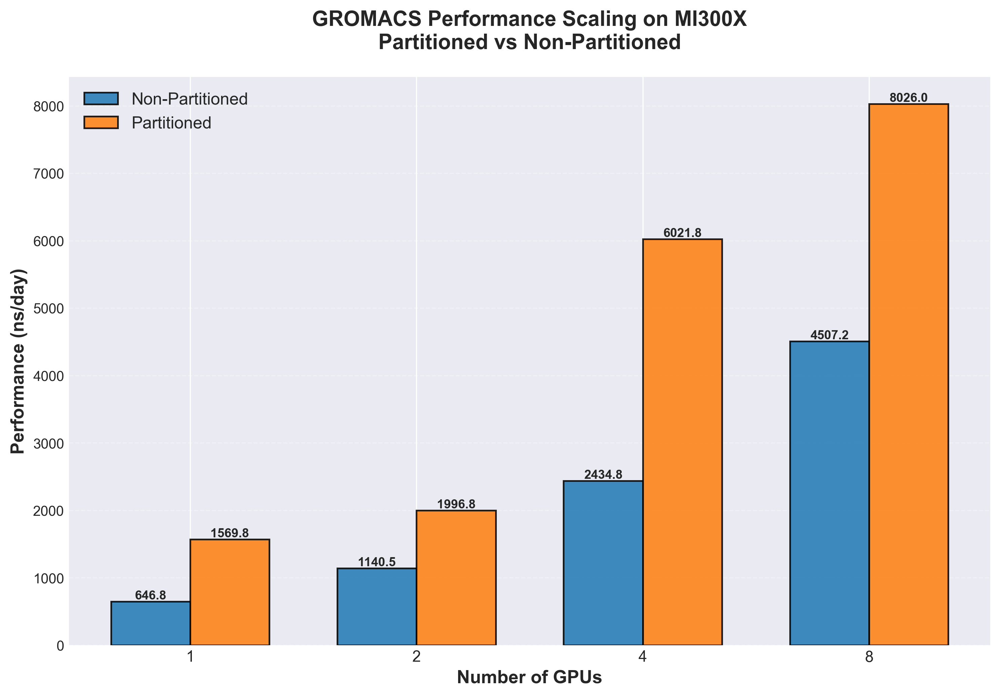
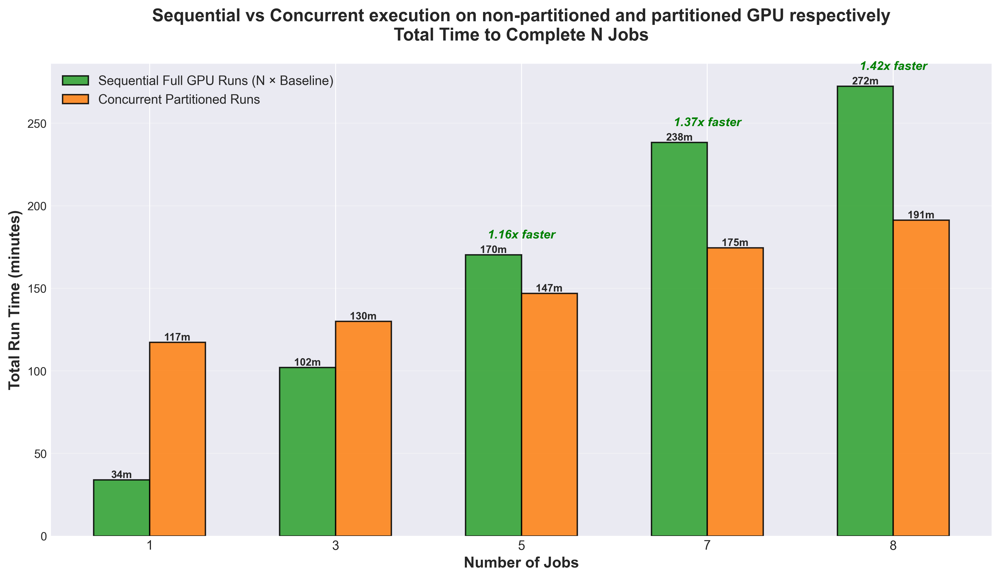

<!---
Copyright (c) 2025 Advanced Micro Devices, Inc. (AMD)

Permission is hereby granted, free of charge, to any person obtaining a copy
of this software and associated documentation files (the "Software"), to deal
in the Software without restriction, including without limitation the rights
to use, copy, modify, merge, publish, distribute, sublicense, and/or sell
copies of the Software, and to permit persons to whom the Software is
furnished to do so, subject to the following conditions:

The above copyright notice and this permission notice shall be included in all
copies or substantial portions of the Software.

THE SOFTWARE IS PROVIDED "AS IS", WITHOUT WARRANTY OF ANY KIND, EXPRESS OR
IMPLIED, INCLUDING BUT NOT LIMITED TO THE WARRANTIES OF MERCHANTABILITY,
FITNESS FOR A PARTICULAR PURPOSE AND NONINFRINGEMENT. IN NO EVENT SHALL THE
AUTHORS OR COPYRIGHT HOLDERS BE LIABLE FOR ANY CLAIM, DAMAGES OR OTHER
LIABILITY, WHETHER IN AN ACTION OF CONTRACT, TORT OR OTHERWISE, ARISING FROM,
OUT OF OR IN CONNECTION WITH THE SOFTWARE OR THE USE OR OTHER DEALINGS IN THE
SOFTWARE.
--->

# Applying Compute Partitioning for Workloads on MI300X GPUs

This blog explains how to use [AMD GPU compute partitioning](https://instinct.docs.amd.com/projects/amdgpu-docs/en/latest/gpu-partitioning/mi300x/overview.html) to increase throughput, utilization and reduce time-to-results for two different types of workloads:

- [GROMACS](https://www.gromacs.org/about.html) for life-science simulations
- [REINVENT4](https://github.com/MolecularAI/REINVENT4/tree/main) for drug discovery model training

We outline what GPU partitioning is on AMD MI300X GPUs, why it helps, how to enable and use it, and provide workload-specific setup notes and example commands.

## What Is Partitioning?

The MI300X architecture packs 8 XCDs (Accelerator Complex Dies) on one card. In the default mode, SPX (Single Partition X-celerator), all XCDs present as one logical device. In CPX (Core Partitioned X-celerator) mode, each XCD presents as an independent logical GPU (hereafter referred to as "a partition"). Practically, one MI300X can expose up to 8 partitions that can run separate jobs simultaneously, each with its own compute slice and memory slice.

Many scientific and ML workloads scale better by running many independent jobs than by trying to strong-scale one job across an entire card. Partitioning improves overall throughput by filling a large GPU with many smaller jobs (e.g., [GROMACS](#gromacs) multidir runs), cuts wall-clock time for sweeps and hyperparameter optimization by running many trials in parallel (e.g., [REINVENT4 HPO workflows](#reinvent)), and avoids cross-job interference by pinning processes to specific partitions. By running workloads this way, overall utilization of the hardware is increased as well.

In practice, GPU partitioning is really easy to set up using one command:

```bash
amd-smi set --gpu all --compute-partition CPX
```

This will change how the GPU is perceived by the system - instead of 1 GPU it will appear as 8 separate GPUs. Partitioning can be applied to any number of GPUs, making up to 64 "separate" GPUs visible to the system on a node of 8 full GPUs. Note that it is possible to apply partitioning on any number of GPUs in the system, e.g. only the first GPU by supplying `--gpu 0` in the command above.

If you want to read more in-depth information about partitioning, take a look at these blogs:

- [Deep dive into the MI300 compute and memory partition modes](https://rocm.blogs.amd.com/software-tools-optimization/compute-memory-modes/README.html)
- [GPU Partitioning Made Easy](https://rocm.blogs.amd.com/software-tools-optimization/gpu-operator-partitioning/README.html)

<a id="gromacs"></a>

## GROMACS

GROMACS is a high-performance molecular dynamics (MD) engine widely used to simulate biomolecules such as proteins, lipids, and nucleic acids. It provides state-of-the-art algorithms and GPU acceleration for computing short-range and long-range interactions, and is a common choice for production MD, free-energy calculations, and method development in life-science workflows.

### GROMACS Setup

In this experiment, partitioned multidir runs were compared to non-partitioned multidir runs to see what benefits partitioning brings to GROMACS. GROMACS "multidir" runs multiple independent replicas (e.g., different initial conditions or ligands) in parallel from separate directories, using one `mdrun` command:

- It increases total throughput by keeping all partitions busy
- It's ideal for ensemble MD, free-energy screening, or parameter sweeps

When combined with GPU partitioning, each replica is pinned to its own partition which in theory maximizes utilization and minimizes interference.

To launch the jobs, a simple .sh-script was used to spawn jobs and perform GPU isolation:

```sh
#!/bin/bash
# GROMACS Run script:

# GPU 0
GPU_0="0,1,2,3,4,5,6,7"
# GPU 1
GPU_1="8,9,10,11,12,13,14,15"
# GPU 2
GPU_2="16,17,18,19,20,21,22,23"
# GPU 3
GPU_3="24,25,26,27,28,29,30,31"
# GPU 4
GPU_4="32,33,34,35,36,37,38,39"
# GPU 5
GPU_5="40,41,42,43,44,45,46,47"
# GPU 6
GPU_6="48,49,50,51,52,53,54,55"
# GPU 7
GPU_7="56,57,58,59,60,61,62,63"

export HIP_VISIBLE_DEVICES=${GPU_0},${GPU_1},${GPU_2},${GPU_3},${GPU_4},${GPU_5},${GPU_6},${GPU_7}

mpirun -n 64 gmx_mpi mdrun \
	-multidir ${DATASET_DIR}/adh_dodec{1..64} \
	-pin on -nsteps 100000 -resetstep 90000 -ntomp 2 \
	-noconfout -nb gpu -bonded gpu -update gpu -pme gpu \
	-v -nstlist 200
```

The above example starts a GROMACS run with 64 replicas using all 64 partitions (8 GPUs), with one replica per partition.

### Results for ADH dodec

The goal of the benchmarks is to achieve as high a simulation speed (ns/day) as possible. To do this, parameter search was performed on `nstlist`, `multidir` (number of replicas per run, must be a multiple of the number of GPUs used) and `ntomp` (numbers of CPU threads per replica). The numbers presented below are hence the highest performing parameter configuration.

The results demonstrate significant performance improvements when using GPU partitioning (CPX mode) compared to SPX (single partition) for GROMACS multidir workloads on the MI300X architecture. Partitioning delivers consistent speedups ranging from 1.75x to 2.47x across different GPU counts (see [Table 1](#table1)). These gains stem from the multidir workflow's natural parallelism: running multiple independent replicas on 8 partitions keeps all compute resources fully utilized, whereas the traditional SPX mode struggles to efficiently distribute work across such highly parallel tasks. The speedup is fairly consistent across different GPU configurations (see [Figure 1](#fig1)). However, the slightly lower speedups at 8 GPUs (1.78x) suggest that at this scale system resources are being saturated, specifically CPU resources due to the large amount of replicas being run in parallel. Even though the system used has 2x AMD EPYC 9654 96-Core Processors, running 128 replicas leaves only 1 **whole** physical CPU core per replica. Since all MI300X nodes are not equipped with equal CPU hardware, one takeaway is that it is important to balance GPU partitions and replica counts for the specific system configuration.

For workflows involving ensemble simulations, free-energy calculations, or parameter sweeps, these results indicate that GPU partitioning can nearly double to triple effective throughput, dramatically reducing time-to-results for production MD campaigns.

*Table 1: MI300X GROMACS performance across 1, 2, 4 and 8 GPUs comparing unpartitioned (SPX) and partitioned (CPX) GPUs*
<a id="table1"></a>
| Compute mode      | Dataset     | Metric      | 1x MI300X | 2x MI300X | 4x MI300X | 8x MI300X |
|-------------------|-------------|-------------|-----------|-----------|-----------|-----------|
| SPX               | adh_dodec   | ns/day      | 647       | 1140      | 2435      | 4507      |
| CPX (Partitioned) | adh_dodec   | ns/day      | 1570      | 1997      | 6022      | 8026      |
| **Performance Difference** ||| **2.43x** | **1.75x** | **2.47x** | **1.78x** |

<a id="fig1"></a>

*Figure 1. Simulation throughput (ns/day, higher is better) comparison of GROMACS multidir runs on MI300X, non-partitioned (blue) vs. partitioned (orange) for 1, 2, 4 and 8 GPUs respectively*

<a id="reinvent"></a>

## REINVENT4

REINVENT4 is an open-source platform for de novo molecular design that supports multiple run modes (e.g., reinforcement learning, transfer learning). In this context, we focus on Transfer Learning (TL) where a prior generative model is fine-tuned on task-specific chemistry (e.g., ChEMBL subsets). TL workloads are naturally parallel across hyperparameter settings and seeds. If you are interested in learning about how to optimize such workloads, read [this blog](https://rocm.blogs.amd.com/artificial-intelligence/running-reinvent4-amd/README.html).

### REINVENT4 Setup

Multiple parallel workflows benefit directly from partitioning, including hyperparameter optimization (HPO) - the systematic search for optimal model settings—transfer learning (TL) sweeps, ensemble training, and multi-seed validation:

- Many small trials fit better than one large trial; partitions let a single MI300X run 8 trials concurrently
- Wall-clock to a good model drops because trials finish in parallel
- Resource isolation avoids one heavy trial degrading others

For this use-case (and other general GPU workloads), it is interesting to see what benefits and drawbacks partitioning can bring to the workflow of developing and training AI models. Only single GPU applications are considered in this experiment.

Here, a docker compose script was used to assign workloads across partitions:

```yml
services:
  reinvent-gpu0: &reinvent-template
    image: reinvent-rocm7
    network_mode: host
    ipc: host
    devices:
      - /dev/kfd
      - /dev/dri/renderD160  # GPU Partition 0
    group_add:
      - video
    security_opt:
      - seccomp=unconfined
    cap_add:
      - SYS_PTRACE
    shm_size: 64G
    tty: true
    volumes:
      - ${DATA_DIR}:/data
      - ${OUTPUT_DIR}:/output
    command: ["/data/<config_name>", "/output/<log_name>"]

  reinvent-gpu1:
    <<: *reinvent-template
    devices:
      - /dev/kfd
      - /dev/dri/renderD161  # GPU Partition 1
    command: ["/data/<config_name>", "/output/<log_name>"]

... # GPU partitions 2-7 omitted for brevity

    reinvent-gpu7:
    <<: *reinvent-template
    devices:
      - /dev/kfd
      - /dev/dri/renderD167  # GPU Partition 8
    command: ["/data/<config_name>", "/output/<log_name>"]
```

All jobs can then be deployed with a simple command:

```sh
docker compose -f docker-compose-reinvent-partition.yml up -d
```

### Results

The baseline job takes approximately 34 minutes on the full GPU, so sequential execution scales linearly (N × 34 minutes, shown in green in the figure above). In contrast, partitioned execution runs multiple jobs simultaneously, with each individual job experiencing some overhead. The critical finding is the **crossover point at 5 jobs**: beyond this threshold, concurrent partitioned execution becomes faster than sequential full GPU execution despite the per-job overhead (see [Figure 2](#fig2)). For 8 concurrent jobs, partitioning delivers a **1.42x speedup** (191 minutes vs 272 minutes), completing the entire workload in 30% less time. This demonstrates that GPU partitioning is highly effective for high-throughput workflows like hyperparameter optimization and transfer learning sweeps, where running many independent trials in parallel outweighs the cost of reduced per-trial performance.

<a id="fig2"></a>

*Figure 2. **Comparison of sequential full GPU execution versus concurrent partitioned runs for REINVENT4 on MI300X.** The graph shows the total time required to complete N jobs using two different approaches: running them sequentially on a full MI300X GPU (green bars) versus running them concurrently on XCD partitions (orange bars).*

## Summary

GPU compute partitioning on AMD MI300X accelerators delivers substantial performance improvements for workloads composed of multiple independent tasks.

For GROMACS multidir workloads, partitioning (CPX mode) achieved **1.75x to 2.47x speedups** across different GPU configurations compared to traditional single-partition mode (SPX) on the ADH Dodec dataset. At scale, 8 partitioned MI300X GPUs delivered 8026 ns/day compared to 4507 ns/day without partitioning (see [Figure 1](#fig1)) - a **1.78x improvement**.

For REINVENT4 hyperparameter optimization and transfer learning workflows, partitioning enabled concurrent execution of multiple training jobs on a single GPU. With 8 concurrent jobs, partitioning achieved a **1.42x speedup** (191 minutes vs 272 minutes), reducing total workflow time by **30%**. This demonstrates that for high-throughput AI workflows involving model sweeps, ensemble training, or multi-seed validation, the benefits of concurrent execution outweigh the per-job overhead introduced by partitioning.

The results presented here illustrate a broader principle: for workloads that are naturally parallel at the job level rather than within a single job, GPU partitioning unlocks higher throughput, faster time-to-results, and better resource utilization. As scientific computing and AI workloads continue to grow in complexity and scale, GPU compute partitioning represents a powerful tool for maximizing the value of accelerator investments and accelerating the pace of discovery.

For readers interested in deeper technical details about partitioning modes and implementation strategies, we recommend exploring these additional blog posts:

- [Deep dive into the MI300 compute and memory partition modes](https://rocm.blogs.amd.com/software-tools-optimization/compute-memory-modes/README.html)
- [GPU Partitioning Made Easy](https://rocm.blogs.amd.com/software-tools-optimization/gpu-operator-partitioning/README.html)
- [Optimizing REINVENT4 workflows on AMD GPUs](https://rocm.blogs.amd.com/artificial-intelligence/running-reinvent4-amd/README.html)

## Disclaimers

Third-party content is licensed to you directly by the third party that owns the
content and is not licensed to you by AMD. ALL LINKED THIRD-PARTY CONTENT IS
PROVIDED "AS IS" WITHOUT A WARRANTY OF ANY KIND. USE OF SUCH THIRD-PARTY CONTENT
IS DONE AT YOUR SOLE DISCRETION AND UNDER NO CIRCUMSTANCES WILL AMD BE LIABLE TO
YOU FOR ANY THIRD-PARTY CONTENT. YOU ASSUME ALL RISK AND ARE SOLELY RESPONSIBLE
FOR ANY DAMAGES THAT MAY ARISE FROM YOUR USE OF THIRD-PARTY CONTENT.
