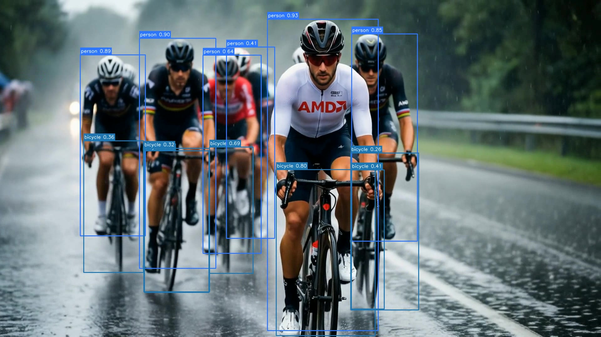
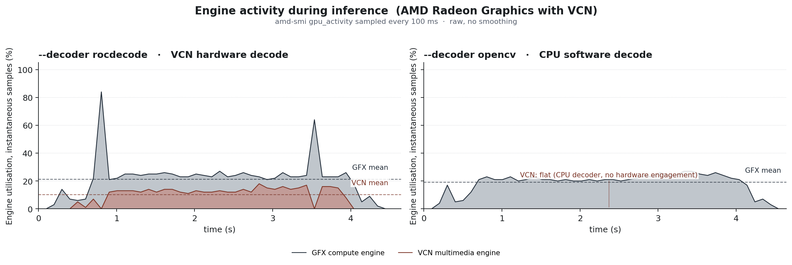

<!---
Copyright (c) 2026 Advanced Micro Devices, Inc. (AMD)

Permission is hereby granted, free of charge, to any person obtaining a copy
of this software and associated documentation files (the "Software"), to deal
in the Software without restriction, including without limitation the rights
to use, copy, modify, merge, publish, distribute, sublicense, and/or sell
copies of the Software, and to permit persons to whom the Software is
furnished to do so, subject to the following conditions:

The above copyright notice and this permission notice shall be included in all
copies or substantial portions of the Software.

THE SOFTWARE IS PROVIDED "AS IS", WITHOUT WARRANTY OF ANY KIND, EXPRESS OR
IMPLIED, INCLUDING BUT NOT LIMITED TO THE WARRANTIES OF MERCHANTABILITY,
FITNESS FOR A PARTICULAR PURPOSE AND NONINFRINGEMENT. IN NO EVENT SHALL THE
AUTHORS OR COPYRIGHT HOLDERS BE LIABLE FOR ANY CLAIM, DAMAGES OR OTHER
LIABILITY, WHETHER IN AN ACTION OF CONTRACT, TORT OR OTHERWISE, ARISING FROM,
OUT OF OR IN CONNECTION WITH THE SOFTWARE OR THE USE OR OTHER DEALINGS IN THE
SOFTWARE.
--->

# Building a GPU-Resident YOLO26 Object Detection Pipeline on the AMD Radeon™ AI PRO R9700 GPU

Modern AMD GPUs include a dedicated hardware block for video processing called the Video Core Next (VCN) engine. By chaining VCN directly into machine learning frameworks, you can build an object detection pipeline where a video frame stays in VRAM from decode to the final bounding boxes. The host sees only the surviving detections.

In this guide, we build that pipeline on the AMD ROCm™ 7.2 platform, using [Ultralytics YOLO26](https://docs.ultralytics.com/models/yolo26/) as the detector. The complete source code for this tutorial lives in the [companion GitHub repository](https://github.com/amd/rocm-examples).

We integrate three core components:

* **[rocDecode](https://rocm.docs.amd.com/projects/rocDecode/en/latest/) and its Python bindings [rocPyDecode](https://github.com/ROCm/rocPyDecode):** A ROCm library that decodes compressed video directly on AMD GPUs using the on-chip VCN engines.
* **[DLPack](https://github.com/dmlc/dlpack):** A standard tensor memory layout that allows frameworks to exchange GPU buffers without making redundant memory copies.
* **[MIGraphX](https://rocm.docs.amd.com/projects/AMDMIGraphX/en/latest/):** AMD's graph inference engine that compiles and runs optimized deep learning models natively on AMD GPUs.

## Pipeline Architecture: rocDecode to DLPack to MIGraphX

There are two common approaches for video pipelines: decoding on the CPU with inference on the GPU, or both on the GPU. This guide takes the second approach. Decoding runs on the VCN block, separate from the compute cores that run PyTorch and MIGraphX. Neither the CPU nor the GPU compute cores are involved in the decode itself.

As shown in the architecture diagram, the pipeline consists of four GPU-resident stages. A video packet is decoded into a device buffer, exposed as a DLPack tensor, preprocessed in PyTorch, and handed to MIGraphX. YOLO26's end-to-end head emits final detections directly, so PyTorch only undoes the letterbox before returning survivors to the host.


This approach frees the host CPU for the work that runs after detection: trackers, downstream models, application logic. GPU decoding also reduces PCIe traffic, because only the compressed bitstream crosses the bus instead of every raw frame.

The `DtoH copy` shown at the end of the diagram is a demo-only artifact: the output video has to be drawn on the host.

## Prerequisites and Setup

* **Hardware:** A ROCm-supported AMD GPU with a VCN-capable video engine, such as AMD Radeon™ AI PRO R9700 or AMD Instinct™ MI300X / MI325X / MI350X / MI355X. For the codec-by-architecture support matrix, see the [rocDecode formats and architectures reference](https://rocm.docs.amd.com/projects/rocDecode/en/latest/reference/rocDecode-formats-and-architectures.html).
* **Host software:** A working [ROCm installation](https://rocm.docs.amd.com/projects/install-on-linux/en/latest/) and Docker Engine.
* **Container:** ROCm 7.2.2 with PyTorch 2.10.0 and Python 3.10 on Ubuntu 22.04 (exact tag below).

**Launch the container.** Use the [rocm/pytorch Docker image](https://hub.docker.com/r/rocm/pytorch) with GPU-access flags. `HIP_VISIBLE_DEVICES=0` pins the container to the first AMD GPU. On a host with multiple DRM render nodes (integrated plus discrete, or several discretes), set the index of the GPU you want to target.

```bash
docker run -it --rm \
  --device=/dev/kfd \
  --device=/dev/dri \
  --network host \
  --ipc host \
  --group-add video \
  --cap-add=SYS_PTRACE \
  --security-opt seccomp=unconfined \
  -e HIP_VISIBLE_DEVICES=0 \
  -v $(pwd):/workspace -w /workspace \
  rocm/pytorch:rocm7.2.2_ubuntu22.04_py3.10_pytorch_release_2.10.0
```

**Install and verify rocDecode.** The rocDecode packages come from the **rocm** repository, already configured in the base image. Their libva backend comes from AMD's **graphics** repository, which we add below:

```bash
echo "deb [arch=amd64 signed-by=/etc/apt/keyrings/rocm.gpg] \
  https://repo.radeon.com/graphics/latest/ubuntu jammy main" \
  > /etc/apt/sources.list.d/amdgpu-graphics.list

apt-get update -y
apt-get install -y \
  rocdecode rocdecode-dev rocdecode-host \
  rocpydecode rocjpeg rocjpeg-dev libdlpack-dev
pip install ultralytics==8.4.41 onnx rich opencv-python-headless

export LD_LIBRARY_PATH=/opt/rocm/lib:$LD_LIBRARY_PATH
export PYTHONPATH=/opt/rocm/lib:$PYTHONPATH

python3 -c 'import pyRocVideoDecode.decoder, migraphx; print("Libraries loaded successfully!")'
```

### Compile the model

MIGraphX compiles the ONNX graph into a GPU-tuned `.mxr` binary. We use Ultralytics' [`yolo26s.pt`](https://docs.ultralytics.com/models/yolo26/), the small variant of the YOLO26 object detector. Its end-to-end head emits a `[1, 300, 6]` tensor (`[x1, y1, x2, y2, conf, class_id]` per row) and skips NMS entirely.

The build runs in two separate Python invocations: first export `yolo26s.pt` to ONNX, then compile that ONNX into a MIGraphX `.mxr` binary. Splitting them avoids an Ultralytics side effect that hides the GPU from MIGraphX when both steps share a process.

```python
from ultralytics import YOLO

YOLO("yolo26s.pt").export(format="onnx", dynamic=False, batch=1, imgsz=640)
```

```python
import migraphx

model = migraphx.parse_onnx("yolo26s.onnx")

# FP16 quantization speeds up model inference without accuracy drop
migraphx.quantize_fp16(model)

# offload_copy=False exposes the output as a named parameter so we can bind
# a pre-allocated PyTorch tensor to it at inference time (see Step 3).
model.compile(migraphx.get_target("gpu"), offload_copy=False)

migraphx.save(model, "model.mxr")
```

## Step 1: GPU-native decoding with rocDecode

The input is an MP4 or MKV file with H.264 or H.265 video. This guide uses `peloton_sample_ai_gen.mp4`, a 15-second 1920×1080 H.264 cycling clip shipped alongside the source code in the [companion GitHub repository](https://github.com/amd/rocm-examples). The clip is upscaled with FFmpeg's lanczos filter from a 1280×704 AI-generated source produced with [Qwen-Image-2512](https://huggingface.co/Qwen/Qwen-Image-2512) and [Wan 2.2 I2V-A14B](https://huggingface.co/Wan-AI/Wan2.2-I2V-A14B) on an AMD Instinct™ MI350X GPU with ROCm 7.2.

Two rocPyDecode components turn the file into GPU-resident frames:

* The **demuxer** splits the container into elementary video packets and reports the codec id, which we pass to the decoder.
* The **decoder** runs on the VCN engine and produces a decoded frame in VRAM for each packet. rocPyDecode can deliver the frame either as a raw NV12 surface or already converted to RGB on the GPU. We use the second path (`GetFrameRgb`) so PyTorch sees a ready-to-consume `[H, W, 3]` tensor. We also pick the *device-copied* output mode: the decoder owns each surface, keeps it in DLPack-wrappable memory, and recycles it on the next call. The lower-overhead *device-internal* mode saves one intra-VRAM copy but requires the caller to manage surface lifetime; see the [rocDecode documentation](https://rocm.docs.amd.com/projects/rocDecode/en/latest/) for details.

### Set up the demuxer and decoder

Build the demuxer/decoder pair and pin them to the first HIP device:

```python
from pyRocVideoDecode.decoder import decoder, GetRocDecCodecID
from pyRocVideoDecode.demuxer import demuxer
from pyRocVideoDecode.types import OUT_SURFACE_MEM_DEV_COPIED

input_path = "peloton_sample_ai_gen.mp4"  # H.264 / H.265 in MP4 or MKV

demux = demuxer(input_path)
codec_id = GetRocDecCodecID(demux.GetCodecId())

viddec = decoder(
    codec_id,
    device_id=0,                          # first HIP device
    mem_type=OUT_SURFACE_MEM_DEV_COPIED,  # own VRAM surface, DLPack-safe
    b_force_zero_latency=False,           # emit frames in display order
    crop_rect=None,                       # full frame
    max_width=0,                          # 0 = use demuxer's width
    max_height=0,                         # 0 = use demuxer's height
    clk_rate=1000,                        # timestamp resolution (ms)
)
```

We keep display order because the demo writes the detections back to a video file. For detection-only loops where frame order does not matter, set `b_force_zero_latency=True` instead to emit each frame as soon as it is decoded.

### Decode and wrap as a PyTorch tensor

`GetFrameRgb(packet, rgb_format)` decodes the next packet and converts the result from NV12 to interleaved 8-bit RGB on the GPU in a single step. We use `rgb_format=3` for RGB; `rgb_format=1` would deliver BGR instead. The converted surface is exposed through `packet.ext_buf[0]` and we wrap it with [`from_dlpack`](https://docs.pytorch.org/docs/stable/generated/torch.from_dlpack.html) as a `[H, W, 3]` PyTorch view without copying. The view is valid only until `ReleaseFrame`, so anything that must outlive the iteration has to be cloned.

*Note (rocPyDecode 0.8.0 / rocm/pytorch:rocm7.2.2):* The DLPack capsule for the RGB surface advertises `strides=(W*3, 1, 0)` for an `[H, W, 3]` shape. The helper restores the correct strides `(W*3, 3, 1)` with [`torch.Tensor.as_strided`](https://docs.pytorch.org/docs/stable/generated/torch.Tensor.as_strided.html) and clamps height to `H - 1` to stay within declared storage. The missing bottom row has no measurable effect on detection: the preprocessing step letterbox-pads the frame to 640×640 anyway.

Define the helper once, before the decode loop calls it:

```python
import torch

def decoded_rgb_view(packet) -> torch.Tensor:
    raw = torch.from_dlpack(packet.ext_buf[0])
    H, W = raw.shape[:2]
    return raw.as_strided((H - 1, W, 3), (W * 3, 3, 1))
```

With the helper in scope, the decode loop is a straight call sequence:

```python
packet = demux.DemuxFrame()
n_frames = viddec.DecodeFrame(packet)

for _ in range(n_frames):
    pts = viddec.GetFrameRgb(packet, rgb_format=3)
    if pts == -1:
        viddec.ReleaseFrame(packet)
        continue

    rgb = decoded_rgb_view(packet)  # [H, W, 3] uint8, cuda

    # ... preprocess / inference / draw ...

    viddec.ReleaseFrame(packet)  # return the surface to the decoder pool
```

## Step 2: GPU-native preprocessing with PyTorch

With `rgb` resident on the GPU, we run YOLO preprocessing natively in PyTorch using [torch.nn.functional](https://pytorch.org/docs/stable/nn.functional.html). Reshape, normalization, resize, and letterbox pad each allocate a new device tensor on the active PyTorch stream, the same stream MIGraphX uses in Step 3. None of these steps touch host memory.

```python
import torch.nn.functional as F

def preprocess_color_layout(rgb_tensor: torch.Tensor) -> torch.Tensor:
    tensor = rgb_tensor.permute(2, 0, 1).unsqueeze(0)  # HWC -> BCHW
    return tensor / 255.0                              # [0, 255] -> [0.0, 1.0]
```

Next, resize and letterbox-pad to the 640×640 model input with a uniform scale. The geometry helper is split out so postprocess can reuse it to undo the letterbox:

```python
def letterbox_geometry(h: int, w: int, target: int = 640) -> tuple:
    scale = min(target / w, target / h)
    # floor division matches YOLO's training-time letterbox convention
    pad_x = (target - int(w * scale)) // 2
    pad_y = (target - int(h * scale)) // 2
    return scale, pad_x, pad_y

def preprocess_spatial(tensor: torch.Tensor, target: int = 640) -> torch.Tensor:
    h, w = tensor.shape[2], tensor.shape[3]
    scale, pad_x, pad_y = letterbox_geometry(h, w, target)
    new_h, new_w = int(h * scale), int(w * scale)
    tensor = F.interpolate(tensor, size=(new_h, new_w), mode="bilinear", align_corners=False)
    padding = (pad_x, target - new_w - pad_x, pad_y, target - new_h - pad_y)
    tensor = F.pad(tensor, padding, value=114.0 / 255.0)  # YOLO letterbox gray
    return tensor.contiguous()
```

## Step 3: GPU-native inference with MIGraphX

[MIGraphX](https://rocm.docs.amd.com/projects/AMDMIGraphX/en/latest/) executes the compiled `.mxr` model asynchronously on the active PyTorch stream. Pointing it at PyTorch tensor addresses eliminates framework-level copies, so both input and output stay on the GPU.

### Load the model and discover parameter names

By default a MIGraphX program owns its output buffer and copies the result to host after each run. Compiling with `offload_copy=False` instead exposes the output as a named parameter we can bind to a pre-allocated PyTorch tensor and keep on the GPU:

```python
import migraphx
import torch

model = migraphx.load("model.mxr")

param_shapes = model.get_parameter_shapes()
input_name = "images"
output_name = next(name for name in param_shapes if name != input_name)

input_shape = param_shapes[input_name]
output_shape = param_shapes[output_name]
```

### Pre-allocate the output tensor

Allocate the output on the GPU once and wrap its device pointer as a MIGraphX argument. Reusing the argument across frames keeps per-frame work to a single pointer bind plus one kernel dispatch:

```python
output_tensor = torch.empty_strided(
    output_shape.lens(), output_shape.strides(),
    dtype=torch.float32, device="cuda",
)
mgx_output_arg = migraphx.argument_from_pointer(output_shape, output_tensor.data_ptr())
```

### Run inference per frame

The per-frame call binds the preprocessed input and submits the graph on the active PyTorch stream. MIGraphX takes the stream handle as `ihipStream_t`, so its kernels stay ordered with the surrounding PyTorch work.

```python
def run_inference(input_tensor: torch.Tensor) -> torch.Tensor:
    curr_stream = torch.cuda.current_stream()
    mgx_buffers = {
        input_name: migraphx.argument_from_pointer(input_shape, input_tensor.data_ptr()),
        output_name: mgx_output_arg,
    }
    model.run_async(mgx_buffers, curr_stream.cuda_stream, "ihipStream_t")
    return output_tensor
```

## Step 4: GPU-native postprocessing with PyTorch

MIGraphX returns the 1×300×6 detection tensor in letterboxed coordinates: four box corners, confidence, and class id per row. YOLO26's end-to-end head does the selection itself, so postprocess collapses to a confidence filter, a coordinate rescale, and a single batched copy to the host.

The unused slots in this tensor are padded with zero-confidence rows, so a single threshold removes them along with any real low-confidence detections. We use 0.25, the Ultralytics default. We apply the threshold mask to the full tensor at once: filtering each column separately would force three device-to-host syncs to size each output, instead of one for the combined tensor:

```python
def filter_predictions(raw: torch.Tensor, conf_thresh: float) -> torch.Tensor:
    preds = raw[0]                           # [300, 6]
    mask  = preds[:, 4] > conf_thresh
    return preds[mask].clone()               # [N, 6] survivors
```

The boxes still live in 640×640 letterboxed space, so undo the uniform scale and the letterbox padding in two batched ops, in place on the survivors tensor:

```python
def transform_coordinates(survivors: torch.Tensor, scale: float, pad_x: int, pad_y: int) -> torch.Tensor:
    survivors[:, [0, 2]] = (survivors[:, [0, 2]] - pad_x) / scale
    survivors[:, [1, 3]] = (survivors[:, [1, 3]] - pad_y) / scale
    return survivors
```

A single `survivors.cpu().numpy()` transfers the result to the host. If the next consumer is another GPU stage (tracker, serializer, downstream model), that final copy is unnecessary too.

The 4 steps now compose into a minimal per-frame loop:

```python
while True:
    # Step 1: Decoding: VCN demuxes and decodes the compressed bitstream on-chip
    packet = demux.DemuxFrame()
    for _ in range(viddec.DecodeFrame(packet)):  # one packet may yield 0-N frames
        if viddec.GetFrameRgb(packet, rgb_format=3) == -1:  # frame not ready
            viddec.ReleaseFrame(packet)
            continue

        # Step 2: Preprocessing (all on GPU, no host copies)
        # Fix DLPack strides, reorder HWC -> CHW, normalize to [0, 1],
        # record letterbox scale/padding, resize to 640x640.
        rgb                 = decoded_rgb_view(packet)
        chw                 = preprocess_color_layout(rgb)
        scale, pad_x, pad_y = letterbox_geometry(chw.shape[2], chw.shape[3])
        model_input         = preprocess_spatial(chw)

        # Step 3: Inference
        # MIGraphX runs the pre-compiled .mxr graph on the GPU,
        # returns a [1, 300, 6] tensor (x1, y1, x2, y2, conf, class_id).
        raw                 = run_inference(model_input)

        # Step 4: Postprocessing
        # Drop low-confidence boxes, map coords back to original frame resolution.
        # Only surviving detections are copied to the host.
        survivors           = filter_predictions(raw, conf_thresh=0.25)
        survivors           = transform_coordinates(survivors, scale, pad_x, pad_y)
        detections          = survivors.cpu().numpy()  # single batched DtoH
        viddec.ReleaseFrame(packet)

    if packet.bitstream_size <= 0:  # end-of-stream
        break
```

The full runnable sample is in the [companion GitHub repository](https://github.com/amd/rocm-examples); its `main.py` adds command-line parsing and an OpenCV CPU decoding baseline on top of the snippets in this section.

### Adapting to YOLO models that need NMS

Older detectors such as the YOLO11 family use one-to-many label assignment and need NMS to deduplicate predictions. Two GPU-native primitives keep that step on-device: [`torchvision.ops.batched_nms`](https://docs.pytorch.org/vision/main/generated/torchvision.ops.batched_nms.html) or [`ultralytics.utils.ops.non_max_suppression`](https://docs.ultralytics.com/reference/utils/ops/#ultralytics.utils.ops.non_max_suppression). Either replaces the filter_predictions step; the rest of the loop is unchanged.

## Running and Verifying on the GPU

Use `--decoder rocdecode` to route decoding through VCN; `--decoder opencv` is a CPU baseline for the verification step below.

```bash
python3 main.py \
  --model model.mxr \
  --input peloton_sample_ai_gen.mp4 \
  --decoder rocdecode \
  --output output.mp4
```

After processing, the output video contains the drawn detections:



The pipeline keeps tensors on the GPU until the final survivor copy; a stray `.cpu()` or host-side staging would break that silently. **PyTorch asserts** below fail fast if decode, preprocess, or inference drifts to the CPU.

```python
assert rgb.is_cuda,         "decoder returned a CPU tensor"
assert model_input.is_cuda, "preprocess produced a CPU tensor"
assert raw.is_cuda,         "MIGraphX output is not on the GPU"
```

For a hardware-level view, sample per-engine activity with [`amd-smi`](https://rocm.docs.amd.com/projects/amdsmi/en/latest/):

```bash
# Print GPU 0 engine usage every second
amd-smi metric --usage -g 0 --watch 1 --watch_time 30
```

Each GPU exposes up to 4 VCN instances, so `VCN_ACTIVITY` is an array; entries beyond the physical engine count read `N/A`. The R9700 used in this guide reports one active engine and three `N/A` slots; datacenter Instinct™ SKUs expose more (see the [rocDecode codec-and-architecture matrix](https://rocm.docs.amd.com/projects/rocDecode/en/latest/reference/rocDecode-formats-and-architectures.html)). A representative sample:

```text
GPU: 0
    USAGE:
        GFX_ACTIVITY: 40 %
        UMC_ACTIVITY:  3 %
        MM_ACTIVITY:   9 %
        VCN_ACTIVITY: [9 %, N/A, N/A, N/A]
        ...
```

To see how this maps to the hardware over a longer run, we can plot the engine activity side-by-side.

When using the `rocDecode` path, the VCN multimedia engine and the GFX compute engine run concurrently. VCN handles the compressed bitstream at a low, steady utilization, visible as a continuous low fill in the chart; a single H.264/H.265 stream uses only a small fraction of the fixed-function block, which idles between frames. The GFX compute engine carries the rest of the per-frame work: the `GetFrameRgb` color conversion kernel, PyTorch preprocessing, and MIGraphX inference.

Falling back to the OpenCV baseline disables the hardware decode path entirely. The VCN engine remains idle because the host CPU now decompresses the video. The GFX compute engine still runs the neural network pipeline, but its load is also reduced because OpenCV delivers pre-converted RGB frames, sparing the GPU from the color conversion step.



For a timeline-level view, [`rocprofv3`](https://rocm.docs.amd.com/projects/rocprofiler-sdk/en/latest/) shows per-engine VCN activity side by side with HIP kernel launches.

## Summary

On ROCm 7.2, rocDecode, DLPack, and MIGraphX keep a frame on the GPU from VCN all the way to the final bounding boxes; the host sees only the survivors. VCN handles decode, the active PyTorch HIP stream carries preprocess and inference, and YOLO26's end-to-end head outputs final boxes directly. The same template adapts to other ROCm-supported AMD GPUs, from Radeon™ AI PRO workstations to Instinct™ accelerators.

The reference implementation has two intentional constraints:

* **Single-stream and serial by design.** The tutorial uses a `batch=1` model and a single Python thread that dispatches decode and inference serially. To scale up, you would decouple the engines: run decoder threads pushing DLPack tensors to a shared queue, and dedicate a PyTorch stream to pull from the queue, batch the frames, and run inference. You can compile the model with a fixed batch size (e.g., `batch=4`) matching your camera count; dynamic shapes are only required if the number of active streams fluctuates at runtime.
* **Codec coverage is bound to rocDecode.** Only codecs in the [rocDecode codec-and-architecture matrix](https://rocm.docs.amd.com/projects/rocDecode/en/latest/reference/rocDecode-formats-and-architectures.html) route through VCN: H.264 and H.265 on most hardware, plus AV1 and VP9 on newer generations. For unsupported formats, remux into an MP4 or MKV container first.

## Additional Resources

* [AMD ROCm™ 7.2 Release Notes](https://rocm.docs.amd.com/en/docs-7.2.0/about/release-notes.html)
* [rocJPEG Documentation](https://rocm.docs.amd.com/projects/rocJPEG/en/latest/), the still-image counterpart to rocDecode for single-image pipelines, which plugs into the same DLPack → MIGraphX path. See also [rocJPEG decoding performance on AMD Instinct GPUs](https://rocm.blogs.amd.com/artificial-intelligence/rocjpeg-decoding-performance-blog/README.html).
* [DLPack Specification](https://dmlc.github.io/dlpack/latest/)

## Disclaimers

Third-party content is licensed to you directly by the third party that owns the content and is not licensed to you by AMD. ALL LINKED THIRD-PARTY CONTENT IS PROVIDED “AS IS” WITHOUT A WARRANTY OF ANY KIND. USE OF SUCH THIRD-PARTY CONTENT IS DONE AT YOUR SOLE DISCRETION AND UNDER NO CIRCUMSTANCES WILL AMD BE LIABLE TO YOU FOR ANY THIRD-PARTY CONTENT. YOU ASSUME ALL RISK AND ARE SOLELY RESPONSIBLE FOR ANY DAMAGES THAT MAY ARISE FROM YOUR USE OF THIRD-PARTY CONTENT.

Use of certain video codecs (including but not limited to H.264 / AVC, H.265 / HEVC, VP9, and AV1) may require licenses from third parties (such as MPEG LA, Via LA, the Alliance for Open Media, or other patent licensing pools or rights holders). It is the user’s responsibility to obtain any such licenses required for the user’s use of any such codecs. AMD provides no patent rights or licenses for the use of any such codecs through AMD products or technologies.
