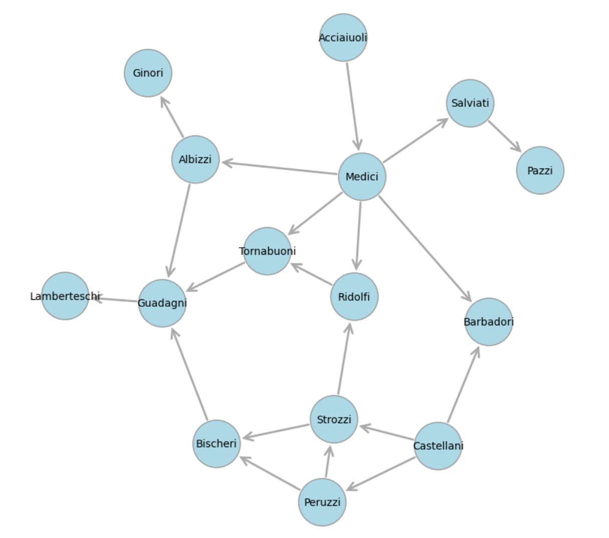
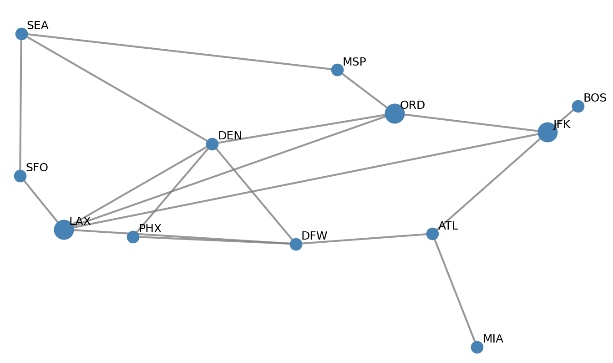
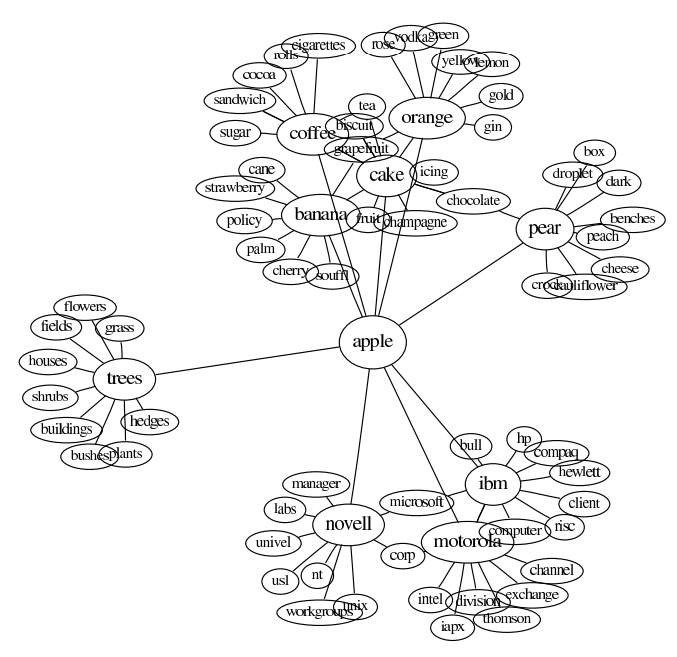
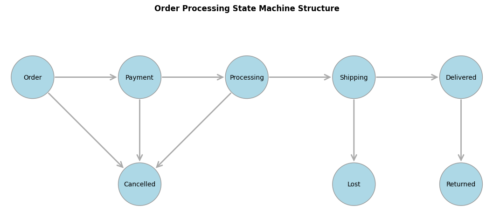
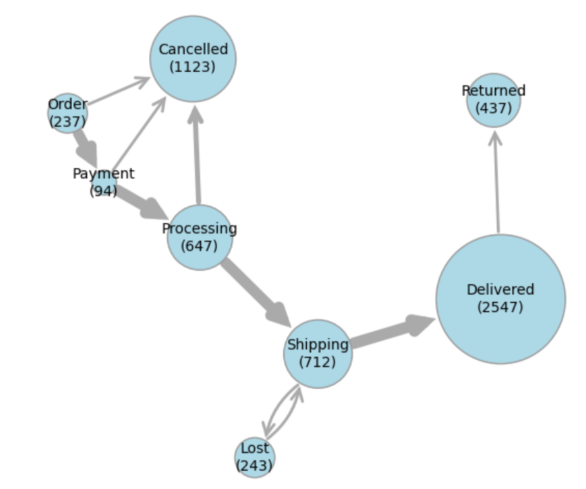
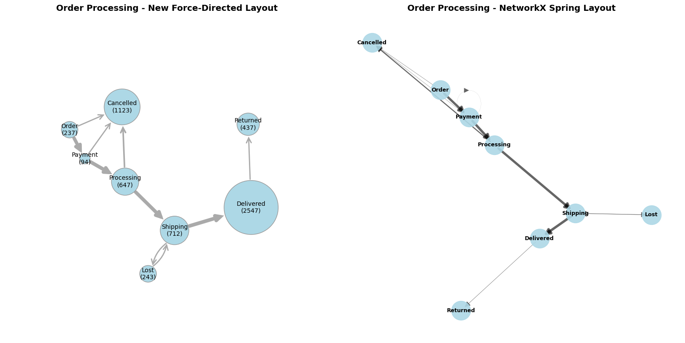
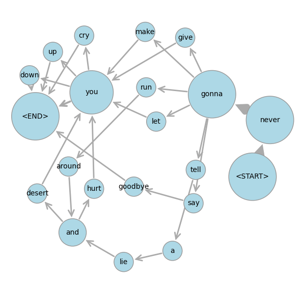
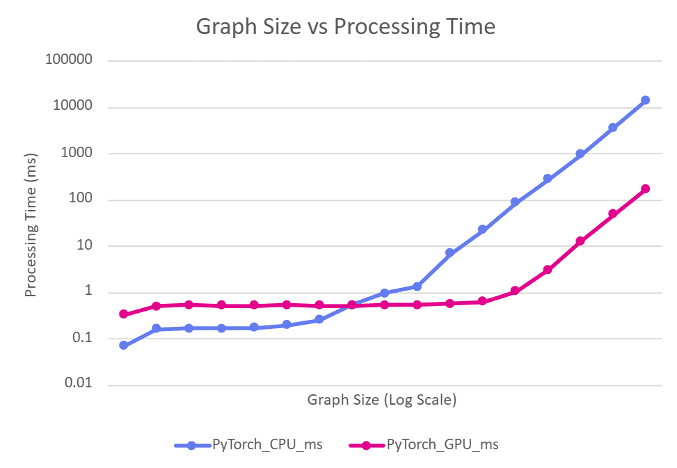

<!---
Copyright (c) 2026 Advanced Micro Devices, Inc. (AMD)

Permission is hereby granted, free of charge, to any person obtaining a copy
of this software and associated documentation files (the "Software"), to deal
in the Software without restriction, including without limitation the rights
to use, copy, modify, merge, publish, distribute, sublicense, and/or sell
copies of the Software, and to permit persons to whom the Software is
furnished to do so, subject to the following conditions:

The above copyright notice and this permission notice shall be included in all
copies or substantial portions of the Software.

THE SOFTWARE IS PROVIDED "AS IS", WITHOUT WARRANTY OF ANY KIND, EXPRESS OR
IMPLIED, INCLUDING BUT NOT LIMITED TO THE WARRANTIES OF MERCHANTABILITY,
FITNESS FOR A PARTICULAR PURPOSE AND NONINFRINGEMENT. IN NO EVENT SHALL THE
AUTHORS OR COPYRIGHT HOLDERS BE LIABLE FOR ANY CLAIM, DAMAGES OR OTHER
LIABILITY, WHETHER IN AN ACTION OF CONTRACT, TORT OR OTHERWISE, ARISING FROM,
OUT OF OR IN CONNECTION WITH THE SOFTWARE OR THE USE OR OTHER DEALINGS IN THE
SOFTWARE.
--->

# Accelerating Graph Layout with AI and ROCm on AMD GPUs

Learn how easy it is to implement established graph algorithms, and deploy them on AMD GPUs with immediate performance improvements, using AI as a coding partner!

This blog demonstrates a practical case study of building a force-directed graph layout engine from scratch with AI assistance.
You will optimize the algorithm for GPU acceleration using PyTorch and ROCm, achieving up to 80x speedup on AMD Instinct GPUs.

## Background on Graph Drawing

States and transitions are often depicted as network graphs.
Graph diagrams have been used to represent social networks, transportation systems, the World Wide Web, and word meanings, as shown in some of the pictures below.

| Florentine Social Network | USA Airport Network | Word Associations and Meaning |
|---|---|---|
|  |  |  |

For example, the states and transitions shown below can be used to track orders in an e-commerce system.



In graph drawing, the positioning and sizes of the nodes and links are often adjusted to reflect
the scenario being modeled. Larger nodes can represent more important or more frequent states,
frequently traversed edges can be made wider, and node positions can be chosen to avoid overlaps and make relationships and clusters apparent.
Several mathematical techniques are used for graph layout, including force-directed graph drawing, which models nodes as particles that repel one another and links or edges as springs pulling particles together.
A classic reference is [Graph drawing by force-directed placement](https://doi.org/10.1002/spe.4380211102) (Fruchterman & Reingold, 1991).

For example, the graph layout below provides a more informative view, showing how many orders are currently in each state and how frequently transitions occur between states.



This visualization shows that the biggest source of cancellations is during the `Processing` state, which raises questions such as "Is the probability of cancellation correlated with longer processing times?", and if so, "What can we do to speed up processing?"
Improved graph drawing can inform both business analytics and operational decisions.

The mathematics required to model such physical systems is very well documented and straightforward for programmers and AI agents to implement in Python.
It's also a natural fit for parallel computation, using data structures and operations at which GPUs excel.

In this blog, you'll learn about the following topics:

* A physics-based, force-directed algorithm for graph layout.
* How to implement a graph renderer and layout algorithm from scratch using AI coding assistance.
* How to adapt and run on AMD GPUs using PyTorch and ROCm, yielding up to 80x speedup on larger benchmark tests.

## Building a Graph Renderer Using AI Coding

Common graph-drawing packages include [Graphviz](https://graphviz.org/) and [NetworkX](https://networkx.org/), though they don't always produce great results. For example, the diagram below compares our version with a spring layout from NetworkX.



Before the advent of AI coding, tuning Graphviz or NetworkX settings was often faster than developing a custom implementation.
Today, AI coding assistance has considerably reduced the cost of writing and testing new code, especially when you can specify the desired behavior clearly.
For relatively simple components, rebuilding them can now be quicker and less cumbersome than reusing existing implementations from larger software packages.

The following section describes a graph layout engine and renderer built from scratch with AI coding assistance. It walks through the steps involved in drawing nodes and links, modeling and applying the physical forces between nodes, and running simulations until these models converge to stable outcomes.

### Graph Renderer

The core rendering function,  `draw_graph`, is available in [graph_renderer.py](./src/graph_renderer.py).

It draws nodes as circles with sizes proportional to node weights, and edges as arrows with widths proportional to edge weights.
Bidirectional edges are curved to avoid overlap.

Example outputs are shown in the [graph_renderer_examples.ipynb](./src/graph_renderer_examples.ipynb) Jupyter notebook.
As of early 2026, AI agents are adept at writing code but can still struggle to evaluate visual output, sometimes missing visual flaws that are obvious to human reviewers.
As a result, using a Jupyter notebook for testing was essential, because it makes visual results easy to inspect and enables precise, iterative improvements.

### Graph Layout Physics

The core layout function for this section is `update_node_position` in [graph_layout.py](./src/graph_layout.py).

It updates the position of a single node by computing three forces:

* **Node Repulsion**: nodes repel each other, scaled by size
* **Link Attraction**: edges pull connected nodes together, proportional to weight
* **Boundary Repulsion**: keeps nodes within the unit circle

The node is then moved in the direction of the combined force, with various limits, like nodes shouldn't be so strongly attracted that they collide.
Scales and limits are affected by a small set of manually tuned constants, with parameters including `node_repulsion`, `link_attraction` and `step_size` that you can experiment with.

A pseudocode summary of the `update_node_position` is as follows:

```python
force = [0.0, 0.0]  # Initialize total force vector

# 1. Node Repulsion: sum repulsion from all other nodes
for each other_node in all_nodes:
    delta = current_position - other_node_position
    distance = norm(delta)
    size_factor = (current_node_size + other_node_size)²
    repulsion = (delta / distance) * (node_repulsion * size_factor / distance²)
    force += repulsion  # Accumulate repulsion force

# 2. Link Attraction: sum attraction along connected edges
for each edge connected to current_node:
    other_node = edge.target_node
    delta = other_node_position - current_position
    attraction = delta * link_attraction * edge_weight⁰·³
    # Cap attraction to prevent collisions
    if movement_from_attraction > distance / 3:
        attraction = attraction * (distance / (3 * movement_from_attraction))
    force += attraction  # Accumulate attraction force

# 3. Boundary Repulsion: force toward center when near edge
dist_from_center = norm(current_position)
dist_to_edge = 1.0 - dist_from_center
boundary_force = boundary_repulsion * node_size * (-current_position) / dist_to_edge²
force += boundary_force  # Accumulate boundary force

# 4. Update position based on combined force
velocity = force * step_size
new_position = current_position + velocity
# Apply limits to prevent overshooting
```

Strictly speaking, the forces are combined to calculate the node's velocity rather than its acceleration,
which leads to ball-and-spoke convergence instead of orbital dynamics.
For more information about computational physics, see [Graph drawing by force-directed placement](https://ftp.mathe2.uni-bayreuth.de/axel/papers/reingold:graph_drawing_by_force_directed_placement.pdf) by Fruchterman & Reingold, 1991.

### Graph Layout Examples

Examples and demonstrations of graph layout can be found in the [graph_layout_demo.ipynb](./src/graph_layout_demo.ipynb) notebook.
The notebook starts with a `simulate_network` function, which repeatedly updates node positions until either a stable state is reached or an iteration budget is exhausted.
The process is fast, because it avoids wasting computational cycles on nodes that are already stabilized.
This optimization was handled particularly effectively by the AI coding agent, prompted with
"Can you add a priority queue optimization to select nodes for update, prioritized by the most recent distance moved?"

Next, the order state machine from above is presented as an example, and you can see the nodes moving by running the cell and watching the output window.
Another example is the Rick Rolls network below, whose graph is derived from a [language bigram model](https://github.com/semanticvectors/llmsbook/blob/main/examples/bigram_model.ipynb).

.

### Summary of Graph Layout with AI Coding

A few years ago, it would have taken at least a few days to put together the graph layout package we've built so far. With AI coding assistance, a lot of the programming work was reduced to minutes! However, it still took several hours to debug results, fix errors, and improve visual output, in many iterations. In the process, the AI agent generated thousands of lines of code, often flaky and redundant, which then needed more error-handling to mitigate its own flakiness.
Distilling that code down to core modules and reliable examples took even longer, though the AI agent also helped with this.

With full control over implementing only the features we need, the core library code in [graph_renderer.py](./src/graph_renderer.py) and [graph_layout.py](./src/graph_layout.py) is just about 200 lines. The code went through much more rapid iterations and refactorings to get this state than it would have done without AI help, yet we still reached our desired outcomes much faster overall.

## GPU Optimization Using PyTorch and ROCm

This graph renderer was originally developed to analyze internal software process data.
It also makes a compelling example for showcasing GPU acceleration with ROCm.

The reason is that the physics simulation steps, such as compute the distance between two points, are very basic numerical operations repeated many times for multiple point pairs.
These are the kind of SIMD (Single Instruction, Multiple Data) operations at which GPUs excel.

Conceptually, the key difference from the sequential implementation above is that all the node positions are updated simultaneously, whereas the sequential version uses a repeated loop that updates the position of just one node at a time.
The parallel version is much closer in spirit to the force-directed physics analogy: in nature, forces all to operate at once, and particles don't take turns moving.
Computationally, however, things become more complicated: if a node's position is updated by one process at the same time as its old position is being used by another process, inconsistencies and errors can arise.
Thankfully, these are the kinds of memory layout and synchronization tasks that PyTorch and ROCm handle automatically. Reliable code to run graph layout computations in parallel is much easier to write than in previous decades, and AI is making this process even faster.

For example, with four nodes A, B, C, D at positions (a₁, a₂), (b₁, b₂), (c₁, c₂), (d₁, d₂), this PyTorch broadcast operation computes all pairwise differences:

```python
positions = torch.tensor([[a_1, a_2], [b_1, b_2], [c_1, c_2], [d_1, d_2]])  # Shape: (4, 2)
differences = positions[:, None, :] - positions[None, :, :]  # Shape: (4, 4, 2)
```

This produces a 4×4×2 tensor where each cell `[i, j, :]` contains the difference vector from node `i` to node `j`:

| | A | B | C | D |
|---|---|---|---|---|
| A | [0, 0] | [a₁ - b₁, a₂ - b₂] | [a₁ - c₁, a₂ - c₂] | [a₁ - d₁, a₂ - d₂] |
| B | [b₁ - a₁, b₂ - a₂] | [0, 0] | [b₁ - c₁, b₂ - c₂] | [b₁ - d₁, b₂ - d₂] |
| C | [c₁ - a₁, c₂ - a₂] | [c₁ - b₁, c₂ - b₂] | [0, 0] | [c₁ - d₁, c₂ - d₂] |
| D | [d₁ - a₁, d₂ - a₂] | [d₁ - b₁, d₂ - b₂] | [d₁ - c₁, d₂ - c₂] | [0, 0] |

The number of entries in this table grows quadratically in the number of nodes, so at first glance it might seem that constructing the table makes the problem much larger. However, the sequential version of the algorithm ultimately performs the same quadratic amount of computation.
Broadcasting the data in this way enables thousands of GPU cores to process individual table cells simultaneously.
While the overall computation remains quadratic, it uses more space and more compute units at once to save time.
This ability to perform many simple operations in parallel, rather than one after another, is what enables methods like [Scaled Dot-Product Attention](https://proceedings.neurips.cc/paper_files/paper/2017/file/3f5ee243547dee91fbd053c1c4a845aa-Paper.pdf) to achieve remarkable AI performance on GPUs.

Next, the distance table is processed, with contributions along each row combined to compute the total repulsive force on each node.
Attractive forces from links and repulsion from boundaries are handled in a similar way.
This approach breaks each step of the graph layout problem into operations on individual table cells, followed by summations over rows and columns.
GPUs excel at these operations, and AI coding agents know how to use them efficiently.

The resulting code is in the `update_all_positions_torch` function in [graph_layout.py](./src/graph_layout.py).
It was largely written by AI, but still required careful guidance and testing.
This included telling the AI agent not to reproduce the priority
queue optimization from the earlier synchronous approach, since it adapts very poorly to parallel computation.
Instead, the parallel version does devote more computational resources than the sequential version to nodes that are barely moving,
but because all node positions are updated in parallel, this does not slow down the overall process.

You can measure the impact of GPU acceleration on synthetic benchmark graphs using the routine in
[graph_layout_benchmark.py](./src/graph_layout_benchmark.py).
With ROCm 7.1 on a single MI350X GPU, we obtained the following results:



This shows the CPU vs GPU processing time for 20 iterations of the `update_all_positions_torch` function on graphs with $2^n$ nodes, as $n$ increases.
The small graphs above do not benefit from GPU acceleration due to constant overheads, but for larger graphs, the GPU achieved $\sim 80x$ speedup over the CPU while running the exact same PyTorch code.

The parallel version does not require GPUs: if no GPU is available, PyTorch runs the program
on parallel CPU threads, still providing considerable speedups over the single-threaded Python version.
This is also demonstrated in [graph_layout_demo.ipynb](./src/graph_layout_demo.ipynb).

More advanced techniques exist to scale graph processing even further on GPUs. For more information, see [Accelerating Force-Directed Graph Drawing with RT Cores](https://arxiv.org/abs/2008.11235). This blog, however, doesn't demonstrate new graph algorithms, but how easy it is to implement established techniques and deploy them on AMD GPUs with immediate performance improvements, using AI as a coding partner.

## Summary

This blog has demonstrated how AI coding assistance can help developers quickly implement established graph layout algorithms and optimize them for GPU acceleration using PyTorch and ROCm. By building a custom force-directed graph layout engine from scratch, we achieved significant performance improvements, up to 80x speedup on AMD Instinct GPUs, while maintaining full control over the implementation. With AI as a coding partner, implementing and deploying GPU-accelerated graph algorithms on AMD hardware has never been more accessible.

For many problems, including large-scale AI training and inference, research and development has long focused on optimizing computation using GPUs.
In 2026, you don't have to be an AI researcher to develop GPU optimizations, but you will need the diligence to keep testing, measuring, and refining your code to stay on track.
If a problem can be expressed in well-understood mathematical formulas, collaborating with AI for coding may allow you to make legacy algorithms run orders of magnitude faster on modern hardware.

## Disclaimers

Third-party content is licensed to you directly by the third party that owns the
content and is not licensed to you by AMD. ALL LINKED THIRD-PARTY CONTENT IS
PROVIDED “AS IS” WITHOUT A WARRANTY OF ANY KIND. USE OF SUCH THIRD-PARTY CONTENT
IS DONE AT YOUR SOLE DISCRETION AND UNDER NO CIRCUMSTANCES WILL AMD BE LIABLE TO
YOU FOR ANY THIRD-PARTY CONTENT. YOU ASSUME ALL RISK AND ARE SOLELY RESPONSIBLE
FOR ANY DAMAGES THAT MAY ARISE FROM YOUR USE OF THIRD-PARTY CONTENT.
