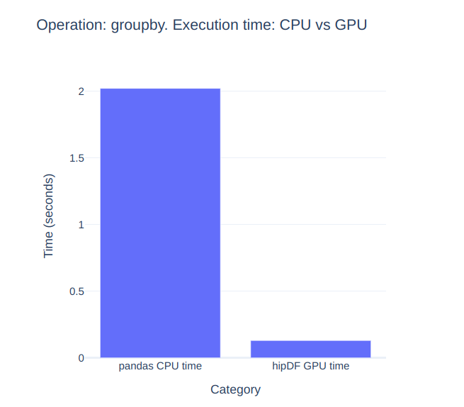

<!---
Copyright (c) 2025 Advanced Micro Devices, Inc. (AMD)

Permission is hereby granted, free of charge, to any person obtaining a copy
of this software and associated documentation files (the "Software"), to deal
in the Software without restriction, including without limitation the rights
to use, copy, modify, merge, publish, distribute, sublicense, and/or sell
copies of the Software, and to permit persons to whom the Software is
furnished to do so, subject to the following conditions:

The above copyright notice and this permission notice shall be included in all
copies or substantial portions of the Software.

THE SOFTWARE IS PROVIDED "AS IS", WITHOUT WARRANTY OF ANY KIND, EXPRESS OR
IMPLIED, INCLUDING BUT NOT LIMITED TO THE WARRANTIES OF MERCHANTABILITY,
FITNESS FOR A PARTICULAR PURPOSE AND NONINFRINGEMENT. IN NO EVENT SHALL THE
AUTHORS OR COPYRIGHT HOLDERS BE LIABLE FOR ANY CLAIM, DAMAGES OR OTHER
LIABILITY, WHETHER IN AN ACTION OF CONTRACT, TORT OR OTHERWISE, ARISING FROM,
OUT OF OR IN CONNECTION WITH THE SOFTWARE OR THE USE OR OTHER DEALINGS IN THE
SOFTWARE.
--->

# DataFrame Acceleration: hipDF and hipDF.pandas on AMD GPUs

In our previous blog [CuPy and hipDF on AMD: The Basics and beyond](https://rocm.blogs.amd.com/artificial-intelligence/cupy_hipdf_portfolio_opt/README.html), we explored the fundamentals of [hipDF](https://rocm.docs.amd.com/projects/hipDF/en/latest/) and demonstrated the significant speed up it provides when compared to [Pandas](https://pandas.pydata.org/) for data manipulation tasks, particularly when AMD GPUs are used.

hipDF is a GPU-accelerated DataFrame library designed to bring the power of GPUs to data manipulation tasks. hipDF offers an interface similar to the [Python Data Analysis Library: Pandas](https://pandas.pydata.org/) but is optimized for speed and efficiency on GPUs. It provides high performance capabilities for operations such as data loading, data aggregation, and data transformations.

In this follow-up blog, we explore additional capabilities of [hipDF](https://rocm.docs.amd.com/projects/hipDF/en/latest/) and the hipdf.pandas acceleration layer running on AMD GPUs using ROCm. Specifically, we will examine the high-performance capabilities of hipDF for operations on DataFrames such as data manipulation, data aggregation, and the creation of User Defined Functions (UDFs) using standard Python functions. Next, we will explore the `cudf.pandas` acceleration layer, which is designed to accelerate Pandas operations on GPU with minimal to no code changes, ensuring a unified CPU and GPU experience. Finally, we will discuss `cudf.pandas.profiler`, a powerful tool for understanding and optimizing Pandas operations within hipDF. This profiler tool generates detailed reports on which operations use the GPU and which fall back to the CPU, helping identify bottlenecks and potential areas for optimization. For more details, see the official documentation: [ROCm Data Science](https://rocm.docs.amd.com/projects/rocm-ds/en/latest/) and the hipDF installation instructions: [Installing hipDF](https://rocm.docs.amd.com/projects/hipDF/en/latest/install/INSTALL.html). Additional information can be found visiting the official [hipDF Github Repository](https://github.com/ROCm-DS/hipDF).

```{note}
Throughout this blog, you will see the term "cuDF" used for commands and package calls. This reflects the fact that hipDF adopts the well-known cuDF API on AMD hardware, ensuring compatibility and ease of use across various computing environments. This API compatibility enables existing cuDF workloads to be effortlessly transitioned to run on supported AMD devices, allowing you to use AMD's ROCm platform for your data processing tasks.
```

```{note}
You can also make use of the command "import hipdf" instead of "import cudf". hipDF modules can also be called with "hipdf.MODULE" instead of "cudf.MODULE"
```

You can find files related to this blog post in the
[GitHub folder](https://github.com/ROCm/rocm-blogs/tree/release/blogs/artificial-intelligence/hipDF_pandas_accelerated).

## Requirements: operating system and hardware tested

* AMD GPU: See the [ROCm documentation page](https://rocm.docs.amd.com/projects/install-on-linux/en/latest/reference/system-requirements.html) for supported hardware and operating systems.

* ROCm 6.4: See the [ROCm installation for Linux](https://rocm.docs.amd.com/projects/install-on-linux/en/latest/index.html)  page for installation instructions.

* Docker: See [Install Docker Engine on Ubuntu](https://docs.docker.com/engine/install/ubuntu/#install-using-the-repository) for installation instructions.

* ROCm Data Science & Installing hipDF: see [hipDF installation](https://rocm.docs.amd.com/projects/hipDF/en/latest/install/INSTALL.html).

## Following along with this blog

You can run this blog by using a Docker container. Using Docker is the easiest and most reliable way to construct the required environment.

* Clone the repo and `cd` into the blog directory:

    ```shell
    git clone https://github.com/ROCm/rocm-blogs.git
    cd rocm-blogs/blogs/artificial-intelligence/hipDF_pandas_accelerated 
    ```

* Build and start the container. For details on the build process, see the `hipDF_pandas_accelerated/docker/Dockerfile`.

    ```shell
    cd docker
    docker compose build
    docker compose up
    ```
  
* Navigate to [http://127.0.0.1:8888/lab](http://127.0.0.1:8888/lab) in your browser and open the `/src/dataset_creation.ipynb` and `/src/hipDF_pandas_accelerated.ipynb` notebooks.

## Load and explore the data

For the purpose of this blog, we have created a synthetic dataset that mimics financial transaction data, including fields that are typical of customer transactions with a bank.

The `~/src/dataset_creation.ipynb` notebook contains the code that will allow us to create the synthetic dataset. You can run the `dataset_creation.ipynb` notebook or use the following code to create it.

<details>
<summary>Dataset creation (Click to expand)</summary>

```python
import pandas as pd
import numpy as np
import time

def generate_synthetic_data(num_records):

    # Set random seed for reproducibility
    np.random.seed(42)
    
    # Generate random data
    data = {
        'TransactionID': np.arange(1, num_records + 1),
        'AccountID': np.random.randint(1, 101, num_records),
        'TransactionDate': pd.date_range(start='1900-01-01', periods = num_records, freq = 's'),
        'TransactionAmount': np.random.uniform(10, 5000, num_records).round(2),
        'TransactionType': np.random.choice(['Deposit', 'Withdrawal', 'Transfer', 'Payment'], num_records),
        'CustomerAge': np.random.randint(18, 80, num_records),
        'CustomerGender': np.random.choice(['Male', 'Female'], num_records),
        'CustomerRegion': np.random.choice(['North', 'South', 'East', 'West'], num_records),
        'AccountType': np.random.choice(['Savings', 'Checking', 'Credit'], num_records),
        'BranchCode': np.random.randint(1, 21, num_records),
        'Currency': np.random.choice(['USD', 'EUR', 'GBP', 'JPY'], num_records),
        'TransactionStatus': np.random.choice(['Completed', 'Pending', 'Failed'], num_records),
        'CustomerIncome': np.random.uniform(20000, 150000, num_records).round(2),
        'CustomerMaritalStatus': np.random.choice(['Single', 'Married', 'Divorced', 'Widowed'], num_records),
        'TransactionChannel': np.random.choice(['Online', 'Branch', 'ATM', 'Mobile'], num_records),
        'MerchantCategory': np.random.choice(['Groceries', 'Utilities', 'Entertainment', 'Travel', 'Healthcare'], num_records),
        'TransactionFee': np.random.uniform(0, 50, num_records).round(2),
        'CustomerOccupation': np.random.choice(['Employed', 'Self-employed', 'Unemployed', 'Retired', 'Student'], num_records),
        'CustomerEducationLevel': np.random.choice(['High School', 'Bachelor’s', 'Master’s', 'Doctorate'], num_records),
        'TransactionTime': pd.to_datetime(np.random.randint(0, 86400, num_records), unit = 's').time
    }
    
    # Create DataFrame
    df = pd.DataFrame(data)

    return df

num_records = 10_000_000
data = generate_synthetic_data(num_records)
data.to_parquet('transactions_synthetic_data.parquet')
```

</details>

We will use this dataset to demonstrate the functionality of `cudf` and `cudf.pandas` operations, alongside the implementation of custom user functions and profiling analysis.

Let's begin by importing the `cudf` dependency:

```python
import cudf
```

Then load our synthetic dataset:

```python
dataset = cudf.read_parquet('transactions_synthetic_data.parquet')
display(type(dataset))
display(dataset.shape)
dataset.head()
```

The output of the commands above is:

```text
cudf.core.dataframe.DataFrame
(10000000, 20)
```

| TransactionID | ... | TransactionChannel | MerchantCategory | TransactionFee | TransactionTime   |
|---------------|-----|--------------------|------------------|----------------|-------------------|
| 0             | ... | ATM                | Entertainment    | 34.40          | 0 days 23:49:22   |
| 1             | ... | ATM                | Groceries        | 46.51          | 0 days 06:04:57   |
| 2             | ... | Mobile             | Utilities        | 19.82          | 0 days 23:09:57   |
| 3             | ... | Online             | Entertainment    | 18.38          | 0 days 00:10:17   |
| 4             | ... | Online             | Groceries        | 43.90          | 0 days 18:40:09   |

From the output above, we can see that the `dataset` object’s datatype is `cudf.core.dataframe.DataFrame`. The dimensions of this DataFrame are **10 million rows** and **20 columns**. It consists of a variety of variable types, including numerical and categorical, with data formats such as strings, dates, and timestamps.

Now that our data is ready, let’s look into some examples of transformations that can be applied to the entire dataset, represented by a `cudf.DataFrame`, or to individual columns, represented by `cudf.Series`, within that DataFrame.

## hipDF operations and User Defined Functions (UDFs)

A hipDF User Defined Function (UDF) is a custom function that is used to perform custom operations on `cudf.Series` or `cudf.DataFrames`. These custom functions are written to leverage the parallel processing power of GPUs to perform data operations within a hipDF DataFrame. UDFs can be applied to columns (`cudf.Series`) in a similar way to Pandas UDFs but are optimized for performance on GPUs.

### Example 1

A common preprocessing step in various Natural Language Processing (NLP) tasks is lowercasing text. Lowercasing is beneficial in cases where normalization is needed as a way to reduce variability and simplify text. Let's demonstrate how to use a UDF that lowercases the text in the `TransactionType` column using an inline `lambda` function and the `lower` method from the `cudf.Series` object:

```python
# TransactionType to lower
dataset['TransactionType'] = dataset['TransactionType'].apply(lambda x:x.lower())
display(type(dataset))
dataset.head(3)
```

Where the output is:

```text
cudf.core.dataframe.DataFrame
```

| TransactionID | AccountID | ... | TransactionType | CustomerAge | CustomerGender | ... |
|---------------|-----------|-----|-----------------|-------------|----------------|-----|
| 0             | 1         | ... | payment         | 31          | Female         | ... |
| 1             | 2         | ... | transfer        | 30          | Female         | ... |
| 2             | 3         | ... | transfer        | 47          | Male           | ... |

The text in the `TransactionType` column has been transformed into its lowercase representation (e.g. `Payment` to `payment`).

### Example 2

Similarly, we can also create another User Defined Function to transform the variable `gender` to a binary representation:

```python
# Transform CustomerGender to zero & one
def customer_gender_to_binary(x):
    return 1 if x == 'Male' else 0

dataset['CustomerGender'] = dataset['CustomerGender'].apply(customer_gender_to_binary)
display(type(dataset))
dataset.head(3)
```

The output from this function is:

```text
cudf.core.dataframe.DataFrame
```

| TransactionID | AccountID | ... | TransactionType | CustomerAge | CustomerGender | ... |
|---------------|-----------|-----|-----------------|-------------|----------------|-----|
| 0             | 1         | ... | payment         | 31          | 0              | ... |
| 1             | 2         | ... | transfer        | 30          | 0              | ... |
| 2             | 3         | ... | transfer        | 47          | 1              | ... |

### Example 3

We can also work across multiple columns (`cudf.Series`) :

```python
# Operate using data from multiple columns
def compute_transaction_amount_over_income(row):
    return row['TransactionAmount']/row['CustomerIncome']

dataset['transaction_amount_over_income'] = dataset.apply(compute_transaction_amount_over_income, axis = 1)
display(type(dataset))
dataset.head(3)
```

The output of this transformation consists of a DataFrame with a new column `transaction_amount_over_income` that computes the ratio `TransactionAmount/CustomerIncome`:

```text
cudf.core.dataframe.DataFrame
```

| TransactionID | AccountID | ... |TransactionTime   | transaction_amount_over_income |
|---------------|-----------|-----|------------------|--------------------------------|
| 1             | 52        | ... | 23:49:22         | 0.062809                       |
| 2             | 93        | ... | 06:04:57         | 0.035729                       |
| 3             | 15        | ... | 23:09:57         | 0.013124                       |

### Example 4

Similarly, we can perform custom aggregations using `cudf.DataFrame.groupby`:

```python
# Group by TransactionType and MerchantCategory
agg1 = dataset.groupby(['TransactionType','MerchantCategory']).agg({
    'TransactionAmount': ['sum', 'mean', 'max', 'min', 'std'],
    'TransactionFee': ['sum', 'mean', 'max', 'min', 'std']
}).reset_index()

display(type(agg1))
agg1.sort_values(by = ['TransactionType','MerchantCategory'])
```

Resulting in a DataFrame similar to:

```text
cudf.core.dataframe.DataFrame
```

|    |  TransactionType   |    MerchantCategory |      |             |    TransactionAmount  |   |   TransactionFee    |
|----|---------|----------------|---------------|------|-------------|--------------|------|
|    |         |                | Sum           |  ... | Std         | Sum          | ...  |
| 2  | deposit | Entertainment  | 1.256700e+09  |  ... | 1441.526993 | 1.251765e+07 | ...  |
| 0  | deposit | Groceries      | 1.253619e+09  |  ... | 1439.162493 | 1.252060e+07 | ...  |
| 13 | deposit | Healthcare     | 1.251567e+09  |  ... | 1439.087255 | 1.247303e+07 | ...  |
| 6  | deposit | Travel         | 1.252849e+09  |  ... | 1440.157509 | 1.253024e+07 | ...  |
| 7  | deposit | Utilities      | 1.248455e+09  |  ... | 1439.781811 | 1.247236e+07 | ...  |
| 1  | payment | Entertainment  | 1.255383e+09  |  ... | 1438.829924 | 1.251921e+07 | ...  |
| 18 | payment | Groceries      | 1.253575e+09  |  ... | 1440.974886 | 1.251943e+07 | ...  |

In all the previous examples, we observe that the output's datatype is `cudf.core.dataframe.DataFrame`, illustrating that these objects reside and were processed on the GPU.

## cuDF.pandas acceleration layer

So far, we have demonstrated how to perform operations in our `dataset` DataFrame that take advantage of the GPU's parallel processing for faster computations by explicitly calling `import cudf` in our Python code. What if we have existing code that uses Pandas and we want to leverage GPU accelerated operations? Rewriting code that uses Pandas to leverage hipDF can take some time and effort, not to mention the additional testing that is required after the changes are made.

Luckily, hipDF offers the `cudf.pandas` extension that allows for effortless integration of hipDF DataFrames with existing Pandas code without requiring any major change to the code. By executing `%load_ext cudf.pandas`, we can enable GPU-accelerated data manipulation similar to Pandas, but with significant performance improvements. The `cudf.pandas` extension proxies Pandas operations to be executed on GPU whenever possible and falls back to CPU-based Pandas operations if necessary.

### Timing pandas.DataFrame.groupby operations on CPU

Before trying the `cudf.pandas` extension, let's time the execution of a Pandas operation on CPU so that we have a better idea of the gains in performance when the same operation is being proxied for GPU execution.

For consistency, let's begin by restarting the Python kernel on our running Jupyter notebook:

```python
get_ipython().kernel.do_shutdown(restart=True)
```

Next, import the Pandas library and load our dataset:

```python
import pandas as pd
```

```python
dataset = pd.read_parquet('transactions_synthetic_data.parquet')
```

### Example 5

With our `dataset` DataFrame ready, let's use the `%%time` Python magic to measure the execution time of the `pd.DataFrame.groupby` operation, which is designed to group and aggregate data:

```python
%%time
# Group by TransactionType, CustomerRegion, AccountType and BranchCode
agg1 = dataset.groupby(['TransactionType', 'CustomerRegion','AccountType', 'BranchCode']).agg({
    'TransactionAmount': ['sum', 'mean', 'max', 'min', 'std'],
    'TransactionFee': ['sum', 'mean', 'max', 'min', 'std']
}).reset_index()
```

The output is:

```text
CPU times: user 1.73 s, sys: 312 ms, total: 2.04 s
Wall time: 2.02 s
```

> **Note:** A Python "magic" is a set of commands provided by IPython that are designed to facilitate common tasks in general programming within Jupyter Notebooks. These magic commands are prefixed with either one or two percent symbols: "%" for line magics and "%%" for cell magics. See the [IPython Documentation](https://ipython.readthedocs.io/en/stable/interactive/magics.html) for details.

The `%%time` magic returned a detailed description of the time spent by the CPU processing the code. In our case, we have 1.73 seconds of `user` processing and 312 milliseconds of `sys` processing, with a combined `total` of 2.04 s. We also have 2.02 seconds of `Wall time`.

The `user` field indicates the time spent in processes initiated by the user, `sys` is the time spent in running systems calls, and `Wall time` is the total real-world time taken to run the cell, including input/output time and other processes.

### Timing pandas.DataFrame.groupby operations using the cudf.pandas acceleration

At this point, we have recorded the time taken to run the example that uses `pd.DataFrame.groupby` on the CPU (2.02 seconds). Let's see how this compares to using the `cudf.pandas` acceleration layer. Begin by restarting the Python kernel:

```python
get_ipython().kernel.do_shutdown(restart=True)
```

Next, proceed to load the acceleration layer extension:

```python
%load_ext cudf.pandas
```

> **Note:** You must restart the Python kernel before loading the `cudf.pandas` acceleration layer. Restarting the kernel ensures that the GPU acceleration is properly initialized without interference from previous CPU-based operations that could result in conflicts or memory management issues.

Import Pandas and load the dataset:

```python
import pandas as pd

dataset = pd.read_parquet('transactions_synthetic_data.parquet')
```

Finally, execute the same `pd.DataFrame.groupby` operation as before:

```python
%%time
# Group by TransactionType, CustomerRegion, AccountType and BranchCode
agg1 = dataset.groupby(['TransactionType', 'CustomerRegion','AccountType', 'BranchCode']).agg({
    'TransactionAmount': ['sum', 'mean', 'max', 'min', 'std'],
    'TransactionFee': ['sum', 'mean', 'max', 'min', 'std']
}).reset_index()
```

Here, the `%%time` output is:

```text
CPU times: user 108 ms, sys: 28.9 ms, total: 137 ms
Wall time: 130 ms
```



We see a noticeable improvement on the execution time of the `pd.DataFrame.groupby` operation thanks to the `cudf.pandas` acceleration layer. Moreover, we did not have to make any changes to the code!

### Profiling operations using cudf.pandas

The `cudf.pandas` extension allows us to speed up data processing tasks that include Pandas operations. The `cudf.pandas` extension also includes the `%%cudf.pandas.profile` magic that generates a detailed performance report on the Pandas operations. This profiler helps data scientists understand which parts of the Pandas code are being executed on the GPU and which are falling back to the CPU. This is helpful for optimizing performance and ensuring that the code leverages the GPU as much as possible.

Let's check the profiler report on the same `pd.DataFrame.groupby` operation by executing the following:

```python
%%time
%%cudf.pandas.profile

# Group by TransactionType, CustomerRegion, AccountType and BranchCode
agg1 = dataset.groupby(['TransactionType', 'CustomerRegion','AccountType', 'BranchCode']).agg({
    'TransactionAmount': ['sum', 'mean', 'max', 'min', 'std'],
    'TransactionFee': ['sum', 'mean', 'max', 'min', 'std']
}).reset_index()
```

The profiler output is:

```text
                                         Total time elapsed: 0.112 seconds                                 
                                       3 GPU function calls in 0.068 seconds                               
                                       0 CPU function calls in 0.000 seconds                               
                                                                                                           
                                                       Stats                                               
                                                                                                           
┏━━━━━━━━━━━━━━━━━━━━━━━┳━━━━━━━━━━━━┳━━━━━━━━━━━━━┳━━━━━━━━━━━━━┳━━━━━━━━━━━━┳━━━━━━━━━━━━━┳━━━━━━━━━━━━━┓
┃ Function              ┃ GPU ncalls ┃ GPU cumtime ┃ GPU percall ┃ CPU ncalls ┃ CPU cumtime ┃ CPU percall ┃
┡━━━━━━━━━━━━━━━━━━━━━━━╇━━━━━━━━━━━━╇━━━━━━━━━━━━━╇━━━━━━━━━━━━━╇━━━━━━━━━━━━╇━━━━━━━━━━━━━╇━━━━━━━━━━━━━┩
│ DataFrame.groupby     │ 1          │ 0.000       │ 0.000       │ 0          │ 0.000       │ 0.000       │
│ DataFrameGroupBy.agg  │ 1          │ 0.067       │ 0.067       │ 0          │ 0.000       │ 0.000       │
│ DataFrame.reset_index │ 1          │ 0.001       │ 0.001       │ 0          │ 0.000       │ 0.000       │
└───────────────────────┴────────────┴─────────────┴─────────────┴────────────┴─────────────┴─────────────┘
CPU times: user 123 ms, sys: 505 µs, total: 124 ms
Wall time: 117 ms
```

The profiler output shows the name of the functions that ran, the number of function calls, which functions ran on the GPU/CPU, and the corresponding running time. In this case, Pandas acceleration allowed for complete GPU execution, allowing faster processing times by harnessing the power of GPU processing.

It was mentioned that the `cudf.pandas` extension proxies Pandas operations to run on the GPU whenever possible and fall back to CPU-based Pandas operations if necessary. Let's further explore what this means.

Let's verify the corresponding datatype of the `pd.DataFrame.groupby` operation with:

```python
type(pd.DataFrame.groupby)
```

```text
cudf.pandas.fast_slow_proxy._MethodProxy
```

We see that `cudf.pandas.fast_slow_proxy._MethodProxy` acts on behalf of the regular `pd.DataFrame.groupby` operation. The `cudf.pandas` extension works by intercepting the Pandas operations. This proxy module contains proxy types and functions designed to run on the GPU where possible and fall back to the CPU when necessary.

To illustrate a case where some operations will fall back to the CPU, let's explore the `pd.pivot_table` transformation while timing its execution:

```python
%%time
# Pivot table with CustomerMaritalStatus and MerchantCategory, showing mean and sum of TransactionAmount
pivot1 = pd.pivot_table(
    dataset, 
    values='TransactionAmount',
    index='CustomerMaritalStatus',
    columns='MerchantCategory',
    aggfunc=['mean', 'sum']
    )
```

```text
CPU times: user 7.44 s, sys: 1.97 s, total: 9.41 s
Wall time: 9.69 s
```

The execution time is extremely large at 9.96 seconds! Let's see the `pd.pivot_table` output:

```python
pivot1.head()
```

|   **MerchantCategory**               |                         |                 |        |       mean     |            |            |            |   sum      |
|----------------------|--------------------------------------|---------|------------|------------|------------|------------|------------|------------|
| **CustomerMaritalStatus** | **Entertainment** | **Groceries** | ...   | **Utilities** | **Entertainment** | **Groceries** | ... |   **Utilities** |
| **Divorced**              |         2507.00 |   2501.97      |    ... |     2505.18 | 1.25446e+09 | 1.25263e+09 | ... | 1.24878e+09 |
| **Married**               |         2505.66 |   2503.73      |    ... |     2507.58 | 1.25284e+09 | 1.25266e+09 | ... | 1.25291e+09 |
| **Single**                |         2508.09 |   2504.90      |    ... |     2503.20 | 1.25667e+09 | 1.25034e+09 | ... | 1.25342e+09 |
| **Widowed**               |         2509.43 |   2506.07      |    ... |     2502.95 | 1.25588e+09 | 1.25415e+09 | ... | 1.24980e+09 |

Let's use `%%cudf.pandas.profile` to investigate the cause of such a large execution time:

```python
%%time
%%cudf.pandas.profile

# Pivot table with CustomerMaritalStatus and MerchantCategory, showing mean and sum of TransactionAmount
pivot1 = pd.pivot_table(
    dataset, 
    values='TransactionAmount',
    index='CustomerMaritalStatus',
    columns='MerchantCategory',
    aggfunc=['mean', 'sum']
    )
```

```text
                                    Total time elapsed: 10.343 seconds                            
                                  0 GPU function calls in 0.000 seconds                          
                                  1 CPU function calls in 9.988 seconds                          
                                                                                                 
                                                  Stats                                          
                                                                                                 
┏━━━━━━━━━━━━━┳━━━━━━━━━━━━┳━━━━━━━━━━━━━┳━━━━━━━━━━━━━┳━━━━━━━━━━━━┳━━━━━━━━━━━━━┳━━━━━━━━━━━━━┓
┃ Function    ┃ GPU ncalls ┃ GPU cumtime ┃ GPU percall ┃ CPU ncalls ┃ CPU cumtime ┃ CPU percall ┃
┡━━━━━━━━━━━━━╇━━━━━━━━━━━━╇━━━━━━━━━━━━━╇━━━━━━━━━━━━━╇━━━━━━━━━━━━╇━━━━━━━━━━━━━╇━━━━━━━━━━━━━┩
│ pivot_table │ 0          │ 0.000       │ 0.000       │ 1          │ 9.988       │ 9.988       │
└─────────────┴────────────┴─────────────┴─────────────┴────────────┴─────────────┴─────────────┘
Not all pandas operations ran on the GPU. The following functions required CPU fallback:

- pivot_table

To request GPU support for any of these functions, please file a Github issue here: 
https://github.com/rocm-ds/hipdf/issues/new.

CPU times: user 7.97 s, sys: 2.05 s, total: 10 s
Wall time: 10.4 s
```

Indeed, the `pd.pivot_table` fall backs to CPU usage. This explains the large execution time.

>**Note:** At the time this blog was written, the `pd.pivot_table` operation under the `cudf.pandas` extension falls back to CPU execution. This might change in the future.

If we want all our operations to run on GPU, we can try to look for a work around. Since the behavior of `pd.pivot_table` is fairly similar to `pd.DataFrame.groupby`, we can try to use the latter to obtain the same output.

Let's begin again by restarting the kernel and loading the `cudf.pandas` extension and the dataset (running each command in a separate cell):

```python
get_ipython().kernel.do_shutdown(restart=True)
```

```python
%load_ext cudf.pandas
```

```python
import pandas as pd

dataset = pd.read_parquet('transactions_synthetic_data.parquet')
```

By using `pd.DataFrame.groupby` (instead of `pd.pivot_table`) and timing the operation, we obtain:

```python
%%time
# Alternative to pivot_table using groupby
pivot1 = dataset.groupby(['CustomerMaritalStatus','MerchantCategory'])['TransactionAmount'].agg(['mean','sum']).unstack()
```

```text
CPU times: user 711 ms, sys: 62.5 ms, total: 774 ms
Wall time: 757 ms
```

```python
pivot1.head()
```

|   **MerchantCategory**               |                         |                 |        |       mean     |            |            |            |   sum      |
|----------------------|--------------------------------------|---------|------------|------------|------------|------------|------------|------------|
| **CustomerMaritalStatus** | **Entertainment** | **Groceries** | ...   | **Utilities** | **Entertainment** | **Groceries** | ... |   **Utilities** |
| **Divorced**              |         2507.00 |   2501.97      |    ... |     2505.18 | 1.25446e+09 | 1.25263e+09 | ... | 1.24878e+09 |
| **Married**               |         2505.66 |   2503.73      |    ... |     2507.58 | 1.25284e+09 | 1.25266e+09 | ... | 1.25291e+09 |
| **Single**                |         2508.09 |   2504.90      |    ... |     2503.20 | 1.25667e+09 | 1.25034e+09 | ... | 1.25342e+09 |
| **Widowed**               |         2509.43 |   2506.07      |    ... |     2502.95 | 1.25588e+09 | 1.25415e+09 | ... | 1.24980e+09 |

We obtain the same data aggregation that we got from the `pd.pivot_table` operation. The running time is also aligned with our expectations of improved execution. When GPU computations are involved, the `Wall time` is 757 milliseconds. Finally, let's see the output of the `%%cudf.pandas.profile` profiler:

```python
%%time
%%cudf.pandas.profile
# Alternative to pivot using groupby
pivot1 = dataset.groupby(['CustomerMaritalStatus','MerchantCategory'])['TransactionAmount'].agg(['mean','sum']).unstack()
```

```text
                                                                                                                  
                                            Total time elapsed: 0.664 seconds                                     
                                          4 GPU function calls in 0.383 seconds                                   
                                          0 CPU function calls in 0.000 seconds                                   
                                                                                                                  
                                                          Stats                                                   
                                                                                                                  
┏━━━━━━━━━━━━━━━━━━━━━━━━━━━━━━┳━━━━━━━━━━━━┳━━━━━━━━━━━━━┳━━━━━━━━━━━━━┳━━━━━━━━━━━━┳━━━━━━━━━━━━━┳━━━━━━━━━━━━━┓
┃ Function                     ┃ GPU ncalls ┃ GPU cumtime ┃ GPU percall ┃ CPU ncalls ┃ CPU cumtime ┃ CPU percall ┃
┡━━━━━━━━━━━━━━━━━━━━━━━━━━━━━━╇━━━━━━━━━━━━╇━━━━━━━━━━━━━╇━━━━━━━━━━━━━╇━━━━━━━━━━━━╇━━━━━━━━━━━━━╇━━━━━━━━━━━━━┩
│ DataFrame.groupby            │ 1          │ 0.000       │ 0.000       │ 0          │ 0.000       │ 0.000       │
│ DataFrameGroupBy.__getitem__ │ 1          │ 0.006       │ 0.006       │ 0          │ 0.000       │ 0.000       │
│ SeriesGroupBy.agg            │ 1          │ 0.343       │ 0.343       │ 0          │ 0.000       │ 0.000       │
│ DataFrame.unstack            │ 1          │ 0.034       │ 0.034       │ 0          │ 0.000       │ 0.000       │
└──────────────────────────────┴────────────┴─────────────┴─────────────┴────────────┴─────────────┴─────────────┘
CPU times: user 552 ms, sys: 134 ms, total: 687 ms
Wall time: 670 ms
```

We see that all the calculations are effectively happening on the GPU when `pd.DataFrame.groupby` is used, thanks to the `cudf.pandas` acceleration layer.

## Summary

We have demonstrated how hipDF significantly enhances data manipulation, aggregation, and transformation tasks when these operations are executed on AMD hardware using ROCm. With its GPU-accelerated capabilities, hipDF offers an efficient and high-performance alternative to traditional Pandas operations. The cudf.pandas acceleration layer ensures consistent integration and minimal code changes, providing a unified experience across CPU and GPU environments. Moreover, the cudf.pandas profiler is an invaluable tool for identifying bottlenecks and optimizing performance. By leveraging the advanced hardware of AMD GPUs, hipDF facilitates the processing of complex datasets more efficiently, driving better insights and outcomes.

## Disclaimers

Third-party content is licensed to you directly by the third party that owns the content and is not licensed to you by AMD. ALL LINKED THIRD-PARTY CONTENT IS PROVIDED “AS IS” WITHOUT A WARRANTY OF ANY KIND. USE OF SUCH THIRD-PARTY CONTENT IS DONE AT YOUR SOLE DISCRETION AND UNDER NO CIRCUMSTANCES WILL AMD BE LIABLE TO YOU FOR ANY THIRD-PARTY CONTENT. YOU ASSUME ALL RISK AND ARE SOLELY RESPONSIBLE FOR ANY DAMAGES THAT MAY ARISE FROM YOUR USE OF THIRD-PARTY CONTENT.
