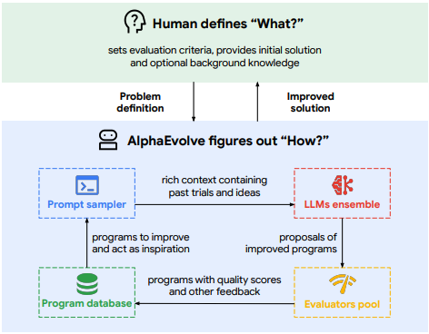

<!---
Copyright (c) 2025 Advanced Micro Devices, Inc. (AMD)

Permission is hereby granted, free of charge, to any person obtaining a copy
of this software and associated documentation files (the "Software"), to deal
in the Software without restriction, including without limitation the rights
to use, copy, modify, merge, publish, distribute, sublicense, and/or sell
copies of the Software, and to permit persons to whom the Software is
furnished to do so, subject to the following conditions:

The above copyright notice and this permission notice shall be included in all
copies or substantial portions of the Software.

THE SOFTWARE IS PROVIDED "AS IS", WITHOUT WARRANTY OF ANY KIND, EXPRESS OR
IMPLIED, INCLUDING BUT NOT LIMITED TO THE WARRANTIES OF MERCHANTABILITY,
FITNESS FOR A PARTICULAR PURPOSE AND NONINFRINGEMENT. IN NO EVENT SHALL THE
AUTHORS OR COPYRIGHT HOLDERS BE LIABLE FOR ANY CLAIM, DAMAGES OR OTHER
LIABILITY, WHETHER IN AN ACTION OF CONTRACT, TORT OR OTHERWISE, ARISING FROM,
OUT OF OR IN CONNECTION WITH THE SOFTWARE OR THE USE OR OTHER DEALINGS IN THE
SOFTWARE.
--->

# HPC Coding Agent - Part 2: An MCP Tool for Code Optimization with OpenEvolve

Large language models (LLMs) and LLM-driven agents (AI agents) are already trained on a massive amount of data where a considerable portion consists of code, and both models and agentic coding services are developed specifically for the purpose of coding. For users who want to optimize their code for certain purposes, for example runtime or memory efficiency, LLMs may produce plausible solutions, but these are often not optimal.

This blog aims to explore an alternative approach where the code optimization is outsourced to [OpenEvolve](https://github.com/algorithmicsuperintelligence/openevolve), which uses evolutionary algorithms to systematically explore and evaluate multiple code variants, discovering optimizations that might not be immediately obvious through single-pass LLM generation.

This is the second entry in the HPC Coding Agent blog series from our team. This entry is self-contained but we strongly encourage reading the previous entries since each one explores different components of an HPC coding agent:

- [HPC Coding Agent for Retrieval of HPC Documentation](https://rocm.blogs.amd.com/artificial-intelligence/hpc-agent-rag/README.html)

## Agent Framework: Cline

We have chosen to focus on open-source components in this blog, and among available agent frameworks we have chosen Cline, an open-source, model-agnostic AI agent for coding. It has features such as plan-mode and MCP integration (see below) and works both as a standalone CLI tool or as a plugin in IDEs.

## MCP - Model Context Protocol

MCP, or Model Context Protocol, is an open protocol designed to standardize the communication and context sharing between language models and various agentic frameworks, tools, or plugins. It provides a unified way for external tools and agents to interact with LLMs, exchange context, share metadata, and coordinate actions or decisions throughout complex workflows.

The goal of MCP is to abstract away the specifics of each language model or agent framework, allowing developers and researchers to create interoperable tools and agent systems that can work across different LLMs and orchestration environments. By using MCP, providers of agentic tools (like Cline) and large language models can better communicate, enabling richer and more powerful integrations for tasks such as code optimization, document retrieval, or multi-step reasoning.

In the context of this blog, MCP enables the agent framework (Cline) to interact effectively with OpenEvolve, orchestrating requests, optimizations, and exchanges of code or evaluation results in a model-agnostic and standardized fashion.

## Code Optimization: OpenEvolve

The MCP tool we use for code optimization in this blog is OpenEvolve. OpenEvolve is an open-source implementation of AlphaEvolve that shares its functionality and builds on top of it. By describing AlphaEvolve, we cover most of what makes up OpenEvolve and then we can explore what has been added on top to make OpenEvolve into what it is today.

### AlphaEvolve - Evolutionary Coding Agent

AlphaEvolve, and consequently OpenEvolve, is introduced in its [paper](https://arxiv.org/pdf/2506.13131) as “A Coding Agent for Scientific and Algorithmic Discovery." It is an evolutionary coding agent that uses an ensemble of LLMs inside an evolutionary loop to iteratively modify and evaluate code. The idea is to run multiple candidate solutions through cycles of evolution, where the fittest solutions survive and are used to generate new variants, similar to biological evolution.

The user of the framework is to provide AlphaEvolve with the following inputs:

- **Evaluation function**: a Python function named `evaluate()`, which would return one or more maximized scalar metrics (e.g. speed, accuracy, resource usage etc.) appropriate to the goal of the optimization
- **Initial programs**: a pool of at least one initial candidate script that can be used for the discovery of new candidates
- **Evolve blocks / API markers**: annotations `# EVOLVE-BLOCK-START … # EVOLVE-BLOCK-END` included in the initial candidate scripts to mark where code is to be evolved


<figure style="text-align: left;">
  <figcaption>
    Figure 1: Overview of AlphaEvolve evolution pipeline. <br>
    <a href="https://arxiv.org/pdf/2506.13131">Source: AlphaEvolve paper</a>
  </figcaption>
</figure>

The user-provided input goes into the evolution pipeline consisting of four components (also see figure 1 above):

- Program database:
  - stores candidate programs or solutions along with their evaluation metrics, outputs and metadata
  - main goal is to optimally expose previously explored ideas
  - to do this, it implements an evolutionary algorithm inspired by [MAP elites algorithm](https://arxiv.org/abs/1504.04909) and [island-based population models](https://www.nature.com/articles/s41586-023-06924-6) to balance exploration and exploitation (improving the best programs while maintaining diversity)
- Prompt sampler: used to construct rich prompts for the LLM ensemble containing
  - previously discovered solutions sampled from the program database
  - instructions on how to suggest modifications to a particular solution
  - optional extra context to customize prompts to specific needs. For details, see section 2.2 in the paper
- LLM ensemble: multiple LLMs used to suggest code modifications. Note that a single LLM can be used. The purpose of using multiple models in the paper is according to the authors, to "balance computational throughput with the quality of generated solutions." By using a faster model together with a model that yields higher-quality output the authors both maximize "the volume of evaluated ideas while retaining the potential for substantial improvements driven by the more powerful model".
- Evaluators pool: distributed evaluation where suggested changes are applied and user defined evaluation metric(s) is calculated and returned

So in short the four components interact in this evolutionary loop:

1. The program database selects a parent solution to improve along with interesting reference solutions to present to the LLMs
2. Prompt sampler structures output from the previous step into a big prompt
3. The LLM ensemble interprets the prompt as instructions and produces a code diff, effectively generating a new child program
4. Evaluation components apply the code diff and evaluates the results by applying the user-defined evaluation function
5. The new child program and evaluation results are added to the program database, and the first step in the loop takes over unless we have reached max loop iterations

Steps 1-5 execute as an asynchronous pipeline, which in practice means that there is a stream of child programs being produced and evaluated in parallel, where each instance is the result of one pass through steps 1-5.

For more details, we refer to the AlphaEvolve [paper](https://arxiv.org/pdf/2506.13131) and the linked inspirations for this evolutionary algorithm.

### What OpenEvolve adds

Besides being open-sourced, OpenEvolve implements AlphaEvolve and adds:

- universal API to allow for many LLMs to be used
- scientific reproducibility by allowing a fixed seed to yield deterministic evolution
- configurable evolutionary algorithm allowing modification better suited to specific use-cases

### Why use OpenEvolve / Evolutionary Code Optimization with an Agent?

As developers and users of AI models and agents it is too easy to get wrapped up in technical curiosity instead of looking at the core question; does adding a certain capability to an agent improve the end result or can we achieve the same result using a far simpler agentic workflow, like letting the LLM perform the optimization?

In this case we are using OpenEvolve to expand upon the capabilities that the agent inherits from the LLM. The agent can perform code optimizations like switching out libraries, switching to tools the LLM has been trained to recognize as better alternatives, modify data structures and so on. But what it can't do is:

- Run the code
- Measure performance metrics
- Systematically explore multiple alternatives

The two first bullet points are solvable without using OpenEvolve and instead add tools for code execution and evaluation. However, the third point is where OpenEvolve shines since simpler tools cannot replace the algorithmic optimization method that OpenEvolve uses (described in the AlphaEvolve section above).

### Why Not Use Only OpenEvolve Instead of Using It as an MCP Tool?

It would be a fair point to suggest to skip the main agent, in this case our Cline instance. Yet, the purpose of this blog is not only to show how OpenEvolve can be used as an MCP tool, but rather to demonstrate how OpenEvolve can be used as an MCP tool by an agent that can be given access to other tools that together let the agent [read and reflect on domain specific documentation](rocm.blogs.amd.com/artificial-intelligence/hpc-agent-rag/README.html), [profile, for example, at the kernel level](rocm.blogs.amd.com/artificial-intelligence/hpc-agent-profile/README.html) and run code optimization in any order the agent sees fit. The tool and its use-case we demonstrate in this blog should thus be looked at in a larger context and not in one where we have an agent with a single tool, because that would absolutely defeat the purpose of using OpenEvolve as a tool of another agent.

## Models: GLM-4.7

[GLM-4.5](https://huggingface.co/zai-org/GLM-4.5), [GLM-4.5-Air](https://huggingface.co/zai-org/GLM-4.5-Air), [GLM-4.6](https://huggingface.co/zai-org/GLM-4.6) and [GLM-4.7](https://huggingface.co/zai-org/GLM-4.7) are all code-tuned LLMs with hybrid reasoning capability. They handle thinking mode, tool-using, and non-thinking mode depending on user requirements. They are designed with agentic and coding capabilities in mind. The top-performing model of the four is GLM-4.7, which we'll use in this blog.

When describing AlphaEvolve we mentioned that the authors used a performant model and a faster model to balance quality and quantity of generated solutions to cover a wider scope of potential solutions while also leaving room for significant improvement. For that purpose models GLM-4.7 / GLM-4.6 and GLM-4.5 air can be used in combination by OpenEvolve. However, the focus of the blog is on showing how to deploy an agentic code optimization workflow using OpenEvolve as an MCP tool with the potential conjunction with other MCP tools, and thus optimizing the use of OpenEvolve is not treated here.

GLM-4.7 also functions as the model driving the Cline agent instance we use in our setup.

## Technical Setup

### Requirements

- AMD GPU: See the [ROCm documentation page](https://rocm.docs.amd.com/projects/install-on-linux/en/latest/reference/system-requirements.html) for supported hardware and operating systems.
- ROCm ≥6.4: See the [ROCm installation for Linux](https://rocm.docs.amd.com/projects/install-on-linux/en/latest/index.html) for installation instructions.
- Docker: See [Install Docker Engine on Ubuntu](https://docs.docker.com/engine/install/ubuntu/#install-using-the-repository) for installation instructions.
- AMD Instinct MI300X GPUs (8 GPUs recommended for optimal GLM-4.7 performance)

### Step 1: GLM-4.7 serving

If you have AMD GPUs and the AMD Container Toolkit installed on your system, we recommend using it for better GPU management.

#### Launching the Docker Container

```bash
docker run -it --rm --runtime=amd \
  -e AMD_VISIBLE_DEVICES=all \
  --shm-size=64g \
  --name serve-glm \
  -v $(pwd):/workspace -w /workspace \
  rocm/vllm-dev:nightly_main_20251127
```

Alternatively, if the AMD Container Toolkit is not installed, run it directly without the toolkit:

```bash
docker run -it --rm \
  --device=/dev/kfd --device=/dev/dri \
  --shm-size=64g \
  --name serve-glm \
  -v $(pwd):/workspace -w /workspace \
  rocm/vllm-dev:nightly_main_20251127
```

#### Installing Dependencies

Inside the container, install the required dependencies:

```bash
pip uninstall vllm 
pip install --upgrade pip
cd /workspace/GLM
git clone https://github.com/zai-org/GLM-4.5.git
cd GLM-4.5/example/AMD_GPU/
pip install -r rocm-requirements.txt
git clone https://github.com/vllm-project/vllm.git
cd vllm 
export PYTORCH_ROCM_ARCH="gfx942"  # gfx942 corresponds to MI300 architecture
python3 setup.py develop
```

Wait until the compilation completes.

```{note}
The GLM-4.5 repository contains AMD-specific dependencies and examples that work for both GLM-4.5, GLM-4.6 and GLM-4.7 models. We use the same installation and serving approach for all versions.
```

#### Downloading and Serving the Model

First, download the GLM-4.7 model to your local directory:

```bash
pip install "huggingface_hub[cli]"
huggingface-cli download zai-org/GLM-4.7 --local-dir /localdir/GLM-4.7
```

Now serve the model with vLLM. For agent workflows used in this setup, we enable automatic tool calling capabilities through `--enable-auto-tool-choice` and `--tool-call-parser glm45`. These flags allow GLM-4.7 to automatically detect when to invoke external tools (like OpenEvolve tool for code optimization) and parse function calls in the GLM-specific format, which is essential for Cline to orchestrate multi-step agent tasks such as searching documentation, retrieving context, and generating answers. For optimal performance, we recommend using 8 GPUs with substantial GPU memory. We use `--gpu-memory-utilization 0.90` to provide adequate memory headroom and prevent OOM errors during heavy workloads.

**Running on fewer GPUs:** If you have access to fewer GPUs, you can still run GLM-4.7 by adjusting `--tensor-parallel-size` (e.g., 4 for four GPUs) and reducing `--max-num-seqs` and `--max-model-len` to fit within available VRAM. Performance may not be optimal, depending on the use-case, yet the system remains functional for this and other use-cases.

```bash

VLLM_USE_V1=1 vllm serve /localdir/GLM-4.7 \
  --tensor-parallel-size 8 \
  --gpu-memory-utilization 0.90 \
  --disable-log-requests \
  --no-enable-prefix-caching \
  --trust-remote-code \
  --enable-auto-tool-choice \
  --tool-call-parser glm45 \
  --host 0.0.0.0 \
  --port 8000 \
  --api-key token-xxxx \
  --served-model-name GLM-4.7
```

This command serves GLM-4.7 across 8 GPUs with tensor parallelism, which will enable efficient inference for RAG workloads.

### Step 2: Setting Up the Cline Agent

Cline will serve as our AI agent framework, interfacing with the GLM-4.7 model and orchestrating the code optimization workflow through MCP tools.

#### Launching the Cline Container

For optimal resource allocation, we run Cline CLI in a separate container with dedicated GPU resources. This separation allows the agent to operate independently while the main GLM-4.7 server handles inference workloads. Launch a new container using the same ROCm image:

```bash
docker run -it --rm --runtime=amd \
  -e AMD_VISIBLE_DEVICES=0 \
  --shm-size=16g \
  --name cline-agent \
  -v $(pwd):/workspace -w /workspace \
  rocm/vllm-dev:nightly_main_20251127
```

#### Installing Node.js and Cline

Inside the Cline container, install Node.js and the Cline CLI:

```bash
# Install Node.js
curl -fsSL https://deb.nodesource.com/setup_18.x | bash -
apt-get install -y nodejs

# Install Cline CLI globally
npm install -g cline
```

#### Configuring Cline Authentication

Configure Cline using the interactive authentication wizard:

```bash
cline auth
```

Follow the interactive wizard with these selections (replace `<GLM-Server-IP>` with your GLM server's IP address):

```text
┌─ What would you like to do?
│ > Configure BYO API providers
│
┌─ What would you like to do?  
│ > Add or change an API provider
│
┌─ Select API provider type:
│ > OpenAI Compatible
│
┌─ API Key: (CRITICAL: No leading/trailing spaces!)
│ token-xxxx
│
┌─ Base URL (optional, for OpenAI-compatible providers):
│ http://<GLM-Server-IP>:8000/v1/
│  
┌─ Model ID:
│ GLM-4.7
│
┌─ What would you like to do?
│ > Return to main auth menu 
│
┌─ What would you like to do?
│ > Exit authorization wizard
```

```{note}
If Cline defaults to OpenRouter instead of your OpenAI-compatible provider, manually configure the API providers:

```bash
cline config set plan-mode-api-provider=openai
cline config set act-mode-api-provider=openai
```

#### Installing Python Dependencies

Install the required Python packages for OpenEvolve MCP integration:

```bash
pip install --ignore-installed blinker
pip install fastmcp==2.13.0.2 openevolve cffi
```

### Step 3: Configuring OpenEvolve as an MCP Tool

The Model Context Protocol (MCP) enables Cline to communicate with OpenEvolve as an external optimization tool. We'll configure Cline to access our custom OpenEvolve MCP server, which wraps the OpenEvolve optimization engine and exposes it through a standardized interface.

#### Configuring the MCP Server

Create or modify Cline's MCP configuration file at `~/.cline/data/settings/cline_mcp_settings.json`:

```json
{
  "mcpServers": {
    "openevolve": {
      "timeout": 1500,
      "command": "python",
      "args": ["/src/openevolve/openevolve_optimizer_server.py"],
      "env": {},
      "cwd": "/src/openevolve"
    }
  }
}
```

```{note}
The timeout is set to 1500 seconds to accommodate OpenEvolve's evolutionary optimization approach, which iteratively explores and evaluates multiple code variants. Adjust the `args` path to match the location of your MCP server file.
```

The `openevolve_optimizer_server.py` file implements the MCP server that bridges Cline's requests with OpenEvolve's optimization engine. It handles code submission, manages the evolutionary optimization process, and returns optimized code along with performance metrics.

### A Note on Chosen MCP Architecture

For the purpose of this blog we have built an MCP tool which is used by the Cline agent. This code is shared [here](https://rocm.blogs.amd.com/artificial-intelligence/hpc-agent-openevolve/src/). The MCP implementation is made using the [FastMCP](https://github.com/jlowin/fastmcp) Python framework. For longer running optimizations we'd suggest looking into initiating the evolutionary code optimization through the tool, return a message of successful job initiation and then results can be collected from storage after job has finished using MCP resources which are meant for reading. Such solution would let us avoid the need for keeping the connection for the full runtime of the triggered optimization and thus decrease chances of losing optimized output because of broken connection.

## Use Case: Optimizing Multi-Head Attention

In this section, we demonstrate how to use the OpenEvolve MCP tool through Cline to optimize a PyTorch implementation of multi-head attention. This example showcases how evolutionary code optimization can automatically discover performance improvements through iterative exploration of the solution space.

### The Test Case: MinGPTCausalAttention

Our test case is `MinGPTCausalAttention.py`, a deliberately inefficient implementation of multi-head masked self-attention that uses nested loops instead of vectorized operations. This represents a realistic scenario where initial implementations prioritize clarity and correctness over performance, and optimization is needed later in the development cycle.

**Model Configuration:**

- Batch size: 128
- Sequence length: 512  
- Embedding dimension: 768
- Number of attention heads: 8
- Attention head dimension: 96

### Configuring the Optimization

The fitness metric for this demonstration is execution time, calculated by `execution_time_evaluator.py`. The evaluator runs each code variant and computes fitness as `100.0 / (execution_time + 0.01)`—meaning shorter execution times yield higher fitness scores. During evolution, OpenEvolve automatically selects and evolves variants with higher fitness.

You can customize the optimization behavior through `execution_time_config.yaml` to suit your needs, including LLM settings (model selection, temperature), population parameters, and logging options:

```yaml
llm:
  models:
    - name: 'GLM-4.7'
  temperature: 0.7
  max_tokens: 4096

database:
  population_size: 4
  archive_size: 2
```

```{note}
The `max_iterations` parameter (passed when calling the optimization tool) controls how many evolutionary cycles run. More iterations increase the chance of finding better optimizations but take longer. The default of 10 iterations balances exploration with practical runtime. Parameters like `population_size`, `temperature`, and LLM selection in the config file can be tuned to optimize the exploration-exploitation tradeoff.
```

### Starting Cline

Launch Cline from your project directory:

```bash
cd /workspace/your-project
cline
```

```{tip}
Starting Cline from a dedicated project directory helps the agent maintain focused context and avoid confusion from unrelated files in the workspace.
```

### Interacting with Cline

Start by querying which MCP tools are available:

**User Prompt:**

```text
Which MCP tools are available to you?
```

```{dropdown} 🤖 Cline Response *(click to expand)*
Based on the current environment, I have access to one MCP server:

## openevolve Server

Server:  python /src/openevolve/openevolve_optimizer_server.py 

Available Tool:

• optimize_code_execution_time - Optimizes Python code execution time using OpenEvolve evolutionary optimization

Parameters:

•  script_content  (required): Python script with code to optimize
•  max_iterations  (optional): Maximum optimization iterations (default: 10)

Returns:

• Dictionary with:
  •  original_code : The original code
  •  optimized_code : The optimized version
  •  best_score : Performance score
  •  metrics : Additional optimization metrics


This tool can be useful for improving the performance of Python code by applying evolutionary optimization techniques. It's particularly relevant given the Python files I can see in your workspace (MinGPTCausalAttention.py).
```

Cline successfully discovers the configured MCP server and identifies the `optimize_code_execution_time` tool. The agent demonstrates awareness of the tool's parameters and its return values. Notably, Cline also scans the workspace context and recognizes the `MinGPTCausalAttention.py` file as a relevant candidate for optimization.

### Initiating the Optimization

Now request optimization of the target file:

**User Prompt:**

```text
Use your openevolve MCP tool to optimize the code to make it more efficient: 
MinGPTCausalAttention.py. Use 10 iterations
```

```{dropdown} 🤖 Cline Analysis (Plan Mode) *(click to expand)*
The user wants me to use the openevolve MCP tool to optimize the MinGPTCausalAttention.py file with 10 iterations. However, I'm currently in PLAN MODE, and the use_mcp_tool is only available in ACT MODE.

I need to:

1. First read the MinGPTCausalAttention.py file to understand what we're optimizing
2. Then explain to the user that I need to switch to ACT MODE to use the MCP tool
3. Ask them to toggle to Act mode

Let me read the file first to understand what we're working with.

---

I've read the MinGPTCausalAttention.py file. It's a PyTorch implementation of a multi-head masked self-attention layer with some inefficiencies:

Current Issues:

1. Uses nested loops (4 levels deep) to compute attention scores manually instead of using matrix operations
2. Uses nested loops (4 levels deep) to compute the weighted sum manually
3. These loops are extremely slow for the given dimensions (batch_size=128, seq_len=512, n_head=8)  

Expected Optimizations:
The OpenEvolve optimizer should identify these inefficiencies and replace them with:

• Matrix multiplication ( torch.matmul  or  @  operator) for attention score computation
• Matrix multiplication for the weighted sum
• This would reduce O(B×H×T²×D) loop operations to O(1) matrix operations

To use the openevolve MCP tool to optimize this code, you'll need to toggle to Act mode. The MCP tool is only available in Act Mode, not Plan Mode.

Once you toggle to Act mode, I'll:

1. Use the  optimize_code_execution_time  tool with the MinGPTCausalAttention.py content
2. Set max_iterations to 10 as requested
3. Present the optimized code and performance improvements
```

Before invoking the optimization tool, Cline analyzes the target file and correctly identifies potential performance issues: deeply nested loops computing attention scores and weighted sums. After switching to Act mode, Cline then invokes the OpenEvolve MCP tool and the evolutionary optimization process begins.

### Optimization Results

After 10 iterations of evolutionary optimization, OpenEvolve returns the optimized code with performance metrics:

**Performance Metrics:**

- **Fitness Score**: 84.54 (higher is better)
- **Execution Time**: 1.17 seconds
- **Optimization Success**: True

```{dropdown} 🤖 Cline Analysis of Results *(click to expand)*
The openevolve tool has successfully optimized the code. Let me analyze the results:

1. Original Code Issues:
  • Used 4 nested loops to compute attention scores manually
  • Used 4 nested loops to compute weighted sum manually
  • This was extremely inefficient
2. Optimized Code Improvements:
  • Replaced manual loop-based attention score computation with matrix multiplication:  q @ k.transpose(-2, -1)                                                                                         
  • Replaced manual loop-based weighted sum with matrix multiplication:  attention_weights @ v      
  • Added  .transpose(1, 2)  after reshaping to prepare tensors for matrix multiplication
  • This is the standard, efficient way to implement multi-head attention in PyTorch
3. Performance Metrics:
  • Best score: 84.54 (fitness score)
  • Execution time: 1.17 seconds (optimized)
  • Error: 0.117


The optimization is exactly what I expected - replacing the slow Python loops with vectorized PyTorch operations. This should result in a massive speedup (likely 100x-1000x faster).

Now I should write the optimized code to the file and present the results to the user.
```

After receiving the optimization results from OpenEvolve, Cline interprets the changes and validates them against its initial predictions. The agent confirms that the evolutionary optimization successfully discovered the expected vectorization strategy and correctly identifies the optimizations as production-quality PyTorch patterns for attention mechanisms.

### Code Comparison

Let's examine the key differences between the original and optimized implementations.

**Original Implementation (Inefficient):**

```python
# Manual attention score computation with nested loops
attention_scores = torch.zeros(B, self.n_head, T, T, device=x.device)

for batch_idx in range(B):
    for head_idx in range(self.n_head):
        for pos_i in range(T):
            for pos_j in range(T):
                score = torch.sum(q[batch_idx, pos_i, head_idx, :] * 
                                k[batch_idx, pos_j, head_idx, :])
                attention_scores[batch_idx, head_idx, pos_i, pos_j] = \
                    score / math.sqrt(head_dim)

# Manual weighted sum with nested loops
output = torch.zeros(B, self.n_head, T, head_dim, device=x.device)
for batch_idx in range(B):
    for head_idx in range(self.n_head):
        for pos_i in range(T):
            for pos_j in range(T):
                output[batch_idx, head_idx, pos_i, :] += \
                    attention_weights[batch_idx, head_idx, pos_i, pos_j] * \
                    v[batch_idx, pos_j, head_idx, :]
```

**Optimized Implementation (Vectorized):**

```python
# Reshape for multi-head attention and transpose for matrix multiplication
head_dim = C // self.n_head
q = q.view(B, T, self.n_head, head_dim).transpose(1, 2)
k = k.view(B, T, self.n_head, head_dim).transpose(1, 2)
v = v.view(B, T, self.n_head, head_dim).transpose(1, 2)

# Vectorized attention score computation using matrix multiplication
# (B, n_head, T, head_dim) @ (B, n_head, head_dim, T) -> (B, n_head, T, T)
attention_scores = (q @ k.transpose(-2, -1)) / math.sqrt(head_dim)

# Apply causal mask and softmax
attention_scores = attention_scores.masked_fill(
    self.bias[:,:,:T,:T] == 0, float('-inf'))
attention_weights = F.softmax(attention_scores, dim=-1)
attention_weights = self.attn_dropout(attention_weights)

# Vectorized weighted sum using matrix multiplication
# (B, n_head, T, T) @ (B, n_head, T, head_dim) -> (B, n_head, T, head_dim)
output = attention_weights @ v
```

### Key Optimizations Discovered

OpenEvolve's evolutionary algorithm successfully identified and implemented several critical optimizations:

1. **Tensor Reshaping Strategy**: The optimized code transposes Q, K, and V tensors from `(B, T, n_head, head_dim)` to `(B, n_head, T, head_dim)` before computation, enabling efficient batched matrix operations across all attention heads simultaneously.

2. **Vectorized Attention Scores**: Replaces O(B × H × T² × D) loop iterations with a single batched matrix multiplication, leveraging GPU parallelism for orders of magnitude speedup.

3. **Vectorized Weighted Sum**: Similarly replaces nested loops with matrix multiplication for computing the attention output, maximizing hardware utilization.

4. **Computational Complexity**: Reduces the algorithmic complexity from O(B × H × T² × D) individual operations to O(1) batched operations, with all parallelization handled by PyTorch's optimized BLAS backend.

These optimizations represent best practices for implementing attention mechanisms in PyTorch and demonstrate OpenEvolve's capability to discover production-quality optimizations through evolutionary search.

The complete optimized code is shown below:

```python
import torch
import torch.nn as nn
import torch.nn.functional as F
import math

class Model(nn.Module):
    """
    A vanilla multi-head masked self-attention layer with a projection at the end.
    """

    def __init__(self, n_embd, n_head, attn_pdrop, resid_pdrop, max_seqlen):
        super().__init__()
        assert n_embd % n_head == 0
        # Separate linear layers for Q, K, V
        self.query_linear = nn.Linear(n_embd, n_embd)
        self.key_linear = nn.Linear(n_embd, n_embd)
        self.value_linear = nn.Linear(n_embd, n_embd)
        # output projection
        self.output_linear = nn.Linear(n_embd, n_embd)
        # regularization
        self.attn_dropout = nn.Dropout(attn_pdrop)
        self.resid_dropout = nn.Dropout(resid_pdrop)
        # causal mask
        self.register_buffer("bias", torch.tril(torch.ones(max_seqlen, max_seqlen))
                                     .view(1, 1, max_seqlen, max_seqlen))
        self.n_head = n_head
        self.n_embd = n_embd

    def forward(self, x):
        B, T, C = x.size()

        # Compute Q, K, V with separate projections
        q = self.query_linear(x)
        k = self.key_linear(x)
        v = self.value_linear(x)

        # Reshape for multi-head attention and transpose for matrix multiplication
        head_dim = C // self.n_head
        q = q.view(B, T, self.n_head, head_dim).transpose(1, 2)
        k = k.view(B, T, self.n_head, head_dim).transpose(1, 2)
        v = v.view(B, T, self.n_head, head_dim).transpose(1, 2)

        # Vectorized attention score computation using matrix multiplication
        # (B, n_head, T, head_dim) @ (B, n_head, head_dim, T) -> (B, n_head, T, T)
        attention_scores = (q @ k.transpose(-2, -1)) / math.sqrt(head_dim)

        # Apply causal mask
        attention_scores = attention_scores.masked_fill(self.bias[:,:,:T,:T] == 0, float('-inf'))   
        attention_weights = F.softmax(attention_scores, dim=-1)
        attention_weights = self.attn_dropout(attention_weights)

        # Vectorized weighted sum using matrix multiplication
        # (B, n_head, T, T) @ (B, n_head, T, head_dim) -> (B, n_head, T, head_dim)
        output = attention_weights @ v

        # Reshape and project
        output = output.transpose(1, 2).contiguous().view(B, T, C)
        output = self.resid_dropout(self.output_linear(output))

        return output

batch_size = 128
max_seqlen = 1024
seq_len = 512
n_embd = 768
n_head = 8
attn_pdrop = 0.0
resid_pdrop = 0.0

def get_inputs():
    return [torch.rand(batch_size, seq_len, n_embd)]

def get_init_inputs():
    return [n_embd, n_head, attn_pdrop, resid_pdrop, max_seqlen]
```

```{note}
**This is a demonstration use case, not a production optimization run.** For the purpose of illustrating the MCP tool integration workflow, we ran OpenEvolve with only 10 iterations and a small population size to keep the demonstration time reasonable.

However, the [production-quality implementation from minGPT](https://github.com/karpathy/minGPT/blob/master/mingpt/model.py) uses a more advanced optimization: combining Q, K, V projections into a single linear layer (`nn.Linear(n_embd, 3 * n_embd)`) instead of three separate layers. In a real-world optimization scenario, running OpenEvolve with significantly more iterations (100+) and larger population sizes would give the evolutionary algorithm sufficient exploration budget to discover such deeper structural optimizations. The configuration used here prioritizes demonstration clarity and time efficiency over achieving maximum optimization quality.
```

## Summary

The field of AI agents is rapidly expanding and so is the set of tools that can be made useful in an agentic workflow. In this blog, we explored using OpenEvolve, an open-source implementation of AlphaEvolve, as an MCP tool which an AI agent can call for improved code optimization. Outsourcing the code optimization to OpenEvolve gives the benefits of using OpenEvolve's algorithmic evolutionary approach—systematically exploring multiple code variants in parallel to discover optimizations that single-pass LLM generation might miss. By integrating OpenEvolve as an MCP tool within Cline, we demonstrated how AI agents can leverage specialized optimization tools alongside other capabilities like documentation retrieval and profiling, creating a powerful and flexible HPC coding assistant.

## Disclaimers

Third-party content is licensed to you directly by the third party that owns the
content and is not licensed to you by AMD. ALL LINKED THIRD-PARTY CONTENT IS
PROVIDED “AS IS” WITHOUT A WARRANTY OF ANY KIND. USE OF SUCH THIRD-PARTY CONTENT
IS DONE AT YOUR SOLE DISCRETION AND UNDER NO CIRCUMSTANCES WILL AMD BE LIABLE TO
YOU FOR ANY THIRD-PARTY CONTENT. YOU ASSUME ALL RISK AND ARE SOLELY RESPONSIBLE
FOR ANY DAMAGES THAT MAY ARISE FROM YOUR USE OF THIRD-PARTY CONTENT.
