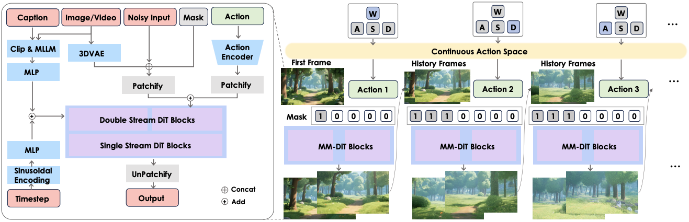
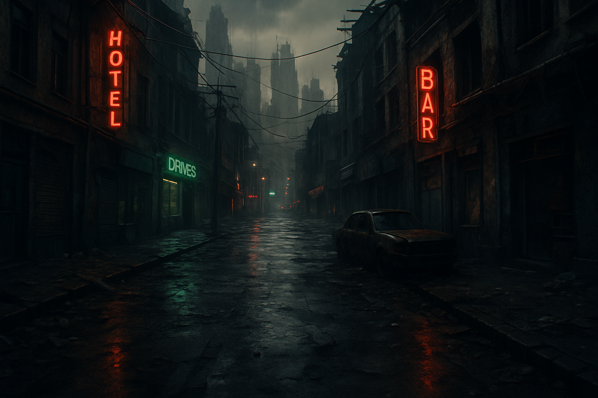
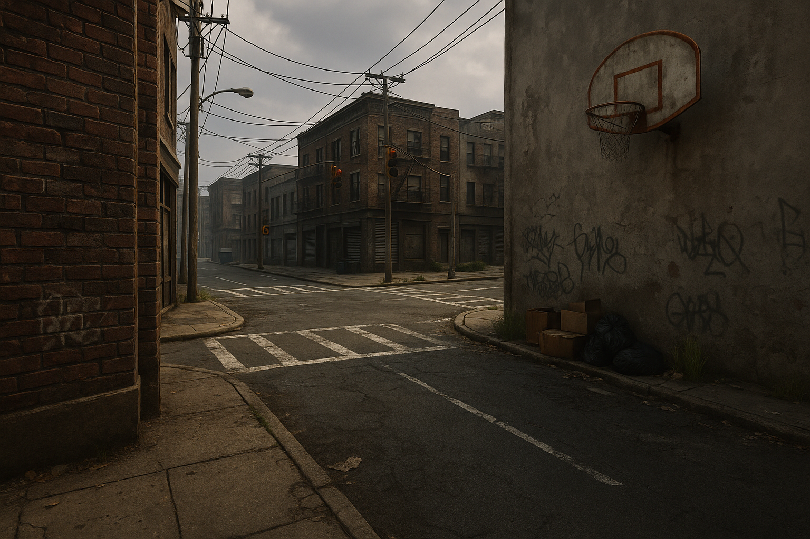

<!---
Copyright (c) 2025 Advanced Micro Devices, Inc. (AMD)

Permission is hereby granted, free of charge, to any person obtaining a copy
of this software and associated documentation files (the "Software"), to deal
in the Software without restriction, including without limitation the rights
to use, copy, modify, merge, publish, distribute, sublicense, and/or sell
copies of the Software, and to permit persons to whom the Software is
furnished to do so, subject to the following conditions:

The above copyright notice and this permission notice shall be included in all
copies or substantial portions of the Software.

THE SOFTWARE IS PROVIDED "AS IS", WITHOUT WARRANTY OF ANY KIND, EXPRESS OR
IMPLIED, INCLUDING BUT NOT LIMITED TO THE WARRANTIES OF MERCHANTABILITY,
FITNESS FOR A PARTICULAR PURPOSE AND NONINFRINGEMENT. IN NO EVENT SHALL THE
AUTHORS OR COPYRIGHT HOLDERS BE LIABLE FOR ANY CLAIM, DAMAGES OR OTHER
LIABILITY, WHETHER IN AN ACTION OF CONTRACT, TORT OR OTHERWISE, ARISING FROM,
OUT OF OR IN CONNECTION WITH THE SOFTWARE OR THE USE OR OTHER DEALINGS IN THE
SOFTWARE.
--->

# Exploring Gameplay Video Generation with Hunyuan-GameCraft

Video generation is progressing rapidly, with new models and techniques emerging frequently. This blog aims to explore these capabilities in the context of gameplay video generation. For this, we demonstrate how Hunyuan-GameCraft can be leveraged to generate gameplay video from a single image and user action input on AMD Instinct™ GPUs with ROCm.

As this area progresses, gameplay video generation has the potential of reshaping the way games are designed and experienced. Letting AI be a part of the designing and implementing process can lead to new ways of experiencing video games. For now, Hunyuan-GameCraft is a promising tool among the latest steps in this direction, where it enables the generation of gameplay video from a single image and user action input, although not in real-time. These generated videos can be part of prototyping, visually testing new characters and assets before actual in-game development, or simply for idea generation and inspiration. Thus, Hunyuan-GameCraft and similar tools can be valuable tools for game developers and designers, yet not fully replace traditional game development workflows as game engines and real-time rendering techniques are still necessary for today's actual gameplay experiences.

This blog is part of our team's ongoing efforts to ensure ease-of-use and maximizing performance for various video generation related tasks as exemplified by recent blog posts on [3D World Inference with HunyuanWorld-Voyager](https://rocm.blogs.amd.com/artificial-intelligence/hunyuanworld-voyager-inference/README.html), [Accelerating Audio-Driven Video Generation: WAN2.2-S2V on AMD ROCm](https://rocm.blogs.amd.com/artificial-intelligence/audio-driven-videogen/README.html), [A Simple Design for Serving Video Generation Models with Distributed Inference](https://rocm.blogs.amd.com/artificial-intelligence/serving-videogen-v1/README.html) and more as mentioned further below in the summary.

## Technical Overview

Hunyuan-GameCraft is introduced as a framework for the generation of high-dynamic, action-controllable video synthesis in game environments.

Built upon [HunyuanVideo](https://github.com/Tencent-Hunyuan/HunyuanVideo), a text-to-video (T2V) foundation model, Hunyuan-GameCraft facilitates generation of temporally coherent and visually rich gameplay footage conditioned on user actions defined as keyboard and mouse input according to the authors of the framework.

Hunyuan-GameCraft is created to turn a single image into a controllable temporally-coherent video that represents a gaming environment where gaming input is used to move the viewpoint within that environment.

### Data, Model & Framework

The team behind Hunyuan-GameCraft has collected a dataset consisting of more than 1 million 6-second coherent 1080p clips from high-budget, high-profile video games from major gaming studios. The team has also deployed scene and action-aware data partitioning, data filtering, interaction annotation and structured captioning. Additionally, approximately 3000 synthetic high-quality motion clips are rendered with different starting positions, motions and speeds to further enrich the dataset. As you can see in the overview diagram below, the Hunyuan-GameCraft framework builds upon these foundations.


<figure style="text-align: left;"><figcaption>Overview of Hunyuan-GameCraft. <a href="https://arxiv.org/pdf/2506.17201">Source: Hunyuan-GameCraft Technical Report</a></figcaption></figure>

The underlying model used in Hunyuan-GameCraft is the HunyuanVideo, a Multi-Modal Diffusion Transformer (MM-DiT). Using HunyuanVideo as the backbone, the Hunyuan-GameCraft framework adds:

- A shared camera representation space where unified diverse common gaming input is mapped
- An action encoder for the camera trajectory whose tokens are added after patchify into the MM-DiT backbone
- Hybrid history-conditioned long-video extension, where video is generated chunk-by-chunk in a latent space. This mitigates the quality degradations and temporal inconsistencies with causal VAEs suffered by preceding contributions when maintaining long term consistency in interactive game video generation
- A distilled version of the model for efficient inference

To learn more about the dataset and its preparation or more details regarding the model and the framework, please refer to the [Hunyuan-GameCraft paper](https://arxiv.org/pdf/2506.17201).

## Environment and Inference Setup

To start, we need to set up the environment for Hunyuan-GameCraft.

### 1. Launch Docker Container

We use a ROCm 7.0 docker image with Pytorch and other python packages pre-installed, as well as flash-attention 2. We will make modifications in the next step.

We have the following hardware configuration:

| Component | Configuration |
|-----------|---------------|
| GPUs | 4× AMD Instinct MI300X |
| CPUs | 128 cores (32× 4) |
| VRAM | 768GB (192GB × 4) |

If you have AMD GPUs and the [AMD Container Toolkit](https://instinct.docs.amd.com/projects/container-toolkit/en/latest/container-runtime/overview.html) installed on your system, we recommend using it for better GPU management.

#### Option 1: AMD Container Toolkit (Recommended)

Use specific GPUs by ID (example with 4 GPUs):

```bash
docker run -it --rm --runtime=amd \
  -e AMD_VISIBLE_DEVICES=0,1,2,3 \
  --shm-size=32g \
  --name hunyuan-gamecraft \
  -v $(pwd):/workspace -w /workspace \
  rocm/7.0:rocm7.0_pytorch_training_instinct_20250915
```

Note for HPC/Job Scheduler Users:
Use specific GPU IDs that match your job allocation.
`AMD_VISIBLE_DEVICES=all` may not respect job scheduler GPU allocation and could use all GPUs on the node.

#### Option 2: Traditional Device Mapping

If the AMD Container Toolkit is not installed

```bash
docker run -it --rm \
  --device=/dev/kfd --device=/dev/dri \
  --group-add video \
  --shm-size=32g \
  --name hunyuan-gamecraft \
  -v $(pwd):/workspace -w /workspace \
  rocm/7.0:rocm7.0_pytorch_training_instinct_20250915
```

For Vultr and some cloud providers, manual render device mapping may be required.

### 2. Install Dependencies and Setup Hunyuan-Gamecraft Repository

To match the setup with specific versions of python packages used by the authors of Hunyuan-GameCraft we'll do the following upgrades and installations. We avoid packages not used for inference, since that is our primary focus.

```bash
pip uninstall -y trl
pip install \
  numpy==2.1.2 transformers==4.54.1 diffusers==0.34.0 tokenizers==0.21.4 sentencepiece==0.2.0 \
  einops==0.8.1 decord==0.6.0 av==15.1.0 opencv-python-headless==4.12.0.88 \
  imageio==2.37.0 imageio-ffmpeg==0.6.0 loguru==0.7.3 safetensors==0.5.3 \
  huggingface-hub==0.34.3 "fsspec[http]==2024.6.1" tqdm==4.67.1 pyyaml==6.0.2 \
  regex==2025.7.34 requests==2.32.4 packaging==25.0 pillow==11.0.0 ninja==1.11.1.4
```

We also install `huggingface-cli` which is used in next step.

```bash
python -m pip install "huggingface_hub[cli]"
```

Sequentially we download the Hunyuan-GameCraft repository, enter the directory and update `PYTHON_PATH`, which is required for using the repository.

```bash
git clone https://github.com/Tencent-Hunyuan/Hunyuan-GameCraft-1.0.git
cd Hunyuan-GameCraft-1.0
# Checkout specific commit used here if needed
git checkout 07afcd4
export PYTHONPATH=$PWD:$PYTHONPATH
```

### 3. Download Model

Downloading of the Hunyuan-GameCraft model is performed using `huggingface-cli` which we installed in previous step.

```bash
huggingface-cli download tencent/Hunyuan-GameCraft-1.0 --local-dir ./weights
```

### 4. Set Environment Variables

We then set the following model specific environment variables so that Hunyuan-GameCraft framework knows where to look for the model artifacts:

```bash
export MODEL_BASE="weights/stdmodels"
```

## Use-Cases

Before diving into the specific use-cases, let's look at potential inputs for Hunyuan-GameCraft. The action inputs that we have at our disposal are:

Key inputs

- `w`: Move forward
- `s`: Move backward
- `a`: Move left
- `d`: Move right

Mouse inputs

- `left_rot`: Rotate left
- `right_rot`: Rotate right
- `up_rot`: Rotate up
- `down_rot`: Rotate down

Do not forget the action speed, which is how fast each action is performed. The action speed, also called displacement distance by the authors, is defined as a list of floating point numbers, where each number corresponds to the speed of the action at the same index in the action list. The numbers can range from 0.0 to 3.0. With higher action speeds you can cover more distance with the same set of actions while the length of the output video remains the same.

```{note}
Before trying to replicate the use-cases, please note that all use-cases are dependent on image input. You can either provide your own images and update path after `--image-path` or use the ones provided in this blog by right-clicking and downloading them.
```

### Use-Case 1: Dystopian Street

We use one distinct input image for each use-case, which serves at the starting point for the gameplay video. Each image is meant to represent its own gameplay environment. For our first use-case, we have generated an image depicting a dystopian street gameplay environment (see below). We only use key inputs for this first use-case, since mouse inputs are not necessary for simple movement. To make it even simpler, we are only moving in a forward direction.



The following command is used to generate the video and takes **26 minutes and 24 seconds to complete**:

```bash
torchrun --nnodes=1 --nproc_per_node=4 --master_port 29605 hymm_sp/sample_batch.py \
    --image-path images/dystopian_street.png \
    --prompt "A dystopian street" \
    --add-neg-prompt "overexposed, low quality, deformation, a poor composition, bad limbs, distortion, blurring, text, subtitles, static, picture, black border." \
    --ckpt weights/gamecraft_models/mp_rank_00_model_states.pt \
    --video-size 704 1216 \
    --cfg-scale 2.0 \
    --image-start \
    --action-list w w w w \
    --action-speed-list 0.2 0.2 0.2 0.2 \
    --seed 845673 \
    --infer-steps 50 \
    --flow-shift-eval-video 5.0 \
    --save-path ./results/
```

The generated video shows how our viewpoint is moving through the street.

```{video} videos/dystopian_street.mp4
:width: 1206
:height: 704
:controls:
```

### Use-Case 2: Urban Crossroads

For our second use-case, we have generated an image depicting an urban crossroads gameplay environment (see below). The objective is to move forward and explore the crossroads.



The following command is used to generate the video and takes **23 minutes and 17 seconds to complete**:

```bash
torchrun --nnodes=1 --nproc_per_node=4 --master_port 29605 hymm_sp/sample_batch.py \
    --image-path images/urban_crossroads.png \
    --prompt "a urban crossroads" \
    --add-neg-prompt "overexposed, low quality, deformation, a poor composition, bad limbs, distortion, blurring, text, subtitles, static, picture, black border." \
    --ckpt weights/gamecraft_models/mp_rank_00_model_states.pt \
    --video-size 704 1216 \
    --cfg-scale 2.0 \
    --image-start \
    --action-list w w right_rot right_rot up_rot up_rot  \
    --action-speed-list 0.2 0.2 0.2 0.2 0.2 0.2  \
    --seed 579732 \
    --infer-steps 50 \
    --flow-shift-eval-video 5.0 \
    --save-path ./results/
```

The generated video shows how our viewpoint is moving through the crossroads. Notice that the viewpoint is supposed to rotate rightward and then upwards at a constant speed and it does so except that speed is higher for the first right rotation and lower for the subsequent rotations and upward rotations become leftward rotations. We'll get back to this issue in the next use-case.

```{video} videos/urban_crossroads.mp4
:width: 1206
:height: 704
:controls:
```

### Use-Case 3: Walk Towards a Collectible Item

For the purpose of this use-case we have generated an image with a bright green field, zigzag path and a collectible item in the form of a star at the end of the path (see below). The objective is to move towards the collectible item and reach it. We use all 4 key inputs to navigate the environment and reach the star.


The following command is used to generate the video and takes **75 minutes and 23 seconds to complete**:

```bash
torchrun --nnodes=1 --nproc_per_node=4 --master_port 29605 hymm_sp/sample_batch.py \
    --image-path images/green_field.png \
    --prompt "a green field with a centered path. At the end of the path, there is a star" \
    --add-neg-prompt "overexposed, low quality, deformation, a poor composition, bad limbs, distortion, blurring, text, subtitles, static, picture, black border." \
    --ckpt weights/gamecraft_models/mp_rank_00_model_states.pt \
    --video-size 704 1216 \
    --cfg-scale 2.0 \
    --image-start \
    --action-list w w w a a w w d d w w w w s s s \
    --action-speed-list 0.2 0.2 0.2 0.2 0.2 0.2 0.2 0.2 0.2 0.2 0.2 0.2 0.2 0.2 0.2 0.2 \
    --seed 845673 \
    --infer-steps 50 \
    --flow-shift-eval-video 5.0 \
    --save-path ./results/
```

```{video} videos/green_field_lowspeed.mp4
:width: 1206
:height: 704
:controls:
```

The video is meant to showcase the model's ability to navigate towards the collectible item in the green field environment, but since the model is outputting leftward rotation (input `left_rot`) instead of one of the leftward steps (input `a`), we fail to reach the star.

It's important that we disclose that the video above was the second attempt at generating the desired output given that action list. During the first attempt we used the same set of actions and seed but with different action speeds. During our explorations we noticed that higher action speeds come with a higher likelihood of the model taking one of the unintended actions, although this behaviour occurs even with lower action speeds. And unintended actions are fewer in the second attempt (above) than in the first (below), yet present.

The following command was the first attempt at the same action sequence but with higher action speed. It takes *63 minutes and 39 seconds to complete*:

```bash
torchrun --nnodes=1 --nproc_per_node=4 --master_port 29605 hymm_sp/sample_batch.py \
    --image-path images/green_field.png \
    --prompt "a green field with a centered path. At the end of the path, there is a star" \
    --add-neg-prompt "overexposed, low quality, deformation, a poor composition, bad limbs, distortion, blurring, text, subtitles, static, picture, black border." \
    --ckpt weights/gamecraft_models/mp_rank_00_model_states.pt \
    --video-size 704 1216 \
    --cfg-scale 2.0 \
    --image-start \
    --action-list w w w a a w w d d w w w w s s s \
    --action-speed-list 0.5 0.5 0.5 0.5 0.5 0.5 0.5 0.5 0.5 0.5 0.5 0.5 0.5 0.5 0.5 0.5 \
    --seed 845673 \
    --infer-steps 50 \
    --flow-shift-eval-video 5.0 \
    --save-path ./results/
```

```{video} videos/green_field_highspeed.mp4
:width: 1206
:height: 704
:controls:
```

## Summary

This blog explores the capabilities of Hunyuan-GameCraft, a framework designed for generating high-dynamic, action-controllable gaming video. By utilizing advanced AI techniques and the power of AMD Instinct GPUs, Hunyuan-GameCraft enables the creation of in-game video content from a single image and user input. As AI-driven video editing continues to evolve, AMD hardware is well-positioned to support the next generation of content creation. We are actively tracking emerging technologies and products in video generation/editing domains, aiming to deliver an optimized and seamless user experience for video generation on AMD GPUs. Our focus is on ensuring ease-of-use and maximizing performance for various video generation related tasks as exemplified by recent blog posts:

- [3D World Inference with HunyuanWorld-Voyager](https://rocm.blogs.amd.com/artificial-intelligence/hunyuanworld-voyager-inference/README.html)
- [Accelerating Audio-Driven Video Generation: WAN2.2-S2V on AMD ROCm](https://rocm.blogs.amd.com/artificial-intelligence/audio-driven-videogen/README.html)
- [A Simple Design for Serving Video Generation Models with Distributed Inference](https://rocm.blogs.amd.com/artificial-intelligence/serving-videogen-v1/README.html)
- [All-in-One Video Editing with VACE on AMD Instinct GPUs](https://rocm.blogs.amd.com/artificial-intelligence/video-editing-models/README.html)
- [Fine-tuning of video generation model Wan2.2](https://rocm.blogs.amd.com/artificial-intelligence/finetuning-wan-part1/README.html)
- [Accelerating FastVideo on AMD GPUs with TeaCache](https://rocm.blogs.amd.com/artificial-intelligence/fastvideo-v1/README.html)
- [ComfyUI](https://rocm.blogs.amd.com/software-tools-optimization/comfyui-on-amd/README.html) - a graphical user interface for video generation.

In parallel, we are developing additional playbooks, including model inference, model serving, and video generation workflow management, etc.

## Acknowledgements

We gratefully acknowledge the authors of the [Hunyuan-GameCraft: High-dynamic Interactive Game Video Generation
with Hybrid History Condition](https://arxiv.org/pdf/2506.17201), whose significant work in the GenAI community provided the foundation for this blog.

## Disclaimers

Third-party content is licensed to you directly by the third party that owns the
content and is not licensed to you by AMD. ALL LINKED THIRD-PARTY CONTENT IS
PROVIDED “AS IS” WITHOUT A WARRANTY OF ANY KIND. USE OF SUCH THIRD-PARTY CONTENT
IS DONE AT YOUR SOLE DISCRETION AND UNDER NO CIRCUMSTANCES WILL AMD BE LIABLE TO
YOU FOR ANY THIRD-PARTY CONTENT. YOU ASSUME ALL RISK AND ARE SOLELY RESPONSIBLE
FOR ANY DAMAGES THAT MAY ARISE FROM YOUR USE OF THIRD-PARTY CONTENT.
