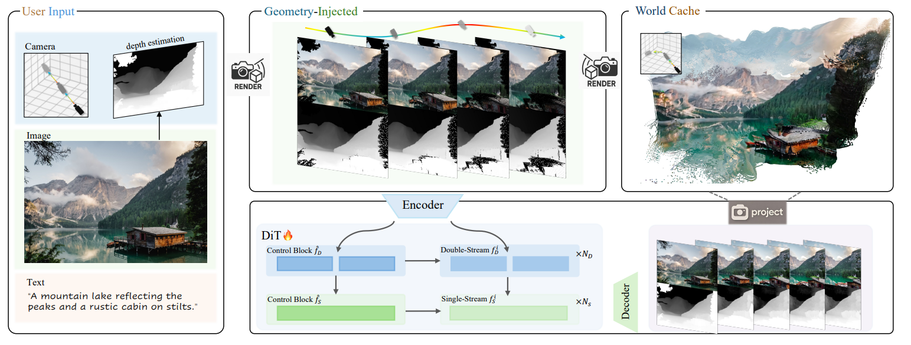
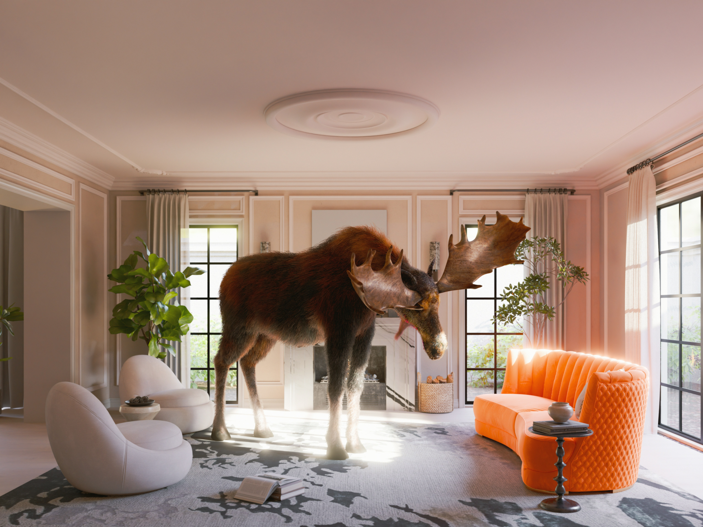

<!---
Copyright (c) 2025 Advanced Micro Devices, Inc. (AMD)

Permission is hereby granted, free of charge, to any person obtaining a copy
of this software and associated documentation files (the "Software"), to deal
in the Software without restriction, including without limitation the rights
to use, copy, modify, merge, publish, distribute, sublicense, and/or sell
copies of the Software, and to permit persons to whom the Software is
furnished to do so, subject to the following conditions:

The above copyright notice and this permission notice shall be included in all
copies or substantial portions of the Software.

THE SOFTWARE IS PROVIDED "AS IS", WITHOUT WARRANTY OF ANY KIND, EXPRESS OR
IMPLIED, INCLUDING BUT NOT LIMITED TO THE WARRANTIES OF MERCHANTABILITY,
FITNESS FOR A PARTICULAR PURPOSE AND NONINFRINGEMENT. IN NO EVENT SHALL THE
AUTHORS OR COPYRIGHT HOLDERS BE LIABLE FOR ANY CLAIM, DAMAGES OR OTHER
LIABILITY, WHETHER IN AN ACTION OF CONTRACT, TORT OR OTHERWISE, ARISING FROM,
OUT OF OR IN CONNECTION WITH THE SOFTWARE OR THE USE OR OTHER DEALINGS IN THE
SOFTWARE.
--->

# Inference with HunyuanWorld-Voyager on AMD Instinct GPUs

Single-image 3D world generation faces several technical challenges: occluded regions are often hallucinated, depth consistency varies across frames, long camera trajectories introduce drift, and multi-stage pipelines (such as separate depth estimation and SfM/MVS) add latency while compounding errors. [HunyuanWorld‑Voyager](https://github.com/Tencent-Hunyuan/HunyuanWorld-Voyager) addresses these limitations through a world-consistent video diffusion model. Given a single image and an optional camera trajectory, it jointly generates RGB frames and per-frame aligned depth maps that follow the specified camera motion. A lightweight world cache enables geometric reprojection for improved occlusion handling and supports autoregressive extension for long or effectively unbounded explorations. The aligned depth outputs allow direct export to point clouds, Gaussian splats, or meshes without requiring a separate reconstruction stage.

This blog demonstrates how to achieve high-performance 3D inference on AMD Instinct MI300X with HunyuanWorld‑Voyager, complementing our recent work on [Game Video Generation with Hunyuan-GameCraft](https://rocm.blogs.amd.com/artificial-intelligence/hunyuan-gamecraft/README.html). See the Summary section for links to additional related video generation posts.

## Technical Highlights



In the figure above you can see an overview of HunyuanWorld‑Voyager ([Source: HunyuanWorld-Voyager technical report](https://3d-models.hunyuan.tencent.com/voyager/voyager_en/assets/HYWorld_Voyager.pdf)). The block diagram showcases the key technical components of the framework. To reduce perceptual hallucination under complex visual conditions, geometry-injected frame conditioning was introduced, which combines RGB and depth projections for more reliable [occlusion reasoning](https://arxiv.org/abs/2208.00090). Building on this, a depth-fused video diffusion model ensures spatial consistency, while context-based control blocks improve viewpoint stability and fine-grained trajectory control.

For 3D world reconstruction and long-range exploration, world caching with point culling maintains scene continuity with minimal redundancy, and smooth video sampling mitigates seams between autoregressive segments. Finally, a scalable video data engine automatically estimates camera poses and metric depth to supply high-quality training data for all components above.

For more technical details, please refer to the [HunyuanWorld-Voyager technical report](https://3d-models.hunyuan.tencent.com/voyager/voyager_en/assets/HYWorld_Voyager.pdf).

## Implementation

In the following sections, you’ll find step-by-step instructions for running the HunyuanWorld-Voyager model, covering environment setup, practical use cases, and both single- and multi-GPU inference on simple benchmarks with AMD Instinct GPUs.

### 1. Launch the Docker Container

We use the [ROCm-based xDiT Docker image](https://hub.docker.com/r/amdsiloai/pytorch-xdit) (amdsiloai/pytorch-xdit:v25.11), an optimized diffusion model Docker with out-of-box support for state-of-the-art video generation models; supported platforms are listed here: [list of supported OSs and AMD hardware](https://rocm.docs.amd.com/projects/install-on-linux/en/latest/reference/system-requirements.html). It is recommended to use ≥80 GB VRAM for single‑GPU inference. We run on an AMD Instinct MI300X (192 GB) and scale multi‑GPU tests on 2, 4, and 8 MI300X cards.

The selection of shm-size can be based on number of GPUs, model size, or system RAM. One simple way to calculate it is `--shm-size` = (Number of GPUs × 8GB) to (Number of GPUs × 16GB). We used 32g for 4-GPU inference on Voyager model.

#### Option 1: AMD Container Toolkit (Recommended)

If you have AMD GPUs and the AMD Container Toolkit installed on your system, we recommend using it for better GPU management. Use specific GPUs by ID (example with 4 GPUs):

```bash
docker run -it --rm --runtime=amd \
  -e AMD_VISIBLE_DEVICES=0,1,2,3 \
  --shm-size=32g \
  --name hunyuan-voyager \
  -v $(pwd):/workspace -w /workspace \
  amdsiloai/pytorch-xdit:v25.11
```

Note for HPC/Job Scheduler Users:
Use specific GPU IDs that match your job allocation.
`AMD_VISIBLE_DEVICES=all` may not respect job scheduler GPU allocation and could use all GPUs on the node.

#### Option 2: Traditional Device Mapping

If the AMD Container Toolkit is not installed

```bash
docker run -it --rm \
  --device=/dev/kfd --device=/dev/dri \
  --group-add video \
  --shm-size=32g \
  --name hunyuan-voyager \
  -v $(pwd):/workspace -w /workspace \
  amdsiloai/pytorch-xdit:v25.11
```

For Vultr and some cloud providers, manual render device mapping may be required.

### 2. Install Dependencies and Setup HunyuanWorld-Voyager Repository

Begin by cloning our [updated hunyuanWorld-voyager repository](https://github.com/silogen/HunyuanWorld-Voyager), which includes AMD GPU set-ups and pre-processing configuration improvements. Additional AMD-specific setup instructions are available in `platform/AMD_GPU/README.md`:

```bash
git clone https://github.com/silogen/HunyuanWorld-Voyager
cd HunyuanWorld-Voyager
# Use the AMD-adapted branch
git checkout feat/rocm-platform
```

During setup you may see pip resolver warnings. These optional extras are not used in our inference path and can be safely ignored.

```bash
# Dependencies
pip install pyexr==0.5.0 loguru==0.7.2 tensorboard==2.19.0 transformers==4.45
pip install flash-attn --no-build-isolation
export FLASH_ATTN_IMPL=ck
# Needed if the underlaying host ROCm <= 6.4.1
export HSA_NO_SCRATCH_RECLAIM=1
# Optional: MIOpen tuning variables (may improve performance on some configurations)
export MIOPEN_DEBUG_CONV_DIRECT=0
export MIOPEN_FIND_MODE=3
export MIOPEN_FIND_ENFORCE=3
```

The HunyuanWorld-Voyager framework includes utilities for processing custom input images and camera trajectories. To create your own input conditions, you also need to install the following dependencies:

```bash
pip install --no-deps git+https://github.com/microsoft/MoGe.git
pip install scipy==1.11.4
pip install git+https://github.com/EasternJournalist/utils3d.git@a480806f58337da70d3c0df970b1df91ca152e61
```

### 3. Model Download and Environment Variable Setup

```bash
huggingface-cli download tencent/HunyuanWorld-Voyager --local-dir ./ckpts
# Default model path is hardcoded to /root, modify the model path
export MODEL_BASE="./ckpts"
```

### 4. Download Example Images (Optional)

Download the example images used in the following use cases:

```bash
mkdir -p examples/image

# Download village scene image
curl -L -o examples/image/village.jpg https://raw.githubusercontent.com/ROCm/rocm-blogs/release/blogs/artificial-intelligence/hunyuanworld-voyager-inference/images/village.jpg

# Download elk scene image
curl -L -o examples/image/elk.jpg https://raw.githubusercontent.com/ROCm/rocm-blogs/release/blogs/artificial-intelligence/hunyuanworld-voyager-inference/images/elk.jpg
```

## Use Cases

### Custom Input Condition

Before running inference, prepare your input images. The model supports custom input images and camera motions through `data_engine/create_input.py`. By default, input images are resized to a consistent resolution (1280, 720). You can modify this resolution in the script if your input image requires different dimensions.

The model supports the following camera path types:

- `forward`
- `backward`
- `left`
- `right`
- `turn_left`
- `turn_right`

### Use Case 1: Village Scene

This example demonstrates generating a 3D world video from a single village scene image (see below), showcasing forward camera motion through a countryside landscape. The default configuration generates 49 frames. You can modify the frame count using `--num-frames` (e.g., 121 for a 5-second video).


```bash
python3 data_engine/create_input.py \
  --image_path examples/image/village.jpg \
  --render_output_dir examples/village_forward \
  --type forward 
```

#### Single-GPU Inference

Using 1 AMD MI300X GPU with 12 CPU cores and 192GB VRAM:

```bash
PROMPT="Panoramic Nordic village scene, path, cottages, trees, distant hills, oil paint style, highly detailed."
python3 sample_image2video.py \
    --model HYVideo-T/2 \
    --input-path "examples/village_forward" \
    --prompt "$PROMPT" \
    --i2v-stability \
    --flow-reverse \
    --infer-steps 50 \
    --flow-shift 7.0 \
    --seed 0 \
    --embedded-cfg-scale 6.0 \
    --save-path ./results
```

#### Parallel Inference on Multiple GPUs by xDiT

The `--ulysses-degree` parameter specifies the number of GPUs used for all-to-all (Ulysses) communication, while `--ring-degree` sets the number of GPUs for peer-to-peer (Ring-Attention) communication. The total GPU count equals the product of `--ulysses-degree` and `--ring-degree`. Optimal settings may vary based on your hardware configuration, so experimentation with these parameters is recommended.

```bash
# Using 4 AMD MI300X GPUs
ALLOW_RESIZE_FOR_SP=1 torchrun --nproc_per_node=4 \
    sample_image2video.py \
    --model HYVideo-T/2 \
    --input-path "examples/village_forward" \
    --prompt "$PROMPT" \
    --i2v-stability \
    --flow-reverse \
    --infer-steps 50 \
    --flow-shift 7 \
    --seed 0 \
    --embedded-cfg-scale 6.0 \
    --save-path ./results \
    --ulysses-degree 4 \
    --ring-degree 1
```

The video below shows all six camera paths (49 frames each) at real-time speed, followed by slow-motion replay (0.5x) for detailed observation. The model maintains strong spatial consistency across different camera motions—forward and backward movements show smooth transitions with minimal artifacts, while left/right translations preserve scene geometry well. Turning motions (turn_left/turn_right) occasionally produce slight distortions due to challenging viewpoint transformations, which can be mitigated by adjusting camera path parameters in `data_engine/create_input.py`.

The grayscale depth estimation (lower panel) demonstrates the model's 3D scene understanding. Notice how depth values accurately capture foreground elements (cottages and trees) versus distant hills, providing reliable geometric cues for multi-view consistency and occlusion handling.

```{video} videos/village_output.mp4
:width: 1080
:height: 1080
:controls:
```

### Use Case 2: Elk in the Room

This example demonstrates the model's capability with indoor scenes and animal subjects.



```bash
# Camera path will move backward, 49 frames
python3 data_engine/create_input.py \
  --image_path examples/image/elk.jpg \
  --render_output_dir examples/elk_backward \
  --type backward

PROMPT="An elk slowly turning its head, slight hoof movement, softly lit room, natural fur texture, cinematic realism, stable framing."

ALLOW_RESIZE_FOR_SP=1 torchrun --nproc_per_node=4 \
    sample_image2video.py \
    --model HYVideo-T/2 \
    --input-path "examples/elk_backward" \
    --prompt "$PROMPT" \
    --i2v-stability \
    --flow-reverse \
    --infer-steps 50 \
    --flow-shift 7 \
    --seed 0 \
    --embedded-cfg-scale 6.0 \
    --save-path ./results \
    --ulysses-degree 4 \
    --ring-degree 1
```

The video shows all six camera trajectories (49 frames each) at real-time speed, then in slow motion (0.5x). The model maintains consistent depth and realistic appearance across different camera motions, though turning movements may show occasional geometric distortions. Note the vivid head movement of the elk during forward camera motion, showcasing the model's ability to preserve subject animation while maintaining spatial consistency.

```{video} videos/elk_output.mp4
:width: 1080
:height: 1080
:controls:
```

## Performance Results

The table below shows baseline inference latency and end-to-end generation times (1040×768 resolution, 49 frames, 50 diffusion steps) on MI300X GPUs (192 GB VRAM per GPU, 12 host CPU cores each). Results were measured after an initial warm-up run to exclude model loading and compilation overhead. Clear scaling benefits are demonstrated from 1 to 8 GPUs. These benchmarks use default settings without advanced overlap, precision, or cache optimizations, indicating additional performance potential beyond the scope of this blog.

| GPUs | Inference Latency (s) | End-to-End Generation Time (s) |
|------|----------------------|-------------------------------|
| 1 | 635 | 680 |
| 2 | 359 | 473 |
| 4 | 188 | 310 |
| 8 | 111 | 239 |

## Summary

This blog demonstrates HunyuanWorld-Voyager inference on AMD Instinct GPUs, showcasing the framework's ability to generate consistent 3D world videos from single images with controllable camera trajectories. The results highlight AMD hardware's strong performance for next-generation video generation workloads, with clear scaling benefits from single-GPU to multi-GPU configurations.

As video generation technology advances, AMD continues to optimize emerging frameworks to provide developers with high-performance, accessible solutions. For additional resources on video generation with AMD GPUs, explore our related technical publications on:

- [Game Video Generation with Hunyuan-GameCraft](https://rocm.blogs.amd.com/artificial-intelligence/hunyuan-gamecraft/README.html)
- [Audio-Driven Video Generation](https://rocm.blogs.amd.com/artificial-intelligence/audio-driven-videogen/README.html)
- [Distributed Serving Video Generation Models](https://rocm.blogs.amd.com/artificial-intelligence/serving-videogen-v1/README.html)
- [Video Editing with VACE](https://rocm.blogs.amd.com/artificial-intelligence/video-editing-models/README.html)
- [Fine-tuning Wan2.2](https://rocm.blogs.amd.com/artificial-intelligence/finetuning-wan-part1/README.html)
- [Accelerating FastVideo on AMD GPUs with TeaCache](https://rocm.blogs.amd.com/artificial-intelligence/fastvideo-v1/README.html)
- [ComfyUI for video generation](https://rocm.blogs.amd.com/software-tools-optimization/comfyui-on-amd/README.html)

## Acknowledgement

We acknowledge the authors of the [HunyuanWorld-Voyager: Technical Report](https://3d-models.hunyuan.tencent.com/voyager/voyager_en/assets/HYWorld_Voyager.pdf), whose contributions enabled the implementation demonstrated in this blog. We also thank Jesus Carabano Bravo for his support in testing the new xDiT Docker image.

## Disclaimers

Third-party content is licensed to you directly by the third party that owns the
content and is not licensed to you by AMD. ALL LINKED THIRD-PARTY CONTENT IS
PROVIDED “AS IS” WITHOUT A WARRANTY OF ANY KIND. USE OF SUCH THIRD-PARTY CONTENT
IS DONE AT YOUR SOLE DISCRETION AND UNDER NO CIRCUMSTANCES WILL AMD BE LIABLE TO
YOU FOR ANY THIRD-PARTY CONTENT. YOU ASSUME ALL RISK AND ARE SOLELY RESPONSIBLE
FOR ANY DAMAGES THAT MAY ARISE FROM YOUR USE OF THIRD-PARTY CONTENT.
