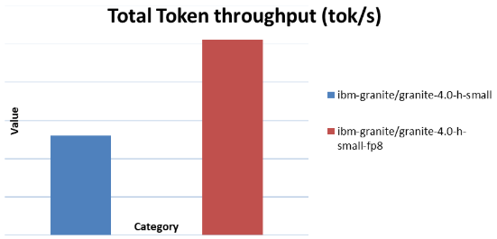

<!---
Copyright (c) 2025 Advanced Micro Devices, Inc. (AMD)

Permission is hereby granted, free of charge, to any person obtaining a copy
of this software and associated documentation files (the "Software"), to deal
in the Software without restriction, including without limitation the rights
to use, copy, modify, merge, publish, distribute, sublicense, and/or sell
copies of the Software, and to permit persons to whom the Software is
furnished to do so, subject to the following conditions:

The above copyright notice and this permission notice shall be included in all
copies or substantial portions of the Software.

THE SOFTWARE IS PROVIDED "AS IS", WITHOUT WARRANTY OF ANY KIND, EXPRESS OR
IMPLIED, INCLUDING BUT NOT LIMITED TO THE WARRANTIES OF MERCHANTABILITY,
FITNESS FOR A PARTICULAR PURPOSE AND NONINFRINGEMENT. IN NO EVENT SHALL THE
AUTHORS OR COPYRIGHT HOLDERS BE LIABLE FOR ANY CLAIM, DAMAGES OR OTHER
LIABILITY, WHETHER IN AN ACTION OF CONTRACT, TORT OR OTHERWISE, ARISING FROM,
OUT OF OR IN CONNECTION WITH THE SOFTWARE OR THE USE OR OTHER DEALINGS IN THE
SOFTWARE.
--->

# Accelerating IBM Granite 4.0 with FP8 using AMD Quark on MI300/MI355 GPUs 

AMD announced Day 0 support for IBM’s next-gen Granite 4.0 language models recently on AMD Instinct™ MI300 Series GPUs (300X, 325X, 350X, and 355X) using vLLM.   

Large language models (LLMs) such as IBM Granite 4.0 demand massive computing and memory bandwidth, especially when deployed at scale. To reduce inference cost, without sacrificing accuracy, precisionaccuracy-aware quantization techniques have emerged as a critical model optimization strategy. In this post, we demonstrate how AMD Quark, a high-performance quantization library optimized for AMD Instinct™ MI300 and MI355 GPUs, enables FP8 and MXFP4 quantization to deliver excellent accuracy retention and substantial throughput uplifts for the IBM Granite 4.0 model family. 

# Quantization with AMD Quark 

AMD Quark is a comprehensive cross-platform deep learning toolkit designed to simplify and enhance the quantization of deep learning models. For LLMs quantization, Quark is tightly integrated with ROCm™ and optimized for matrix-core acceleration. It provides: 

Multiple numeric formats (FP8, MXFP4, MXFP6, INT8, INT4, etc.) 
Modular quantization flows (PTQ, QAT, etc.) 
Support for large LLMs (Granite, Llama, Qwen, DeepSeek, etc.) 
Seamless integration of quantized models into vLLM / SGLang inference engines 


# Preparation 

Below is an example environment configuration tested for Granite 4.0 quantization on MI300/MI355: 

Docker: rocm/vllm-dev:granite_4_preview 
Transformers:  4.56.0  https://github.com/huggingface/transformers  
aAccelerate= 1.10.1 https://github.com/huggingface/accelerate  
Quark = 0.11, https://github.com/amd/Quark  
vllm = 0.11.0 https://github.com/vllm-project/vllm  


# FP8 Quantization 

FP8 is an 8-bit floating-point format (E4M3 or E5M2) that offers an excellent balance between precision and dynamic range while significantly reducing memory bandwidth for activations and weights. AMD Instinct™ MI300 and newer GPUs provide native matrix-core support for FP8 operations, enabling high-throughput inference and training with improved efficiency and scalability. 
 

You can find an example FP8 quantized Mmodel here: https://huggingface.co/amd/granite-4.0-h-small-fp8 

```bash
from quark.torch import ( 
    LLMTemplate, 
    ModelQuantizer, 
    export_safetensors, 
) 

from llm_utils.data_preparation import get_calib_dataloader 
from llm_utils.model_preparation import get_model, get_model_type, get_tokenizer, prepare_for_moe_quant 

def quant_granite(model_dir="ibm-granite/granite-4.0-h-small", 
                  output_dir="ibm- granite/granite_4.0_h_small_fp8"): 

    # 1. Define original model 
    device = "cuda"  

    model, model_dtype = get_model(  
        model_dir,  
        "auto",  
        device,  
        multi_gpu=True,  
    )  

    prepare_for_moe_quant(model) 
    model_type = get_model_type(model)  

    tokenizer = get_tokenizer(  
        model_dir, max_seq_len=1024, model_type=model_type,  
        trust_remote_code=True  
        )   

    # 2. Define calibration dataloader(still need this step for weight only and dynamic quantization in Quark for current version.)  

    # When the model is small, accelerate will place it on the last device  
    main_device = model.device  

    calib_dataloader = get_calib_dataloader(  
        dataset_name="pileval",  
        processor=None,  
        tokenizer=tokenizer,  
        batch_size=16,  
        num_calib_data=128,  
        seqlen=1024,  
        device=device,
    )

    # 3. Quantization  

    # Set quantization configuration using LLMTemplate 
    model_config_type = (  
        model.config.model_type if hasattr(model.config, "model_type") else  model.config.architectures[0]  
        )

    template = LLMTemplate.get(model_config_type)  

    quant_config = template.get_config(  
            scheme="fp8",  
            algorithm=None, 
            kv_cache_scheme="fp8",  
            min_kv_scale=0.01,  
            layer_config={},  
            attention_scheme=None,  
            exclude_layers=["*router.*", "*lm_head*"],  
        )   

    # In-place replacement of model modules with quantized versions. 
    quantizer = ModelQuantizer(quant_config, multi_device=True)  
    model = quantizer.quantize_model(model, calib_dataloader)   

    # After quantization, models are frozen - moving from soft weights that are quantized on the fly to e.g. `QuantLinear.weight` actually holding the fake quantized weights.  
    model = quantizer.freeze(model)  

    # 4. Model exporting  
    with torch.no_grad(): 
         export_safetensors(  
                    model=model,  
                    output_dir=output_dir,  
                    custom_mode="fp8",  
                    weight_format="real_quantized",  
                    pack_method="reorder",  
                    merge_scale=False, 
             )  
 
         tokenizer.save_pretrained(output_dir)  

def main():  
    quant_granite() 

if __name__ == "__main__":  
    main() 
```

# Accuracy Evaluation 

| Benchmark | ibm-granite/granite-4.0-h-small | ibm-granite/granite-4.0-h-small-fp8 | Recovery 
| -------- | -------- | -------- | -------- |
| GSM8K | 85.60 | 84.53 | 98.75% | 
| IFEVAL- Instruct, Strict | 79.02 | 79.50 | 100% |
| IFEVAL- Instruct, Strict | 70.79 | 70.71 | 99.88% |
 

# Performance Uplift 

vllm throughput benchmark script: 

```bash
export VLLM_USE_V1=1  
export VLLM_ROCM_USE_AITER=0  
export VLLM_V1_USE_PREFILL_DECODE_ATTENTION=0  
export CUDA_VISIBLE_DEVICES=7  
MODEL_DIR=ibm-granite/granite-4.0-h-small/  

vllm bench serve / --backend openai-chat / --endpoint /v1/chat/completions / --dataset-name random / --model $MODEL_DIR / --num-prompts 1000 / --tokenizer $MODEL_DIR / --save-result 
```
 
| Benchmark Device | Model | Total Token throughput (tok/s) |
| -------- | -------- | -------- |
| MI300 | bm-granite/granite-4.0-h-small | 13018.16 |
| MI300 | ibm-granite/granite-4.0-h-small-fp8 | 25541.64 |



# Summary 

This blog provides a practical, step-by-step guide to quantizing and accelerating IBM Granite 4.0 models using AMD Quark on AMD Instinct™ MI300 and MI350 Series GPUs. It introduces Quark as AMD’s unified quantization framework and walks through hands-on instructions for FP8 quantization, accuracy evaluation, and performance benchmarking. By combining Quark’s flexible quantization workflows with the native matrix-core capabilities of MI300-class GPUs, developers can efficiently deploy large language models with higher throughput and lower memory footprint—while maintaining near-lossless accuracy. 