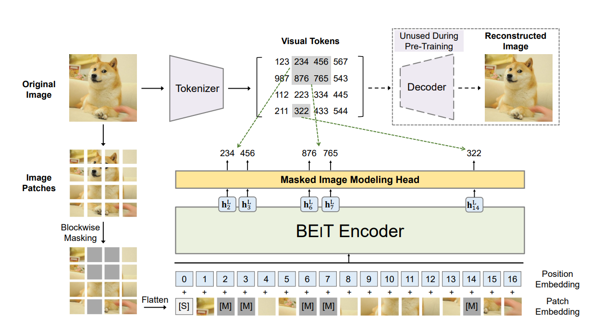
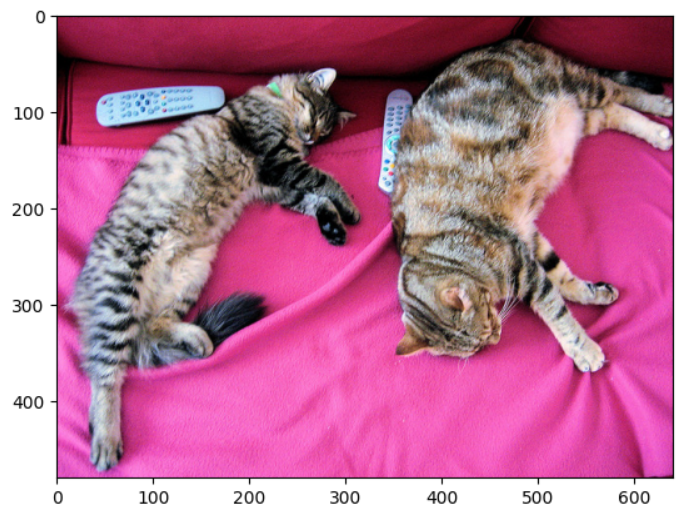
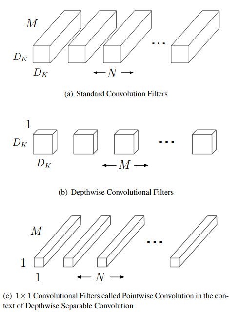
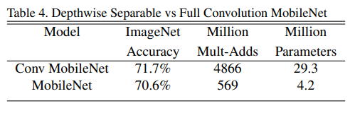
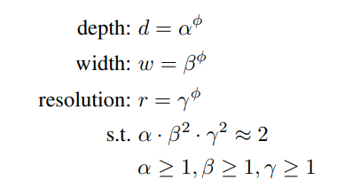
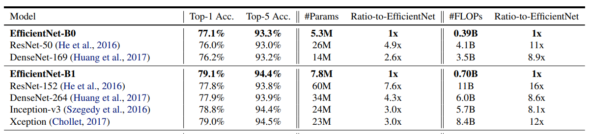

# Image Classification with BEiT, MobileNet, and EfficientNet using ROCm on AMD GPUs

## Introduction

Image classification is a key task in computer vision aiming at “understanding” an entire image. The outcome of an image classifier is a label or a category for the image as a whole, unlike object recognition where the task is to detect and classify multiple objects within an image.

In this blog, we'll discuss top-performing image classification models in computer vision that deliver state-of-the-art performance on ImageNet dataset. We will look at their architecture, and we will examine techniques for inferencing them with PyTorch using ROCm on AMD hardware. Whether you’re a researcher, a developer, or an enthusiast, these models offer valuable insights into the advancements of computer vision models.

## Setup

This demo uses the following settings. For more information, please refer to the [ROCm documentation](https://rocm.docs.amd.com/projects/install-on-linux/en/latest/).

* Hardware & OS:
  * [AMD Instinct GPU](https://www.amd.com/en/products/accelerators/instinct.html)
  * Ubuntu 20.04.6 LTS
* Software:
  * [ROCm 6.1.3](https://rocm.docs.amd.com/en/latest/)
  * [Pytorch 2.1.2](https://pytorch.org/)
    Alternatively, you can use the following docker command to setup the above software requirements
    ```docker run -it --device=/dev/kfd --device=/dev/dri --group-add=video --shm-size 8G rocm/pytorch:rocm6.1.2_ubuntu20.04_py3.9_pytorch_release-2.1.2```
  * Install Hugging Face libraries
    ```pip install transformers datasets```

## BEiT

[Bidirectional Encoder for Image Transformers (BEiT)](https://arxiv.org/abs/2106.08254) is a computer vision model that uses Masked Image Modelling (MIM) to pretrain a Vision Transformer (ViT). MIM is based on Masked Language Modelling (MLM) in BERT and is a self-supervised pretraining strategy that is stable and scalable. The use of MIM improves performance on classification and segmentation tasks. Masked-based pretraining was explored in ViT prior to the development of BEiT; however, BEiT has achieved the best Top-1 accuracy on imagenet-1K dataset.

The superior performance of BEiT lies in the MIM pretraining. In the image below you can see that there are two views of the input used in the pretraining: image patches and visual tokens. Similarly to MLM, the input image is partitioned into a sequence of patches which are flattened into vectors and projected onto higher-dimensional spaces to create embeddings. A randomized selection of patches are masked before they are passed to the Transformer network. A Variational Autoencoder (VAE) is used as a tokenizer to convert the raw image into visual tokens. The VAE's decoder is used to convert the visual tokens back to the input image.



Image source is [BEiT paper](https://arxiv.org/abs/2106.08254)

There are as many visual tokens as there are input patches. The network is pretrained to predict visual tokens from the image patches. The reason behind predicting visual tokens rather than the pixels itself is that predicting raw input pixels pushes the model to learn short range dependencies and high frequency details. Whereas, predicting discrete visual tokens summarizes high level abstractions of the image well.  

BEiT's pretraining strategy also helps the model distinguish semantic regions and object boundaries, without using any human annotation.

BEiT base has 12 Transformer layers with 768 hidden size and 12 attention heads, similar to a ViT-base. With a classification head on top of it, we use ```BeitForImageClassification``` from Hugging Face to perform classification inference on a pretrained BEiT model on a test image labelled 'tabby, tabby cat'.



```python
from transformers import AutoImageProcessor, BeitForImageClassification
import torch
from datasets import load_dataset

dataset = load_dataset("huggingface/cats-image")
image = dataset["test"]["image"][0]

image_processor = AutoImageProcessor.from_pretrained("microsoft/beit-base-patch16-224")
model = BeitForImageClassification.from_pretrained("microsoft/beit-base-patch16-224")

inputs = image_processor(image, return_tensors="pt")

with torch.no_grad():
    logits = model(**inputs).logits

# model predicts one of the 1000 ImageNet classes
predicted_label = logits.argmax(-1).item()
print(model.config.id2label[predicted_label])
```

```bash
tabby, tabby cat
```

## MobileNet

[MobileNets](https://arxiv.org/pdf/1704.04861) are a class of ConvNets that replace regular convolutions with depthwise separable convolutions to build light weight deep neural networks. They deliver similar performance to regular convolutions with less than half the number of parameters. The motivation is to build very small, low latency models for mobiles and embedded vision applications without a major compromise in accuracy. It is one of the emerging downsizing techniques among others such as shrinking, factorizing, quantization based compression etc.

Depthwise separable convolutions consist of two parts - depthwise convolutions and pointwise (1x1) convolutions.Depthwise convolution applies a single filter per input channel and 1 x 1 convolution linearly combines the output of depthwise convolutions. These are traditionally done at the same time in a regular convolution. Splitting it into two operations substantially decreases the total number of parameters and consequentially the computation cost.

Let's suppose there's a $D_F$ x $D_F$ × M input feature map, $D_F$ x $D_F$ × N output feature map where $D_F$ x $D_F$ is the resolution and M, N are the input and output channel sizes respectively. When we perform a regular convolution with a kernel K of size $D_K$ x $D_K$ × M x N, then the computational cost comes to $D_F$ x $D_F$ × M x N x $D_K$ x $D_K$.

Whereas when replaced with depthwise separable convolution, the cost is split into two parts. As shown in the image below, each input channel is convolved with a seperate filter with cost $D_F$ x $D_F$ × M x $D_K$ x $D_K$. Then 1 x 1 convolutions are applied to combine the output using N such 1 x 1 x M filters, with a cost of M x N x $D_F$ x $D_F$. Therefore, the total computation cost is $D_F$ x $D_F$ × M x $D_K$ x $D_K$ + M x N x $D_F$ x $D_F$.



By expressing convolution as a two step process of filtering and combining we get a reduction in computation cost as shown below.


This table shows the improved performance of depthwise separable convolution versus full convolution: regular convolutions deliver 71.7% at 29.3M parameters vs depthwise separable conv deliver 70.6% at 4.2M parameters.



Images taken from [MobileNet paper](https://arxiv.org/pdf/1704.04861)

Additionally, MobileNet uses two simple global hyperparameters to further reduce the size of the network to efficiently trade off between latency and accuracy: width multiplier (α) and resolution multiplier (ρ). The role of the width multiplier α is to thin a network uniformly at each layer. The resolution multiplier is implicitly applied by lowering input resolution. This subsequently reduces the internal representation of every layer. Both these hyperparameters have the effect of reducing computational cost by $ρ^2$ and $α^2$, with only a small reduction in accuracy.

In addition to classification, these reduction techniques also perform well in detection, segementation tasks on low resource platforms. Refer to the [original paper](https://arxiv.org/pdf/1704.04861) for more insights. [MobileNetV2](https://arxiv.org/pdf/1801.04381v4) and [MobileNetV3](https://arxiv.org/pdf/1905.02244), the most recent iterations of the MobileNet series, incorporate the combination of search algorithms and network design principles to optimize mobile models, resulting in a more powerful and efficient architecture.

The following is the code from Hugging Face used to run inference on pretrained MobileNetV1 for image classification of the cat image.

```python
from transformers import AutoImageProcessor, MobileNetV1ForImageClassification
import torch
from datasets import load_dataset

dataset = load_dataset("huggingface/cats-image")
image = dataset["test"]["image"][0]

image_processor = AutoImageProcessor.from_pretrained("google/mobilenet_v1_1.0_224")
model = MobileNetV1ForImageClassification.from_pretrained("google/mobilenet_v1_1.0_224")

inputs = image_processor(image, return_tensors="pt")

with torch.no_grad():
    logits = model(**inputs).logits

# model predicts one of the 1000 ImageNet classes
predicted_label = logits.argmax(-1).item()
print(model.config.id2label[predicted_label])
```

```bash
tabby, tabby cat
```

## EfficientNet

[EfficientNet](https://arxiv.org/abs/1905.11946) is a popular scalable ConvNet used for computer vision tasks. The EfficientNet family of models have achieved SOTA accuracy on image classification task with an order of magnitude fewer parameters and FLOPS. This is achieved by the optimization problem of maximizing accuracy within resource constraints, hence the name 'efficient'.

The authors of EfficientNet aimed to design a compound scaling mechanism for ConvNets. For example, the deeper we scale ResNet, the more accuracy we achieve at the cost of more resources (ResNet-152 delivers 77.8% at 60M parameters whereas ResNet-50 76% at 26M parameters on ImageNet classification, a 2.3% increment at the cost of 130% more parameters). Such ConvNets can be scaled either deeper(d), wider(w), or with higher resolution(r). The authors proposed a principled compound scaling method that uniformly scales *all three scalable dimensions* to achieve the same performance for a given set of resource constraints.


Image source: [EfficientNet paper](https://arxiv.org/abs/1905.11946)

In the picture above, α, β, γ are constants and φ is a user-specified coefficient or a hyperparameter that helps manage the number of resources constraint. For example,  if we want to use $2^N$ times more computational resources, then we can simply increase the network depth by $α^N$, width by $β^N$, and image size by $γ^N$. α, β, γ constants are determined from a small grid search on a EfficientNet baseline model. The best values are found by maximizing the accuracy and optimizing the resources and these values are α = 1.2, β = 1.1, γ = 1.15.

The below table (Image source: [Table 1](https://arxiv.org/abs/1905.11946)) illustrates the performance of models with similar performance clubbed together. We can observe that EfficientNet-B1 is 7.6x smaller and 5.7x faster than ResNet-152 yet achieves higher performance.



The below code is taken from Hugging Face to run EfficientNet-B7 model on the same cat image.

```python
from transformers import AutoImageProcessor, EfficientNetForImageClassification
import torch
from datasets import load_dataset

dataset = load_dataset("huggingface/cats-image")
image = dataset["test"]["image"][0]

image_processor = AutoImageProcessor.from_pretrained("google/efficientnet-b7")
model = EfficientNetForImageClassification.from_pretrained("google/efficientnet-b7")

inputs = image_processor(image, return_tensors="pt")

with torch.no_grad():
    logits = model(**inputs).logits

# model predicts one of the 1000 ImageNet classes
predicted_label = logits.argmax(-1).item()
print(model.config.id2label[predicted_label])
```

```bash
tabby, tabby cat
```

In summary, increasing a network's width, depth, or resolution generally leads to improved accuracy. However, the accuracy improvements diminish as a model size increases. The EfficientNet model addresses this issue by optimizing the accuracy of a baseline network under resource constraints, through a balanced scaling of depth, width, and resolution during the upscaling process.

## Conclusion

This blog explained how ROCm and AMD hardware can be used for image classification, a fundamental computer vision technique. The blog covered three cutting edge image classification techniques: BEiT, MobileNet, and EfficientNet, showing how to test these image classifiers with PyTorch using Hugging Face.

## Disclaimers

Third-party content is licensed to you directly by the third party that owns the content and is
not licensed to you by AMD. ALL LINKED THIRD-PARTY CONTENT IS PROVIDED “AS IS”
WITHOUT A WARRANTY OF ANY KIND. USE OF SUCH THIRD-PARTY CONTENT IS DONE AT
YOUR SOLE DISCRETION AND UNDER NO CIRCUMSTANCES WILL AMD BE LIABLE TO YOU FOR
ANY THIRD-PARTY CONTENT. YOU ASSUME ALL RISK AND ARE SOLELY RESPONSIBLE FOR ANY
DAMAGES THAT MAY ARISE FROM YOUR USE OF THIRD-PARTY CONTENT.
