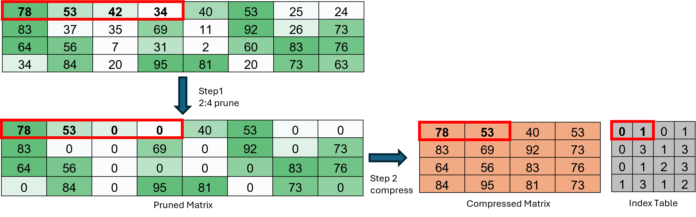
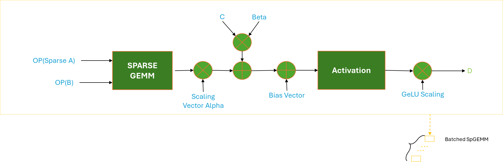
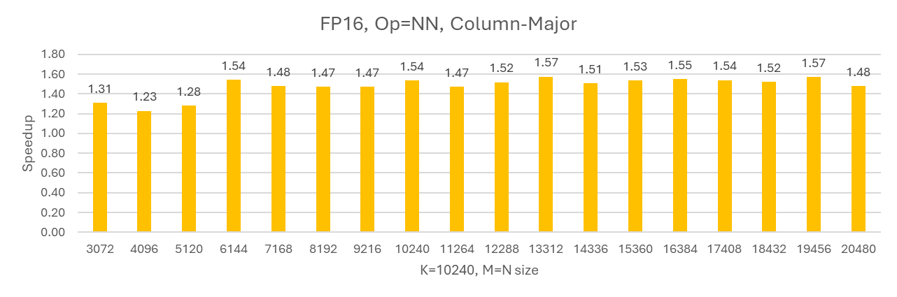
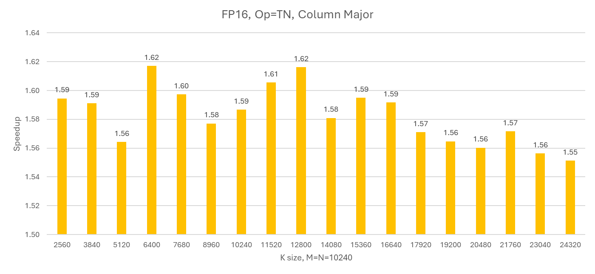

<!---
Copyright (c) 2026 Advanced Micro Devices, Inc. (AMD)

Permission is hereby granted, free of charge, to any person obtaining a copy
of this software and associated documentation files (the "Software"), to deal
in the Software without restriction, including without limitation the rights
to use, copy, modify, merge, publish, distribute, sublicense, and/or sell
copies of the Software, and to permit persons to whom the Software is
furnished to do so, subject to the following conditions:

The above copyright notice and this permission notice shall be included in all
copies or substantial portions of the Software.

THE SOFTWARE IS PROVIDED "AS IS", WITHOUT WARRANTY OF ANY KIND, EXPRESS OR
IMPLIED, INCLUDING BUT NOT LIMITED TO THE WARRANTIES OF MERCHANTABILITY,
FITNESS FOR A PARTICULAR PURPOSE AND NONINFRINGEMENT. IN NO EVENT SHALL THE
AUTHORS OR COPYRIGHT HOLDERS BE LIABLE FOR ANY CLAIM, DAMAGES OR OTHER
LIABILITY, WHETHER IN AN ACTION OF CONTRACT, TORT OR OTHERWISE, ARISING FROM,
OUT OF OR IN CONNECTION WITH THE SOFTWARE OR THE USE OR OTHER DEALINGS IN THE
SOFTWARE.
--->

# Unlocking Sparse Acceleration on AMD GPUs with hipSPARSELt

---

Sparse computation is a cornerstone of modern AI acceleration. As models like LLaMA and DINOv2 ViT-L scale in size and complexity, the demand for efficient matrix operations becomes increasingly critical. To address this, semi-structured sparsity, also known as the 2:4 structured sparsity pattern, has emerged as a powerful optimization technique.

AMD’s answer to this challenge is [*hipSPARSELt*](https://rocm.docs.amd.com/projects/hipSPARSELt/en/develop/index.html) — a high-performance library designed to accelerate sparse matrix operations on AMD GPUs.

This blog explores:

- What is structured sparsity (2:4 pattern)?
- What is hipSPARSELt?
- Performance comparisons between sparse and dense GEMM.

---

## Structured Sparsity 2:4

Structured sparsity refers to a regular pattern of zeroing out weights in a matrix. In the 2:4 sparsity pattern, every group of 4 consecutive weights contains exactly 2 zeros. This predictable structure enables hardware-friendly optimizations and efficient compression.

### The Compression Ratio of the 2:4 Structured Sparsity Pattern

A 2:4 sparse matrix consists of two components:

- A compressed matrix, storing the two most important values from each group of four.
- An index table, indicating the positions of the elements stored in the compressed matrix.

Figure 1 illustrates how a dense matrix is pruned and compressed into a structured 2:4 sparse matrix.

This process consists of two steps:

- Step 1: Within each group of four consecutive elements along a row, select two elements to zero out such that the L1 norm of the remaining elements is maximized.
- Step 2: Remove the zero elements and record the positions of the remaining non-zero elements (indices 0, 1, 2, or 3) in an index table.


*Figure 1. The steps for generating a 2:4 structured sparse matrix.*

The compression ratio depends on the data type:

- Float16 / BFloat16: 56.25%
- Int8 / Float8: 62.5%

The formulas for calculating the compression ratio are:

$$
Matrix_{Dense} = row \times column \times \text{bytes per element}
$$

$$
Matrix_{Sparse} = row \times \frac{column}{2} \times \text{bytes per element} + row \times \frac{column}{8}
$$

$$
Compress\ Ratio = \frac{Matrix_{Sparse}}{Matrix_{Dense}} = \frac{1}{2} + \frac{1}{8 \times \text{bytes per element}}
$$

---

## What is hipSPARSELt?

[hipSPARSELt](https://github.com/ROCm/rocm-libraries/tree/develop/projects/hipsparselt) is a high-performance library developed by AMD for executing sparse matrix operations on GPUs. It is part of the ROCm (Radeon Open Compute) ecosystem and is implemented using the HIP (Heterogeneous-compute Interface for Portability) programming model.

### Key Features

- Supports 2:4 structured sparsity matrix multiplication accelerated by AMD Matrix Core instructions.
- Provides pruning and compression utilities to generate structured sparsity 2:4 matrices.
- Supports operation fusion for activations (e.g., ReLU, GELU), scalar multipliers, and bias vectors.
- Optimized for AMD discrete GPUs, starting from the MI300 series.

Figure 2 shows the workflow for performing sparse matrix multiplication using hipSPARSELt.


*Figure 2. Operational overview of hipSPARSELt*

---

## Sparse vs. Dense GEMM on AMD GPUs

To evaluate the performance of hipSPARSELt, we benchmarked sparse and dense GEMM operations under the following setup:

### Experimental Setup

- Dense GEMM: via hipBLASLt.
- Sparse GEMM: via hipSPARSELt with 2:4 sparsity.
- GPU: AMD MI300
- Precision: FP16
- Sparsity: 50% (2:4 enforced)

Matrix shapes are denoted as M × N × K, where:

- Matrix A: M × K
- Matrix B: K × N
- Matrix C/D: M × N
- "Op N" indicates non-transpose; "Op T" indicates transpose.

### Performance Results

Figures 3 and 4 present the relative speedup of sparse GEMM implemented with hipSPARSELt compared to dense GEMM implemented with hipBLASLt under different matrix configurations.
Figure 3 shows the performance uplift when the K dimension is fixed, using an NN (non‑transpose × non‑transpose) layout with column‑major storage. Figure 4 reports the speedup when M = N is held constant, using a TN (transpose × non‑transpose) layout, also with column‑major storage.


*Figure 3. Speedup of Sparse GEMMs in hipSPARSELt over Dense GEMMs in hipBLASLt on AMD MI300 GPU , fp16 input/output, K fixed, NN layout, Column-major, ROCm 7.0*


*Figure 4. Speedup of Sparse GEMMs in hipSPARSELt over Dense GEMMs in hipBLASLt on AMD MI300 GPU , fp16 input/output, M=N fixed, TN layout, Column-major, ROCm 7.0*

## Code Example using hipSPARSELt

The following example demonstrates how to use hipSPARSELt to perform sparse matrix multiplication on AMD GPUs.

This example includes:

- Pruning matrix A and validating the result.
- Compressing the pruned matrix.
- Executing sparse matrix multiplication (SpMM).
For more advanced code samples, please visit the [hipSPARSELt Samples](https://github.com/ROCm/rocm-libraries/tree/develop/projects/hipsparselt/clients/samples).

In this example, matrix A contains sequential values from 0 to 63, and it is multiplied by matrix B, which is filled entirely with ones.
Please note that the memory layout is column-major.

<!-- markdownlint-disable MD003 MD022 MD049 -->
$$
\text{prune}
\!\left(
\begin{bmatrix}
0 & 8 & \cdots & 56 \\
1 & 9 & \cdots & 57 \\
\vdots & \vdots & \ddots & \vdots \\
7 & 15 & \cdots & 63
\end{bmatrix}_{\text{8x8}}
\right)
\times
\begin{bmatrix}
1 & 1 & \cdots & 1 \\
1 & 1 & \cdots & 1 \\
\vdots & \vdots & \ddots & \vdots \\
1 & 1 & \cdots & 1
\end{bmatrix}_{\text{8x8}}
=
\begin{bmatrix}
144 & 144 & \cdots & 144 \\
148 & 148 & \cdots & 148 \\
\vdots & \vdots & \ddots & \vdots \\
172 & 172 & \cdots & 172
\end{bmatrix}_{\text{8x8}}
$$
<!-- markdownlint-enable MD003 MD022 MD049-->

```C++
#include <hip/hip_runtime.h>
#include <hipsparselt/hipsparselt.h>
#include <stdio.h>

void init_one(size_t m, size_t n, __half* in) {
    for (size_t i = 0; i < m * n; i++) in[i] = static_cast<__half>(1);
}

void init_serial(size_t m, size_t n, __half* in) {
    for (size_t i = 0; i < m * n; i++) in[i] = static_cast<__half>(i);
}

void print_matrix(size_t m, size_t n, __half* in) {
    for (size_t i = 0; i < m; i++) {
        for (size_t j = 0; j < n; j++) {
            printf("%f\t", static_cast<float>(in[j * m + i]));
        }
        printf("\n");
    }
}

int main() {
    int64_t m = 8, n = 8, k = 8;
    float alpha = 1.0f, beta = 0.0f;

    hipsparseOperation_t trans_a = HIPSPARSE_OPERATION_NON_TRANSPOSE;
    hipsparseOperation_t trans_b = HIPSPARSE_OPERATION_NON_TRANSPOSE;
    hipsparseOrder_t order = HIPSPARSE_ORDER_COL;

    int64_t row_a = m, col_a = k;
    int64_t row_b = k, col_b = n;
    int64_t row_c = m, col_c = n;
    int64_t row_d = m, col_d = n;

    // Host memory allocation
    __half* hA = (__half*)malloc(row_a * col_a * sizeof(__half));
    __half* hAp = (__half*)malloc(row_b * col_b * sizeof(__half));
    __half* hB = (__half*)malloc(row_b * col_b * sizeof(__half));
    __half* hC = (__half*)malloc(row_c * col_c * sizeof(__half));
    __half* hD = (__half*)malloc(row_d * col_d * sizeof(__half));

    // Initialize matrices A, B on host
    init_serial(row_a, col_a, hA);
    init_one(row_b, col_b, hB);

    printf("A:\n");
    print_matrix(row_a, col_a, hA);

    // Device memory allocation
    __half *dA, *dB, *dC, *dD;
    hipMalloc(&dA, row_a * col_a * sizeof(__half));
    hipMalloc(&dB, row_b * col_b * sizeof(__half));
    hipMalloc(&dC, row_c * col_c * sizeof(__half));
    hipMalloc(&dD, row_d * col_d * sizeof(__half));

    // Copy data from host to device
    hipMemcpy(dA, hA, row_a * col_a * sizeof(__half), hipMemcpyHostToDevice);
    hipMemcpy(dB, hB, row_b * col_b * sizeof(__half), hipMemcpyHostToDevice);
    hipMemcpy(dC, hC, row_c * col_c * sizeof(__half), hipMemcpyHostToDevice);
    hipMemcpy(dD, hD, row_d * col_d * sizeof(__half), hipMemcpyHostToDevice);

    // Initialize hipSPARSELt descriptors
    hipsparseLtHandle_t handle;
    hipsparseLtMatDescriptor_t matA, matB, matC, matD;
    hipsparseLtMatmulDescriptor_t matmul;
    hipsparseLtMatmulAlgSelection_t alg_sel;
    hipsparseLtMatmulPlan_t plan;
    hipStream_t stream = nullptr;

    hipsparseLtInit(&handle);

    hipsparseLtStructuredDescriptorInit(&handle, &matA, row_a, col_a, row_a, 16, HIP_R_16F, order,
                                        HIPSPARSELT_SPARSITY_50_PERCENT);
    hipsparseLtDenseDescriptorInit(&handle, &matB, row_b, col_b, row_b, 16, HIP_R_16F, order);
    hipsparseLtDenseDescriptorInit(&handle, &matC, row_c, col_c, row_c, 16, HIP_R_16F, order);
    hipsparseLtDenseDescriptorInit(&handle, &matD, row_d, col_d, row_d, 16, HIP_R_16F, order);

    hipsparseLtMatmulDescriptorInit(&handle, &matmul, trans_a, trans_b, &matA, &matB, &matC, &matD,
                                    HIPSPARSELT_COMPUTE_32F);
    hipsparseLtMatmulAlgSelectionInit(&handle, &alg_sel, &matmul, HIPSPARSELT_MATMUL_ALG_DEFAULT);
    hipsparseLtMatmulPlanInit(&handle, &plan, &matmul, &alg_sel);

    // Prune matrix A
    __half* dP;
    hipMalloc(&dP, row_a * col_a * sizeof(__half));
    hipsparseLtSpMMAPrune(&handle, &matmul, dA, dP, HIPSPARSELT_PRUNE_SPMMA_STRIP, stream);

    // Check pruning validity
    int* d_valid;
    hipMalloc(&d_valid, sizeof(int));
    hipsparseLtSpMMAPruneCheck(&handle, &matmul, dP, d_valid, stream);

    int is_valid;
    hipMemcpyAsync(&is_valid, d_valid, sizeof(int), hipMemcpyDeviceToHost, stream);
    hipStreamSynchronize(stream);
    if (is_valid != 0) {
        std::cerr << "Matrix A was not pruned correctly." << std::endl;
        return EXIT_FAILURE;
    }
    hipStreamSynchronize(stream);
    // Copy pruned back to host
    hipMemcpy(hAp, dP, row_a * col_a * sizeof(__half), hipMemcpyDeviceToHost);

    printf("Pruned A:\n");
    print_matrix(row_a, col_a, hAp);

    // Compress pruned matrix A
    size_t compressed_size, compress_buffer_size;
    hipsparseLtSpMMACompressedSize(&handle, &plan, &compressed_size, &compress_buffer_size);

    void *d_compressed, *d_compressBuffer;
    hipMalloc(&d_compressed, compressed_size);
    hipMalloc(&d_compressBuffer, compress_buffer_size);

    hipsparseLtSpMMACompress(&handle, &plan, dP, d_compressed, d_compressBuffer, stream);

    // Allocate workspace
    size_t workspace_size;
    hipsparseLtMatmulGetWorkspace(&handle, &plan, &workspace_size);
    void* d_workspace;
    hipMalloc(&d_workspace, workspace_size);

    // Perform sparse matrix multiplication
    int num_streams = 1;
    hipStream_t streams[1] = {stream};
    hipsparseLtMatmul(&handle, &plan, &alpha, d_compressed, dB, &beta, dC, dD, d_workspace, streams,
                      num_streams);
    hipStreamSynchronize(stream);

    // Copy result back to host
    hipMemcpy(hD, dD, row_d * col_d * sizeof(__half), hipMemcpyDeviceToHost);

    printf("Result:\n");
    print_matrix(row_d, col_d, hD);

    // Cleanup
    hipsparseLtMatDescriptorDestroy(&matA);
    hipsparseLtMatDescriptorDestroy(&matB);
    hipsparseLtMatDescriptorDestroy(&matC);
    hipsparseLtMatDescriptorDestroy(&matD);
    hipsparseLtMatmulPlanDestroy(&plan);
    hipsparseLtDestroy(&handle);

    hipFree(dA); hipFree(dB); hipFree(dC); hipFree(dD); hipFree(dP);
    hipFree(d_compressed); hipFree(d_compressBuffer); hipFree(d_workspace);

    free(hA); free(hB); free(hC); free(hD); free(hAp);
}
```

Here’s the CMake configuration file used to build the sample above.  

```cmake
add_executable(sample_spmm sample_spmm.cpp)

find_package(hip REQUIRED CONFIG PATHS /opt/rocm)

set(CMAKE_CXX_COMPILER /opt/rocm/llvm/bin/clang++)

target_link_libraries(sample_spmm PRIVATE hipsparselt)
set_target_properties(sample_spmm PROPERTIES
  CXX_STANDARD 17
  CXX_STANDARD_REQUIRED ON
  CXX_EXTENSIONS OFF
  RUNTIME_OUTPUT_DIRECTORY "${PROJECT_BINARY_DIR}"
)
target_include_directories(sample_spmm
  SYSTEM PRIVATE
    $<BUILD_INTERFACE:${HIP_INCLUDE_DIRS}>
    )
target_compile_options(sample_spmm PRIVATE -mf16c)

target_compile_definitions(sample_spmm PRIVATE ROCM_USE_FLOAT16)
target_link_libraries(sample_spmm PRIVATE hip::host hip::device)
```

Place the CMakeLists.txt file and the sample_spmm.cpp source file in the same directory, then run `cmake . && make` to generate the executable.

## Summary

In this blog, we explored how [hipSPARSELt](https://rocm.docs.amd.com/projects/hipSPARSELt/en/develop/index.html) empowers AMD GPUs to efficiently execute sparse matrix operations using the 2:4 structured sparsity pattern. This semi-structured format enables predictable compression and acceleration, reducing memory usage and improving inference speed.

With support for fusion operations, pruning utilities, and AMD Matrix Core acceleration, hipSPARSELt is a powerful tool for deploying sparse AI models like Sparse LLaMA. Benchmarks on AMD MI300 GPUs show significant speedups over dense GEMM (about 1.3x~), making hipSPARSELt a key enabler for high-performance, efficient deep learning workloads.

## Disclaimers

Third-party content is licensed to you directly by the third party that owns the
content and is not licensed to you by AMD. ALL LINKED THIRD-PARTY CONTENT IS
PROVIDED “AS IS” WITHOUT A WARRANTY OF ANY KIND. USE OF SUCH THIRD-PARTY CONTENT
IS DONE AT YOUR SOLE DISCRETION AND UNDER NO CIRCUMSTANCES WILL AMD BE LIABLE TO
YOU FOR ANY THIRD-PARTY CONTENT. YOU ASSUME ALL RISK AND ARE SOLELY RESPONSIBLE
FOR ANY DAMAGES THAT MAY ARISE FROM YOUR USE OF THIRD-PARTY CONTENT.
