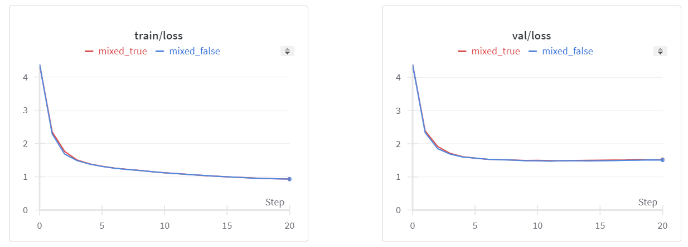

# Optimize GPT Training: Enabling Mixed Precision Training in JAX using ROCm on AMD GPUs

This blog builds on the nanoGPT model we discussed in [A Guide to Implementing and Training Generative Pre-trained Transformers (GPT) in JAX on AMD GPUs](https://rocm.blogs.amd.com/artificial-intelligence/nanoGPT-JAX/README.html). Here we will show you how to incorporate mixed precision training to the JAX-implemented nanoGPT model we discussed in our previous blog.

Generally speaking, mixed-precision training flexes the standard full-precision deep learning approach by mixing half-precision and full-precision floating point representations. The flexible hybrid approach allows mixed-precision training to achieve higher computational efficiency, saving time and memory, without sacrificing the overall performance of the model.

In this blog post we will show you, step-by-step, how to modify the JAX-implemented nanoGPT model we provided earlier using mixed-precision for faster and more efficient training, using ROCm on AMD GPUs.

**Note:** Because instructions for creating the JAX-implemented nanoGPT model were provided in [A Guide to Implementing and Training Generative Pre-trained Transformers (GPT) in JAX on AMD GPUs](https://rocm.blogs.amd.com/artificial-intelligence/nanoGPT-JAX/README.html), they will not be repeated here.

## Background

Standard deep learning approaches ensure numerical stability and accuracy during training by using 32-bit floating point precision (FP32) for neural network computations. However, observations show that operations such as convolution and matrix multiplication do not always require such high precision. Moreover, stochastic gradient descent (SGD), a cornerstone optimization algorithm in deep learning known for introducing gradient volatility, has demonstrated in past studies, and continues to show in practice, that models can effectively converge despite some level of gradient volatility.

Building upon these insights, mixed precision training has emerged as a strategy to enhance training efficiency. This technique strategically employs lower precision formats, such as 16-bit floating point (FP16), for computationally intensive tasks like matrix multiplications. FP16 computations are faster and consume less memory compared to FP32. This reduced memory usage with FP16 accelerates training throughput and enables the processing of larger batch sizes or larger models within GPU memory constraints.

To maintain numerical stability during mixed precision training, critical operations such as gradient accumulation and weight updates continue to use FP32 precision. This hybrid approach leverages the speed advantages of FP16 while mitigating potential precision issues, thereby optimizing the overall efficiency of model training in deep learning applications.

Because FP16 is lower precision than FP32, very small gradient values that are close to zero with FP32 precision will become 0 with FP16 precisions. This can cause the model training process to fail to converge. To ensure numerical stability, mixed precision training uses a numerical technique called gradient scaling: it scales up the loss so that the distribution of backpropagated gradients falls within the precision range of FP16. It then converts the scaled FP16 gradients to FP32, scales them back down, and updates the weights. This technique effectively addresses the underflow issue during the training process.

To summarize, the mixed precision training process involves the following steps:

1. Cast the model weights from FP32 to FP16 while keeping a copy of the weights in FP32.
2. Perform the forward pass in FP16, then cast the results to FP32 to calculate the loss.
3. Scale up the loss, cast it to FP16, perform backpropagation, and generate the gradients in FP16.
4. Cast the gradients back to FP32, scale them back down, and apply any additional gradient manipulation techniques such as clipping.
5. Update the FP32 model weights using the FP32 gradients.
6. Repeat steps 1 to 5 until the termination criteria are met.

Please note that scaling up the loss can sometimes cause gradient overflow. To handle such cases, we can use a dynamic scaling method. This method involves scaling down the scaling factor if overflow occurs and scaling up the scaling factor if no overflow occurs for a certain number of iterations. For more details on implementing this technique, you can refer to the JAX mixed precision training documentation [here](https://github.com/google-deepmind/jmp?tab=readme-ov-file#loss-scaling).

Scaling up the loss can sometimes cause gradient overflow. A dynamic scaling method is used in these cases. The dynamic scaling method involves decreasing the scaling factor if overflow occurs at any point, and increasing the scaling factor if no overflow occurs after a certain number of iterations. For more details on implementing this technique, see [mixed precision training in JAX](https://github.com/google-deepmind/jmp?tab=readme-ov-file#loss-scaling).

## Environment Setup

We run the implementation within a `jax-build` container with ROCm 6.1 on an AMD GPU. Alternately, you can use a [docker image](https://hub.docker.com/r/rocm/jax-build/tags) with the latest version of JAX, as newer versions can contain more optimizations. Although we used an AMD GPU for our blog, our code does not contain any AMD-specific modifications. This highlights the adaptability of ROCm to key deep learning frameworks like JAX.

1. **[Optional]** Check the [list of supported OSs and AMD hardware](https://rocm.docs.amd.com/projects/install-on-linux/en/latest/reference/system-requirements.html) to make sure your OS and hardware are supported.
2. Pull and run the docker container with the code below in a Linux shell:

   ```bash
   docker run -it --ipc=host --network=host --device=/dev/kfd --device=/dev/dri \
              --group-add video --cap-add=SYS_PTRACE --security-opt seccomp=unconfined \
              --name=nanogpt rocm/jax-build:rocm6.1.1-jax0.4.30-py3.10.14 /bin/bash
   ```

3. Install the Python packages using the following code:  

   ```bash
   python3 -m pip install --upgrade pip
   pip install optax==0.2.2 flax==0.8.2 transformers==4.38.2 tiktoken==0.6.0 datasets==2.17.1
   pip install git+https://github.com/deepmind/jmp
   pip install numpy==1.26.4
   ```

4. Clone the GitHub repository.  The `nanoGPT-JAX` folder contains code for training models with JAX in full precision. Detailed instructions on creating the JAX-implemented nanoGPT model are available in [A Guide to Implementing and Training Generative Pre-trained Transformers (GPT) in JAX on AMD GPUs](https://rocm.blogs.amd.com/artificial-intelligence/nanoGPT-JAX/README.html).

   ```bash
   git clone https://github.com/ROCm/rocm-blogs.git
   cd rocm-blogs/blogs/artificial-intelligence/nanoGPT-JAX
   ```

5. Replace the `model.py` and `train.py` scripts in the `nanoGPT-JAX` folder with the corresponding files from the [`src` folder on GitHub that corresponds with the current blog](https://github.com/ROCm/rocm-blogs/tree/release/blogs/artificial-intelligence/jax-mixed-precision). These files include adaptations for mixed precision training. You will also need to download the `utils.py` file and place it in the `nanoGPT-JAX` folder. To visualize all the changes we made to the original `model.py` and `train.py` files, we suggest using a code diff visualization tool such as [the online code diff tool from W3docs](https://www.w3docs.com/tools/code-diff/)) to compare the original and current versions.

Ensure that all subsequent operations are performed within the `nanoGPT-JAX` folder.

## Explanation of Code Changes

In this section, we will walk you through the main code changes that enable mixed precision training.

The following code block from the `jax-mixed-precision/src/train.py` file defines a policy for the type of precision to use for each type of operation. It instructs the training pipeline to convert the data format to achieve the benefits of mixed precision training.

```python
policy = Policy(
    param_dtype=jnp.float32,
    compute_dtype=jmp.half_dtype() if amp else jnp.float32,
    output_dtype=jmp.half_dtype() if amp else jnp.float32,
    reduce_ops_dtype=jnp.float32,
)
```

The next code block casts FP32 parameters to FP16, then generates the loss and gradients (with scaling) in FP16 using the `gradient_fn` function. Gradients are then cast to FP32 and unscaled. The original FP32 parameters are updated if all gradient values are finite. If they are not finite, the scale is adjusted, and the next iteration begins.

```python
# cast params to fp16
params = policy.cast_to_compute(state.params)
# get scaled loss and grads in fp16
loss, grads = gradient_fn(params, x, targets=y, rng=key0, train=True, loss_scale=loss_scale, policy=policy)
# unscale loss
loss = loss_scale.unscale(loss)
# cast grads to fp32
grads = policy.cast_to_param(grads)
# unscale grads
grads = loss_scale.unscale(grads)

if skip_infinite:
    # check if all gradient values are finite; if a gradient value overflows in 
    # fp16 (i.e., inf), it will also be inf after casting to fp32
    grads_finite = jmp.all_finite(grads)
    # Adjust our loss scale depending on whether gradients were finite. The
    # loss scale will be periodically increased if gradients remain finite and
    # will be decreased if not.
    loss_scale = loss_scale.adjust(grads_finite)
    # Only apply our optimizer if grads are finite; if any element of any
    # gradient is non-finite, the whole update is discarded.
    state = jmp.select_tree(
        grads_finite, state.apply_gradients(grads=grads), state
    )
else:
    # With static or no loss scaling, just apply our optimizer.
    state = state.apply_gradients(grads=grads)
```

The following code block from the `jax-mixed-precision/src/model.py` file calculates the loss in FP32, scales it up, and then casts it back to low precision (FP16) for backpropagation. This is how `gradient_fn` generates loss and gradients in FP16 with scaling:

```python
# cast logits to fp32 to get loss in fp32
loss = optax.softmax_cross_entropy_with_integer_labels(policy.cast_to_reduce_ops(logits), targets).mean()
if not train:
    return logits, loss
# scale up loss
loss = loss_scale.scale(loss)
# cast scaled-up loss to fp16
loss = policy.cast_to_output(loss)
```

These code changes enable the mixed precision training of nanoGPT in JAX, optimizing the use of GPU resources and speeding up the training process.

## Pre-training a nanoGPT Model

In this section, we will demonstrate how to pre-train a nanoGPT model using both mixed precision and full precision. For more details on the JAX nanoGPT model, see [A Guide to Implementing and Training Generative Pre-trained Transformers (GPT) in JAX on AMD GPUs](https://rocm.blogs.amd.com/artificial-intelligence/nanoGPT-JAX/README.html).

To initiate training in mixed precision, run the following command:

```bash
# Preprocess the character level Shakespeare dataset
python data/shakespeare_char/prepare.py
# Start the pre-training
# The provided configuration file sets up the training of a miniature character-level GPT model using JAX on an AMD GPU. It specifies model architecture parameters, training settings, evaluation intervals, logging preferences, data handling, and checkpointing details, ensuring a comprehensive yet flexible setup for experimenting with and debugging the model
python train.py config/train_shakespeare_char.py --amp=True
```

During training, the output will be similar to the following partial output:

```text
...
Overriding: amp = True
found vocab_size = 65 (from data/shakespeare_char/meta.pkl)
Initializing a new model from scratch
Data is on device: {rocm(id=0)}
Evaluating at iter_num == 0...
step 0: train loss 4.3772, val loss 4.3917; best val loss to now: 4.3917
iter 0: loss 4.4146, time 44309.10ms
iter 10: loss 3.4914, time 51.32ms
iter 20: loss 3.2811, time 52.18ms
iter 30: loss 3.0276, time 56.57ms
iter 40: loss 2.8481, time 55.09ms
iter 50: loss 2.6980, time 56.30ms
iter 60: loss 2.6223, time 53.13ms
iter 70: loss 2.6218, time 57.47ms
iter 80: loss 2.5859, time 51.95ms
iter 90: loss 2.5762, time 57.52ms
iter 100: loss 2.5696, time 55.93ms
...
```

To perform training in full precision, use the command:

```bash
python train.py config/train_shakespeare_char.py --amp=False
```

The output for full precision training will be similar to this partial output:

```text
...
Overriding: amp = False
found vocab_size = 65 (from data/shakespeare_char/meta.pkl)
Initializing a new model from scratch
Data is on device: {rocm(id=0)}
Evaluating at iter_num == 0...
step 0: train loss 4.3818, val loss 4.3924; best val loss to now: 4.3924
iter 0: loss 4.4176, time 48566.02ms
iter 10: loss 3.4745, time 82.93ms
iter 20: loss 3.3307, time 83.27ms
iter 30: loss 3.0622, time 85.82ms
iter 40: loss 2.8195, time 82.55ms
iter 50: loss 2.6754, time 83.40ms
iter 60: loss 2.6421, time 83.90ms
iter 70: loss 2.6119, time 83.47ms
iter 80: loss 2.5826, time 84.24ms
iter 90: loss 2.5601, time 83.56ms
...
```

Based on the output, it is evident that mixed precision training achieves approximately 35% faster training speed per iteration (around 54 milliseconds (ms)) compared to full precision training (about 83ms) per iteration. This excludes the initial iteration, which involves longer compilation time. These timings are illustrative and may vary based on factors such as python package versions, GPU type, batch size, optimizer settings, and system configuration.

Furthermore, observing the loss curves, both mixed precision and full precision training exhibit similar performance on both the training and validation datasets. This shows that mixed precision training effectively accelerates training while preserving model performance.



As we conclude this blog, we encourage you to further explore mixed precision training with alternative low precision formats such as BF16 and FP8, aiming to compare their respective performance benefits. For those further interested in mixed precision, check out our other ROCm blogs on the topic, such as [Automatic Mixed Precision](https://rocm.blogs.amd.com/artificial-intelligence/automatic-mixed-precision/README.html) and [RoBERTa with AMP](https://rocm.blogs.amd.com/artificial-intelligence/roberta_amp/README.html).

## Summary

In this blog we followed-up on our previous discussion of the nanoGPT model (see [A Guide to Implementing and Training Generative Pre-trained Transformers (GPT) in JAX on AMD GPUs](https://rocm.blogs.amd.com/artificial-intelligence/nanoGPT-JAX/README.html)), providing a how-to guide on integrating mixed precision training to achieve faster and less memory consuming realization of the JAX-implemented nanoGPT model, using ROCm on AMD GPUs.

## Acknowledgements

We would like to express our gratitude to Azzeddine Chenine for his [flash-nanoGPT repository](https://github.com/azzeddineCH/flash-nanoGPT/tree/main), which served as a valuable reference for our work.

## Disclaimers

Third-party content is licensed to you directly by the third party that owns the content and is not licensed to you by AMD. ALL LINKED THIRD-PARTY CONTENT IS PROVIDED “AS IS” WITHOUT A WARRANTY OF ANY KIND. USE OF SUCH THIRD-PARTY CONTENT IS DONE AT YOUR SOLE DISCRETION AND UNDER NO CIRCUMSTANCES WILL AMD BE LIABLE TO YOU FOR ANY THIRD-PARTY CONTENT. YOU ASSUME ALL RISK AND ARE SOLELY RESPONSIBLE FOR ANY DAMAGES THAT MAY ARISE FROM YOUR USE OF THIRD-PARTY CONTENT.
