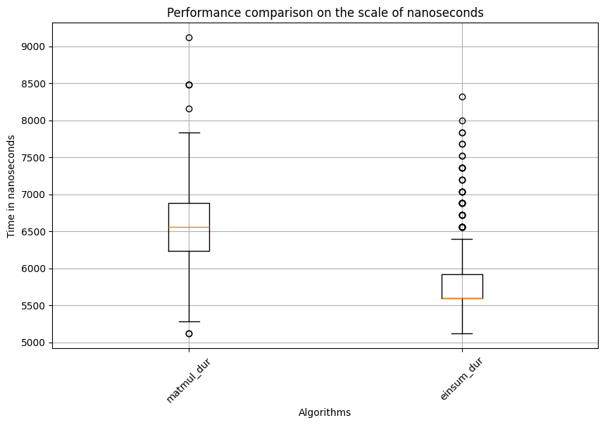
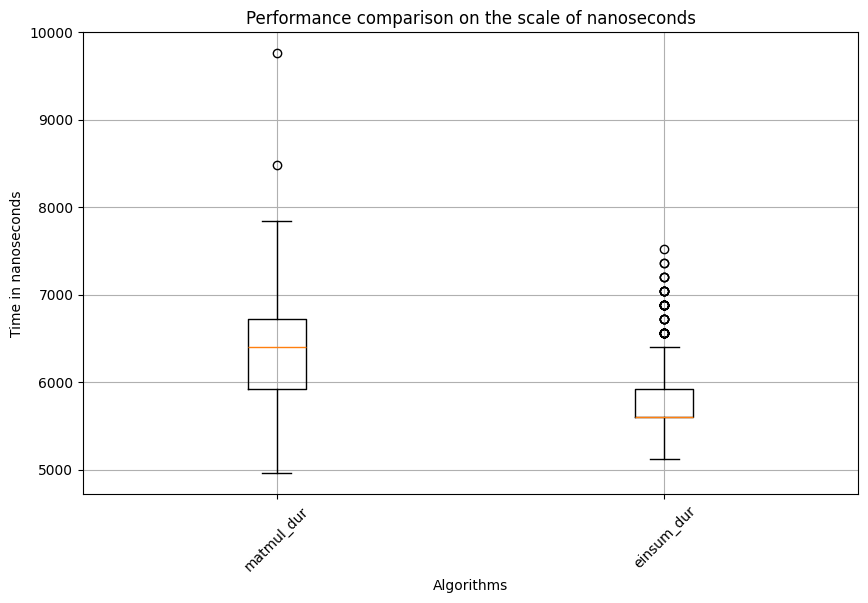
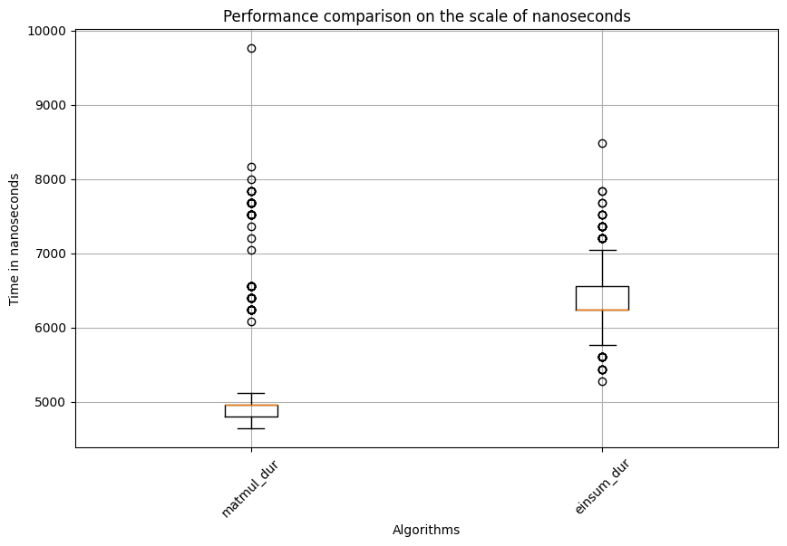
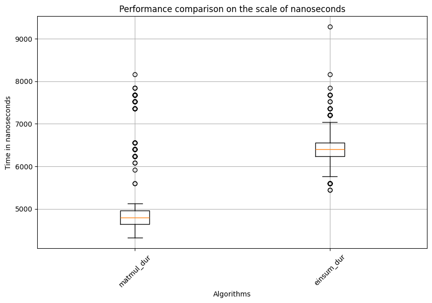

# Using statistical methods to reliably compare algorithm performance in large generative AI models with JAX Profiler on AMD GPUs

## Abstract

This blog provides a comprehensive guide on measuring and comparing the performance of various algorithms in a JAX-implemented generative AI model. Leveraging the JAX Profiler and statistical analysis, this blog demonstrates how to reliably evaluate key steps and compare algorithm performance on AMD GPUs.

## Introduction

In the dynamic realm of GPU-accelerated computing, the pursuit of optimal performance and efficiency requires effective profiling techniques. Profiling offers a comprehensive insight into the behavior and performance characteristics of GPU-based applications, achieved through meticulous examination of metrics such as execution time, memory utilization, and kernel occupancy. This is particularly vital for large-scale generative AI models, where performance optimization can substantially enhance end-user experiences and revenue streams. By leveraging profiling techniques, developers can pinpoint inefficiencies, gain valuable insights into runtime behavior, and ultimately prioritize strategic optimization efforts, leading to significant performance enhancements.

[JAX](https://jax.readthedocs.io/en/latest/quickstart.html), an open-source numerical computing library from Google (although not an official Google product), is garnering significant attention in the GenAI domain for its capability to harness hardware accelerators and automatic differentiation. Originally intended for high-performance machine learning research, JAX's functional programming approach and support for GPUs and TPUs make it a preferred choice for building and deploying large language models (LLMs) and other cutting-edge GenAI applications. Notably, companies like [X.AI](https://x.ai/) leverage JAX to develop open-source models such as Grok-1, further propelling the library's popularity in the GenAI field. Driven by its performance, flexibility, and suitability for advanced AI model development and deployment, JAX continues to soar in prominence.

The ROCm blog series has previously explored [various profilers](https://rocm.blogs.amd.com/search.html?q=profiler), such as [`rocprof`](https://rocm.blogs.amd.com/software-tools-optimization/roc-profiling/README.html), which can be used to profile models on AMD GPUs, along with framework-specific profilers for TensorFlow and PyTorch. While the [JAX's official page](https://jax.readthedocs.io/en/latest/profiling.html) covers basic usage of its profiler, this tutorial delves into more advanced techniques. For example, it explains how to determine if one algorithm is statistically significantly better than another, considering the substantial random noise when evaluating algorithms. This blog demonstrates how to reliably measure and compare the performance of different algorithms executing the same step within a large language model through statistical analysis and hypothesis testing. Specifically, it compares the performance of `einsum` versus `matmul` for implementing two matrix multiplication steps in the `CausalSelfAttention` component of a JAX-based Generative Pre-trained Transformer (GPT) model. (Refer to [the blog on implementing a GPT model in JAX](https://rocm.blogs.amd.com/artificial-intelligence/nanoGPT-JAX/README.html)). To learn more about `einsum`, follow [this blog](https://rockt.github.io/2018/04/30/einsum).

## Implementation

To implement this code example, begin by setting up the ROCm environment, along with the necessary packages and Python scripts. Notably, this code example is platform-agnostic, meaning it's compatible with AMD GPUs as well as other GPUs or TPUs, provided the accelerated computing platform and Python packages are correctly configured.

### Environment setup

Follow the steps below to set up the running environment for this blog:

1. Pull and run the docker container with the code below in a Linux shell:

   ```bash
   docker run -it --ipc=host --network=host --device=/dev/kfd --device=/dev/dri \
              --group-add video --cap-add=SYS_PTRACE --security-opt seccomp=unconfined \
              --name=nanogpt rocm/pytorch:rocm6.1_ubuntu22.04_py3.10_pytorch_2.1.2 /bin/bash
   ```

2. Run the following code within the docker container to install the necessary Python packages and configure the environment variable for XLA:

   ```bash
   python3 -m pip install --upgrade pip
   pip install optax==0.2.2 flax==0.8.2 transformers==4.38.2 tiktoken==0.6.0 datasets==2.17.1 perfetto==0.7.0 matplotlib==3.8.4 scipy==1.13.0
   python3 -m pip install https://github.com/ROCmSoftwarePlatform/jax/releases/download/jaxlib-v0.4.26/jaxlib-0.4.26+rocm610-cp310-cp310-manylinux2014_x86_64.whl
   python3 -m pip install https://github.com/ROCmSoftwarePlatform/jax/archive/refs/tags/jaxlib-v0.4.26.tar.gz
   pip install numpy==1.22.0
   export XLA_FLAGS="--xla_gpu_autotune_level=0"
   ```

3. Download the files used for this blog from the `ROCm/rocm-blogs` GitHub repository with the command below.

   ```bash
   git clone https://github.com/ROCm/rocm-blogs.git
   cd rocm-blogs/blogs/artificial-intelligence/nanoGPT-JAX
   ```

4. Swap out the `model.py` and `sample.py` scripts in the `nanoGPT-JAX` folder with the corresponding files from the [`src` folder of the current blog on GitHub](https://github.com/ROCm/rocm-blogs/tree/release/blogs/artificial-intelligence/jax-profiler).

Specifically, note the modifications made to the `model.py` file in the code block below. Two new lines of code assign unique names to annotate the two matrix multiplication steps using `jax.named_scope`, a context manager that incorporates a user-specified name into the JAX name stack. The program subsequently extracts profile data pertinent to these steps using the specified name. This technique is invaluable for swiftly mapping logged operations of the same type in the profiling output to each step in an application or model because the default logged names might be confusing or very similar among operations of the same type. The code block below encloses two different matrix multiplication steps and assigns them the distinct scope names `attn_q_k` and `attn_att_v`.

```diff
class CausalSelfAttention(nn.Module):
    config: GPTConfig

    @nn.compact
    def __call__(self, x, train=False, rng1=None, rng2=None):
        assert self.config.n_embd % self.config.n_head == 0
        B, T, C = x.shape # batch size, sequence length, embedding dimensionality (n_embd)
        # calculate query, key, values for all heads in batch and move head forward to be the batch dim
        q, k, v  = jnp.split(nn.Dense(self.config.n_embd * 3, name="c_attn")(x), 3, axis=-1)
        k = k.reshape(B, T, self.config.n_head, C // self.config.n_head).swapaxes(1, 2) # (B, nh, T, hs)
        q = q.reshape(B, T, self.config.n_head, C // self.config.n_head).swapaxes(1, 2) # (B, nh, T, hs)
        v = v.reshape(B, T, self.config.n_head, C // self.config.n_head).swapaxes(1, 2) # (B, nh, T, hs)
+       with jax.named_scope("attn_q_k"):
+           att = (jnp.einsum('bhts,bhqs->bhtq', q, k, optimize=True) if self.config.use_einsum else jnp.matmul(q, k.swapaxes(-2, -1))) * (1.0 / jnp.sqrt(k.shape[-1]))
-       att = (jnp.einsum('bhts,bhqs->bhtq', q, k, optimize=True) if self.config.use_einsum else jnp.matmul(q, k.swapaxes(-2, -1))) * (1.0 / jnp.sqrt(k.shape[-1]))
        mask = jnp.tril(jnp.ones((T, T))).reshape((1, 1, T, T))
        att = jnp.where(mask == 0, float('-inf'), att)
        att = nn.softmax(att, axis=-1)
        att = nn.Dropout(self.config.dropout, name='attn_dropout', deterministic=not train)(att, rng=rng1)
+       with jax.named_scope("attn_att_v"):
+           y = jnp.einsum('bhts,bhsq->bhtq', att, v, optimize=True) if self.config.use_einsum else jnp.matmul(att, v)   # (B, nh, T, T) x (B, nh, T, hs) -> (B, nh, T, hs)
-       y = jnp.einsum('bhts,bhsq->bhtq', att, v, optimize=True) if self.config.use_einsum else jnp.matmul(att, v)   # (B, nh, T, T) x (B, nh, T, hs) -> (B, nh, T, hs)
        y = y.swapaxes(1, 2).reshape(B, T, C)  # re-assemble all head outputs side by side
        # output projection
        y = nn.Dense(self.config.n_embd, name='c_proj')(y)
        y = nn.Dropout(self.config.dropout, name='resid_dropout', deterministic=not train)(y, rng=rng2)

        return y

```

The primary modifications applied to the original `sample.py` file involve wrapping the function responsible for running inference on the JAX-based GPT model with `jax.profiler.start_trace()` and `jax.profiler.stop_trace()`. This records the trace of each generated sample. Alternatively, you can use the `jax.profiler.trace()` context manager to capture the trace, as detailed in [this guide](https://jax.readthedocs.io/en/latest/profiling.html#programmatic-capture). Each profiling output for the samples is stored in separate folders, making it easier to analyze individual traces.

```diff
for i in range(num_samples): 
+   jax.profiler.start_trace(profile_dir+f'_{i}')
    output = generate([jnp.array(start_ids)], seed+i)
+   jax.profiler.stop_trace()
    print(f'\nGenerated output __{i}__: \n__________________________________\n{decode(output[0].tolist())}\n__________________________________')
```

### Profiling the GPT Model with different matrix multiplication algorithms in self-attention

To demonstrate profiling, this example compares `einsum` and `matmul`, two different built-in methods for performing matrix multiplication in the attention calculation step. The `use_einsum` flag controls the choice between using `einsum` or `matmul` for matrix multiplication. Run the commands below to collect profiling outputs for these two different algorithms:

```bash
# Generate profiling output using matmul
python sample.py --init_from='gpt2' --max_new_tokens=50 --start="The weather today is" --num_samples=10 --profile_dir="trace_file_matmul"

# Generate profiling output using einsum
python sample.py --init_from='gpt2' --max_new_tokens=50 --start="The weather today is" --num_samples=10 --profile_dir="trace_file_einsum" --override_args="{'use_einsum':True}"
```

Each command calls the `sample.py` file to generate 10 samples, with each sample containing a maximum of 50 newly generated tokens. This generates 20 folders (10 folders for each algorithm, with one folder per generated sample) containing the profiling outputs. In each folder, the profiling output is stored in a compressed `.gz` file. Run the following command in the docker terminal to unzip the output:

```bash
for i in {0..9}; do
    gzip -d trace_file_einsum_$i/plugins/profile/202*/*.json.gz
    gzip -d trace_file_matmul_$i/plugins/profile/202*/*.json.gz
done
```

### Statistical analysis and performance testing of the two algorithms

Now, you are ready to read in the profiling data and perform statistical analysis. For each iteration (corresponding to one generated sample per algorithm), the program compares the distribution of matrix multiplication execution times (in nanoseconds) between the two algorithms. Use the box plots to visually examine the differences. The [Wilcoxon rank-sum test](https://en.wikipedia.org/wiki/Mann%E2%80%93Whitney_U_test) determines if the location parameters (for example, mean and median) are significantly different. Shorter execution times indicate better performance.

The code block below imports the packages needed for the analysis and defines the function to plot the box plots.

```python
import glob
from perfetto.trace_processor import TraceProcessor
from scipy.stats import ranksums
import matplotlib.pyplot as plt


def plot_boxplot(df1, df2, columns1, columns2=None, df1_lab='matmul', df2_lab='einsum'):
    """
    Plot boxplots for specified columns in two DataFrames. This function will 
    be used to compare the distribution of running time for the two algorithms
    we profiled.

    Args:
    df1 (pandas.DataFrame): First DataFrame.
    df2 (pandas.DataFrame): Second DataFrame.
    columns1 (list): List of column names from the first DataFrame to plot.
    columns2 (list): List of column names from the second DataFrame to plot.
    df1_lab (string): Label for df1 in the plot.
    df2_lab (string): Label for df2 in the plot.
    """
    if columns2 is None:
        columns2 = columns1
    # Combine data from both DataFrames
    data = [df1[col] for col in columns1] + [df2[col] for col in columns2]
    
    # Create labels for boxplots
    labels = [df1_lab + '_' + col for col in columns1] + [df2_lab + '_' + col for col in columns2]
    
    # Plot boxplots
    plt.figure(figsize=(10, 6))
    plt.boxplot(data, labels=labels)
    plt.xlabel('Algorithms')
    plt.ylabel('Time in nanoseconds')
    plt.title('Performance comparison on the scale of nanoseconds')
    plt.xticks(rotation=45)
    plt.grid(True)
    plt.show()

```

The program then compares the execution time between the two algorithms for each sample generation iteration. It uses `where display_value like "%attn_q_k%"` in the SQL query to filter the operations enclosed in the first `named_scope`. You can modify the SQL query to explore different columns and compute metrics of interest.

The program omits the first iteration because it includes the compile time, which would skew the comparison. It prints the mean and standard deviation of the execution times for each algorithm, as well as the dataframe shape, to ensure that the profiler and SQL query captured all events. For example, with 12 layers in the model and up to 50 new tokens per sample (resulting in up to 50 function calls to the model), there should be up to `12*50=600` matrix multiplication events captured.

Lastly, the program prints the test statistic and p-value for the Wilcoxon rank-sum test, which assesses whether the location parameters (for example, means and medians) of the execution time distributions for the two algorithms are significantly different. Although the t-test is widely used to test if the means of two populations are equal, this example uses the rank-based non-parametric test because of the many outliers in the samples. These outliers can significantly decrease the reliability of the t-test.

```python
for i in range(1, 10):
    # Process the profiling data for matmul
    tp = TraceProcessor(trace=glob.glob(f'trace_file_matmul_{i}/plugins/profile/202*/*.json'))
    # SQL query to get the operations enclosed by the named_scope
    query_text='''INCLUDE PERFETTO MODULE slices.slices;
    WITH arg_sets_0 AS (
        SELECT DISTINCT arg_set_id, display_value
        FROM args
        WHERE key = 'args.name'
    )
    SELECT name, display_value, dur
        FROM _slice_with_thread_and_process_info
        INNER JOIN arg_sets_0 ON arg_sets_0.arg_set_id = _slice_with_thread_and_process_info.arg_set_id
    where display_value like "%attn_q_k%"
    '''
    # Query the profiling data and convert to dataframe
    qr_matmul = tp.query(query_text).as_pandas_dataframe()
    # Process the profiling data for einsum
    tp = TraceProcessor(trace=glob.glob(f'trace_file_einsum_{i}/plugins/profile/202*/*.json'))
    # Query the profiling data and convert to dataframe
    qr_einsum = tp.query(query_text).as_pandas_dataframe()
    print(f'###########i={i}###########')
    print('#'*30)
    # Print out the mean, standard dev. and shape for each algorithm
    print(f'Matmul: Mean={qr_matmul.dur.mean()}, std. dev.={qr_matmul.dur.std()}, shape of df:{qr_matmul.shape}')
    print(f'Einsum: Mean={qr_einsum.dur.mean()}, std. dev.={qr_einsum.dur.std()}, shape of df:{qr_einsum.shape}')
    plot_boxplot(qr_matmul, qr_einsum, ['dur'])
    stat, p = ranksums(qr_matmul['dur'], qr_einsum['dur'])
    print(f'Test statistic={stat}, p_val={p}')
```

Below is the truncated output of two iterations, with consistent patterns observed across all nine iterations.

```text
###########i=1###########
##############################
Matmul: Mean=6461.875, std. dev.=504.8818364954699, shape of df:(600, 3)
Einsum: Mean=5813.346666666666, std. dev.=455.80420754410954, shape of df:(600, 3)
Test statistic=20.22982266255362, p_val=5.349499343834845e-91
```



```text
###########i=2###########
##############################
Matmul: Mean=6293.076666666667, std. dev.=514.1309448993132, shape of df:(600, 3)
Einsum: Mean=5797.615, std. dev.=397.86885546863283, shape of df:(600, 3)
Test statistic=16.932946075063718, p_val=2.5717953759559878e-64
```



Based on the results, it's evident that `matmul` takes significantly longer than `einsum` for calculating the matrix multiplication between the `query` and `key` matrices. But how does it perform for the matrix multiplication between the `attention` and `value` matrices? The results are shown in the code block below:

```python
for i in range(1, 10):
    # Process the profiling data for matmul
    tp = TraceProcessor(trace=glob.glob(f'trace_file_matmul_{i}/plugins/profile/202*/*.json'))
    # SQL query to get the operations enclosed by the named_scope
    query_text='''INCLUDE PERFETTO MODULE slices.slices;
    WITH arg_sets_0 AS (
        SELECT DISTINCT arg_set_id, display_value
        FROM args
        WHERE key = 'args.name'
    )
    SELECT name, display_value,dur
        FROM _slice_with_thread_and_process_info
        INNER JOIN arg_sets_0 ON arg_sets_0.arg_set_id = _slice_with_thread_and_process_info.arg_set_id
    where display_value like "%attn_att_v%"
    '''
    # Query the profiling data and convert to dataframe
    qr_matmul = tp.query(query_text).as_pandas_dataframe()
    # Process the profiling data for einsum
    tp = TraceProcessor(trace=glob.glob(f'trace_file_einsum_{i}/plugins/profile/202*/*.json'))
    # Query the profiling data and convert to dataframe
    qr_einsum = tp.query(query_text).as_pandas_dataframe()
    print(f'###########i={i}###########')
    print('#'*30)
    # Print out the mean, standard dev. and shape for each algorithm
    print(f'Matmul: Mean={qr_matmul.dur.mean()}, std. dev.={qr_matmul.dur.std()}, shape of df:{qr_matmul.shape}')
    print(f'Einsum: Mean={qr_einsum.dur.mean()}, std. dev.={qr_einsum.dur.std()}, shape of df:{qr_einsum.shape}')
    plot_boxplot(qr_matmul, qr_einsum, ['dur'])
    stat, p = ranksums(qr_matmul['dur'], qr_einsum['dur'])
    print(f'Test statistic={stat}, p_val={p}')
```

Below is the truncated output for two iterations, with consistent patterns observed across all nine iterations.

```text
###########i=1###########
##############################
Matmul: Mean=5204.543333333333, std. dev.=882.6151202759834, shape of df:(600, 3)
Einsum: Mean=6360.556666666666, std. dev.=373.461514250933, shape of df:(600, 3)
Test statistic=-21.986424230986046, p_val=3.884153635651101e-107
```



```text
###########i=2###########
##############################
Matmul: Mean=5145.61, std. dev.=876.5247080600369, shape of df:(600, 3)
Einsum: Mean=6396.01, std. dev.=381.7892458942073, shape of df:(600, 3)
Test statistic=-22.450480914300588, p_val=1.2659476932444539e-111
```



This time, surprisingly, `matmul` is significantly faster than `einsum`. This indicates that one matrix multiplication algorithm might not always outperform the other. Factors like matrix size, shape, and additional operations such as matrix transposition might all affect the speed. This highlights the importance of using profiling techniques to select the best algorithm for the key steps of an application or model. Additionally, if you examine the range of data points for the same algorithm in the boxplot, you might notice many outliers. This is why statistical analysis and appropriate methods are essential for drawing valid conclusions. This example also used a rank-based test instead of the classical t-test, as the latter is often sensitive to outliers.

## Conclusion

Robust statistical analysis and testing should be applied when profiling application or model performance to ensure that the impact of random noise does not compromise the validity of our conclusions.

## Disclaimers

Third-party content is licensed to you directly by the third party that owns the content and is not licensed to you by AMD. ALL LINKED THIRD-PARTY CONTENT IS PROVIDED “AS IS” WITHOUT A WARRANTY OF ANY KIND. USE OF SUCH THIRD-PARTY CONTENT IS DONE AT YOUR SOLE DISCRETION AND UNDER NO CIRCUMSTANCES WILL AMD BE LIABLE TO YOU FOR ANY THIRD-PARTY CONTENT. YOU ASSUME ALL RISK AND ARE SOLELY RESPONSIBLE FOR ANY DAMAGES THAT MAY ARISE FROM YOUR USE OF THIRD-PARTY CONTENT.
