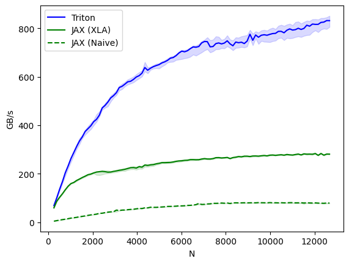

# Supercharging JAX with Triton Kernels on AMD GPUs

Ready to supercharge your deep learning applications on AMD GPUs? In this blog, we'll show you how to develop a custom fused dropout activation kernel for matrices in Triton, seamlessly call it from JAX, and benchmark its performance with ROCm. This powerful combination will take your model's performance to the next level.

When profiling a large language model (LLM) on a GPU, you'll find that the majority of the time is consumed by operations such as dropout, softmax, and masking, rather than by the computationally intensive matrix multiplications. The explanation for this surprising result is that LLMs are bottlenecked not by compute speed, but by memory bandwidth. [Data Movement is All You Need](https://arxiv.org/pdf/2007.00072) showed that compute-bound operations, such as matrix multiplications, make up over 99.8% of the total FLOPs but only take up 61% of the total runtime. Surprisingly, memory-bound operations like statistical normalization and element-wise functions such as dropout and masking consume the remaining 40% of an LLM's runtime. Notably, these memory-bound operations only account for 0.02% of the total FLOPs.

To overcome this memory bottleneck, optimizing memory access is crucial. One effective strategy is to employ fused kernels, which reduce the number of memory reads and writes by combining multiple operations into a single kernel. This approach enables multiple tasks to run in a single pass over the data, eliminating the need for redundant memory accesses. For instance, instead of reading data into static RAM (SRAM), applying the activation function, writing it back to high bandwidth memory (HBM), reading it back to SRAM, applying dropout, and writing it back to HBM again, you can fuse these operations into a single kernel that performs both tasks simultaneously in SRAM. This minimizes memory traffic and accelerates overall performance.

In this context, [JAX](https://jax.readthedocs.io) emerges as a powerful Python library for developing and training large-scale generative AI models because it supports automatic kernel fusion, differentiation and vectorization, just-in-time (JIT) compilation, and parallelization. Under the hood, JAX utilizes XLA (Accelerated Linear Algebra) to achieve many of these optimizations. While JAX's automatic kernel fusion is a powerful feature for optimizing memory access and performance, it might not always be ideal for certain use cases.

In certain situations, custom-developed kernels are necessary to overcome the integration lag associated with new AI advancements like Flash Attention, as well as to meet program-specific design requirements such as block sparsity and enhance performance efficiency, areas where JAX may fall short. Triton, a programming language and compiler created by OpenAI, simplifies GPU programming by allowing developers to write custom kernels that optimize memory access patterns and significantly improve performance. Fortunately, JAX supports the development of these custom kernels through its integration with Triton via the [jax-triton](https://jax-ml.github.io/jax-triton/) Python library. This integration allows you to easily incorporate Triton kernels into JAX with minimal modifications. By leveraging Triton kernels within JAX, you can utilize the library's powerful acceleration features while effectively addressing the unique requirements of your applications. You can find all the files/scripts mentioned in this blog in the [GitHub repo](https://github.com/ROCm/rocm-blogs/tree/release/blogs/artificial-intelligence/jax-triton).

## Prerequisites

To run this blog, you need the following:

- **AMD GPU**: see the [list of compatible GPUs](https://rocm.docs.amd.com/projects/install-on-linux/en/latest/reference/system-requirements.html#supported-gpus).
- **Linux**: see the [supported Linux distributions](https://rocm.docs.amd.com/projects/install-on-linux/en/latest/reference/system-requirements.html#supported-operating-systems).
- **ROCm 5.7+**: see the [installation instructions](https://rocm.docs.amd.com/projects/install-on-linux/en/latest/tutorial/quick-start.html).

## Getting Started

For this exercise, use the blog's JAX docker container because it's not trivial to install and build JAX with Triton and its dependencies from source. If you need to install from source, take a look at the official [JAX docs](https://jax.readthedocs.io/en/latest/developer.html#additional-notes-for-building-a-rocm-jaxlib-for-amd-gpus). To get started, run the JAX-Triton ROCm docker container.

```bash
docker run -it --cap-add=SYS_PTRACE --security-opt seccomp=unconfined --device=/dev/kfd --device=/dev/dri --group-add video --ipc=host --shm-size 8G rocm/jax-build:jaxlib-0.4.24-rocm600-py3.10.0.rocm-jax-triton
```

Now import the necessary libraries:

``` python
import jax
import pandas
import triton
import triton.language as tl
import jax_triton as jt
import jax.numpy as jnp
```

Before you begin developing the fused dropout activation kernel, take a step back and review the fundamentals of activation functions and dropout so you can better understand the process.

## Fused Dropout Activation

Activation functions are a key component of neural networks that are used to introduce non-linearity into the network. The purpose of an activation function is to transform the linear combination of input features into a non-linear output. This allows the network to learn and model complex, non-linear relationships between the input and output data.

A Leaky Rectified Linear Unit (ReLU) is a variant of the popular ReLU activation function, which just outputs the input directly if it is positive; otherwise, it outputs zero. The Leaky ReLU, on the other hand, has a small, non-zero gradient for negative input values. This helps alleviate the "dying ReLU" problem that occurs when a large number of neurons in a layer of a neural network have a ReLU activation function and the input values are mostly negative. In this case, the output of the ReLU activation function is zero, which can slow down or even stop the learning process.

The Leaky ReLU activation function is defined as:

$$f(x) = \begin{cases} x, & \text{if } x > 0 \\ ax, & \text{if } x \leq 0 \end{cases}$$

where *x* is the input to the activation function and *a* is a small, positive constant referred to as the leakiness or slope of the Leaky ReLU. A common value for *a* is 0.01.

Dropout is a widely used regularization technique to prevent overfitting in LLMs. Overfitting occurs when a model learns the training data so well it cannot generalize to new data, leading to poor performance. Dropout works by randomly dropping out, or "turning off," a fraction of the neurons in a layer during training. This forces the model to become less reliant on any one neuron or set of neurons and learn more robust features that are less prone to overfitting. This typically leads to better generalized performance on new data.

In practice, you can implement dropout by multiplying the activations of a layer by a dropout mask, which is a binary mask with the same shape as the activations. The mask contains zeros and ones, where each element has a probability of being zero that is equal to the dropout rate. For example, if the dropout rate is 0.2, then each element of the mask has an 80% chance of being set to one and a 20% chance of being set to zero. When the mask is applied to the activations, any element that corresponds to a zero in the mask is set to zero. To maintain the same expected value of the activations, the remaining elements (those corresponding to the ones in the mask) need to be scaled up by a factor of *1 / (1 - rate)* to compensate for the dropped-out elements. This ensures that the model's output has the same expected value during training as it would without dropout.

You can now develop a function in JAX that applies Leaky ReLU followed by dropout.

```python
def leaky_relu_dropout(x, rate=0.5):
    """
    Applies Leaky ReLU activation followed by Dropout.

    Parameters
    ----------
    x : jax.numpy.ndarray
        The input array to which the dropout mask will be applied.
    rate : float, optional
        The dropout rate. Default is 0.5.

    Returns
    -------
    y: jax.numpy.ndarray
        The input array x after applying Leaky ReLU and dropout
    """

    # Apply Leaky ReLU
    x = jnp.where(x >= 0, x, 0.01 * x)

    # Apply Dropout
    keep_prob = 1.0 - rate
    rand_tensor = jax.random.uniform(jax.random.PRNGKey(0), x.shape)
    keep_mask = jnp.where(rand_tensor > rate, 1.0, 0.0)
    y = x * keep_mask / keep_prob
    
    return y
```

```python
key = jax.random.PRNGKey(0)
x = jax.random.uniform(key, (1823, 781))
%timeit leaky_relu_dropout(x).block_until_ready()
```

```text
1.89 ms ± 151 μs per loop (mean ± std. dev. of 7 runs, 1 loop each)
```

Now try JIT compilation on your Leaky ReLU Dropout function to see if XLA can automatically fuse some of these operations for improved performance. JIT compilation compiles the Python code into high-level optimized (HLO) code which the XLA compiler takes as input. The XLA compiler then fuses operations in the function together.

```python
jit_leaky_relu_dropout = jax.jit(leaky_relu_dropout)
%timeit jit_leaky_relu_dropout(x).block_until_ready()
```

```text
145 μs ± 697 ns per loop (mean ± std. dev. of 7 runs, 10,000 loops each)
```

You can see XLA significantly improved the latency of your Leaky ReLU Dropout function by more than an order of magnitude.

## Triton Dropout Kernel

You can write Triton kernels in JAX just like you do in PyTorch, but you call them slightly differently from the helper function, with JAX arrays instead of Torch tensors. To define a Triton kernel, you must still place a *@triton.jit* decorator before the function definition just like in PyTorch. To see a working example in PyTorch, checkout the blog on [Developing a Triton GELU kernel](https://rocm.blogs.amd.com/artificial-intelligence/triton/README.html).

The `leaky_dropout_kernel` implementation below parallelizes across the elements of the matrix. It processes each element of the matrix using a unique thread in the block and uses the offsets array to compute the global index of the element being processed by each thread. The `row_idx` and `col_idx` variables map the global index to a specific row and column of the matrix. The function ensures it doesn't access elements outside the matrix bounds by filtering out elements where `row_idx` or `col_idx` exceed the matrix dimensions. It applies dropout using the `x_keep` mask and then writes the output back to DRAM after the computation is finished.

``` python
@triton.jit
def leaky_dropout_kernel(
    x_ptr,
    output_ptr,
    rows: tl.constexpr,
    cols: tl.constexpr,
    p: tl.constexpr,
    seed: tl.constexpr,
    block_size: tl.constexpr,
):
    """
    Triton kernel that applies leaky ReLU and dropout to the input tensor x.

    Args:
    x_ptr: The pointer to the input tensor.
    output_ptr: The pointer to the output tensor.
    rows: The number of rows in the input tensor.
    cols: The number of columns in the input tensor.
    p: The probability of an element to be zeroed.
    seed: The seed for the random number generator.
    block_size: The block size for parallelization.
    """

    # compute memory offsets of elements handled by this instance
    pid = tl.program_id(axis=0)
    block_start = pid * block_size
    offsets = block_start + tl.arange(0, block_size)
    
    # compute row and column indices
    row_idx = offsets % rows
    col_idx = offsets // rows
    mask = (row_idx < rows) & (col_idx < cols)

    # load data from x
    x = tl.load(x_ptr + offsets, mask=mask)

    # apply leaky relu
    x = tl.where(x >= 0.0, x, 0.01 * x)
    
    # randomly prune it
    random = tl.rand(tl.full([], seed, tl.int32), offsets)
    x_keep = random > p
    
    # apply dropout
    output = tl.where(x_keep, x / (1 - p), 0.0)
    
    # store output
    tl.store(output_ptr + offsets, output, mask=mask)
```

The helper function `triton_leaky_dropout` enqueues `leaky_dropout_kernel`. It specifies `out_shape`, which allocates the output buffer to store the output. The `grid` parameter specifies the number of blocks to run in parallel on the GPU to process the input tensor. The block size, denoted by `block_size`, determines the number of elements processed by each block. Additionally, the input matrix provides the number of `rows` and `cols` to enable the correct access and manipulation of its elements. Finally, the function uses the `seed` and `p` parameters to apply the dropout operation. These parameters are then passed to the `leaky_dropout_kernel` using the `triton_call` function.

```python
def triton_leaky_dropout(x, p=0.5, seed=123) -> jnp.ndarray:
    """
    Helper function to call leaky_dropout_kernel.

    Args:
    x: The input tensor.
    p: The probability of an element to be zeroed. Defaults to 0.5.
    seed: The seed for the random number generator. Defaults to 123.

    Returns:
    A tensor with the same shape and dtype as x, but with leaky relu dropout applied.
    """
    
    out_shape = jax.ShapeDtypeStruct(shape=x.shape, dtype=x.dtype)
    
    rows, cols = x.shape
    n_elements = x.size

    grid = lambda meta: (triton.cdiv(n_elements, meta['block_size']), )
    
    return jt.triton_call(
        x,
        kernel=leaky_dropout_kernel,
        out_shape=out_shape,
        grid=grid,
        rows=rows,
        cols=cols,
        p=p,
        seed=seed,
        block_size=1024,
        )
```

Now check that your Triton kernel is correctly dropping 50% of the entries in *x*.

```python
y = triton_leaky_dropout(x, 0.5, 1)
jnp.sum(y==0.0)/(y.shape[0]*y.shape[1])
```

```text
Array(0.49992028, dtype=float32)
```

In the results, 50% of the entries in *x* are correctly zeroed out. Next, compile the `triton_leaky_dropout` function for XLA, but note that the compiler emits the Triton kernel itself as a HLO CustomCall in the overall XLA program. Now measure the latency of your leaky relu dropout kernel.

```python
jit_leaky_dropout_kernel = jax.jit(triton_leaky_dropout)
%timeit jit_leaky_dropout_kernel(x).block_until_ready()
```

```text
121 μs ± 103 ns per loop (mean ± std. dev. of 7 runs, 1 loop each)
```

Using Triton to compute the Leaky ReLU Dropout kernel also substantially improved the latency by over an order of magnitude, similar to the XLA results. Now investigate how the kernel performance scales for 2D tensors of increasing size.

## Benchmarks

Benchmark the Triton kernel on tensors of increasing size to see how it performs relative to your native JAX function as well as its XLA-compiled version. Use Triton's built-in benchmarking utilities to assess the performance of your kernel. Before benchmarking, ensure you install Pandas.

``` python
@triton.testing.perf_report(
    triton.testing.Benchmark(
        x_names=['N'],  # argument names to use as an x-axis for the plot
        x_vals=[128 * i for i in range(2, 100)],  # different possible values for `x_name`
        line_arg='provider',  # argument name whose value corresponds to a different line in the plot
        line_vals=[
            'triton',
            'xla',
            'naive',
        ],  # possible values for `line_arg``
        line_names=[
            "Triton",
            "JAX (XLA)",
            "JAX (Naive)",
        ],  # label name for the lines
        styles=[('blue', '-'), ('green', '-'), ('green', '--')],  # line styles
        ylabel="GB/s",  # label name for the y-axis
        plot_name="dropout-performance",  # name for the plot. Used also as a file name for saving the plot.
        args={'M': 4096},  # values for function arguments not in `x_names` and `y_name`
    ))
def benchmark(M, N, provider):
    x = jax.random.normal(jax.random.PRNGKey(0), (M,N))
    quantiles = [0.5, 0.2, 0.8]
    if provider == 'xla':
        ms, min_ms, max_ms = triton.testing.do_bench(lambda: jit_leaky_relu_dropout(x), quantiles=quantiles)
    if provider == 'triton':
        ms, min_ms, max_ms = triton.testing.do_bench(lambda: jit_leaky_dropout_kernel (x), quantiles=quantiles)
    if provider == 'naive':
        ms, min_ms, max_ms = triton.testing.do_bench(lambda: leaky_relu_dropout(x), quantiles=quantiles)
    num_elements = jnp.prod(jnp.array(x.shape))
    # Calculate the size of each element in bytes
    element_size = jnp.dtype(x.dtype).itemsize
    gbps = lambda ms: 2 * num_elements * element_size * 1e-9 / (ms * 1e-3)
    return gbps(ms), gbps(max_ms), gbps(min_ms)
```

Now run the benchmark and evaluate the performance.

```python
benchmark.run(print_data=True, show_plots=True)
```



You can see that the Triton kernel (blue) significantly outperforms both the native JAX implementation (dashed green) and its XLA compiled variant (green) in terms of bandwidth (GB/s) by as much as 400%, demonstrating the substantial benefits of using Triton kernels for accelerating generative AI workloads.

## Summary

In this blog post, we outlined how Triton kernels can be used to accelerate Generative AI. We detailed the development of a fused dropout activation kernel for matrices in Triton, explained how to call the kernel from JAX, and benchmarked its performance on AMD GPUs using ROCm.

## Disclaimer

Third-party content is licensed to you directly by the third party that owns the content and is not licensed to you by AMD. ALL LINKED THIRD-PARTY CONTENT IS PROVIDED “AS IS” WITHOUT A WARRANTY OF ANY KIND. USE OF SUCH THIRD-PARTY CONTENT IS DONE AT YOUR SOLE DISCRETION AND UNDER NO CIRCUMSTANCES WILL AMD BE LIABLE TO YOU FOR
ANY THIRD-PARTY CONTENT. YOU ASSUME ALL RISK AND ARE SOLELY RESPONSIBLE FOR ANY
DAMAGES THAT MAY ARISE FROM YOUR USE OF THIRD-PARTY CONTENT.
