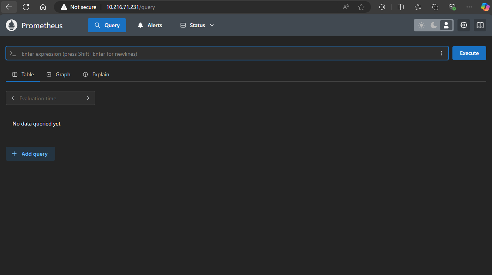
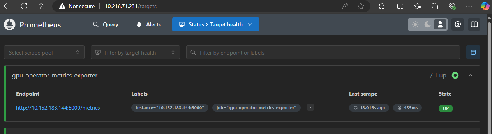
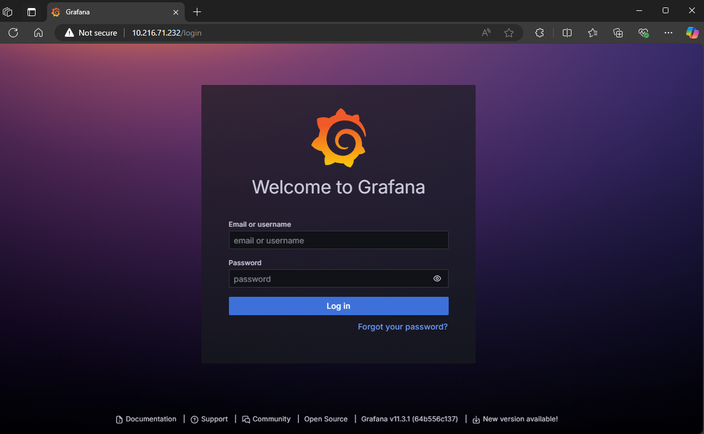
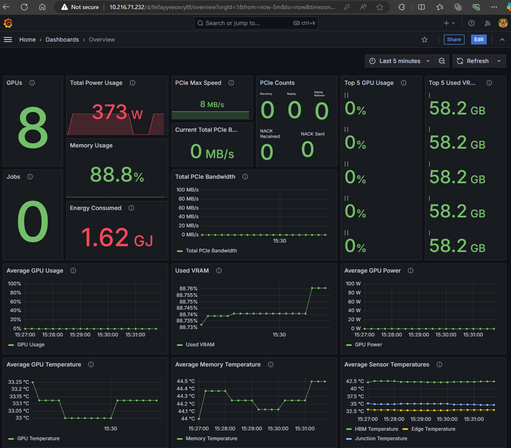
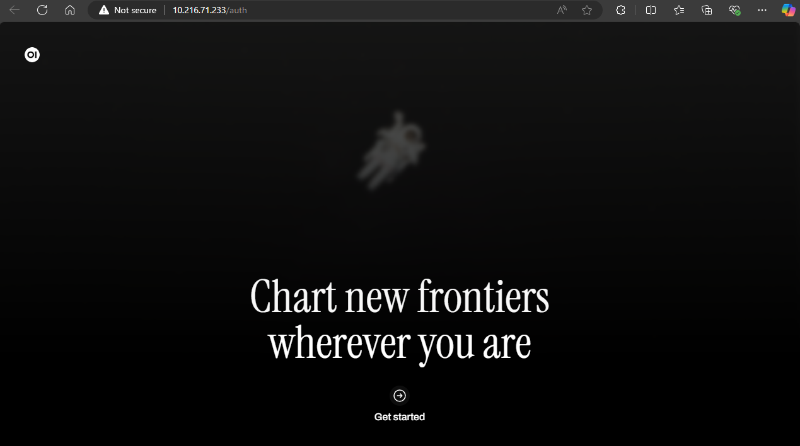
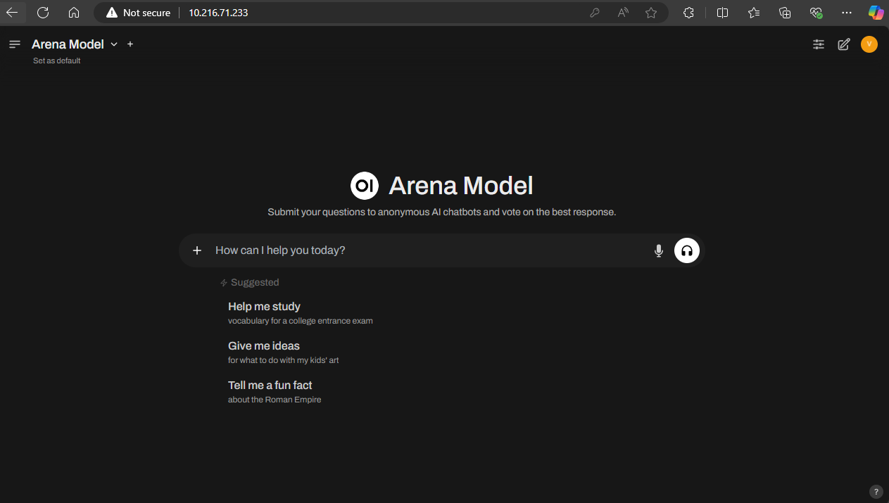
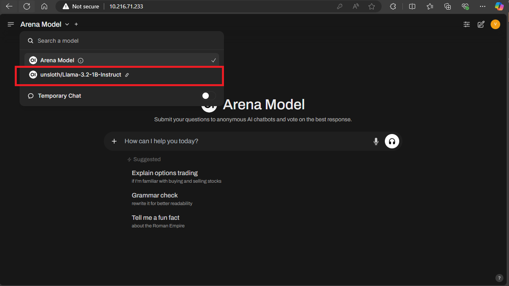
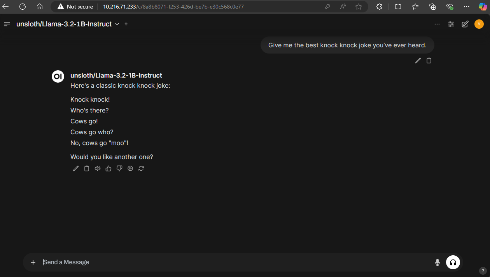

# AI Inference Orchestration with Kubernetes on Instinct MI300X, Part 3
<!---
Copyright (c) 2025 Advanced Micro Devices, Inc. (AMD)

Permission is hereby granted, free of charge, to any person obtaining a copy
of this software and associated documentation files (the "Software"), to deal
in the Software without restriction, including without limitation the rights
to use, copy, modify, merge, publish, distribute, sublicense, and/or sell
copies of the Software, and to permit persons to whom the Software is
furnished to do so, subject to the following conditions:

The above copyright notice and this permission notice shall be included in all
copies or substantial portions of the Software.

THE SOFTWARE IS PROVIDED "AS IS", WITHOUT WARRANTY OF ANY KIND, EXPRESS OR
IMPLIED, INCLUDING BUT NOT LIMITED TO THE WARRANTIES OF MERCHANTABILITY,
FITNESS FOR A PARTICULAR PURPOSE AND NONINFRINGEMENT. IN NO EVENT SHALL THE
AUTHORS OR COPYRIGHT HOLDERS BE LIABLE FOR ANY CLAIM, DAMAGES OR OTHER
LIABILITY, WHETHER IN AN ACTION OF CONTRACT, TORT OR OTHERWISE, ARISING FROM,
OUT OF OR IN CONNECTION WITH THE SOFTWARE OR THE USE OR OTHER DEALINGS IN THE
SOFTWARE.
--->

Welcome back to the final part of our series! So far, we’ve successfully setup up a Kubernetes cluster and installed the AMD GPU Operator to seamlessly integrate AMD hardware with Kubernetes in **[Part 1](https://rocm.blogs.amd.com/artificial-intelligence/k8s-orchestration-part1/README.html)**. We've deployed vLLM on AMD Instinct MI300X GPUs, exposed it using MetalLB, and scaled it efficiently in **[Part 2](https://rocm.blogs.amd.com/artificial-intelligence/k8s-orchestration-part2/README.html)**.

Building on the groundwork from Parts 1 and 2, this blog will help you implement advanced tools to monitor GPU performance, visualize metrics, and provide a user-friendly interface for interacting with your large language models (LLMs). By the end of this final blog in our series, your deployment will be equipped with end-to-end observability and accessibility, ensuring a robust and scalable production environment.  

## Prerequisites

Before proceeding, ensure that:

- The AMD GPU Operator is installed (**[Part 1](https://rocm.blogs.amd.com/artificial-intelligence/k8s-orchestration-part1/README.html)**).
- vLLM is deployed in your cluster (**[Part 2](https://rocm.blogs.amd.com/artificial-intelligence/k8s-orchestration-part2/README.html#deploying-vllm)**).
- MetalLB is configured for external service exposure (**[Part 2](https://rocm.blogs.amd.com/artificial-intelligence/k8s-orchestration-part2/README.html)**).

## Metrics collection and visualization

Our next step is implementing comprehensive monitoring for our GPU-accelerated workloads. AMD’s GPU Operator utilizes the **[AMD Device Metrics Exporter](https://instinct.docs.amd.com/projects/device-metrics-exporter/en/latest/)**. We'll use Prometheus to collect metrics from the Exporter and Grafana to visualize them, providing insights into GPU utilization, memory usage, and overall system performance.

### Add Prometheus and Grafana Helm repositories

```bash
helm repo add prometheus-community https://prometheus-community.github.io/helm-charts
helm repo add grafana https://grafana.github.io/helm-charts
helm repo update
```

```{note}
Since we already configured MetalLB in [Part 2](https://rocm.blogs.amd.com/artificial-intelligence/k8s-orchestration-part2/README.html#install-the-load-balancer), we can leverage it to expose both Prometheus and Grafana services externally via LoadBalancer type services.
```

## Install Prometheus

```bash
helm install prometheus prometheus-community/prometheus \
  --namespace monitoring \
  --create-namespace \
  --set server.service.type=LoadBalancer
```

Once installed, we need to edit the ```configmap``` of Prometheus to add the metrics from the ```gpu-operator-metrics-exporter``` as another scrape source.

First, let us get the ```CLUSTER-IP``` of the ```gpu-operator-metrics-exporter``` by running:

```bash
kubectl get svc -n kube-amd-gpu
```

We should see something similar to the following:

```bash
NAME                                              TYPE        CLUSTER-IP       EXTERNAL-IP   PORT(S)          AGE
amd-gpu-operator-kmm-controller-metrics-service   ClusterIP   10.152.183.145   <none>        8443/TCP         23h
amd-gpu-operator-kmm-webhook-service              ClusterIP   10.152.183.172   <none>        443/TCP          23h
gpu-operator-metrics-exporter                     NodePort    10.152.183.144   <none>        5000:32500/TCP
```

```{note}
Take note of the `CLUSTER-IP` for the `gpu-operator-metrics-exporter` service - you'll need this for the next step.
```

Edit the Prometheus configuration to add the metrics source:

```bash
kubectl edit configmap prometheus-server -n monitoring
```

Navigate to the `scrape_configs` section of the configuration and add the following `job_name` entry

```yaml
  - job_name: 'gpu-operator-metrics-exporter'
    static_configs:
      - targets:
        - '<METRICS-EXPORTER-CLUSTER-IP>:5000'  # Replace with your metrics exporter's CLUSTER-IP
    metrics_path: '/metrics'
```

To confirm that Prometheus is scraping the metrics, navigate to the Prometheus UI in your browser by getting the ```EXTERNAL IP``` of Prometheus via:

```bash
kubectl get svc -n monitoring
```

You should see an entry similar to the following Prometheus server:

```bash
NAME               TYPE           CLUSTER-IP       EXTERNAL-IP     PORT(S)        AGE
prometheus-server  LoadBalancer   10.152.183.143   10.216.71.231   80:32617/TCP   161m
```

Navigating to the ```EXTERNAL-IP``` in your browser and you should be greeted by the Prometheus UI:


Confirm that Prometheus is scraping metrics correctly from the ```gpu-operator-metrics-exporter``` by going to \
```Status > Target Health```

There you should see the ```gpu-operator-metrics-exporter``` with ```State``` in the ```Up``` mode. If you are still unable to see the metrics, confirm the `scrape_configs` section of the configmap we edited is formatted correctly and try again (this is usually the main source of issues).



### Install and configure Grafana

To install Grafana we will run:

```bash
helm install grafana grafana/grafana \
  --namespace monitoring \
  --set server.service.type=LoadBalancer
```

To confirm that our load balancer has assigned external addresses to Grafana we can run:

```bash
kubectl get services -n monitoring
```

Among other services, we should also see something similar to:

```bash
NAME          TYPE           CLUSTER-IP       EXTERNAL-IP     PORT(S)        AGE
grafana       LoadBalancer   10.152.183.126   10.216.71.232   80:32658/TCP   100m
```

Note the ```EXTERNAL-IP``` of Grafana, it's what we will be using to navigate to its UI in our web browser. In our example above we would navigate to ```http://10.216.71.232/login```.

You should be greeted with the Grafana login screen below.



The default admin username is ```admin``` but you will need to get the admin password by running the following in your terminal:

```bash
kubectl get secret --namespace monitoring grafana -o jsonpath="{.data.admin-password}" | base64 --decode ; echo
```

#### Configure Grafana data source

Grafana needs to be initialized with a Prometheus data source for metric scraping. To do this, we utilize the Grafana UI.

1. Access the Grafana UI using the external IP (retrieve using `kubectl get svc -n monitoring`)
2. Navigate to Connections > Data Sources
3. Click "Add data source" and select Prometheus
4. Enter the Prometheus server URL (http://<prometheus-external-ip>)
5. Click "Save & Test" to verify the connection

#### Import GPU Dashboards

The ROCm GPU Operator provides pre-configured Grafana dashboards for monitoring Instinct GPUs. These can be found in the [ROCm GPU Operator GitHub repository](https://github.com/ROCm/gpu-operator/tree/main/grafana).

To import a dashboard:

1. Navigate to Dashboards > Import in the Grafana UI
2. Copy the contents of any dashboard JSON file from the repository
3. Paste into the import wizard
4. Select your Prometheus data source
5. Click "Import"



## Implementing Open WebUI

Now that we have our vLLM inference engine deployed (and scaling) we could provide an out-of-the-box intuitive web UI for end users to interact with LLMs on AMD hardware. For that we will utilize [Open WebUI](https://github.com/open-webui/open-webui).

Open WebUI is an extensible, feature-rich, and user-friendly self-hosted WebUI designed to operate entirely offline. It supports various LLM runners, including Ollama and OpenAI-compatible APIs.

Since vLLM utilizes an OpenAI-compatible API for hosting LLMs, Open WebUI will be able to use it as our backend LLM service.

We will utilize similar deployment manifests as our vLLM deployment in [Part 2](https://rocm.blogs.amd.com/artificial-intelligence/k8s-orchestration-part2/README.html#deploying-vllm) to deploy Open WebUI. These are:

### Deploy Open WebUI

We'll create three Kubernetes manifests to deploy Open WebUI:

1. `open-webui-pvc.yaml` - persistent storage for Open WebUI's user management and chat histories

    ```yaml
    #open-webui-pvc.yaml
    
    apiVersion: v1
    kind: PersistentVolumeClaim
    metadata:
        name: open-webui-pvc
        namespace: default
    spec:
        accessModes:
        - ReadWriteOnce
        resources:
            requests:
                storage: 10Gi  # Adjust storage size as needed
    ```

2. `open-webui-deployment.yaml` - an instance of Open WebUI configured to connect to our vLLM engine

   ```yaml
   apiVersion: apps/v1
   kind: Deployment
   metadata:
     name: open-webui
     namespace: default
   spec:
     replicas: 1
     selector:
       matchLabels:
         app: open-webui
     template:
       metadata:
         labels:
           app: open-webui
       spec:
         containers:
           - name: open-webui
             image: ghcr.io/open-webui/open-webui:0.5.18
             ports:
               - containerPort: 8080  # Container exposes port 8080
             env:
               - name: OPENAI_API_BASE_URL
                 value: "http://10.228.20.200/v1"  # Use your vLLM service's external IP
               - name: OPENAI_API_KEY
                 value: "test1234"  # Necessary for Open WebUI to function, can be anything
               - name: ENABLE_OLLAMA_API
                 value: "false"
               - name: ENABLE_RAG_WEB_SEARCH
                 value: "false"
               - name: RAG_WEB_SEARCH_ENGINE
                 value: "duckduckgo"
             volumeMounts:
               - mountPath: /app/backend/data  # Mount path inside the container
                 name: open-webui-data
         volumes:
           - name: open-webui-data
             persistentVolumeClaim:
               claimName: open-webui-pvc

3. `open-webui-service.yaml` - a service manifest for exposing the WebUI outside our cluster

   ```yaml
   #open-webui-service.yaml

   apiVersion: v1
   kind: Service
   metadata:
     name: open-webui  # Indentation fixed here
     namespace: default
   spec:
     type: LoadBalancer  # Exposes the service externally
     ports:
       - port: 80  # External port to expose
         targetPort: 8080  # Port the container is listening on
         protocol: TCP
     selector:
       app: open-webui    
    ```

```{note}
Make sure to update the `OPENAI_API_BASE_URL` in the deployment manifest to match your vLLM service's external IP address.
```

We apply the manifests with

```bash
kubectl apply -f open-webui-pvc.yaml
kubectl apply -f open-webui-deployment.yaml
kubectl apply -f open-webui-service.yaml
```

### Verify the Deployment

After a few moments of the container being pulled and pods spinning up, running `kubectl get deployments` should show output similar to this:

```bash
NAME           READY   UP-TO-DATE   AVAILABLE   AGE
llama-3-2-1b   1/1     1            1           4h9m
open-webui     1/1     1            1           2s
```

Running `kubectl get pods` should show:

```bash
NAME                            READY   STATUS    RESTARTS   AGE
llama-3-2-1b-55d7d48f67-crdkj   1/1     Running   0          97m
open-webui-54df7bb5c-457bt      1/1     Running   0          47s
```

Finally, running `kubectl get svc` will give us the `EXTERNAL-IP` of our Open WebUI service

```bash
NAME           TYPE           CLUSTER-IP       EXTERNAL-IP     PORT(S)          AGE
kubernetes     ClusterIP      10.152.183.1     <none>          443/TCP          2d1h
llama-3-2-1b   LoadBalancer   10.152.183.202   10.216.71.230   8000:32703/TCP   4h3m
open-webui     LoadBalancer   10.152.183.111   10.216.71.233   80:31240/TCP     4h3m
```

Access the WebUI by navigating to `http://<OPEN-WEBUI-EXTERNAL-IP>` in your browser.

```{note}
The first user to register on Open WebUI automatically becomes an administrator. Secure these credentials appropriately for production deployments.
```

In our example we will open up our browser to `http://10.216.71.233`. If you are the first user of this instance of the app, you will be greeted by the `Get Started` webpage and asked to provide a `name`, `email` and `password` once you click. By default, this first account becomes an admin account.



After logging in you should see the following.



If the deployment was successful in reaching the vLLM API, you should now see an option to choose the model hosted by vLLM for use in Open WebUI. In our instance, that is `unsloth/Llama-3.2-1B-Instruct`



Now you can talk to your model however you see fit!



## Summary

This concludes our series on AI inference orchestration with Kubernetes on AMD Instinct MI300X. With this setup, you are now equipped to handle large-scale AI inference workloads efficiently.
By following this 3-part guide, you have successfully set up a robust and scalable infrastructure, covering:

- Kubernetes and Helm installation
- Persistent storage setup for caching LLMs
- AMD GPU Operator integration
- vLLM engine deployment
- Load Balancing via MetalLB, and
- Monitoring with Prometheus and Grafana,
- Open WebUI for an intuitive user interface.

As you move forward, consider the following next steps to optimize and expand your deployment:

- Monitor: Continuously track performance metrics and ensure system reliability using tools like Grafana and Prometheus.
- Optimize: Experiment with GPU and fine-tuning frameworks to fine-tune your models.
- Enhance: Leverage additional Kubernetes resources such as external data stores to strengthen your infrastructure.
- Learn: Stay updated with the latest developments by exploring vLLM documentation and community forums.
- **Upgrade**: Take advantage of our recently released AMD GPU Operator v1.2.0, which introduces new capabilities including automated GPU health monitoring with customizable thresholds, intelligent removal of unhealthy GPUs from the scheduling pool, seamless driver upgrades with node drain/cordon management, and a test runner for diagnosing GPU issues. For complete details, check the [GitHub release](https://github.com/ROCm/gpu-operator/releases/tag/v1.2.0) or the [full release notes](https://instinct.docs.amd.com/projects/gpu-operator/en/latest/releasenotes.html).

With this guide as a foundation, you are now prepared to handle large-scale AI inference workloads efficiently. Best of luck as you continue to build and innovate with Instinct on Kubernetes!

<p style="font-size: 12px;">
Disclaimers<br>
Third-party content is licensed to you directly by the third party that owns the content and is not licensed to you by AMD. ALL LINKED THIRD-PARTY CONTENT IS PROVIDED “AS IS” WITHOUT A WARRANTY OF ANY KIND. USE OF SUCH THIRD-PARTY CONTENT IS DONE AT YOUR SOLE DISCRETION AND UNDER NO CIRCUMSTANCES WILL AMD BE LIABLE TO YOU FOR ANY THIRD-PARTY CONTENT. YOU ASSUME ALL RISK AND ARE SOLELY RESPONSIBLE FOR ANY DAMAGES THAT MAY ARISE FROM YOUR USE OF THIRD-PARTY CONTENT.
</p>
