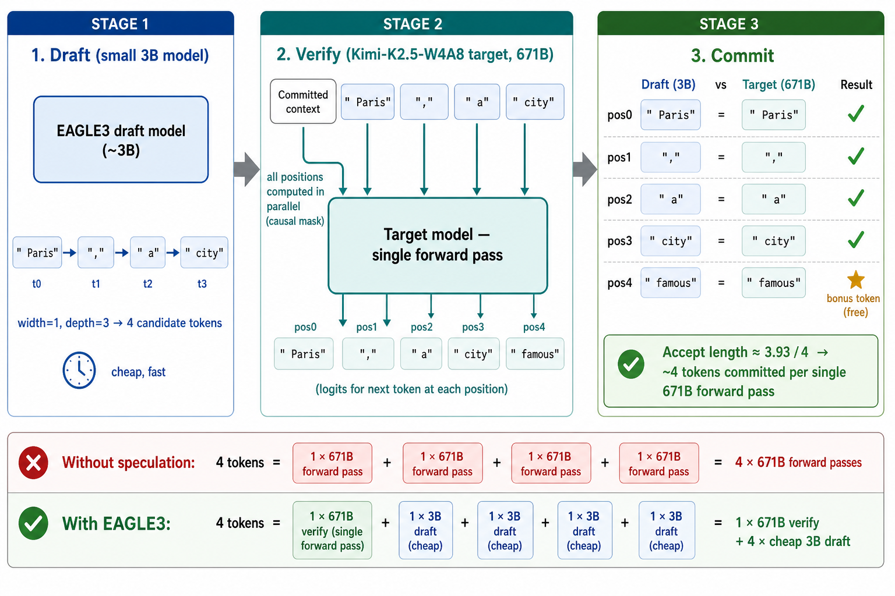
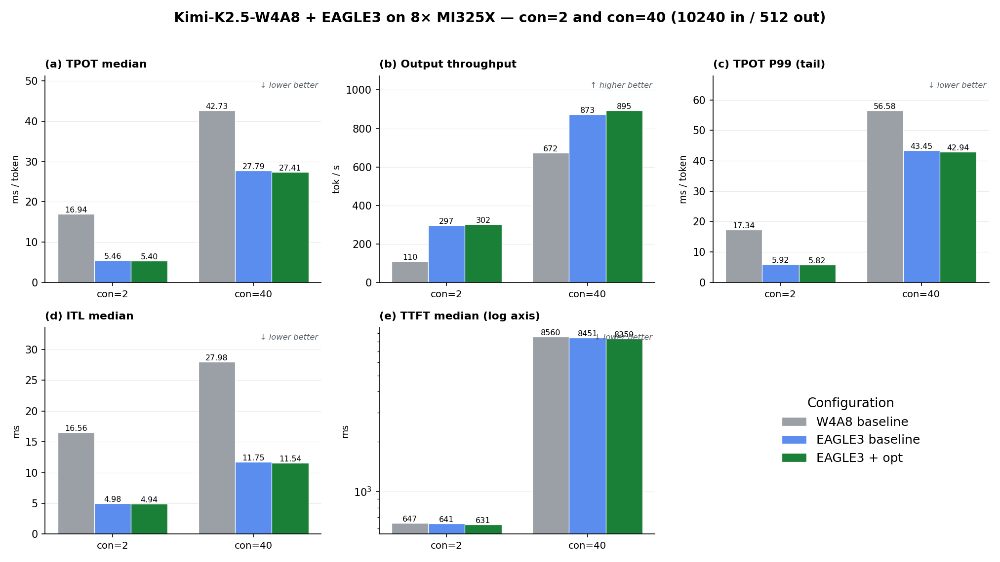

<!---
Copyright (c) 2026 Advanced Micro Devices, Inc. (AMD)

Permission is hereby granted, free of charge, to any person obtaining a copy
of this software and associated documentation files (the "Software"), to deal
in the Software without restriction, including without limitation the rights
to use, copy, modify, merge, publish, distribute, sublicense, and/or sell
copies of the Software, and to permit persons to whom the Software is
furnished to do so, subject to the following conditions:

The above copyright notice and this permission notice shall be included in all
copies or substantial portions of the Software.

THE SOFTWARE IS PROVIDED "AS IS", WITHOUT WARRANTY OF ANY KIND, EXPRESS OR
IMPLIED, INCLUDING BUT NOT LIMITED TO THE WARRANTIES OF MERCHANTABILITY,
FITNESS FOR A PARTICULAR PURPOSE AND NONINFRINGEMENT. IN NO EVENT SHALL THE
AUTHORS OR COPYRIGHT HOLDERS BE LIABLE FOR ANY CLAIM, DAMAGES OR OTHER
LIABILITY, WHETHER IN AN ACTION OF CONTRACT, TORT OR OTHERWISE, ARISING FROM,
OUT OF OR IN CONNECTION WITH THE SOFTWARE OR THE USE OR OTHER DEALINGS IN THE
SOFTWARE.
--->

# Faster Kimi-K2.5-W4A8 Decoding with EAGLE3 on AMD Instinct™ MI325X

In our [previous blog](../kimi-k2.5-w4a8/README.md) [[7]](#references), we deployed Kimi-K2.5 [[1]](#references) in W4A8 (INT4 weights + INT8 activations) on AMD Instinct™ MI325X, replacing the BF16 MFMA path in the fused MoE kernel with [FlyDSL](https://github.com/ROCm/FlyDSL) [[2]](#references)'s INT8 MFMA implementation. The remaining bottleneck is the *autoregressive* nature of decoding itself: even with INT8 MFMA and INT4 weights, the framework still runs one full forward pass per generated token.

This blog adds **EAGLE3** [[8]](#references) speculative decoding — a small draft model proposes candidate tokens that the W4A8 target model verifies in a single parallel forward pass — plus three small kernel-tuning patches for the new shape that EAGLE3's verify step feeds the MoE and attention kernels. As we quantify below, EAGLE3 is by far the dominant win and the kernel patches are modest add-ons.

On 8× MI325X at concurrency=40, the full stack cuts decode-step latency (TPOT median) from 42.73 ms to **27.41 ms (−35.9%)** and lifts output throughput from 672 to **895 tok/s (+33.1%)**, with no measurable accuracy regression — almost all of it from EAGLE3 itself.

---

## Why EAGLE3?

### Vanilla autoregressive decode is sequential and bandwidth-bound

In the W4A8 baseline pipeline, every output token requires one full forward pass over Kimi-K2.5: read the previous-step KV cache, run attention, route through MoE experts, sample the next token, append the new KV entry, repeat. The KV cache is reused, but each step is *sequential* — token `t+1` cannot start until token `t` is committed — so even with INT8 MFMA the per-step latency is dominated by HBM traffic (weight loading, KV reads, expert dispatch). On a large MoE model like Kimi-K2.5 this places a hard floor on TPOT that no further compute-throughput optimization can break by itself.

### Speculative decoding: amortize one verify pass over multiple tokens

The classical idea of speculative decoding is to keep two models in flight:

- A cheap **draft** model produces a chain of `N` candidate tokens by running its own short autoregressive loop (fast because it's small).
- The expensive **target** model runs *one* forward pass over the draft chain that computes `N+1` logits in parallel. It then greedy-verifies the chain token by token, accepting the longest prefix where each draft token matches what the target would have generated, and using its own `(prefix_len + 1)`-th logit to produce one bonus token.

If the draft model is well-aligned with the target, the accepted prefix is close to `N`, and per-step amortized cost approaches one target-model forward pass per `(N+1)` committed tokens. If the draft is bad, the worst case still commits 1 token per verify step (same as vanilla decode) — there is no correctness penalty, only a wasted compute penalty proportional to draft cost.

### EAGLE3 in particular

EAGLE3 is a tree-based variant in this family. Rather than proposing a single chain of width 1, the draft model proposes a *tree* of candidate continuations of a width of `topk` and depth `num-steps`, and the target model verifies the entire tree in a single parallel forward pass over `num-draft-tokens` flattened positions. The quality of the draft tree is measured by **accept length** — the average number of tokens committed per target-model step (best possible value is `num-draft-tokens`, which would mean every draft token was accepted).

In this work we use the configuration:

```text
--speculative-num-steps 3
--speculative-eagle-topk 1
--speculative-num-draft-tokens 4
```

This is the sweet spot per the [TPOT-optimization report](https://amd-afde.top/rocm/BD-study/kimi-k2.5/kimi_k2.5_tpot_optimization_report.html)'s own ablation [[9]](#references):

- `n=4, d=6` raises accept length further but the verify pass becomes proportionally heavier — P99 ITL inflates by roughly 4× and the verify-cost growth eats the gain.
- `n=2, d=3` starves accept length down to ~3.0, leaving headroom on the table.
- `n=3, d=4` lands at accept length ≈ **3.93 / 4.0** — essentially at the ceiling that this draft model and tree shape can deliver — without inflating verify cost.

The full draft-and-verify flow — the draft model proposing a 4-token chain and the target verifying all positions in one parallel pass — is illustrated in **Figure 1**.



**Figure 1.** EAGLE3 draft + verify pipeline. The small draft model produces a width-1, depth-3 chain of 4 candidate tokens; the full Kimi-K2.5-W4A8 target model verifies all 4 positions in a single forward pass that returns 5 logits and commits the longest matching prefix plus one bonus token.

### Obtaining the EAGLE3 draft model

The draft used here is published as [`lightseekorg/kimi-k2.5-eagle3`](https://huggingface.co/lightseekorg/kimi-k2.5-eagle3) [[11]](#references) on HuggingFace — a 3B-parameter BF16 checkpoint of roughly **6 GB**. That is two orders of magnitude smaller than the 497 GB W4A8 base, so the draft is effectively free to store and adds negligible load time and HBM footprint next to the target.

Because an EAGLE3 draft is trained against a specific target's hidden states, it only pairs with the matching Kimi-K2.5 base — here the W4A8 checkpoint [`amd/Kimi-K2.5-W4A8`](https://huggingface.co/amd/Kimi-K2.5-W4A8) [[10]](#references); it will not transfer to an unrelated target. Download it once and point SGLang at the local directory through `--speculative-draft-model-path` in the [launch command](#launching-the-server):

```bash
hf download lightseekorg/kimi-k2.5-eagle3 --local-dir /path/to/kimi-k2.5-eagle3
# then pass: --speculative-draft-model-path /path/to/kimi-k2.5-eagle3
```

### How much does EAGLE3 alone buy?

Before any kernel tuning, the impact of plugging EAGLE3 into the W4A8 stack is already the largest single contributor to the headline number. Measured on 8× MI325X at concurrency=40 (decode-dominated):

| Metric (con=40, MI325X)             | W4A8 (no EAGLE3) | W4A8 + EAGLE3 baseline |        Δ |
| :---                                |             ---: |                   ---: |     ---: |
| TPOT median (ms) ↓                  |            42.73 |                  27.79 | **−35.0%** |
| Output throughput (tok/s) ↑         |           672.30 |                 872.58 | **+29.8%** |
| ITL median (ms) ↓                   |            27.98 |                  11.75 | **−58.0%** |
| TTFT median (ms) ↓                  |         8 560.35 |               8 450.85 | −1.3% (unchanged — prefill unaffected) |

TPOT and ITL improve dramatically; TTFT is essentially unchanged, which is expected — speculative decoding only attacks the decode phase, and prefill still runs once over the full prompt either way.

> ↓ = lower is better, ↑ = higher is better

---

## Why kernel tuning on top?

EAGLE3 lands the bulk of the win, but the verify-pass shape change leaves a little performance on the table inside the kernels themselves. Without EAGLE3, MoE decode sees `M=1` per expert: a single token's hidden state per routing slot. With EAGLE3 at `--speculative-num-draft-tokens 4`, the verify pass routes **4 tokens** through the expert sort, and the MoE GEMM sees `M=4` per expert. This new verify shape, plus a chip-level FMHA conversion default, motivate three small, shape-aware kernel patches.

### Kernel tuning for the EAGLE3 verify shape

We add three small knobs that target the `M=4` verify shape (plus one chip-level FMHA default):

- **Stage2 MoE `tile_k=256`** (`AITER_FLYDSL_STAGE2_TILE_K=256`, env-gated) — widens the down_proj GEMM K-tiling from the `M=1`-tuned default of 128, halving the K-loop wave count for the `M=4` verify shape with INT4 weights. Source: [`ROCm/aiter` @ `kimi-K2.5-W4A8-rebased`, commit `511df6a`](https://github.com/ROCm/aiter/commit/511df6a) (`aiter/fused_moe.py`).
- **Stage1 MoE scheduler-hint gate** (`FLYDSL_MOE_STAGE1_SCHED=0`, env-gated) — drops the hand-written `rocdl.sched_*` hints that were tuned for the `M=1` decode shape, letting the compiler pick its own instruction ordering at `M=4`. Source: [`ROCm/FlyDSL` @ `feature/w4a8-moe-port-rebased`, commit `a1d8312`](https://github.com/ROCm/FlyDSL/commit/a1d8312) (`kernels/moe_gemm_2stage.py`).
- **FMHA bf16 round-to-zero** (`how_v3_bf16_cvt=2`, source-baked) — uses the native single-instruction `v_cvt_pk_rtz_bf16_f32` for the FP32→BF16 attention-output conversion on gfx942, replacing the multi-op `rtna` emulation at a negligible ~0.5 ULP bias. It is the only one of the three that also touches prefill. Source: [`ROCm/aiter` @ `kimi-K2.5-W4A8-rebased`, commit `b5757d6`](https://github.com/ROCm/aiter/commit/b5757d6) (`aiter/ops/mha.py`).

Together these kernel patches add a small further improvement on top of EAGLE3 — on the order of ≈1–2% TPOT and ≈2–3% throughput on MI325X. On this 304-CU GPU the MoE/FMHA paths they touch are largely not the bottleneck, so the headroom is modest; EAGLE3 itself remains the dominant win.

---

## End-to-End Performance Results

### Test Environment

| Component | Version |
| :--- | :--- |
| Hardware | 8× AMD Instinct™ MI325X (gfx942) |
| Base Docker image | `rocm/sgl-dev:v0.5.10rc0-rocm720-mi30x` |
| Pre-built image | `clementlincf/amdafde:v0.5.10rc0-rocm720-mi30x-kimi-k2.5-opt-20260420` |
| ROCm | 7.2.0 |
| SGLang | [`kimi-K2.5-W8A8-dev-rebased`](https://github.com/AFDEAPAC/sglang/tree/kimi-K2.5-W8A8-dev-rebased) — `QuarkW4A8Int4Fp8MoE` dispatch + EAGLE3 integration |
| AITER | [`kimi-K2.5-W4A8-rebased`](https://github.com/ROCm/aiter/tree/kimi-K2.5-W4A8-rebased) HEAD `b5757d6` — Stage2 `tile_k` + FMHA rtz patches |
| FlyDSL | [`feature/w4a8-moe-port-rebased`](https://github.com/ROCm/FlyDSL/tree/feature/w4a8-moe-port-rebased) HEAD `a1d8312` — Stage1 scheduler-hint gate |
| Base model | [`amd/Kimi-K2.5-W4A8`](https://huggingface.co/amd/Kimi-K2.5-W4A8) |
| EAGLE3 draft model | [`lightseekorg/kimi-k2.5-eagle3`](https://huggingface.co/lightseekorg/kimi-k2.5-eagle3) [[11]](#references) (~6 GB) |

> **Pre-built image:** All results in this blog can be reproduced from the Docker image above, which bundles the SGLang / AITER / FlyDSL branches at the commits listed and the Quark build needed to load `amd/Kimi-K2.5-W4A8`. If any of the branch links above become unavailable, the changes have most likely been merged upstream and can be used from there.

### Launching the Server

Both configurations below load the same `amd/Kimi-K2.5-W4A8` checkpoint and use the EAGLE3 draft model. The only difference between the **EAGLE3 baseline** and the **EAGLE3 + optimizations** runs is the two extra environment variables that enable the Stage2 `tile_k` override and the Stage1 scheduler-hint gate; the FMHA rtz default is source-baked and is therefore active in both configurations. This is cleanly A/B-testable subset of the full delta — what we call the "env-only Δ" (the two env-gated patches combined) — and it is not the full delta itself.

**Common environment (both runs):**

```bash
export TRITON_MAX_CACHE_SIZE=2147483648
export AITER_FLYDSL_MOE_COMPARE_STAGE2=0
export AITER_FLYDSL_MOE_COMPARE=0
export AITER_FLYDSL_DEBUG=0
export AITER_ENFORCE_DSL=1
export DSL2_ROOT=/opt/FlyDSL
export AITER_USE_FLYDSL_MOE=1
export AITER_USE_FLYDSL_MOE_STAGE1=1
export AITER_USE_FLYDSL_MOE_STAGE2=1
export MLIR_PATH=/opt/mlir_install
export CK_TILE_FLOAT_TO_BFLOAT16_DEFAULT=3
export AITER_W4A8_USE_INT8=1
export SGLANG_DISABLE_CUDNN_CHECK=1
export SGLANG_USE_AITER=1
export SGLANG_NUMA_BIND_V2=1
```

**Common launch command (both runs):**

```bash
python -m sglang.launch_server \
    --model amd/Kimi-K2.5-W4A8 \
    --tp 8 \
    --attention-backend aiter \
    --host 0.0.0.0 \
    --port 9527 \
    --mem-fraction-static 0.80 \
    --trust-remote-code \
    --disable-radix-cache \
    --enable-torch-compile \
    --numa-node 0 0 0 0 1 1 1 1 \
    --speculative-algorithm EAGLE3 \
    --speculative-draft-model-path /path/to/kimi-k2.5-eagle3 \
    --speculative-num-steps 3 \
    --speculative-eagle-topk 1 \
    --speculative-num-draft-tokens 4
```

#### EAGLE3 baseline

Launch with just the common env and command above — no additional exports. This run measures the impact of EAGLE3 by itself on top of W4A8, with the source-baked FMHA rtz conversion already active because it ships in the kernel binaries used.

#### EAGLE3 + optimizations

Add the two env-gated patches before launching:

```bash
export FLYDSL_MOE_STAGE1_SCHED=0
export AITER_FLYDSL_STAGE2_TILE_K=256
```

then re-run the common launch command above. This activates the two env-gated patches on top of the already-active source-baked FMHA rtz conversion.

> **Note on `--mem-fraction-static 0.80`.** On MI325X with 256 GB HBM, setting `--mem-fraction-static 0.9` (as used in the prior W4A8 blog) triggers an int32 page-offset overflow inside `fmha_batch_prefill_kernel.hpp` during EAGLE3 draft warmup: the product `(num_total_pages - 1) * batch_stride_k` exceeds `INT32_MAX`. Reducing to `0.80` keeps the KV cache within the int32-indexable range while still leaving room for the draft model. This will be lifted once the ck_tile FMHA kernel's page-offset arithmetic is widened to int64.

### Benchmark Commands

We use the same input/output settings as the prior W4A8 blog (10,240 input tokens, 512 output tokens) at two concurrency points: a decode-dominated `con=40` run that EAGLE3 most directly improves at scale, and a low-concurrency `con=2` run where the latency-bound decode step shows EAGLE3's largest per-token win.

**Decode-dominated (concurrency = 40):**

```bash
python3 -m sglang.bench_serving \
    --model amd/Kimi-K2.5-W4A8 \
    --dataset-name random \
    --random-input 10240 \
    --random-output 512 \
    --num-prompts 160 \
    --max-concurrency 40 \
    --request-rate inf \
    --port 9527 \
    --random-range-ratio 1.0
```

**Low-concurrency (concurrency = 2):**

```bash
python3 -m sglang.bench_serving \
    --model amd/Kimi-K2.5-W4A8 \
    --dataset-name random \
    --random-input 10240 \
    --random-output 512 \
    --num-prompts 10 \
    --max-concurrency 2 \
    --request-rate inf \
    --port 9527 \
    --random-range-ratio 1.0
```

### Results

**MI325X (this work).** Figure 2 collects all five serving metrics, each comparing the same three configurations — the W4A8 baseline (no EAGLE3, reproduced from the prior blog on the same hardware and image stack), EAGLE3 baseline, and EAGLE3 + opt — at low concurrency (con=2) and decode-dominated concurrency (con=40), on the same 10240-in / 512-out workload.



**Figure 2.** Kimi-K2.5-W4A8 serving metrics on 8× MI325X. **(a)** TPOT median, **(b)** output throughput, **\(c\)** TPOT P99 tail latency, **(d)** ITL median, **(e)** TTFT median (log axis). Bars are grouped by concurrency (con=2, con=40); each group holds the three configurations.

Reading the panels: **Figure 2(a)/(b)** are the headline — EAGLE3 is the dominant win, especially at con=2 where the latency-bound decode step leaves the GPU ample spare compute to verify the whole draft chain nearly for free (TPOT 16.94 → 5.40 ms, −68%, versus −36% at con=40; throughput +175% at con=2 and +33% at con=40). **\(c\)** TPOT P99 follows the same shape as the median — EAGLE3 compresses tail latency sharply too. **(d)** ITL median tracks TPOT and falls with it. **(e)** TTFT is essentially flat across all three configurations (prefill is unaffected by speculative decoding) — note the log axis, since con=2 (≈640 ms) and con=40 (≈8,500 ms) differ ≈13×.

Across every panel, **EAGLE3 itself is the star** — it accounts for almost the entire gap from the W4A8 baseline (the grey → blue step) — while the three kernel patches are modest refinements (the blue → green step; env-only Δ ≈ −1.4% TPOT / +2.5% throughput on this 304-CU GPU, with the source-baked FMHA rtz conversion folded into the EAGLE3-baseline bar). Accept length is not plotted because it is essentially constant — ≈ 3.9 / 4.0 in every EAGLE3 run (3.97 at con=2, 3.93 at con=40), near the ceiling for `num-draft-tokens=4`, with no W4A8 (no-EAGLE3) counterpart.

### Accuracy Validation

GSM8K (10-shot, full 1,319-sample test set) shows no meaningful drop with EAGLE3 + opt — both metrics stay above 0.93, on par with the W4A8 baseline:

| Configuration | flexible-extract | strict-match |
| :--- | :---: | :---: |
| W4A8 (no EAGLE3) | 0.9340 | 0.9333 |
| **W4A8 + EAGLE3 + opt (this work)** | **0.9363** | **0.9356** |

---

## Summary

This blog stacked EAGLE3 speculative decoding and three kernel-tuning patches on top of the previously published Kimi-K2.5-W4A8 deployment to cut decode-step latency by ≈36% and lift output throughput by ≈33% on 8× AMD Instinct™ MI325X at concurrency=40, with no measurable GSM8K regression. The overwhelming majority of that win is EAGLE3 itself; the three kernel patches add ≈−1.4% TPOT / +2.5% throughput on top of it on this chip. The two moving parts:

1. **EAGLE3 speculative decoding** — the dominant win (≈−35% TPOT / +30% throughput at con=40, and far more at con=2). Draft + verify with `num-steps=3, topk=1, num-draft-tokens=4` reaches accept length ≈ **3.93 / 4.0**. [[8]](#references)

2. **Three shape-aware kernel patches** for the `M=4` verify shape (Stage2 `tile_k=256`, the Stage1 scheduler-hint gate, and the FMHA round-to-zero conversion, detailed above) — a small collective add-on, ≈1–2% TPOT / ≈2–3% throughput on this 304-CU GPU.

This work continues to lean on the synergy between [SGLang](https://github.com/sgl-project/sglang) [[4]](#references) (model execution and speculative-decoding integration), [AITER](https://github.com/ROCm/aiter) [[5]](#references) (CK/ASM and FlyDSL dispatch), [FlyDSL](https://github.com/ROCm/FlyDSL) [[2]](#references) (the W4A8 INT8-MFMA MoE kernel itself), and the broader AMD ROCm ecosystem — the three kernel patches above are exactly the kind of small, targeted, shape-aware tuning that becomes practical once each of those layers exposes the right hooks. Combined with EAGLE3 from [[8]](#references), the result is a stack that meaningfully closes the autoregressive-decode gap on Kimi-K2.5 on MI325X without giving up the W4A8 memory and compute advantages of the underlying serving path.

## References

[1] [Kimi-K2.5](https://huggingface.co/moonshotai/Kimi-K2.5) — Moonshot AI's Mixture-of-Experts LLM

[2] [FlyDSL](https://github.com/ROCm/FlyDSL) — Flexible Layout Python DSL for GPU kernel development

[3] [AMD Quark](https://github.com/amd/quark) — Quantization toolkit for deep learning models

[4] [SGLang](https://github.com/sgl-project/sglang) — Fast serving framework for large language models

[5] [AITER](https://github.com/ROCm/aiter) — AI Tensor Engine for ROCm

[6] [lm-evaluation-harness](https://github.com/EleutherAI/lm-evaluation-harness) — Framework for evaluating language models

[7] [Previous blog: Further Accelerating Kimi-K2.5 on AMD Instinct™ MI325X — W4A8 & W8A8 Quantization with AMD Quark](../kimi-k2.5-w4a8/README.md)

[8] [EAGLE-3: Scaling up Inference Acceleration of Large Language Models via Training-Time Test](https://arxiv.org/abs/2503.01840) — see also the reference implementation at [SafeAILab/EAGLE](https://github.com/SafeAILab/EAGLE)

[9] [Kimi-K2.5-W4A8 TPOT Optimization Report](https://amd-afde.top/rocm/BD-study/kimi-k2.5/kimi_k2.5_tpot_optimization_report.html) — supplementary measurement report on the EAGLE3 and kernel-tuning methodology and ablations

[10] [amd/Kimi-K2.5-W4A8](https://huggingface.co/amd/Kimi-K2.5-W4A8) — Pre-quantized W4A8 checkpoint on HuggingFace

[11] [lightseekorg/kimi-k2.5-eagle3](https://huggingface.co/lightseekorg/kimi-k2.5-eagle3) — EAGLE3 MTP draft model for Kimi-K2.5 (~6 GB, 3B params, BF16)

## Disclaimers

Third-party content is licensed to you directly by the third party that owns the
content and is not licensed to you by AMD. ALL LINKED THIRD-PARTY CONTENT IS
PROVIDED "AS IS" WITHOUT A WARRANTY OF ANY KIND. USE OF SUCH THIRD-PARTY CONTENT
IS DONE AT YOUR SOLE DISCRETION AND UNDER NO CIRCUMSTANCES WILL AMD BE LIABLE TO
YOU FOR ANY THIRD-PARTY CONTENT. YOU ASSUME ALL RISK AND ARE SOLELY RESPONSIBLE
FOR ANY DAMAGES THAT MAY ARISE FROM YOUR USE OF THIRD-PARTY CONTENT.
