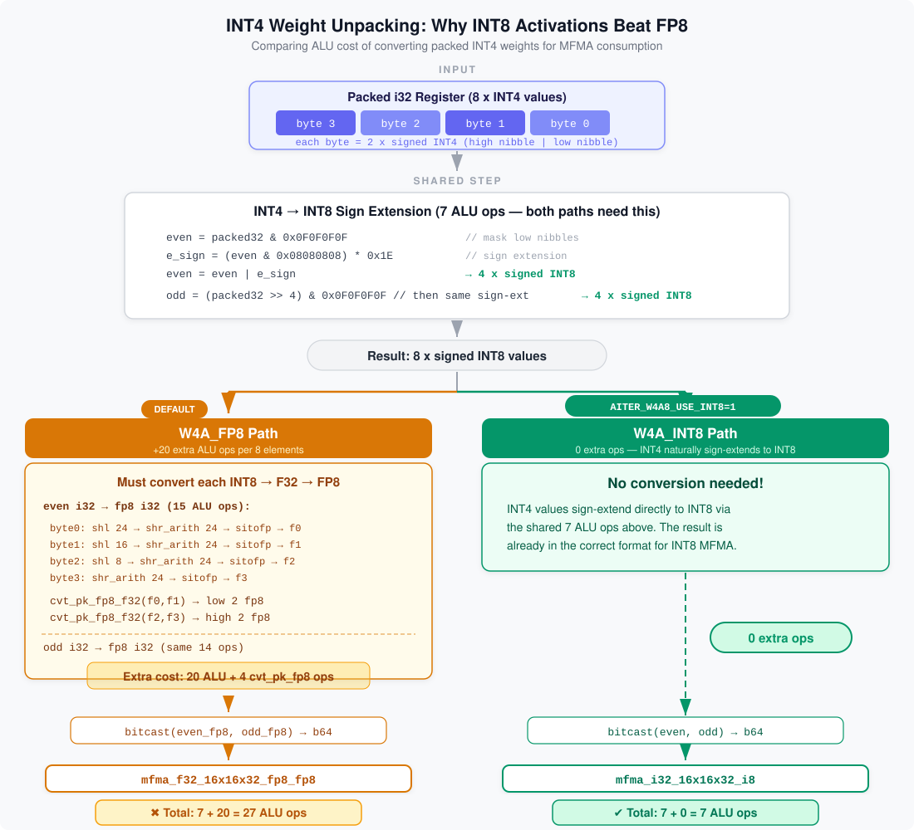

<!---
Copyright (c) 2026 Advanced Micro Devices, Inc. (AMD)

Permission is hereby granted, free of charge, to any person obtaining a copy
of this software and associated documentation files (the "Software"), to deal
in the Software without restriction, including without limitation the rights
to use, copy, modify, merge, publish, distribute, sublicense, and/or sell
copies of the Software, and to permit persons to whom the Software is
furnished to do so, subject to the following conditions:

The above copyright notice and this permission notice shall be included in all
copies or substantial portions of the Software.

THE SOFTWARE IS PROVIDED "AS IS", WITHOUT WARRANTY OF ANY KIND, EXPRESS OR
IMPLIED, INCLUDING BUT NOT LIMITED TO THE WARRANTIES OF MERCHANTABILITY,
FITNESS FOR A PARTICULAR PURPOSE AND NONINFRINGEMENT. IN NO EVENT SHALL THE
AUTHORS OR COPYRIGHT HOLDERS BE LIABLE FOR ANY CLAIM, DAMAGES OR OTHER
LIABILITY, WHETHER IN AN ACTION OF CONTRACT, TORT OR OTHERWISE, ARISING FROM,
OUT OF OR IN CONNECTION WITH THE SOFTWARE OR THE USE OR OTHER DEALINGS IN THE
SOFTWARE.
--->

# Further Accelerating Kimi-K2.5 on AMD Instinct™ MI325X: W4A8 & W8A8 Quantization with AMD Quark

In our [previous blog](../kimi-k2.5-optimize/README.md) [[7]](#references), we demonstrated how to accelerate Kimi-K2.5 [[1]](#references) inference on AMD Instinct™ GPUs by profiling the model, identifying `fused_moe` as the dominant bottleneck (consuming 88–90% of GPU time), and replacing the default Triton-based kernel with a [FlyDSL](https://github.com/ROCm/FlyDSL) [[2]](#references)-powered mixed-precision (BF16 + W4A16) fused MoE implementation.

In this blog, we apply the same optimized W4A16 serving stack on AMD Instinct™ MI325X GPUs as our baseline, and ask: *Can we push performance even further?* In the W4A16 configuration, MoE expert weights are compressed to INT4, but activations still flow through the compute pipeline in BF16 (16-bit). The GEMM core uses BF16 MFMA (Matrix Fused Multiply-Add) instructions, leaving half of the hardware's potential peak throughput on the table.

Building on that previous post's FlyDSL MoE optimization, the two paragraphs that follow spell out two distinct ways to reclaim that MFMA headroom—each aimed at a different deployment priority, not two versions of the same story. The first keeps INT4 weights (roughly the same weight-memory profile as W4A16) and pairs them with 8-bit activations plus INT8 MFMA in an extended FlyDSL kernel—appropriate when you want to stay VRAM-efficient while attacking the BF16 activation ceiling. The second shifts both weights and activations to FP8 so inference can use AITER's highly tuned FP8 MFMA and CK/ASM paths without custom MoE code—appropriate when you prioritize pipeline simplicity and latency and can accept roughly double the model bytes on GPU.

**First path — W4A8 (goal: maximum reuse of the prior FlyDSL MoE work with the smallest weight footprint).** To close the BF16-activation gap while staying closest to the W4A16 memory story, we take two steps. First, we use [AMD Quark](https://github.com/amd/quark) [[3]](#references) to re-quantize Kimi-K2.5 from its native W4A16 format to W4A8: Quark's `ProgressiveSpec` two-stage quantization (FP8 outlier clipping → INT4 per-channel) re-quantizes the weights with per-channel scales, while activations are reduced to 8-bit dynamically at runtime. Second, we extend the FlyDSL fused MoE kernel to exploit 8-bit MFMA instructions. The resulting W4A8 model is publicly available as [`amd/Kimi-K2.5-W4A8`](https://huggingface.co/amd/Kimi-K2.5-W4A8) on HuggingFace.

**Second path — W8A8 (goal: lean on off-the-shelf FP8 tensor cores when per-GPU memory budget allows).** We also explore W8A8 (FP8 weights + FP8 activations) as an alternative quantization strategy. W8A8 eliminates dequantization overhead entirely — FP8 weights can be fed directly into 8-bit MFMA compute — and routes through AITER's highly-tuned CK/ASM kernels without requiring custom FlyDSL kernels. The trade-off is 2× memory per GPU (~124 GB vs ~62 GB for W4A8). A pre-quantized W8A8 checkpoint is available at [`ginsongsong/Kimi-K2.5-W8A8`](https://huggingface.co/ginsongsong/Kimi-K2.5-W8A8) on HuggingFace.

Compared to the W4A16 baseline on the same MI325X system, W4A8 delivers up to 16% lower TPOT and 18% higher throughput at low concurrency (10% and 9% respectively at high concurrency), while W8A8 achieves the best per-token latency at low concurrency (16% faster than W4A8). Both formats maintain accuracy on GSM8K. The best choice depends on the deployment scenario — this blog walks through both strategies in detail.

---

## Why W4A8?

### The Opportunity: 2× Compute Throughput

AMD Instinct™ MI325X GPUs (gfx942 architecture, shared with MI300X) support multiple MFMA instruction variants with different throughput characteristics:

| Instruction | Data Type | Theoretical Peak (per GPU) |
| :--- | :---: | :---: |
| `mfma_f32_16x16x16_bf16` | BF16 | 1,307.4 TFLOPS |
| `mfma_i32_16x16x32_i8` | INT8 | 2,614.9 TOPS |
| `mfma_f32_16x16x32_fp8` | FP8 | 2,614.9 TFLOPS |

Both INT8 and FP8 MFMA instructions offer 2× the theoretical throughput compared to BF16 on MI325X. In the W4A16 configuration, the INT4 weights are dequantized to BF16, and the GEMM is performed with BF16 MFMA — utilizing only half the available compute.

### From W4A16 to W4A8

Moving to W4A8 means:

- **Weights** remain in INT4 — same storage footprint, same memory bandwidth for weight loading
- **Activations** are quantized from BF16 to 8-bit (dynamically, per token, at runtime)
- **Compute** switches to 8-bit MFMA instructions, unlocking the 2× throughput ceiling

Our profiling in the previous blog showed that `fused_moe` dominates GPU execution — accounting for 88–90% of total GPU time across both low and high concurrency settings. By Amdahl's law, even a moderate speedup of MoE translates to significant end-to-end improvement. However, the MoE kernel is not purely compute-bound: INT4 weight loading and dequantization remain memory-bandwidth-limited, regardless of MFMA throughput. So while the 2× MFMA advantage provides a meaningful speedup on the compute-bound portion of the kernel, the overall end-to-end gain is tempered by these memory-bound components — as our benchmark results later confirm (9–18% throughput improvement rather than a theoretical 2× ceiling).

### Why INT8 over FP8?

Both INT8 and FP8 MFMA instructions deliver the same 2× throughput on MI325X, so why choose INT8 for the activation data path?

- **Natural integer pipeline**: The weights are already in INT4 (integer). Dequantizing INT4 to INT8 is a simple bit extension within the same integer domain — no format conversion overhead. An FP8 path would require an additional INT4-to-FP8 type conversion before the MFMA instruction.
- **Lossless inner loop**: INT8 MFMA accumulates into INT32, which is exact for the multiply-add operations in the GEMM inner loop. Precision loss is confined to the epilogue stage, where per-channel weight scales and per-token activation scales are applied and the result is converted back to BF16. This gives tighter control over where quantization error is introduced.
- **Simpler scale arithmetic**: With symmetric INT8 quantization, activation scales are simple scalar multipliers per token. Combined with per-channel weight scales, the dequantization math in the epilogue reduces to a single scale-per-output-element multiply — avoiding the more complex exponent handling that FP8 scale factors would require.

The first point deserves a closer look. Figure 1 traces the exact ALU operations the FlyDSL kernel must execute to unpack INT4 weights into a format consumable by MFMA:



**Figure 1.** INT4 weight unpacking: FP8 path (left, default) vs INT8 path (right, enabled by `AITER_W4A8_USE_INT8=1`). The default FP8 path requires 27 total ALU ops (7 shared + 20 conversion), while the INT8 path needs only the 7 shared ops.

On the INT8 path (right), INT4 values are sign-extended to INT8 with just 7 ALU ops (bitwise AND, shift, OR) — the result is directly fed into `mfma_i32_16x16x32_i8`. On the FP8 path (left), the same 7 ops produce INT8 values, but an additional 20 ALU ops are needed to convert each byte to F32 (`shl` → `shr_arith` → `sitofp`) and then pack pairs back into FP8 (`cvt_pk_fp8_f32`) before feeding `mfma_f32_16x16x32_fp8_fp8`. That is a ~74% ALU overhead per weight element — directly reducing the effective throughput of the MoE kernel, which is the dominant bottleneck in Kimi-K2.5 inference.

### The Trade-Off: Accuracy

Moving from W4A16 to W4A8 introduces quantization error from two sources that W4A16 does not have:

1. **Coarser weight scales** — W4A16 uses per-group quantization (group_size=32), giving each group of 32 weights its own scale factor to closely track local value distributions. W4A8 uses per-channel quantization — one scale for all K values in a row (e.g. 7,168 weights per scale). This coarser granularity means the INT4 representation is less precise, as outlier values in a row inflate the scale and compress the effective range for the majority of weights.

2. **Activation quantization noise** — W4A16 keeps activations in BF16 (zero activation quantization error). W4A8 dynamically converts BF16 activations to INT8 at runtime, introducing per-token rounding error. Although dynamic quantization adapts to each token's value range, 8-bit resolution inevitably loses fine-grained distinctions that 16-bit preserves.

In short, W4A16 is expected to have higher end-to-end accuracy than W4A8. The question is whether the accuracy gap is acceptable given the performance gains. Three design choices work in our favor to keep the gap small:

1. **Dynamic per-token activation quantization** — Activation scales are computed fresh for each token at runtime, adapting to the actual value distribution. This avoids the stale-scale problem of static quantization and is far more robust to distribution shifts across inputs.
2. **Selective quantization** — Only MoE expert layers (gate_proj, up_proj, down_proj) are quantized. Precision-sensitive components — attention layers, normalization, router gates, shared experts, embeddings, and the language model head — remain in BF16. This limits quantization noise to the compute-heavy but error-tolerant expert projections.
3. **INT32 accumulation** — The INT8 MFMA inner loop accumulates into INT32 (lossless for 8-bit multiply-adds), confining precision loss to the scale-application epilogue rather than compounding it across the dot product.

### Choosing the Right Scale Granularity

The choice between per-group, per-channel, and per-token quantization is not arbitrary — it is driven by where in the GEMM kernel the scale factor can be applied, which in turn depends on the target MFMA instruction:

| Granularity | Applies to | When to use |
| :--- | :--- | :--- |
| **Per-group** (e.g., group_size=32) | Weights | When using BF16 MFMA (W4A16). The group scale must be applied *inside* the GEMM inner loop (dequant each group to BF16 before the multiply), which is only feasible in a floating-point pipeline. Offers the finest accuracy because each group of 32 weights gets its own scale. |
| **Per-channel** (one scale per output row) | Weights | When using INT8 MFMA (W4A8). The integer inner loop (`INT8 × INT8 → INT32`) cannot apply per-group scales mid-computation. Instead, the single per-channel weight scale is applied in the epilogue after accumulation. Coarser than per-group, but enables 2× compute throughput. |
| **Per-token** (one scale per token, dynamic) | Activations | Always, when quantizing activations at runtime. Activation distributions vary with every input, so scales must be computed dynamically. Per-token strikes the right balance: fine enough to track per-input variation (unlike per-tensor, where one outlier token would skew the scale for all tokens), yet cheap to compute at runtime (unlike per-channel on activations, which would require scanning every channel dimension). |

In summary: the target MFMA instruction dictates weight scale granularity (per-group for BF16, per-channel for INT8), while activation scales are always per-token dynamic. The accuracy–performance trade-off is ultimately a choice between per-group + BF16 MFMA (higher accuracy, lower throughput) and per-channel + INT8 MFMA (slightly lower accuracy, 2× compute throughput).

This is where [AMD Quark](https://github.com/amd/quark) comes in: it provides a structured, config-based approach to specify exactly which layers to quantize and how.

---

## Quantizing Kimi-K2.5 to W4A8 with AMD Quark

AMD provides a pre-quantized W4A8 checkpoint ready for direct use:

> **[`amd/Kimi-K2.5-W4A8`](https://huggingface.co/amd/Kimi-K2.5-W4A8)** [[9]](#references) on HuggingFace — download and serve directly with the launch command in [End-to-End Performance Results](#end-to-end-performance-results). No quantization step required.

The remainder of this section explains *how* this model was produced using AMD Quark's `ProgressiveSpec` methodology. Readers who want to understand the quantization process, customize it for other models, or reproduce the results can follow along; otherwise, skip ahead to the [Runtime Pipeline](#runtime-pipeline-from-bf16-activations-to-int8-mfma) or [End-to-End Performance Results](#end-to-end-performance-results) section.

### How It Works: Two-Stage Quantization

W4A8 quantization involves two distinct stages that happen at different times:

| | Weight (W4) | Activation (A8) |
| :--- | :--- | :--- |
| **What** | INT4 per-group → FP8 → INT4 per-channel (`ProgressiveSpec`) | BF16 → INT8 per-token |
| **When** | Offline, once (saved to checkpoint) | Online, every inference step |
| **Who** | **Quark** (`direct_quantize_checkpoint`) | **AITER** (`dynamic_per_token_scaled_quant` kernel, at runtime) |
| **How** | Static — two-stage scales computed from weight values | Dynamic — scales computed from live activation values |

The official `moonshotai/Kimi-K2.5` model on HuggingFace is already natively INT4 quantized (W4A16) using per-group scales (group_size=32) in [`compressed-tensors`](https://quark.docs.amd.com/latest/pytorch/file2file_quantization.html#supported-input-formats) format. Quark's File-to-File Quantization natively supports this input format — it automatically decompresses the packed weights before re-quantization (requires the `compressed-tensors` Python package). The two-stage process called `ProgressiveSpec` first decompresses the existing INT4 per-group weights back to floating point, then applies a first-stage FP8 quantization that clips outliers to the representable range (±448). The clipped values are then further quantized to INT4 with per-channel scales in the second stage. This two-stage approach provides implicit outlier handling — the FP8 clipping stage smooths extreme weight values before they are compressed to INT4.

The output checkpoint contains two weight scale tensors per quantized layer: `weight_scale` (from the FP8 stage) and `weight_scale_2` (from the INT4 per-channel stage). The activation config (`FP8E4M3PerTensorSpec` with `is_dynamic=True`) is metadata only — it is embedded into the checkpoint's `quantization_config` to tell the serving framework that activations should be dynamically quantized at runtime. Although the metadata records FP8, the kimi SGLang branch's `QuarkW4A8Int4Fp8MoE` scheme overrides this at runtime, hard-coding `QuantType.per_Token` to trigger INT8 dynamic quantization via AITER. Quark itself does not quantize activations. At runtime, AITER's `dynamic_per_token_scaled_quant` HIP kernel performs the actual BF16 → INT8 conversion before passing the quantized activations to the FlyDSL MoE kernel for INT8 MFMA computation (see the [Runtime Pipeline](#runtime-pipeline-from-bf16-activations-to-int8-mfma) section for details).

[AMD Quark](https://github.com/amd/quark) is a comprehensive quantization toolkit that supports a wide range of quantization strategies for deep learning models. For large MoE models like Kimi-K2.5 (671B parameters, 384 experts), Quark provides a particularly valuable capability: [File-to-File Quantization](https://quark.docs.amd.com/latest/pytorch/file2file_quantization.html) [[10]](#references) via `direct_quantize_checkpoint()`. This mode reads each `.safetensors` file, quantizes the weights it contains, and writes the result directly to a new file — without ever loading the full model into memory.

### Quark's Quantization Architecture

Quark organizes quantization through composable configuration layers:

1. **Scheme** (`QLayerConfig`) — Defines the precision: data types and granularity for weights and activations.
2. **Exclude list** — Specifies which layers to skip. All unlisted linear layers are quantized.
3. **Algorithm** — (Optional) Defines calibration-based optimization strategies such as GPTQ, AWQ, SmoothQuant, or Rotation. These algorithms require loading the full model into GPU memory and running inference on calibration data to observe weight/activation distributions, then adjusting quantization parameters to minimize precision loss. For a 671B-parameter model like Kimi-K2.5, this is impractical — the model cannot fit on a single GPU for inference. Instead, we use `direct_quantize_checkpoint` ([File-to-File Quantization](https://quark.docs.amd.com/latest/pytorch/file2file_quantization.html)), which processes weights one file at a time with simple math (compute scale, round to INT4) and requires no calibration data or model inference.

These are combined into a single `QConfig` object and passed to `ModelQuantizer`.

### Step 1: Define the Exclude Layers

We define which layers to exclude from quantization. Only the MoE expert weight projections (gate, up, down within `experts.*`) will be quantized; all other components remain in BF16:

```python
exclude_layers = [
    "*self_attn*",       # All attention layers
    "*mlp.gate",         # MoE router gate
    "*lm_head",          # Language model head
    "*mlp.gate_proj",    # Dense (non-expert) MLP gate
    "*mlp.up_proj",      # Dense (non-expert) MLP up
    "*mlp.down_proj",    # Dense (non-expert) MLP down
    "*shared_experts*",  # Shared experts in MoE
    "*mm_projector*",    # Vision-language projector
    "*vision_tower*",    # Vision encoder
]
```

The exclude patterns use `fnmatch`-style wildcards. Patterns like `*mlp.up_proj` match the dense MLP layers (e.g., `model.layers.0.mlp.up_proj`) but do *not* match expert layers (e.g., `model.layers.1.mlp.experts.42.up_proj`), because the `experts.42.` segment breaks the literal `mlp.up_proj` match. This ensures that only the MoE expert projections — the compute-heavy layers — are quantized.

### Step 2: Define the W4A8 Scheme (ProgressiveSpec)

We define the quantization scheme using Quark's `ProgressiveSpec` — a two-stage weight quantization that first clips outliers via FP8, then compresses to INT4 per-channel:

```python
from quark.torch.quantization.config.config import (
    FP8E4M3PerTensorSpec, Int4PerChannelSpec, ProgressiveSpec, QLayerConfig,
)

input_spec = FP8E4M3PerTensorSpec(
    observer_method="min_max", scale_type="float32", is_dynamic=True,
).to_quantization_spec()

weight_spec = ProgressiveSpec(
    first_stage=FP8E4M3PerTensorSpec(
        observer_method="min_max", scale_type="float32", is_dynamic=False,
    ),
    second_stage=Int4PerChannelSpec(
        symmetric=True, scale_type="float32",
        round_method="half_even", is_dynamic=False, ch_axis=0,
    ),
).to_quantization_spec()

global_quant_config = QLayerConfig(input_tensors=input_spec, weight=weight_spec)
```

#### Understanding the Specs

- **`weight_spec`** (`ProgressiveSpec`): This is the key innovation. Quark performs a two-stage quantization offline:
  - **Stage 1** (`FP8E4M3PerTensorSpec`): Compute a per-tensor FP8 scale, then quantize the floating-point weights to FP8. This clips outliers to the FP8 representable range (±448), acting as implicit outlier handling. The FP8 scale is saved as `weight_scale`.
  - **Stage 2** (`Int4PerChannelSpec`): Take the FP8-quantized values and further quantize them to INT4 with per-channel scales (`ch_axis=0`). Each output channel gets a single float32 scale factor, and all K weights in that channel are symmetrically quantized to signed 4-bit integers. The per-channel scale is saved as `weight_scale_2`.

  When the input is a W4A16 checkpoint (already INT4 per-group), Quark decompresses the existing INT4 per-group weights back to floating point before applying the two-stage process. Per-channel granularity is required for efficient INT8 MFMA computation (see the detailed explanation below).

- **`input_spec`** (`FP8E4M3PerTensorSpec`, `is_dynamic=True`): Quark does *not* quantize activations. This spec is metadata only — it is embedded into the checkpoint's `quantization_config` to tell the serving framework (SGLang) that activations should be dynamically quantized at runtime. Although the metadata records FP8, the actual runtime behavior is controlled by the SGLang scheme: the kimi branch's `QuarkW4A8Int4Fp8MoE` scheme hard-codes `QuantType.per_Token`, which triggers INT8 dynamic quantization via AITER's kernel (see the dispatch chain below). No calibration data is needed, which is critical for a 671B MoE model where running calibration forward passes would be prohibitively expensive.

#### Why Per-Channel? How W4A8 Differs from W4A16

A natural question arises: both W4A16 and W4A8 store expert weights as INT4, so what exactly is different?

The answer lies in scale granularity. The W4A16 checkpoint produced by GPTQ [[8]](#references) uses per-group quantization with `group_size=32`, while the W4A8 checkpoint produced by Quark uses per-channel quantization. These are fundamentally different quantization schemes that produce different INT4 values, different scale tensors, and require different kernel implementations.

Consider a single expert linear layer with weight matrix shape [N, K] (N output channels, K input features). For Kimi-K2.5's `gate_proj` / `up_proj` layers, a representative shape after tensor-parallel sharding is approximately [2048, 7168]:

**W4A16 — per-group (group_size=32):**

```text
Weight matrix [N, K]:   each row is split into K/32 groups of 32 weights
                         each group has its own scale factor

Row 0:  [w0..w31] [w32..w63] [w64..w95] ... [w7136..w7167]
         scale_0    scale_1    scale_2   ...   scale_223

Total scales per layer: N × (K / 32) = 2048 × 224 = 458,752 scale values
```

Every 32 consecutive weights share one scale. This fine-grained grouping captures local value distributions within a row, minimizing quantization error. At runtime, the W4A16 kernel dequantizes each INT4 value to BF16 by multiplying with its group scale, then performs BF16 MFMA with BF16 activations.

**W4A8 — per-channel:**

```text
Weight matrix [N, K]:   each entire row shares a single scale factor

Row 0:  [w0 ................................................... w7167]
         scale_0   (one scale for all 7168 weights in this row)

Total scales per layer: N = 2,048 scale values
```

Each output channel has exactly one scale. This is much coarser — all K=7168 weights in a row are quantized relative to a single value. Why accept this loss in granularity? Because the INT8 compute path fundamentally requires it. The reason becomes clear when we compare *when* the weight scale is applied in each path.

#### When Is the Scale Applied? The Key Difference

**W4A16 — scale is consumed before MFMA:**

In the W4A16 path, INT4 weights are dequantized to BF16 before entering the MFMA instruction. The group scale is multiplied into each weight element during this dequant step:

```text
For each weight element:
    w_bf16 = int4_to_bf16(w_int4) × group_scale[n, k//32]     ← scale absorbed here
                                                                  (element-wise float multiply)
Then MFMA sees:
    output[n] = Σ_k  w_bf16[n,k] × act_bf16[k]               ← pure BF16 × BF16, no scales
```

After dequant, the scale information is "baked into" the BF16 value — it vanishes. The MFMA instruction sees pure BF16 operands and has no idea whether the original weight had 1 scale or 224 scales. Per-group adds only a small cost to the dequant stage (one extra scale lookup per 32 elements) and zero cost to the MFMA inner loop.

**W4A8 — scale cannot be applied before MFMA:**

In the W4A8 path, INT4 weights are sign-extended to INT8 (not dequantized to float). This is a pure bit operation — no scale is applied, because multiplying an INT8 value by a floating-point scale would produce a float, and then it could no longer be fed into an INT8 MFMA instruction:

```text
For each weight element:
    w_int8 = sign_extend(w_int4)       ← pure bit ops (7 ALU ops), NO scale applied
                                          (multiplying by float scale would exit integer domain)
Then MFMA sees:
    int32_sum = Σ_k  w_int8[n,k] × act_int8[k]    ← INT8 × INT8, accumulates to INT32
```

The scale must be deferred to the epilogue, applied after the entire dot product is complete:

```text
output[n] = wt_scale[n] × act_scale × int32_sum    ← scales applied here, once
```

This only works cleanly if there is a single weight scale per row (i.e., per-channel). If weight scales varied every 32 elements (as in per-group), the kernel could not accumulate the full dot product and apply one scale at the end. Instead, it would need to:

1. Run MFMA for 32 elements → extract partial INT32 sum
2. Convert to float, multiply by `group_scale[g]`
3. Repeat for next group of 32 → extract partial INT32 sum
4. Convert to float, multiply by `group_scale[g+1]`
5. ... repeat K/32 = 224 times, accumulating float partial sums

This turns one contiguous MFMA operation into 224 small, scale-interrupted chunks — destroying the throughput advantage of INT8 MFMA.

**In summary:**

| | W4A16 (BF16 MFMA) | W4A8 (INT8 MFMA) |
| :--- | :--- | :--- |
| **Scale applied** | Before MFMA (during dequant) | After MFMA (in epilogue) |
| **Why** | Dequant output is BF16 — scale "bakes in" | Sign-extend output is INT8 — can't absorb a float scale |
| **Per-group cost** | Negligible (one extra lookup per 32 elements) | Prohibitive (breaks inner loop into 224 chunks) |
| **Per-channel cost** | Could work but wastes accuracy | Required for efficient INT8 MFMA |

Per-channel is not a preference — it is a constraint imposed by the integer MFMA compute model. This is why Quark must re-quantize the W4A16 checkpoint: it dequantizes the existing INT4 per-group weights back to floating point, then re-quantizes them with per-channel scales. The per-group scale layout from W4A16 is structurally incompatible with the W4A8 INT8 MFMA kernel.

#### Summary: What Quark Actually Does for W4A8

| | W4A16 (previous blog) | W4A8 (this blog) |
| :--- | :--- | :--- |
| **Source** | `moonshotai/Kimi-K2.5` (native INT4 per-group, by Moonshot AI) | Re-quantized from `moonshotai/Kimi-K2.5` by Quark, or download pre-built [`amd/Kimi-K2.5-W4A8`](https://huggingface.co/amd/Kimi-K2.5-W4A8) |
| **Quantizer** | GPTQ | AMD Quark (`ProgressiveSpec`) |
| **Weight precision** | INT4 | INT4 |
| **Quantization stages** | Single-stage (BF16 → INT4 per-group) | Two-stage (BF16 → FP8 → INT4 per-channel) |
| **Scale granularity** | Per-group (group_size=32) | Per-channel |
| **Scale tensors** | `weight_scale` only | `weight_scale` (FP8) + `weight_scale_2` (INT4) |
| **Scales per layer** | N × K/32 (e.g. 458,752) | N (e.g. 2,048) per-channel + 1 per-tensor FP8 |
| **INT4 values** | Optimized for group-local accuracy | Optimized for whole-channel accuracy (with FP8 outlier clipping) |
| **Activation at runtime** | Stays BF16 | BF16 → INT8 (dynamic, by kernel) |
| **MFMA instruction** | `mfma_f32_16x16x16_bf16` | `mfma_i32_16x16x32_i8` |

Although both store INT4 weights, the INT4 values are different because per-group and per-channel quantization compute different optimal scale factors, and `ProgressiveSpec` additionally applies FP8 outlier clipping before the INT4 stage. Quark takes the existing W4A16 checkpoint (`moonshotai/Kimi-K2.5`, which is natively INT4 per-group quantized), dequantizes the expert weights back to floating point, clips outliers via the FP8 stage, and re-quantizes them with per-channel scales to produce a layout compatible with the INT8 MFMA fast path.

### Step 3: Run the Quantization

With the scheme and exclude list defined, we combine them into a `QConfig` and run:

```python
from quark.torch.quantization.config.config import QConfig
from quark.torch.quantization.api import ModelQuantizer

quant_config = QConfig(global_quant_config=global_quant_config, exclude=exclude_layers)
quantizer = ModelQuantizer(quant_config)

quantizer.direct_quantize_checkpoint(
    pretrained_model_path="/path/to/moonshotai/Kimi-K2.5",  # W4A16 checkpoint (INT4 per-group)
    save_path="/path/to/Kimi-K2.5-W4A8",                    # output: INT4 per-channel + W4A8 metadata
)
```

`direct_quantize_checkpoint` uses Quark's [File-to-File Quantization](https://quark.docs.amd.com/latest/pytorch/file2file_quantization.html) mode, which processes each `.safetensors` file independently:

1. Load one `.safetensors` file into GPU memory
2. For `compressed-tensors` inputs (like our W4A16 source model): automatically decompress the packed INT4 per-group weights back to floating-point
3. For expert weight tensors: apply the two-stage `ProgressiveSpec` quantization (FP8 clip → INT4 per-channel), saving both `weight_scale` and `weight_scale_2`
4. Write the re-quantized file and move to the next

As the [Quark documentation](https://quark.docs.amd.com/latest/pytorch/file2file_quantization.html) notes, peak GPU memory is driven by the largest single file (typically ~5–10 GB), not by the total model size — making it practical to re-quantize Kimi-K2.5's 671B parameters on a single GPU without OOM.

### Step 4: Verify `config.json`

When Quark writes the quantized checkpoint, it automatically generates a `quantization_config` in `config.json`. Because we used `ProgressiveSpec` (two-stage: FP8 then INT4), Quark records both stages in the `weight` field as a list:

```json
{
  "quant_method": "quark",
  "global_quant_config": {
    "weight": [
      {"dtype": "fp8_e4m3", "qscheme": "per_tensor", "is_dynamic": false},
      {"dtype": "int4", "qscheme": "per_channel", "ch_axis": 0, "is_dynamic": false}
    ],
    "input_tensors": {
      "dtype": "fp8_e4m3", "qscheme": "per_tensor", "is_dynamic": true
    }
  },
  "export": {"pack_method": "reorder", "weight_format": "real_quantized"}
}
```

This two-entry `weight` list is critical for SGLang dispatch. The `weight` list is not a declaration of multiple storage formats — the actual stored weights are INT4 per-channel only — but rather a record of the two-stage quantization pipeline. SGLang's `get_moe_scheme()` inspects this list, finds both an `"fp8_e4m3"` entry and an `"int4"` entry (`has_int4 and has_fp8`), and uses their presence as a dispatch signal to activate the `QuarkW4A8Int4Fp8MoE` scheme. If a single-stage spec (like `Int4PerChannelSpec` alone) were used, `weight` would be a plain dict instead of a list, the dispatch condition would never be satisfied, and the W4A8 kernel path would be silently skipped.

This metadata drives the entire runtime dispatch chain — from model loading to kernel selection. Here is how `config.json` connects to the INT8 MFMA kernel:

**Step 1: SGLang reads `config.json` at model load time.** It sees `"quant_method": "quark"` and delegates to the Quark quantization handler (`QuarkConfig.from_config()`), which parses the weight and activation specs from `global_quant_config`.

**Step 2: SGLang selects the quantization scheme.** When initializing MoE layers, `QuarkConfig.get_moe_scheme()` inspects the `weight` list. It finds both an `"int4"` entry and an `"fp8_e4m3"` entry — these are the two stages recorded by `ProgressiveSpec` — and selects the `QuarkW4A8Int4Fp8MoE` scheme class:

```python
# In sglang/.../quark/quark.py — scheme selection logic
if has_int4 and has_fp8:
    return QuarkW4A8Int4Fp8MoE(weight_config, input_config)
```

> **Branch note:** `QuarkW4A8Int4Fp8MoE` and the associated scheme selection logic in `get_moe_scheme()` are additions in the [kimi-K2.5-W8A8-dev-rebased](https://github.com/AFDEAPAC/sglang/tree/kimi-K2.5-W8A8-dev-rebased) SGLang branch. They are not yet part of upstream SGLang.

**Step 3: The scheme tells AITER which quantization path to use.** During inference, `QuarkW4A8Int4Fp8MoE.forward_cuda()` calls AITER's `fused_moe` with `QuantType.per_Token` hard-coded:

```python
# In sglang/.../quark/schemes/quark_w4a8_int4fp8_moe.py
fused_moe(
    hidden_states, w1, w2,
    topk_weights, topk_ids,
    quant_type=QuantType.per_Token,    # ← activations will be dynamically quantized
    w1_scale=layer.w13_int4_scale,     # ← per-channel weight scales from checkpoint
    w2_scale=layer.w2_int4_scale,
    ...
)
```

**Step 4: AITER dispatches to the INT8 path.** Inside `aiter/fused_moe.py`, when `quant_type == QuantType.per_Token`, AITER calls `dynamic_per_token_scaled_quant` (BF16 → INT8) followed by the FlyDSL MoE kernel — as described in the [Runtime Pipeline](#runtime-pipeline-from-bf16-activations-to-int8-mfma) section below.

In summary, the `quantization_config` in `config.json` is the single source of truth that propagates through the entire stack:

```text
config.json                          SGLang (QuarkConfig)
  "quant_method": "quark"      →     QuarkConfig.from_config()
  "weight": [fp8_e4m3, int4]   →     get_moe_scheme(): has_int4 ∧ has_fp8  (ProgressiveSpec stages)
                                         │
                                         ▼
                                     QuarkW4A8Int4Fp8MoE scheme
                                       quant_type = QuantType.per_Token
                                         │
                                         ▼
                                     AITER fused_moe()
                                         │
                                         ▼
                                     ① aiter.dynamic_per_token_scaled_quant
                                        BF16 → INT8 activations
                                         │
                                         ▼
                                     ② aiter.fmoe_g1u1_tkw1 (FlyDSL kernel)
                                        INT8 × INT4 → INT32 MFMA
```

With the kimi branches installed, no additional code changes are needed to serve a W4A8 model — the checkpoint's metadata alone triggers the correct kernel path through the dispatch chain above.

### Complete Quantization Script

The following script combines Steps 1–3 into a single file, showing the exact configuration used to produce [`amd/Kimi-K2.5-W4A8`](https://huggingface.co/amd/Kimi-K2.5-W4A8). Save as `quantize_kimi_k25.py`:

```python
#!/usr/bin/env python3
"""Kimi-K2.5 W4A8 re-quantization via AMD Quark (File-to-File Quantization)."""

import argparse
import os
from quark.torch.quantization.config.config import (
    FP8E4M3PerTensorSpec, Int4PerChannelSpec, ProgressiveSpec,
    QConfig, QLayerConfig,
)
from quark.torch.quantization.api import ModelQuantizer


def get_config():
    exclude_layers = [
        "*self_attn*", "*mlp.gate", "*lm_head",
        "*mlp.gate_proj", "*mlp.up_proj", "*mlp.down_proj",
        "*shared_experts*", "*mm_projector*", "*vision_tower*",
    ]

    input_spec = FP8E4M3PerTensorSpec(
        observer_method="min_max", scale_type="float32", is_dynamic=True,
    ).to_quantization_spec()

    weight_spec = ProgressiveSpec(
        first_stage=FP8E4M3PerTensorSpec(
            observer_method="min_max", scale_type="float32", is_dynamic=False,
        ),
        second_stage=Int4PerChannelSpec(
            symmetric=True, scale_type="float32",
            round_method="half_even", is_dynamic=False, ch_axis=0,
        ),
    ).to_quantization_spec()

    return QConfig(
        global_quant_config=QLayerConfig(input_tensors=input_spec, weight=weight_spec),
        exclude=exclude_layers,
    )


if __name__ == "__main__":
    parser = argparse.ArgumentParser()
    parser.add_argument("--model-path", type=str, required=True,
                        help="Path to moonshotai/Kimi-K2.5 checkpoint")
    parser.add_argument("--export-path", type=str, required=True,
                        help="Path to save quantized output")
    args = parser.parse_args()

    quantizer = ModelQuantizer(get_config())
    quantizer.direct_quantize_checkpoint(
        pretrained_model_path=args.model_path,
        save_path=args.export_path,
    )
    print("[INFO] Quantization completed")
```

Run on a single GPU:

```bash
python3 quantize_kimi_k25.py \
    --model-path /path/to/moonshotai/Kimi-K2.5 \
    --export-path /path/to/Kimi-K2.5-W4A8
```

> **Quark setup**: The pre-built Docker image (`clementlincf/amdafde:v0.5.10rc0-rocm720-mi30x-kimi-k2.5-opt-20260409`) includes Quark with `ProgressiveSpec` support pre-installed and ready to use. Alternatively, install the latest Quark from source:
>
> ```bash
> git clone https://github.com/amd/quark.git && cd quark
> git submodule sync && git submodule update --init --recursive
> pip install .
> ```
>
> For reference, the quantization produces approximately 497 GB of safetensors data (64 shards × ~8.4 GB each), and takes roughly 3.5 hours on a single MI300X/MI325X GPU. While Quark's file-to-file mode processes [one file at a time](https://quark.docs.amd.com/latest/pytorch/file2file_quantization.html) (keeping peak memory proportional to the largest single shard), decompressing the `compressed-tensors` input from INT4 packed format to floating-point for re-quantization temporarily expands the data, resulting in a peak GPU memory of approximately 40 GB. Alternatively, download the pre-quantized [`amd/Kimi-K2.5-W4A8`](https://huggingface.co/amd/Kimi-K2.5-W4A8) checkpoint directly.

### Tensor Format: Before vs. After

For each quantized expert weight tensor (e.g., `experts.0.down_proj`, original shape [7168, 2048]):

**Source** (INT4 groupwise, `compressed_tensors`):

| Tensor | Shape | dtype | Description |
| :--- | :--- | :--- | :--- |
| `weight_packed` | [7168, 256] | int32 | INT4 packed (256 × 8 nibbles = 2048 values/row) |
| `weight_scale` | [7168, 64] | bfloat16 | Per-group scale (group_size=32, K/32 = 64 groups per row) |
| `weight_shape` | [2] | int32 | Original shape metadata |

**Quark output** (INT4 per-channel, `ProgressiveSpec`):

| Tensor | Shape | dtype | Description |
| :--- | :--- | :--- | :--- |
| `weight` | [7168, 256] | int32 | INT4 packed (same packing density) |
| `weight_scale` | [1] (per-tensor) | float32 | Stage 1 FP8 per-tensor scale |
| `weight_scale_2` | [7168] | float32 | Stage 2 INT4 per-channel scale |

---

## Runtime Pipeline: From BF16 Activations to INT8 MFMA

To fully exploit the W4A8 quantized model, the runtime pipeline involves two stages that work together: AITER's dynamic quantization kernel converts BF16 activations to INT8, then the FlyDSL fused MoE kernel performs the matrix multiply using INT8 MFMA instructions. Understanding how these stages connect is essential.

### Stage A: Dynamic Per-Token Activation Quantization (AITER)

Before the MoE GEMM kernel runs, AITER's `dynamic_per_token_scaled_quant` kernel converts the BF16 activations to INT8. This is a standard upstream AITER utility (not specific to the Kimi branch) that supports both FP8 and INT8 output:

```python
# In aiter/fused_moe.py — called before FlyDSL kernel dispatch
a8 = torch.empty((M, model_dim), dtype=torch.int8, device=device)
a8_scale = torch.empty(M, dtype=torch.float32, device=device)
aiter.dynamic_per_token_scaled_quant(a8, hidden_states, a8_scale)
```

The underlying HIP kernel (`csrc/kernels/quant_kernels.cu`) processes one token per thread block:

1. **Scan** the row of K BF16 values to find `absmax = max(|values|)`
2. **Compute** the scale: `scale = absmax / 127` (mapping the value range to INT8's [-128, 127])
3. **Store** `a8_scale[token] = scale`
4. **Quantize** each element: `a8[token, k] = round(hidden_states[token, k] / scale)`

The output is an INT8 activation tensor `a8` with shape [M, K] and a float32 scale vector `a8_scale` with shape [M] — one scale per token.

### Stage B: FlyDSL Fused MoE Kernel

> **Branch note:** The FlyDSL integration in AITER's `fused_moe.py` (including the `AITER_W4A8_USE_INT8` environment variable and FlyDSL kernel dispatch) is part of the [kimi-K2.5-W4A8-rebased](https://github.com/ROCm/aiter/tree/kimi-K2.5-W4A8-rebased) AITER branch. The W4A8 MoE kernel itself is part of the [feature/w4a8-moe-port-rebased](https://github.com/ROCm/FlyDSL/tree/feature/w4a8-moe-port-rebased) FlyDSL branch. Neither is part of upstream main at the time of writing.

The FlyDSL kernel receives the pre-quantized INT8 activations and their scales, along with the INT4 weights and per-channel scales from the Quark-produced checkpoint:

```python
aiter.fmoe_g1u1_tkw1(
    moe_buf,
    a8,           # INT8 activations (from Stage A)
    w1, w2,       # INT4 weights (from checkpoint)
    sorted_ids, sorted_weights, sorted_expert_ids,
    num_valid_ids, topk,
    a8_scale,     # per-token activation scales (from Stage A)
    w1_scale,     # per-channel weight scales (from checkpoint)
    w2_scale,     # per-channel weight scales (from checkpoint)
    ...
)
```

Inside the kernel, the compute pipeline for each expert GEMM is:

1. **INT4 → INT8**: Sign-extend packed INT4 weights to INT8 (7 ALU ops, as shown in Figure 1)
2. **INT8 MFMA**: `mfma_i32_16x16x32_i8` — multiply INT8 activations × INT8 weights, accumulate into INT32
3. **Epilogue**: `output_bf16 = int32_sum × a8_scale[token] × wt_scale[channel]` — apply both scales and convert to BF16

Key extensions to the FlyDSL kernel for W4A8:

- **INT8 MFMA instructions**: The GEMM core uses `mfma_i32_16x16x32_i8` for 2× throughput compared to the BF16 path on MI325X
- **INT4 weight dequantization to INT8**: Weights are sign-extended from INT4 to INT8, keeping the entire compute pipeline in 8-bit precision
- **Dual-scale epilogue**: The kernel applies both per-channel weight scales and per-token activation scales during the GEMM epilogue, accumulating in INT32 before converting the final output back to BF16

This follows the same 2-stage MoE design from our previous blog (Stage 1: gate/up projection, Stage 2: down projection) and is integrated through [AITER](https://github.com/ROCm/aiter) [[5]](#references) (AI Tensor Engine for ROCm), which serves as the bridge between SGLang [[4]](#references) model execution and the FlyDSL kernel dispatch.

---

## End-to-End Performance Results

### Test Environment

| Component | Version |
| :--- | :--- |
| Hardware | 8× AMD Instinct™ MI325X (gfx942) |
| Base Docker image | `rocm/sgl-dev:v0.5.10rc0-rocm720-mi30x` |
| Pre-built image | `clementlincf/amdafde:v0.5.10rc0-rocm720-mi30x-kimi-k2.5-opt-20260409` |
| ROCm | 7.2.0 |
| SGLang | [`kimi-K2.5-W8A8-dev-rebased`](https://github.com/AFDEAPAC/sglang/tree/kimi-K2.5-W8A8-dev-rebased) — adds `QuarkW4A8Int4Fp8MoE` scheme and dispatch |
| AITER | [`kimi-K2.5-W4A8-rebased`](https://github.com/ROCm/aiter/tree/kimi-K2.5-W4A8-rebased) — adds FlyDSL integration and `AITER_W4A8_USE_INT8` path in `fused_moe` |
| FlyDSL | [`feature/w4a8-moe-port-rebased`](https://github.com/ROCm/FlyDSL/tree/feature/w4a8-moe-port-rebased) — adds W4A8 INT8 MFMA MoE kernel |
| Quark | Pre-release with `ProgressiveSpec` support (included in pre-built image) |

> **Pre-built image:** To reproduce all results in this blog — including serving, benchmarks, and Quark quantization — pull the pre-built Docker image listed above. It contains all required branches (SGLang, AITER, FlyDSL) and a Quark build with `ProgressiveSpec` support pre-installed. No manual branch cloning or patching is needed.
>
> If any of the branch links above become unavailable, it means the changes have been merged into their upstream main branches and can be used directly from there.

### Launching the Server

Both W4A16 baseline and W4A8 runs use the same `amd/Kimi-K2.5-W4A8` model — the only difference is the MoE kernel compute path, controlled by environment variables. This ensures an apples-to-apples comparison that isolates the kernel-level improvement.

**W4A16 baseline (BF16 MFMA kernel):**

```bash
export TRITON_MAX_CACHE_SIZE=2147483648
export AITER_FLYDSL_MOE_COMPARE_STAGE2=0
export AITER_FLYDSL_MOE_COMPARE=0
export AITER_FLYDSL_DEBUG=0
export AITER_ENFORCE_DSL=1
export DSL2_ROOT=/opt/FlyDSL
export AITER_USE_FLYDSL_MOE=1
export AITER_USE_FLYDSL_MOE_STAGE1=1
export AITER_USE_FLYDSL_MOE_STAGE2=1
export MLIR_PATH=/opt/mlir_install
export CK_TILE_FLOAT_TO_BFLOAT16_DEFAULT=3
export FLYDSL_W4A16_HYBRID="w2_bf16"
export SGLANG_DISABLE_CUDNN_CHECK=1
export SGLANG_USE_AITER=1
export SGLANG_NUMA_BIND_V2=1

python -m sglang.launch_server \
    --model amd/Kimi-K2.5-W4A8 \
    --tp 8 \
    --attention-backend aiter \
    --host 0.0.0.0 \
    --port 9527 \
    --mem-fraction-static 0.9 \
    --trust-remote-code \
    --disable-radix-cache \
    --enable-torch-compile \
    --numa-node 0 0 0 0 1 1 1 1
```

**W4A8 (INT8 MFMA kernel):**

```bash
export TRITON_MAX_CACHE_SIZE=2147483648
export AITER_FLYDSL_MOE_COMPARE_STAGE2=0
export AITER_FLYDSL_MOE_COMPARE=0
export AITER_FLYDSL_DEBUG=0
export AITER_ENFORCE_DSL=1
export DSL2_ROOT=/opt/FlyDSL
export AITER_USE_FLYDSL_MOE=1
export AITER_USE_FLYDSL_MOE_STAGE1=1
export AITER_USE_FLYDSL_MOE_STAGE2=1
export MLIR_PATH=/opt/mlir_install
export CK_TILE_FLOAT_TO_BFLOAT16_DEFAULT=3
export AITER_W4A8_USE_INT8=1
export SGLANG_DISABLE_CUDNN_CHECK=1
export SGLANG_USE_AITER=1
export SGLANG_NUMA_BIND_V2=1

python -m sglang.launch_server \
    --model amd/Kimi-K2.5-W4A8 \
    --tp 8 \
    --attention-backend aiter \
    --host 0.0.0.0 \
    --port 9527 \
    --mem-fraction-static 0.9 \
    --trust-remote-code \
    --disable-radix-cache \
    --enable-torch-compile \
    --numa-node 0 0 0 0 1 1 1 1
```

> **Key difference:** The W4A16 baseline sets `FLYDSL_W4A16_HYBRID="w2_bf16"`, which forces the FlyDSL MoE kernel to use BF16 MFMA instructions (`mfma_f32_16x16x16_bf16`). The W4A8 configuration replaces this with `AITER_W4A8_USE_INT8=1`, which enables the INT8 MFMA compute path (`mfma_i32_16x16x32_i8`) — the core optimization described in this blog.

### Benchmark Commands

We use the same input/output settings as the previous blog (10,240 input tokens, 512 output tokens) for direct comparison.

**Prefill-dominated (max concurrency = 2):**

```bash
python3 -m sglang.bench_serving \
    --model amd/Kimi-K2.5-W4A8 \
    --dataset-name random \
    --random-input 10240 \
    --random-output 512 \
    --num-prompts 10 \
    --max-concurrency 2 \
    --request-rate inf \
    --port 9527 \
    --random-range-ratio 1.0
```

**Decode-dominated (max concurrency = 40):**

```bash
python3 -m sglang.bench_serving \
    --model amd/Kimi-K2.5-W4A8 \
    --dataset-name random \
    --random-input 10240 \
    --random-output 512 \
    --num-prompts 160 \
    --max-concurrency 40 \
    --request-rate inf \
    --port 9527 \
    --random-range-ratio 1.0
```

### Performance Comparison: W4A16 vs. W4A8

Both configurations use the same `amd/Kimi-K2.5-W4A8` model on the same 8× MI325X system with identical framework settings (NUMA binding, torch compile, radix cache disabled). The only variable is the MoE kernel compute path: BF16 MFMA (W4A16 baseline) vs. INT8 MFMA (W4A8).

**Concurrency = 2 (prefill-dominated):**

| Metric | Statistic | W4A16 Baseline | W4A8 | Improvement |
| :--- | :---: | :---: | :---: | :---: |
| **TTFT (ms)** ↓ | Mean | 723.96 | 695.30 | -4.0% |
| | Median | 718.51 | 686.80 | -4.4% |
| | P99 | 948.93 | 910.56 | -4.0% |
| **TPOT (ms/token)** ↓ | Mean | 20.17 | 16.95 | -16.0% |
| | Median | 20.17 | 16.95 | -16.0% |
| | P99 | 20.62 | 17.38 | -15.7% |
| **Output Throughput (tok/s)** ↑ | | 92.78 | 109.35 | +17.9% |

**Concurrency = 40 (decode-dominated):**

| Metric | Statistic | W4A16 Baseline | W4A8 | Improvement |
| :--- | :---: | :---: | :---: | :---: |
| **TTFT (ms)** ↓ | Mean | 10,183.74 | 9,801.37 | -3.8% |
| | Median | 10,104.66 | 9,715.62 | -3.8% |
| | P99 | 19,081.89 | 18,335.41 | -3.9% |
| **TPOT (ms/token)** ↓ | Mean | 51.99 | 46.78 | -10.0% |
| | Median | 51.89 | 46.67 | -10.1% |
| | P99 | 54.35 | 50.04 | -7.9% |
| **Output Throughput (tok/s)** ↑ | | 556.94 | 607.24 | +9.0% |

> ↓ = indicates lower is better, ↑ = indicates higher is better

The W4A8 INT8 MFMA kernel delivers consistent improvements across all metrics. At low concurrency (prefill-dominated), TPOT decreases by 16% (20.17 → 16.95 ms) and output throughput increases by 18%. At high concurrency (decode-dominated), TPOT decreases by 10% (51.99 → 46.78 ms) and output throughput increases by 9% (556.94 → 607.24 tok/s). The improvement is most pronounced in TPOT at low concurrency, where the MoE GEMM kernel represents a larger fraction of total per-token compute time. At high concurrency, the benefits are partially diluted by other bottlenecks (attention, all-reduce, scheduling overhead) that are unaffected by the kernel change.

### Accuracy Validation

To measure the accuracy impact of W4A8, we evaluate on the GSM8K benchmark using [lm-eval-harness](https://github.com/EleutherAI/lm-evaluation-harness) [[6]](#references) with 10-shot prompting:

```bash
lm_eval \
    --model local-completions \
    --model_args model=amd/Kimi-K2.5-W4A8,base_url=http://localhost:9527/v1/completions,num_concurrent=256,tokenized_requests=False,trust_remote_code=True \
    --tasks gsm8k \
    --num_fewshot 10
```

| Benchmark | Metric | W4A16 (BF16 kernel) | W4A8 (INT8 kernel) |
| :--- | :---: | :---: | :---: |
| **GSM8K** (10-shot) | exact_match (flexible) | 0.9318 ± 0.0069 | 0.9363 ± 0.0067 |
| | exact_match (strict) | 0.9318 ± 0.0069 | 0.9363 ± 0.0067 |
| | Evaluation samples | 1,319 (full test set) | 1,319 (full test set) |

Both evaluations use the same `amd/Kimi-K2.5-W4A8` model weights — the only difference is the compute kernel path (BF16 vs. INT8 MFMA). As expected, accuracy is effectively identical: 93.18% vs. 93.63%, well within the ±0.7% confidence interval. The INT8 MFMA kernel does not introduce any measurable accuracy degradation compared to the BF16 kernel, because the kernel-level computation difference does not change the model's weight values or quantization scheme.

The accuracy–performance summary:

| | W4A16 (BF16 kernel) | W4A8 (INT8 kernel) | Change |
| :--- | :---: | :---: | :---: |
| GSM8K accuracy | 93.18% | 93.63% | +0.45 pp (within noise) |
| Output throughput (con=40) | 556.94 tok/s | 607.24 tok/s | +9% |
| TPOT (con=40) | 51.99 ms | 46.78 ms | -10% |
| TPOT (con=2) | 20.17 ms | 16.95 ms | -16% |

The W4A8 INT8 kernel delivers 9–18% higher throughput and 10–16% lower latency with no accuracy loss — making it a strictly better configuration when the W4A8 model and INT8 MFMA kernel support are available.

---

### What About W8A8?

With the W4A8 pipeline in place, a natural follow-up question is whether **W8A8** (FP8 weights + FP8 activations) could yield even better results in certain scenarios. There are several reasons to consider it:

- **Zero dequantization overhead**: W8A8 keeps weights in FP8, which can be fed directly into FP8 MFMA — no INT4-to-INT8 unpacking ALU ops needed. During prefill (large batch, compute-bound), this eliminates the VALU dequant overhead that W4A8 carries, potentially improving TTFT.
- **Mature kernel path**: W8A8's MoE runtime routes through AITER's `fused_moe` with `QuantType.per_Token`, which dispatches to highly-tuned CK/ASM kernels automatically (ASM 1-stage for small M, CK 2-stage for larger M). No custom FlyDSL kernel is required.
- **Higher accuracy**: FP8 weights (8-bit) retain more precision than INT4 (4-bit), reducing quantization error — particularly valuable for accuracy-sensitive deployments.

The trade-off is memory: W8A8 checkpoints are roughly ~1 TB (2× the ~500 GB of W4A8), requiring more HBM capacity. Whether W8A8 outperforms W4A8 depends on the workload regime — the results below reveal a nuanced picture.

To produce a W8A8 checkpoint, use the same Quark file-to-file workflow with a single-stage `FP8E4M3PerChannelSpec` instead of `ProgressiveSpec`. Save the following as `quantize_kimi_k25_w8a8.py`:

```python
#!/usr/bin/env python3
"""Kimi-K2.5 W8A8 FP8 re-quantization via AMD Quark (File-to-File Quantization)."""

import argparse
from quark.torch.quantization.config.config import (
    FP8E4M3PerTensorSpec, FP8E4M3PerChannelSpec,
    QConfig, QLayerConfig,
)
from quark.torch.quantization.api import ModelQuantizer


def get_config():
    exclude_layers = [
        "*self_attn*", "*mlp.gate", "*lm_head",
        "*mlp.gate_proj", "*mlp.up_proj", "*mlp.down_proj",
        "*shared_experts*", "*mm_projector*", "*vision_tower*",
    ]

    input_spec = FP8E4M3PerTensorSpec(
        observer_method="min_max", scale_type="float32", is_dynamic=True,
    ).to_quantization_spec()

    weight_spec = FP8E4M3PerChannelSpec(
        ch_axis=0, scale_type="float32", is_dynamic=False,
    ).to_quantization_spec()

    return QConfig(
        global_quant_config=QLayerConfig(input_tensors=input_spec, weight=weight_spec),
        exclude=exclude_layers,
    )


if __name__ == "__main__":
    parser = argparse.ArgumentParser()
    parser.add_argument("--model-path", type=str, required=True,
                        help="Path to moonshotai/Kimi-K2.5 checkpoint")
    parser.add_argument("--export-path", type=str, required=True,
                        help="Path to save quantized output")
    args = parser.parse_args()

    quantizer = ModelQuantizer(get_config())
    quantizer.direct_quantize_checkpoint(
        pretrained_model_path=args.model_path,
        save_path=args.export_path,
    )
    print("[INFO] W8A8 quantization completed")
```

The key difference from the W4A8 script: `weight_spec` uses `FP8E4M3PerChannelSpec` directly (single-stage BF16 → FP8) instead of `ProgressiveSpec` (two-stage BF16 → FP8 → INT4). The same exclude list ensures only routed expert weights are quantized.

> **Note:** W8A8 output is approximately **~1 TB** (64 shards × ~16 GB each), roughly 2× the W4A8 output. Ensure sufficient disk space before running. Alternatively, download the pre-quantized [`ginsongsong/Kimi-K2.5-W8A8`](https://huggingface.co/ginsongsong/Kimi-K2.5-W8A8) [[11]](#references).

**Serving W8A8** uses the same SGLang launch command. While W8A8's MoE experts route through AITER's CK/ASM FP8 kernels (not FlyDSL), the FlyDSL environment variables are still required for server initialization:

```bash
export TRITON_MAX_CACHE_SIZE=2147483648
export AITER_FLYDSL_MOE_COMPARE_STAGE2=0
export AITER_FLYDSL_MOE_COMPARE=0
export AITER_FLYDSL_DEBUG=0
export AITER_ENFORCE_DSL=1
export DSL2_ROOT=/opt/FlyDSL
export AITER_USE_FLYDSL_MOE=1
export AITER_USE_FLYDSL_MOE_STAGE1=1
export AITER_USE_FLYDSL_MOE_STAGE2=1
export MLIR_PATH=/opt/mlir_install
export CK_TILE_FLOAT_TO_BFLOAT16_DEFAULT=3
export SGLANG_DISABLE_CUDNN_CHECK=1
export SGLANG_USE_AITER=1
export SGLANG_NUMA_BIND_V2=1

python -m sglang.launch_server \
    --model /path/to/Kimi-K2.5-W8A8 \
    --tp 8 \
    --attention-backend aiter \
    --host 0.0.0.0 \
    --port 9527 \
    --mem-fraction-static 0.9 \
    --trust-remote-code \
    --disable-radix-cache \
    --enable-torch-compile \
    --numa-node 0 0 0 0 1 1 1 1
```

#### W8A8 Benchmark Results

Using the same 8× MI325X system and benchmark methodology (random, input=10240, output=512):

**Concurrency = 2 (prefill-dominated):**

| Metric | Statistic | W4A16 | W4A8 | W8A8 |
| :--- | :---: | :---: | :---: | :---: |
| **TTFT (ms)** ↓  | Mean | 723.96 | **695.30** | 747.52 ↑ |
| | Median | 718.51 | **686.80** | 743.09 ↑ |
| | P99 | 948.93 | **910.56** | 981.20 ↑ |
| **TPOT (ms/token)** ↓  | Mean | 20.17 | 16.95 | **14.25** ↓ |
| | Median | 20.17 | 16.95 | **14.23** ↓  |
| | P99 | 20.62 | 17.38 | **14.70** ↓  |
| **Output Throughput (tok/s)** ↑ | | 92.78 | 109.35 | **127.47** ↑ |

**Concurrency = 40 (decode-dominated):**

| Metric | Statistic | W4A16 | W4A8 | W8A8 |
| :--- | :---: | :---: | :---: | :---: |
| **TTFT (ms)** ↓  | Mean | 10,183.74 | 9,801.37 | **9,764.04** ↓  |
| | Median | 10,104.66 | 9,715.62 | **9,690.79** ↓ |
| | P99 | 19,081.89 | 18,335.41 | **18,264.34** ↓ |
| **TPOT (ms/token)** ↓  | Mean | 51.99 | **46.78** | 53.57 ↑ |
| | Median | 51.89 | **46.67** | 53.60 ↑ |
| | P99 | 54.35 | **50.04** | 69.58 ↑ |
| **Output Throughput (tok/s)** ↑ | | 556.94 | **607.24** | 551.12 ↓ |

*↓ = lower is better, ↑ = higher is better. Arrows on W8A8 values indicate regressions relative to W4A8.*

Key takeaways:

- **Low concurrency (con=2):** W8A8 delivers the best TPOT (14.25 ms, 16% faster than W4A8) and highest output throughput (127.47 tok/s, +17% over W4A8). With only 1–2 concurrent decode requests, the batch is small enough that the operation is compute-bound rather than bandwidth-bound — the zero-dequant advantage of FP8 weights dominates.
- **High concurrency (con=40):** W4A8 wins on TPOT (46.78 ms vs 53.57 ms) and throughput (607 vs 551 tok/s). With 40 concurrent requests, decode becomes bandwidth-bound — W4A8's INT4 weights require half the HBM bandwidth, and this advantage outweighs dequantization overhead.
- **TTFT:** W8A8 achieves the best TTFT at high concurrency (9,764 ms vs 9,801 ms for W4A8). At low concurrency, W4A8 is slightly better (695 vs 748 ms) — likely because W8A8's 2× larger checkpoint consumes more GPU memory (124 GB vs 62 GB per GPU), leaving less room for KV cache and potentially affecting scheduling.
- **Memory per GPU:** W8A8 uses 124.38 GB per GPU (vs ~62 GB for W4A8), roughly 2× — requiring MI325X's full 256 GB HBM to serve with 8-way TP.

**Accuracy (GSM8K 10-shot):**

| | W4A16 (BF16 kernel) | W4A8 (INT8 kernel) | W8A8 (FP8 kernel) |
| :--- | :---: | :---: | :---: |
| **GSM8K** exact_match (flexible) | 0.9318 ± 0.0069 | 0.9363 ± 0.0067 | **0.9424 ± 0.0064** |
| **GSM8K** exact_match (strict) | 0.9318 ± 0.0069 | 0.9363 ± 0.0067 | **0.9431 ± 0.0064** |

W8A8 achieves the highest accuracy at 94.24%, roughly +0.6 pp over W4A8 and +1.1 pp over W4A16. While all three results fall within each other's confidence intervals (not statistically significant), the trend is consistent with expectations: FP8 8-bit weights retain more precision than INT4 4-bit weights.

---

## Summary

In this blog, we explored two quantization strategies for accelerating Kimi-K2.5 inference on AMD Instinct™ MI325X — W4A8 and W8A8 — and compared both against the W4A16 baseline.

**W4A8 (INT4 weights + INT8 activations):**

1. **Re-quantization with AMD Quark**: Using Quark's `ProgressiveSpec` two-stage quantization (BF16 → FP8 → INT4) and [File-to-File Quantization](https://quark.docs.amd.com/latest/pytorch/file2file_quantization.html) API (`direct_quantize_checkpoint`), we re-quantized Kimi-K2.5's MoE expert weights from the existing W4A16 `compressed-tensors` layout to a W4A8-compatible per-channel layout — processing one `.safetensors` file at a time without ever loading the full 671B model into memory or requiring calibration data.

2. **FlyDSL W4A8 kernel**: We extended the FlyDSL fused MoE kernel to support 8-bit MFMA instructions (`mfma_i32_16x16x32_i8`), unlocking the 2× theoretical throughput advantage of INT8 compute on MI325X.

3. **Results**: Up to 16% lower TPOT and 18% higher throughput at low concurrency; 10% lower TPOT at high concurrency — with zero accuracy loss (93.6% on GSM8K).

**W8A8 (FP8 weights + FP8 activations):**

1. **Single-stage Quark quantization**: A simpler `FP8E4M3PerChannelSpec` configuration produces the W8A8 checkpoint, with no custom kernel required — AITER's CK/ASM auto-dispatch handles FP8 MoE natively.

2. **Results**: W8A8 achieves the best per-token latency at low concurrency (14.25 ms TPOT, 16% faster than W4A8) and the highest accuracy (94.24% on GSM8K), at the cost of 2× memory per GPU (~124 GB vs ~62 GB). At high concurrency, W4A8's smaller memory footprint gives it the throughput advantage.

The best format depends on the deployment scenario. W4A8 tends to shine under high concurrency where decode is bandwidth-bound — its smaller INT4 weights reduce HBM traffic and memory footprint. W8A8 shows advantages at low concurrency where compute dominates — zero dequant overhead translates directly to lower per-token latency. Both formats preserve accuracy well. In practice, factors such as batch size distribution, SLA targets, and available HBM capacity will determine which trade-off is more favorable for a given workload.

This work showcases the synergy between Quark (for efficient, memory-friendly model quantization), FlyDSL (for rapid, high-performance GPU kernel development), and AITER (for mature CK/ASM kernel auto-dispatch) in the AMD ROCm ecosystem. Together, they enable developers to quickly iterate on quantization strategies and deploy optimized inference solutions as new models emerge.

## References

[1] [Kimi-K2.5](https://huggingface.co/moonshotai/Kimi-K2.5) — Moonshot AI's Mixture-of-Experts LLM

[2] [FlyDSL](https://github.com/ROCm/FlyDSL) — Flexible Layout Python DSL for GPU kernel development

[3] [AMD Quark](https://github.com/amd/quark) — Quantization toolkit for deep learning models

[4] [SGLang](https://github.com/sgl-project/sglang) — Fast serving framework for large language models

[5] [AITER](https://github.com/ROCm/aiter) — AI Tensor Engine for ROCm

[6] [lm-evaluation-harness](https://github.com/EleutherAI/lm-evaluation-harness) — Framework for evaluating language models

[7] [Previous blog: Accelerating Kimi-K2.5 with FlyDSL](../kimi-k2.5-optimize/README.md)

[8] [GPTQ: Accurate Post-Training Quantization for Generative Pre-trained Transformers](https://arxiv.org/abs/2210.17323)

[9] [amd/Kimi-K2.5-W4A8](https://huggingface.co/amd/Kimi-K2.5-W4A8) — Pre-quantized W4A8 checkpoint on HuggingFace

[10] [File-to-File LLM Quantization](https://quark.docs.amd.com/latest/pytorch/file2file_quantization.html) — Quark documentation on memory-efficient file-to-file quantization

[11] [ginsongsong/Kimi-K2.5-W8A8](https://huggingface.co/ginsongsong/Kimi-K2.5-W8A8) — Pre-quantized W8A8 FP8 checkpoint on HuggingFace

## Disclaimers

Third-party content is licensed to you directly by the third party that owns the
content and is not licensed to you by AMD. ALL LINKED THIRD-PARTY CONTENT IS
PROVIDED "AS IS" WITHOUT A WARRANTY OF ANY KIND. USE OF SUCH THIRD-PARTY CONTENT
IS DONE AT YOUR SOLE DISCRETION AND UNDER NO CIRCUMSTANCES WILL AMD BE LIABLE TO
YOU FOR ANY THIRD-PARTY CONTENT. YOU ASSUME ALL RISK AND ARE SOLELY RESPONSIBLE
FOR ANY DAMAGES THAT MAY ARISE FROM YOUR USE OF THIRD-PARTY CONTENT.
