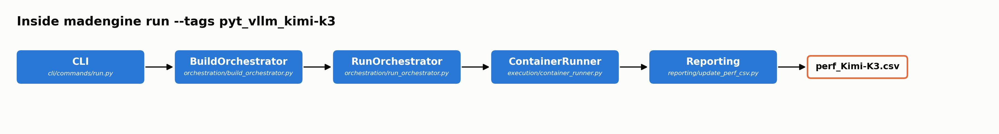
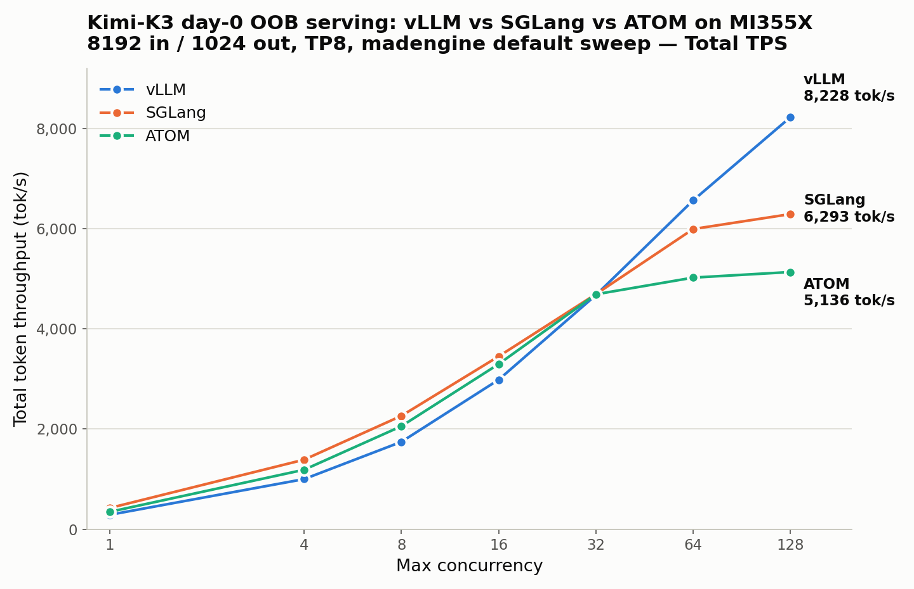

<!---
Copyright (c) 2026 Advanced Micro Devices, Inc. (AMD)

Permission is hereby granted, free of charge, to any person obtaining a copy
of this software and associated documentation files (the "Software"), to deal
in the Software without restriction, including without limitation the rights
to use, copy, modify, merge, publish, distribute, sublicense, and/or sell
copies of the Software, and to permit persons to whom the Software is
furnished to do so, subject to the following conditions:

The above copyright notice and this permission notice shall be included in all
copies or substantial portions of the Software.

THE SOFTWARE IS PROVIDED "AS IS", WITHOUT WARRANTY OF ANY KIND, EXPRESS OR
IMPLIED, INCLUDING BUT NOT LIMITED TO THE WARRANTIES OF MERCHANTABILITY,
FITNESS FOR A PARTICULAR PURPOSE AND NONINFRINGEMENT. IN NO EVENT SHALL THE
AUTHORS OR COPYRIGHT HOLDERS BE LIABLE FOR ANY CLAIM, DAMAGES OR OTHER
LIABILITY, WHETHER IN AN ACTION OF CONTRACT, TORT OR OTHERWISE, ARISING FROM,
OUT OF OR IN CONNECTION WITH THE SOFTWARE OR THE USE OR OTHER DEALINGS IN THE
SOFTWARE.
--->

# Benchmarking Kimi-K3 with vLLM, SGLang, and ATOM on MI350X/MI355X in MAD

When Moonshot AI released the weights for **Kimi-K3** — a 2.8-trillion-parameter,
1M-context, natively-MXFP4 Mixture-of-Experts model — the AMD Instinct™ ecosystem was
ready on day 0 across **three independent serving frameworks**: vLLM, SGLang, and ATOM
on MI350X/MI355X.

Most day-0 announcements stop at "it runs." The harder, quieter problem is the one
this post is about: *how do you benchmark a brand-new 1.56 TB model, on three
different engines, on new-silicon (gfx950) kernels, and trust the numbers you get
back?* Three engines mean three container images, three server launchers, three
benchmark clients, three result formats, and three chances to compare apples to
oranges.

MAD's answer is **madengine** — the automation layer that collapses all of that into
a single, declarative, reproducible command. This post is about the *ecosystem*, not
just the model: how MAD turns day-0 enablement into day-0 **measurable, comparable,
repeatable** enablement.

By the end, you will know how to run the same day-0 Kimi-K3 benchmark on all three
engines with one command each, how to read the normalized CSV they share, how to
retarget the sweep to your own input/output lengths and concurrency, and which
guardrails let you trust the numbers that come back. Follow along on an 8× MI355X
node and reproduce every figure in this post.

---

## Key Takeaways

- **One command per engine.** `madengine run --tags pyt_vllm_kimi-k3` (or `pyt_sglang_kimi-k3`,
  `pyt_atom_kimi-k3`) builds the image, launches the server, drives the benchmark, and
  emits a normalized `perf_Kimi-K3.csv` — no manual container plumbing.
- **One shared sweep, three engines.** All three frameworks run the same workload axes —
  8192 input / 1024 output, concurrency `1·4·8·16·32·64·128·256`, TP8 — so cross-engine
  numbers are comparable by construction, modulo the bench-client defaults called out in
  Table 1.
- **Declarative configs, not shell scripts.** Every server flag, environment variable,
  and sweep axis lives in a versioned YAML. The recipe *is* the config; reproducing a run
  is re-running the file.
- **Your sweep, same harness.** The shared 8k/1k sweep is the comparable default, not a
  cage — copy the config, set your own ISL/OSL and concurrency, and point a run at it
  with `--additional-context`. Same containers, same CSV schema.
- **Hardware-aware guardrails.** `skip_gpu_arch: "gfx942"` keeps today's MI350X/MI355X
  (gfx950) recipe from silently mis-running on MI300X/MI325X, which it hasn't been
  validated for; `arch_overrides` is the same mechanism a future MI300X wideEP recipe
  would use once one is validated.
- **Reliability by design.** Automatic server-health gating, unbuffered logging, model-cache
  reuse, and a fixed CSV schema make a run on your cluster reproduce a run on ours.
- **Real numbers, not a mockup.** An out-of-the-box `madengine run` on 8× MI355X already
  shows all three engines converging mid-sweep and then diverging — see Figure 3.

---

## The Day-0 Benchmarking Problem

Kimi-K3 is not a bigger Kimi-K2. As the vLLM preview notes, it changes the serving
problem along many axes at once — hybrid KDA + full attention, Attention Residuals,
896 routed experts (16 active), MXFP4 weights with the SiTU activation, and native
vision. Each axis lands somewhere different in each engine's stack.

Now multiply that by three frameworks, each with its own conventions:

| Concern | vLLM | SGLang | ATOM |
|---|---|---|---|
| Container image | `vllm/vllm-openai-rocm:kimi-k3` | `lmsysorg/sglang-rocm:...-k3-20260727` | `rocm/atom-dev:...20260727_kimi_k3` |
| Server entrypoint | `vllm serve` | `sglang serve` | `python -m atom.entrypoints.openai_server` |
| MoE selector env | `AITER_SITUV2_A8W4=1` | `AITER_FLYDSL_FORCE=1` + `SGLANG_AITER_K3_OPT=1` | `AITER_FLYDSL_FORCE=1` + `ATOM_USE_TRITON_MOE=0` |
| Attention flag | (engine default) | `--attention-backend triton` | `ATOM_USE_UNIFIED_ATTN=1` |
| Reasoning parser | `--reasoning-parser kimi_k3` | `--reasoning-parser kimi_k3` | (not set) |
| Benchmark client | `vllm bench serve` | `sglang.benchmark.serving` | `atom.benchmarks.benchmark_serving` |
| Result JSON schema | `total_token_throughput`, `median_ttft_ms`… | SGLang JSONL | ATOM `median_*_ms` |

Doing this by hand means three sets of `docker run` incantations, three server
launch sequences, three health-check loops, and three JSON parsers — and then a
fourth, error-prone step of hand-reconciling the outputs into something comparable.
Every one of those steps is a place for a silent divergence: a mismatched input
length, a different concurrency point, a forgotten environment flag that quietly
selects the slow MoE path.

MAD exists to remove all of those steps.

---

## The MAD Automation Flow

MAD is built around a **declarative model registry** (`models.json`) and the
**madengine** runner. A single entry fully describes how to build, run, and score a
workload — and one command executes the whole pipeline.


Figure 1: The madengine execution pipeline. One registry entry drives all five stages;
the only thing that changes between engines is which row of `models.json` you select.

For every model, madengine performs the same five steps — **Build → Start → Resolve →
Execute → Report** — regardless of which engine sits underneath. That uniformity is the
whole point: the *operator experience* is identical across vLLM, SGLang, and ATOM, even
though the internals could not be more different.

### The registry entry is the contract

Here are the fields that make Kimi-K3-on-vLLM a first-class, one-command benchmark
(the real entry also carries bookkeeping fields — `url`, `owner`,
`training_precision`, `timeout` — omitted here for readability):

```json
{
  "name": "pyt_vllm_kimi-k3",
  "dockerfile": "docker/pyt_vllm_kimi_k3",
  "scripts": "scripts/vllm/run.sh",
  "data": "huggingface",
  "n_gpus": "-1",
  "multiple_results": "perf_Kimi-K3.csv",
  "tags": ["pyt", "vllm", "inference"],
  "skip_gpu_arch": "gfx942",
  "args": "--model_repo moonshotai/Kimi-K3 --config configs/default.yaml"
}
```

Three engines, three near-identical entries — differing only in `dockerfile`,
`scripts`, and `config`. The SGLang entry even ships **two variants** (`nospec` and
`dspark` for speculative decoding) from the same script by passing `--variant`, and the
same `perf_Kimi-K3.csv` collects them all.

```json
{ "name": "pyt_sglang_kimi-k3",
  "scripts": "scripts/sglang/run_kimi_k3.sh",
  "args": "--model_repo moonshotai/Kimi-K3 --config configs/kimi_k3.yaml --variant nospec" }

{ "name": "pyt_sglang_kimi-k3_dspark",
  "scripts": "scripts/sglang/run_kimi_k3.sh",
  "args": "--model_repo moonshotai/Kimi-K3 --config configs/kimi_k3.yaml --variant dspark" }
```

### What's actually running under those five stages

Figure 1 is the operator's view. Underneath it, `madengine run --tags pyt_vllm_kimi-k3`
walks through a fixed chain of orchestrator and execution classes — the same chain for
every model in the registry, Kimi-K3 included:



Figure 2: madengine's internal call chain for a Kimi-K3 run — the same five classes
handle every model in the registry.

The CLI's `run()` command hands off to `RunOrchestrator.execute()`, which — for the
"build + run" path this post uses — first calls `BuildOrchestrator.execute()` to turn the
registry's `dockerfile` field into an image via `DockerBuilder.build_image()`. Back in
`RunOrchestrator`, `Context.get_system_gpu_architecture()` shells out to `rocminfo` to read
the host's architecture string — `gfx950` on MI350X/MI355X, `gfx942` on MI300X/MI325X —
and that value is exactly what the `skip_gpu_arch` gate from the previous section is
checked against. `ContainerRunner` then takes over: it asks
`Data` (madengine's data-provider abstraction) to resolve `MAD_DATAHOME` for the
`"data": "huggingface"` entry, launches the container, and executes the registry's
`scripts` field inside it — `scripts/vllm/run.sh` for this model, which in turn drives
`run_vllm.py`. That script writes `perf_Kimi-K3.csv` inside the container (madengine
passes the registry's `multiple_results` value in as `MAD_OUTPUT_CSV`), and on the way
out `update_perf_csv()` folds those rows into the run-level `perf.csv` — the same sink
both `Figure 1`'s REPORT stage and Reliability Engineering's "Deterministic, normalized
output" section describe. No part of this chain is Kimi-K3-specific — it is
the same five classes for every one of the hundreds of models in the registry, which is
why adding Kimi-K3 support only meant writing new `models.json` rows, Dockerfiles, and
run scripts, not touching madengine itself.

---

## The Innovation: The Config *is* the Recipe

The most powerful idea in the MAD flow is that **the benchmark recipe lives in
version-controlled YAML, not in a person's terminal history.** Every server flag,
every environment toggle that selects a kernel path, and every sweep axis is
declarative and auditable.

Here is the Kimi-K3 block of the vLLM config (`scripts/vllm/configs/default.yaml`),
lightly abridged — the comments are condensed and a trailing `bench_args` block that
disables the GSM8K accuracy run is omitted:

```yaml
- benchmark: serving
  model: moonshotai/Kimi-K3
  tp: 8
  inp: 8192
  out: 1024
  dtype: auto
  max_concurrency: 1 4 8 16 32 64 128 256      # the shared K3 sweep
  env:
    VLLM_ROCM_USE_AITER: 1
    SAFETENSORS_FAST_GPU: 1
    AITER_SITUV2_A8W4: 1                        # selects the aiter a8w4 MoE path
    AITER_BF16_FP8_MOE_BOUND: 0
    VLLM_USE_BREAKABLE_CUDAGRAPH: 0
  extra_args:
    --moe-backend: auto
    --load-format: auto
    --gpu-memory-utilization: 0.95
    --mm-encoder-tp-mode: data                  # MoonViT-V2 is 401M; TP is pure overhead
    --max-num-seqs: 256
    --max-num-batched-tokens: 4096
    --reasoning-parser: kimi_k3                  # K3 always thinks
    --language-model-only: true                 # text-only bench frees VRAM for KV
```

Notice that the comments encode *why* each knob is set — `AITER_SITUV2_A8W4: 1`
"selects the AITER a8w4 MoE path"; `--mm-encoder-tp-mode: data` because "MoonViT-V2
is only 401M params; TP on it is pure comm overhead." The recipe is self-documenting,
and re-running it a month later on a different cluster reproduces the same run, because
there is no hidden state.

### One sweep to rule all three

The single most important reliability decision is that **all three engines run the
exact same sweep**: `inp=8192, out=1024, concurrency 1·4·8·16·32·64·128·256, TP8`.

This is not an accident of three teams happening to agree — it is engineered. The
SGLang config file even documents how the sweep shape was *reverse-engineered* from
the framework's public day-0 tracking issue so the numbers stay comparable:

> *"(E2EL − TTFT) / TPOT + 1 lands on ~1024 output tokens for every row, and
> concurrency × (inp + out) / E2EL reproduces the reported total throughput only at
> inp=8192 (e.g. concurrency 8: 8 × 9216 / 31.297 s = 2355.8 vs 2356.21 reported).
> MAD's usual 1024/1024 would produce numbers that cannot be compared against the
> tracking issue."*

That is the discipline that makes a benchmark *trustworthy*: the workload was chosen
so that MAD's output is directly comparable to the framework authors' own published
figures — a built-in cross-check against measurement error.

| Axis | vLLM | SGLang | ATOM |
|---|---|---|---|
| Tensor parallel | 8 | 8 | 8 |
| Input length | 8192 | 8192 | 8192 |
| Output length | 1024 | 1024 | 1024 |
| Concurrency sweep | 1→256 | 1→256 | 1→256 |
| Model dtype | `auto` | `bfloat16` | — |
| KV cache dtype | — | — | `fp8` |
| Prefix caching | off | off (`--disable-radix-cache`) | off (`--no-enable_prefix_caching`) |
| Prompts per point | 10 × concurrency | 10 × concurrency | 10 × concurrency |
| `--random-range-ratio` | not passed (client default) | `1.0` | `0.8` |
| `--ignore-eos` | yes | not passed | yes |

Table 1: The shared K3 sweep. The sweep axes that the config controls — TP, ISL, OSL,
concurrency, prompt count — are identical across engines by construction. Note `dtype`
and KV cache dtype are distinct settings: vLLM and SGLang expose only a general
model/activation `dtype` flag for this recipe, while ATOM's config sets a genuine
`kv_cache_dtype`; neither vLLM nor SGLang override their (bf16) KV cache dtype here.

The last two rows are the honest caveat, and they are worth reading carefully. Each
engine's benchmark client has its own defaults, and the runners do not currently
normalize them. vLLM omits `--random-range-ratio` entirely, whose client default of
`0.0` pins every prompt at exactly 8192 tokens. SGLang passes `1.0`, which under its
own `[input_len × ratio, input_len + 1]` sampling convention is likewise effectively
exact. **ATOM passes `0.8`, so its prompt lengths are sampled over a range rather than
pinned** — ATOM is measuring a nearby but not identical workload. Separately, SGLang
does not pass `--ignore-eos`, so a request that emits an EOS token can finish before
1024 output tokens, where vLLM and ATOM force the full output length.

Neither difference is large enough to reorder Figure 3's high-concurrency ranking, but
both are real, and they are exactly the kind of silent divergence this post argues
automation should eliminate. They are tracked as a follow-up to align the three bench
invocations; until then, treat single-digit-percent gaps between engines as within
measurement noise rather than as engine differences.

The sweep expansion itself is handled generically by the runner — `max_concurrency`
is a space-separated list that the runner takes a Cartesian product over, so adding a
concurrency point is a one-token edit, not a code change:

```python
# scripts/vllm/run_vllm.py
SUPPORTED_LIST_ARGS = ['model', 'tp', 'inp', 'out', 'bs', 'num_prompts', 'max_concurrency']
# each space-separated value is expanded via itertools.product into one run per combination
```

---

## Reliability Engineering: Why the Numbers Are Trustworthy

Automation that produces *wrong* numbers quickly is worse than no automation. MAD's
flow bakes in several guardrails specifically so that a green run means a valid run.

### 1. Server-health gating before measurement

Every serving runner launches the server as a subprocess and **polls it to readiness**
before sending a single benchmark request — so a slow 1.56 TB load never gets
mis-measured as high latency:

```sh
# the server is polled until healthy; only then does the benchmark client start
until curl -s http://localhost:8000/v1/models; do sleep 30; done
```

vLLM's runner allows 30 minutes for that poll. Both SGLang and ATOM raise it to 5400
seconds, appropriate for a multi-terabyte checkpoint — SGLang polls `/health` rather
than `/v1/models`, and ATOM's `_wait_for_server()` also watches the server process
itself, returning as soon as it exits so an OOM during initialization fails fast
instead of looking like a hang until the timeout expires.

### 2. Deterministic, normalized output

Every engine — no matter its native JSON format — is parsed into a **common CSV core**,
so downstream dashboards and regression checks never special-case the engine:

```text
model, benchmark, tp, inp, out, num_prompts,
max_concurrency, cmd, performance, metric, unit
```

Each runner adds a few engine-native columns on top of that shared core — vLLM adds
`dtype` and `bs`; SGLang adds `variant` (for the `nospec`/`dspark` split) and `dtype`;
ATOM adds `kv_cache_dtype`, `hf_pipeline_tag`, and `bs`. Each engine's run produces its
own `perf_Kimi-K3.csv`, and `update_perf_csv` merges each into the run-level `perf.csv`,
carrying over any columns the base file doesn't already have — so no column is silently
dropped even though the three engines don't emit byte-identical headers.

The runner records not just throughput but the full latency distribution — `median_ttft`,
`median_tpot`, `median_itl`, `median_e2el` — plus the exact `cmd` that produced the row,
so any number in the CSV can be traced back to the precise invocation that generated it.

| Metric | Meaning | Unit |
|---|---|---|
| `throughput_tot` | Total token throughput | tok/sec |
| `throughput_gen` | Output (generation) throughput | tok/sec |
| `median_ttft` | Time to first token | ms |
| `median_tpot` | Time per output token | ms |
| `median_itl` | Inter-token latency | ms |
| `median_e2el` | End-to-end latency | ms |

Table 2: The normalized metric schema emitted for every engine and every concurrency
point. Uniform columns make cross-engine and cross-run comparison mechanical.

### 3. Reproducible weights, cached once

The `data: "huggingface"` field wires in weight resolution. By default weights come
from the Hub (with `hf-transfer` for speed and `MAD_SECRETS_HFTOKEN` for gated repos),
but `MAD_DATAHOME` transparently redirects to a pre-downloaded local copy — so the
same 1.56 TB checkpoint is fetched once and reused across every engine and every rerun:

```sh
madengine run --tags pyt_vllm_kimi-k3 --keep-model-dir --live-output \
  --additional-context '{"docker_mounts": {"/model_weights": "/path/to/Kimi-K3"},
                         "docker_env_vars": {"MAD_DATAHOME": "/model_weights"}}'
```

`--keep-model-dir` preserves that cache between runs; `--live-output` streams the
unbuffered logs so a long sweep is observable in real time rather than a black box.

### 4. Hardware-aware gating — a default, not a hard law

Today's registry entries mark Kimi-K3 `skip_gpu_arch: gfx942`, because the day-0
recipes on all three engines assume the model's native MXFP4 weights sit on the
MI350X/MI355X (gfx950) generation and run a dense TP8 layout:

```json
"skip_gpu_arch": "gfx942"
```

madengine reads the host's `MAD_SYSTEM_GPU_ARCHITECTURE` (the ROCm architecture
string `rocminfo` reports — `gfx942` on MI300X/MI325X) and skips the workload rather
than silently producing a result under the wrong assumptions.
That gate is a property of *this recipe*, though, not of the model itself —
MI300X/MI325X lack gfx950's native MXFP4 support, but a config
built around wide expert-parallel (wideEP) sharding and a matched concurrency
profile could still place Kimi-K3's 896 experts across enough MI300X GPUs to serve
it, just with different quantization and a different parallelism shape than the
TP8 recipe this post benchmarks. The same `arch_overrides` block the shipped configs
already use elsewhere — e.g. `scripts/vllm/configs/default.yaml` forcing TP8 on gfx942
where TP4 would OOM for other MoE models — is exactly the hook a future MI300X Kimi-K3
config would use, so `skip_gpu_arch` here should be read as "no validated recipe
yet," not "impossible."

---

## Bring Your Own Sweep: Custom ISL/OSL and Settings

The shared 8192/1024 sweep exists to make the three engines comparable to each other
and to the framework authors' published figures. It is almost certainly not *your*
workload. A summarization service runs long-in/short-out; a code assistant runs the
reverse; an agentic loop runs neither. Because the recipe is just a file, retargeting
the benchmark is a copy and an edit — not a fork of the harness.

### 1. Copy the config, change the shape

In your clone of MAD, copy the shipped K3 block into a new file next to it — the
`configs/` directory alongside the runner is the path the container will look in:

```sh
cp scripts/vllm/configs/default.yaml scripts/vllm/configs/custom.yaml
```

Then trim it to the single block you care about and change the workload axes:

```yaml
# scripts/vllm/configs/custom.yaml — a 2k/2k sweep instead of the shared 8k/1k
- benchmark: serving
  model: moonshotai/Kimi-K3
  tp: 8
  inp: 2048          # your input sequence length
  out: 2048          # your output sequence length
  dtype: auto
  max_concurrency: 1 8 32 64        # your concurrency points
  env:
    VLLM_ROCM_USE_AITER: 1
    SAFETENSORS_FAST_GPU: 1
    AITER_SITUV2_A8W4: 1            # keep this — dropping it silently
    AITER_BF16_FP8_MOE_BOUND: 0     # falls back to the slower a16w4 MoE path
    VLLM_USE_BREAKABLE_CUDAGRAPH: 0
  extra_args:
    --moe-backend: auto
    --gpu-memory-utilization: 0.95
    --max-num-seqs: 256
    --max-num-batched-tokens: 4096
    --reasoning-parser: kimi_k3
    --language-model-only: true
```

The `env` and `extra_args` blocks are the tuned part of the recipe — carry them over
verbatim unless you are deliberately measuring one of those knobs. `AITER_SITUV2_A8W4`
in particular selects the fast MoE kernel path; a "custom config" that quietly omits it
will produce numbers that look like a regression but are really a misconfiguration.

### 2. Point a run at it

`--additional-context` overrides the registry entry for a single invocation:

```sh
madengine run --tags pyt_vllm_kimi-k3 --keep-model-dir --live-output \
  --additional-context '{"model_args": "--model_repo moonshotai/Kimi-K3 --config configs/custom.yaml",
                         "docker_mounts": {"/model_weights": "/shareddata/Kimi-K3"},
                         "docker_env_vars": {"MAD_DATAHOME": "/model_weights"}}'
```

Two things are easy to get wrong here, both worth stating plainly:

- **`model_args` replaces the registry's `args` string — it does not merge with it.**
  Whatever you pass is the *complete* argument list handed to the run script, so
  `--model_repo moonshotai/Kimi-K3` has to be restated alongside your `--config`.
  Passing only `--config configs/custom.yaml` leaves the model repo empty and the run
  script exits on a missing argument.
- **The whole thing is one JSON object.** All three keys — `model_args`, `docker_mounts`,
  `docker_env_vars` — live inside a single pair of braces in a single pair of quotes.

There is also a shorthand. All three run scripts accept `CONFIG` as an environment
variable, so you can select a config without restating the model repo at all:

```sh
madengine run --tags pyt_vllm_kimi-k3 --keep-model-dir --live-output \
  --additional-context '{"docker_env_vars": {"CONFIG": "configs/custom.yaml",
                                             "MAD_DATAHOME": "/model_weights"},
                         "docker_mounts": {"/model_weights": "/shareddata/Kimi-K3"}}'
```

### 3. Where the file has to live

The config path is resolved *inside the container*, relative to the scripts directory
that madengine copies in — so `configs/custom.yaml` means
`scripts/vllm/configs/custom.yaml` in your checkout. A YAML sitting in `/tmp` on the
host will not be found. If you would rather not put the file in the repo, mount it and
pass an absolute container path instead:

```sh
--additional-context '{"docker_mounts": {"/cfg": "/home/me/sweeps"},
                       "docker_env_vars": {"CONFIG": "/cfg/custom.yaml"}}'
```

The same three flags work for the other two engines; the only difference is which
config the entry starts from — `scripts/sglang/configs/kimi_k3.yaml` for SGLang
(which also takes `--variant nospec|dspark`) and `scripts/atom/configs/default.yaml`
for ATOM.

### What you give up

A custom sweep is no longer comparable to Figure 3, Table 4, or the framework tracking
issue — those numbers are only meaningful at 8192/1024. That is a fair trade when the
question is "how does K3 serve *my* traffic on this node," and a trap when the question
is "is this engine faster than that one." Keep the shared sweep for the second question;
the whole point of the fixed schema is that both sets of numbers land in the same
`perf_Kimi-K3.csv` shape, so you can carry both.

| Knob | What it changes | Watch out for |
|---|---|---|
| `inp` / `out` | Input / output sequence length | Long `inp` raises KV pressure; may need lower `max_concurrency` |
| `max_concurrency` | Sweep points (space-separated) | Each value is a full server-side run — cost scales linearly |
| `tp` | Tensor parallel degree | K3 needs ~1680 GB; TP8 is the only fit on one 8-GPU node |
| `extra_args` | vLLM server flags | Passed through verbatim to `vllm serve` |
| `env` | Kernel-path selection | Dropping `AITER_SITUV2_A8W4` costs real throughput |

Table 3: The knobs most worth editing in a custom config.

---

## Putting It Together: Benchmark All Three in Three Commands

The payoff of the whole design is this: reproducing a day-0, three-engine benchmark of
a 2.8T model is three lines.

```sh
# vLLM — 8k/1k serving sweep, concurrency 1→256, TP8
madengine run --tags pyt_vllm_kimi-k3   --keep-model-dir --live-output

# SGLang — same sweep; add the _dspark tag for speculative decoding
madengine run --tags pyt_sglang_kimi-k3 --keep-model-dir --live-output

# ATOM — same sweep, fp8 KV cache
madengine run --tags pyt_atom_kimi-k3   --keep-model-dir --live-output
```

Each produces a `perf_Kimi-K3.csv` sharing the same core columns. Because the sweep
shape is shared, stacking the three CSVs yields a clean cross-engine comparison table —
the concurrency axis lines up row-for-row, and the only variables are the engines
themselves.

Here is exactly that: an out-of-the-box `madengine run` on 8× MI355X, all three
engines, no tuning beyond the shared config in this post.



Figure 3: Total token throughput vs. max concurrency, 8192 in / 1024 out, TP8, all
three engines from the same madengine sweep. SGLang leads at low concurrency,
with ATOM close behind and vLLM trailing both; all three converge around concurrency
32; past that, vLLM pulls ahead and keeps climbing, while SGLang and ATOM both
flatten out — vLLM finishes ~31% above SGLang and ~60% above ATOM at concurrency 128.
Because the sweep axes are shared by construction, spreads of that size reflect real
engine behavior rather than different workloads — subject to the bench-client caveats
in Table 1, which are far too small to account for a 31–60% gap.

| Concurrency | vLLM (tok/s) | SGLang (tok/s) | ATOM (tok/s) |
|---:|---:|---:|---:|
| 1 | 287.28 | 422.75 | 346.12 |
| 4 | 1,000.47 | 1,388.58 | 1,187.52 |
| 8 | 1,744.78 | 2,263.67 | 2,056.96 |
| 16 | 2,985.02 | 3,451.65 | 3,297.54 |
| 32 | 4,675.92 | 4,693.86 | 4,691.54 |
| 64 | 6,567.25 | 5,994.97 | 5,024.71 |
| 128 | 8,228.15 | 6,293.32 | 5,136.26 |

Table 4: Raw total-token-throughput values behind Figure 3, straight out of each
engine's `perf_Kimi-K3.csv`. The shipped configs sweep to concurrency 256, but the runs
reported here were taken through 128 only; the 256 point has not been measured yet on
any of the three engines.

---

## Summary

Kimi-K3 is the occasion, but the ecosystem is the story. The same registry-plus-runner
pattern already spans the AMD MAD catalog — vLLM, SGLang, ATOM, Primus/Megatron
training, JAX MaxText, xDiT diffusion, and disaggregated P/D serving — all driven by
the same `madengine run --tags …` interface and the same declarative-config discipline.

That uniformity is what turns "day-0 support" from a heroic one-off into a *repeatable
capability*:

- **For model launches:** enabling a new model on a new engine is a registry entry, a
  Dockerfile, and a YAML — reviewable in a PR, not lost in a shell session.
- **For CI and regression:** the fixed schema and shared sweeps mean a nightly job can
  diff today's `perf_Kimi-K3.csv` against a reference and flag drift automatically.
- **For the community:** anyone with an 8× MI355X node can reproduce the exact
  benchmark, because the recipe is the config and the config is in the repo.

When Moonshot AI and the framework teams push the agentic-serving envelope further —
longer horizons, deeper tool use, larger context, as the AMD × Moonshot agentic-stack
work describes — MAD is the layer that makes each new frontier *measurable* on AMD
Instinct™ hardware the day it lands.

---

## Get Started

```sh
pip install git+https://github.com/ROCm/madengine.git@main
git clone https://github.com/ROCm/MAD.git && cd MAD

# pick your engine
madengine run --tags pyt_vllm_kimi-k3   --keep-model-dir --live-output
madengine run --tags pyt_sglang_kimi-k3 --keep-model-dir --live-output
madengine run --tags pyt_atom_kimi-k3   --keep-model-dir --live-output
```

- **Blueprint & standalone recipes:** [`benchmark/kimi_k3/README.md`](https://github.com/ROCm/MAD/blob/develop/benchmark/kimi_k3/README.md)
- **madengine:** [github.com/ROCm/madengine](https://github.com/ROCm/madengine)
- **Model:** [moonshotai/Kimi-K3 on HuggingFace](https://huggingface.co/moonshotai/Kimi-K3)

## References

[1] [Kimi-K3](https://huggingface.co/moonshotai/Kimi-K3) — Moonshot AI's 2.8T-parameter Mixture-of-Experts LLM

[2] [MAD](https://github.com/ROCm/MAD) — Model Automation and Dashboarding for AMD Instinct GPUs

[3] [madengine](https://github.com/ROCm/madengine) — The MAD execution engine and CLI

[4] [vLLM](https://github.com/vllm-project/vllm) — High-throughput serving engine for large language models

[5] [SGLang](https://github.com/sgl-project/sglang) — Fast serving framework for large language models

[6] [AITER](https://github.com/ROCm/aiter) — AI Tensor Engine for ROCm

## Disclaimers

Hardware configuration: 8× AMD Instinct™ MI350X/MI355X (gfx950), TP8. Kimi-K3
checkpoint ≈ 1.56 TB.

Third-party content is licensed to you directly by the third party that owns the
content and is not licensed to you by AMD. ALL LINKED THIRD-PARTY CONTENT IS
PROVIDED "AS IS" WITHOUT A WARRANTY OF ANY KIND. USE OF SUCH THIRD-PARTY CONTENT
IS DONE AT YOUR SOLE DISCRETION AND UNDER NO CIRCUMSTANCES WILL AMD BE LIABLE TO
YOU FOR ANY THIRD-PARTY CONTENT. YOU ASSUME ALL RISK AND ARE SOLELY RESPONSIBLE
FOR ANY DAMAGES THAT MAY ARISE FROM YOUR USE OF THIRD-PARTY CONTENT.

Results shown are from specific test configurations and may vary based on workload,
model, and system configuration.

The information presented in this document is for informational purposes only and may contain technical inaccuracies, omissions, and typographical errors. The information contained herein is subject to change and may be rendered inaccurate for many reasons, including but not limited to product and roadmap changes, component and motherboard version changes, new model and/or product releases, product differences between differing manufacturers, software changes, BIOS flashes, firmware upgrades, or the like. Any computer system has risks of security vulnerabilities that cannot be completely prevented or mitigated. AMD assumes no obligation to update or otherwise correct or revise this information.
However, AMD reserves the right to revise this information and to make changes from time to time to the content hereof without obligation of AMD to notify any person of such revisions or changes.
THIS INFORMATION IS PROVIDED 'AS IS." AMD MAKES NO REPRESENTATIONS OR WARRANTIES WITH RESPECT TO THE CONTENTS HEREOF AND ASSUMES NO RESPONSIBILITY FOR ANY INACCURACIES, ERRORS, OR OMISSIONS THAT MAY APPEAR IN THIS INFORMATION. AMD SPECIFICALLY DISCLAIMS ANY IMPLIED WARRANTIES OF NON-INFRINGEMENT, MERCHANTABILITY, OR FITNESS FOR ANY PARTICULAR PURPOSE. IN NO EVENT WILL AMD BE LIABLE TO ANY PERSON FOR ANY RELIANCE, DIRECT, INDIRECT, SPECIAL, OR OTHER CONSEQUENTIAL DAMAGES ARISING FROM THE USE OF ANY INFORMATION CONTAINED HEREIN, EVEN IF AMD IS EXPRESSLY ADVISED OF THE POSSIBILITY OF SUCH DAMAGES.
AMD, the AMD Arrow logo, AMD Instinct, AMD ROCm, CDNA, and combinations thereof are trademarks of Advanced Micro Devices, Inc. Other product names used in this publication are for identification purposes only and may be trademarks of their respective companies. Linux is the registered trademark of Linus Torvalds in the U.S. and other countries. PyTorch, the PyTorch logo and any related marks are trademarks of The Linux Foundation. vLLM is a trademark of vLLM Project. All other trademarks and product names referenced in this publication, including Kimi-K3, Moonshot AI, SGLang, ATOM, and HuggingFace, are the property of their respective owners.
© 2026 Advanced Micro Devices, Inc. All rights reserved
