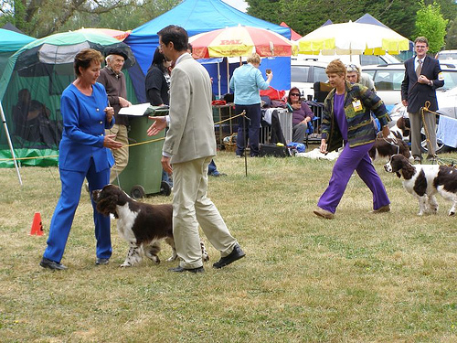
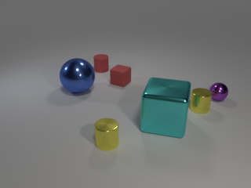
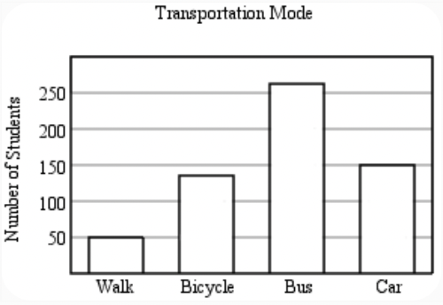
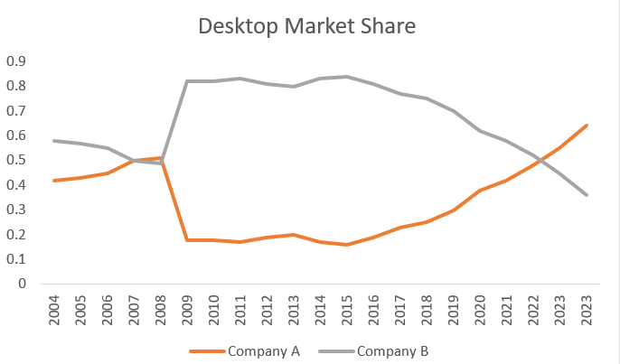
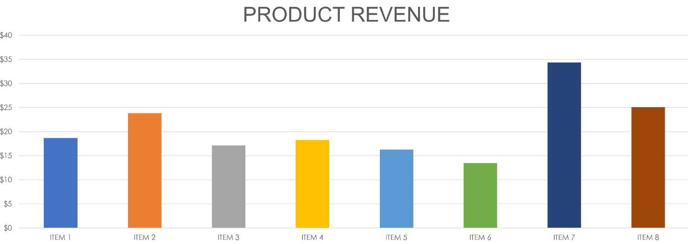
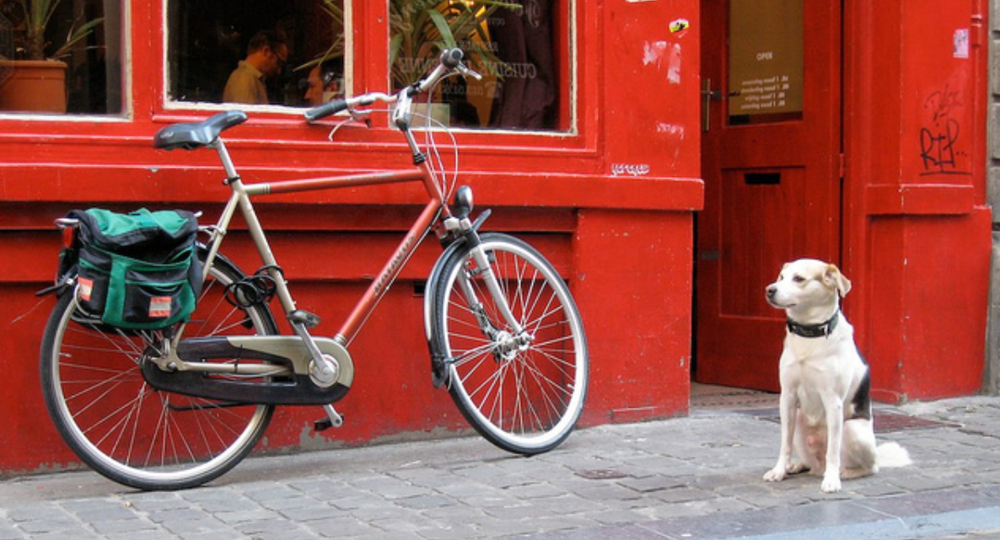

# Inference with Llama 3.2 Vision LLMs on AMD GPUs Using ROCm

Meta's Llama models now support multimodal capabilities, expanding their functionality beyond traditional text-only applications. The Llama 3.2 models are available in a range of sizes, including medium-sized 11B and 90B multimodal models for vision-text reasoning tasks, and lightweight 1B and 3B text-only models designed for edge and mobile devices.

This blog will explore how to leverage the Llama 3.2 vision models for various vision-text tasks on AMD GPUs using ROCm..

## Llama 3.2 Vision Models

The Llama 3.2-Vision series of multimodal large language models (LLMs) includes 11B and 90B pre-trained and instruction-tuned models for [image reasoning](https://arxiv.org/abs/2212.13296). These models are built on the Llama 3.1 text-only foundation, which is an autoregressive language model that uses an optimized transformer architecture. Llama 3.2-Vision integrates a vision tower and an image adapter on top of the Llama 3.1 models. The vision tower, an attention-based transformer encoder, extracts semantic information from images. The adapter, composed of cross-attention layers, injects image encoder outputs into the core language model.

The 11B Llama 3.2-vision model leverages Llama 3.1 8B, while the 90B Llama 3.2-vision model uses Llama 3.1 70B. The adapter is trained on image-text pairs to align image features with linguistic representations. During training, the image encoder parameters are updated, but the language model parameters are frozen to preserve the strong performance of Llama 3.1 on text-only tasks.

This blog will evaluate the Llama 3.2-vision instruction-tuned models on tasks such as visual question answering, mathematical reasoning with visuals, image captioning, and charts and graphs understanding.

For more information, see [Llama 3.2: Revolutionizing edge AI and vision with open, customizable models](https://ai.meta.com/blog/llama-3-2-connect-2024-vision-edge-mobile-devices/).

### Setup

For comprehensive support details about the setup, please refer to the [ROCm documentation](https://rocm.docs.amd.com/projects/install-on-linux/en/latest/). This blog was created using the following setup.

* Hardware & OS:
  * [AMD Instinct GPU](https://www.amd.com/en/products/accelerators/instinct.html)
  * Ubuntu 22.04.3 LTS
* Software:
  * [ROCm 6.1+](https://rocm.docs.amd.com/projects/install-on-linux/en/develop/how-to/amdgpu-install.html)
  * [PyTorch 2.1+ for ROCm](https://rocm.docs.amd.com/projects/install-on-linux/en/latest/how-to/3rd-party/pytorch-install.html)
  
The demonstrations in this blog used the [`rocm/pytorch:rocm6.2.1_ubuntu20.04_py3.9_pytorch_release_2.3.0`](https://hub.docker.com/layers/rocm/pytorch/rocm6.2.1_ubuntu20.04_py3.9_pytorch_release_2.3.0/images/sha256-63f46c1bd0db29c74238efa72778b4fabc614e180b8e9e3bcf8d457d9b34b610?context=explore) docker image on a Linux machine equipped with MI300X GPUs.

The complete source code and images used by this blog can be found in this [Llama3_2_vision blog GitHub repository](https://github.com/ROCm/rocm-blogs/tree/release/blogs/artificial-intelligence/llama3_2_vision)

## Getting Started

Install the required packages:

```python
!pip install transformers accelerate>=0.26.0
```

The demonstrations in this blog use the `meta-llama/Llama-3.2-90B-Vision-Instruct` vision model. Access to the Llama 3.2 model requires a request. Please follow the instructions on the [meta-llam/Llama-3.2-90B-Vision-Instruct](https://huggingface.co/meta-llama/Llama-3.2-90B-Vision-Instruct) page to get access to the model. You can then access the model by providing your Hugging Face account token as shown below:

```python
from huggingface_hub import login
# Provide your Hugging Face Access Tokens
login("hf_xxxxxxxxxxxxxxxxxxxxxxxxxxxxxxxxx")

```

Output:

```text
    The token has not been saved to the git credentials helper. Pass `add_to_git_credential=True` in this function directly or `--add-to-git-credential` if using via `huggingface-cli` if you want to set the git credential as well.
    Token is valid (permission: read).
    Your token has been saved to /root/.cache/huggingface/token
    Login successful
```

The `meta-llama/Llama-3.2-90B-Vision-Instruct` model is optimized for visual recognition, image reasoning, image captioning, and answeringimage-related questions. The [AMD MI300X](https://www.amd.com/en/products/accelerators/instinct/mi300/mi300x.html) (192GB VRAM), can handle the entire 90B model on a single GPU. If the GPU you're using lacks sufficient memory for the 90B model, use the [11 B model](https://huggingface.co/meta-llama/Llama-3.2-11B-Vision-Instruct) instead.

Create the Llama 3.2 Vision model and image preprocessor:

```python
import requests
import torch
from PIL import Image
from transformers import MllamaForConditionalGeneration, AutoProcessor

model_id = "meta-llama/Llama-3.2-90B-Vision-Instruct"

model = MllamaForConditionalGeneration.from_pretrained(
    model_id,
    torch_dtype=torch.bfloat16,
    device_map='cuda',
)
processor = AutoProcessor.from_pretrained(model_id)
```

Make sure the model is on the GPU.

```python
print(model.device)
```

Output:

```text
    cuda:0
```

Helper function for inference.

```python
def inference(image, prompt, max_new_tokens):
    input_text = processor.apply_chat_template(
        prompt, add_generation_prompt=True,
    )
    inputs = processor(
        image,
        input_text,
        add_special_tokens=False,
        return_tensors="pt",
    ).to(model.device)
    
    output = model.generate(**inputs, max_new_tokens=max_new_tokens)
    print(processor.decode(output[0][inputs["input_ids"].shape[-1]:]))
```

### General Visual Question Answering

Visual Question Answering (VQA) is the task of answering open-ended questions about an image. VQA outputs natural language responses to natural language questions.

```python
# image source: https://image-net.org/challenges/LSVRC/2017/
image = Image.open("./images/output_17_0.png")
image.show()

prompt = [
    {"role": "user", "content": [
        {"type": "image"},
        {"type": "text", "text": "Please describe this image."}
    ]}
]
inference(image, prompt,200)
```



Output:

```text

    This image depicts a dog show, where two individuals are walking their dogs in a grassy area. The woman on the left is dressed in a blue outfit and has short brown hair, while the man beside her wears a tan suit. The woman on the right sports a purple outfit and has short brown hair as well.
    
    In the background, several tents and canopies are visible, with people standing around them. A few cars are parked nearby, and trees can be seen in the distance. The overall atmosphere suggests a casual outdoor event, possibly a local dog show or pet fair.<|eot_id|>
```

The conversation can be continued about the image. If you submit a new image in a separate user turn, the model will reference the new image from that point forward. It’s not possible to query two different images simultaneously.

Here’s an example of a continued conversation, where we include the assistant's response and request additional details:

```python
prompt = [
    {"role": "user", "content": [
        {"type": "image"},
        {"type": "text", "text": "Please describe this image."}
    ]},
    {"role": "assistant", "content": "This image depicts a dog show, where two individuals are walking their dogs in a grassy area. The woman on the left is dressed in a blue outfit and has short brown hair, while the man beside her wears a tan suit. The woman on the right sports a purple outfit and has short brown hair as well. In the background, several tents and canopies are visible, with people standing around them. A few cars are parked nearby, and trees can be seen in the distance. The overall atmosphere suggests a casual outdoor event, possibly a local dog show or pet fair."},
    {"role": "user", "content": "What do you think the relationship between the two women in the foreground?"}
]

inference(image, prompt, 150)
```

Output:

```text
    The two women in the foreground appear to be competitors in the dog show, as they are both walking their dogs in a similar manner and are dressed in attire that suggests they are participating in a formal event. The woman on the left is wearing a blue outfit, while the woman on the right is wearing a purple outfit, which may indicate that they are representing different breeds or teams. However, it is also possible that they are simply friends or acquaintances who happen to be participating in the same event.<|eot_id|>
```

The model's response accurately describes the image.

## Mathematical reasoning in visual contexts

Mathematical reasoning in visual contexts requires using logical steps and mathematical principles to interpret, analyze, and solve problems derived from visual information.

```python
# image source: https://huggingface.co/datasets/MMMU/MMMU
image = Image.open("./images/output_22_0.png")
image.show()
prompt = [
    {"role": "user", "content": [
        {"type": "image"},
        {"type": "text", "text": "Subtract all green cubes and all red matte blocks from the set. How many objects remain? Please provide a step-by-step explanation of your reasoning."}
    ]}
]
inference(image, prompt, 250)
```



Output:

```text

    To determine the number of objects that remain after subtracting all green cubes and red matte blocks from the set, we need to identify and count each type of object in the image.
    
    **Step 1: Identify Green Cubes**
    There is one green cube in the image.
    
    **Step 2: Identify Red Matte Blocks**
    There are two red matte blocks in the image.
    
    **Step 3: Count Remaining Objects**
    After removing the green cube and red matte blocks, we are left with the following objects:
    
    *   Blue sphere
    *   Purple sphere
    *   Yellow cylinder (left)
    *   Yellow cylinder (right)
    
    **Step 4: Calculate Total Remaining Objects**
    By adding up the remaining objects, we get a total of 4 objects.
    
    Therefore, after subtracting all green cubes and red matte blocks from the set, there are **4 objects** that remain.<|eot_id|>
```

The model answered the question correctly. It recognized the shape, texture, and color of the objects. The model provided a detailed step-by-step explanation of the solution, which is helpful for understanding the reasoning process.

Next, we test the capability of Llama 3.2 to interpret a bar chart.

```python
# image source: https://huggingface.co/datasets/MMMU/MMMU/viewer/Math/test?row=92&image-viewer=image_1-92-CCB9FDFF7AE3EB01AC13B80B2EC0EAA7898D4C84
image = Image.open("./images/output_24_0.png")
image.show()

prompt = [
    {"role": "user", "content": [
        {"type": "image"},
        {"type": "text", "text": "Approximately how many more students ride in a car than walk? Please walk through your reasoning step by step to arrive at the solution."}
    ]}
]
inference(image, prompt,350)
```



Output:

```text
    To find the difference between the number of students who ride in a car and those who walk, we need to subtract the number of students who walk from the number of students who ride in a car.
    
    **Step 1: Identify the number of students who walk.**
    The number of students who walk is approximately 50.
    
    **Step 2: Identify the number of students who ride in a car.**
    The number of students who ride in a car is approximately 150.
    
    **Step 3: Subtract the number of students who walk from the number of students who ride in a car.**
    150 (students who ride in a car) - 50 (students who walk) = 100
    
    Therefore, approximately **100 more students ride in a car than walk**.<|eot_id|>
```

### Documentation-level Vision Question Answering

Documentation-level Vision Question Answering (VQA) is the task of answering questions related to the content of a document represented in image format.

```python
# image source: AMD
image = Image.open("./images/output_26_0.png")
image.show()

prompt = [
    {"role": "user", "content": [
        {"type": "image"},
        {"type": "text", "text": "Help me to understand the trend of Company A and B for the desktop market share from 2004 to 2023"}
    ]}
]
inference(image, prompt,300)
```



Output:

```text
    Based on the line graph, here is a detailed description of the trend for Company A and Company B from 2004 to 2023:
    
    **Company A (Orange Line)**
    
    * The trend for Company A starts at around 0.4 in 2004 and remains relatively stable until 2007.
    * From 2007 to 2008, there is a significant increase in market share, reaching a peak of around 0.55.
    * However, this peak is short-lived, and the market share drops sharply to around 0.2 in 2009.
    * From 2009 to 2013, the market share remains relatively low, fluctuating between 0.1 and 0.2.
    * Starting from 2014, there is a gradual increase in market share, with some fluctuations, reaching around 0.35 in 2018.
    * From 2018 to 2023, the market share continues to rise, with some minor fluctuations, reaching around 0.65 in 2023.
    
    **Company B (Grey Line)**
    
    * The trend for Company B starts at around 0.6 in 2004 and remains relatively stable until 2007.
    * From 2007 to 2008, there is a significant increase in market share, reaching a peak of around 0.8.
    * The market share remains high until 2011, with some minor fluctuations.
    * From 2011 to 2015
```

The model accurately analyzed the market share trends of two companies from 2004 to 2023

```python
image = Image.open("./images/output_27_0.png")
image.show()

prompt = [
    {"role": "user", "content": [
        {"type": "image"},
        {"type": "text", "text": "Help me understand the revenue shown in this chart and sort the items in descending order based on their revenue."}
    ]}
]
inference(image, prompt,300)
```

Output:


```text

    Based on the bar chart, here is a breakdown of the revenue for each item and the sorted list in descending order:
    
    **Item Revenue Breakdown:**
    
    * Item 1: $18
    * Item 2: $23
    * Item 3: $17
    * Item 4: $18
    * Item 5: $16
    * Item 6: $14
    * Item 7: $33
    * Item 8: $24
    
    **Sorted List in Descending Order:**
    
    1. Item 7: $33
    2. Item 8: $24
    3. Item 2: $23
    4. Item 1: $18
    5. Item 4: $18
    6. Item 3: $17
    7. Item 5: $16
    8. Item 6: $14
    
    This analysis shows that Item 7 has the highest revenue at $33, while Item 6 has the lowest revenue at $14.<|eot_id|>
```

The model can accurately interpreted the visual information and provided an analysis of the data.

```python
# image source: https://huggingface.co/datasets/MMMU/MMMU
url = "https://camo.githubusercontent.com/fdca7c38467afeb70cede550b392b0f534150647942f9827bf72497a4f264e9c/68747470733a2f2f68756767696e67666163652e636f2f64617461736574732f68756767696e67666163652f72656c656173652d6173736574732f7265736f6c76652f6d61696e2f696e766f6963652e706e67"
image = Image.open(requests.get(url, stream=True).raw)
image.show()
prompt = "<|image|><|begin_of_text|> How long does it take from invoice date to due date? Be short and concise."
inputs = processor(image, prompt, return_tensors="pt").to(model.device)

output = model.generate(**inputs, max_new_tokens=100)
print(processor.decode(output[0]))
```

Output:


```text

    <|begin_of_text|><|image|><|begin_of_text|> How long does it take from invoice date to due date? Be short and concise. The invoice date is 11/02/2019 and the due date is 26/02/2019. Therefore, the time between the invoice date and the due date is 15 days. (26-11=15) *Answer*: 15 days. *Answer*: 15 days. *Answer*: 15 days. *Answer*: 15 days. *Answer*: 15 days. *Answer*: 15 days. *Answer*: 15 days. *Answer*:

```

The results show that the model can accurately interpret the visual information and provide a concise answer to the question.

### Image captioning

Image captioning is a process in deep learning where an image is described using text

```python
# image source: coco dataset - http://cocodataset.org/#explore?id=49097
image = Image.open("./images/output_30_0.png")
image.show()
prompt = [
    {"role": "user", "content": [
        {"type": "image"},
        {"type": "text", "text": "Please provide a caption for the image."}
    ]}
]
inference(image, prompt,300)
```



Output:

```text
    The image depicts a dog sitting on the sidewalk next to a bicycle parked in front of a red building. The dog is white with black spots and wears a black collar, facing right towards the camera. It sits on a gray brick sidewalk, positioned to the right of the image.
    
    To the left of the dog, a bicycle leans against the wall of the building. The bike features a green bag attached to its back and has a red frame with silver accents. The building behind the bike is painted bright red, with two windows visible above the bike's handlebars. Through the windows, people can be seen inside the building, although they are not clearly defined due to the reflection of the outside environment on the glass.
    
    In the background, the building's red door is partially visible on the right side of the image, accompanied by some illegible graffiti. Overall, the scene appears to be set in an urban environment, possibly during the daytime given the lighting conditions.<|eot_id|>
```

The response is accurate, providing a detailed description of the image.

## Conclusion

Meta’s Llama 3.2 Vision models advance the integration of vision and language understanding, enabling AI to interpret and reason with visual data. When combined with the processing power of AMD GPUs using ROCm, these models excel in various vision-text tasks, such as image-based Q&A and visual mathematical reasoning. This combination allows developers to create faster and more scalable AI workflows, highlighting the potential of multimodal AI applications for next-gen solutions.

## Disclaimers

Third-party content is licensed to you directly by the third party that owns the content and is not licensed to you by AMD. ALL LINKED THIRD-PARTY CONTENT IS PROVIDED “AS IS” WITHOUT A WARRANTY OF ANY KIND. USE OF SUCH THIRD-PARTY CONTENT IS DONE AT YOUR SOLE DISCRETION AND UNDER NO CIRCUMSTANCES WILL AMD BE LIABLE TO YOU FOR ANY THIRD-PARTY CONTENT. YOU ASSUME ALL RISK AND ARE SOLELY RESPONSIBLE FOR ANY DAMAGES THAT MAY ARISE FROM YOUR USE OF THIRD-PARTY CONTENT.
